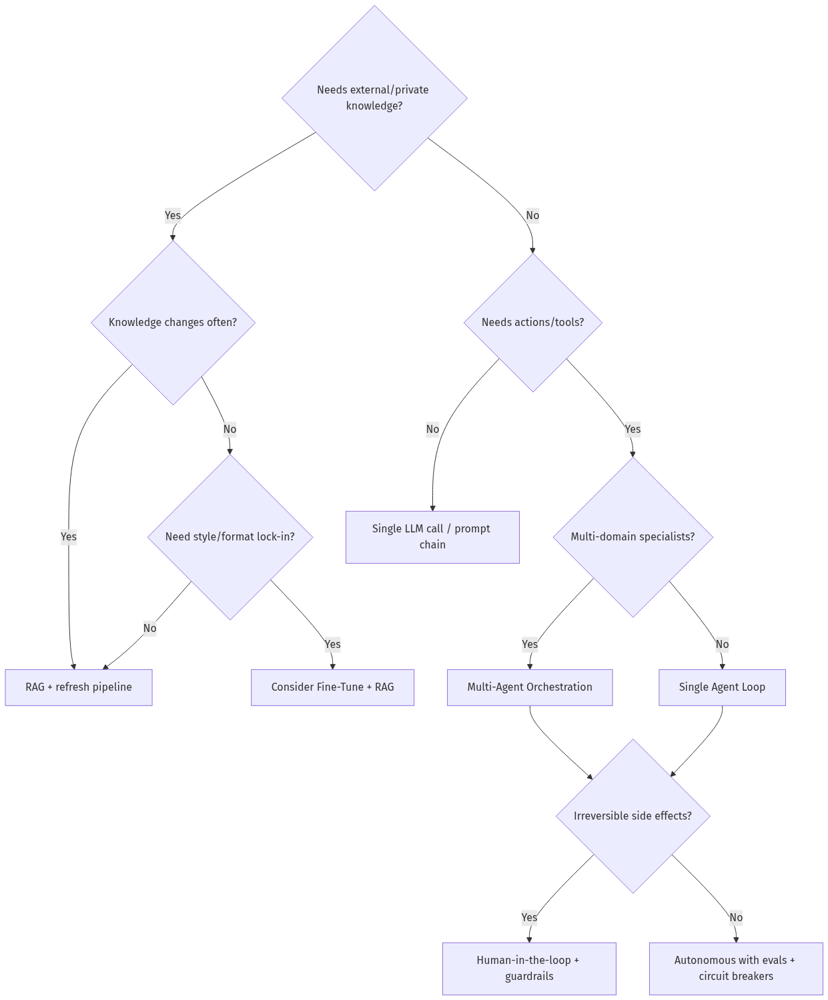
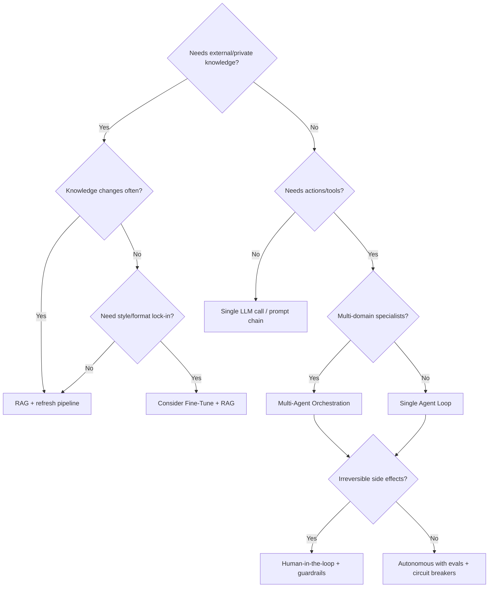

# Architecture Index

> Catalog of architectures, patterns, and diagrams across the handbook. Use this when preparing system design interviews.

**Related:** [TOC](TABLE_OF_CONTENTS.md) · [System Design/](System Design/) · [Modules/](Modules/)

---

## Pattern Catalog

| Pattern | Primary chapter | Use when | Avoid when |
|---------|-----------------|----------|------------|
| Single-shot LLM call | 02-01 | Classification, rewrite, extract | Needs tools / multi-step truth |
| Router | 03-03 | Intent → specialist path | Too many overlapping intents without taxonomy |
| ReAct / Tool loop | 03-01 | Dynamic tool choice | Deterministic workflow exists |
| Reflection / Critic | 03-03, 05-02 | Quality-sensitive outputs | Tight latency SLO |
| Plan-and-Execute | 03-03, 12-01 | Long research / multi-step | Simple FAQ |
| RAG (naive) | 04-01 | Static knowledge grounding | Knowledge changes every second without refresh |
| Hybrid + Rerank | 04-03 | Precision-critical enterprise search | Tiny corpus (<50 docs) maybe overkill |
| HyDE | 04-04 | Short / vague queries | Already highly specific queries |
| GraphRAG | 04-04 | Multi-hop entity questions | Flat FAQ docs |
| Supervisor multi-agent | 05-01 | Clear specialist roles | Single domain task |
| Planner–Executor–Critic | 05-02 | Complex deliverables | Cost-sensitive chat |
| MCP tool servers | 07-01 | Shared tool ecosystem | One-off script |
| A2A negotiation | 07-02 | Cross-agent consensus | Single owner workflow |
| Human-in-the-loop | 03-04, 08-03 | Irreversible / high-risk actions | Fully reversible low-risk UX |
| LLM-as-judge | 08-01 | Subjective quality | Need deterministic compliance only |
| LoRA domain adapt | 09-01 | Stable style/format/domain language | Facts change often (use RAG) |

---

## Reference Architectures (System Design)

| Product class | Doc | Core idea |
|---------------|-----|-----------|
| Consumer chat | [ChatGPT](System Design/Design-ChatGPT.md) | Gateway + model mesh + memory + safety |
| Constitutional assistant | [Claude](System Design/Design-Claude.md) | Alignment + tool use + long context |
| IDE agent | [Cursor](System Design/Design-Cursor.md) | Repo index + edit apply + agent loop |
| Code completion | [Copilot](System Design/Design-GitHub-Copilot.md) | Low-latency FIM + context assembly |
| Answer engine | [Perplexity](System Design/Design-Perplexity.md) | Retrieve → cite → synthesize |
| Work chat AI | [Slack AI](System Design/Design-Slack-AI.md) | Enterprise ACL + thread summarization |
| Workspace AI | [Notion AI](System Design/Design-Notion-AI.md) | Doc-scoped RAG + writing actions |
| Search | [AI Search](System Design/Design-AI-Search-Engine.md) | Hybrid retrieval + ranking |
| Coding assistant | [AI Coding](System Design/Design-AI-Coding-Assistant.md) | Context + tools + verify |
| Research agent | [AI Research](System Design/Design-AI-Research-Agent.md) | Plan → browse → cite → report |
| Support platform | [AI Support](System Design/Design-AI-Customer-Support.md) | Triage + RAG + HITL |
| Voice assistant | [AI Voice](System Design/Design-AI-Voice-Assistant.md) | ASR/TTS or S2S + barge-in |
| Workflow engine | [MA Engine](System Design/Design-Multi-Agent-Workflow-Engine.md) | Orchestration + state + evals |

---

## Diagram Types Used in Handbook

| Diagram | Purpose |
|---------|---------|
| Architecture | Component boxes and trust boundaries |
| Sequence | Request lifecycle / tool calls |
| State | Agent graph states |
| Flowchart | Decision trees (prompt vs RAG vs FT) |
| ER | Metadata / memory schemas |
| Deployment | Containers, GPUs, queues |
| Network | MCP / A2A protocol paths |

---

## Decision Tree — Which Architecture?

---

## Next Step

When studying any module, add a one-line entry to your personal architecture notebook: **Pattern → When → When not → Failure mode**.
