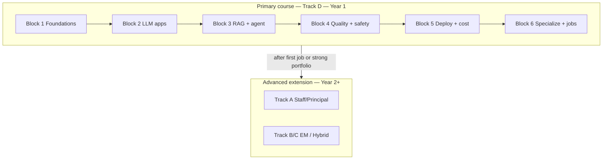

# GenAI Course — Designed for Beginners → India AI Jobs

> **This is the default course.**  
> Built for someone with **basic programming**, **no prior AI knowledge**, targeting **India GenAI / data-center-era jobs** over the next ~10 years.
>
> Previous Staff / Principal / EM material is kept as an **Advanced extension** (Track A–C), not the year-1 path.

**Your home pages:** [Dashboard](Dashboard.md) · [Study Plan](Study%20Plan.md) · [Detailed Track D plan](Career/India-AI-Career-Learning-Plan.md) · [Advanced Staff+ roadmap](Master%20Study%20Roadmap.md)

---

## Who this course is for

| You have | You want |
|----------|----------|
| Basic programming (any language) | Stay relevant as India adopts AI + builds data centers |
| Little or no AI / ML background | A clear path from zero → hireable GenAI builder |
| ~10–12 hours/week | Portfolio demos, not certificate collecting |
| Patience for a **12-month** climb | Year-1 role: GenAI / LLM Application Engineer |

**Not year-1:** Principal interviews, EM leadership loops, training foundation models.

---

## How the old setup connects

| Layer | What it is | When you use it |
|-------|------------|-----------------|
| **Primary course (this file + Track D)** | Beginner → job path | **Now** |
| **Module handbook (`Modules/`)** | Deep chapters (many still Staff-written) | Follow **Track D scope** on each chapter — lab + concepts; skim the rest |
| **Advanced extension** ([Master Study Roadmap](Master%20Study%20Roadmap.md), Tracks A–C) | Staff / Principal / EM depth | **Year 2+** after you ship and get hired |

---

## Course map (12 months)

| Block | Months | Theme | You ship | Core modules |
|------:|--------|-------|----------|--------------|
| **1** | 1–2 | GenAI ideas + Python + APIs | Hello-LLM + FastAPI warmup | 00-01 → 00-02 → 00-03 → 00-04 → 00-05 |
| **2** | 3–4 | LLM apps + prompting + tools | Document helper (JSON extract) | 01-02, 01-05, 02-01, 02-02; intuition 01-01; skim 01-04 |
| **3** | 5–6 | RAG + bounded agent | Policy FAQ bot + support agent | 04-01, 04-02, skim 04-03, 03-01, 03-02, light 03-04 |
| **4** | 7–8 | Evals + guardrails | Golden set + safety basics | 08-01, skim 08-02, 08-03, skim 11-01; optional 00-06 |
| **5** | 9–10 | Deploy + cost + inference awareness | Dockerized API + ₹/query note | 10-01, Docker in 10-02, 10-04, skim 01-03 + Ollama |
| **6** | 11–12 | Specialize + hire | Flagship demo + applications | One path: deeper RAG **or** agents **or** infra |

Full week rhythm and India job notes: **[Career/India-AI-Career-Learning-Plan.md](Career/India-AI-Career-Learning-Plan.md)**.  
Week-by-week execution: **[Study Plan](Study%20Plan.md)**.

---

## Module status in this course

### Core (year 1 — do these)

| Code | Depth | Notes |
|------|-------|-------|
| 00-01 | **Full** | Start here — GenAI from scratch |
| 00-02, 00-03 | **Full** | Go slow if Python is basic |
| 00-04 | **Skim** | “When not to agent” |
| 00-05 | **Light** | Cosine + embeddings intuition only (bridge toward RAG) |
| 00-06 | **Optional** | BFSI / IT-services interview boost |

> Foundation IDs **are** the study order (no more “read 00-05 before 00-02”).
| 01-01 | **Intuition** | Karpathy talk OK; no paper mastery |
| 01-02, 01-05 | **Full** | Tokens, cost, Gemini/DeepSeek priority |
| 01-03, 01-04 | **Skim** | Local Ollama + routing awareness |
| 02-01, 02-02 | **Full** | Prompts + structured tools |
| 03-01, 03-02 | **Full** | One bounded agent |
| 03-04 | **Light** | One simple LangGraph |
| 04-01, 04-02 | **Full** | RAG FAQ with citations |
| 04-03 | **Skim** | Hybrid search awareness |
| 08-01, 08-03 | **Full** | Evals + ship criteria |
| 08-02, 11-01 | **Skim** | Logs + OWASP awareness |
| 09-02 | **Light** | Prompt vs RAG vs FT *decision* only |
| 10-01, 10-04 | **Full** | FastAPI habits + cost |
| 10-02 | **Docker only** | K8s conceptual later |

### Advanced optional (year 2+ / Track A)

Multi-agent (05-*), MCP/A2A (07-*), voice/multimodal (06-*), LoRA training (09-01/09-03), Redis/Kafka/Ray (10-03), prompt-injection depth (11-02), advanced topics (12-*), full System Design pack, Leadership/EM.

---

## India relevance (built into the course)

| India trend | What you practice in this course |
|-------------|----------------------------------|
| Enterprise AI in IT services & captives | RAG over policies/PDFs + citations |
| Cost-sensitive adoption | DeepSeek / Gemini / local Ollama comparisons |
| Data-center / GPU growth | Docker deploy + inference awareness (not ML research) |
| BFSI / ops automation | Optional BankCo; HITL agents |
| Bilingual products | One EN + Hindi query demo |

**Year-1 target titles:** GenAI Engineer · LLM Application Engineer · RAG / AI Solutions Engineer  

**Year 3–5:** Platform / agents / cost+GPU fluency → then Advanced roadmap.

---

## How to study each module

1. Read the **Track D scope** box at the top (if present).  
2. Do: Learning Objectives → Core Concepts → Lab/Implementation.  
3. Skip for now: long Principal interview sections, multi-framework bake-offs.  
4. End with **one GitHub commit**.  
5. Stuck >45 min on theory → mock/lab first, theory later.

---

## Projects ladder (must ship)

| # | When | Project |
|---|------|---------|
| 1 | Block 1 | Hello-LLM CLI (+ mock without key) |
| 2 | Block 1 | FastAPI JSON warmup |
| 3 | Block 2 | Document helper (structured extract) |
| 4 | Block 3 | BharatCorp-style policy FAQ (RAG + citations) |
| 5 | Block 3 | Support agent (2–3 tools, step budget) |
| 6 | Block 4–5 | Same apps + eval CSV + Docker + cost note |
| 7 | Block 6 | One flagship specialization demo |

---

## Tracks (after you understand this course)

| Track | Audience |
|-------|----------|
| **D — Primary (you)** | Basic programming, no AI → India GenAI jobs |
| A | Staff / Principal IC |
| B | Engineering Manager |
| C | Tech lead → EM |

---

## Next step

1. Open [Dashboard](Dashboard.md) and mark **Track D**.  
2. Start **[00-01 GenAI From Scratch](Modules/00-Foundations/00-01-GenAI-From-Scratch.md)**.  
3. Follow weeks in [Study Plan](Study%20Plan.md) (Block 1).
