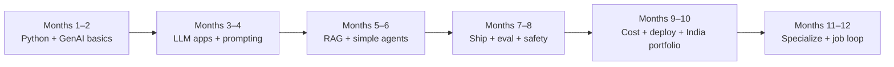

# India AI Career Learning Plan — From Basic Programming, Zero AI

> **Persona this plan is for:** Adult learner in India with **basic programming** and **little or no AI background**, aiming to stay employable for the next ~10 years as India expands data centers and enterprise AI adoption.
>
> **Handbook track name:** **Track D** (primary course).  
> **Course design hub:** **[COURSE.md](../COURSE.md)** · **Week-by-week:** [Study Plan](../Study%20Plan.md)
>
> **Related:** [00-01 GenAI From Scratch](../Modules/00-Foundations/00-01-AI-Engineering-Mindset.md) · [Dashboard](../Dashboard.md) · [Learning Path](../Learning%20Path.md) · Advanced: [Master Study Roadmap](../Master%20Study%20Roadmap.md)

---

## Straight answer: is the full handbook “for absolute beginners”?

| Part | Fit for you today |
|------|-------------------|
| **00-01 GenAI From Scratch** | Yes — start here |
| **Python / APIs foundations** | Yes, but go **slowly** if Python is still basic |
| **00-02, 00-03, Phases 1–11** | Written at **working engineer / interview** depth — usable if you follow Track D (skim theory, always ship a small project) |
| **Staff / Principal / EM tracks (A–C)** | **Not your year-1 goal** — revisit in year 2–3 |

So: the handbook *contains* a beginner on-ramp, but it was originally a Staff+ masterclass. **Track D is the filter** that turns it into a realistic path for you.

---

## Your 10-year relevance bet (India)

India’s AI wave is not only “build ChatGPT.” Hiring and budget will cluster around:

| Wave | What companies need | Roles that stay paid |
|------|---------------------|----------------------|
| **Apps on LLMs** | Chatbots, copilots, document Q&A, support automation | GenAI / LLM Application Engineer |
| **Grounded enterprise AI** | RAG over policies, tickets, PDFs; citations; Hindi/English UX | AI Engineer (RAG), Solutions Engineer |
| **Agents that call tools** | CRM, ticketing, internal APIs — with human approval | AI Agent Engineer |
| **Cost + reliability** | Cheap models, caching, evals, guardrails | AI Platform / LLMOps-leaning engineer |
| **Infra next to data centers** | GPU inference, serving, monitoring (as India adds capacity) | Inference / MLOps / Cloud AI engineer |

**Year-1 target role (realistic):**  
*GenAI Application Engineer / LLM Engineer (L2–L3)* — ship RAG + tools APIs for Indian IT services, product startups, or captives.

**Year 3–5 stretch:** AI Platform / Agent systems / cost+GPU fluency.  
**Year 5–10:** Architecture ownership or tech lead — *then* Staff-style modules and system design pay off.

Avoid betting your first year only on “prompt engineer” or only on research papers. **Shipping grounded apps + cost awareness** ages better.

---

## Assumptions for this plan

| Parameter | Value |
|-----------|--------|
| Prior AI | None required |
| Prior programming | Basic (any language) — you will standardize on **Python** |
| Hours / week | **10–12** (protect job/family; consistency > hero weeks) |
| Timeline | **~12 months** to first credible portfolio + applications |
| Budget | Prefer **free/cheap APIs** (DeepSeek, Gemini free tier, local Ollama when possible) |
| Language | Study in English; build **one bilingual (EN + Hindi) demo** for India product sense |
| Skip for year 1 | Full EM leadership track, 6–8 system design writeups, heavy LoRA training ops |

---

## How to use the handbook on Track D

1. Open module → read **Learning Objectives + Core Concepts + Implementation/Lab only**.
2. Skip or skim: long interview batteries, Principal whiteboards, multi-framework comparisons.
3. Every module ends with **one small GitHub commit** (even a script).
4. If stuck >45 minutes on theory → do the lab with a mock/fake first, return to theory later.

---

## 12-month roadmap (Track D)

### Months 1–2 — Become dangerous with Python + one LLM call

| Week focus | Handbook | You must produce |
|------------|----------|------------------|
| GenAI vocabulary | **[00-01](../Modules/00-Foundations/00-01-AI-Engineering-Mindset.md)** | Hello-LLM CLI (or mock) + notes in your words |
| Python daily | [00-05](../Modules/00-Foundations/00-05-Python-for-AI-Engineering.md) (go slow; use Real Python) | Scripts with functions, types, `venv`, `requirements.txt` |
| HTTP + FastAPI | [00-06](../Modules/00-Foundations/00-06-APIs-for-AI-Engineering.md) | One POST endpoint that returns JSON |
| Light math | [00-04](../Modules/00-Foundations/00-04-Mathematics-for-AI-Engineering.md) — **cosine + embeddings intuition only** | Tiny notebook: similarity between 5 sentences |
| Rules vs AI | Skim [00-02](../Modules/00-Foundations/00-02-From-Rules-to-Agents.md) “when not to agent” | Half-page memo: 3 tasks → rules / LLM / later-agent |

**Exit:** You can explain token/prompt/hallucination and call an API without copy-pasting blindly.

### Months 3–4 — LLM application builder

| Focus | Handbook | Produce |
|-------|----------|---------|
| How models roughly work | [01-01](../Modules/01-LLM-Engineering/01-01-Transformer-Architecture.md) **intuition only** (Karpathy talk OK) | 10-bullet personal notes — no paper mastery yet |
| Tokens & cost | [01-02](../Modules/01-LLM-Engineering/01-02-Tokenization-Context-Windows.md) | Cost estimator CLI |
| Providers (India-cost aware) | [01-05](../Modules/01-LLM-Engineering/01-05-Provider-SDKs-OpenAI-Claude-Gemini.md) — prioritize **Gemini + DeepSeek + one major** | Same prompt on 2 providers; cost/quality table |
| Routing lite | Skim [01-04](../Modules/01-LLM-Engineering/01-04-Model-Routing-LiteLLM.md) | Optional LiteLLM hello |
| Prompting + tools | [02-01](../Modules/02-Prompt-Engineering/02-01-Production-Prompt-Engineering.md), [02-02](../Modules/02-Prompt-Engineering/02-02-Structured-Outputs-Tool-Calling.md) | App: extract JSON from invoice/email text |

**Exit:** A small FastAPI “document helper” with structured JSON output.

### Months 5–6 — RAG + one bounded agent (India’s bread-and-butter)

| Focus | Handbook | Produce |
|-------|----------|---------|
| RAG architecture | [04-01](../Modules/04-RAG/04-01-RAG-Architecture.md) → [04-02](../Modules/04-RAG/04-02-Chunking-Metadata-Embeddings.md) → skim [04-03](../Modules/04-RAG/04-03-Vector-DB-Hybrid-Search-Reranking.md) | **Internal FAQ bot** over a PDF/folder (company policy sample) with citations |
| Agent loop | [03-01](../Modules/03-Agentic-Fundamentals/03-01-Agent-Anatomy-and-Loop.md), [03-02](../Modules/03-Agentic-Fundamentals/03-02-Tools-Memory-Control-Flow.md) | Support-style agent: 2–3 tools max, step budget |
| LangGraph | [03-04](../Modules/03-Agentic-Fundamentals/03-04-LangGraph-Production-Agents.md) — **one tutorial-depth graph** | Same agent with checkpoint or HITL flag |
| Skip for now | Full multi-agent travel planner, A2A negotiation | — |

**India twist:** Use a **policy / HR / banking FAQ** dataset and support **English + Hindi queries** (even if answers are English first).

**Exit:** Two GitHub repos: RAG FAQ + tool-using support agent.

### Months 7–8 — Make it believable for employers

| Focus | Handbook | Produce |
|-------|----------|---------|
| Evals | [08-01](../Modules/08-Evaluation-LLMOps/08-01-Evaluation-Lifecycle.md) (golden set of 30+ Qs) | CSV of questions + pass/fail script |
| Observability | Skim [08-02](../Modules/08-Evaluation-LLMOps/08-02-Observability-LangSmith-OTel.md) | Log prompt, model, tokens, latency per request |
| Guardrails | [08-03](../Modules/08-Evaluation-LLMOps/08-03-Guardrails-Ship-Criteria.md) + [11-01](../Modules/11-Security-Safety/11-01-OWASP-LLM-Top-10.md) skim | Block PII patterns; refuse medical/legal overclaim |
| Optional BankCo | [00-03](../Modules/00-Foundations/00-03-BankCo-Decision-Support-Warmup.md) | Great for BFSI interviews — do if targeting banks/IT services |

**Exit:** README with “how I measure quality” — this separates you from course-certificate noise.

### Months 9–10 — Deploy, cost, data-center-aware skills

India’s data-center growth rewards people who understand **running models cheaply**, not only calling APIs.

| Focus | Handbook | Produce |
|-------|----------|---------|
| FastAPI production habits | [10-01](../Modules/10-Production-Infrastructure/10-01-FastAPI-AI-Backends.md) | Dockerize your RAG API |
| Docker (+ K8s concepts) | [10-02](../Modules/10-Production-Infrastructure/10-02-Docker-Kubernetes-CICD.md) — **Docker mandatory, K8s conceptual** | `Dockerfile` + deploy to a free/cheap cloud |
| Cost / latency | [10-04](../Modules/10-Production-Infrastructure/10-04-Cost-Latency-Optimization.md) | Dashboard or sheet: ₹ / 1K queries estimate |
| Inference awareness | Skim [01-03](../Modules/01-LLM-Engineering/01-03-Inference-Serving-vLLM.md) + try **Ollama** locally | Note: API model vs local model tradeoffs |
| Skip heavy | Ray/Kafka deep ops unless targeting infra jobs | — |

**Exit:** Live or recorded demo link + cost note in README.

### Months 11–12 — Specialize + get hired

Pick **one** specialization (don’t do all):

| Path | Extra modules | Portfolio flagship |
|------|---------------|--------------------|
| **A. Enterprise RAG** (most India IT hiring) | [04-03](../Modules/04-RAG/04-03-Vector-DB-Hybrid-Search-Reranking.md), skim [04-04](../Modules/04-RAG/04-04-Advanced-RAG-HyDE-GraphRAG.md) | “BharatCorp Policy Assistant” with citations + evals |
| **B. Agents for ops** | [03-03](../Modules/03-Agentic-Fundamentals/03-03-Agentic-Design-Patterns.md), skim [05-01](../Modules/05-Multi-Agent/05-01-Multi-Agent-Orchestration.md) | Ticket triage agent with HITL |
| **C. Infra / inference** (data-center adjacent) | [01-03](../Modules/01-LLM-Engineering/01-03-Inference-Serving-vLLM.md), [10-02](../Modules/10-Production-Infrastructure/10-02-Docker-Kubernetes-CICD.md), [10-04](../Modules/10-Production-Infrastructure/10-04-Cost-Latency-Optimization.md) | vLLM/Ollama serving notes + load test |

**Job loop (parallel, last 8 weeks):**

- 3 portfolio READMEs with problem → architecture → cost → demo
- Resume: 5 bullets with numbers (latency, token cost, eval score)
- Apply: IT services GenAI teams, product startups, captives, cloud partners
- Practice: explain RAG and “when not to use an agent” in plain English (and Hindi if helpful)

---

## What to skip in year 1 (save for year 2+)

| Skip / deep-skim | Why |
|------------------|-----|
| Full Phase 4 multi-agent + A2A | Hire for single-agent + RAG first |
| Heavy LoRA/QLoRA training ([09-01](../Modules/09-Fine-Tuning/09-01-PEFT-LoRA-QLoRA.md)) | Read [09-02](../Modules/09-Fine-Tuning/09-02-Prompting-vs-RAG-vs-FineTuning.md) decision only |
| Phase 11 EM leadership | Not your interview loop yet |
| 6–8 System Design writeups | Do **2**: ChatGPT-style + RAG support |
| Research paper marathon | Karpathy + provider docs beat arXiv early |

---

## Weekly rhythm (10–12 hours)

| Day | Hours | Activity |
|-----|------:|----------|
| Mon | 1.5 | Concept (one section) |
| Tue | 1.5 | Docs / short video |
| Wed | 2 | Coding lab |
| Thu | 2 | Project slice |
| Sat | 3 | Build + GitHub |
| Sun | 1–2 | Notes + 5 interview Qs aloud |

Friday off or light revision. Miss a weekday → protect Saturday build time.

---

## Success metrics (honest)

**At month 6**

- [ ] Explain GenAI vs ML vs LLM to a non-engineer
- [ ] Ship RAG FAQ with citations
- [ ] Ship one tool-using agent with a step limit

**At month 12**

- [ ] 2–3 public repos with Docker + README cost/eval notes
- [ ] Comfortable with Python + FastAPI + one vector DB
- [ ] Can discuss India-relevant cost (DeepSeek/Gemini/local) and data/privacy basics
- [ ] Applying to GenAI engineer roles with a live demo

**Not required at month 12:** Principal architecture reviews, multi-agent platforms, training foundation models.

---

## Mindset for age 35 + career switch energy

- You are not late — India hiring needs **builders who communicate**, not only 22-year-old contest winners.
- Depth in **RAG + APIs + cost + trust** beats collecting 20 certificates.
- Treat every module as: *Can I demo this to a manager in Pune/Bengaluru/Hyderabad in 10 minutes?*
- Protect health and consistency; 10 focused hours/week for a year beats 30-hour burnout months.

---

## Next action (today)

1. Mark track **D** on [Dashboard](../Dashboard.md).  
2. Open **[00-01 GenAI From Scratch](../Modules/00-Foundations/00-01-AI-Engineering-Mindset.md)** and finish Labs A–C.  
3. Create a GitHub repo `genai-learning` and commit the Hello-LLM script.
