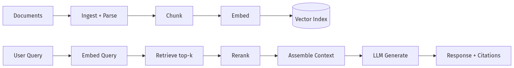
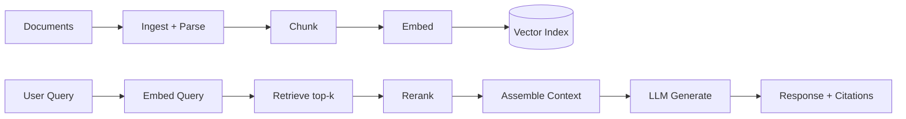

# Cheatsheet: RAG · Chunking · VectorDB · Hybrid · Rerank

> Dense reference for Module 04. Production RAG decisions.

**Related:** [04-01 RAG Architecture](../Modules/04-RAG/04-01-RAG-Architecture.md) · [04-02 Chunking](../Modules/04-RAG/04-02-Chunking-Metadata-Embeddings.md) · [04-03 Vector DB](../Modules/04-RAG/04-03-Vector-DB-Hybrid-Search-Reranking.md) · [04-04 Advanced RAG](../Modules/04-RAG/04-04-Advanced-RAG-HyDE-GraphRAG.md) · [Cheatsheet Index](Cheatsheet-Index.md)

---

## RAG Pipeline (Canonical)





### RAG variants

| Variant | Description | WHEN |
|---------|-------------|------|
| **Naive RAG** | Embed + retrieve + generate | MVP, clean corpus |
| **Advanced RAG** | + rerank, hybrid, query transform | Production quality |
| **Agentic RAG** | Agent decides retrieve/refine | Complex multi-hop |
| **GraphRAG** | Knowledge graph + community summaries | Entity-heavy domains |

Paper: [RAG (Lewis et al.)](../Papers/Paper-Database.md#retrieval-augmented-generation-rag)

---

## WHEN / WHEN NOT — RAG

| USE RAG when | DON'T USE RAG when |
|--------------|-------------------|
| Knowledge changes frequently | Task is pure reasoning/format |
| Corpus too large for context | Few-shot in prompt suffices |
| Need citations / audit trail | Real-time data via tools is better |
| Domain docs (PDF, wiki, tickets) | Sensitive data can't leave boundary w/o infra |
| Reduce hallucination on facts | Style/tone only (→ prompt or FT) |

---

## Chunking

### Strategies

| Strategy | Size | WHEN | WHEN NOT |
|----------|------|------|----------|
| **Fixed-size** | 256–1024 tokens | General docs | Structured tables |
| **Recursive** | Split by `\n\n`, headers | Markdown, HTML | Flat text |
| **Semantic** | Embedding similarity breaks | Coherent passages | Cost-sensitive ingest |
| **Document-based** | 1 doc = 1 chunk (small) | Short FAQs | Long PDFs |
| **Parent-child** | Small retrieve, large context | Precision + context | Simple MVP |

### Overlap

| Overlap | Rule |
|---------|------|
| **0** | Fast; may split sentences |
| **10–20%** | Common default (e.g., 64 on 512) |
| **High overlap** | Redundant storage; better boundary recall |

### Chunk size tradeoffs

| Smaller chunks | Larger chunks |
|----------------|---------------|
| Better precision | Better context |
| More index entries | May dilute relevance |
| Good for FAQ | Good for narrative |

**Interview answer:** "I'd eval 256/512/1024 on golden set; pick Pareto optimal."

### Metadata to attach

| Field | Use |
|-------|-----|
| `source`, `page`, `section` | Citations |
| `doc_id`, `version`, `updated_at` | Freshness, ACL |
| `tenant_id` | Multi-tenant isolation |
| `chunk_index` | Ordering, parent-child |

Module: [04-02](../Modules/04-RAG/04-02-Chunking-Metadata-Embeddings.md)

---

## Vector Databases

### Selection matrix

| DB | Type | WHEN | WHEN NOT |
|----|------|------|----------|
| **pgvector** | Postgres extension | Already on PG; <10M vectors | Extreme ANN scale |
| **Pinecone** | Managed SaaS | Fast start, managed ops | Strict on-prem |
| **Weaviate** | OSS + cloud | Hybrid search built-in | Minimal ops team |
| **Qdrant** | OSS + cloud | Filtering + performance | — |
| **Milvus** | OSS scale | Billion-scale | Ops complexity |
| **Chroma** | Dev/lightweight | Prototyping | Large production |
| **OpenSearch k-NN** | AWS ecosystem | Existing OpenSearch | Greenfield |

### Index types (ANN)

| Index | Tradeoff |
|-------|----------|
| **HNSW** | Fast query; memory heavy |
| **IVF** | Lower memory; tuning needed |
| **Flat (exact)** | Small datasets; ground truth eval |

### Vector DB operations checklist

- [ ] Metadata filtering on every query (ACL)
- [ ] Embedding version tracked
- [ ] Re-index plan when embedding model changes
- [ ] Backup + point-in-time recovery

---

## Hybrid Search

### Why hybrid

| Method | Strength | Weakness |
|--------|----------|----------|
| **Dense (vector)** | Semantic similarity | Misses exact IDs/SKUs |
| **Sparse (BM25/TF-IDF)** | Keyword, rare terms | Misses paraphrase |

**Hybrid = combine both** → better recall → rerank narrows.

### Fusion methods

| Method | Formula intuition |
|--------|-------------------|
| **RRF** (Reciprocal Rank Fusion) | Score by rank position, not raw score |
| **Weighted linear** | α×dense + (1-α)×sparse |
| **Cross-encoder rerank** | Separate stage (see below) |

### WHEN / WHEN NOT — Hybrid

| USE hybrid when | Skip hybrid when |
|-----------------|------------------|
| SKU, error codes, legal citations | Pure semantic FAQ |
| User queries mix jargon + natural language | Tiny corpus (<1K docs) |
| Recall problems on eval set | Latency budget <100ms total |

Module: [04-03](../Modules/04-RAG/04-03-Vector-DB-Hybrid-Search-Reranking.md)

---

## Reranking

### Two-stage retrieval

```
Stage 1: Fast retrieval (top 50–100) — bi-encoder / hybrid
Stage 2: Rerank (top 5–10) — cross-encoder or LLM
```

| Model type | Speed | Quality |
|------------|-------|---------|
| **Bi-encoder** | Fast | Good for stage 1 |
| **Cross-encoder** | Slow | Better pairwise relevance |
| **LLM rerank** (Cohere, etc.) | API cost | Strong; production common |

### Reranker options

| Provider | Notes |
|----------|-------|
| **Cohere Rerank** | Production standard |
| **bge-reranker** | Self-hosted OSS |
| **ColBERT** | Late interaction; middle ground |

### WHEN / WHEN NOT — Reranking

| USE rerank when | SKIP rerank when |
|-----------------|------------------|
| Stage 1 recall high but precision low | Corpus <500 chunks |
| Legal/support need top-3 accuracy | Sub-200ms p95 SLA |
| Hybrid still misses on eval | Cost per query prohibitive |

---

## Query Transformation

| Technique | What | Latency cost |
|-----------|------|--------------|
| **HyDE** | LLM generates hypothetical doc; embed that | +1 LLM call |
| **Multi-query** | Generate query variants; merge results | +1 LLM call |
| **Step-back** | Abstract question first | +1 LLM call |
| **Decomposition** | Split complex query | +N LLM calls |

Module: [04-04 Advanced RAG](../Modules/04-RAG/04-04-Advanced-RAG-HyDE-GraphRAG.md)

---

## Generation & Grounding

### Context assembly

```
[System: answer from context only; cite sources; abstain if insufficient]
[Context: chunk1 (source A) | chunk2 (source B) | ...]
[User query]
```

### Hallucination controls

| Control | Layer |
|---------|-------|
| **Abstention prompt** | Generation |
| **Citation requirement** | Generation |
| **Claim verification** | Post-gen (NLI, second LLM) |
| **Confidence threshold** | Retrieval (min similarity) |

### Evaluation metrics

| Metric | Measures |
|--------|----------|
| **Context precision** | Retrieved chunks relevant? |
| **Context recall** | Needed info retrieved? |
| **Answer faithfulness** | Answer supported by context? |
| **Answer relevance** | Answers the question? |

Tools: DeepEval, Promptfoo — [Cheatsheet #4](SDK-Infra-LLMOps-Eval-FineTuning.md)

---

## Production Checklist

- [ ] Ingestion auth + poison scanning
- [ ] PII scrub pre-index
- [ ] ACL metadata filter every query
- [ ] Chunk + embed versioning
- [ ] Hybrid + rerank on eval improvement
- [ ] Golden set ≥50 cases with citations
- [ ] Abstention behavior defined
- [ ] Freshness SLA (TTL / re-ingest)
- [ ] Cost: embed batch vs realtime tracked

---

## Interview Rapid Fire

| Question | Answer skeleton |
|----------|-----------------|
| RAG vs long context? | RAG: fresh, citeable, cheaper at scale; long ctx: simpler, cost/lost-in-middle |
| Chunk size? | Eval-driven; start 512 overlap 64 |
| Why rerank? | Bi-encoder fast but imprecise; cross-encoder fixes top-k |
| Hybrid search? | BM25 catches exact; vector catches semantic; RRF fuse |
| Retrieval empty? | Abstain; broaden query; fallback to web/tool |

**Next:** [LangChain-LangGraph-MCP-A2A.md](LangChain-LangGraph-MCP-A2A.md)
