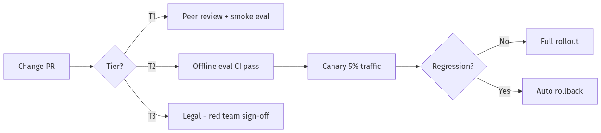
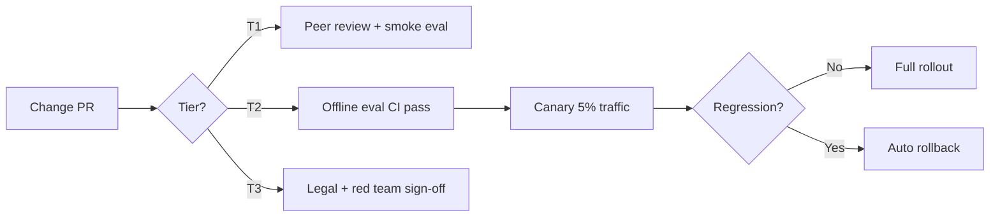

# AI Governance, Strategy & Metrics

> Enterprise-ready handbook for AI risk tiers, model/prompt change control, ROI frameworks, and engineering metrics that survive board reviews and audits.

**Related:** [Leading AI Teams](Leading-AI-Teams.md) · [Hiring AI Engineers](Hiring-AI-Engineers.md) · [08-03 Guardrails](../Modules/08-Evaluation-LLMOps/08-03-Guardrails-Ship-Criteria.md) · [11-01 OWASP LLM Top 10](../Modules/11-Security-Safety/11-01-OWASP-LLM-Top-10.md) · [11-02 Prompt Injection Defense](../Modules/11-Security-Safety/11-02-Prompt-Injection-Defense.md)

---

## Table of Contents

1. [Governance Philosophy](#1-governance-philosophy)
2. [Risk Tier Framework](#2-risk-tier-framework)
3. [Model & Prompt Change Control](#3-model--prompt-change-control)
4. [Data Governance for AI](#4-data-governance-for-ai)
5. [ROI Frameworks](#5-roi-frameworks)
6. [Engineering Metrics for AI Products](#6-engineering-metrics-for-ai-products)
7. [Strategy: Build vs Buy vs Partner](#7-strategy-build-vs-buy-vs-partner)
8. [Audit & Compliance Checklist](#8-audit--compliance-checklist)

---

## 1. Governance Philosophy

### Governance enables speed—not bureaucracy

Bad governance: every prompt change needs Legal review for 2 weeks.

Good governance: risk-tiered controls where Tier 1 ships in hours and Tier 3 requires human-in-the-loop by design.

**Principle:** Match control intensity to **downside severity × reversibility × user exposure**.

### Three governance pillars

| Pillar | Question | Owner |
|--------|----------|-------|
| **Safety** | Can this harm users, data, or brand? | Security + Legal + Eng |
| **Quality** | Does it meet eval thresholds? | Eng + PM + Domain |
| **Economics** | Is unit economics sustainable? | Eng + Finance + PM |

---

## 2. Risk Tier Framework

### Four-tier model (adapt to your industry)

| Tier | Definition | Examples | Controls |
|------|------------|----------|----------|
| **T0 — Internal dev** | Non-customer, synthetic data | Dev sandboxes, internal demos | Basic logging |
| **T1 — Low stakes** | Customer-facing, easily reversible, no PII/s advice | Summarization, formatting, internal search | Offline eval + peer review |
| **T2 — Medium stakes** | Customer-facing, affects decisions, may include PII | Support suggestions, product Q&A, RAG over docs | Golden set CI + online monitoring + rollback |
| **T3 — High stakes** | Regulated advice, financial/medical/legal, autonomous actions | Loan recommendations, clinical summaries, auto-refunds | Human approval, audit trail, Legal sign-off, red team |

### Tier assignment worksheet

Answer YES to any → escalate tier:

| Question | Escalates to |
|----------|--------------|
| Could wrong output cause financial loss >$X? | T3 |
| Does output constitute regulated advice? | T3 |
| Does system act autonomously (no human in loop)? | T2 minimum |
| Is PII in context or output? | T2 minimum |
| Can user inject instructions via content? | T2 minimum (injection risk) |

Reference: [11-01 OWASP LLM Top 10](../Modules/11-Security-Safety/11-01-OWASP-LLM-Top-10.md)

### Control matrix by tier

| Control | T0 | T1 | T2 | T3 |
|---------|----|----|----|----|
| Prompt PR review | Optional | Required | Required + Staff sign-off | Required + Legal |
| Offline eval CI | No | ≥20 cases | ≥50 cases + regression block | ≥200 + adversarial |
| Online eval sampling | No | 5% | 10% + LLM-judge | 100% human sample |
| Rollback SLA | Best effort | 24 hr | 4 hr | 1 hr |
| Data retention policy | Internal | Documented | Documented + DLP | Legal-approved |
| Red team cadence | Never | Annual | Quarterly | Pre-launch + quarterly |

---

## 3. Model & Prompt Change Control

### What counts as a "change"

| Change type | Examples | Risk |
|-------------|----------|------|
| **Model swap** | GPT-4o → Claude 3.5 | High—behavior shift |
| **Prompt template** | System prompt rewrite | Medium–High |
| **Tool schema** | New API tool, param change | Medium |
| **Retrieval config** | Chunk size, top-k, reranker | Medium |
| **Embedding model** | text-embedding-3 → Cohere | High—index rebuild |
| **Temperature / params** | 0 → 0.7 | Medium |

### Change control workflow





### Prompt registry requirements

Store in Git (or dedicated registry) with:

| Field | Purpose |
|-------|---------|
| `prompt_id` | Stable identifier |
| `version` | Semver |
| `tier` | T1/T2/T3 |
| `owner` | Team + on-call |
| `eval_suite_id` | Linked golden set |
| `changelog` | What changed and why |
| `rollback_to` | Previous version hash |

Cross-reference: [02-01 Production Prompt Engineering](../Modules/02-Prompt-Engineering/02-01-Production-Prompt-Engineering.md)

### Model change checklist

- [ ] Run full offline eval suite on new model
- [ ] Compare cost per task (not just per token)
- [ ] Compare latency p50/p95
- [ ] Check safety refusals on adversarial set
- [ ] Verify structured output / tool-calling compatibility
- [ ] Document rollback procedure (previous model ID in LiteLLM config)
- [ ] 24–48 hr enhanced monitoring post-canary

Reference: [01-04 Model Routing](../Modules/01-LLM-Engineering/01-04-Model-Routing-LiteLLM.md)

---

## 4. Data Governance for AI

### Data classification for LLM systems

| Class | LLM use policy | Example |
|-------|----------------|---------|
| **Public** | Any provider OK | Marketing docs |
| **Internal** | Approved providers + no training | Confluence, wikis |
| **Confidential** | VPC / enterprise contract, no retention | Customer data |
| **Restricted** | On-prem or air-gapped only | PHI, PCI, trade secrets |

### RAG-specific controls

| Risk | Mitigation |
|------|------------|
| **Over-retrieval** (wrong tenant data) | Metadata filters, ACL on every query |
| **Poisoning** (malicious docs in corpus) | Ingestion auth, content scanning |
| **PII in embeddings** | PII scrubbing pre-index; DLP on ingest |
| **Stale knowledge** | TTL, version tags, freshness metadata |

Reference: [04-02 Chunking, Metadata & Embeddings](../Modules/04-RAG/04-02-Chunking-Metadata-Embeddings.md)

---

## 5. ROI Frameworks

### Unit economics template

```
Revenue per successful task = (Value delivered) × (Attribution %)
Cost per successful task = (LLM cost + infra + human review) / (Success rate)

ROI = (Revenue - Cost) × Volume
Payback period = Build cost / Monthly net ROI
```

### Example: Customer support AI

| Variable | Value |
|----------|-------|
| Tickets/month | 100,000 |
| AI deflection rate | 35% |
| Cost per human ticket | $8 |
| Cost per AI ticket (LLM + infra) | $0.40 |
| Human review rate (T2) | 10% of AI @ $2 |
| **Monthly savings** | 35K × ($8 - $0.40 - $0.20) ≈ **$266K** |
| **Monthly LLM spend** | ~$15K |
| **Net** | ~$251K/month |

### ROI narrative for executives (template)

1. **Problem cost:** $X/year in [manual work / churn / support]
2. **AI intervention:** [Agent/RAG] achieves Y% success at $Z/task
3. **Investment:** N engineers × M months + $infra
4. **Payback:** Q months
5. **Risk-adjusted:** Include 20% haircut on success rate for year 1

### When NOT to pursue ROI yet

| Signal | Action |
|--------|--------|
| No baseline metric | Measure manual process first |
| Success undefined | Build eval before ROI spreadsheet |
| <$10K/mo addressable | Use off-the-shelf; don't build platform |

---

## 6. Engineering Metrics for AI Products

### Metric hierarchy

```
L1: Business (revenue, retention, NPS)
L2: Product (resolution rate, task completion, CSAT)
L3: AI quality (eval pass, citation precision, abstention)
L4: System (latency, cost, error rate, guardrail triggers)
L5: Process (deploy freq, eval coverage, MTTR)
```

**Rule:** Every L2 metric decomposes to at least one L3 metric you can move with engineering.

### AI quality metrics (definitions)

| Metric | Formula | Good direction |
|--------|---------|----------------|
| **Answer accuracy** | Correct / total in golden set | ↑ |
| **Citation precision** | Supported claims / total claims | ↑ |
| **Abstention precision** | Correct abstentions / total abstentions | ↑ |
| **Hallucination rate** | Unsupported claims / total answers | ↓ |
| **Tool success rate** | Successful tool calls / total | ↑ |
| **Eval regression** | Current score - baseline | ≤0 |

Reference: [08-01 Evaluation Lifecycle](../Modules/08-Evaluation-LLMOps/08-01-Evaluation-Lifecycle.md)

### Dashboard spec (minimum viable)

| Panel | Refresh | Audience |
|-------|---------|----------|
| Offline eval trend | Per deploy | Eng |
| Online thumbs-down | Hourly | Eng + PM |
| Cost per task | Daily | Eng + Finance |
| Latency p95 | Real-time | Eng + SRE |
| Guardrail blocks | Real-time | Security |
| Tier 3 human review queue | Real-time | Ops |

### OKR examples for AI teams

**Objective:** Make support AI reliably deflect Tier-1 tickets

| Key Result | Target |
|------------|--------|
| KR1: Offline eval pass rate | ≥88% |
| KR2: Deflection rate (no escalation) | ≥35% |
| KR3: Cost per deflected ticket | <$0.50 |
| KR4: CSAT on AI-handled tickets | ≥4.2/5 |

---

## 7. Strategy: Build vs Buy vs Partner

### Decision matrix

| Factor | Build | Buy (SaaS) | Partner (API) |
|--------|-------|------------|---------------|
| **Differentiation** | Core to product | Commodity feature | Speed to market |
| **Data sensitivity** | Full control needed | Vendor SOC2 OK | Enterprise contract |
| **Customization** | Heavy domain logic | Standard workflow | Prompt/RAG layer only |
| **Team capacity** | Staff+ AI eng available | Eng capacity limited | MVP phase |
| **Time to value** | 3–6 months | 2–6 weeks | 1–4 weeks |

### Common build decisions in 2026

| Capability | Recommendation | Rationale |
|------------|----------------|-----------|
| **Vector DB** | Buy (Pinecone, pgvector) | Commodity; build only at scale |
| **Eval framework** | Build thin layer on DeepEval/Promptfoo | Domain evals are moat |
| **Agent orchestration** | Build on LangGraph | Product-specific flows |
| **Foundation model** | Partner (OpenAI/Anthropic/Google) | Don't train from scratch |
| **Fine-tuning** | Build pipeline when eval proves need | See [09-02](../Modules/09-Fine-Tuning/09-02-Prompting-vs-RAG-vs-FineTuning.md) |
| **MCP servers** | Build for internal tools | Standardize integrations |

---

## 8. Audit & Compliance Checklist

### Pre-launch governance review (T2+)

- [ ] Risk tier assigned and documented
- [ ] Data classification confirmed for all inputs/outputs
- [ ] Provider DPAs / BAAs in place if needed
- [ ] Prompt registry entry with version
- [ ] Offline eval results attached to release ticket
- [ ] Rollback procedure tested
- [ ] Incident runbook includes AI-specific steps
- [ ] User disclosure (AI-generated content) if required
- [ ] Logging retention meets policy
- [ ] OWASP LLM Top 10 review completed

### Quarterly governance audit

- [ ] All production prompts in registry (no shadow prompts)
- [ ] Eval coverage grew with feature growth
- [ ] Red team findings remediated or accepted with sign-off
- [ ] Cost per task within budget
- [ ] Model provider contracts reviewed
- [ ] Tier 3 human review logs sampled

---

## Interview-Ready Answers

### "How do you govern AI without slowing innovation?"

1. Risk tiers—match control to severity
2. Prompt registry + CI eval for T2+
3. Platform team owns harness so apps move fast safely
4. Canary deploys with auto-rollback
5. Example: T1 ships in 1 day; T3 needs Legal but T1 is 80% of features

### "How do you measure ROI on an AI feature?"

1. Define success (deflection, time saved, conversion)
2. Unit economics: cost per successful task
3. Baseline before AI
4. Risk-adjust success rate
5. Payback period vs build cost
6. Example with numbers from your experience

**Next:** [Behavioral STAR — Principal & EM](Behavioral-STAR-Principal-EM.md)
