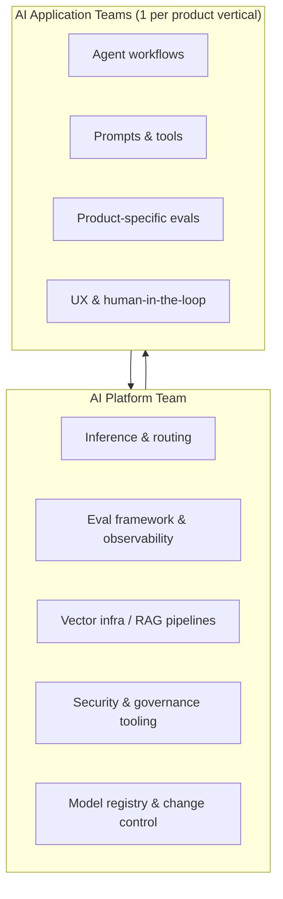

# Leading AI Teams

> Premium handbook for Engineering Managers, Directors, and Staff+ ICs who lead AI product and platform teams without becoming demo-driven organizations.

**Related:** [Hiring AI Engineers](Hiring-AI-Engineers.md) · [AI Governance & Metrics](AI-Governance-Strategy-Metrics.md) · [Behavioral STAR](Behavioral-STAR-Principal-EM.md) · [EM Interview Guide](../Career/EM-Interview-Guide.md) · [00-01 AI Engineering Mindset](../Modules/00-Foundations/00-01-AI-Engineering-Mindset.md) · [08 Evaluation Lifecycle](../Modules/08-Evaluation-LLMOps/08-01-Evaluation-Lifecycle.md)

---

## Table of Contents

1. [The AI Leadership Mandate](#1-the-ai-leadership-mandate)
2. [Org Design: Platform vs Application Teams](#2-org-design-platform-vs-application-teams)
3. [Roadmaps That Survive Reality](#3-roadmaps-that-survive-reality)
4. [Execution Metrics for AI Products](#4-execution-metrics-for-ai-products)
5. [Stakeholder Management](#5-stakeholder-management)
6. [Operating Cadence](#6-operating-cadence)
7. [Failure Modes and Antidotes](#7-failure-modes-and-antidotes)
8. [Interview-Ready Narratives](#8-interview-ready-narratives)

---

## 1. The AI Leadership Mandate

Leading AI teams is not leading a traditional backend team with a model bolted on. Probabilistic systems fail differently, cost curves are non-linear, and "done" is a statistical threshold—not a binary ship gate.

### What changes for AI leaders

| Dimension | Traditional software | AI product teams |
|-----------|---------------------|------------------|
| **Definition of done** | Feature passes tests | Feature passes evals + guardrails + cost budget |
| **Quality** | Deterministic correctness | Distribution of outcomes (precision, recall, abstention) |
| **Velocity risk** | Scope creep | Demo creep (pretty UI, no eval harness) |
| **Incidents** | Error codes, rollbacks | Prompt drift, retrieval poisoning, model regression |
| **Headcount leverage** | More engineers → more features | More data/evals/infra → better outcomes |

### The leader's job in one sentence

**Convert probabilistic capability into reliable product behavior through org design, eval discipline, and stakeholder education.**

Cross-reference: [03-03 Agentic Design Patterns](../Modules/03-Agentic-Fundamentals/03-03-Agentic-Design-Patterns.md) for technical patterns your team will implement; your job is ensuring those patterns are chosen for product reasons, not hype.

---

## 2. Org Design: Platform vs Application Teams

### Two-team model (minimum viable AI org)



### AI Platform Team — charter

| Owns | Does NOT own |
|------|--------------|
| LiteLLM / vLLM routing layer | Product-specific agent UX |
| Shared eval harness (DeepEval, Promptfoo integration) | Business KPI targets |
| Vector DB standards, embedding pipelines | Domain prompt copy |
| Tracing (LangSmith, OTel), cost dashboards | Feature prioritization |
| Guardrail libraries, OWASP checklist enforcement | Customer-facing copy decisions |
| Model/prompt change control process | — |

**Typical size:** 4–8 engineers at Series B–D; scales with inference spend and number of product surfaces.

**Key modules:** [01-04 Model Routing](../Modules/01-LLM-Engineering/01-04-Model-Routing-LiteLLM.md) · [08-02 Observability](../Modules/08-Evaluation-LLMOps/08-02-Observability-LangSmith-OTel.md) · [10 Production Infrastructure](../Modules/10-Production-Infrastructure/10-01-FastAPI-AI-Backends.md)

### AI Application Team — charter

| Owns | Does NOT own |
|------|--------------|
| End-to-end product AI experience | Rebuilding vector infra from scratch |
| Golden datasets for their domain | Provider contract negotiation (usually) |
| Tool definitions, agent graphs (LangGraph) | Shared observability platform |
| A/B tests on prompts and retrieval | — |
| Domain-specific safety policies | — |

**Typical ratio:** 1 platform engineer supports 3–5 application engineers (adjust for RAG-heavy vs agent-heavy products).

### When to merge vs split

| Signal | Action |
|--------|--------|
| <3 AI features, <$50K/mo inference | Single full-stack AI pod; platform concerns are part-time |
| 3+ product surfaces sharing retrieval | Split platform; mandate shared ingestion |
| Regulated industry (finance, health) | Dedicated safety/governance role on platform |
| Multi-agent workflows across products | Platform owns orchestration primitives (LangGraph templates, MCP servers) |

### Staffing archetypes per team

| Role | Platform | Application |
|------|----------|-------------|
| **Staff/Principal IC** | Routing, eval systems, cost architecture | Agent design, RAG quality, multi-agent coordination |
| **Senior L5/L6** | Infra, observability, CI for prompts | Feature agents, tool integration |
| **ML Engineer** | Fine-tuning pipeline, embedding strategy | Domain fine-tune experiments |
| **Data/Eval Engineer** | Golden set tooling, regression suites | Product-specific eval curation |

See [Hiring AI Engineers](Hiring-AI-Engineers.md) for loop design per level.

---

## 3. Roadmaps That Survive Reality

### The AI roadmap stack (bottom-up)

```
Layer 4: Product capabilities (what users see)
Layer 3: Agent/RAG workflows (how capability is composed)
Layer 2: Eval + observability (how you know it works)
Layer 1: Platform primitives (routing, retrieval, tracing)
Layer 0: Governance + security (what you're allowed to ship)
```

**Rule:** Never commit Layer 4 dates without Layer 2 milestones. Executives want features; you ship evals first.

### Quarterly roadmap template

| Quarter | Platform milestone | Application milestone | Eval gate |
|---------|-------------------|----------------------|-----------|
| Q1 | Routing + tracing live | Single-agent MVP | 30-case golden set, offline pass ≥85% |
| Q2 | Hybrid search + rerank | RAG with citations | Abstention rate <10% on OOD queries |
| Q3 | Multi-agent orchestration template | 2 specialist agents + validator | Online eval: thumbs-down <8% |
| Q4 | Fine-tune pipeline (optional) | Cost-optimized routing | Unit economics documented |

### Prioritization framework: ICE for AI

| Factor | Question | Weight |
|--------|----------|--------|
| **Impact** | Revenue, retention, or cost saved if eval target hit? | 40% |
| **Confidence** | Do we have data/evals proving feasibility? | 35% |
| **Effort** | Eng-weeks including eval + infra, not just demo? | 25% |

**Anti-pattern:** Prioritizing "multi-agent" because it's impressive. Multi-agent adds coordination failure modes ([05-01 Multi-Agent Orchestration](../Modules/05-Multi-Agent/05-01-Multi-Agent-Orchestration.md))—require a written "why not single agent + tools" memo.

### Roadmap communication to executives

Use this one-slide structure:

1. **User outcome** (not model name)
2. **Current eval score** → **Target eval score**
3. **Cost per successful task** (not cost per token)
4. **Risk tier** (see [AI Governance](AI-Governance-Strategy-Metrics.md))
5. **What we're NOT doing this quarter** (explicit deprioritization)

---

## 4. Execution Metrics for AI Products

### North-star metrics (pick 1 primary + 2 supporting)

| Product type | Primary metric | Supporting |
|--------------|----------------|------------|
| **Support agent** | Resolution rate without human | CSAT, cost per ticket |
| **Research/RAG** | Answer accuracy (human or LLM-judge) | Citation precision, latency p95 |
| **Coding assistant** | Accept rate / edit distance | Time-to-first-token, safety blocks |
| **Internal copilot** | Task completion rate | DAU, hours saved (survey + telemetry) |

### Engineering health metrics (weekly dashboard)

| Metric | Target band | Alert |
|--------|-------------|-------|
| Offline eval pass rate | ≥ baseline − 2pp | Regression >3pp |
| Online thumbs-down rate | <10% | Spike >2× weekly avg |
| p95 latency (E2E) | Product-specific SLA | +20% week-over-week |
| Cost per successful task | Within budget | +15% without quality gain |
| Abstention rate | 5–15% (domain dependent) | 0% (likely overconfident) or >30% |
| Guardrail trigger rate | Stable | Spike (attack or prompt drift) |
| Eval coverage (# golden cases) | Growing weekly | Flat for 2+ sprints |

### DORA adapted for AI

| DORA metric | AI adaptation |
|-------------|---------------|
| Deployment frequency | Prompt/model/config deploy frequency (with change control) |
| Lead time | Idea → eval-validated production |
| Change failure rate | Deploys causing eval regression or rollback |
| MTTR | Time to detect + fix eval regression |

### Sprint metrics that matter

Avoid story points for AI work. Track:

- **Eval delta:** Did we improve the golden set score?
- **Failure taxonomy:** Categorize bad outputs (retrieval miss, tool error, hallucination, policy)
- **Cost delta:** $/task change vs quality change

Reference: [08-01 Evaluation Lifecycle](../Modules/08-Evaluation-LLMOps/08-01-Evaluation-Lifecycle.md)

---

## 5. Stakeholder Management

### Stakeholder map

| Stakeholder | What they want | What they fear | Your move |
|-------------|----------------|----------------|-----------|
| **CEO/CPO** | Differentiation, speed | Competitor launches "AI" first | Show eval-backed milestones, not demos |
| **Legal/Compliance** | Audit trail, data handling | Hallucinated advice, PII leakage | Risk tiers, human-in-the-loop for Tier 3 |
| **Sales** | Feature checklist | Lost deals to "has AI" | Honest capability matrix + roadmap dates tied to evals |
| **Support/Ops** | Fewer tickets | AI makes things worse | Pilot with escalation paths + quality metrics |
| **Infra/Security** | Stable systems | Prompt injection, data exfil | OWASP LLM review, red-team cadence |
| **Data Science** | Model ownership | Eng ships bad RAG | Clear RACI: who owns embeddings vs prompts vs evals |

### The "AI demo trap" conversation script

When pressured to demo before evals exist:

> "We can show a demo in two days, or a reliable feature in four weeks. Demos without evals create reputational debt—one bad executive demo sets expectations we can't meet. I propose a controlled pilot with 50 golden cases and a defined abstention policy. Here's the week-by-week plan."

### Cross-functional rituals

| Ritual | Frequency | Participants | Output |
|--------|-----------|--------------|--------|
| **Eval review** | Weekly | Eng, PM, domain expert | Updated golden set, failure taxonomy |
| **AI product council** | Bi-weekly | Eng lead, PM, Legal, Security | Ship/hold decisions by risk tier |
| **Cost review** | Monthly | Eng, Finance, PM | Routing changes, model downgrades |
| **Incident retro** | Per SEV | On-call + platform | Prompt/model rollback, new eval cases |

---

## 6. Operating Cadence

### Weekly team rhythm

| Day | Activity | Owner |
|-----|----------|-------|
| Monday | Sprint planning with eval goals | EM + Tech Lead |
| Wednesday | Eval regression review (15 min) | Rotating engineer |
| Thursday | Platform ↔ App sync (30 min) | Staff ICs both sides |
| Friday | Demo + retro (eval delta, not UI) | Whole team |

### Decision rights (RACI)

| Decision | Platform | App Team | EM | Staff IC |
|----------|----------|----------|-----|----------|
| New model provider | R/A | C | I | C |
| Prompt change (Tier 1) | I | R/A | I | C |
| Prompt change (Tier 2+) | C | R | A | C |
| Eval threshold change | C | R | A | C |
| Architecture (multi-agent) | C | C | I | R/A |

### Escalation triggers

Escalate to director/VP when:

- Eval regression >5pp without known cause
- Cost overrun >25% of monthly budget
- Security finding at OWASP LLM Top 10 severity High+
- Stakeholder demands ship despite failed eval gate

Reference: [11-01 OWASP LLM Top 10](../Modules/11-Security-Safety/11-01-OWASP-LLM-Top-10.md)

---

## 7. Failure Modes and Antidotes

| Failure mode | Symptom | Antidote |
|--------------|---------|----------|
| **Demo-driven org** | No golden set; "looks good in meeting" | Eval-first roadmap; block merges on regression |
| **Research team trap** | Papers, no production | 70/30 ship/research split; quarterly production OKR |
| **Platform neglect** | Each team rebuilds RAG | Platform team with SLAs; internal "customers" |
| **Model religion** | Debates GPT vs Claude weekly | LiteLLM abstraction; decide on eval scores |
| **Hero prompt engineer** | One person owns all prompts | Prompt registry, PR review, pair prompting |
| **Eval theater** | 5 test cases, always green | Adversarial cases, production sampling, red team |
| **Scope avalanche** | "Add agents" to everything | Single-agent default; multi-agent requires memo |

---

## 8. Interview-Ready Narratives

### EM question: "How would you structure an AI team for a 200-person SaaS company?"

**Outline:**

1. **Clarify:** Which AI surfaces? (Support, search, internal copilot?)
2. **Propose:** 1 platform pod (4) + 2 app pods (3 each) if 3+ surfaces
3. **Platform owns:** Routing, eval harness, vector infra, change control
4. **Apps own:** Domain agents, golden sets, product metrics
5. **Metrics:** Resolution rate, cost/task, eval pass rate
6. **Governance:** Risk tiers, Legal in bi-weekly council
7. **Phasing:** Q1 platform + one app MVP; Q2 scale

### Principal question: "How do you lead technically without people management?"

**Outline:**

1. **Set technical bar:** Architecture reviews, eval standards, design docs
2. **Influence roadmap:** Write RFCs with cost/quality tradeoffs
3. **Mentor:** Office hours, pair on hard debugging (retrieval, agents)
4. **Cross-team:** Platform patterns adopted via working code, not mandates
5. **Incident leadership:** Own SEV-1 technical response for AI regressions

See [Behavioral STAR](Behavioral-STAR-Principal-EM.md) for full story templates.

---

## Quick Reference Card

| Topic | Key takeaway |
|-------|--------------|
| Org | Platform = shared eval/infra; App = domain agents |
| Roadmap | Eval milestones before feature dates |
| Metrics | Cost per successful task + offline/online eval |
| Stakeholders | Educate on probabilistic quality; anti-demo-trap |
| Cadence | Weekly eval review is non-negotiable |

**Next:** [Hiring AI Engineers](Hiring-AI-Engineers.md) · [AI Governance, Strategy & Metrics](AI-Governance-Strategy-Metrics.md)
