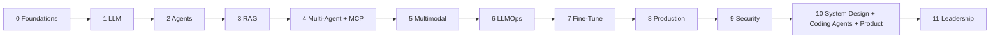

# Learning Path

> Role-specific sequencing on top of the **[Master Study Roadmap](Master%20Study%20Roadmap.md)** (Phases 0–11).

**Related:** [Dashboard](Dashboard.md) · [Study Plan](Study%20Plan.md) · [TOC](TABLE_OF_CONTENTS.md) · [Career Guides](Career/) · **[Track D — India AI Career Plan](Career/India-AI-Career-Learning-Plan.md)**

---

## Which track am I?

| Your situation | Track |
|----------------|-------|
| Basic programming, little/no AI, want India GenAI jobs | **D** ← start here |
| Already a strong engineer aiming Staff/Principal AI | **A** |
| EM / manager path | **B** |
| Tech lead moving toward EM | **C** |

---

## North star

Tracks **A–C** follow **Phases 0 → 11** at Staff+/EM depth.  
**Track D** uses the same handbook modules but a **slower, job-first filter** (skip Principal/EM overload in year 1).

```mermaid
flowchart LR
    P0[0 Foundations] --> P1[1 LLM]
    P1 --> P2[2 Agents]
    P2 --> P3[3 RAG]
    P3 --> P4[4 Multi-Agent + MCP]
    P4 --> P5[5 Multimodal]
    P5 --> P6[6 LLMOps]
    P6 --> P7[7 Fine-Tune]
    P7 --> P8[8 Production]
    P8 --> P9[9 Security]
    P9 --> P10[10 System Design + Coding Agents + Product]
    P10 --> P11[11 Leadership]
```

---

## Track A — Staff / Principal AI Engineer (IC)

### Persona

You design and ship AI systems. Interviews test architecture, failure modes, cost, code judgment, MCP, LangGraph, evals, and security.

### Sequence

| Phase | Weeks | Must-complete | Depth rule |
|-------|-------|---------------|------------|
| 0 Foundations | 1–3 | **00-01 → 00-05 → 00-06 → 00-04 → 00-02** (+ optional 00-03) | Implement every lab |
| 1 LLM | 4–5 | 01-*, 02-* | All four providers (incl. DeepSeek) |
| 2 Agents | 6–7 | 03-* | **LangGraph** fluency required |
| 3 RAG | 8–10 | 04-* | Hybrid + rerank mandatory |
| 4 Multi-Agent | 11–13 | 05-*, 07-* (incl. **07-04 MCP depth**) | MCP gateway + multi-agent project |
| 5 Multimodal | 14–15 | 06-* | Voice or doc project shipped |
| 6 LLMOps | 16–18 | 08-* | Eval CI gate |
| 7 Fine-Tune | 19–20 | 09-* | Written FT decision memo |
| 8 Production | 21–23 | 10-* + 01-03 depth | **K8s + GPU + cost** |
| 9 Security | 24 | 11-* | OWASP + injection CI |
| 10 Design | 25–27 | System Design + 12-05 + 12-06 | 6–8 designs |
| 11 Leadership lite | 28–30 | STAR + mocks + selective Leadership | Convert to offers |

### IC Success Metrics

- 12+ production-style apps (roadmap ladder)
- Reusable RAG platform + LLMOps pipeline
- Fine-tuned domain adapter with eval compare
- 8 system design writeups
- Staff mock score ≥4/5 on architecture

---

## Track B — Engineering Manager (AI / Platform)

### Persona

You lead teams building AI products. Interviews test judgment, hiring, execution, ROI, and enough technical depth to call bluffs.

### Sequence

| Phase | Focus | Depth adjustment |
|-------|-------|------------------|
| 0 | GenAI from scratch + API literacy (skim math proofs) | Do 00-01 labs + FastAPI; skim linear algebra proofs |
| 1–2 | LLM + agents judgment | Skim vLLM internals; run support agent demo |
| 3–4 | RAG + multi-agent product sense | Critique designs; lighter framework API minutiae |
| 5–6 | Multimodal UX + **eval/ship criteria** | Own metric trees and launch gates |
| 7 | FT decision literacy | Read 09-02 deeply; skip training ops lab optional |
| 8 | Cost / infra for leaders | 10-04 mandatory; K8s concepts required |
| 9 | Security & governance | OWASP + NIST AI RMF |
| 10 | Product thinking + selective designs | **12-06** mandatory; 4 designs minimum |
| 11 | Leadership ×4 + EM Interview Guide | Primary focus (full 4 weeks) |

### EM Success Metrics

- 8 STAR stories mapped to EM patterns
- Written AI governance checklist + roadmap memo
- Hiring loop scorecard for AI Engineer L5/L6
- Can critique a multi-agent + MCP design in 20 minutes
- Can defend $/task and eval ship criteria to executives

---

## Track C — Hybrid Tech Lead → EM

Alternate **Tech Deep Day** and **Leadership Day**.

| Day type | Content |
|----------|---------|
| Tech Deep | Full IC module lab for current phase |
| Leadership | STAR + hiring + roadmap exercises |
| Friday | Integration: “how I’d staff and ship this system” |

Follow Track A phase order; every week add **2 hours** from `Leadership/` and `Career/EM-Interview-Guide.md`.

---

## Prerequisites Matrix

| Phase / module | Required before |
|----------------|-----------------|
| Phase 1 LLM | Phase 0: 00-01 GenAI ideas + Python + APIs (or equivalent experience) |
| Phase 2 Agents | Phase 1 structured outputs + tool calling |
| Phase 3 RAG | Tokens + embeddings intuition (00-04, 01-02) |
| Phase 4 Multi-Agent / MCP | Phase 2 agents + Phase 3 RAG basics |
| Phase 6 Evals | Any agent or RAG project exists |
| Phase 7 Fine-Tune | Phase 3 RAG (to compare honestly) |
| Phase 8 Production | At least one agent/RAG service to deploy |
| 12-05 Coding Agents | Phase 2 + MCP intro |
| 12-06 Product Thinking | Phase 2 + Phase 6 concepts |

---

## Track D — India AI Career (basic programming, no AI background)

### Persona

You are learning GenAI from scratch with **basic programming**. Goal: stay relevant ~10 years as India expands **data centers** and **enterprise AI** — not to pass Principal interviews in month 3.

**Full month-by-month plan:** **[Career/India-AI-Career-Learning-Plan.md](Career/India-AI-Career-Learning-Plan.md)**

### Sequence (summary)

| Months | Focus | Handbook (must) | Skip / skim |
|--------|-------|-----------------|-------------|
| 1–2 | Python + GenAI ideas + first API | 00-01, 00-05, 00-06, light 00-04, skim 00-02 | BankCo deep dive optional |
| 3–4 | LLM apps, cost, prompting, tools | 01-02, 01-05, 02-01, 02-02; intuition 01-01 | vLLM internals, all papers |
| 5–6 | RAG + bounded agent | 04-01→04-03 skim, 03-01, 03-02, light 03-04 | Full multi-agent / A2A |
| 7–8 | Evals, logs, safety | 08-01, skim 08-02, 08-03, skim 11-01 | Research eval literature |
| 9–10 | Docker, cost, inference awareness | 10-01, Docker from 10-02, 10-04, skim 01-03 + Ollama | Kafka/Ray deep ops |
| 11–12 | Specialize + job loop | One of: deeper RAG **or** agents **or** infra | Phase 11 EM; 6–8 designs |

### Year-1 target roles (India)

- GenAI / LLM Application Engineer  
- RAG / AI Solutions Engineer (IT services & captives)  
- Junior AI Platform / inference-curious engineer (if you pick infra path)

### Success metrics

- 2–3 GitHub demos (RAG FAQ, tool agent, Dockerized API) with cost + eval notes  
- Comfortable explaining tokens, RAG, and when *not* to use an agent  
- Applying with a live or recorded demo — not certificate collecting  

---

## Fast-Track (Experienced LLM Engineers — 12–16 Weeks)

Only if you already ship LLM features:

1. Weeks 1–2: Phase 2–3 (agents + advanced RAG)
2. Weeks 3–4: Phase 4 (multi-agent + MCP depth)
3. Weeks 5–6: Phase 6 + 9 (evals + security)
4. Weeks 7–8: Phase 8 (K8s, GPU, cost)
5. Weeks 9–10: Phase 10 (designs + coding agents + product)
6. Weeks 11–12: Capstone
7. Weeks 13–16: Phase 11 mocks + Leadership

Still complete the Master Roadmap resource maps for papers and docs you have not read.

---

## Next Step

1. Select Track **A / B / C / D** on [Dashboard](Dashboard.md).  
2. If **Track D**: open **[India AI Career Learning Plan](Career/India-AI-Career-Learning-Plan.md)**.  
3. Everyone starts content at **[00-01 GenAI From Scratch](Modules/00-Foundations/00-01-AI-Engineering-Mindset.md)**.
