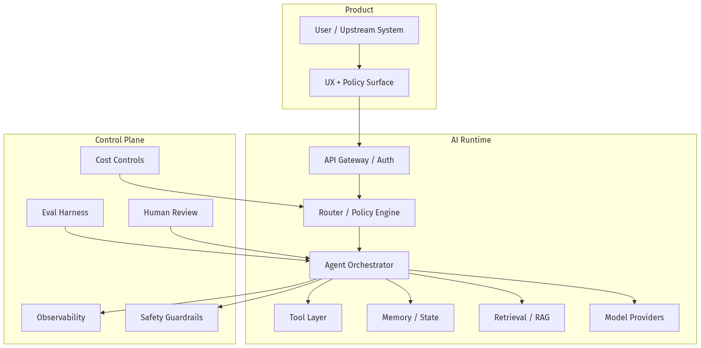
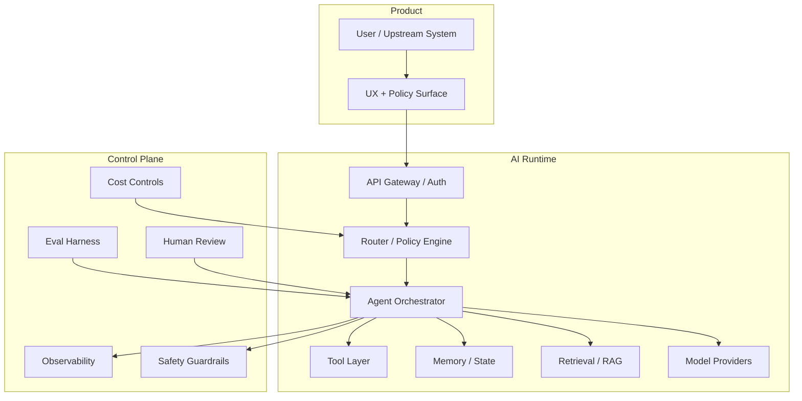
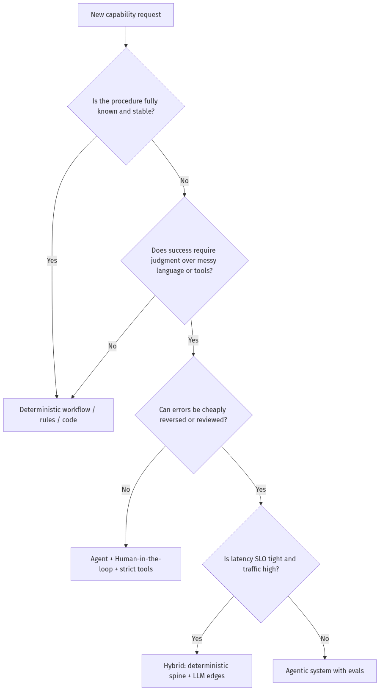
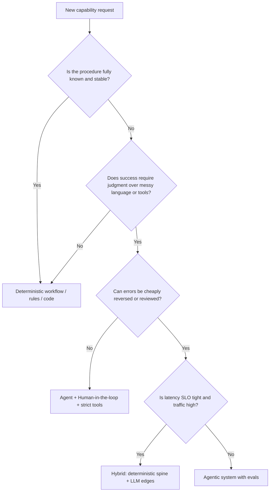
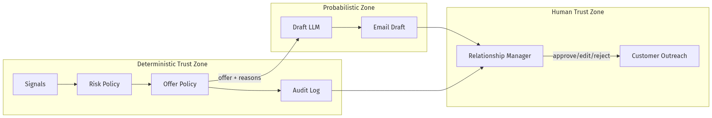
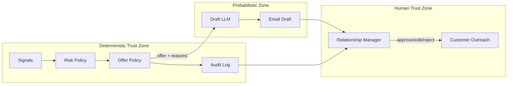
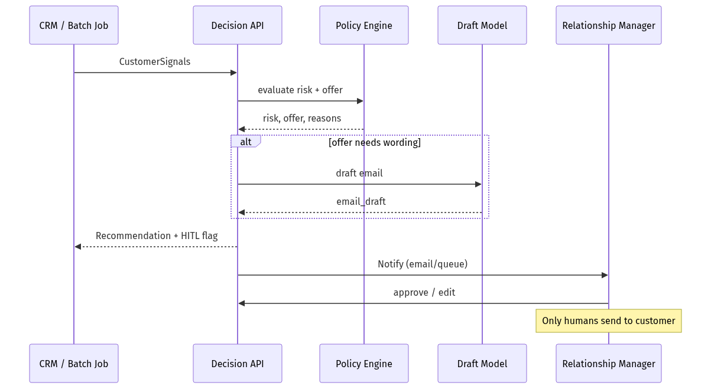
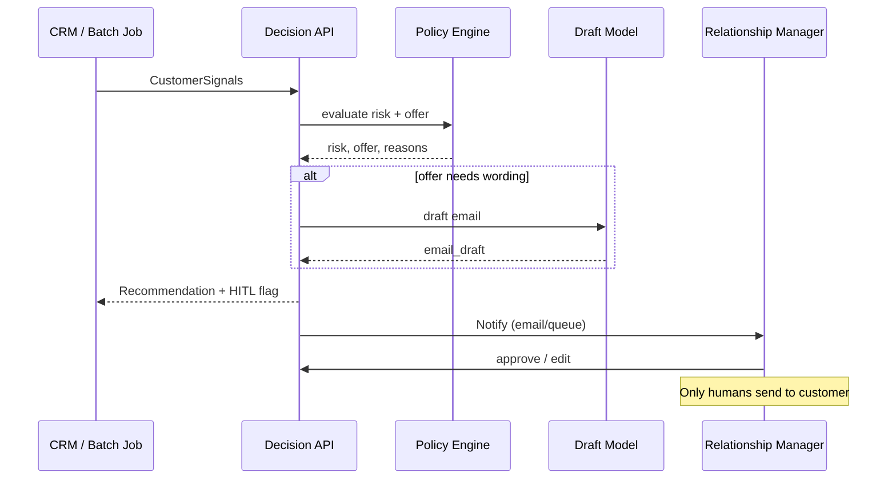

# 00-01 — AI Engineering Mindset for Principal, Staff & Engineering Managers

| Meta | Value |
|------|-------|
| **Estimated Time** | 4–5 hours (read 2h · lab 2h · judgment memo 1h) |
| **Difficulty** | Intermediate (conceptual) · Advanced (judgment drills) |
| **Prerequisites** | Comfortable writing Python; basic HTTP/API literacy; no ML PhD required |
| **Module** | 00 — Foundations |
| **Related** | [00-02](00-02-From-Rules-to-Agents.md) · [00-03](00-03-BankCo-Decision-Support-Warmup.md) · [00-04](00-04-Mathematics-for-AI-Engineering.md) · [00-05](00-05-Python-for-AI-Engineering.md) · [00-06](00-06-APIs-for-AI-Engineering.md) · [Architecture Index](../../Architecture Index.md) · [Leading AI Teams](../../Leadership/Leading-AI-Teams.md) · [Study Plan](../../Study Plan.md) |

---

## Learning Objectives

By the end of this chapter you will be able to:

1. Distinguish **demo GenAI**, **LLM features**, and **production agentic systems**.
2. Apply the equation **Agent = (Prompt + Tools + Memory) × LLM** as a design checklist.
3. Decide **agentic vs deterministic** with an explicit decision framework.
4. Frame AI work in terms of **cost, latency, reliability, safety, and evaluability**.
5. Speak at Staff/Principal/EM interview altitude about AI judgment—not tools.

---

## Why This Topic Matters

Most teams can call an LLM API in an afternoon. Very few can operate a system that:

- behaves acceptably under distribution shift,
- fails closed on unsafe actions,
- stays within a token budget at 10× traffic,
- can be debugged from traces six weeks later,
- and can be defended in an architecture review.

**Principal/Staff engineers** are paid for the last five bullets. **Engineering Managers** are paid to staff, prioritize, and govern systems that require those bullets.

If you skip mindset and jump to frameworks, you will:

- over-agent simple workflows,
- under-invest in evals,
- confuse “clever prompt” with “reliable product,”
- and fail Staff/Principal interviews that probe tradeoffs.

---

## Business Impact

| Business outcome | How mindset changes decisions |
|------------------|-------------------------------|
| **Faster time-to-value** | Start with thinnest reliable slice; avoid multi-agent until single-agent fails |
| **Lower COGS** | Route easy tasks to small/cheap models; cache; constrain tools |
| **Fewer incidents** | Design for non-determinism, tool failure, prompt injection |
| **Higher trust** | Citations, abstain logic, human-in-the-loop on irreversible actions |
| **Hireable talent signal** | Candidates who talk failure modes beat candidates who recite framework names |

---

## Architecture Overview

Production GenAI is not “a model.” It is a **sociotechnical system**:





**Mental model:** Treat the LLM as a **probabilistic CPU**. Tools are syscalls. Memory is RAM + disk. RAG is networked filesystem. Evals are unit/integration tests. Guardrails are SELinux. Observability is APM.

---

## Core Concepts

### 1) Three Levels of GenAI Work

#### Definition

| Level | Definition |
|-------|------------|
| **L1 Demo** | Notebook or UI that shows a happy path |
| **L2 Feature** | LLM call embedded in a product path with basic logging |
| **L3 System** | Orchestration + tools + memory + retrieval + evals + safety + cost + on-call |

#### Intuition

L1 impresses stakeholders. L2 ships. L3 survives contact with customers and auditors.

#### When to use each

- L1: discovery spikes (≤1 week), never customer-critical.
- L2: low-risk assistive features (drafting, summarization) with easy human override.
- L3: anything that routes money, PII, medical/legal advice, or irreversible actions.

#### Interview discussion

> “We don’t need an agent platform for a rewrite button. We do need L3 for an agent that refunds customers.”

---

### 2) The Agent Equation

#### Definition

\[
\text{Agent} = (\text{Prompt} + \text{Tools} + \text{Memory}) \times \text{LLM}
\]

The multiplication sign means: **without a capable model, the sum collapses; without the parentheses, the model cannot act reliably.**

#### Mental Model

| Component | Job | Failure if missing |
|-----------|-----|--------------------|
| **Prompt** | Goals, constraints, output contract | Drift, verbosity, unsafe tone |
| **Tools** | Act on the world / fetch truth | Hallucinated actions & facts |
| **Memory** | Continuity across steps/sessions | Loops, amnesia, repeated spend |
| **LLM** | Reason / plan / select | Brittle rules or dumb automation |

#### Why it exists

LLMs alone are text transformers. Products need **grounding** (tools/RAG), **state** (memory), and **contracts** (prompts/schemas).

#### When NOT to use a full agent

- Pure classification with a stable taxonomy → fine-tuned classifier or structured LLM call.
- Deterministic workflow with known steps → orchestration engine / rules / BPMN.
- Single document rewrite → one-shot prompt.

---

### 3) Agentic vs Deterministic Decision Framework





#### Production rule of thumb (2-of-N style judgment)

Use an **agent** when at least **2 of these 3** are true:

1. Inputs are unstructured / ambiguous.
2. Tool choice or plan must vary by instance.
3. The business accepts probabilistic quality **with** measurement.

If 0–1 are true, prefer deterministic systems.

---

### 4) The Four Engineering Currencies

Every Principal-level AI decision spends one currency to buy another:

| Currency | Unit examples | Typical trade |
|----------|---------------|---------------|
| **Quality** | task success, groundedness | ↑ quality often ↑ cost/latency |
| **Latency** | p50/p95 TTFT, E2E | Agents and critics hurt latency |
| **Cost** | $/1K tokens, tool $/call, GPU-hr | Larger models & long contexts explode cost |
| **Risk** | safety incidents, data leakage | Autonomy ↑ risk unless controls ↑ |

**Staff interview move:** Always name which currency you optimize and which you spend.

---

### 5) Non-Determinism Is a First-Class Requirement

#### Definition

Same input can yield different outputs across runs (sampling, model updates, tool flakiness).

#### How to engineer for it

| Technique | Purpose |
|-----------|---------|
| Structured outputs / schemas | Reduce shape variance |
| Temperature / seed policies | Control creativity where needed |
| Idempotent tools | Safe retries |
| Checkpointing | Resume without duplicating side effects |
| Golden evals | Detect silent model regressions |
| Version pins | Know what changed |

#### When NOT to “fix” non-determinism with temperature=0 alone

Temperature 0 reduces variance but does **not** eliminate provider-side changes, retrieval shifts, or tool nondeterminism.

---

### 6) EM vs Principal Lenses (Same System, Different Questions)

| Lens | Principal / Staff asks | EM asks |
|------|------------------------|---------|
| Architecture | What are trust boundaries? | Who owns on-call and SLOs? |
| Quality | What eval gates ship? | What is the customer promise? |
| Cost | What’s $/successful task? | What’s margin impact at scale? |
| People | What skills are missing? | Who do we hire / train this quarter? |
| Risk | What’s blast radius? | What’s governance / audit story? |

---

## Implementation

### Production-shaped skeleton: decision service (not a chatbot)

This FastAPI service encodes the mindset: **policy first**, model second, audit always.

```python
"""Bank-style decision-support API skeleton.

Run:
  uvicorn app:app --reload

Env:
  OPENAI_API_KEY=...
"""

from __future__ import annotations

import os
import uuid
from datetime import datetime, timezone
from enum import Enum
from typing import Any

from fastapi import FastAPI, HTTPException
from pydantic import BaseModel, Field, field_validator

# Optional: swap to real provider later
try:
    from openai import OpenAI
except ImportError:  # pragma: no cover
    OpenAI = None  # type: ignore


class RiskLevel(str, Enum):
    LOW = "low"
    MEDIUM = "medium"
    HIGH = "high"
    SEVERE = "severe"


class OfferType(str, Enum):
    NONE = "none"
    FEE_WAIVER = "fee_waiver"
    POINTS_BONUS = "points_bonus"
    RETENTION_APR = "retention_apr"
    HUMAN_OUTREACH = "human_outreach"


class CustomerSignals(BaseModel):
    customer_id: str
    days_to_renewal: int = Field(ge=0, le=365)
    complaint_count_90d: int = Field(ge=0)
    nps: int | None = Field(default=None, ge=0, le=10)
    spend_drop_pct: float = Field(ge=0, le=100)
    severe_flags: list[str] = Field(default_factory=list)

    @field_validator("customer_id")
    @classmethod
    def non_empty(cls, v: str) -> str:
        if not v.strip():
            raise ValueError("customer_id required")
        return v.strip()


class Recommendation(BaseModel):
    recommendation_id: str
    customer_id: str
    risk_level: RiskLevel
    offer: OfferType
    rationale: list[str]
    email_draft: str | None
    requires_human_approval: bool
    model_used: str | None
    created_at: datetime


class AuditEvent(BaseModel):
    event_id: str
    recommendation_id: str
    actor: str
    action: str
    payload: dict[str, Any]
    ts: datetime


app = FastAPI(title="Decision Support API", version="1.0.0")
AUDIT_LOG: list[AuditEvent] = []


def apply_risk_policy(signals: CustomerSignals) -> tuple[RiskLevel, list[str]]:
    """Deterministic spine: Severe Signal rule + 2-of-N rule."""
    reasons: list[str] = []

    # Severe Signal rule — short-circuit
    if signals.severe_flags:
        reasons.append(f"severe_flags={signals.severe_flags}")
        return RiskLevel.SEVERE, reasons

    votes = 0
    if signals.complaint_count_90d >= 2:
        votes += 1
        reasons.append("complaint_count_90d>=2")
    if signals.nps is not None and signals.nps <= 6:
        votes += 1
        reasons.append("nps<=6")
    if signals.spend_drop_pct >= 30:
        votes += 1
        reasons.append("spend_drop_pct>=30")
    if 30 <= signals.days_to_renewal <= 90:
        votes += 1
        reasons.append("in_renewal_window_30_90")

    # 2-of-N rule
    if votes >= 3:
        return RiskLevel.HIGH, reasons
    if votes == 2:
        return RiskLevel.MEDIUM, reasons
    return RiskLevel.LOW, reasons


def select_offer(risk: RiskLevel) -> OfferType:
    """Offer Policy — compliance-friendly mapping (deterministic)."""
    return {
        RiskLevel.LOW: OfferType.NONE,
        RiskLevel.MEDIUM: OfferType.POINTS_BONUS,
        RiskLevel.HIGH: OfferType.RETENTION_APR,
        RiskLevel.SEVERE: OfferType.HUMAN_OUTREACH,
    }[risk]


def draft_email_with_llm(customer_id: str, offer: OfferType, reasons: list[str]) -> str | None:
    """LLM only on the edge: drafting. Never decides eligibility."""
    if offer in (OfferType.NONE, OfferType.HUMAN_OUTREACH):
        return None
    if OpenAI is None or not os.getenv("OPENAI_API_KEY"):
        return (
            f"Hello — regarding account {customer_id}, we can offer {offer.value}. "
            f"Drivers: {', '.join(reasons)}. (offline draft)"
        )

    client = OpenAI()
    prompt = (
        "Write a short, compliant retention email draft. No promises beyond the offer. "
        f"Offer={offer.value}. Reasons={reasons}. Customer={customer_id}."
    )
    resp = client.responses.create(model="gpt-4.1-mini", input=prompt)
    return resp.output_text


def audit(recommendation_id: str, actor: str, action: str, payload: dict[str, Any]) -> None:
    AUDIT_LOG.append(
        AuditEvent(
            event_id=str(uuid.uuid4()),
            recommendation_id=recommendation_id,
            actor=actor,
            action=action,
            payload=payload,
            ts=datetime.now(timezone.utc),
        )
    )


@app.post("/v1/retention/recommend", response_model=Recommendation)
def recommend(signals: CustomerSignals) -> Recommendation:
    risk, reasons = apply_risk_policy(signals)
    offer = select_offer(risk)
    rec_id = str(uuid.uuid4())

    email = draft_email_with_llm(signals.customer_id, offer, reasons)
    requires_hitl = risk in (RiskLevel.HIGH, RiskLevel.SEVERE) or offer == OfferType.HUMAN_OUTREACH

    rec = Recommendation(
        recommendation_id=rec_id,
        customer_id=signals.customer_id,
        risk_level=risk,
        offer=offer,
        rationale=reasons,
        email_draft=email,
        requires_human_approval=requires_hitl,
        model_used="gpt-4.1-mini" if email and os.getenv("OPENAI_API_KEY") else None,
        created_at=datetime.now(timezone.utc),
    )
    audit(rec_id, actor="system", action="recommend", payload=rec.model_dump(mode="json"))
    return rec


@app.post("/v1/retention/{recommendation_id}/approve")
def approve(recommendation_id: str, approver: str = "rm_user") -> dict[str, str]:
    if not any(a.recommendation_id == recommendation_id for a in AUDIT_LOG):
        raise HTTPException(status_code=404, detail="unknown recommendation_id")
    audit(recommendation_id, actor=approver, action="approve", payload={})
    return {"status": "approved", "recommendation_id": recommendation_id}
```

#### Why this implementation embodies the mindset

1. **Deterministic spine** decides risk/offer (auditable, testable).
2. **LLM edge** only drafts language.
3. **HITL** for high blast-radius paths.
4. **Audit log** is not optional telemetry—it is the product.

---

## Production Considerations

| Concern | Practice |
|---------|----------|
| Model swaps | Never let model change change eligibility rules |
| Prompt drift | Version prompts; store hash in audit |
| Provider outage | Draft fallback template; queue retries |
| Compliance | Separate “decision” from “wording” |
| Ownership | Name a DRI for policy tables vs model prompts |

---

## Security

| Threat | Control |
|--------|---------|
| Prompt injection via customer notes | Do not let free text alter offer policy; sanitize into features |
| Data leakage in drafts | Redact PAN/SSN before LLM; minimize PII in prompts |
| Privilege abuse | Approvals require authn/authz; no auto-send from LLM |
| Tool overreach | No payment/refund tools without dual control |

Deep dive later: [11-01 OWASP LLM Top 10](../11-Security-Safety/11-01-OWASP-LLM-Top-10.md)

---

## Performance

| Path | Target mindset |
|------|----------------|
| Policy evaluation | Microseconds–milliseconds (local code) |
| LLM draft | Hundreds of ms–seconds (async OK) |
| RM notification | Eventual; never block eligibility |

**Rule:** Keep money/compliance paths off the LLM critical path when possible.

---

## Cost

| Lever | Effect |
|-------|--------|
| Deterministic eligibility | $0 model cost on decision |
| Small model for draft | 5–20× cheaper than frontier |
| Cache drafts by (offer, reason_hash) | Cuts repeat spend |
| Don’t multi-agent a policy table | Avoids token explosions |

---

## Scalability

Scale **policy + audit + queues** first. Scale **LLM concurrency** second. Multi-agent orchestration is a last resort for this class of problem.

---

## Failure Modes

| Failure | Symptom | Mitigation |
|---------|---------|------------|
| Policy encoded in prompt | Inconsistent offers | Move policy to code/tables |
| Autopilot send | Wrong customer emailed | HITL + allowlist |
| Silent model change | Tone/compliance drift | Pin versions + eval suite |
| Tooling for everything | Latency/cost blowups | Start tool-poor |
| No abstain | Confident nonsense | Explicit “insufficient signal” |

---

## Observability

Minimum telemetry for any AI feature:

```text
trace_id, customer_id, policy_version, prompt_version, model,
risk_level, offer, latency_ms, token_in, token_out, cost_usd,
hitl_required, hitl_decision, tool_errors
```

If you cannot answer “why this offer yesterday?”, you are not production-ready.

---

## Debugging

| Question | Where to look |
|----------|---------------|
| Wrong offer? | Policy unit tests + input signals |
| Bad email tone? | Prompt version + sample gallery |
| Spike in cost? | Token fields + cache hit rate |
| RM ignored recommendations? | Product analytics, not model quality alone |

---

## Common Mistakes

1. Starting with multi-agent frameworks for a rules problem.
2. Letting the LLM invent discounts.
3. Measuring only “demo wow,” never task success.
4. No ownership of prompts/policies as code.
5. Treating temperature as a safety control.

---

## Tradeoffs

| Choice | Upside | Downside |
|--------|--------|----------|
| Deterministic spine + LLM edge | Auditability, lower risk | Less “smart” flexibility |
| Fully agentic eligibility | Flexible | Compliance nightmare |
| HITL always | Safe | Slow, costly ops |
| Full autonomy | Fast | Incident-prone |

---

## Architecture Diagram





---

## Mermaid Diagram — Sequence





---

## Production Examples

| Company pattern | Mindset move |
|-----------------|--------------|
| Banks / fintech retention | Rules for eligibility; LLM for messaging |
| Support triage | Classifier/router first; agent only for complex tools |
| Internal knowledge bots | RAG + abstain; not unrestricted browsing |
| IDE coding agents | Tight tool contracts + user accept for applies |

---

## Real Companies Using It (Public Patterns)

| Org | Public pattern | Lesson |
|-----|----------------|--------|
| **Klarna** | Large-scale support automation with strong measurement | Autonomy only with ops metrics |
| **Duolingo** | LLM features with product experimentation | Treat quality as product KPI |
| **Notion / Slack** | Workspace AI with permission boundaries | ACL is architecture |
| **LangChain customers (e.g. Uber, Klarna cited in LangGraph docs)** | Stateful agents in production | Orchestration + persistence matters |

> Use company names as **pattern references**, not as claims you personally operated their stacks.

---

## Hands-on Labs

### Lab A — Policy unit tests (45 min)

Write pytest coverage for Severe Signal + 2-of-N. Mutate signals; assert offers never come from the LLM.

### Lab B — Kill the model (30 min)

Unset `OPENAI_API_KEY`. System must still return eligible offers; only drafts degrade.

### Lab C — Audit reconstruction (30 min)

Given only `AUDIT_LOG`, reconstruct why a customer got `retention_apr`.

---

## Coding Assignments

1. Add `policy_version` and `prompt_version` fields; persist them.
2. Add a `/v1/retention/batch` endpoint with concurrency limits.
3. Emit OpenTelemetry spans around policy vs LLM sections.

---

## Mini Project

**Title:** Retention Decision API v0  
**Done when:** deterministic tests pass; sample RM email generated; README explains WHEN LLM is called.

---

## Production Project

**Title:** HITL Retention Console  
**Done when:** Streamlit/React UI lists recommendations, requires approval, writes audit, redacts PII in prompts.

---

## Stretch Project

Compare three designs on the same dataset:

1. Pure rules  
2. Rules + LLM draft  
3. Fully agentic eligibility  

Report quality, cost, latency, and incident hypotheticals.

---

## Interview Questions

### Senior Engineer

1. What is the difference between an LLM feature and an agentic system?
2. How would you keep a model from inventing discounts?
3. What do you log for an AI recommendation?

### Staff Engineer

1. Walk through agentic vs deterministic for insurance claims.
2. How do you design for provider model swaps?
3. Where does RAG fit if eligibility is deterministic?

### Principal Engineer

1. Propose an org-wide AI architecture standard for “decision support.”
2. How do you quantify $/successful retained customer for this system?
3. What becomes a platform capability vs app-specific code?

### Engineering Manager

1. How do you staff week 1 vs month 6 for this product?
2. What KPIs do you put on the team scorecard?
3. How do you handle a compliance stakeholder who wants zero LLM usage?

### Whiteboard

Draw the trust zones (deterministic / probabilistic / human) for a refund agent.

### Follow-ups

- What if severe flags are noisy?
- What if RMs approve everything blindly?
- What if marketing wants personalized offers beyond policy?

---

## Revision Notes

- Agent ≠ chatbot. Agent = prompt + tools + memory × model.
- Put **policy in code**; put **language in models**.
- Optimize explicitly across quality / latency / cost / risk.
- HITL for irreversible actions.
- If you can’t audit it, you can’t ship it regulated.

---

## Summary

The AI engineering mindset is **systems thinking under uncertainty**. Principal/Staff/EM excellence is not “knowing LangGraph.” It is knowing **when not to use it**, how to bound blast radius, and how to measure reality.

---

## Further Reading

| Title | URL | Difficulty | Reading Time | Why Read | Important Sections |
|-------|-----|------------|--------------|----------|--------------------|
| LangGraph Overview | https://langchain-ai.github.io/langgraph/concepts/high_level/ | Intro | 20 min | See production agent runtime concerns (persistence, HITL) | Core benefits; ecosystem; persistence |
| MCP Intro | https://modelcontextprotocol.io/docs/getting-started/intro | Intro | 15 min | Standard tool connectivity mindset | What MCP enables; why it matters |
| OpenAI Prompt Engineering Guide | https://developers.openai.com/api/docs/guides/prompt-engineering | Intro | 45 min | Prompt as contract, not poetry | Tactics; message roles; iteration |
| Anthropic / Claude Docs Overview | https://platform.claude.com/docs/en/docs/build-with-claude/overview | Intro | 30 min | Alternate provider constraints | Build with Claude overview |
| Attention Is All You Need | https://arxiv.org/abs/1706.03762 | Advanced | 60–90 min | Shared vocabulary for later chapters | Architecture diagram; attention |
| ReAct: Synergizing Reasoning and Acting | https://arxiv.org/abs/2210.03629 | Intermediate | 45 min | Grounds the agent loop chapter | Think-Act-Observe examples |
| OWASP Top 10 for LLM Applications | https://owasp.org/www-project-top-10-for-large-language-model-applications/ | Intermediate | 60 min | Safety mindset early | LLM01 Prompt Injection; data leakage |

---

## Resume Bullet (after lab)

- Designed a **policy-first retention decision API** separating deterministic eligibility from LLM drafting, with HITL approvals and full auditability for compliance-aligned outreach.
