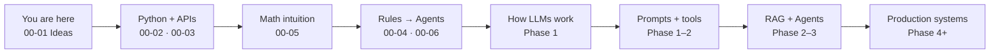
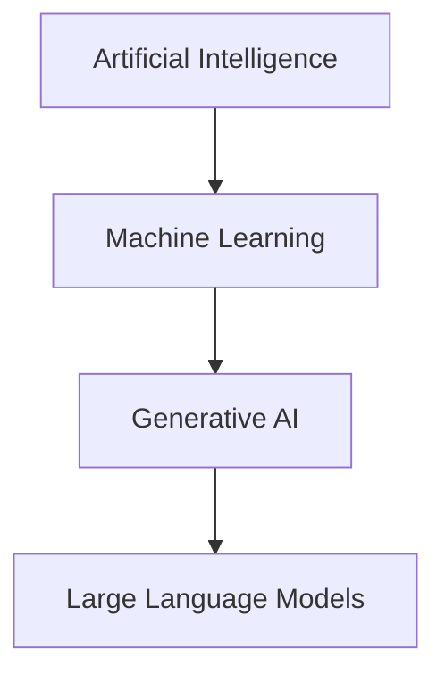
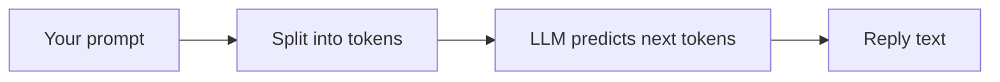
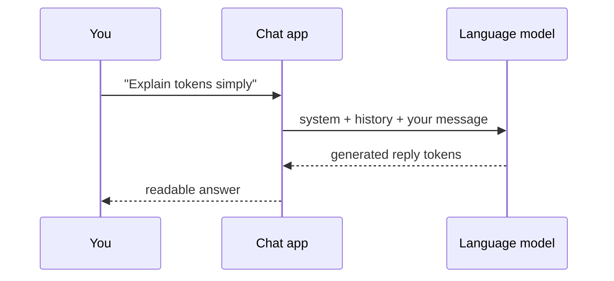
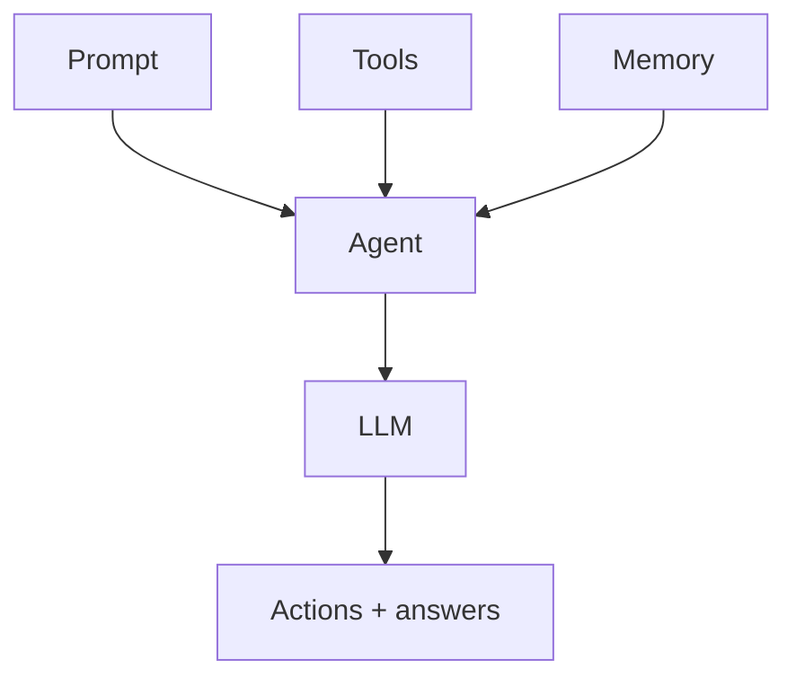
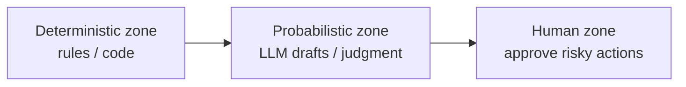

# 00-01 — GenAI From Scratch: Core Ideas

> **Study order:** Chapter numbers match Track D Block 1 sequence.


<!-- TRACK_D_SCOPE -->
> **Track D scope (primary course):** **CORE** · Depth: **Full**  
> Do the whole chapter. This is day one.  
> Full course map: [COURSE.md](../../COURSE.md) · This week: [Study Plan](../../Study%20Plan.md)
<!-- /TRACK_D_SCOPE -->

| Meta | Value |
|------|-------|
| **Estimated Time** | 3–4 hours (read 1.5h · tiny labs 1.5h · notes 30–45 min) |
| **Difficulty** | Beginner |
| **Prerequisites** | Curiosity. Optional: you have used ChatGPT / Claude / Gemini as a user. No ML background required. |
| **Module** | 00 — Foundations |
| **Related** | [COURSE.md](../../COURSE.md) · [00-02](00-02-Python-for-AI-Engineering.md) · [00-03](00-03-APIs-for-AI-Engineering.md) · [00-05](00-05-Mathematics-for-AI-Engineering.md) · [00-04](00-04-From-Rules-to-Agents.md) · [00-06](00-06-BankCo-Decision-Support-Warmup.md) · [01-01](../01-LLM-Engineering/01-01-Transformer-Architecture.md) · [Study Plan](../../Study%20Plan.md) |

---

## Learning Objectives

By the end of this chapter you will be able to:

1. Explain **AI → Machine Learning → Generative AI → LLM** in plain language.
2. Describe what happens when you type a prompt and get a reply (tokens in → tokens out).
3. Name the building blocks of GenAI products: **prompt, model, tools, memory, retrieval (RAG), evals**.
4. Tell the difference between a **chat demo**, an **LLM feature**, and an **agent**.
5. Run a **tiny first program** that calls an LLM API (or a mock if you have no key yet).
6. Know **what to learn next** on this handbook’s progressive path.

---

## Why Start Here

Many GenAI tutorials jump straight into frameworks, bank case studies, or production architecture diagrams. That feels like landing in the middle of a movie.

This chapter is the **opening scene**:

- What GenAI *is*
- What an LLM *does*
- What you can build *first*
- What this handbook will teach you *next*

Production judgment (cost, safety, audit trails, multi-agent systems) comes later — after the vocabulary sticks. You will meet those ideas again in [00-04](00-04-From-Rules-to-Agents.md), [00-06](00-06-BankCo-Decision-Support-Warmup.md), and Phase 2+.

---

## The Progressive Map (keep this in mind)



**Rule for this chapter:** If a diagram or term feels abstract, skip the detail and keep the one-sentence meaning. Depth comes in later modules.

---

## Core Concepts

### 1) AI, ML, GenAI, LLM — the nested dolls

| Term | Plain meaning | Everyday example |
|------|---------------|------------------|
| **AI** | Software that does tasks that used to need human-like judgment | Spam filter, face unlock, chess engine |
| **Machine Learning (ML)** | AI that learns patterns from data instead of only hand-written rules | “This email looks like spam” from millions of labeled emails |
| **Generative AI (GenAI)** | ML that *creates* new content (text, images, code, audio) | Write an email draft; generate an image |
| **Large Language Model (LLM)** | A GenAI model trained to predict the next piece of text | ChatGPT, Claude, Gemini, DeepSeek |



**Interview-ready one-liner:**  
> “An LLM is a generative model specialized for language. GenAI is broader (images, audio, video). ML is broader still. AI is the umbrella.”

---

### 2) What an LLM actually does

An LLM does **not** “look up answers in a database” by default. It predicts **likely next tokens** given the text so far — like an extremely well-trained autocomplete.

| Word | Meaning |
|------|---------|
| **Token** | A chunk of text the model reads/writes (often ~¾ of a word, sometimes a whole word or punctuation) |
| **Prompt / input** | The text (and sometimes images) you send the model |
| **Completion / output** | The tokens the model generates in reply |
| **Context window** | How much text the model can consider at once (input + output budget) |
| **Temperature** | How “adventurous” sampling is (low ≈ safer/more repetitive; high ≈ more varied) |



**Intuition:** You give the model a situation and instructions. It continues in a way that *sounds* right based on training. That is powerful — and also why it can invent plausible falsehoods (**hallucinations**).

---

### 3) The chat you already know

Products like ChatGPT wrap an LLM in a **conversation UI**:

1. System message (optional): “You are a helpful tutor…”
2. User message: your question
3. Assistant message: the model’s reply
4. Next turn includes prior messages so it feels like memory



Under the hood it is still: **text in → model → text out**. The app adds history, formatting, safety filters, and billing.

---

### 4) From demo → feature → system (without the enterprise maze)

You will see three levels throughout this handbook:

| Level | What it is | Example |
|-------|------------|---------|
| **L1 Demo** | Notebook or chat that works on a happy path | “Summarize this paragraph” in a Colab |
| **L2 Feature** | LLM call inside a real product path | “Draft reply” button in a support tool |
| **L3 System** | Feature + tools + memory + retrieval + evals + safety + cost controls | Support agent that looks up orders, abstains when unsure, logs everything |

**For now:** Build L1 until the ideas feel boring. Then L2. Only then chase L3.

---

### 5) The pieces of a GenAI product (simple kit)

When people say “we built an AI product,” they usually assembled some of these:

| Piece | Job | Beginner analogy |
|-------|-----|------------------|
| **Prompt** | Instructions + task | A recipe card for the model |
| **Model (LLM)** | Language / reasoning engine | The cook |
| **Tools** | Let the model call APIs, search, calc, etc. | Kitchen appliances |
| **Memory** | Keep state across steps or sessions | Scratchpad / customer file |
| **RAG (retrieval)** | Fetch relevant docs before answering | Looking up the employee handbook before answering HR questions |
| **Evals** | Tests that check quality over time | Unit tests + taste tests |

A compact way to remember agents (you will use this equation for months):

\[
\text{Agent} = (\text{Prompt} + \text{Tools} + \text{Memory}) \times \text{LLM}
\]

**Read it as:** The model is the multiplier. Without tools/memory/clear prompts, you mostly have a chatbot. Without a capable model, the rest cannot reason well.



You do **not** need a full agent for every task. Many great products are one well-designed prompt + one API call.

---

### 6) When GenAI helps — and when it does not

| Prefer GenAI when… | Prefer normal code / rules when… |
|--------------------|----------------------------------|
| Language is messy or open-ended | Steps are known and stable |
| You need drafts, summaries, extraction | Exact math, billing, eligibility |
| Judgment over ambiguous text | Must be identical every time |
| Humans can review risky outputs | Mistakes are expensive and hard to reverse |

**Starter rule of thumb:**  
Use **code for decisions that must be right**. Use **LLMs for language and judgment over text**. Combine them often (rules decide; LLM drafts the email).

That hybrid idea returns in [00-04](00-04-From-Rules-to-Agents.md) and the BankCo warmup [00-06](00-06-BankCo-Decision-Support-Warmup.md) — after you can call a model confidently.

---

### 7) Four things every GenAI builder watches

Even as a beginner, notice these four “currencies”:

| Currency | Question you ask |
|----------|------------------|
| **Quality** | Did it solve the user’s task? |
| **Latency** | Was it fast enough? |
| **Cost** | What did tokens / tools cost? |
| **Risk** | Could it leak data, mislead, or take a bad action? |

You do not need dashboards yet. Just practice naming which currency you care about in each lab.

---

## Implementation — Your first LLM call

Goal: feel the request/response loop. No FastAPI, no banks, no agents.

### Option A — Real API (OpenAI-compatible)

1. Create an API key from a provider (OpenAI, or another OpenAI-compatible endpoint).
2. Install the SDK:

```bash
pip install openai
export OPENAI_API_KEY="your_key_here"
```

3. Run:

```python
"""hello_llm.py — smallest useful GenAI program."""

import os
from openai import OpenAI

client = OpenAI()  # reads OPENAI_API_KEY from the environment

response = client.chat.completions.create(
    model="gpt-4.1-mini",  # or another small/cheap chat model you have access to
    messages=[
        {
            "role": "system",
            "content": "You explain technical ideas to beginners in 3 short bullets.",
        },
        {
            "role": "user",
            "content": "What is a token in an LLM?",
        },
    ],
    temperature=0.2,
)

print(response.choices[0].message.content)
print("---")
print("prompt tokens:", response.usage.prompt_tokens)
print("completion tokens:", response.usage.completion_tokens)
```

**What to notice**

- `messages` = the chat format from Concept 3.
- `temperature=0.2` = more focused replies.
- `usage` = you are already measuring **cost inputs** (tokens).

### Option B — No API key yet (offline mock)

```python
"""hello_llm_mock.py — practice the shape of a call without a key."""

def fake_chat(messages: list[dict[str, str]]) -> str:
    user = next(m["content"] for m in messages if m["role"] == "user")
    return (
        "Mock reply (no API key):\n"
        f"- You asked: {user!r}\n"
        "- In a real call, an LLM would continue this conversation with tokens.\n"
        "- Next step: set OPENAI_API_KEY and run hello_llm.py."
    )


messages = [
    {"role": "system", "content": "Be concise."},
    {"role": "user", "content": "What is Generative AI?"},
]
print(fake_chat(messages))
```

Same *shape*, fake *engine*. Export a real key when you are ready.

---

## Hands-on Labs

### Lab A — Prompt swap (20 min)

Change only the **system** message three times (tutor / pirate / strict editor). Keep the user question fixed. Write one sentence on how output style changed.

### Lab B — Token awareness (20 min)

Ask for a 1-sentence answer, then a 2-paragraph answer. Compare `completion_tokens`. Quality is not “more tokens.”

### Lab C — Failure watching (20 min)

Ask a question that needs a private fact the model cannot know (e.g. “What is *my* employee ID?”). Note whether it invents an answer. That instinct — **catching hallucination** — is core GenAI engineering.

---

## Mini Project

**Title:** Personal Explain-It Bot (CLI)  
**Done when:**

1. You can send a topic from the command line.
2. The bot replies in ≤5 bullets for beginners.
3. You print token usage each run.
4. README says which model you used and why (cheap vs quality).

---

## Common Beginner Mistakes

1. Jumping to LangChain / LangGraph / multi-agent before a raw API call feels natural.
2. Treating the model as a database of truth.
3. Writing huge prompts before defining the task in one sentence.
4. Measuring success by “it sounded smart” instead of “it completed the task.”
5. Skipping Python/API fluency — production GenAI *is* software engineering with probabilistic components.

---

## How This Handbook Sequences Learning

| Order | Chapter / phase | You will learn |
|------:|-----------------|----------------|
| 1 | **00-01 (this page)** | Vocabulary + first call |
| 2 | [00-02 Python](00-02-Python-for-AI-Engineering.md) | Typing, async, clean scripts |
| 3 | [00-03 APIs](00-03-APIs-for-AI-Engineering.md) | FastAPI, schemas, HTTP for AI services |
| 4 | [00-05 Math](00-05-Mathematics-for-AI-Engineering.md) | Vectors & similarity (needed for RAG later) |
| 5 | [00-04](00-04-From-Rules-to-Agents.md) · optional [00-06](00-06-BankCo-Decision-Support-Warmup.md) | When rules beat agents; first decision-support design |
| 6 | Phase 1 — LLM Engineering | Transformers, tokens, providers, prompting |
| 7 | Phases 2–11 | Agents, RAG, multi-agent, LLMOps, security, leadership |

Full week-by-week plan: [Master Study Roadmap](../../Master%20Study%20Roadmap.md) · [Study Plan](../../Study%20Plan.md).

---

## Preview: trust zones (learn the picture, not the enterprise build)

Later chapters separate systems into three zones. Memorize the idea now; implement it in [00-06](00-06-BankCo-Decision-Support-Warmup.md).



| Zone | Examples | Why |
|------|----------|-----|
| Deterministic | Prices, eligibility, permissions | Must be auditable and stable |
| Probabilistic | Email wording, summarize a ticket | Language flexibility |
| Human | Send email, issue refund | Irreversible or high blast radius |

---

## Check Your Understanding

Answer in your own words (2–4 sentences each):

1. How is GenAI different from classical ML classification?
2. What is a token, and why should builders care?
3. When would you *not* use an LLM?
4. What does `Agent = (Prompt + Tools + Memory) × LLM` mean in one sentence?
5. What will you study immediately after this chapter?

---

## Interview Questions (gentle start)

### Beginner / career switcher

1. Explain LLM vs GenAI to a non-engineer.
2. What is a hallucination? Give an example.
3. What happens between pressing Enter in ChatGPT and seeing a reply?

### Senior (preview — revisit after Phase 1)

1. Demo vs feature vs production system — where does your last project sit?
2. Which of quality / latency / cost / risk would you optimize first for an internal FAQ bot?

---

## Revision Notes

- GenAI **creates**; classical ML often **labels / predicts a class**.
- LLMs predict **tokens**, not guaranteed facts.
- Start with **one prompt + one model call**.
- Agents add **tools + memory + a loop** — only when needed.
- Put **hard rules in code**; put **language in models**.
- Next: Python craft → APIs → math intuition → rules vs agents → how LLMs work inside.

---

## Summary

You now have the minimum map to learn GenAI without drowning: nested definitions, the prompt→token→reply loop, the product kit (prompt / model / tools / memory / RAG / evals), and a tiny working (or mocked) API call. Everything else in this handbook is depth on these same pieces.

---

## Further Reading

| Title | URL | Difficulty | Reading Time | Why Read | Important Sections |
|-------|-----|------------|--------------|----------|--------------------|
| OpenAI — Text generation / chat concepts | https://platform.openai.com/docs/guides/text | Intro | 20–30 min | Solidify messages, models, tokens | Messages; models; token basics |
| Anthropic — Claude overview | https://docs.anthropic.com/en/docs/welcome | Intro | 20 min | Second provider vocabulary | Messages API mental model |
| Google — Gemini API quickstart | https://ai.google.dev/gemini-api/docs/quickstart | Intro | 20 min | Multi-provider habit early | First request |
| DeepSeek API docs | https://api-docs.deepseek.com/ | Intro | 15 min | Cost-efficient OpenAI-compatible option | First chat call |
| OpenAI Prompt Engineering Guide | https://developers.openai.com/api/docs/guides/prompt-engineering | Intro | 45 min | Prompts as clear instructions | Tactics; iteration |
| Chip Huyen — *AI Engineering* (book) | https://www.oreilly.com/library/view/ai-engineering/9781098166298/ | Intermediate | ongoing | Bridge from ideas to production later | Early chapters on AI eng vs ML eng |
| Karpathy — Intro to LLMs (talk) | https://www.youtube.com/watch?v=zjkBMFhNj_g | Intro | 60 min | Intuition without heavy math | Whole talk once |

> Papers like *Attention Is All You Need* and *ReAct* are excellent — but they belong in **Phase 1–2**, not day one. Do not start there.

---

## Resume Bullet (after labs)

- Built a beginner GenAI CLI that calls a chat model with explicit system/user roles, tracks token usage, and documents model choice tradeoffs for cost vs clarity.
