# 00-02 — From Rules to Agents: The Evolution of Intelligent Systems

| Meta | Value |
|------|-------|
| **Estimated Time** | 6–8 hours (read 3h · labs 3h · architecture memo 2h) |
| **Difficulty** | Intermediate (conceptual) · Advanced (implementation labs) |
| **Prerequisites** | [00-01 — AI Engineering Mindset](00-01-AI-Engineering-Mindset.md); comfortable Python; basic HTTP/API literacy |
| **Module** | 00 — Foundations |
| **Related** | [00-01](00-01-AI-Engineering-Mindset.md) · [00-03](00-03-BankCo-Decision-Support-Warmup.md) · [03-01](../03-Agentic-Fundamentals/03-01-Agent-Anatomy-and-Loop.md) · [03-03](../03-Agentic-Fundamentals/03-03-Agentic-Design-Patterns.md) · [Architecture Index](../../Architecture Index.md) |

---

## Learning Objectives

By the end of this chapter you will be able to:

1. Trace the **historical arc** from rule-based systems → classical ML → generative AI → LLM-powered agents.
2. Explain **why LLMs alone are insufficient** for production systems and what gaps agents fill.
3. Apply **Agent = (Prompt + Tools + Memory) × LLM** as a decomposition for architecture reviews.
4. Classify **prompt engineering techniques** at a high level and know when each applies.
5. Implement a minimal **Think → Act → Observe** agent loop with tools and structured outputs.
6. Introduce **Routing** and **Reflection** patterns and decide when they earn their complexity.
7. Defend technology choices in **Senior/Staff/Principal** interviews with explicit tradeoffs.

---

## Why This Topic Matters

Every AI system you ship sits somewhere on a spectrum. Misplacing your design—using an agent where rules suffice, or using rules where language understanding is required—is the most common architectural failure in GenAI programs.

Teams that treat "we added ChatGPT" as equivalent to "we built an agent" discover, painfully, that:

- **LLMs hallucinate facts** they were never given.
- **LLMs cannot act** on databases, APIs, or file systems without tools.
- **LLMs forget** prior turns unless memory is engineered.
- **LLMs optimize fluency**, not business correctness.

Understanding the evolution is not academic nostalgia. It is how you **choose the right primitive**:

| Era | Primitive | You buy | You pay |
|-----|-----------|---------|---------|
| Rules | `if/else`, decision tables | Determinism, auditability | Brittleness, maintenance |
| Classical ML | Features → classifier | Generalization on structured data | Labeling, drift, explainability |
| GenAI / LLM | Next-token prediction | Language + reasoning over text | Non-determinism, cost, safety |
| Agent | LLM + loop + tools + memory | Goal pursuit in messy environments | Latency, orchestration, incidents |

This chapter gives you the vocabulary to say, in a design review: *"This step belongs in code, this step belongs in a classifier, this step belongs in a one-shot LLM call, and only this subgraph needs an agent loop."*

That sentence is worth more than any framework installation.

---

## Business Impact

| Business outcome | How evolution literacy changes decisions |
|------------------|------------------------------------------|
| **Time-to-market** | Ship rules/classifiers first; add LLM only where language variance exists |
| **Unit economics** | Avoid $0.50 agent loops for $div0.001 classification tasks |
| **Compliance** | Keep eligibility/pricing in auditable code; use LLM at the edges |
| **Customer trust** | Ground answers with tools/RAG instead of confident fabrication |
| **Incident rate** | Reflection and routing add cost—deploy only when quality ROI is proven |
| **Hiring signal** | Candidates who explain *when not to agent* outperform framework tourists |

---

## Architecture Overview

Production intelligent systems are **layered**, not replaced:

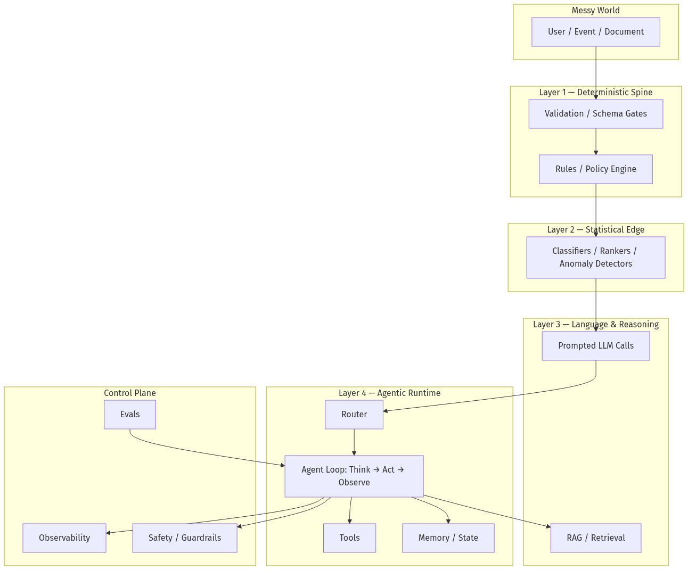

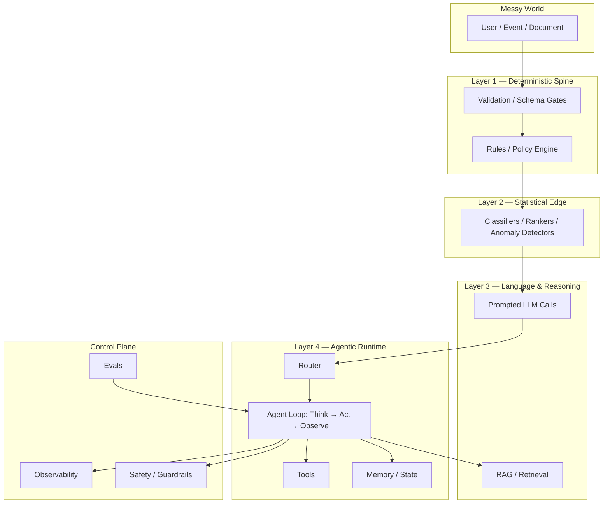
```mermaid
flowchart TB
    subgraph Input["Messy World"]
      U[User / Event / Document]
    end
    subgraph Layer1["Layer 1 — Deterministic Spine"]
      R[Rules / Policy Engine]
      V[Validation / Schema Gates]
    end
    subgraph Layer2["Layer 2 — Statistical Edge"]
      C[Classifiers / Rankers / Anomaly Detectors]
    end
    subgraph Layer3["Layer 3 — Language & Reasoning"]
      P[Prompted LLM Calls]
      RG[RAG / Retrieval]
    end
    subgraph Layer4["Layer 4 — Agentic Runtime"]
      RT[Router]
      AL[Agent Loop: Think → Act → Observe]
      TL[Tools]
      MEM[Memory / State]
    end
    subgraph Control["Control Plane"]
      EV[Evals]
      OB[Observability]
      SF[Safety / Guardrails]
    end
    U --> V --> R
    R --> C
    C --> P
    P --> RT
    RT --> AL
    AL --> TL
    AL --> MEM
    AL --> RG
    AL --> SF
    AL --> OB
    EV --> AL
```

**Mental model:** Rules are **compiled policy**. Classical ML is **learned policy from features**. LLMs are **soft programs over language**. Agents are **operating systems** that schedule those soft programs and connect them to the world through syscalls (tools).

Deep dives: [03-01 — Agent Anatomy and Loop](../03-Agentic-Fundamentals/03-01-Agent-Anatomy-and-Loop.md) · [03-03 — Agentic Design Patterns](../03-Agentic-Fundamentals/03-03-Agentic-Design-Patterns.md)

---

## Core Concepts

### 1) Rule-Based Systems

#### Definition

A **rule-based system** encodes behavior as explicit, human-authored logic: condition → action. Examples include decision tables, expert systems, BPMN workflows, regex routers, and policy engines (`if severe_flag: escalate`).

#### Intuition

Rules are **laws written in code**. If the world matches the law's preconditions, the outcome is guaranteed (modulo bugs). There is no "probably."

#### Mental Model

| Concept | Analogy |
|---------|---------|
| Rule | Statute |
| Rule engine | Court clerk applying statutes |
| Conflict resolution | Priority / specificity ordering |
| Maintenance | Legislative process (slow, deliberate) |

#### Architecture

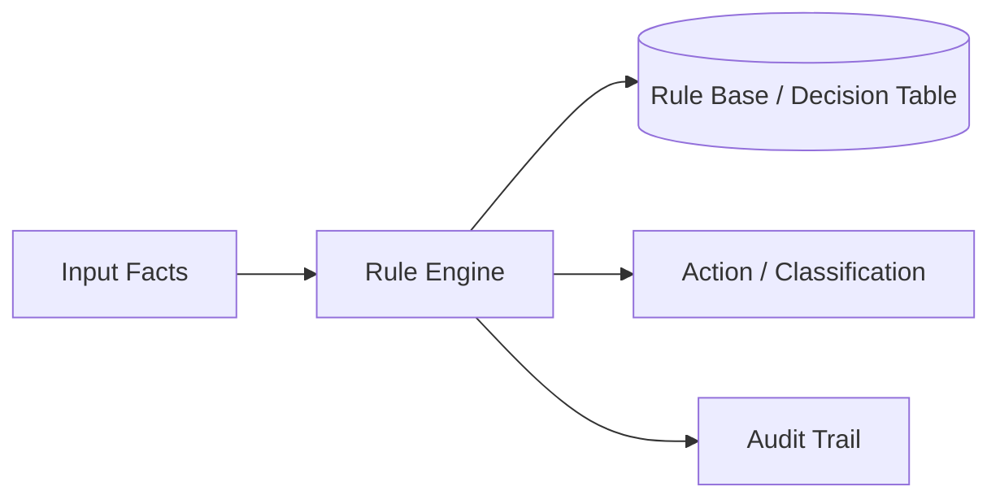
```mermaid
flowchart LR
    IN[Input Facts] --> RE[Rule Engine]
    KB[(Rule Base / Decision Table)]
    RE --> KB
    RE --> OUT[Action / Classification]
    RE --> LOG[Audit Trail]
```

#### Implementation

Rules belong in **version-controlled code or tables**, not in prompts:

```python
from enum import Enum

class TicketPriority(str, Enum):
    P0 = "p0"
    P1 = "p1"
    P2 = "p2"
    P3 = "p3"


def priority_from_rules(severity: str, customer_tier: str, is_outage: bool) -> TicketPriority:
    """Deterministic spine — always unit-test this."""
    if is_outage and customer_tier == "enterprise":
        return TicketPriority.P0
    if severity == "critical":
        return TicketPriority.P1
    if customer_tier == "enterprise":
        return TicketPriority.P2
    return TicketPriority.P3
```

#### Why it exists

Before cheap compute and labeled data, the only way to automate decisions was to **encode expert knowledge explicitly**. Banks, insurers, and telcos still run billions of dollars through rule engines because regulators can read a decision table.

#### When to use

- Procedure is **stable and known**.
- **Auditability** and **explainability** are mandatory.
- Inputs map cleanly to **structured fields**.
- Errors must be **impossible**, not unlikely.

#### When NOT to use

- Language is the input (free-text complaints, legal contracts, chat).
- Rules explode combinatorially ("we have 4,000 exceptions").
- The domain shifts weekly and nobody can update the table fast enough.

#### Alternatives

| Alternative | Tradeoff |
|-------------|----------|
| Classical ML classifier | Needs labels; less interpretable per row |
| LLM extraction → rules | Hybrid: LLM parses text to features; rules decide |
| Case-based reasoning | Similar brittleness, different representation |

#### Advantages

Deterministic, fast (microseconds), cheap, testable, regulator-friendly.

#### Limitations

Brittle to phrasing, expensive maintenance, no graceful handling of ambiguity.

#### Tradeoffs

| Spend | Buy |
|-------|-----|
| Engineering time maintaining rules | Zero inference cost, perfect replay |

#### Performance

Microseconds to low milliseconds. Horizontally trivial—pure CPU.

#### Cost

Engineering labor dominates; runtime cost ≈ $0.

#### Security

Rules fail closed when written well. Risk: **shadow rules** in prompts bypassing the engine.

#### Scalability

Excellent. Stateless evaluation scales linearly.

#### Interview discussion

> "We keep refund *eligibility* in rules. We might use an LLM to *summarize* the customer's narrative for the agent—never to decide eligibility."

#### Production examples

- Payment fraud blocklists and velocity checks
- Airline crew scheduling legality constraints
- Tax calculation engines
- Feature flags and entitlement checks

---

### 2) Classical Machine Learning

#### Definition

**Classical ML** learns a function \(f: \mathcal{X} \rightarrow \mathcal{Y}\) from labeled examples or reward signals. Features are explicit (or engineered); models include logistic regression, gradient boosted trees, random forests, SVMs, and small neural nets for structured tasks.

#### Intuition

Instead of writing every law, you **show the system thousands of precedents** and let it interpolate. It generalizes within the distribution of training data.

#### Mental Model

| Concept | Analogy |
|---------|---------|
| Features | Measurements a doctor takes before diagnosis |
| Training | Studying past cases |
| Inference | Diagnosis on a new patient |
| Drift | Disease evolves; textbook doesn't |

#### Architecture

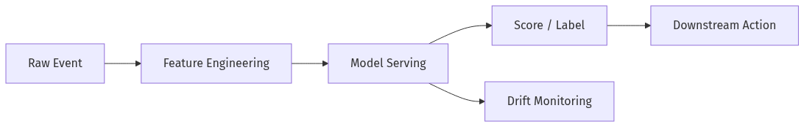

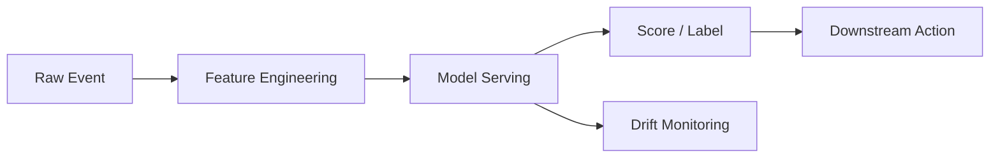
```mermaid
flowchart LR
    RAW[Raw Event] --> FE[Feature Engineering]
    FE --> M[Model Serving]
    M --> SC[Score / Label]
    M --> MON[Drift Monitoring]
    SC --> ACT[Downstream Action]
```

#### Implementation

```python
from pydantic import BaseModel, Field

class SupportTicketFeatures(BaseModel):
    word_count: int = Field(ge=0)
    exclamation_count: int = Field(ge=0)
    customer_tier: str
    product_area: str
    hours_since_last_contact: float = Field(ge=0)


def predict_churn_risk(features: SupportTicketFeatures, model) -> float:
    """Classical ML belongs on structured features — not raw essay text."""
    vector = [
        features.word_count,
        features.exclamation_count,
        1 if features.customer_tier == "enterprise" else 0,
        features.hours_since_last_contact,
    ]
    return float(model.predict_proba([vector])[0][1])
```

#### Why it exists

Rules don't scale when patterns are **statistical**, not logical. "Looks like fraud" across 200 subtle signals is a ML problem.

#### When to use

- Stable **feature schema** exists or can be extracted.
- Labels or proxies available.
- Latency SLO in milliseconds to low tens of ms.
- Need ranking, scoring, anomaly detection at scale.

#### When NOT to use

- Task requires multi-step reasoning over documents without a feature pipeline.
- Label cost is prohibitive and zero-shot language understanding is "good enough."
- Explainability requirements forbid opaque models (varies by jurisdiction).

#### Alternatives

| Alternative | When |
|-------------|------|
| Rules | Fully known logic |
| LLM zero-shot | Rapid prototype; low traffic |
| Deep learning on raw text | Large data; NLP-specific |

#### Advantages

Cheap inference, fast, measurable precision/recall, mature MLOps tooling.

#### Limitations

Feature engineering tax, label dependency, silent drift, weak on long unstructured prose without NLP stack.

#### Tradeoffs

| Spend | Buy |
|-------|-----|
| Labels + features + retraining | Consistent quality on structured tasks at scale |

#### Performance

Sub-10 ms inference for tree models at P95 is standard with proper serving.

#### Cost

Training periodic; inference fractions of a cent per call self-hosted.

#### Security

Risk: **adversarial features** (e.g., manipulated inputs). Mitigate with schema validation and outlier detection.

#### Scalability

Excellent with model servers (TorchServe, TF Serving, SageMaker endpoints).

#### Interview discussion

> "I'd use XGBoost on tabular features for routing tickets to queues. I'd use an LLM only when the ticket is ambiguous *after* feature extraction—or for drafting the reply."

#### Production examples

- Spam / phishing classifiers
- Credit risk scoring (often hybrid with rules)
- Search ranking and ads CTR
- Netflix-style recommendation (not GenAI-era, still ML)

---

### 3) Generative AI and Large Language Models (LLMs)

#### Definition

**Generative AI** models learn to produce content—text, code, images, audio—from training data. **LLMs** are generative models over token sequences, typically based on the Transformer architecture ([Vaswani et al., 2017](https://arxiv.org/abs/1706.03762)). They implement conditional next-token prediction: \(P(x_t \mid x_{<t})\).

#### Intuition

An LLM is a **completion engine** that has read a large slice of human writing. It doesn't "know" facts; it predicts plausible continuations. With scale and alignment, continuations resemble reasoning, dialogue, and code.

#### Mental Model

| Concept | Analogy |
|---------|---------|
| LLM | Extremely well-read improv partner |
| Context window | Short-term working memory on the desk |
| System prompt | Briefing before the scene |
| Temperature | Creativity dial |
| Weights | Compressed patterns from training—not a database |

#### Architecture

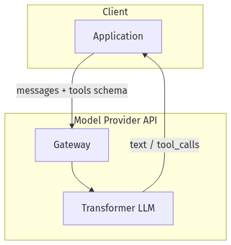

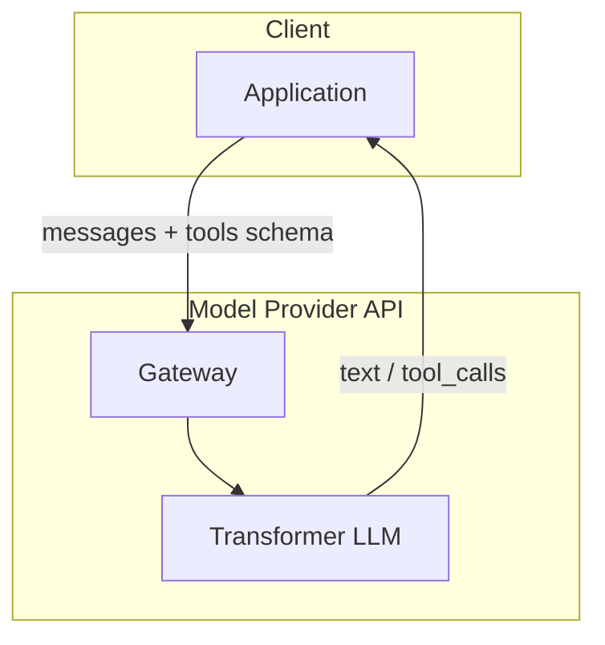
```mermaid
flowchart TB
    subgraph Client
      APP[Application]
    end
    subgraph Provider["Model Provider API"]
      GW[Gateway]
      LLM[Transformer LLM]
    end
    APP -->|messages + tools schema| GW --> LLM
    LLM -->|text / tool_calls| APP
```

#### Implementation

One-shot LLM call with structured output contract:

```python
import os
from openai import OpenAI
from pydantic import BaseModel, Field

client = OpenAI()


class SentimentResult(BaseModel):
    label: str = Field(description="positive | neutral | negative")
    confidence: float = Field(ge=0, le=1)
    key_phrases: list[str]


def analyze_sentiment(text: str) -> SentimentResult:
    response = client.responses.parse(
        model="gpt-4.1-mini",
        input=[
            {
                "role": "system",
                "content": (
                    "Classify customer message sentiment. "
                    "Return JSON matching the schema. Do not invent facts."
                ),
            },
            {"role": "user", "content": text},
        ],
        text_format=SentimentResult,
    )
    return response.output_parsed
```

#### Why it exists

Classical NLP pipelines (tokenize → POS → parse → …) shattered on **open-domain language**. LLMs unify understanding and generation in one interface: **prompt in, text out**.

#### When to use

- Unstructured language is the primary input.
- Task is **single-turn** or few-turn with clear output schema.
- Rapid iteration beats months of labeling.
- Quality bar allows probabilistic outputs with human review.

#### When NOT to use

- Numeric decisions with legal exposure (pricing, eligibility).
- Real-time paths needing guaranteed sub-10 ms.
- Tasks with stable labels where ML is cheaper at scale.
- When you cannot tolerate hallucination without grounding.

#### Alternatives

| Alternative | When |
|-------------|------|
| Fine-tuned smaller model | High volume, narrow domain |
| Classical NLP + rules | Extremely constrained grammar |
| Human team | Low volume, zero error tolerance |

#### Advantages

Zero-shot flexibility, rich language output, tool-calling interfaces, rapid prototyping.

#### Limitations

Hallucination, non-determinism, context limits, cost at long context, knowledge cutoff, prompt injection surface.

#### Tradeoffs

| Spend | Buy |
|-------|-----|
| Tokens + latency + safety work | Language understanding without feature pipelines |

#### Performance

TTFT hundreds of ms; total latency grows with output tokens. Batch where possible.

#### Cost

Dominates many GenAI COGS lines—especially long contexts and agent loops.

#### Security

Prompt injection, data exfiltration via tools, PII in logs. See Security section.

#### Scalability

Scale via provider; watch rate limits and concurrency caps.

#### Interview discussion

> "An LLM call is not an agent. It's one function evaluation of a soft program. I only wrap it in a loop when the task requires sequential decisions with environmental feedback."

#### Production examples

- Drafting marketing copy with human approval
- Code explanation in IDEs
- Summarization of call transcripts
- Structured extraction from semi-standard forms

---

### 4) Why LLMs Alone Are Insufficient

#### Definition

**LLM insufficiency** is the gap between fluent text generation and **reliable autonomous work**: grounding in fresh truth, taking actions, maintaining state, and meeting business guarantees.

#### Intuition

Asking an LLM alone to run your support org is like hiring a eloquent consultant with **no phone, no laptop, no memory of yesterday, and no accountability**—but unlimited confidence.

#### Mental Model — Four Gaps

| Gap | Symptom without fix | Agent ingredient |
|-----|---------------------|------------------|
| **Grounding** | Invented order IDs, fake citations | Tools, RAG, structured APIs |
| **Action** | "I have cancelled your subscription" (lie) | Tool execution with auth |
| **State** | Re-asks same questions; loops | Memory, checkpoints |
| **Contract** | Output shape drift | Prompt + schema + validators |

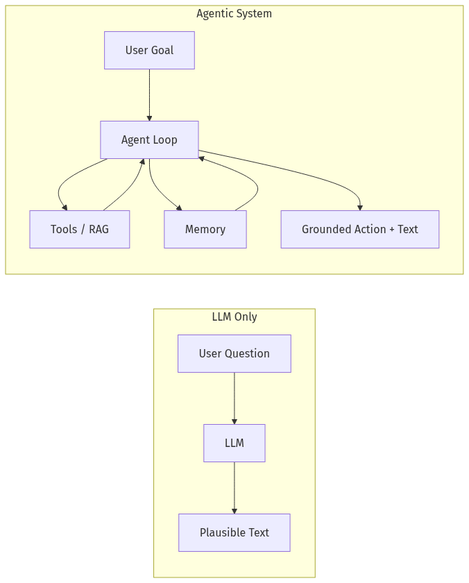

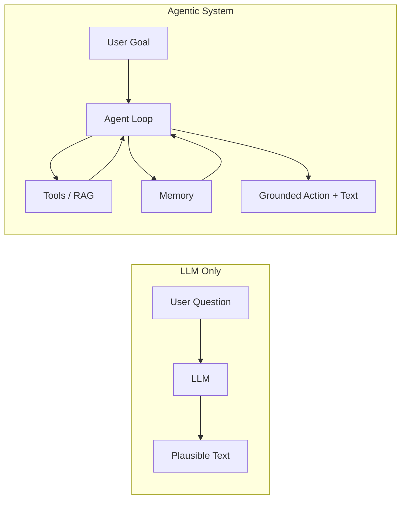
```mermaid
flowchart LR
    subgraph LLM_Only["LLM Only"]
      Q[User Question] --> LLM1[LLM]
      LLM1 --> A1[Plausible Text]
    end
    subgraph Agentic["Agentic System"]
      Q2[User Goal] --> AG[Agent Loop]
      AG --> T[Tools / RAG]
      T --> AG
      AG --> M[Memory]
      M --> AG
      AG --> A2[Grounded Action + Text]
    end
```

#### Architecture

Production systems wrap the LLM:

```text
┌─────────────────────────────────────────────┐
│ Agent Runtime                               │
│  ┌─────────┐  ┌───────┐  ┌──────────────┐  │
│  │ Prompt  │  │ Tools │  │ Memory/State │  │
│  │ contract│  │ layer │  │ store        │  │
│  └────┬────┘  └───┬───┘  └──────┬───────┘  │
│       └───────────┼─────────────┘          │
│                   ▼                        │
│              ┌─────────┐                   │
│              │   LLM   │                   │
│              └─────────┘                   │
└─────────────────────────────────────────────┘
```

#### Implementation

See Agent Equation section and full FastAPI implementation below.

#### Why it exists

Transformers predict tokens. They were not trained to **invoke Stripe APIs correctly** or **remember your user's timezone** unless you engineer the runtime.

#### When to use full agent stack

When ≥2 of: multi-step plans, external actions, session continuity, dynamic tool choice.

#### When NOT to use

Single-turn Q&A with retrieved docs → RAG + one LLM call may suffice.

#### Alternatives

| Pattern | Description |
|---------|-------------|
| RAG-only | Retrieval + one generation |
| Workflow engine | Fixed DAG with LLM nodes |
| Copilot | Human executes suggested actions |

#### Advantages of acknowledging gaps

Prevents category errors in architecture reviews; focuses budget on real bottlenecks.

#### Limitations

Agent stack adds latency, cost, failure modes.

#### Tradeoffs

| Minimal LLM | Full agent |
|-------------|------------|
| Cheaper, simpler | Capable, expensive |

#### Performance

Each tool round-trip adds latency. Budget 2–5× single-call latency for simple agents.

#### Cost

Tool calls + longer contexts + multiple LLM steps → multiplicative token spend.

#### Security

Tools increase blast radius. LLM-only is unsafe to *users* (misinformation); agents are unsafe to *systems* (actions).

#### Scalability

State management and tool quotas become bottlenecks before LLM throughput.

#### Interview discussion

> "The LLM is the reasoning core, not the system. I'd diagram trust boundaries: what can touch money, what can only read, what's logged."

#### Production examples

- Chatbot that only talks → LLM (+ maybe RAG)
- Assistant that books meetings → agent with calendar tool + memory
- Refund bot → agent + policy code + approval tool

---

### 5) The Agent Equation

#### Definition

\[
\text{Agent} = (\text{Prompt} + \text{Tools} + \text{Memory}) \times \text{LLM}
\]

**Prompt** = goals, constraints, persona, output contract.  
**Tools** = functions the model can invoke (APIs, SQL, search, code exec).  
**Memory** = short-term (context) + long-term (vector DB, session store).  
**LLM** = planner / reasoner / language interface.  
**×** = the model **activates** the sum; without it, you have inert config.

#### Intuition

Prompts are the **job description**. Tools are **hands**. Memory is **notes**. The LLM is the **employee**. Fire the employee (bad model) and the desk is empty. Remove the hands and you get hallucinated work product.

#### Mental Model

| Component | OS analogy |
|-----------|------------|
| Prompt | Process configuration |
| Tools | Syscalls |
| Memory | RAM + filesystem |
| LLM | CPU (probabilistic) |

#### Architecture

Cross-reference [00-01](00-01-AI-Engineering-Mindset.md) for the full sociotechnical diagram and [03-01](../03-Agentic-Fundamentals/03-01-Agent-Anatomy-and-Loop.md) for loop internals.

#### Implementation

Minimal typed agent configuration:

```python
from pydantic import BaseModel, Field


class AgentConfig(BaseModel):
    system_prompt: str
    tool_names: list[str] = Field(default_factory=list)
    memory_backend: str = "in_memory"  # redis | postgres | vector
    model: str = "gpt-4.1-mini"
    max_steps: int = Field(default=8, ge=1, le=32)


SUPPORT_AGENT = AgentConfig(
    system_prompt=(
        "You are a support agent. Never invent order IDs. "
        "Use tools for all lookups. Escalate if policy blocks action."
    ),
    tool_names=["lookup_order", "create_ticket", "search_kb"],
    memory_backend="redis",
    max_steps=10,
)
```

#### Why it exists

Products need **reliable composition** of capabilities LLMs don't natively have. The equation is a **design checklist**, not marketing.

#### When to use

Building any system marketed as "AI agent" or "autonomous assistant" with side effects.

#### When NOT to use

Batch summarization pipeline. Use Prompt + LLM only.

#### Alternatives

Monolithic fine-tuned model with tool headers baked in—still needs runtime for tools.

#### Advantages

Separates concerns for testing: unit-test tools; eval prompts; integration-test loop.

#### Limitations

Multiplication implies **weakest link** dominates: brilliant LLM + bad tools = broken agent.

#### Tradeoffs

| More tools | More capability + more attack surface + slower |

#### Performance

Memory backend choice matters: Redis for session; vector for semantic recall.

#### Cost

Long system prompts + tool schemas consume input tokens every step.

#### Security

Tools must enforce auth **outside** the model. Memory must respect ACLs.

#### Scalability

Horizontally scale stateless workers; sticky sessions or external memory store.

#### Interview discussion

> "I decompose agent design into four reviewable artifacts: prompt version, tool manifest, memory schema, model pin."

#### Production examples

- OpenAI Assistants / Responses API with tool calling
- LangGraph graphs with checkpointing
- Claude tool use via Messages API ([Anthropic docs](https://platform.claude.com/docs/en/docs/build-with-claude/overview))

---

### 6) Prompt Engineering — High-Level Taxonomy

#### Definition

**Prompt engineering** is the discipline of designing inputs (instructions, examples, schemas, context) to steer model behavior toward a **contract**—not toward literary quality.

#### Intuition

Prompts are **APIs written in natural language**. Bad API design causes integration failures.

#### Mental Model — Technique Types

| Type | Mechanism | Example use |
|------|-----------|-------------|
| **Zero-shot** | Instruction only | "Extract dates as ISO-8601 JSON." |
| **Few-shot** | Exemplars in prompt | Show 3 ideal support replies |
| **System / role** | Persistent behavior | "You are a compliance reviewer…" |
| **Structured output** | Schema / JSON mode | Pydantic via `responses.parse` |
| **Chain-of-thought** | Ask for reasoning steps | Complex math, multi-constraint planning |
| **Decomposition** | Break task into sub-prompts | Research → outline → draft |
| **Meta-prompting** | Model improves prompt | Offline prompt optimization jobs |
| **Tool-aware** | Describe callable functions | OpenAI function / tool definitions |

Official reference: [OpenAI Prompt Engineering Guide](https://developers.openai.com/api/docs/guides/prompt-engineering)

#### Architecture

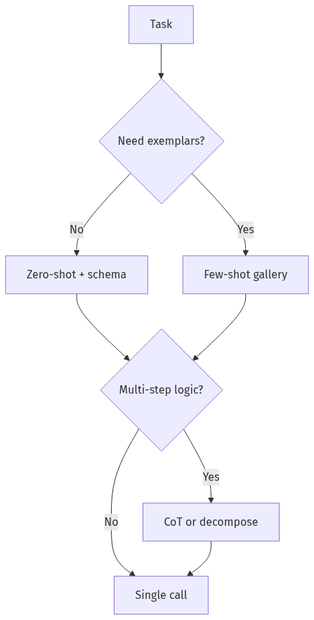

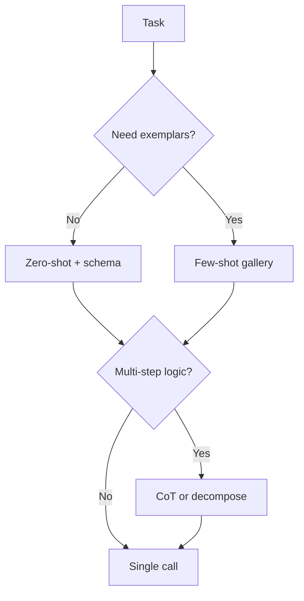
```mermaid
flowchart TD
    TASK[Task] --> Q{Need exemplars?}
    Q -->|No| ZS[Zero-shot + schema]
    Q -->|Yes| FS[Few-shot gallery]
    ZS --> C{Multi-step logic?}
    FS --> C
    C -->|Yes| COT[CoT or decompose]
    C -->|No| OUT[Single call]
    COT --> OUT
```

#### Implementation

```python
FEW_SHOT_EXAMPLES = """
Example 1
Input: "My package is late!!!"
Output: {"sentiment":"negative","intent":"shipping_delay"}

Example 2
Input: "Thanks, that fixed it."
Output: {"sentiment":"positive","intent":"closure"}
"""


def build_intent_prompt(message: str) -> list[dict]:
    return [
        {
            "role": "system",
            "content": (
                "Classify support messages. Return JSON only.\n"
                f"{FEW_SHOT_EXAMPLES}"
            ),
        },
        {"role": "user", "content": message},
    ]
```

#### Why it exists

Models are sensitive to phrasing. Prompt engineering is the **lowest-latency iteration surface** before fine-tuning.

#### When to use

| Technique | When |
|-----------|------|
| Zero-shot + schema | Stable output shape, clear instruction |
| Few-shot | Style/format consistency, edge cases |
| CoT | Debugging reasoning failures (watch token cost) |
| Decomposition | Single prompt exceeds reliable attention |

#### When NOT to use

- Replace missing **tools** ("please browse the web" without a browser tool).
- Encode **business policy** that belongs in code.
- Chasing 100% reliability without evals or fine-tuning.

#### Alternatives

Fine-tuning, RLHF/DPO, constrained decoding, grammar-guided generation.

#### Advantages

Fast iteration, no training pipeline, transferable across providers with adaptation.

#### Limitations

Prompt length costs tokens; exemplars stale; injection via user content.

#### Tradeoffs

| Longer prompts | Better edge behavior + higher $/call |

#### Performance

Few-shot and CoT increase input tokens → latency + cost.

#### Cost

Gallery maintenance is human time; runtime cost scales with prompt size.

#### Security

User messages can **override** instructions—mitigate with delimiters, privilege separation, tool sandboxing.

#### Scalability

Store prompt templates in registry; version like code.

#### Interview discussion

> "Prompt engineering is necessary but not sufficient. I pair it with schema validation and offline eval suites."

#### Production examples

- Support intent routers using JSON schema
- Legal clause extraction with few-shot notarized examples
- SQL generation with CoT hidden from user, only query executed

---

### 7) The Agent Loop — Think → Act → Observe

#### Definition

The **agent loop** is a control cycle where the model **plans** (Think), **invokes tools** (Act), and **incorporates results** (Observe), repeating until a stop condition. It formalizes ideas from [ReAct (Yao et al., 2022)](https://arxiv.org/abs/2210.03629).

#### Intuition

Like a developer in a REPL: read error, change code, run again—except the REPL is your API surface.

#### Mental Model

| Phase | Question answered |
|-------|-------------------|
| **Think** | What should I do next? |
| **Act** | Execute tool with args |
| **Observe** | What happened? |
| **Stop** | Goal met / budget exhausted / need human |

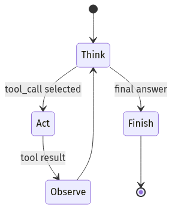

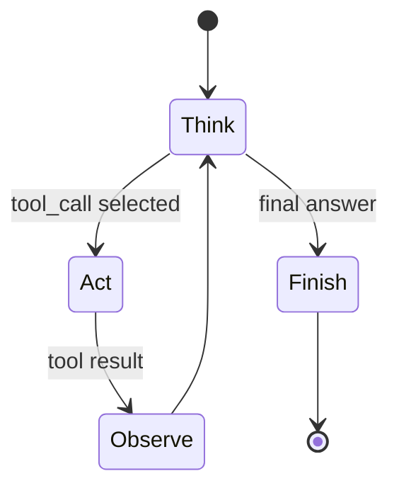
```mermaid
stateDiagram-v2
    [*] --> Think
    Think --> Act: tool_call selected
    Think --> Finish: final answer
    Act --> Observe: tool result
    Observe --> Think
    Finish --> [*]
```

#### Architecture

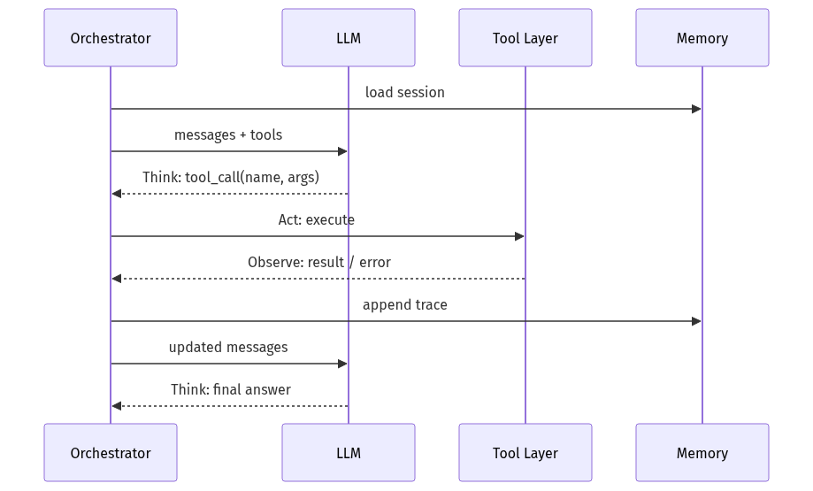

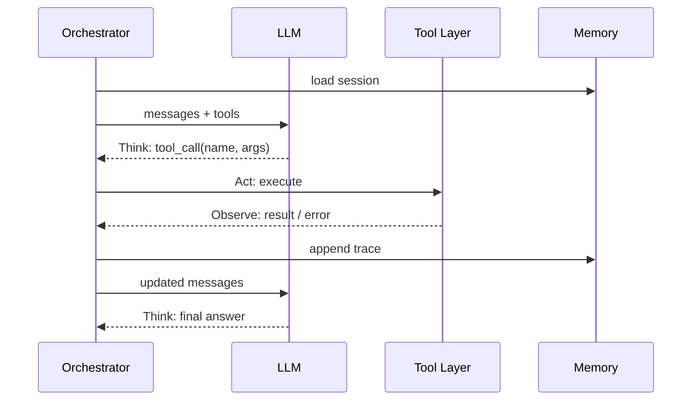
```mermaid
sequenceDiagram
    participant O as Orchestrator
    participant L as LLM
    participant T as Tool Layer
    participant M as Memory

    O->>M: load session
    O->>L: messages + tools
    L-->>O: Think: tool_call(name, args)
    O->>T: Act: execute
    T-->>O: Observe: result / error
    O->>M: append trace
    O->>L: updated messages
    L-->>O: Think: final answer
```

Deep dive: [03-01](../03-Agentic-Fundamentals/03-01-Agent-Anatomy-and-Loop.md)

#### Implementation

See full FastAPI service in Implementation section.

#### Why it exists

Many tasks are **sequential and contingent**. You cannot know the second API call until the first returns an ID.

#### When to use

Multi-hop retrieval, transactional workflows, debugging tasks, open-ended research with tools.

#### When NOT to use

Fixed pipeline of 3 steps always the same → use workflow engine, not agent.

#### Alternatives

| Alternative | When |
|-------------|------|
| DAG workflow | Known steps |
| Single-shot with JSON plan + executor | Plan once, execute in code |
| Human-in-the-loop stepping | High risk |

#### Advantages

Flexible, handles surprises, mirrors human problem-solving.

#### Limitations

Unbounded loops, compounding errors, token burn, harder testing.

#### Tradeoffs

| Higher max_steps | More success + more cost + more risk |

#### Performance

Each step = 1+ LLM call. Cap steps aggressively in production.

#### Cost

Dominant driver: `steps × (context + tool_schema tokens)`.

#### Security

Act phase is critical—validate args, authz per tool, no arbitrary code without sandbox.

#### Scalability

Use queues for long-running agents; checkpoint state ([LangGraph persistence](https://langchain-ai.github.io/langgraph/concepts/high_level/)).

#### Interview discussion

> "I always set max_steps, step timeout, and duplicate-action detection. ReAct without guardrails is a token bonfire."

#### Production examples

- Devin-style coding agents (read file → patch → run tests)
- Salesforce Agentforce-style CRM actions
- Internal IT bots (lookup user → reset MFA → confirm)

---

### 8) Routing Pattern (Introduction)

#### Definition

**Routing** sends an incoming request to the appropriate handler: model tier, prompt template, tool subset, or entirely non-LLM path.

#### Intuition

Air traffic control for queries—not every plane lands on the same runway.

#### Mental Model

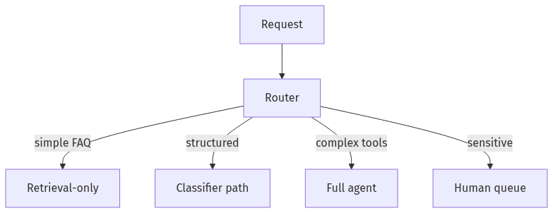

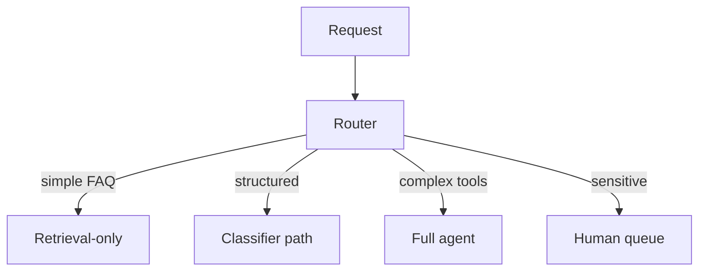
```mermaid
flowchart TD
    IN[Request] --> R[Router]
    R -->|simple FAQ| KB[Retrieval-only]
    R -->|structured| ML[Classifier path]
    R -->|complex tools| AG[Full agent]
    R -->|sensitive| HITL[Human queue]
```

#### Architecture

Router can be rules, ML classifier, embedding similarity, or **LLM-as-router** (expensive, use carefully).

#### Implementation

```python
from enum import Enum


class Route(str, Enum):
    FAQ = "faq"
    AGENT = "agent"
    ESCALATE = "escalate"


def route_request(message: str, customer_tier: str) -> Route:
    lowered = message.lower()
    if any(w in lowered for w in ("legal", "suicide", "lawyer")):
        return Route.ESCALATE
    if len(message) < 80 and "password" not in lowered:
        return Route.FAQ
    if customer_tier == "enterprise":
        return Route.AGENT
    return Route.FAQ
```

#### Why it exists

**Unit economics and safety.** Route easy work to cheap deterministic paths; reserve agents for high-value complexity.

#### When to use

Mixed traffic; multiple model tiers; clear intent clusters.

#### When NOT to use

Uniform high-complexity tasks where every request needs full tooling.

#### Alternatives

Single model for all; cascade (try cheap first, escalate on abstain).

#### Advantages

Cost control, latency optimization, blast-radius containment.

#### Limitations

Router errors are silent quality killers; needs eval on routing accuracy.

#### Tradeoffs

| Complex router (LLM) | Better accuracy + higher baseline cost |

#### Performance

Rule/ML routers: sub-ms. LLM router: +1 full inference.

#### Cost

Best ROI pattern in mature deployments—often saves 40–70% tokens.

#### Security

Escalation routes for abuse, self-harm, legal threats before agent acts.

#### Scalability

Router is perfect horizontal scale-out candidate—stateless.

#### Interview discussion

> "I'd instrument route decisions and measure mis-route rate. Routing is a classifier problem—treat it like one."

#### Production examples

- Azure/OpenAI model routing (gpt-4o-mini vs gpt-4o)
- Support tier-0 FAQ vs tier-2 agent
- Code assistants: autocomplete vs agent mode

More patterns: [03-03](../03-Agentic-Fundamentals/03-03-Agentic-Design-Patterns.md)

---

### 9) Reflection Pattern (Introduction)

#### Definition

**Reflection** is a pattern where the system **critiques or verifies** an intermediate output—via second LLM pass, rule checker, test execution, or human—and **revises** before delivery.

#### Intuition

Draft → redline → revise. The agent is both author and editor (or hires a critic).

#### Mental Model

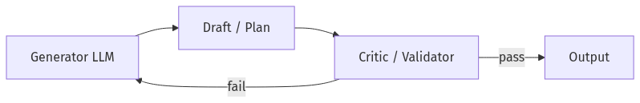

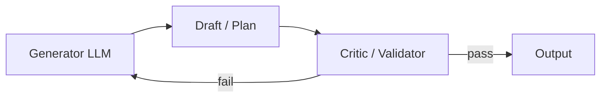
```mermaid
flowchart LR
    GEN[Generator LLM] --> DRAFT[Draft / Plan]
    DRAFT --> CRIT[Critic / Validator]
    CRIT -->|fail| GEN
    CRIT -->|pass| OUT[Output]
```

Variants: self-reflection (same model, new prompt), cross-model critic, symbolic validator (schema/tests).

#### Architecture

Often implemented as a subgraph:

```text
generate → validate → (retry loop N times) → finalize
```

#### Implementation

```python
def reflect_on_sql(draft_sql: str, schema_doc: str, client) -> tuple[bool, str]:
    review = client.responses.create(
        model="gpt-4.1-mini",
        input=[
            {
                "role": "system",
                "content": (
                    "You are a SQL safety reviewer. Reject queries that "
                    "write, delete, or lack WHERE on large tables."
                ),
            },
            {
                "role": "user",
                "content": f"Schema:\n{schema_doc}\n\nQuery:\n{draft_sql}",
            },
        ],
    )
    text = review.output_text.lower()
    approved = "approve" in text and "reject" not in text
    return approved, review.output_text
```

#### Why it exists

Single-pass generation fails on **constraints** (safety, style, numeric accuracy). Reflection trades compute for quality.

#### When to use

High-stakes outputs (SQL, code, compliance text); complex multi-constraint tasks; when eval shows systematic single-pass errors.

#### When NOT to use

Latency-sensitive chat; low-stakes drafts; when validator is weaker than generator.

#### Alternatives

| Alternative | When |
|-------------|------|
| Constrained decoding | Grammar-like outputs |
| RAG with citations | Factuality |
| Human review | Irreversible actions |

#### Advantages

Meaningful quality lift without retraining; catches constraint violations.

#### Limitations

2–3× token cost; critic can be wrong; infinite retry loops without caps.

#### Tradeoffs

| More reflection passes | Diminishing returns after 1–2 critics |

#### Performance

Multiplies latency—run critics async where UX allows.

#### Cost

Among the most expensive patterns—budget explicitly.

#### Security

Critic must see same injection surface—don't trust reflection alone for security.

#### Scalability

Parallelize critics; cache validated templates.

#### Interview discussion

> "Reflection is not free quality. I measure uplift on golden sets vs latency regression before enabling in prod."

#### Production examples

- Code gen with unit test reflection loop
- Medical note drafts with policy checklist critic
- JSON plan validated against Pydantic before tool exec

Extended catalog: [03-03](../03-Agentic-Fundamentals/03-03-Agentic-Design-Patterns.md)

---

## Implementation

### Evolution showcase: one support ticket, four eras

The following FastAPI application implements the **same business capability**—handling a support ticket about a delayed order—across four paradigms. Compare determinism, cost, and capability.

```python
"""00-02 Evolution API — Rules → ML → LLM → Agent

Run:
  pip install fastapi uvicorn pydantic openai
  export OPENAI_API_KEY=sk-...
  uvicorn evolution_api:app --reload

POST /v1/ticket/handle?mode=rules|ml|llm|agent
"""

from __future__ import annotations

import json
import os
import uuid
from datetime import datetime, timezone
from enum import Enum
from typing import Any, Callable

from fastapi import FastAPI, HTTPException, Query
from pydantic import BaseModel, Field

try:
    from openai import OpenAI
except ImportError:
    OpenAI = None  # type: ignore

app = FastAPI(title="Rules-to-Agents Evolution API", version="1.0.0")


# ── Shared models ──────────────────────────────────────────────────────────


class HandleMode(str, Enum):
    RULES = "rules"
    ML = "ml"
    LLM = "llm"
    AGENT = "agent"


class Ticket(BaseModel):
    ticket_id: str = Field(default_factory=lambda: str(uuid.uuid4()))
    customer_message: str
    customer_tier: str = "standard"
    order_id: str | None = None
    is_outage: bool = False


class ToolTrace(BaseModel):
    tool: str
    args: dict[str, Any]
    result: Any
    latency_ms: float | None = None


class HandleResult(BaseModel):
    ticket_id: str
    mode: HandleMode
    action: str
    reply: str
    priority: str
    confidence: float | None = None
    tool_traces: list[ToolTrace] = Field(default_factory=list)
    steps: int = 1
    model_used: str | None = None
    created_at: datetime = Field(default_factory=lambda: datetime.now(timezone.utc))


# ── Mock tool layer (Agent era) ────────────────────────────────────────────


FAKE_ORDERS: dict[str, dict[str, Any]] = {
    "ORD-1001": {"status": "in_transit", "eta_days": 2, "carrier": "FedEx"},
    "ORD-4040": {"status": "lost", "eta_days": None, "carrier": "UPS"},
}


def lookup_order(order_id: str) -> dict[str, Any]:
    if order_id not in FAKE_ORDERS:
        return {"error": "not_found", "order_id": order_id}
    return {"order_id": order_id, **FAKE_ORDERS[order_id]}


def create_shipping_ticket(order_id: str, summary: str) -> dict[str, Any]:
    return {"ticket_ref": f"SHIP-{uuid.uuid4().hex[:8]}", "order_id": order_id, "summary": summary}


TOOLS: dict[str, Callable[..., dict[str, Any]]] = {
    "lookup_order": lookup_order,
    "create_shipping_ticket": create_shipping_ticket,
}

TOOL_SCHEMAS = [
    {
        "type": "function",
        "name": "lookup_order",
        "description": "Fetch order status by order_id",
        "parameters": {
            "type": "object",
            "properties": {"order_id": {"type": "string"}},
            "required": ["order_id"],
            "additionalProperties": False,
        },
    },
    {
        "type": "function",
        "name": "create_shipping_ticket",
        "description": "Open a shipping investigation ticket",
        "parameters": {
            "type": "object",
            "properties": {
                "order_id": {"type": "string"},
                "summary": {"type": "string"},
            },
            "required": ["order_id", "summary"],
            "additionalProperties": False,
        },
    },
]


def execute_tool(name: str, args: dict[str, Any]) -> Any:
    if name not in TOOLS:
        return {"error": f"unknown_tool:{name}"}
    return TOOLS[name](**args)


# ── Era 1: Rules ───────────────────────────────────────────────────────────


def handle_rules(ticket: Ticket) -> HandleResult:
    msg = ticket.customer_message.lower()
    priority = "p1" if ticket.is_outage and ticket.customer_tier == "enterprise" else "p3"
    if "late" in msg or "delay" in msg:
        action = "escalate_shipping"
        reply = (
            f"We're sorry for the delay on {ticket.order_id or 'your order'}. "
            "A shipping specialist will contact you within 24 hours."
        )
    elif "refund" in msg:
        action = "route_billing_rules"
        reply = "Refund eligibility is determined by our billing policy team."
    else:
        action = "send_faq"
        reply = "See our shipping FAQ at https://example.com/shipping"
    return HandleResult(
        ticket_id=ticket.ticket_id,
        mode=HandleMode.RULES,
        action=action,
        reply=reply,
        priority=priority,
        confidence=1.0,
    )


# ── Era 2: Classical ML (stub scorer) ─────────────────────────────────────


def extract_features(ticket: Ticket) -> dict[str, float]:
    words = ticket.customer_message.split()
    return {
        "word_count": float(len(words)),
        "exclamation_count": float(ticket.customer_message.count("!")),
        "enterprise": 1.0 if ticket.customer_tier == "enterprise" else 0.0,
        "mentions_delay": 1.0 if "delay" in ticket.customer_message.lower() else 0.0,
    }


def ml_score(features: dict[str, float]) -> float:
    """Stand-in for XGBoost/logistic weights — trained offline in real life."""
    return min(
        1.0,
        0.2
        + 0.25 * features["mentions_delay"]
        + 0.15 * features["exclamation_count"]
        + 0.2 * features["enterprise"],
    )


def handle_ml(ticket: Ticket) -> HandleResult:
    features = extract_features(ticket)
    score = ml_score(features)
    action = "escalate_shipping" if score >= 0.55 else "send_faq"
    if action == "escalate_shipping":
        reply = "ML router: high delay-risk — escalating to shipping."
    else:
        reply = "ML router: low risk — FAQ path."
    return HandleResult(
        ticket_id=ticket.ticket_id,
        mode=HandleMode.ML,
        action=action,
        reply=reply,
        priority="p2" if score >= 0.55 else "p4",
        confidence=round(score, 3),
    )


# ── Era 3: LLM one-shot ───────────────────────────────────────────────────


def handle_llm(ticket: Ticket) -> HandleResult:
    if OpenAI is None or not os.getenv("OPENAI_API_KEY"):
        return HandleResult(
            ticket_id=ticket.ticket_id,
            mode=HandleMode.LLM,
            action="offline_stub",
            reply="[LLM offline] We are looking into your shipping delay.",
            priority="p3",
            model_used=None,
        )

    client = OpenAI()
    prompt = (
        "You are support. Classify intent and draft a short reply. "
        "Do NOT invent order status — you have no tools.\n"
        f"Customer ({ticket.customer_tier}): {ticket.customer_message}\n"
        f"Order ID (maybe unknown): {ticket.order_id}"
    )
    resp = client.responses.create(model="gpt-4.1-mini", input=prompt)
    return HandleResult(
        ticket_id=ticket.ticket_id,
        mode=HandleMode.LLM,
        action="llm_draft",
        reply=resp.output_text,
        priority="p3",
        model_used="gpt-4.1-mini",
    )


# ── Era 4: Agent loop (Think → Act → Observe) ─────────────────────────────


AGENT_SYSTEM = """You are a support agent with tools.
Think step-by-step internally, then act.
Rules:
- Always lookup_order before stating status.
- If order is lost, call create_shipping_ticket.
- Never fabricate tracking numbers.
Stop with a final customer-facing reply when done."""


def handle_agent(ticket: Ticket, max_steps: int = 6) -> HandleResult:
    traces: list[ToolTrace] = []
    if OpenAI is None or not os.getenv("OPENAI_API_KEY"):
        # Agent without LLM degrades to rules + tools manually
        oid = ticket.order_id or "ORD-1001"
        data = lookup_order(oid)
        traces.append(ToolTrace(tool="lookup_order", args={"order_id": oid}, result=data))
        reply = f"Offline agent: order {oid} status={data.get('status', 'unknown')}."
        return HandleResult(
            ticket_id=ticket.ticket_id,
            mode=HandleMode.AGENT,
            action="agent_offline",
            reply=reply,
            priority="p2",
            tool_traces=traces,
            steps=1,
        )

    client = OpenAI()
    messages: list[dict[str, Any]] = [
        {"role": "system", "content": AGENT_SYSTEM},
        {
            "role": "user",
            "content": (
                f"Ticket: {ticket.customer_message}\n"
                f"order_id={ticket.order_id}\n"
                f"tier={ticket.customer_tier}"
            ),
        },
    ]

    model = "gpt-4.1-mini"
    steps = 0
    final_reply = ""

    while steps < max_steps:
        steps += 1
        resp = client.responses.create(
            model=model,
            input=messages,
            tools=TOOL_SCHEMAS,
        )

        tool_calls = [
            item for item in resp.output if getattr(item, "type", None) == "function_call"
        ]

        if not tool_calls:
            final_reply = resp.output_text or "No response generated."
            break

        # Append model output items to conversation
        messages.extend([item.model_dump() for item in resp.output])

        for tc in tool_calls:
            args = json.loads(tc.arguments) if isinstance(tc.arguments, str) else tc.arguments
            result = execute_tool(tc.name, args)
            traces.append(ToolTrace(tool=tc.name, args=args, result=result))
            messages.append(
                {
                    "type": "function_call_output",
                    "call_id": tc.call_id,
                    "output": json.dumps(result),
                }
            )
    else:
        final_reply = "Agent stopped: max steps reached. A human will follow up."

    return HandleResult(
        ticket_id=ticket.ticket_id,
        mode=HandleMode.AGENT,
        action="agent_resolved",
        reply=final_reply,
        priority="p2",
        tool_traces=traces,
        steps=steps,
        model_used=model,
    )


# ── Router + API ───────────────────────────────────────────────────────────


HANDLERS = {
    HandleMode.RULES: handle_rules,
    HandleMode.ML: handle_ml,
    HandleMode.LLM: handle_llm,
    HandleMode.AGENT: handle_agent,
}


@app.post("/v1/ticket/handle", response_model=HandleResult)
def handle_ticket(
    ticket: Ticket,
    mode: HandleMode = Query(default=HandleMode.RULES, description="Paradigm selector"),
) -> HandleResult:
    if mode not in HANDLERS:
        raise HTTPException(status_code=400, detail=f"unsupported mode={mode}")
    return HANDLERS[mode](ticket)


@app.get("/health")
def health() -> dict[str, str]:
    return {"status": "ok", "openai_configured": str(bool(os.getenv("OPENAI_API_KEY")))}
```

#### What to observe when running all four modes

| Mode | Grounded order status? | Side effects? | Typical cost | Deterministic? |
|------|------------------------|---------------|--------------|----------------|
| `rules` | No (template text) | No | ~$0 | Yes |
| `ml` | No | No | ~$0 | Yes (given features) |
| `llm` | **May hallucinate** | No | $ | No |
| `agent` | **Yes, if tool called** | Can create ticket | $$ | No |

This table is the executive summary of the chapter.

---

## Production Considerations

| Concern | Guidance |
|---------|----------|
| **Paradigm selection** | Document WHY each endpoint uses rules/ML/LLM/agent |
| **Degradation ladders** | Agent → LLM → rules when provider down |
| **Policy placement** | Eligibility in code; language in models |
| **Versioning** | Pin `model`, `prompt_version`, `tool_manifest_version` |
| **Idempotency** | Tool writes must be safe to retry |
| **Stop conditions** | `max_steps`, timeouts, duplicate detection |
| **Human gates** | Irreversible tools require approval tokens |

Bridge to BankCo warmup: [00-03](00-03-BankCo-Decision-Support-Warmup.md)

---

## Security

| Threat | Era most vulnerable | Control |
|--------|---------------------|---------|
| Prompt injection | LLM, Agent | Separate instructions/data; tool ACLs |
| Tool abuse | Agent | Arg validation; authz per tool; allowlists |
| Data leakage | LLM, Agent | Redact PII; log scrubbing |
| Rule bypass via LLM | Hybrid systems | Never let LLM override policy engine |
| SQL/code injection | Agent + reflection | Sandboxed exec; read-only DB roles |
| Memory poisoning | Agent | Session auth; TTL; no cross-tenant memory |

**Principle:** Security must not live in the prompt. Prompts are hints; **authorization lives in code**.

---

## Performance

| Paradigm | Typical P95 latency | Dominant factor |
|----------|----------------------|-----------------|
| Rules | <5 ms | Branch count |
| ML | 5–50 ms | Feature extraction + model |
| LLM one-shot | 0.5–3 s | Output tokens |
| Agent loop | 2–15+ s | Steps × (LLM + tools) |

**Production tactics:** async drafts, streaming UX, parallel tool calls where safe, route easy traffic away from agents.

---

## Cost

| Paradigm | Cost driver | Order of magnitude (relative) |
|----------|-------------|-------------------------------|
| Rules | Engineering maintenance | 1× (baseline) |
| ML | Labels + serving | 1–5× rules at inference |
| LLM | Input/output tokens | 100–10,000× rules |
| Agent | Steps × tools × tokens | 3–20× single LLM call |

**CFO-friendly metric:** `$ / successfully completed task`, not `$ / API call`.

---

## Scalability

| Layer | Scale pattern |
|-------|---------------|
| Rules / ML | Horizontal stateless pods |
| LLM | Provider rate limits; queue excess |
| Tools | Per-tool rate limits; circuit breakers |
| Memory | Redis cluster; vector DB shards |
| Agent workers | Queue + worker pool; checkpoint long jobs |

LangGraph-style persistence helps resume multi-hour agents without re-paying full context ([LangGraph high-level concepts](https://langchain-ai.github.io/langgraph/concepts/high_level/)).

---

## Failure Modes

| Failure | Paradigm | Symptom | Mitigation |
|---------|----------|---------|------------|
| Rule explosion | Rules | Unmaintainable table | ML hybrid extraction |
| Silent drift | ML | Slow quality decay | Monitoring + retrain |
| Hallucination | LLM | Wrong facts | Tools/RAG/abstain |
| Infinite loop | Agent | Token burn | max_steps, loop detection |
| Wrong route | Routing | Bad handler | Route eval suite |
| Critic rubber-stamp | Reflection | False confidence | Symbolic validators |
| Tool timeout | Agent | Hung session | Per-tool deadlines + partial reply |

---

## Observability

Minimum trace fields for agentic paths:

```text
trace_id, session_id, mode, route_decision,
model, prompt_version, step_index, think_summary,
tool_name, tool_args_hash, tool_status, tool_latency_ms,
tokens_in, tokens_out, cost_usd, final_action, user_feedback
```

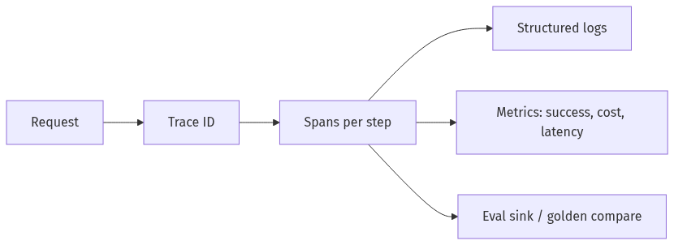

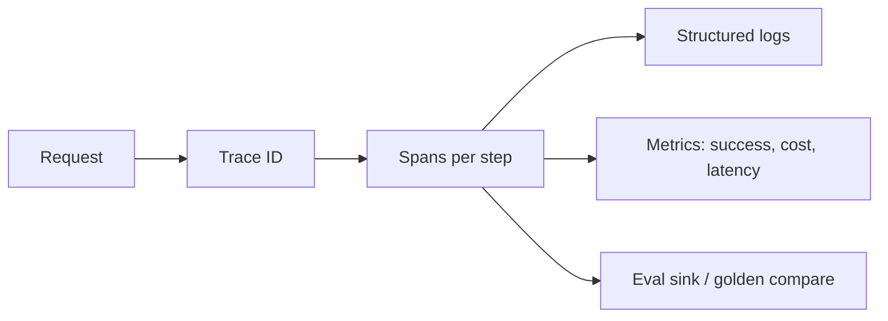
```mermaid
flowchart LR
    REQ[Request] --> TR[Trace ID]
    TR --> SP[Spans per step]
    SP --> LOG[Structured logs]
    SP --> MET[Metrics: success, cost, latency]
    SP --> EV[Eval sink / golden compare]
```

If you cannot replay **Think → Act → Observe** for a bad outcome, you cannot pass a production review.

---

## Debugging

| Symptom | First check | Second check |
|---------|-------------|--------------|
| Wrong facts | Were tools called? | Tool response logs |
| Looping agent | Duplicate actions in trace | Prompt stop rules |
| Cost spike | Route mis-classification | max_steps too high |
| Quality regression | Model pin changed? | Prompt version diff |
| Slow responses | Tool latency | Sequential vs parallel |

**Technique:** Freeze a failing trace; replay tools offline with mocked LLM responses.

---

## Common Mistakes

1. **Jumping to agents** for a problem solved by 10 rules.
2. **Using LLM as database** instead of `lookup_*` tools.
3. **No router** — every query hits the expensive agent path.
4. **Reflection on everything** — 3× cost for marginal gain.
5. **Memory without TTL** — stale preferences forever.
6. **Encoding policy in prompts** — unmaintainable and unauditable.
7. **Treating demo agent loops as shippable** without stop conditions and evals.

---

## Tradeoffs

| Decision | Upside | Downside |
|----------|--------|----------|
| Rules-first | Safe, fast, cheap | Can't parse messy language |
| ML-first | Scalable scoring | Feature/label tax |
| LLM-only | Fast to ship | Hallucination, no actions |
| Full agent | Handles open tasks | Cost, latency, incidents |
| LLM router | Flexible routing | Expensive, opaque |
| Reflection | Quality boost | Latency + tokens |
| Human-in-the-loop | Safety | Throughput |

**Staff-level move:** For each choice, name the **metric you optimize** and the **metric you sacrifice**.

---

## Architecture Diagram

### Combined production architecture (hybrid)

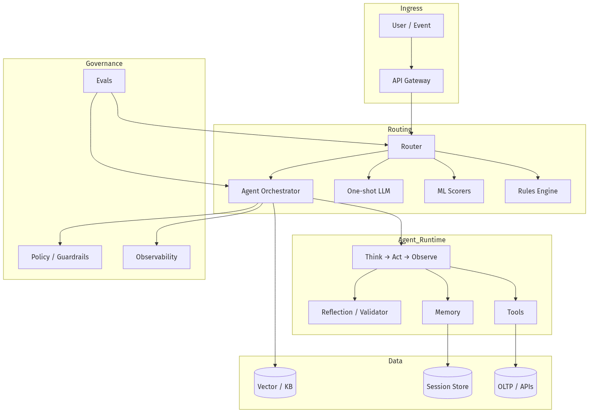

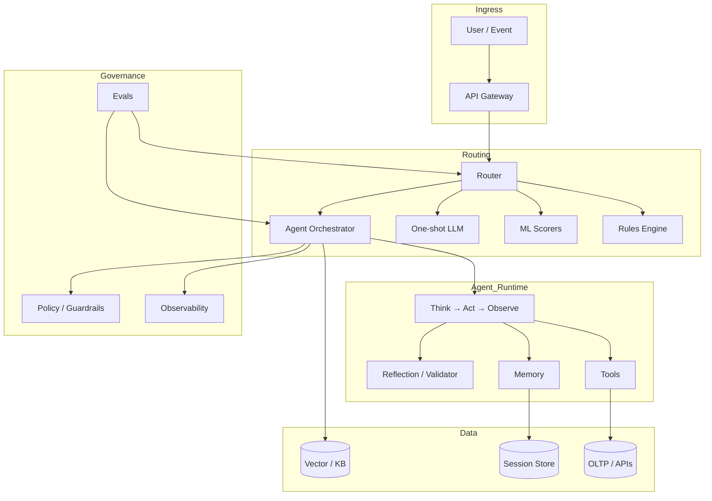
```mermaid
flowchart TB
    subgraph Ingress
      U[User / Event] --> GW[API Gateway]
    end
    subgraph Routing
      GW --> RT[Router]
      RT --> RU[Rules Engine]
      RT --> ML[ML Scorers]
      RT --> LLM[One-shot LLM]
      RT --> AG[Agent Orchestrator]
    end
    subgraph Agent_Runtime
      AG --> LOOP[Think → Act → Observe]
      LOOP --> TL[Tools]
      LOOP --> MEM[Memory]
      LOOP --> REF[Reflection / Validator]
    end
    subgraph Data
      TL --> DB[(OLTP / APIs)]
      MEM --> REDIS[(Session Store)]
      AG --> VDB[(Vector / KB)]
    end
    subgraph Governance
      OBS[Observability]
      EV[Evals]
      POL[Policy / Guardrails]
    end
    AG --> OBS
    AG --> POL
    EV --> RT
    EV --> AG
```

---

## Mermaid Diagram — Evolution Timeline

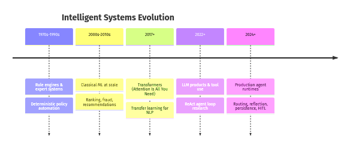

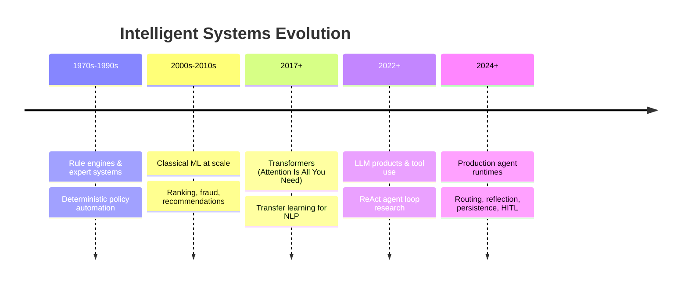
```mermaid
timeline
    title Intelligent Systems Evolution
    1970s-1990s : Rule engines & expert systems
                : Deterministic policy automation
    2000s-2010s : Classical ML at scale
                : Ranking, fraud, recommendations
    2017+       : Transformers (Attention Is All You Need)
                : Transfer learning for NLP
    2022+       : LLM products & tool use
                : ReAct agent loop research
    2024+       : Production agent runtimes
                : Routing, reflection, persistence, HITL
```

---

## Mermaid Diagram — Agent Loop Sequence

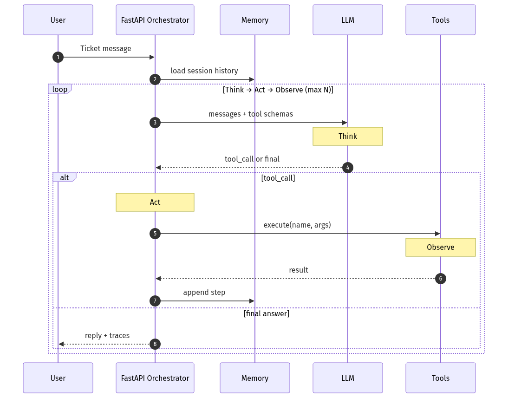

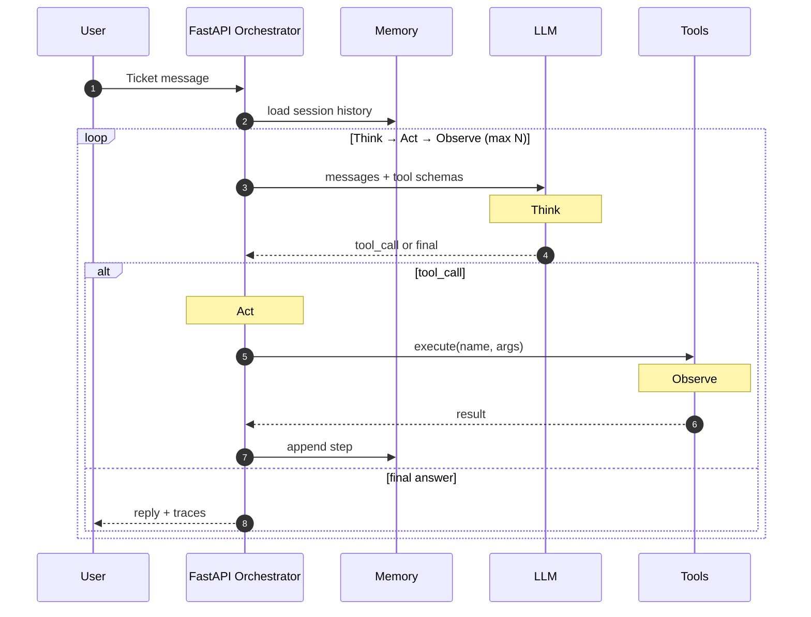
```mermaid
sequenceDiagram
    autonumber
    participant U as User
    participant API as FastAPI Orchestrator
    participant M as Memory
    participant L as LLM
    participant T as Tools

    U->>API: Ticket message
    API->>M: load session history
    loop Think → Act → Observe (max N)
        API->>L: messages + tool schemas
        Note over L: Think
        L-->>API: tool_call or final
        alt tool_call
            Note over API: Act
            API->>T: execute(name, args)
            Note over T: Observe
            T-->>API: result
            API->>M: append step
        else final answer
            API-->>U: reply + traces
        end
    end
```

---

## Production Examples

| Scenario | Recommended stack | Why |
|----------|-------------------|-----|
| Fraud decline on card swipe | Rules + ML | Sub-100 ms; explainable codes |
| Marketing email personalization | LLM one-shot + human approve | Language variance; low action risk |
| B2B support with CRM actions | Router + agent + tools | Mixed FAQ/complex; needs lookup |
| Medical prior auth | Rules + ML + HITL | Regulation; no full autonomy |
| Code review bot | Agent + reflection + tests | Multi-step; verifiable critic |
| Internal policy Q&A | RAG + one-shot LLM | Grounded read; no side effects |

---

## Real Companies Using It (Public Patterns)

| Company | Public pattern | Evolution lesson |
|---------|----------------|------------------|
| **Klarna** | AI assistant for customer service at scale | Measure resolution; route simple cases |
| **Shopify** | Sidekick merchant assistant (tool-augmented) | Commerce actions need tools, not text |
| **Microsoft** | Copilot family (Office, GitHub, Dynamics) | Different tiers: suggest vs act |
| **Google** | Duet / Gemini in Workspace | Routing across assist modes |
| **Uber** (cited in LangGraph materials) | Stateful operational workflows | Persistence + human escalation |
| **Anthropic / OpenAI** | Tool use in API products | Agents are platform primitives now |

Use as **pattern references**, not insider claims.

---

## Hands-on Labs

### Lab A — Four modes, one ticket (60 min)

1. Run the Evolution API.
2. POST the same `Ticket` with `mode=rules|ml|llm|agent`.
3. Document differences in reply, traces, and hallucination risk.

### Lab B — Break the LLM (45 min)

Send a ticket with `order_id=ORD-4040` (status `lost`). Compare `llm` vs `agent` responses. Prove LLM-only invents status without tools.

### Lab C — Router instrumentation (45 min)

Add a `/v1/ticket/smart-handle` endpoint that routes FAQ → rules, complex → agent. Log `route_decision` and measure mis-routes on 20 handcrafted cases.

### Lab D — Reflection gate (60 min)

Add optional SQL or JSON plan reflection before a destructive tool. Measure pass/fail on adversarial prompts.

### Lab E — Memory continuity (45 min)

Store prior ticket context in Redis keyed by `customer_id`. Verify turn-2 agent remembers turn-1 order ID.

---

## Coding Assignments

1. Fix `handle_ml` to use a sklearn pipeline loaded from disk (persist model artifact).
2. Add Pydantic validation on all tool args before execution.
3. Implement `max_steps` and duplicate `tool+args` detection in the agent loop.
4. Emit OpenTelemetry spans: `think`, `act`, `observe` per step.
5. Add a `prompt_version` field to all LLM/agent responses.

---

## Mini Project

**Title:** Paradigm Comparison CLI  
**Deliverable:** CLI that ingests a CSV of tickets, runs all four modes, outputs CSV with action/reply/cost estimate/steps.  
**Done when:** README includes decision guide for which mode wins per row type.

---

## Production Project

**Title:** Routed Support Agent v1  
**Deliverable:** FastAPI service with rule router, agent path, Redis memory, structured traces, health checks.  
**Done when:** Deployable Docker image; 20-case eval JSON; p95 latency & cost documented.

---

## Stretch Project

**Title:** Reflection A/B harness  
**Deliverable:** Offline eval comparing single-pass vs reflect-on-fail on 100 tickets.  
**Done when:** Report shows quality lift vs latency/cost regression with recommendation.

---

## Interview Questions

### Senior Engineer

1. Explain the difference between rule-based systems and LLM-based systems in one customer support example.
2. Why can't an LLM alone cancel a subscription reliably?
3. What is the Think → Act → Observe loop?
4. Name three prompt engineering techniques and when you'd use each.
5. How would you test a rules engine vs an agent?

### Staff Engineer

1. Design a router for a support platform handling 10M tickets/month. What goes to rules vs ML vs agent?
2. When would you add reflection, and how do you prevent infinite retry loops?
3. How do you version and roll back prompts in production?
4. Describe observability for a multi-step agent without logging raw PII.
5. Compare workflow engines (Temporal) vs agent loops for an onboarding flow.

### Principal Engineer

1. Propose a company-wide **decision matrix** for rules / ML / LLM / agent across product teams.
2. How do you prevent teams from re-implementing shadow policy inside prompts?
3. What platform primitives (tool registry, memory, evals) belong in shared infra vs app code?
4. Model provider swaps: what breaks in an agent stack beyond the model name?
5. Quantify when an agent is economically rational vs human offshore support.

### Engineering Manager

1. Your team wants "agents everywhere" after a demo. How do you channel energy without killing margin?
2. What roles hire first for a hybrid rules+agent product (ML, backend, prompt, ops)?
3. How do you set OKRs that don't reward token volume?
4. A compliance officer asks "can we explain every decision?" — which paths do you greenlight?
5. How do you evaluate build vs buy (LangGraph, Assistants API, custom)?

### Whiteboard

1. Draw the evolution from rules → agent for a **refund request** flow. Label trust boundaries.
2. Draw Routing + Agent + Reflection as a single diagram with data flows.
3. Diagram memory architecture for a 30-day sales copilot with CRM tools.

### Follow-ups

- What if the router itself is wrong 8% of the time?
- What if tools are flaky 5% of the time — sync vs async compensation?
- What if the cheapest model fails reflection but passes generation?
- How does this change for voice agents with latency <800 ms?
- When do fine-tuned small models replace few-shot prompts in the router?

---

## Revision Notes

- **Rules** = deterministic policy in code/tables.
- **Classical ML** = learned scoring on features; not magic for raw essays without NLP.
- **LLM** = language interface; predicts tokens, not truth.
- **Agent** = `(Prompt + Tools + Memory) × LLM`; loop = Think → Act → Observe.
- **Routing** saves money; **Reflection** buys quality — both need evals.
- Never skip: max_steps, tool auth, audit traces, paradigm justification doc.

---

## Summary

Intelligent systems did not leap from chatbots to agents—they **accumulated capabilities** as business problems demanded language, learning, and action. Rule engines still run the world's most regulated decisions. Classical ML still scores, ranks, and detects. LLMs added a universal interface to messy text. **Agents** combine LLMs with tools, memory, and control loops to close the grounding–action–state gaps—but they pay for that power with cost, latency, and operational complexity.

Your job as an AI engineer is not to pick the newest box on the diagram. It is to **place each step on the evolution curve deliberately**, instrument the seams, and know—under interview lights—which primitive wins when.

Next: apply hybrid thinking to a concrete domain in [00-03 — BankCo Decision Support Warmup](00-03-BankCo-Decision-Support-Warmup.md), then deepen the loop in [03-01](../03-Agentic-Fundamentals/03-01-Agent-Anatomy-and-Loop.md) and patterns in [03-03](../03-Agentic-Fundamentals/03-03-Agentic-Design-Patterns.md).

---

## Further Reading

| Title | URL | Difficulty | Reading Time | Why Read | Important Sections |
|-------|-----|------------|--------------|----------|--------------------|
| Attention Is All You Need (Transformers) | https://arxiv.org/abs/1706.03762 | Advanced | 60–90 min | Foundational architecture behind all modern LLMs; shared vocabulary for encoder/decoder and attention | §3 Model Architecture; §3.2 Attention; Figure 1 |
| ReAct: Synergizing Reasoning and Acting in Language Models | https://arxiv.org/abs/2210.03629 | Intermediate | 45–60 min | Research basis for Think → Act → Observe agent loops | §1 Introduction; §3 ReAct Prompting; Figures 1–3 |
| OpenAI Prompt Engineering Guide | https://developers.openai.com/api/docs/guides/prompt-engineering | Intro–Intermediate | 45 min | Official tactics for reliable prompts as API contracts | Message roles; clear instructions; iterative development |
| LangGraph High-Level Concepts | https://langchain-ai.github.io/langgraph/concepts/high_level/ | Intermediate | 25–35 min | Production agent runtime: persistence, HITL, state graphs | Core benefits; persistence/checkpointing; when to use LangGraph |
| Build with Claude (Anthropic Platform Overview) | https://platform.claude.com/docs/en/docs/build-with-claude/overview | Intro–Intermediate | 30–45 min | Provider comparison mindset; tool use and production constraints from a second major API | Overview; tool use; messages API patterns |

---

## Resume Bullet (after labs)

- Built a **four-paradigm support API** (rules, ML, LLM, ReAct-style agent) demonstrating grounded tool use, routing, and trace observability— with explicit tradeoff analysis of cost, latency, and hallucination risk.
