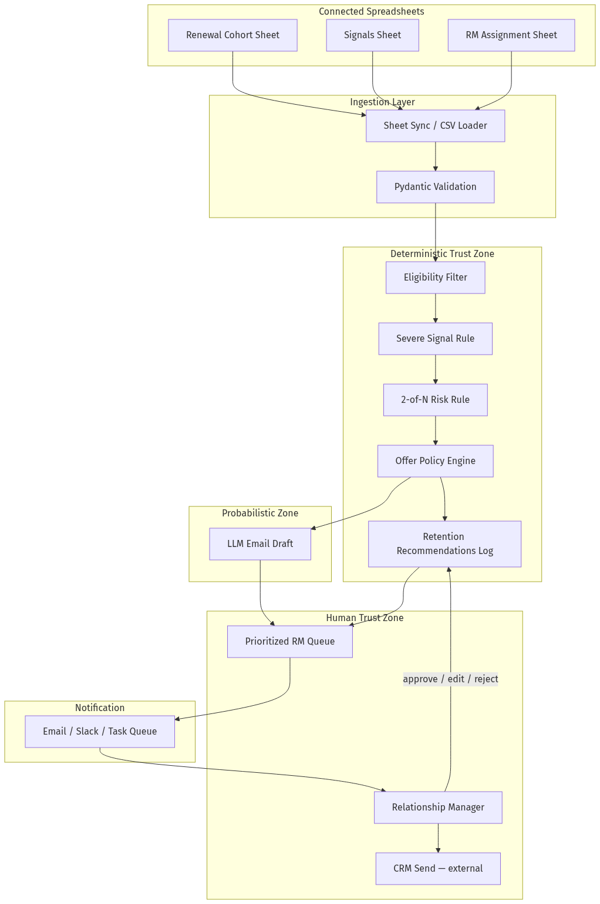
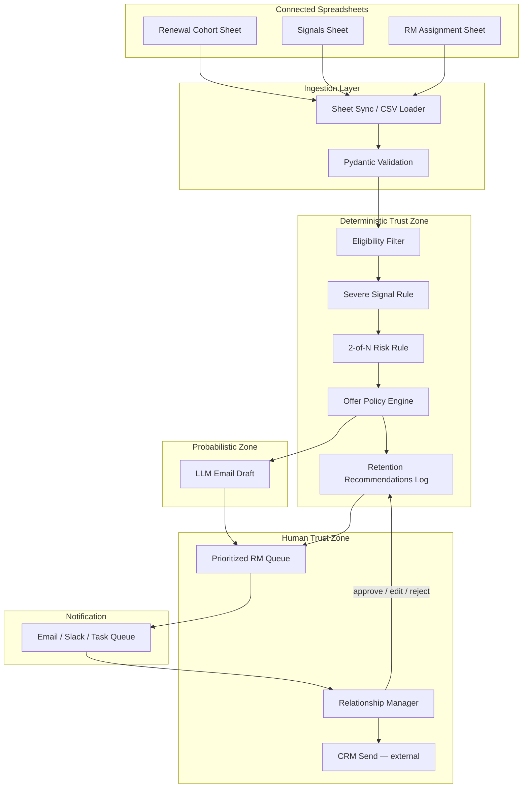
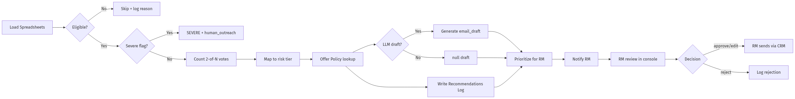
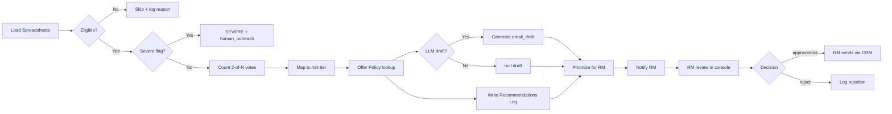
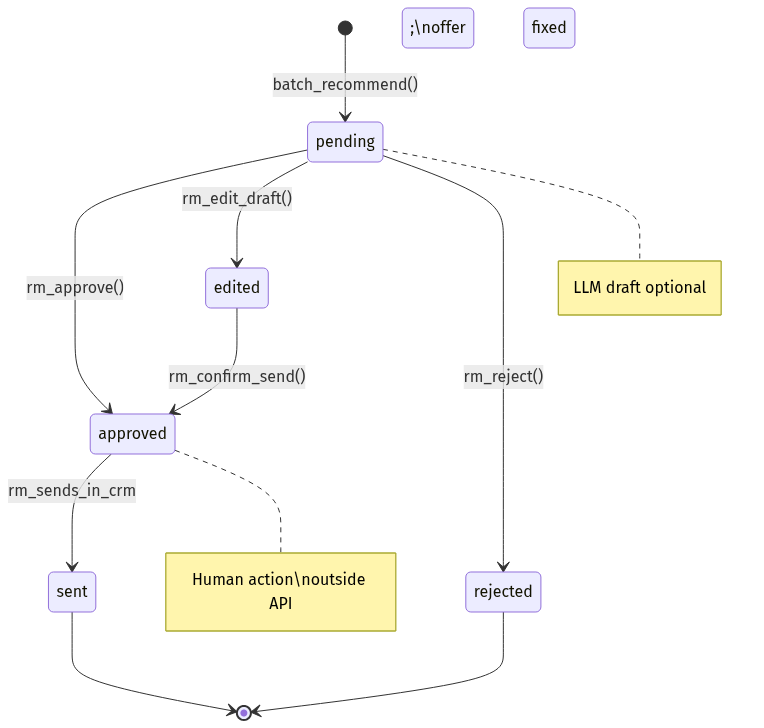
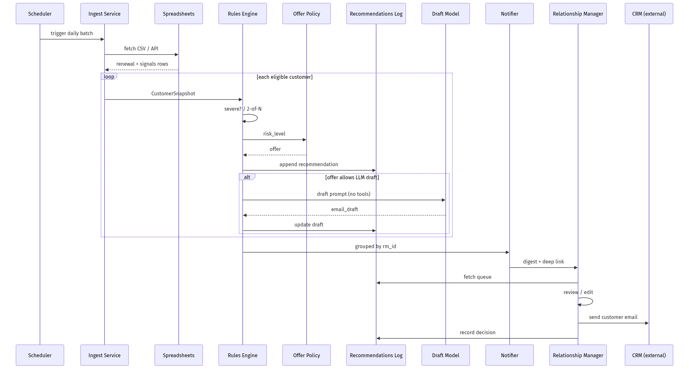
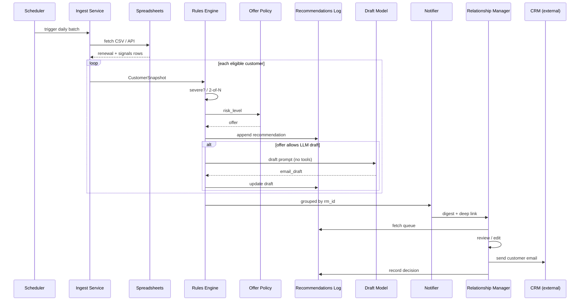
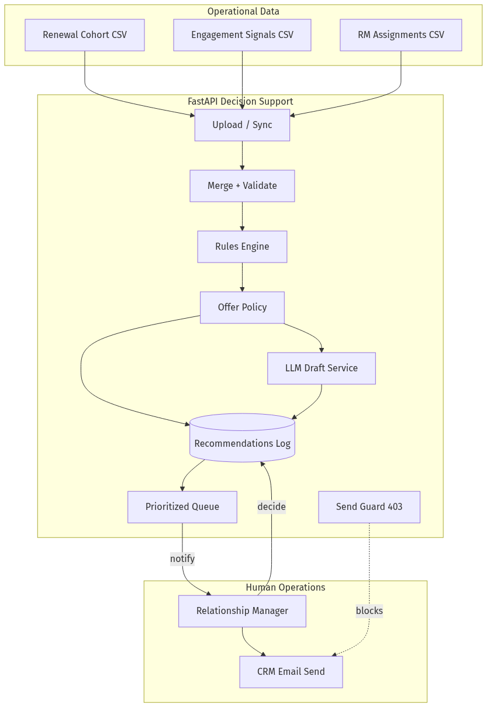
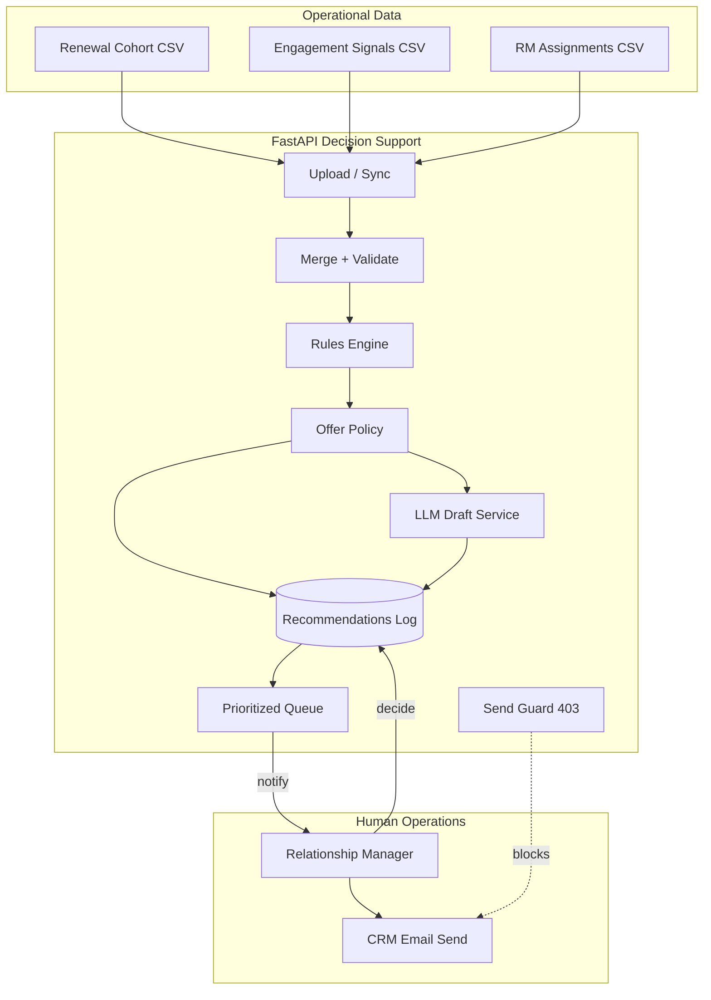

# 00-03 — BankCo Warm-Up: Decision-Support Retention Assistant

| Meta | Value |
|------|-------|
| **Estimated Time** | 5–6 hours (read 2.5h · lab 2.5h · policy memo 1h) |
| **Difficulty** | Intermediate (rules + API) · Advanced (production governance) |
| **Prerequisites** | [00-01 AI Engineering Mindset](00-01-AI-Engineering-Mindset.md) · [00-02 From Rules to Agents](00-02-From-Rules-to-Agents.md) · Python 3.11+ · basic FastAPI/Pydantic |
| **Module** | 00 — Foundations |
| **Related** | [03-01 Agent Anatomy](../03-Agentic-Fundamentals/03-01-Agent-Anatomy-and-Loop.md) · [08-03 Guardrails Ship Criteria](../08-Evaluation-LLMOps/08-03-Guardrails-Ship-Criteria.md) · [Architecture Index](../../Architecture Index.md) |

---

## Learning Objectives

By the end of this chapter you will be able to:

1. Frame a **Relationship Manager (RM) user problem** for premium credit card retention without conflating it with a chatbot demo.
2. Design a **decision-support agent** that reads connected spreadsheets, applies deterministic rules, and produces **RM-ready outputs**—never autonomous customer outreach.
3. Implement the **2-of-N rule**, **Severe Signal rule**, and **Offer Policy** as auditable code—not prompt instructions.
4. Build a **Retention Recommendations Log** and **RM notification** path that preserves human control of every send.
5. Trace the end-to-end flow: **eligibility → risk → offer → draft → logging → notification**.
6. Explain **WHY / HOW / WHEN / WHEN NOT** for each architectural choice at Staff/Principal interview depth.

---

## Why This Topic Matters

BankCo is a fictional but realistic premium card issuer. Its Platinum card renews annually at **$595**. Relationship Managers (RMs) own roughly **400–600** high-value households each. Renewal windows cluster; disengagement signals arrive late; spreadsheets are still the operational truth.

Most “AI retention” pitches fail because they:

- treat the LLM as the **decision maker** instead of the **wordsmith**,
- skip audit trails regulators and internal risk teams require,
- auto-send emails that violate offer authority and brand compliance,
- and ignore that RMs—not models—carry the client relationship.

This warm-up is the **smallest credible production slice** of BankCo’s internal retention assistant. It encodes lessons from [00-01](00-01-AI-Engineering-Mindset.md) (policy-first mindset) and [00-02](00-02-From-Rules-to-Agents.md) (when rules beat agents). It foreshadows [03-01](../03-Agentic-Fundamentals/03-01-Agent-Anatomy-and-Loop.md) (agent loop with tools) and [08-03](../08-Evaluation-LLMOps/08-03-Guardrails-Ship-Criteria.md) (ship criteria for regulated assistive AI).

**Core thesis:** Decision-support agents **recommend**; humans **commit**. If your system can email a customer without an RM click, you built the wrong product class.

---

## Business Impact

| Stakeholder | Pain today | What this system buys |
|-------------|------------|------------------------|
| **RM** | Scans 3+ spreadsheets; misses at-risk renewals 30–90 days out | Prioritized daily list + draft email + rationale |
| **Retention ops** | Ad-hoc offer exceptions; no central log | Offer Policy table + Recommendations Log |
| **Compliance / Legal** | “The AI said we could waive fees” | Deterministic eligibility; LLM never sets offer |
| **Finance** | Uncontrolled discount leakage | Cap offers by risk tier; audit every recommendation |
| **Customer** | Generic or mistimed outreach | Timely, policy-aligned touch—when RM approves |

**Quantified framing (illustrative):**

- Premium card **annual fee**: $595  
- **Incremental retention value** (LTV proxy): $2,400–$8,000 per saved household  
- **RM time saved**: 15–25 min/day on manual spreadsheet triage  
- **Cost of wrong autonomous send**: reputational + regulatory—not modeled as “bad NPS” alone  

---

## Architecture Overview

BankCo’s warm-up assistant is a **batch + API hybrid**:

1. **Data source:** Connected spreadsheets (CSV export or Google Sheets sync) holding renewal cohorts and behavioral signals.
2. **Deterministic core:** Eligibility filter → Severe Signal rule → 2-of-N risk scoring → Offer Policy lookup.
3. **Probabilistic edge:** LLM drafts RM-facing email text from fixed `(customer, offer, reasons)`—no tool access to send mail or change offers.
4. **Human gate:** RM reviews prioritized queue; edits draft; sends via existing CRM—outside this service’s trust boundary.
5. **Observability:** Retention Recommendations Log + audit events + RM notification fan-out.





**Trust zones** (from [00-01](00-01-AI-Engineering-Mindset.md)):

| Zone | Components | Must never |
|------|------------|------------|
| Deterministic | Rules, Offer Policy, log writes | Call LLM for eligibility |
| Probabilistic | Draft model | Select offer or send email |
| Human | RM approval, CRM send | Blindly trust draft without review |

---

## Core Concepts

### 1) The RM User Problem

#### Definition

Relationship Managers at BankCo must identify **premium cardholders 30–90 days before renewal** who show **disengagement**—before the customer calls to cancel or silently churns at renewal.

#### Intuition

RMs do not lack intelligence; they lack **attention bandwidth**. Signals exist across:

- renewal date spreadsheets from product ops,
- spend trend exports from analytics,
- complaint tickets from service,
- NPS survey results from marketing.

The RM’s morning is a **manual join** across disconnected files. High-value accounts get equal visual weight as stable ones.

#### WHY this problem fits decision-support AI

- Inputs are **structured** (rows, columns, thresholds)—not free-form chat.
- Decisions have **compliance boundaries** (offer caps, disclosure language).
- Errors are **expensive** (wrong discount, wrong customer, tone-deaf outreach).
- The “action” is **human relationship work**, not API automation.

#### HOW the assistant helps (without replacing the RM)

| RM need | System output |
|---------|---------------|
| “Who should I call today?” | Prioritized list sorted by `risk_level`, `days_to_renewal` |
| “Why this customer?” | `rationale[]` from rules engine |
| “What can I offer?” | `offer` from Offer Policy—never model-invented |
| “Give me a starting email” | `email_draft`—editable stub |
| “Prove we followed policy” | Retention Recommendations Log entry |

#### WHEN to deploy this pattern

- Regulated or brand-sensitive outreach.
- Offer authority is documented in policy tables.
- RMs already own the customer relationship.
- Data arrives as batch spreadsheets before real-time event streams exist.

#### WHEN NOT

- Real-time fraud block/allow (needs sub-second deterministic pipelines, not daily batch).
- Full conversational RM copilot on first sprint (scope creep; start with queue + draft).
- Autonomous send to “move fast”—compliance and RM trust will block you permanently.

---

### 2) Connected Spreadsheets as Data Source

#### Definition

**Connected spreadsheets** are operational data stores—renewal cohorts, signal snapshots, RM assignments—ingested via scheduled CSV export, Google Sheets API, or SharePoint sync. They are the **system of record** until BankCo funds a warehouse pipeline.

#### WHY spreadsheets first

- Ops teams already maintain them; zero migration tax for v0.
- Eligibility rules reference columns RMs already trust.
- Audit is easy: “we ran policy v3 against `renewal_cohort_2026-07-18.csv`.”

#### HOW ingestion works

1. Scheduled job pulls three sheets at 06:00 local.
2. Pydantic models validate types, ranges, and referential keys (`customer_id`, `rm_id`).
3. Rows failing validation go to a **quarantine report**—never silently dropped.
4. Valid rows merge into `CustomerSnapshot` records for the rules engine.

#### Sample CSV / Spreadsheet Schema

**Sheet: `renewal_cohort`**

| Column | Type | Description |
|--------|------|-------------|
| `customer_id` | string | Stable household ID (e.g. `BC-10042`) |
| `card_product` | string | Must be `PLATINUM` for this program |
| `renewal_date` | date | ISO `YYYY-MM-DD` |
| `annual_fee_usd` | int | e.g. `595` |
| `rm_id` | string | FK to `rm_assignments` |
| `account_status` | string | `active` \| `delinquent` \| `closed` |

**Sheet: `engagement_signals`**

| Column | Type | Description |
|--------|------|-------------|
| `customer_id` | string | FK |
| `as_of_date` | date | Snapshot date |
| `spend_drop_pct_90d` | float | 0–100; vs prior 90d baseline |
| `complaint_count_90d` | int | Service complaints |
| `nps_score` | int \| empty | 0–10; blank if no survey |
| `last_login_days_ago` | int | Mobile app |
| `severe_flags` | string | Pipe-separated: `FRAUD_REVIEW` \| `REGulatory_HOLD` \| `CHARGE_OFF` \| `DECEASED` |

**Sheet: `rm_assignments`**

| Column | Type | Description |
|--------|------|-------------|
| `rm_id` | string | e.g. `RM-017` |
| `rm_name` | string | Display name |
| `rm_email` | string | Notification target |
| `slack_user_id` | string | Optional |

#### WHEN NOT to stay on spreadsheets

- \>50k rows/day with sub-hour freshness requirements.
- Concurrent edits without version locking (use warehouse + CDC).
- PII columns (full PAN, SSN) in shared drives—tokenize before connect.

---

### 3) Eligibility Filter (Pre-Rules Gate)

#### Definition

Only customers in the **renewal window** (30–90 days) with **active premium product** enter risk scoring.

#### WHY a separate gate

Keeps rules engine tests small; prevents “why did we score someone renewing in 400 days?” debug sessions.

#### HOW

```python
def is_eligible(snapshot: CustomerSnapshot) -> tuple[bool, list[str]]:
    reasons: list[str] = []
    if snapshot.card_product != "PLATINUM":
        reasons.append("not_platinum")
    if snapshot.account_status != "active":
        reasons.append(f"account_status={snapshot.account_status}")
    if not (30 <= snapshot.days_to_renewal <= 90):
        reasons.append(f"days_to_renewal={snapshot.days_to_renewal}_outside_30_90")
    return (len(reasons) == 0, reasons)
```

#### WHEN NOT to widen eligibility early

Marketing will ask to include 120-day window and Gold card—each expansion needs Offer Policy and capacity review.

---

### 4) Severe Signal Rule

#### Definition

If **any** severe flag is present on the customer snapshot, **short-circuit** to `RiskLevel.SEVERE` and route to **human outreach** offer tier—skip 2-of-N vote counting.

#### WHY short-circuit exists

Some signals are **binary**: regulatory hold, deceased, active fraud review. Voting them with “spend down 15%” dilutes compliance intent and creates audit ambiguity.

#### HOW

```python
SEVERE_FLAGS = frozenset({"FRAUD_REVIEW", "REGULATORY_HOLD", "CHARGE_OFF", "DECEASED"})

def check_severe(signals: CustomerSignals) -> tuple[bool, list[str]]:
    hit = [f for f in signals.severe_flags if f in SEVERE_FLAGS]
    return (len(hit) > 0, hit)
```

#### Worked Example — Severe Signal

| Field | Value |
|-------|-------|
| `customer_id` | `BC-8821` |
| `days_to_renewal` | 45 |
| `complaint_count_90d` | 0 |
| `nps_score` | 8 |
| `spend_drop_pct_90d` | 10 |
| `severe_flags` | `REGULATORY_HOLD` |

**Result:** `RiskLevel.SEVERE` — rationale: `["severe:REGULATORY_HOLD"]` — **2-of-N not evaluated**.

**Offer (per policy):** `human_outreach` — RM must consult compliance script; **no fee waiver auto-offer**.

#### WHEN NOT to add flags casually

Each new severe flag needs Legal sign-off. “Didn’t redeem points this year” is **not** severe—it's a marketing signal.

---

### 5) The 2-of-N Rule

#### Definition

For non-severe customers, count how many **risk indicators** (N=4 defined signals) are true. Map vote count to risk tier:

| Votes | Risk Level |
|-------|------------|
| 0–1 | LOW |
| 2 | MEDIUM |
| 3–4 | HIGH |

**Indicators (N=4):**

1. `complaint_count_90d >= 2`
2. `nps_score <= 6` (when present)
3. `spend_drop_pct_90d >= 30`
4. `30 <= days_to_renewal <= 90` (eligibility overlap—counts as engagement urgency signal)

#### WHY 2-of-N (not single threshold)

Single metrics false-positive: one complaint during a travel delay ≠ churn. **Conjunction of weak signals** matches how experienced RMs triage—without ML black box.

#### HOW vote counting works

```python
def count_risk_votes(signals: CustomerSignals) -> tuple[int, list[str]]:
    reasons: list[str] = []
    votes = 0
    if signals.complaint_count_90d >= 2:
        votes += 1
        reasons.append("complaint_count_90d>=2")
    if signals.nps_score is not None and signals.nps_score <= 6:
        votes += 1
        reasons.append("nps<=6")
    if signals.spend_drop_pct_90d >= 30:
        votes += 1
        reasons.append("spend_drop_pct>=30")
    if 30 <= signals.days_to_renewal <= 90:
        votes += 1
        reasons.append("in_renewal_window_30_90")
    return votes, reasons
```

#### Worked Examples — 2-of-N

**Example A — MEDIUM (exactly 2 votes)**

| Indicator | Triggered? |
|-----------|------------|
| Complaints ≥ 2 | No (1 complaint) |
| NPS ≤ 6 | **Yes** (5) |
| Spend drop ≥ 30% | **Yes** (42%) |
| Renewal window 30–90 | Yes (58 days) — **3 votes** |

Wait—recount: complaints No, NPS Yes, spend Yes, window Yes → **3 votes → HIGH**.

**Corrected Example A — MEDIUM**

| Indicator | Value | Triggered? |
|-----------|-------|------------|
| Complaints ≥ 2 | 1 | No |
| NPS ≤ 6 | 7 | No |
| Spend drop ≥ 30% | 35% | **Yes** |
| Renewal window | 62 days | **Yes** |

**Votes = 2 → `RiskLevel.MEDIUM` → Offer: `points_bonus_15k`**

**Example B — LOW (1 vote)**

| Indicator | Triggered? |
|-----------|------------|
| Complaints ≥ 2 | No |
| NPS ≤ 6 | No |
| Spend drop ≥ 30% | No |
| Renewal window | **Yes** (only window) |

**Votes = 1 → `RiskLevel.LOW` → Offer: `none` (monitor only)**

**Example C — HIGH (3 votes, no severe flags)**

| Indicator | Triggered? |
|-----------|------------|
| Complaints ≥ 2 | **Yes** (3) |
| NPS ≤ 6 | **Yes** (4) |
| Spend drop ≥ 30% | **Yes** (55%) |
| Renewal window | **Yes** |

**Votes = 4 → `RiskLevel.HIGH` → Offer: `retention_apr_9_99` + HITL required**

#### WHEN to tune N or thresholds

- After 90 days, compare **RM override rate** and **saved renewals** by tier.
- If MEDIUM tier has \<5% save lift, tighten votes to 3-for-MEDIUM.

#### WHEN NOT

- Do not embed 2-of-N in LLM prompt (“if customer seems unhappy…”)—non-auditable, non-testable.

---

### 6) Offer Policy

#### Definition

A **versioned mapping** from `(risk_level, optional modifiers)` → approved offer SKU. Finance and Compliance own the table; engineering implements lookup—**no LLM negotiation**.

#### Offer Policy Table (v1.0)

| Risk Level | Offer Code | Customer-Facing Summary | Max Fee Impact | HITL Required | LLM Draft? |
|------------|------------|-------------------------|----------------|---------------|------------|
| LOW | `none` | No offer; RM monitor list only | $0 | No | No |
| MEDIUM | `points_bonus_15k` | 15,000 bonus points after renewal | ~$150 equiv | No | Yes |
| HIGH | `retention_apr_9_99` | 9.99% retention APR for 12 mo + $100 fee credit | ≤ $695 | **Yes** | Yes |
| SEVERE | `human_outreach` | RM manual playbook; compliance review | Case-by-case | **Yes** | No (template only) |

**Global constraints (policy metadata):**

- Max **one** retention offer per customer per renewal cycle.
- Offers stack **cannot** combine fee waiver + APR without Director approval (out of scope for v0).
- `annual_fee_usd` must be ≥ 500 for `retention_apr_9_99` eligibility.

#### WHY separate Offer Policy from risk rules

Risk answers **how worried**; offer answers **what we are authorized to spend**. Same risk tier might map to different offers next quarter when Finance changes budgets—without touching signal logic.

#### WHEN NOT to let RMs pick arbitrary offers in v0

Exception paths need their own audit type. Uncontrolled picklists recreate spreadsheet chaos.

---

### 7) RM-Ready Outputs

#### Definition

Outputs an RM can act on in **\<5 minutes per account**:

1. **Prioritized list** — sort key: `(risk_level desc, days_to_renewal asc, spend_drop desc)`
2. **Per-row recommendation card** — customer, risk, offer, rationale, draft
3. **Batch summary** — counts by tier for stand-up meetings

#### WHY prioritization matters more than prose

A beautiful email draft on the wrong account is negative value. Ordering is deterministic and testable; draft quality is secondary.

#### WHEN NOT to add chat UI first

RMs asked for “who to call,” not “talk to the bot.” Queue UI beats conversational interface for v0.

---

### 8) Retention Recommendations Log

#### Definition

Append-only **system of record** for every recommendation: inputs, policy version, outputs, RM decisions, timestamps.

#### WHY it is the product

When Legal asks “why did BC-4421 get a fee credit?”, the log—not the LLM trace—is the answer.

#### Required fields

| Field | Purpose |
|-------|---------|
| `recommendation_id` | UUID |
| `customer_id` | Subject |
| `rm_id` | Owner |
| `policy_version` | e.g. `offer_policy_v1.0` |
| `input_snapshot_hash` | Detect stale reruns |
| `risk_level`, `offer`, `rationale` | Decision |
| `email_draft` | Model output if any |
| `requires_human_approval` | HITL flag |
| `rm_decision` | `pending` \| `approved` \| `edited` \| `rejected` |
| `created_at`, `decided_at` | Timeline |

---

### 9) Notifying RMs

#### Definition

After batch run, fan-out **actionable notifications**—email digest, Slack message, or CRM task—linking to the prioritized queue. Notification **does not** contact the cardholder.

#### HOW

- Group by `rm_id`: “You have 7 retention recommendations today (2 HIGH, 3 MEDIUM).”
- Deep link to internal console with recommendation IDs.
- Include policy version and batch ID for support.

#### WHY separate from customer email

RM notification channel is internal authenticated; customer email is CRM with different compliance review.

#### WHEN NOT to Slack-only

Some banks disable Slack for client-related workflows; email + CRM task is safer default.

---

### 10) Humans in Control — Not Autonomous Senders

#### Definition

This system is a **decision-support agent**: it may **propose** drafts and offers; it **must not** invoke customer send APIs.

#### WHY non-negotiable

- **Regulatory:** Prescreened offers still need RM judgment on timing and relationship context.
- **Brand:** Premium clients expect their RM—not a bot—to reach out.
- **Error containment:** Wrong recipient autonomous email is a front-page incident; wrong queue row is a fixable bug.

#### HOW to enforce architecturally

- No `send_email_to_customer` tool in agent tool list.
- API returns `403` if client attempts `POST /send`.
- CRM integration only accepts tokens issued to authenticated RM sessions.
- Metrics track `rm_decision` rates—not “emails sent by model.”

#### Connection to [08-03](../08-Evaluation-LLMOps/08-03-Guardrails-Ship-Criteria.md)

Ship criteria include: **irreversible actions require human approval**, **policy in code**, **full audit**, **evaluated drafts** (tone, disclosure phrases)—not “model feels helpful.”

---

## Implementation

### End-to-End Flow





### State Diagram — Recommendation Lifecycle

```mermaid
stateDiagram-v2
    [*] --> pending: batch_recommend()
    pending --> approved: rm_approve()
    pending --> edited: rm_edit_draft()
    pending --> rejected: rm_reject()
    edited --> approved: rm_confirm_send()
    approved --> sent: rm_sends_in_crm
    rejected --> [*]
    sent --> [*]
    note right of pending: LLM draft optional;\noffer fixed
    note right of approved: Human action\noutside API
```





### Sequence Diagram — Daily Batch





### Production-Quality Python — FastAPI + Pydantic

```python
"""BankCo Retention Decision-Support API — warm-up reference implementation.

Run:
  pip install fastapi uvicorn pydantic openai python-multipart
  uvicorn bankco_retention:app --reload

Env:
  OPENAI_API_KEY=sk-...   # optional; offline templates used if unset
  POLICY_VERSION=offer_policy_v1.0

This service NEVER sends email to customers.
"""

from __future__ import annotations

import csv
import hashlib
import io
import json
import os
import uuid
from datetime import date, datetime, timezone
from enum import Enum
from typing import Any, Iterable

from fastapi import FastAPI, File, HTTPException, UploadFile
from pydantic import BaseModel, Field, field_validator, model_validator

try:
    from openai import OpenAI
except ImportError:  # pragma: no cover
    OpenAI = None  # type: ignore


POLICY_VERSION = os.getenv("POLICY_VERSION", "offer_policy_v1.0")
SEVERE_FLAGS = frozenset({"FRAUD_REVIEW", "REGULATORY_HOLD", "CHARGE_OFF", "DECEASED"})


# --- Enums ---


class RiskLevel(str, Enum):
    LOW = "low"
    MEDIUM = "medium"
    HIGH = "high"
    SEVERE = "severe"


class OfferCode(str, Enum):
    NONE = "none"
    POINTS_BONUS_15K = "points_bonus_15k"
    RETENTION_APR_9_99 = "retention_apr_9_99"
    HUMAN_OUTREACH = "human_outreach"


class RMDecision(str, Enum):
    PENDING = "pending"
    APPROVED = "approved"
    EDITED = "edited"
    REJECTED = "rejected"


# --- Spreadsheet row models ---


class RenewalRow(BaseModel):
    customer_id: str
    card_product: str
    renewal_date: date
    annual_fee_usd: int = Field(ge=0)
    rm_id: str
    account_status: str

    @field_validator("customer_id", "rm_id")
    @classmethod
    def strip_nonempty(cls, v: str) -> str:
        v = v.strip()
        if not v:
            raise ValueError("must be non-empty")
        return v


class SignalsRow(BaseModel):
    customer_id: str
    as_of_date: date
    spend_drop_pct_90d: float = Field(ge=0, le=100)
    complaint_count_90d: int = Field(ge=0)
    nps_score: int | None = Field(default=None, ge=0, le=10)
    last_login_days_ago: int = Field(ge=0)
    severe_flags: str = ""

    def parsed_severe_flags(self) -> list[str]:
        if not self.severe_flags.strip():
            return []
        return [p.strip() for p in self.severe_flags.split("|") if p.strip()]


class RMAssignmentRow(BaseModel):
    rm_id: str
    rm_name: str
    rm_email: str
    slack_user_id: str = ""


# --- Domain models ---


class CustomerSignals(BaseModel):
    customer_id: str
    rm_id: str
    card_product: str
    renewal_date: date
    annual_fee_usd: int
    account_status: str
    days_to_renewal: int
    spend_drop_pct_90d: float
    complaint_count_90d: int
    nps_score: int | None
    last_login_days_ago: int
    severe_flags: list[str] = Field(default_factory=list)


class CustomerSnapshot(BaseModel):
    """Merged renewal + signals row ready for rules."""

    signals: CustomerSignals
    rm_name: str = ""
    rm_email: str = ""


class Recommendation(BaseModel):
    recommendation_id: str
    customer_id: str
    rm_id: str
    policy_version: str
    input_snapshot_hash: str
    risk_level: RiskLevel
    offer: OfferCode
    rationale: list[str]
    email_draft: str | None
    requires_human_approval: bool
    rm_decision: RMDecision = RMDecision.PENDING
    model_used: str | None = None
    created_at: datetime
    decided_at: datetime | None = None


class AuditEvent(BaseModel):
    event_id: str
    recommendation_id: str
    actor: str
    action: str
    payload: dict[str, Any]
    ts: datetime


class RMNotification(BaseModel):
    rm_id: str
    rm_email: str
    rm_name: str
    batch_id: str
    recommendation_ids: list[str]
    summary: dict[str, int]
    message: str


class BatchResult(BaseModel):
    batch_id: str
    policy_version: str
    processed: int
    eligible: int
    skipped: int
    recommendations: list[Recommendation]
    notifications: list[RMNotification]


# --- In-memory stores (swap for Postgres in production) ---

app = FastAPI(title="BankCo Retention Decision Support", version="1.0.0")
RECOMMENDATIONS_LOG: dict[str, Recommendation] = {}
AUDIT_LOG: list[AuditEvent] = []


# --- Spreadsheet ingestion ---


def _parse_csv(text: str) -> list[dict[str, str]]:
    reader = csv.DictReader(io.StringIO(text))
    return [dict(row) for row in reader]


def load_renewal_rows(csv_text: str) -> list[RenewalRow]:
    return [RenewalRow.model_validate(row) for row in _parse_csv(csv_text)]


def load_signals_rows(csv_text: str) -> list[SignalsRow]:
    return [SignalsRow.model_validate(row) for row in _parse_csv(csv_text)]


def load_rm_rows(csv_text: str) -> list[RMAssignmentRow]:
    return [RMAssignmentRow.model_validate(row) for row in _parse_csv(csv_text)]


def days_until(renewal: date, today: date | None = None) -> int:
    today = today or date.today()
    return (renewal - today).days


def merge_snapshots(
    renewals: Iterable[RenewalRow],
    signals_by_customer: dict[str, SignalsRow],
    rm_by_id: dict[str, RMAssignmentRow],
    today: date | None = None,
) -> tuple[list[CustomerSnapshot], list[dict[str, Any]]]:
    merged: list[CustomerSnapshot] = []
    quarantine: list[dict[str, Any]] = []
    for row in renewals:
        sig_row = signals_by_customer.get(row.customer_id)
        if sig_row is None:
            quarantine.append({"customer_id": row.customer_id, "reason": "missing_signals"})
            continue
        rm = rm_by_id.get(row.rm_id)
        if rm is None:
            quarantine.append({"customer_id": row.customer_id, "reason": f"unknown_rm_id={row.rm_id}"})
            continue
        dtr = days_until(row.renewal_date, today)
        signals = CustomerSignals(
            customer_id=row.customer_id,
            rm_id=row.rm_id,
            card_product=row.card_product,
            renewal_date=row.renewal_date,
            annual_fee_usd=row.annual_fee_usd,
            account_status=row.account_status,
            days_to_renewal=dtr,
            spend_drop_pct_90d=sig_row.spend_drop_pct_90d,
            complaint_count_90d=sig_row.complaint_count_90d,
            nps_score=sig_row.nps_score,
            last_login_days_ago=sig_row.last_login_days_ago,
            severe_flags=sig_row.parsed_severe_flags(),
        )
        merged.append(CustomerSnapshot(signals=signals, rm_name=rm.rm_name, rm_email=rm.rm_email))
    return merged, quarantine


# --- Rules engine ---


def is_eligible(signals: CustomerSignals) -> tuple[bool, list[str]]:
    reasons: list[str] = []
    if signals.card_product != "PLATINUM":
        reasons.append("not_platinum")
    if signals.account_status != "active":
        reasons.append(f"account_status={signals.account_status}")
    if not (30 <= signals.days_to_renewal <= 90):
        reasons.append(f"days_to_renewal={signals.days_to_renewal}_outside_30_90")
    return len(reasons) == 0, reasons


def apply_severe_signal_rule(signals: CustomerSignals) -> tuple[bool, list[str]]:
    hit = [f for f in signals.severe_flags if f in SEVERE_FLAGS]
    return len(hit) > 0, [f"severe:{f}" for f in hit]


def count_two_of_n_votes(signals: CustomerSignals) -> tuple[int, list[str]]:
    reasons: list[str] = []
    votes = 0
    if signals.complaint_count_90d >= 2:
        votes += 1
        reasons.append("complaint_count_90d>=2")
    if signals.nps_score is not None and signals.nps_score <= 6:
        votes += 1
        reasons.append("nps<=6")
    if signals.spend_drop_pct_90d >= 30:
        votes += 1
        reasons.append("spend_drop_pct_90d>=30")
    if 30 <= signals.days_to_renewal <= 90:
        votes += 1
        reasons.append("in_renewal_window_30_90")
    return votes, reasons


def votes_to_risk(votes: int) -> RiskLevel:
    if votes <= 1:
        return RiskLevel.LOW
    if votes == 2:
        return RiskLevel.MEDIUM
    return RiskLevel.HIGH


def evaluate_risk(signals: CustomerSignals) -> tuple[RiskLevel, list[str]]:
    severe, severe_reasons = apply_severe_signal_rule(signals)
    if severe:
        return RiskLevel.SEVERE, severe_reasons
    votes, reasons = count_two_of_n_votes(signals)
    return votes_to_risk(votes), reasons


# --- Offer policy ---

OFFER_POLICY: dict[RiskLevel, OfferCode] = {
    RiskLevel.LOW: OfferCode.NONE,
    RiskLevel.MEDIUM: OfferCode.POINTS_BONUS_15K,
    RiskLevel.HIGH: OfferCode.RETENTION_APR_9_99,
    RiskLevel.SEVERE: OfferCode.HUMAN_OUTREACH,
}

HITL_OFFERS = frozenset({OfferCode.RETENTION_APR_9_99, OfferCode.HUMAN_OUTREACH})
DRAFT_OFFERS = frozenset({OfferCode.POINTS_BONUS_15K, OfferCode.RETENTION_APR_9_99})


def select_offer(risk: RiskLevel, signals: CustomerSignals) -> tuple[OfferCode, list[str]]:
    """Offer Policy lookup with deterministic guardrails."""
    notes: list[str] = []
    offer = OFFER_POLICY[risk]
    if offer == OfferCode.RETENTION_APR_9_99 and signals.annual_fee_usd < 500:
        notes.append("apr_offer_blocked_annual_fee_lt_500")
        offer = OfferCode.POINTS_BONUS_15K
    return offer, notes


def snapshot_hash(signals: CustomerSignals) -> str:
    payload = signals.model_dump(mode="json")
    raw = json.dumps(payload, sort_keys=True).encode()
    return hashlib.sha256(raw).hexdigest()[:16]


# --- Audit log ---


def audit(recommendation_id: str, actor: str, action: str, payload: dict[str, Any]) -> None:
    AUDIT_LOG.append(
        AuditEvent(
            event_id=str(uuid.uuid4()),
            recommendation_id=recommendation_id,
            actor=actor,
            action=action,
            payload=payload,
            ts=datetime.now(timezone.utc),
        )
    )


# --- LLM draft (probabilistic edge only) ---


def draft_email_with_llm(customer_id: str, offer: OfferCode, reasons: list[str]) -> tuple[str | None, str | None]:
    if offer not in DRAFT_OFFERS:
        return None, None
    if OpenAI is None or not os.getenv("OPENAI_API_KEY"):
        template = (
            f"Dear Valued Client ({customer_id}),\n\n"
            f"As your renewal approaches, we'd like to share a reserved offer: {offer.value}. "
            f"This reflects our appreciation for your relationship. "
            f"Internal drivers: {', '.join(reasons)}.\n\n"
            "Warm regards,\nYour BankCo Relationship Manager\n"
            "[RM: personalize before sending]"
        )
        return template, None

    client = OpenAI()
    prompt = (
        "You write short, compliant premium banking retention email DRAFTS for relationship managers. "
        "Rules: do not invent offers; only describe the given offer code; no legal promises; "
        "professional warm tone; under 150 words; end with placeholder for RM signature.\n"
        f"Offer code: {offer.value}\n"
        f"Internal rationale (do not expose verbatim to customer): {reasons}\n"
        f"Customer reference: {customer_id}\n"
    )
    resp = client.responses.create(model="gpt-4.1-mini", input=prompt)
    return resp.output_text, "gpt-4.1-mini"


# --- Recommendation pipeline ---


def build_recommendation(snapshot: CustomerSnapshot) -> Recommendation | None:
    signals = snapshot.signals
    ok, skip_reasons = is_eligible(signals)
    if not ok:
        audit(
            recommendation_id=f"skip-{signals.customer_id}",
            actor="system",
            action="skip_ineligible",
            payload={"customer_id": signals.customer_id, "reasons": skip_reasons},
        )
        return None

    risk, rationale = evaluate_risk(signals)
    offer, offer_notes = select_offer(risk, signals)
    rationale = rationale + offer_notes

    rec_id = str(uuid.uuid4())
    email_draft, model_used = draft_email_with_llm(signals.customer_id, offer, rationale)
    requires_hitl = risk == RiskLevel.HIGH or risk == RiskLevel.SEVERE or offer in HITL_OFFERS

    rec = Recommendation(
        recommendation_id=rec_id,
        customer_id=signals.customer_id,
        rm_id=signals.rm_id,
        policy_version=POLICY_VERSION,
        input_snapshot_hash=snapshot_hash(signals),
        risk_level=risk,
        offer=offer,
        rationale=rationale,
        email_draft=email_draft,
        requires_human_approval=requires_hitl,
        model_used=model_used,
        created_at=datetime.now(timezone.utc),
    )
    RECOMMENDATIONS_LOG[rec_id] = rec
    audit(rec_id, "system", "recommend", rec.model_dump(mode="json"))
    return rec


def prioritize(recommendations: list[Recommendation]) -> list[Recommendation]:
    order = {RiskLevel.SEVERE: 0, RiskLevel.HIGH: 1, RiskLevel.MEDIUM: 2, RiskLevel.LOW: 3}

    def sort_key(r: Recommendation) -> tuple:
        return (order[r.risk_level], r.created_at)

    return sorted(recommendations, key=sort_key)


def build_rm_notifications(batch_id: str, recs: list[Recommendation], snapshots: dict[str, CustomerSnapshot]) -> list[RMNotification]:
    by_rm: dict[str, list[Recommendation]] = {}
    for rec in recs:
        by_rm.setdefault(rec.rm_id, []).append(rec)

    notifications: list[RMNotification] = []
    for rm_id, rm_recs in by_rm.items():
        sample = snapshots.get(rm_recs[0].customer_id)
        rm_email = sample.rm_email if sample else ""
        rm_name = sample.rm_name if sample else rm_id
        summary: dict[str, int] = {}
        for r in rm_recs:
            summary[r.risk_level.value] = summary.get(r.risk_level.value, 0) + 1
        high = summary.get("high", 0) + summary.get("severe", 0)
        msg = (
            f"BankCo Retention Digest — batch {batch_id}\n"
            f"{len(rm_recs)} recommendation(s): {high} need priority review.\n"
            f"Policy: {POLICY_VERSION}. Open queue to approve before any client outreach."
        )
        n = RMNotification(
            rm_id=rm_id,
            rm_email=rm_email,
            rm_name=rm_name,
            batch_id=batch_id,
            recommendation_ids=[r.recommendation_id for r in rm_recs],
            summary=summary,
            message=msg,
        )
        notifications.append(n)
        audit(
            recommendation_id=rm_recs[0].recommendation_id,
            actor="system",
            action="notify_rm",
            payload=n.model_dump(mode="json"),
        )
    return notifications


def run_batch(snapshots: list[CustomerSnapshot]) -> BatchResult:
    batch_id = str(uuid.uuid4())
    recs: list[Recommendation] = []
    skipped = 0
    snap_map = {s.signals.customer_id: s for s in snapshots}
    for snap in snapshots:
        rec = build_recommendation(snap)
        if rec is None:
            skipped += 1
        else:
            recs.append(rec)
    recs = prioritize(recs)
    notifications = build_rm_notifications(batch_id, recs, snap_map)
    return BatchResult(
        batch_id=batch_id,
        policy_version=POLICY_VERSION,
        processed=len(snapshots),
        eligible=len(snapshots) - skipped,
        skipped=skipped,
        recommendations=recs,
        notifications=notifications,
    )


# --- API routes ---


@app.get("/health")
def health() -> dict[str, str]:
    return {"status": "ok", "policy_version": POLICY_VERSION}


@app.post("/v1/retention/recommend", response_model=Recommendation)
def recommend_one(snapshot: CustomerSnapshot) -> Recommendation:
    rec = build_recommendation(snapshot)
    if rec is None:
        raise HTTPException(status_code=422, detail="customer_ineligible")
    return rec


@app.post("/v1/retention/batch/upload", response_model=BatchResult)
async def batch_upload(
    renewal_csv: UploadFile = File(...),
    signals_csv: UploadFile = File(...),
    rm_csv: UploadFile = File(...),
) -> BatchResult:
    renewals = load_renewal_rows((await renewal_csv.read()).decode())
    signals = load_signals_rows((await signals_csv.read()).decode())
    rms = load_rm_rows((await rm_csv.read()).decode())
    signals_map = {s.customer_id: s for s in signals}
    rm_map = {r.rm_id: r for r in rms}
    snapshots, quarantine = merge_snapshots(renewals, signals_map, rm_map)
    if quarantine:
        audit("batch", "system", "quarantine", {"rows": quarantine})
    return run_batch(snapshots)


@app.get("/v1/retention/queue/{rm_id}", response_model=list[Recommendation])
def rm_queue(rm_id: str) -> list[Recommendation]:
    recs = [r for r in RECOMMENDATIONS_LOG.values() if r.rm_id == rm_id and r.rm_decision == RMDecision.PENDING]
    return prioritize(recs)


@app.post("/v1/retention/{recommendation_id}/decide")
def rm_decide(recommendation_id: str, decision: RMDecision, actor: str = "rm_user", edited_draft: str | None = None) -> Recommendation:
    rec = RECOMMENDATIONS_LOG.get(recommendation_id)
    if rec is None:
        raise HTTPException(status_code=404, detail="unknown_recommendation_id")
    rec.rm_decision = decision
    rec.decided_at = datetime.now(timezone.utc)
    if decision == RMDecision.EDITED and edited_draft:
        rec.email_draft = edited_draft
    audit(recommendation_id, actor, f"rm_{decision.value}", rec.model_dump(mode="json"))
    return rec


@app.post("/v1/retention/send")
def block_autonomous_send() -> None:
    """Explicit guard: customer send is forbidden on this API."""
    raise HTTPException(
        status_code=403,
        detail="autonomous_customer_send_forbidden_use_crm_after_rm_approval",
    )


@app.get("/v1/audit", response_model=list[AuditEvent])
def list_audit(limit: int = 100) -> list[AuditEvent]:
    return AUDIT_LOG[-limit:]
```

#### Sample CSV Files for Local Testing

**`renewal_cohort.csv`**

```csv
customer_id,card_product,renewal_date,annual_fee_usd,rm_id,account_status
BC-1001,PLATINUM,2026-09-15,595,RM-017,active
BC-1002,PLATINUM,2026-08-01,595,RM-017,active
BC-8821,PLATINUM,2026-09-01,595,RM-042,active
```

**`engagement_signals.csv`**

```csv
customer_id,as_of_date,spend_drop_pct_90d,complaint_count_90d,nps_score,last_login_days_ago,severe_flags
BC-1001,2026-07-18,35,1,7,12,
BC-1002,2026-07-18,55,3,4,45,
BC-8821,2026-07-18,10,0,8,5,REGULATORY_HOLD
```

**`rm_assignments.csv`**

```csv
rm_id,rm_name,rm_email,slack_user_id
RM-017,Jordan Lee,jordan.lee@bankco.internal,U012ABC
RM-042,Sam Rivera,sam.rivera@bankco.internal,U034DEF
```

Expected batch highlights:

- `BC-1001` → 2 votes (spend + window) → MEDIUM → `points_bonus_15k`
- `BC-1002` → 4 votes → HIGH → `retention_apr_9_99` + HITL
- `BC-8821` → SEVERE → `human_outreach` — no LLM draft

---

## Production Considerations

| Concern | BankCo v0 practice | v1+ evolution |
|---------|---------------------|---------------|
| Data freshness | Daily CSV sync | Warehouse + Airflow |
| Policy changes | `POLICY_VERSION` env + git tag | Policy admin UI with approval |
| Duplicate runs | Hash snapshot; skip if unchanged | Idempotent batch keys |
| RM capacity | Cap HIGH notifications per RM/day | Load-balancing rules |
| Model updates | Pin `gpt-4.1-mini`; eval drafts weekly | Golden set in CI |

**Ownership model:**

| Asset | DRI |
|-------|-----|
| Offer Policy table | Finance + Compliance |
| Signal definitions | Retention analytics |
| Rules engine code | Engineering |
| Prompt templates | Legal + Design |
| RM workflow | RM leadership |

---

## Security

| Threat | Control |
|--------|---------|
| Prompt injection via `severe_flags` free text | Validate against enum; quarantine unknown flags |
| PII in LLM prompts | Send `customer_id` token only; RM adds name in CRM |
| Autonomous send bypass | No send endpoint; CRM OAuth scoped to human users |
| Spreadsheet tampering | Read-only service account; checksum on ingest |
| Over-privileged batch upload | Authn on `/batch/upload`; audit actor |
| LLM hallucinated offer terms | Draft references `offer.value` from policy lookup only |

Cross-reference: treat LLM outputs as **untrusted text** until RM approval—aligned with [08-03](../08-Evaluation-LLMOps/08-03-Guardrails-Ship-Criteria.md).

---

## Performance

| Stage | Expected latency | Scaling knob |
|-------|------------------|--------------|
| CSV ingest + validate | 1–5 s for 10k rows | Streaming parser |
| Rules per customer | \<1 ms | Embarrassingly parallel |
| LLM draft | 0.5–3 s each | Async worker pool; skip LOW |
| RM queue read | \<100 ms | Index by `rm_id`, `rm_decision` |
| Notification fan-out | Seconds | Message queue |

**Critical path:** RM sees prioritized list **without waiting** for all drafts—generate HIGH/MEDIUM drafts first.

---

## Cost

| Component | Rough unit cost | Mitigation |
|-----------|-----------------|------------|
| Rules engine | ~$0 | Keep eligibility off LLM |
| Draft (`gpt-4.1-mini`) | ~$0.001–0.01 / draft | Draft only when `offer in DRAFT_OFFERS` |
| Batch 5k eligible, 40% need draft | ~$2–20 / run | Template fallback offline |
| RM time saved | 15 min × N RMs | Primary ROI driver |

**Anti-pattern:** Calling a frontier model inside the vote loop—100× cost for zero decision quality gain.

---

## Scalability

| Dimension | v0 limit | Scale path |
|-----------|----------|------------|
| Customers / batch | 50k | Partition batches by RM region |
| RMs | 500 | Shared queue service |
| Audit log | In-memory demo | Append-only Postgres / S3 parquet |
| Notifications | Inline | SNS / SendGrid / Slack API queue |

The **deterministic spine scales linearly**; LLM draft pool scales with concurrency limits and budget caps.

---

## Failure Modes

| Failure | Symptom | Mitigation |
|---------|---------|------------|
| Missing signals row | Customer silently skipped | Quarantine report + alert |
| Stale spreadsheet | Wrong `days_to_renewal` | `as_of_date` freshness check |
| LLM outage | Empty draft | Template fallback (already in code) |
| Policy bug | Systematic wrong offers | Unit tests + shadow mode |
| RM notification email bounce | Missed queue | CRM task fallback |
| Duplicate batch cron | Twin recommendations | Idempotent `batch_id` + snapshot hash |
| RM rubber-stamping | Approvals without read | UX friction for HIGH; sampling audit |
| “Helpful” engineer adds send API | Incident | Code review + 403 guard endpoint |

---

## Observability

Minimum structured log per recommendation:

```text
trace_id, batch_id, customer_id, rm_id, policy_version,
eligible, risk_level, offer, votes, severe_hit,
llm_model, draft_latency_ms, requires_human_approval,
rm_decision, quarantine_reason
```

**Dashboards RM ops cares about:**

- Recommendations by risk tier / day
- Time-to-first-RM-action (p50, p95)
- Override / reject rate by tier
- Saved renewals attributed (downstream CRM outcome—not model metric alone)

---

## Debugging

| Symptom | First check | Second check |
|---------|-------------|--------------|
| Wrong risk tier | Unit test `evaluate_risk` inputs | Spreadsheet column mapping |
| Missing from queue | Eligibility skip audit | `rm_id` mismatch |
| Off-brand draft | Prompt version | RM edited? compare audit |
| Too many HIGH | Threshold drift | Complaint feed duplicate rows |
| Notification not received | `notify_rm` audit event | Email allowlist / spam |

**Reconstruction drill:** Given only `AUDIT_LOG`, rebuild why `BC-1002` received `retention_apr_9_99`.

---

## Common Mistakes

1. **Autonomous send “for speed”** — destroys compliance trust; use CRM + HITL.
2. **2-of-N in the prompt** — policies belong in code with pytest.
3. **LLM sees full PAN/SSN** — minimize identifiers in prompts.
4. **Ignoring quarantine rows** — silent data loss → wrong confidence.
5. **Prioritizing chat UI over queue** — RMs need lists, not conversation.
6. **No `policy_version` in log** — impossible to replay historical decisions.
7. **Calling it an “agent that retains customers”** — it recommends; RMs retain.

---

## Tradeoffs

| Choice | Upside | Downside |
|--------|--------|----------|
| Spreadsheets vs warehouse | Fast v0 | Stale data, schema drift |
| 2-of-N vs ML churn model | Auditable, explainable | Misses nonlinear patterns |
| LLM drafts vs templates | Personalized tone | Cost + variance |
| HITL on HIGH/SEVERE | Safer | Slower outreach |
| Batch daily vs real-time | Simple ops | Late signal detection |
| Single offer policy table | Clear governance | Less personalization |

**Hybrid path (BankCo v2):** ML **score as input signal** to 2-of-N (5th vote)—still deterministic eligibility.

---

## Architecture Diagram





---

## Production Examples

| Pattern | How BankCo maps |
|---------|-----------------|
| **Policy engine + copilot draft** | Rules pick offer; LLM writes words |
| **Batch decision support** | Morning digest to RMs |
| **Human-in-the-loop financial** | HIGH/SEVERE require approval |
| **Spreadsheet-led ops** | CSV ingest until warehouse ready |

---

## Real Companies

Public patterns—not claims about BankCo’s stack:

| Company | Pattern | Lesson |
|---------|---------|--------|
| **Capital One / large issuers** | Churn models + human outreach for premium tiers | Models inform; humans commit |
| **American Express** | Relationship-led retention for premium cards | Brand requires RM-grade tone |
| **Klarna** | Measured automation in support | Autonomy only with strong evals |
| **JPMorgan Chase** | Heavy compliance on client communications | Separate decision from wording |

Use as **design precedents**, not implementation endorsements.

---

## Hands-on Labs

### Lab 1 — Run the batch (45 min)

1. Save sample CSVs locally.
2. `curl -F renewal_csv=@renewal_cohort.csv ... /v1/retention/batch/upload`
3. Verify `BC-1002` is HIGH with HITL; `BC-8821` is SEVERE.

### Lab 2 — Policy unit tests (60 min)

Write pytest for Severe short-circuit, 2-of-N vote boundaries (1/2/3/4 votes), and APR blocked when `annual_fee_usd < 500`.

### Lab 3 — Kill the model (30 min)

Unset `OPENAI_API_KEY`. Confirm offers unchanged; templates appear in `email_draft`.

### Lab 4 — Audit reconstruction (30 min)

Export `/v1/audit`; write a one-page memo explaining one recommendation end-to-end.

### Lab 5 — RM workflow drill (45 min)

Call `/decide` with `approved`, `edited`, `rejected`; confirm `/send` returns 403.

---

## Coding Assignments

1. Add `prompt_version` and store SHA-256 of prompt template in audit payload.
2. Persist `RECOMMENDATIONS_LOG` to SQLite with append-only audit trigger.
3. Implement freshness gate: reject signals where `as_of_date` older than 3 days.
4. Add OpenTelemetry span attributes: `policy.latency_ms`, `llm.latency_ms`.
5. Build Streamlit queue UI: filter by `rm_id`, show rationale chips, edit draft, call `/decide`.

---

## Mini Project

**Title:** BankCo Retention Batch Runner  
**Scope:** CSV ingest + rules + prioritized JSON output + RM digest text file  
**Done when:** pytest green; sample batch matches worked examples; README states **no autonomous send**.

---

## Production Project

**Title:** HITL Retention Console + Notification Pipeline  
**Scope:** Auth RM login, queue UI, SendGrid/Slack notifier, Postgres log, policy version admin (read-only from git)  
**Done when:** On-call runbook documents failure modes; Legal signs draft disclaimer; shadow mode runs 2 weeks.

---

## Stretch Project

Compare three architectures on the same 1k-row export:

1. Pure rules (no LLM)  
2. Rules + LLM draft (this chapter)  
3. Fully agentic eligibility (LLM chooses offer)  

Measure: RM edit distance on drafts, policy violation count (must be 0 for #1/#2), cost, latency, compliance reviewer opinion.

---

## Interview Questions

### Senior Engineer

1. Why must offer selection be deterministic for BankCo?
2. Walk through the 2-of-N rule with two customer examples.
3. What fields belong in the Retention Recommendations Log?
4. How do connected spreadsheets fail in production?

### Staff Engineer

1. Design idempotent daily batch with duplicate cron invocations.
2. Where would you add a ML churn score without breaking auditability?
3. How do you test LLM drafts without flaking CI?
4. Explain the 403 send guard—what else enforces human control?

### Principal Engineer

1. Propose a **decision-support vs autonomous agent** standard for all BankCo AI products.
2. How do you version Offer Policy across regions with different regulations?
3. What is the platform extraction path from this warm-up service?
4. When does this architecture need real-time event streaming?

### Engineering Manager

1. Staff week 1 vs month 3 for this team—who do you hire?
2. KPIs for RM adoption vs model accuracy?
3. Compliance says “no LLM”—what do you ship?
4. RM rubber-stamps approvals—product or policy fix?

### Whiteboard

Draw eligibility → risk → offer → draft → log → notify → RM → CRM, marking trust zones.

### Follow-ups

- What if `nps_score` is missing for 60% of rows?
- Marketing wants a 5th vote for “no lounge visit”—when do you say no?
- How do you run shadow mode before RMs trust the queue?

---

## Revision Notes

- **Decision-support ≠ autonomous sender.** RMs send; the API recommends.
- **Severe Signal** short-circuits before **2-of-N** vote counting.
- **Offer Policy** is a table Finance owns—code implements lookup.
- **Spreadsheets** are valid v0 sources with validation + quarantine.
- **LLM** drafts language only when `offer in DRAFT_OFFERS`.
- **Retention Recommendations Log** answers audit questions—not chat history.
- Prioritize **lists** over **chat** for RM workflows.
- Read next: [03-01 Agent Anatomy](../03-Agentic-Fundamentals/03-01-Agent-Anatomy-and-Loop.md) for tool loops; [08-03 Guardrails](../08-Evaluation-LLMOps/08-03-Guardrails-Ship-Criteria.md) for ship gates.

---

## Summary

BankCo’s warm-up assistant shows how to build **credible enterprise AI** without surrendering control. Connected spreadsheets feed a **deterministic rules engine** (eligibility, Severe Signal, 2-of-N, Offer Policy) that writes a **Retention Recommendations Log** and **prioritized RM queue**. An LLM may **draft** email language; it never **decides** offers or **sends** to customers. Notifications arm RMs with digest + deep links; **human approval** closes the loop in CRM.

This is the architecture pattern for regulated **decision support**: deterministic spine, probabilistic edges, human trust zone for irreversible action. Master it before adding agentic complexity in [03-01](../03-Agentic-Fundamentals/03-01-Agent-Anatomy-and-Loop.md).

---

## Further Reading

| Title | URL | Difficulty | Reading Time | Why Read | Important Sections |
|-------|-----|------------|--------------|----------|--------------------|
| FastAPI Documentation | https://fastapi.tiangolo.com/ | Intro | 45 min | API layer for decision support | Tutorial; dependency injection; file uploads |
| Pydantic Documentation | https://docs.pydantic.dev/latest/ | Intro | 45 min | Spreadsheet row validation | Models; validators; JSON schema |
| OpenAI API Documentation | https://developers.openai.com/api/docs/ | Intro | 60 min | Draft edge integration | Responses API; prompt best practices |
| OpenAI Prompt Engineering | https://developers.openai.com/api/docs/guides/prompt-engineering | Intro | 45 min | Constrain drafts to offer language | Clear instructions; evaluation |
| OWASP Top 10 for LLM Applications | https://owasp.org/www-project-top-10-for-large-language-model-applications/ | Intermediate | 60 min | Regulated assistant threat model | LLM01 injection; excessive agency |

---

## Resume Bullet (after lab)

- Built a **policy-first retention decision-support API** for premium card renewals: spreadsheet ingest, Severe Signal + 2-of-N rules, Offer Policy lookup, LLM draft edge, Retention Recommendations Log, RM notifications—**no autonomous customer send**.
