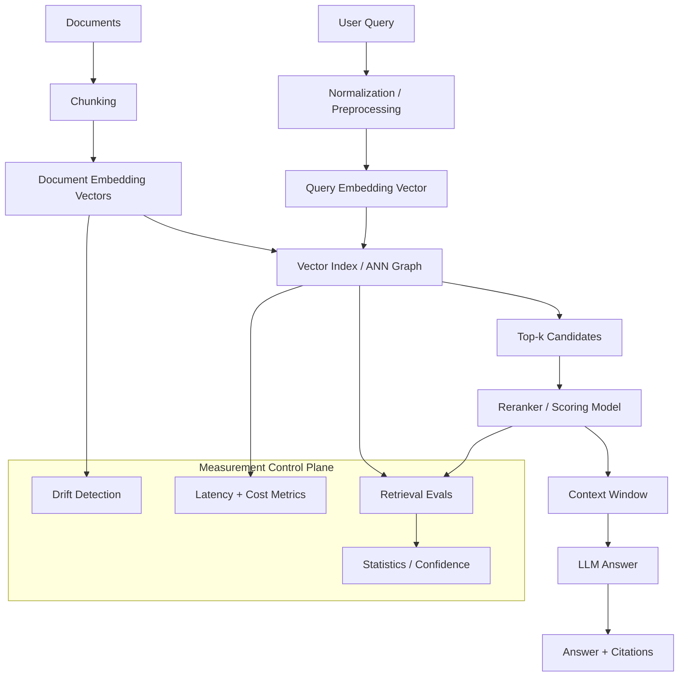

# 00-04 — Mathematics for AI Engineering

| Meta | Value |
|------|-------|
| **Estimated Time** | 6–7 hours (read 2h · labs 3h · eval memo 1–2h) |
| **Difficulty** | Intermediate (math literacy) · Advanced (production judgment) |
| **Prerequisites** | [00-01](00-01-AI-Engineering-Mindset.md) · Python comfort · basic data structures |
| **Module** | 00 — Foundations |
| **Related** | [00-05](00-05-Python-for-AI-Engineering.md) · [00-06](00-06-APIs-for-AI-Engineering.md) · [04-01](../04-RAG/04-01-RAG-Architecture.md) · [04-02](../04-RAG/04-02-Chunking-Metadata-Embeddings.md) · [04-03](../04-RAG/04-03-Vector-DB-Hybrid-Search-Reranking.md) · [08-01](../08-Evaluation-LLMOps/08-01-Evaluation-Lifecycle.md) · [Master Study Roadmap](../../Master%20Study%20Roadmap.md) |

---

## Learning Objectives

By the end of this chapter you will be able to:

1. Explain vectors, matrices, norms, dot products, and cosine similarity without hand-waving.
2. Interpret embeddings as **geometry over meaning**, not magic semantic IDs.
3. Reason about vector search, nearest neighbors, and approximate nearest neighbor indexes such as HNSW.
4. Use probability and statistics to design reliable evals, confidence intervals, and A/B readouts.
5. Connect optimization intuition to model behavior, fine-tuning, prompt search, reranking, and cost/latency tradeoffs.
6. Implement a small embedding search lab in pure Python and know when it stops scaling.
7. Defend math choices in Staff/Principal design reviews without pretending to be a research scientist.

---

## Why This Topic Matters

AI engineers do not need to derive every theorem from first principles. They do need enough mathematics to avoid building systems whose behavior they cannot explain.

In production GenAI, math appears in ordinary engineering decisions:

- Which chunks are nearest to a query?
- Why did recall drop after changing an embedding model?
- How many eval examples are enough to trust a regression?
- Does a 1.5 percentage point improvement matter, or is it noise?
- Why does reranking improve quality but increase latency?
- When is brute-force search acceptable, and when do you need ANN infrastructure?

Staff and Principal engineers are expected to translate these questions into architecture, measurement, and risk decisions. The important skill is not reciting equations. It is knowing which equation controls the failure mode in front of you.

This chapter is the minimum mathematical operating model for RAG, evals, embeddings, vector databases, and AI platform design.

---

## Business Impact

| Business outcome | Mathematical lever |
|------------------|--------------------|
| **Higher retrieval quality** | Better embedding choice, similarity metric, chunking, and recall measurement |
| **Lower COGS** | ANN search, caching, smaller candidate sets, and statistical stopping rules |
| **Fewer false launches** | Confidence intervals and power-aware evals instead of anecdotal wins |
| **Better compliance posture** | Explainable thresholds, reproducible scoring, audit-friendly metrics |
| **Faster incident debugging** | Decompose failures into data drift, embedding drift, retrieval miss, ranking error, or generation error |
| **Stronger architecture reviews** | Quantify tradeoffs instead of arguing from taste |

---

## Architecture Overview

Mathematics sits below the visible AI product surface:



**Mental model:** Embeddings turn unstructured content into points. Similarity metrics define distance. Indexes make search fast. Statistics tells you whether a measured improvement is real. Optimization is the pressure that tunes systems toward an objective, sometimes in ways you did not intend.

Cross-link: RAG chapters [04-01](../04-RAG/04-01-RAG-Architecture.md), [04-02](../04-RAG/04-02-Chunking-Metadata-Embeddings.md), and [04-03](../04-RAG/04-03-Vector-DB-Hybrid-Search-Reranking.md) build directly on this chapter.

---

## Core Concepts

### 1) Scalars, Vectors, and Matrices

#### Definition

| Object | Shape | AI engineering example |
|--------|-------|------------------------|
| Scalar | one number | latency, loss, probability, token cost |
| Vector | ordered list of numbers | embedding for a query or document chunk |
| Matrix | table of numbers | batch of embeddings, model weights, similarity scores |

#### Intuition

A vector is an address in a geometric space. In AI systems, that address often represents a learned summary of text, image, audio, code, or structured features.

```text
query_embedding = [0.12, -0.04, 0.88, ...]
doc_embedding   = [0.10, -0.02, 0.76, ...]
```

If two vectors point in similar directions, many embedding models intend that as "semantically similar."

#### Production notes

- Embedding dimensions are model-specific; do not mix vectors from different embedding models.
- Store `embedding_model`, `embedding_version`, and `created_at` alongside vectors.
- Treat embedding migrations like schema migrations.
- Batch operations are matrix operations; this is why GPUs and vectorized libraries matter.

---

### 2) Dot Product

#### Definition

For vectors `a` and `b`:

```text
a · b = a1*b1 + a2*b2 + ... + an*bn
```

#### Intuition

The dot product is high when vectors point in similar directions and have large magnitudes.

#### Production notes

Dot product is common in vector databases because it is fast and can be optimized heavily. It is not automatically the same as cosine similarity unless vectors are normalized.

| Condition | Dot product behavior |
|-----------|----------------------|
| Vectors normalized to length 1 | Equivalent ranking to cosine similarity |
| Vectors not normalized | Magnitude affects score |
| Model trained for dot product | Use provider recommendation |
| Model trained for cosine | Normalize or choose cosine metric |

---

### 3) Norms

#### Definition

A norm measures vector length.

```text
L2 norm = sqrt(x1^2 + x2^2 + ... + xn^2)
```

#### Intuition

In two dimensions, a norm is the length of the arrow from origin to point. In embedding spaces, norms may encode confidence, frequency, or artifacts of training depending on the model.

#### Common norms

| Norm | Formula intuition | Use |
|------|-------------------|-----|
| L1 | sum of absolute values | sparse features, robust-ish differences |
| L2 | Euclidean length | embeddings, distances, regularization |
| L∞ | max absolute value | worst-dimension bounds |

#### Production notes

Normalizing vectors to unit length is common before cosine search:

```text
unit_vector = vector / L2_norm(vector)
```

Do this consistently at ingest and query time. A mismatch between document normalization and query normalization creates silent retrieval regressions.

---

### 4) Cosine Similarity

#### Definition

Cosine similarity is the cosine of the angle between two vectors:

```text
cosine(a, b) = (a · b) / (||a|| * ||b||)
```

It ranges from `-1` to `1` for real-valued vectors:

- `1`: same direction
- `0`: orthogonal / unrelated under the embedding geometry
- `-1`: opposite direction

#### Intuition

Cosine similarity asks: "Do these vectors point in the same direction?" It mostly ignores vector length.

#### Production notes

- Cosine is often a strong default for text embeddings.
- Score thresholds are not portable across embedding models.
- Top-k ranking is usually more stable than absolute thresholds.
- Always evaluate with domain-specific queries and expected documents.

---

### 5) Embeddings Intuition

#### Definition

An embedding model maps an input into a vector:

```text
f("How do I reset my password?") -> [0.031, -0.442, ...]
```

#### Intuition

Embeddings place similar items near each other in a learned space. The space is not organized by human-readable axes like "billing" or "legal." It is distributed: many dimensions jointly encode useful relationships.

#### What embeddings are good at

- semantic search
- duplicate detection
- clustering
- recommendations
- retrieval candidate generation
- routing queries by similarity to examples

#### What embeddings are weak at

- exact numeric comparison
- permissions and policy enforcement
- fresh facts not present at embedding time
- subtle negation
- long multi-hop reasoning
- explainability at dimension level

#### Production notes

Do not ask embeddings to solve authorization, policy, or truth. Use them to retrieve candidates, then apply deterministic filters, rerankers, citations, and model reasoning.

---

### 6) Probability for AI Engineers

#### Definition

Probability measures uncertainty. In production AI, uncertainty appears in model outputs, retrieval relevance, eval samples, user behavior, and incident frequency.

#### Core terms

| Term | Meaning | Example |
|------|---------|---------|
| Random variable | Quantity with uncertain value | answer correctness on a sampled query |
| Distribution | Pattern of possible values | latency distribution |
| Expected value | Long-run average | expected cost per request |
| Variance | Spread around mean | quality volatility across user segments |
| Conditional probability | Probability given evidence | probability of hallucination given no retrieved source |

#### Production notes

- Use percentiles, not just averages, for latency and cost.
- Segment distributions by customer, language, product area, and query class.
- Track calibration when scores are interpreted as probabilities.
- Avoid false precision: a small sample can produce confident-looking dashboards.

---

### 7) Statistics for Evals

#### Definition

Statistics helps infer whether observed eval results reflect real system behavior or sampling noise.

#### Common eval metrics

| Metric | Meaning | Use |
|--------|---------|-----|
| Accuracy | fraction correct | classification and binary graders |
| Precision | returned positives that are correct | avoid bad retrieved docs |
| Recall | true positives found | avoid missing relevant docs |
| F1 | harmonic mean of precision and recall | balanced classification |
| MRR | reciprocal rank of first relevant result | search ranking |
| nDCG | rank quality with graded relevance | retrieval and recommendation |
| Win rate | pairwise preference success | LLM output comparisons |

#### Confidence intervals

If 82 out of 100 examples pass, the observed pass rate is 82%. That does not mean the true pass rate is exactly 82%. A confidence interval gives a plausible range.

#### Production notes

- Report `n`, not only percentages.
- Separate offline evals from online A/B metrics.
- Keep frozen regression sets and rotating fresh sets.
- Use bootstrap confidence intervals when metric formulas are complex.
- Treat eval data quality as production data quality.

---

### 8) Optimization Intuition

#### Definition

Optimization is the process of changing variables to improve an objective.

#### Examples in AI engineering

| Optimization target | Variables |
|---------------------|-----------|
| lower latency | top-k, timeout, model size, batching |
| higher answer quality | prompt, retrieval strategy, reranker, model |
| lower cost | routing threshold, cache policy, max tokens |
| safer behavior | tool allowlist, abstain threshold, classifier threshold |
| better eval score | training data, fine-tune hyperparameters, prompts |

#### Intuition

Every metric you optimize becomes a pressure. If you optimize only helpfulness, the system may become overconfident. If you optimize only cost, quality may collapse for hard cases. If you optimize only average latency, tail latency may hurt enterprise customers.

#### Production notes

Use multi-objective scorecards:

| Dimension | Example constraint |
|-----------|--------------------|
| Quality | pass rate ≥ 92% on critical evals |
| Safety | unsafe action rate = 0 in release gate |
| Latency | p95 ≤ 3 seconds |
| Cost | average ≤ $0.03/request |
| Reliability | provider fallback success ≥ 99% |

---

### 9) Vector Search and Nearest Neighbors

#### Definition

Nearest-neighbor search finds the vectors closest to a query vector under a metric.

#### Brute force search

Compare the query to every document vector:

```text
for each document:
    score = cosine(query, document)
sort by score
return top_k
```

#### Production notes

Brute force is simple and exact, but scales poorly:

| Corpus size | Brute force practicality |
|-------------|--------------------------|
| hundreds | fine in process |
| thousands | fine for prototypes and tests |
| millions | usually needs ANN/vector DB |
| billions | specialized infra and careful sharding |

Brute force remains valuable for correctness tests. ANN indexes should be compared against exact search on sampled datasets.

---

### 10) Approximate Nearest Neighbor and HNSW

#### Definition

Approximate nearest neighbor (ANN) indexes trade a small amount of recall for much faster search.

HNSW means **Hierarchical Navigable Small World** graph. It builds layered graphs over vectors so search can jump quickly through the space.

#### Mental model

Imagine a city map:

- Top layers are highways between major regions.
- Lower layers are local streets.
- Search starts on a sparse high-level graph.
- It greedily moves closer to the query.
- It descends into denser layers for local refinement.

#### Important HNSW knobs

| Knob | Meaning | Tradeoff |
|------|---------|----------|
| `M` | number of graph connections per node | higher recall, more memory |
| `ef_construction` | search breadth while building | better graph, slower ingest |
| `ef_search` | search breadth at query time | higher recall, higher latency |

#### Production notes

- ANN is not magic; measure recall against exact search.
- Index parameters affect memory and latency.
- Deletions and updates may require compaction or rebuilds depending on the system.
- Filtering by metadata can reduce recall if the index and filter strategy interact poorly.

---

## When / When NOT

### When to use vector search

Use vector search when:

- users ask natural-language questions over a document corpus;
- exact keyword matching misses synonyms and paraphrases;
- you need candidate generation before reranking;
- semantic similarity is the right first-pass retrieval primitive;
- corpus scale is too large for prompt-only context.

### When NOT to use vector search

Do not use vector search as the primary mechanism when:

- the user needs exact IDs, dates, account numbers, or prices;
- authorization must determine which documents are visible;
- the task is a relational query better handled by SQL;
- the corpus is tiny enough to fit directly in context;
- the business requirement is deterministic policy execution.

### When to use statistical evals

Use statistical evals when:

- a launch decision depends on a measured quality delta;
- you compare prompts, models, retrievers, or rerankers;
- incidents are rare but high impact;
- stakeholders need confidence in a regression gate.

### When NOT to over-mathematize

Avoid complex math when:

- the failure is obvious from traces;
- data labels are low quality;
- a small deterministic rule solves the issue;
- the team cannot operate the added complexity;
- the metric does not map to user or business value.

---

## Implementation / Lab

### Lab — Cosine Similarity and Simple Nearest-Neighbor Search

This lab intentionally avoids external dependencies. Production systems should use NumPy, vector databases, and provider embedding APIs, but pure Python makes the math visible.

Save as `embedding_search_lab.py` and run:

```bash
python embedding_search_lab.py
```

```python
"""Small embedding search lab for AI engineering math.

The vectors below are toy embeddings. Real embeddings come from a model.
The search code mirrors the core mechanics behind RAG candidate retrieval:

1. Normalize vectors.
2. Score query-to-document similarity.
3. Return top-k candidates.
4. Evaluate whether expected documents were retrieved.
"""

from __future__ import annotations

from dataclasses import dataclass
from math import sqrt
from typing import Iterable


Vector = list[float]


@dataclass(frozen=True)
class Document:
    doc_id: str
    title: str
    text: str
    embedding: Vector
    metadata: dict[str, str]


@dataclass(frozen=True)
class SearchResult:
    doc: Document
    score: float


def dot(a: Vector, b: Vector) -> float:
    if len(a) != len(b):
        raise ValueError(f"dimension mismatch: {len(a)} != {len(b)}")
    return sum(x * y for x, y in zip(a, b))


def l2_norm(v: Vector) -> float:
    return sqrt(sum(x * x for x in v))


def normalize(v: Vector) -> Vector:
    norm = l2_norm(v)
    if norm == 0:
        raise ValueError("cannot normalize a zero vector")
    return [x / norm for x in v]


def cosine_similarity(a: Vector, b: Vector) -> float:
    return dot(a, b) / (l2_norm(a) * l2_norm(b))


def top_k_search(query_embedding: Vector, docs: Iterable[Document], k: int = 3) -> list[SearchResult]:
    scored: list[SearchResult] = []
    query_unit = normalize(query_embedding)

    for doc in docs:
        # If document vectors are normalized at ingest, dot(query_unit, doc_unit)
        # is equivalent to cosine similarity and cheaper to compute.
        doc_unit = normalize(doc.embedding)
        scored.append(SearchResult(doc=doc, score=dot(query_unit, doc_unit)))

    return sorted(scored, key=lambda result: result.score, reverse=True)[:k]


def recall_at_k(results: list[SearchResult], relevant_doc_ids: set[str], k: int) -> float:
    if not relevant_doc_ids:
        raise ValueError("relevant_doc_ids must not be empty")
    retrieved = {result.doc.doc_id for result in results[:k]}
    return len(retrieved & relevant_doc_ids) / len(relevant_doc_ids)


def precision_at_k(results: list[SearchResult], relevant_doc_ids: set[str], k: int) -> float:
    if k <= 0:
        raise ValueError("k must be positive")
    retrieved = {result.doc.doc_id for result in results[:k]}
    return len(retrieved & relevant_doc_ids) / k


DOCS = [
    Document(
        doc_id="rag-001",
        title="RAG retrieval basics",
        text="Chunk documents, embed chunks, retrieve top-k, rerank, cite sources.",
        embedding=[0.91, 0.12, 0.05, 0.02],
        metadata={"module": "04", "topic": "rag"},
    ),
    Document(
        doc_id="eval-001",
        title="Evaluation statistics",
        text="Use confidence intervals and regression sets for model evaluation.",
        embedding=[0.10, 0.88, 0.13, 0.04],
        metadata={"module": "08", "topic": "evals"},
    ),
    Document(
        doc_id="api-001",
        title="API streaming",
        text="Stream tokens to clients with SSE or WebSockets from an AI backend.",
        embedding=[0.03, 0.08, 0.89, 0.20],
        metadata={"module": "00", "topic": "apis"},
    ),
    Document(
        doc_id="security-001",
        title="Prompt injection defense",
        text="Treat retrieved text as untrusted data and constrain tool use.",
        embedding=[0.46, 0.31, 0.20, 0.76],
        metadata={"module": "11", "topic": "security"},
    ),
]


QUERIES = [
    ("How should I retrieve chunks for a RAG answer?", [0.84, 0.18, 0.03, 0.05], {"rag-001"}),
    ("How do I know an eval improvement is real?", [0.09, 0.91, 0.09, 0.02], {"eval-001"}),
    ("How can I stream tokens from a backend?", [0.02, 0.06, 0.93, 0.16], {"api-001"}),
]


def main() -> None:
    recall_scores: list[float] = []

    for query_text, query_embedding, relevant in QUERIES:
        results = top_k_search(query_embedding, DOCS, k=3)
        recall = recall_at_k(results, relevant, k=3)
        precision = precision_at_k(results, relevant, k=3)
        recall_scores.append(recall)

        print(f"\nQUERY: {query_text}")
        print(f"precision@3={precision:.2f} recall@3={recall:.2f}")
        for rank, result in enumerate(results, start=1):
            print(f"{rank}. {result.doc.doc_id} score={result.score:.3f} title={result.doc.title}")

    print(f"\nmean recall@3={sum(recall_scores) / len(recall_scores):.2f}")


if __name__ == "__main__":
    main()
```

---

## Failure Modes

| Failure mode | Symptom | Root cause | Mitigation |
|--------------|---------|------------|------------|
| Mixed embedding spaces | relevant docs disappear | corpus embedded with one model, query with another | versioned embedding contracts and migration jobs |
| Wrong similarity metric | search quality drops after DB change | cosine vs dot vs L2 mismatch | follow model guidance and regression-test rankings |
| Over-trusting absolute scores | threshold works in dev, fails in prod | score distributions shift by domain | evaluate thresholds per corpus/model version |
| Low recall hidden by good answers | LLM answers plausibly from wrong context | generator compensates or hallucinates | retrieval evals before answer evals |
| Small eval set overfit | prompt wins on 30 examples, loses online | sampling noise and prompt tuning leakage | frozen and fresh eval splits with intervals |
| ANN recall regression | exact search finds doc, index does not | poor `ef_search`, filters, stale index | compare ANN to exact on sampled queries |
| Metadata filter leak | user sees unauthorized candidate | filtering applied after prompt assembly | enforce ACL before retrieval or before context assembly |
| Optimizing one metric | cheaper system causes escalations | cost target ignored quality/tail risk | multi-objective release gates |
| Distribution shift | quality drops for new products/languages | evals underrepresent traffic | segment evals and drift monitors |
| Misread p-values | team ships non-meaningful difference | statistical test used mechanically | report effect size, interval, and business impact |

---

## Interview Questions

### Senior Engineer

1. Explain cosine similarity to a product manager.
2. Why should you not mix embeddings from two different models?
3. What is the difference between precision@k and recall@k?
4. When is brute-force nearest-neighbor search acceptable?
5. How would you debug a RAG system that retrieves irrelevant documents?

### Staff Engineer

1. Design an eval for retrieval quality before generation quality.
2. How would you compare two embedding models for an enterprise knowledge base?
3. What metrics would you put in a launch gate for a vector-search-backed assistant?
4. Explain HNSW tradeoffs to an infrastructure team.
5. How would you handle embedding migrations without downtime?

### Principal Engineer

1. Define an org-wide standard for vector index versioning, evals, and rollback.
2. How would you decide build vs buy for vector database infrastructure?
3. A team claims a 2% eval improvement. What evidence do you require before approving rollout?
4. How do you design retrieval for high-recall legal or medical workflows?
5. Where should mathematical complexity live: app teams, platform teams, or vendor services?

### Engineering Manager

1. What skills should your team have before owning a RAG platform?
2. How do you schedule work for eval data quality versus feature delivery?
3. What dashboard would you ask for before approving a model or embedding migration?
4. How do you explain statistical uncertainty to executives?
5. How do you avoid hiring only research specialists for applied AI engineering work?

---

## Revision Notes

| Date | Change |
|------|--------|
| 2026-07-20 | Initial chapter: math foundations for embeddings, retrieval, ANN, eval statistics, and optimization intuition. |

---

## Summary

Mathematics for AI engineering is operational math. Vectors and matrices explain embeddings. Norms and dot products explain similarity. Probability and statistics explain whether evals mean anything. Optimization explains why systems improve in one dimension and regress in another.

For Staff and Principal engineers, the goal is not to become a mathematician. The goal is to know enough math to set the right architecture boundaries, ask for the right measurements, debug the right layer, and keep teams from shipping numerology as engineering.

---

## Further Reading

| Resource | Why it matters | URL |
|----------|----------------|-----|
| Mathematics for Machine Learning | Free book covering linear algebra, probability, statistics, and optimization foundations | https://mml-book.github.io/ |
| 3Blue1Brown — Essence of Linear Algebra | Visual intuition for vectors, matrices, basis, and transformations | https://www.3blue1brown.com/topics/linear-algebra |
| 3Blue1Brown — Neural Networks | Visual intuition for gradients and learned representations | https://www.3blue1brown.com/topics/neural-networks |
| StatQuest | Practical explanations of statistics, ML, p-values, regression, and evaluation ideas | https://statquest.org/ |
| scikit-learn User Guide — Nearest Neighbors | Practical nearest-neighbor concepts and algorithms | https://scikit-learn.org/stable/modules/neighbors.html |
| FAISS documentation | Facebook AI Similarity Search library for efficient vector search | https://faiss.ai/ |
| hnswlib GitHub | HNSW implementation useful for understanding ANN graph parameters | https://github.com/nmslib/hnswlib |
| Pinecone — HNSW explained | Engineering-oriented explanation of HNSW mental model and tradeoffs | https://www.pinecone.io/learn/series/faiss/hnsw/ |
| OpenAI Embeddings Guide | Provider guidance for embedding use cases and similarity search | https://platform.openai.com/docs/guides/embeddings |
| Google Machine Learning Crash Course | Applied statistics and ML evaluation concepts | https://developers.google.com/machine-learning/crash-course |
