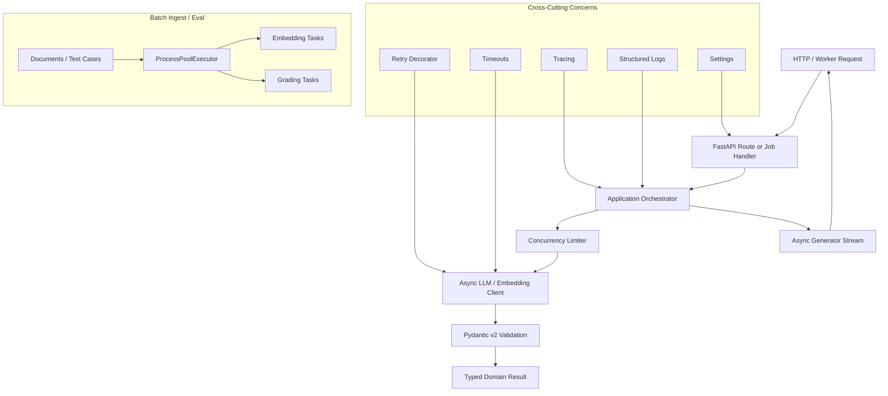

# 00-05 — Python for AI Engineering

| Meta | Value |
|------|-------|
| **Estimated Time** | 7–8 hours (read 2h · labs 4h · packaging review 1–2h) |
| **Difficulty** | Intermediate (Python fluency) · Advanced (production concurrency and typing) |
| **Prerequisites** | [00-01](00-01-AI-Engineering-Mindset.md) · [00-04](00-04-Mathematics-for-AI-Engineering.md) · basic HTTP/API literacy |
| **Module** | 00 — Foundations |
| **Related** | [00-06](00-06-APIs-for-AI-Engineering.md) · [02-02](../02-Prompt-Engineering/02-02-Structured-Outputs-Tool-Calling.md) · [03-02](../03-Agentic-Fundamentals/03-02-Tools-Memory-Control-Flow.md) · [08-02](../08-Evaluation-LLMOps/08-02-Observability-Tracing-Cost.md) |

---

## Learning Objectives

By the end of this chapter you will be able to:

1. Use modern Python features that matter for AI systems: dataclasses, typing, context managers, decorators, and generators.
2. Design `asyncio` concurrency for high-latency LLM and embedding calls without overwhelming providers.
3. Implement streaming patterns for token output and event pipelines.
4. Build retry, timeout, and trace decorators with production constraints.
5. Validate structured LLM outputs with Pydantic v2.
6. Use multiprocessing for CPU-bound ingest and eval work while avoiding common process-safety failures.
7. Package a small AI utility library with `pyproject.toml` and a clean module boundary.
8. Explain Python tradeoffs in Senior/Staff/Principal AI engineering interviews.

---

## Why This Topic Matters

Most GenAI production systems are not limited by "model intelligence" alone. They are limited by ordinary software engineering:

- too many serial LLM calls;
- unbounded concurrency that triggers rate limits;
- streaming code that cannot be cancelled;
- JSON outputs that are trusted before validation;
- retry logic that retries unsafe side effects;
- ingestion jobs that run for hours because CPU work is single-process;
- notebooks that never become packages;
- dynamic Python that becomes unreviewable at scale.

Python is the dominant language for AI engineering because the ecosystem is deep: model SDKs, data tooling, FastAPI, Pydantic, PyTorch, NumPy, orchestration frameworks, eval harnesses, and vector DB clients.

At Staff/Principal level, the question is not "Can you write Python?" The question is "Can your Python survive traffic, incidents, code review, and ownership transfer?"

---

## Business Impact

| Business outcome | Python engineering lever |
|------------------|--------------------------|
| **Lower latency** | concurrent LLM calls, streaming responses, batching |
| **Lower provider errors** | bounded concurrency, retries with backoff, timeouts |
| **Higher reliability** | typed contracts, Pydantic validation, explicit error handling |
| **Faster feature delivery** | reusable packages instead of notebook copy/paste |
| **Lower operational cost** | multiprocessing for ingest/evals, caching, efficient iterators |
| **Auditability** | trace decorators, structured logs, schema-versioned outputs |
| **Hiring signal** | candidates can discuss event loops, process pools, and package boundaries |

---

## Architecture Overview

Production Python for AI backends usually separates orchestration, provider access, validation, streaming, and observability:



**Mental model:** Python is the control plane for AI systems. The LLM does language work. Python owns contracts, concurrency, cancellation, validation, retries, telemetry, packaging, and integration with the rest of the product.

---

## Core Concepts

### 1) Advanced Python as Production Leverage

#### Definition

Advanced Python does not mean clever metaprogramming. In AI engineering, it means using language features to make uncertainty explicit and workflows composable.

#### Production notes

- Use dataclasses, type hints, protocols, decorators, context managers, generators, `asyncio`, and multiprocessing where they clarify ownership and failure behavior.
- Prefer boring explicit code over dynamic magic.
- Type the boundaries: API models, tool inputs, tool outputs, provider responses.
- Use `mypy` or `pyright` where the repo supports it.
- Keep notebook code out of runtime packages.

---

### 2) `asyncio` for LLM I/O

#### Definition

`asyncio` lets Python interleave waiting on network I/O. LLM calls are usually network-bound, so concurrency improves throughput and latency for fan-out workloads.

#### Intuition

If one LLM call takes 2 seconds, ten serial calls may take 20 seconds. Ten concurrent calls may still take close to 2–4 seconds, depending on provider limits and network conditions.

#### Staff-level caveat

Concurrency is not parallelism. It does not make CPU-heavy parsing faster. It makes waiting cheaper.

#### Production notes

- Bound concurrency with `asyncio.Semaphore`.
- Use provider timeouts.
- Propagate cancellation.
- Do not call blocking SDK methods inside `async def` unless you isolate them with `to_thread`.
- Preserve request IDs through tasks for tracing.

---

### 3) Generators and Streaming

#### Definition

A generator yields values lazily. An async generator yields values over time while awaiting I/O.

#### AI use cases

- token streaming to a UI;
- progress events during long-running agent workflows;
- chunked document ingestion;
- eval result streaming to dashboards;
- server-sent events and WebSocket backends.

#### Production notes

- Define event schemas; do not stream arbitrary dicts forever.
- Include terminal events such as `done` or `error`.
- Handle client disconnects and cancellation.
- Avoid buffering the full LLM response if the product needs first-token latency.

---

### 4) Decorators for Retry, Timeout, and Trace

#### Definition

A decorator wraps a function to add behavior while preserving the core function body.

#### Useful AI decorators

| Decorator | Purpose |
|-----------|---------|
| `@retry` | transient provider failures, HTTP 429/503 |
| `@timeout` | prevent hung requests from consuming workers |
| `@trace` | record spans, token counts, model, prompt version |
| `@redact_logs` | prevent PII/secrets from leaking into logs |
| `@policy_check` | enforce tool or route constraints |

#### Production notes

Retries are dangerous around side effects. Retrying a read is usually safe. Retrying a "send email" or "charge card" tool can create incidents unless the operation is idempotent.

---

### 5) Dataclasses and Typed Domain Objects

#### Definition

`dataclass` creates lightweight classes for data-carrying domain objects.

#### AI examples

```python
from dataclasses import dataclass


@dataclass(frozen=True)
class PromptVersion:
    name: str
    template_sha: str
    model: str
```

#### Production notes

- Use frozen dataclasses for values that should not mutate.
- Use Pydantic for untrusted external data.
- Use dataclasses for trusted internal domain objects.
- Avoid passing raw dicts through many layers.

---

### 6) Typing and Protocols

#### Definition

Typing documents and verifies expected shapes. `Protocol` defines behavior without requiring inheritance.

#### Example

```python
from typing import Protocol


class ChatClient(Protocol):
    async def complete(self, prompt: str) -> str:
        ...
```

#### Production notes

Protocols are useful when swapping model providers, test doubles, local mocks, or fallback clients.

---

### 7) Pydantic v2 for Structured LLM Outputs

#### Definition

Pydantic validates runtime data against typed schemas. In AI engineering, it is a critical boundary between probabilistic model output and deterministic application code.

#### Why v2 matters

Pydantic v2 introduced a new validation core and APIs such as:

- `model_validate`
- `model_validate_json`
- `model_dump`
- `model_json_schema`
- `field_validator`
- `model_validator`

#### Production notes

- Validate model outputs before acting on them.
- Treat validation failure as an expected path, not an exception-only surprise.
- Version schemas when prompts depend on output shape.
- Use JSON Schema from Pydantic models for tool/function definitions when supported.

---

### 8) Multiprocessing for Ingest and Evals

#### Definition

Multiprocessing runs work in separate Python processes. It helps with CPU-bound tasks because each process has its own interpreter and can use a CPU core.

Good candidates include PDF parsing, OCR preprocessing, tokenization, chunking, local eval scoring, and synthetic-data generation. Poor candidates include simple LLM API fan-out, tiny tasks with high process overhead, unpicklable live connections, and jobs that mutate shared globals.

#### Production notes

- Keep worker functions top-level and picklable.
- Do not share live DB or network clients across processes.
- Batch small tasks to amortize overhead.
- Write checkpointed outputs so jobs can resume after failure.

---

### 9) Packaging with `pyproject.toml`

#### Definition

`pyproject.toml` declares Python package metadata, dependencies, build backend, and tool configuration.

#### Production notes

- Put runtime code under `src/<package_name>/`.
- Keep notebooks, experiments, and scripts outside the import path.
- Pin application lockfiles according to repo policy.
- Expose CLIs through `[project.scripts]`.
- Separate runtime dependencies from dev/test dependencies.

---

## When / When NOT

### When to use `asyncio`

Use `asyncio` when:

- calls are I/O-bound;
- you need to call multiple model, vector DB, or API endpoints;
- streaming first-token latency matters;
- you can bound concurrency and handle cancellation.

### When NOT to use `asyncio`

Avoid `asyncio` when:

- the workload is CPU-bound and pure Python;
- the team is unfamiliar and a worker queue is simpler;
- the SDK is blocking and cannot be safely wrapped;
- request ordering and transaction semantics become unclear.

### When to use multiprocessing

Use multiprocessing when:

- parsing/chunking/eval work burns CPU;
- tasks are independent and picklable;
- job outputs can be checkpointed;
- throughput matters more than interactive latency.

### When NOT to use multiprocessing

Avoid multiprocessing when:

- tasks are primarily network-bound;
- workers need shared mutable state;
- startup overhead dominates;
- deployment memory limits are tight.

### When to create a package

Create a package when:

- two services import the same AI utility;
- prompts, schemas, clients, and evals need versioned ownership;
- notebook code is becoming product code;
- you need CI, tests, and release notes around shared behavior.

---

## Implementation / Lab

### Lab A — Async Concurrent LLM Mock Calls

This lab simulates LLM calls with latency, rate limits, retries, tracing, validation, and streaming. It runs without external services.

Save as `async_llm_lab.py`:

```python
from __future__ import annotations

import asyncio
import functools
import json
import random
import time
from collections.abc import AsyncIterator, Awaitable, Callable
from dataclasses import dataclass
from typing import ParamSpec, TypeVar

from pydantic import BaseModel, Field, ValidationError

P = ParamSpec("P")
T = TypeVar("T")


class LLMTransientError(RuntimeError):
    pass


def trace(name: str) -> Callable[[Callable[P, Awaitable[T]]], Callable[P, Awaitable[T]]]:
    def outer(fn: Callable[P, Awaitable[T]]) -> Callable[P, Awaitable[T]]:
        @functools.wraps(fn)
        async def inner(*args: P.args, **kwargs: P.kwargs) -> T:
            start = time.perf_counter()
            try:
                return await fn(*args, **kwargs)
            except Exception as exc:
                print(json.dumps({"span": name, "status": "error", "type": type(exc).__name__}))
                raise
            finally:
                elapsed_ms = round((time.perf_counter() - start) * 1000, 2)
                print(json.dumps({"span": name, "elapsed_ms": elapsed_ms}))

        return inner

    return outer


def retry(attempts: int = 3, base_delay: float = 0.05) -> Callable[[Callable[P, Awaitable[T]]], Callable[P, Awaitable[T]]]:
    def outer(fn: Callable[P, Awaitable[T]]) -> Callable[P, Awaitable[T]]:
        @functools.wraps(fn)
        async def inner(*args: P.args, **kwargs: P.kwargs) -> T:
            for attempt in range(1, attempts + 1):
                try:
                    return await fn(*args, **kwargs)
                except LLMTransientError:
                    if attempt == attempts:
                        raise
                    jitter = random.uniform(0, base_delay)
                    await asyncio.sleep(base_delay * (2 ** (attempt - 1)) + jitter)
            raise AssertionError("unreachable")

        return inner

    return outer


def timeout(seconds: float) -> Callable[[Callable[P, Awaitable[T]]], Callable[P, Awaitable[T]]]:
    def outer(fn: Callable[P, Awaitable[T]]) -> Callable[P, Awaitable[T]]:
        @functools.wraps(fn)
        async def inner(*args: P.args, **kwargs: P.kwargs) -> T:
            return await asyncio.wait_for(fn(*args, **kwargs), timeout=seconds)

        return inner

    return outer


class TicketClassification(BaseModel):
    category: str = Field(pattern="^(billing|technical|security|general)$")
    priority: int = Field(ge=1, le=5)
    confidence: float = Field(ge=0, le=1)
    rationale: str = Field(min_length=10, max_length=300)


@dataclass(frozen=True)
class PromptJob:
    job_id: str
    customer_tier: str
    text: str


class MockLLMClient:
    def __init__(self, *, failure_rate: float = 0.15) -> None:
        self.failure_rate = failure_rate

    @trace("mock_llm.complete")
    @retry(attempts=3)
    @timeout(seconds=2.0)
    async def complete_json(self, prompt: str) -> str:
        await asyncio.sleep(random.uniform(0.05, 0.35))
        if random.random() < self.failure_rate:
            raise LLMTransientError("simulated 503 from provider")
        category = "billing" if "invoice" in prompt.lower() else "technical"
        return json.dumps({
            "category": category,
            "priority": 2 if category == "billing" else 3,
            "confidence": 0.84,
            "rationale": "The message contains clear signals for this support category.",
        })

    async def stream_answer(self, prompt: str) -> AsyncIterator[dict[str, str]]:
        yield {"event": "start", "text": ""}
        for token in ["I", " can", " help", " with", " that", "."]:
            await asyncio.sleep(0.04)
            yield {"event": "token", "text": token}
        yield {"event": "done", "text": ""}


async def classify_ticket(client: MockLLMClient, limiter: asyncio.Semaphore, job: PromptJob) -> TicketClassification:
    prompt = f"Classify this {job.customer_tier} support ticket: {job.text}"
    async with limiter:
        raw = await client.complete_json(prompt)
    try:
        return TicketClassification.model_validate_json(raw)
    except ValidationError as exc:
        raise ValueError(f"LLM output failed schema validation for {job.job_id}: {exc}") from exc


async def run_batch() -> None:
    random.seed(11)
    client = MockLLMClient()
    limiter = asyncio.Semaphore(4)
    texts = [
        "Invoice total does not match the contract.",
        "The dashboard returns a 500 error.",
        "Invoice PDF is missing VAT fields.",
        "Webhook retries are failing.",
        "The admin user cannot log in.",
        "Invoice reminder was sent twice.",
    ]
    jobs = [
        PromptJob(job_id=f"ticket-{i}", customer_tier="enterprise", text=text)
        for i, text in enumerate(texts, start=1)
    ]

    results = await asyncio.gather(*(classify_ticket(client, limiter, job) for job in jobs))
    for job, result in zip(jobs, results):
        print(job.job_id, result.model_dump())

    async for event in client.stream_answer("Explain billing issue"):
        print(event)


if __name__ == "__main__":
    asyncio.run(run_batch())
```

### Lab B — Pydantic Tool Schema

Use Pydantic v2 to define a tool input contract and export JSON Schema for an LLM function/tool interface.

```python
from __future__ import annotations

from typing import Literal

from pydantic import BaseModel, Field, field_validator


class SearchKnowledgeBaseInput(BaseModel):
    query: str = Field(min_length=3, max_length=500, description="User question to search for.")
    region: Literal["us", "eu", "apac"]
    top_k: int = Field(default=5, ge=1, le=20)
    include_internal: bool = Field(default=False)

    @field_validator("query")
    @classmethod
    def normalize_query(cls, value: str) -> str:
        return " ".join(value.split())


tool_definition = {
    "name": "search_knowledge_base",
    "description": "Search approved knowledge-base articles visible to the current user.",
    "parameters": SearchKnowledgeBaseInput.model_json_schema(),
}

print(tool_definition)
```

Production implication: the model may propose tool arguments, but Pydantic validates them before the tool executes.

### Lab C — Package a Small Library

Create a `src`-layout package with runtime code separated from tests and notebooks:

```text
ai_toolkit/
  pyproject.toml
  src/
    ai_toolkit/
      __init__.py
      schemas.py
      clients.py
      streaming.py
  tests/
    test_schemas.py
```

`pyproject.toml`:

```toml
[build-system]
requires = ["hatchling"]
build-backend = "hatchling.build"

[project]
name = "ai-toolkit"
version = "0.1.0"
description = "Small AI engineering utility package for prompts, schemas, and streaming."
readme = "README.md"
requires-python = ">=3.11"
dependencies = ["pydantic>=2"]

[project.scripts]
ai-toolkit-schema = "ai_toolkit.schemas:print_schema"
```

`src/ai_toolkit/schemas.py`:

```python
from __future__ import annotations

import json

from pydantic import BaseModel, Field


class AnswerContract(BaseModel):
    answer: str = Field(min_length=1)
    citations: list[str] = Field(default_factory=list)
    confidence: float = Field(ge=0, le=1)


def print_schema() -> None:
    print(json.dumps(AnswerContract.model_json_schema(), indent=2))
```

Smoke test:

```bash
pip install -e .
ai-toolkit-schema
```

---

## Failure Modes

| Failure mode | Symptom | Root cause | Mitigation |
|--------------|---------|------------|------------|
| Unbounded async fan-out | 429s, provider bans, noisy neighbor incidents | `gather` over thousands of calls | semaphores, queues, provider budgets |
| Blocking call inside event loop | all requests slow | sync SDK or CPU work in `async def` | async SDK, `to_thread`, process pool |
| Retry storm | outage worsens during provider incident | aggressive retries across fleet | backoff, jitter, retry budgets, circuit breakers |
| Retried side effects | duplicate email, duplicate payment, duplicate ticket | retry wrapper around non-idempotent tool | idempotency keys and side-effect policies |
| Untyped dict sprawl | fragile code and review misses | no boundary schemas | dataclasses and Pydantic models |
| Trusted LLM JSON | crashes or unsafe actions | model output parsed without validation | Pydantic validation and repair/abstain path |
| Streaming leaks | clients hang or memory grows | missing terminal events/cancellation handling | async generators with `done`/`error` and disconnect handling |
| Multiprocessing pickling error | batch job fails at runtime | nested worker function or live client | top-level functions and per-process setup |
| Package import chaos | works in notebook, fails in service | no `src` layout or dependency metadata | `pyproject.toml`, editable install, CI |
| Hidden global config | tests affect each other | mutable module-level settings | explicit config objects and dependency injection |

---

## Interview Questions

### Senior Engineer

1. When would you use `asyncio.gather` for LLM calls, and what guardrail would you add?
2. Explain why Pydantic validation is necessary for structured LLM outputs.
3. What is the difference between a generator and an async generator?
4. How would you implement retries for transient provider errors?
5. When should a notebook become a package?

### Staff Engineer

1. Design a concurrency model for 1,000 document summaries with provider rate limits.
2. How would you prevent retry storms during an LLM provider outage?
3. How do you type a provider abstraction that supports OpenAI, Anthropic, and a local mock?
4. Where do you place prompt templates, schemas, and eval fixtures in a Python package?
5. How do you debug event-loop blocking in a FastAPI AI backend?

### Principal Engineer

1. Define Python platform standards for AI services across an organization.
2. How would you govern shared AI utility packages without slowing product teams?
3. What belongs in decorators versus explicit application code?
4. How do you balance dynamic experimentation with typed production contracts?
5. What is your migration plan from notebook prototypes to owned services?

### Engineering Manager

1. What Python skills are required before a team owns an AI backend?
2. How would you prioritize packaging work against feature delivery?
3. What incidents suggest the team needs better concurrency discipline?
4. How do you staff a team that needs both product iteration and platform reliability?
5. Which code quality metrics matter for AI Python services?

---

## Revision Notes

| Date | Change |
|------|--------|
| 2026-07-20 | Initial chapter: production Python patterns for async LLM I/O, streaming, validation, multiprocessing, and packaging. |

---

## Summary

Python is where production AI systems become real software. The model may generate text, but Python controls concurrency, contracts, validation, retries, streaming, packaging, and operational visibility.

The Staff/Principal move is to keep Python explicit and boring at the boundaries while allowing experimentation inside safe seams. Use async for I/O, multiprocessing for CPU, Pydantic for untrusted structures, dataclasses for internal values, and packages for shared ownership.

---

## Further Reading

| Resource | Why it matters | URL |
|----------|----------------|-----|
| Python `asyncio` documentation | Official event loop, tasks, cancellation, synchronization primitives | https://docs.python.org/3/library/asyncio.html |
| Python `dataclasses` documentation | Official guide to dataclass value objects | https://docs.python.org/3/library/dataclasses.html |
| Python `typing` documentation | Official typing primitives, protocols, generics, and type aliases | https://docs.python.org/3/library/typing.html |
| Python `multiprocessing` documentation | Official process-based parallelism guide | https://docs.python.org/3/library/multiprocessing.html |
| Python Packaging User Guide | Official-ish community guide for packaging and `pyproject.toml` | https://packaging.python.org/en/latest/ |
| Pydantic v2 documentation | Runtime validation and JSON Schema generation for structured outputs | https://docs.pydantic.dev/latest/ |
| Real Python | Practical Python tutorials across async, packaging, testing, and typing | https://realpython.com/ |
| Fluent Python | Deep Python idioms and language model for senior engineers | https://www.oreilly.com/library/view/fluent-python-2nd/9781492056348/ |
| Ruff documentation | Fast Python linter/formatter commonly used in production repos | https://docs.astral.sh/ruff/ |
| mypy documentation | Static type checking for Python | https://mypy.readthedocs.io/en/stable/ |
