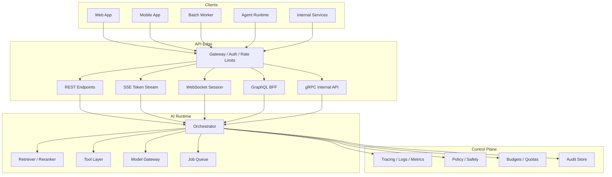
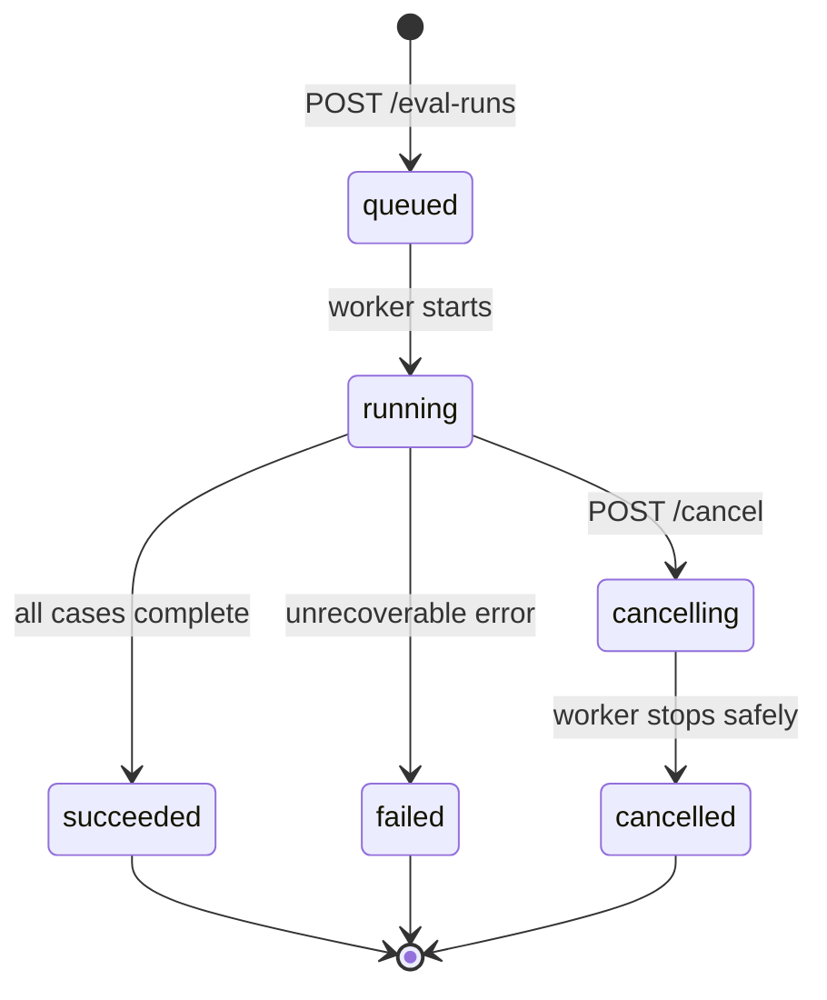

# 00-06 — APIs for AI Engineering

| Meta | Value |
|------|-------|
| **Estimated Time** | 7–8 hours (read 2h · FastAPI lab 3h · protocol review 2h) |
| **Difficulty** | Intermediate (API design) · Advanced (streaming, auth, service boundaries) |
| **Prerequisites** | [00-01](00-01-AI-Engineering-Mindset.md) · [00-05](00-05-Python-for-AI-Engineering.md) · basic HTTP literacy |
| **Module** | 00 — Foundations |
| **Related** | [02-02](../02-Prompt-Engineering/02-02-Structured-Outputs-Tool-Calling.md) · [03-02](../03-Agentic-Fundamentals/03-02-Tools-Memory-Control-Flow.md) · [07-01](../07-Protocols-MCP-A2A/07-01-MCP-Model-Context-Protocol.md) · [08-02](../08-Evaluation-LLMOps/08-02-Observability-Tracing-Cost.md) |

---

## Learning Objectives

By the end of this chapter you will be able to:

1. Choose between REST, GraphQL, WebSockets, SSE, and gRPC for AI system boundaries.
2. Design FastAPI endpoints for LLM calls, RAG retrieval, tool execution, and streaming tokens.
3. Implement dependency seams for auth, tenant context, model clients, and policy checks.
4. Explain why streaming is a product and infrastructure concern, not just a UI feature.
5. Define API contracts for asynchronous AI jobs and long-running agent workflows.
6. Build a production-shaped FastAPI lab with REST, SSE, WebSocket streaming, and a gRPC stub.
7. Discuss API tradeoffs at Senior/Staff/Principal/EM interview altitude.

---

## Why This Topic Matters

AI systems are integration systems. The model may be impressive, but production value arrives through APIs:

- product UIs call answer endpoints;
- agents call tools;
- batch workers submit eval jobs;
- retrievers call vector databases;
- model gateways enforce routing and budgets;
- audit services receive traces;
- customers integrate via public APIs.

Bad API design turns model uncertainty into platform instability. A route that blocks for 90 seconds, streams without cancellation, accepts unvalidated tool calls, or hides tenant identity in a global variable will become an incident.

Staff and Principal engineers should design AI APIs as durable contracts around probabilistic internals. The caller should know what can happen, how to retry, how to cancel, how to observe, and what guarantees the system does not make.

---

## Business Impact

| Business outcome | API engineering lever |
|------------------|-----------------------|
| **Faster product integration** | clear REST contracts and generated OpenAPI docs |
| **Better UX** | token streaming with SSE/WebSockets and progress events |
| **Lower incident rate** | timeouts, idempotency, auth dependencies, request limits |
| **Enterprise readiness** | tenant isolation, audit headers, versioned APIs |
| **Platform reuse** | common model gateway and tool execution APIs |
| **Lower cost** | centralized routing, caching, and rate limiting |
| **Hiring signal** | candidates reason about protocols, failure semantics, and service boundaries |

---

## Architecture Overview

AI backends usually expose multiple API styles because different consumers need different semantics:



**Mental model:** APIs are the blast doors around probabilistic systems. The model can be non-deterministic; the API contract should still be explicit about inputs, outputs, streaming events, errors, cancellation, idempotency, and audit.

---

## Core Concepts

### 1) REST

#### Definition

REST uses HTTP resources, methods, status codes, and representations. In AI systems, REST is the default for request/response workflows.

#### Common AI REST endpoints

| Endpoint | Purpose |
|----------|---------|
| `POST /v1/answers` | one-shot answer generation |
| `POST /v1/retrieval/search` | retrieve top-k context |
| `POST /v1/tools/{tool_name}:invoke` | execute a governed tool |
| `POST /v1/evals/runs` | start an eval run |
| `GET /v1/jobs/{job_id}` | poll long-running job status |
| `POST /v1/jobs/{job_id}:cancel` | request cancellation |

#### Production notes

- Use `POST` when the request body contains prompts, context, or filters.
- Return stable error shapes.
- Include request IDs and trace IDs.
- Use idempotency keys for retried writes.
- Avoid putting prompts or secrets in URLs.

---

### 2) GraphQL

#### Definition

GraphQL lets clients request exactly the fields they need from a typed graph.

#### AI use cases

- product "backend for frontend" APIs combining documents, answers, citations, and user state;
- admin consoles exploring eval results;
- graph-shaped domain data around customers, tickets, and recommendations;
- clients with many optional UI panels.

#### Production notes

GraphQL is usually not the best protocol for token streaming itself, although subscriptions exist. It is often useful as a composition layer that calls AI REST/gRPC services behind the scenes; control query cost, resolver batching, and field-aware authorization before exposing it broadly.

---

### 3) Server-Sent Events (SSE)

#### Definition

SSE streams events from server to client over a long-lived HTTP response using `text/event-stream`.

#### AI use cases

- token streaming;
- retrieval progress;
- agent step events;
- eval run progress;
- partial citations or tool observations.

#### Production notes

- SSE is one-way: server to client.
- It works well with browsers and HTTP infrastructure.
- Use event names and JSON payloads.
- Send terminal `done` and `error` events.
- Detect disconnects to stop model generation when possible.

---

### 4) WebSockets

#### Definition

WebSockets provide full-duplex communication over a persistent connection.

#### AI use cases

- chat sessions with client interrupts;
- voice or multimodal streams;
- collaborative agent sessions;
- bidirectional control messages such as pause, resume, and cancel;
- tool approval flows where the client responds mid-run.

#### Production notes

- WebSockets require connection lifecycle management.
- Auth and tenant context must be established at connection time and sometimes refreshed.
- Load balancers, proxies, and autoscaling require careful configuration.
- Backpressure matters when clients read slowly.

---

### 5) gRPC

#### Definition

gRPC is a high-performance RPC framework using Protocol Buffers for strongly typed service contracts.

#### AI use cases

- internal model gateway;
- high-throughput embedding service;
- retriever/reranker service boundaries;
- streaming internal events;
- polyglot platform services.

#### Production notes

gRPC is strong for internal service-to-service contracts. Public APIs often still use REST because customers and browsers integrate more easily with HTTP/JSON.

| gRPC strength | Tradeoff |
|---------------|----------|
| typed protobuf contracts | browser support requires adapters |
| efficient binary encoding | less human-readable debugging |
| unary and streaming RPCs | more tooling required |
| strong code generation | schema evolution discipline required |

---

### 6) FastAPI Patterns for AI Backends

#### Definition

FastAPI is a Python web framework that uses type hints and Pydantic models to define HTTP APIs.

#### Patterns that matter

| Pattern | Purpose |
|---------|---------|
| Pydantic request/response models | validate external input/output |
| dependencies | auth, tenant, settings, clients, policy |
| `StreamingResponse` | SSE/token streaming |
| `WebSocket` routes | bidirectional streaming |
| background tasks / job queues | long-running work |
| middleware | request IDs, logging, CORS, metrics |
| exception handlers | stable error contracts |

#### Production notes

- Keep routes thin; put orchestration in services.
- Use dependency injection for testable clients.
- Never store request-specific state in globals.
- Apply limits: body size, tokens, top-k, timeout, concurrency.
- Return citations and usage metadata when the product relies on them.

---

### 7) API Contracts for Long-Running AI Work

#### Definition

Long-running workflows should be modeled as jobs, not blocking HTTP requests.

#### Example lifecycle



#### Production notes

- Return `202 Accepted` with `job_id`.
- Provide polling and streaming progress.
- Make cancellation best-effort and explicit.
- Persist job state before starting work.
- Include owner, tenant, input hash, config version, and output artifact links.

---

### 8) Error Semantics

#### Definition

Error semantics define how callers should react.

#### Common AI API errors

| Status | Meaning | Caller behavior |
|--------|---------|-----------------|
| `400` | invalid request | fix input |
| `401` | missing/invalid auth | authenticate |
| `403` | not allowed | do not retry |
| `408` | request timeout | retry if idempotent |
| `409` | conflict/idempotency mismatch | inspect existing resource |
| `422` | schema validation error | fix input shape |
| `429` | rate limited | retry after delay |
| `500` | server bug | retry with backoff or escalate |
| `502/503` | provider/upstream failure | retry with backoff |
| `504` | upstream timeout | retry or use async job |

#### Production notes

Expose enough detail for debugging, but do not leak prompts, secrets, chain-of-thought, or private retrieved context.

---

## When / When NOT

### When to use REST

Use REST when:

- the workflow is request/response;
- customers need a simple public API;
- OpenAPI generation is useful;
- resources and jobs can be modeled clearly.

### When NOT to use REST alone

REST alone is weak when:

- first-token latency matters;
- the client must interrupt or steer a run;
- the workflow emits many progress events;
- internal services need strict binary contracts and high throughput.

### When to use SSE

Use SSE when:

- the browser needs one-way token/progress streaming;
- HTTP infrastructure compatibility matters;
- the client does not need to send mid-stream control messages.

### When to use WebSockets

Use WebSockets when:

- the client and server both need to send messages during a session;
- user approvals, interrupts, or multimodal chunks happen mid-run;
- the product is closer to a live session than a single request.

### When to use gRPC

Use gRPC when:

- services are internal and polyglot;
- throughput and typed contracts matter;
- unary and streaming RPCs should share one IDL;
- teams can operate protobuf schema evolution.

### When NOT to use GraphQL

Avoid GraphQL as the core AI generation protocol when:

- streaming tokens is the primary interaction;
- resolver-level authorization is immature;
- query cost controls are absent;
- the team only needs a few stable REST endpoints.

---

## Implementation / Lab

### Lab — FastAPI REST + SSE + WebSocket Streaming

This lab is a local AI backend with REST, SSE, WebSocket streaming, dependency-based auth, request IDs, typed Pydantic contracts, and a gRPC protobuf stub for internal expansion.

Install and run:

```bash
pip install fastapi uvicorn pydantic
uvicorn ai_api_lab:app --reload
```

Save as `ai_api_lab.py`:

```python
"""FastAPI patterns for AI engineering APIs."""

from __future__ import annotations

import asyncio
import json
import time
import uuid
from collections.abc import AsyncIterator
from dataclasses import dataclass
from typing import Annotated

from fastapi import Depends, FastAPI, Header, HTTPException, Request, WebSocket, WebSocketDisconnect
from fastapi.responses import StreamingResponse
from pydantic import BaseModel, Field


app = FastAPI(title="AI API Lab", version="0.1.0")


class APIError(BaseModel):
    error: str
    message: str
    request_id: str


class AnswerRequest(BaseModel):
    question: str = Field(min_length=3, max_length=1000)
    stream: bool = False
    top_k: int = Field(default=4, ge=1, le=20)


class Citation(BaseModel):
    doc_id: str
    title: str
    url: str


class Usage(BaseModel):
    prompt_tokens: int
    completion_tokens: int
    model: str


class AnswerResponse(BaseModel):
    answer: str
    citations: list[Citation]
    usage: Usage
    request_id: str


@dataclass(frozen=True)
class Principal:
    subject: str
    tenant_id: str
    scopes: frozenset[str]


@dataclass(frozen=True)
class RequestContext:
    request_id: str
    principal: Principal


class MockAIService:
    async def answer(self, question: str, *, top_k: int) -> tuple[str, list[Citation], Usage]:
        await asyncio.sleep(0.15)
        answer = (
            "RAG retrieves relevant context before generation so the model can answer "
            "with source-grounded information instead of relying only on parametric memory."
        )
        citations = [
            Citation(doc_id="rag-001", title="RAG Overview", url="https://example.invalid/rag"),
            Citation(doc_id="retrieval-002", title="Retrieval and Reranking", url="https://example.invalid/retrieval"),
        ][:top_k]
        usage = Usage(prompt_tokens=len(question.split()) + 50, completion_tokens=28, model="mock-llm-v1")
        return answer, citations, usage

    async def stream_tokens(self, question: str) -> AsyncIterator[dict[str, object]]:
        yield {"event": "start", "data": {"question_length": len(question)}}
        for token in ["RAG", " retrieves", " context", " before", " generation", "."]:
            await asyncio.sleep(0.08)
            yield {"event": "token", "data": {"text": token}}
        yield {"event": "citation", "data": {"doc_id": "rag-001", "title": "RAG Overview"}}
        yield {"event": "done", "data": {}}


def get_request_id(x_request_id: Annotated[str | None, Header()] = None) -> str:
    return x_request_id or str(uuid.uuid4())


def get_principal(authorization: Annotated[str | None, Header()] = None) -> Principal:
    if authorization != "Bearer dev-token":
        raise HTTPException(status_code=401, detail="missing or invalid bearer token")
    return Principal(subject="user-123", tenant_id="tenant-dev", scopes=frozenset({"answers:read"}))


def get_context(
    request_id: Annotated[str, Depends(get_request_id)],
    principal: Annotated[Principal, Depends(get_principal)],
) -> RequestContext:
    return RequestContext(request_id=request_id, principal=principal)


def get_ai_service() -> MockAIService:
    return MockAIService()


@app.middleware("http")
async def add_process_time_header(request: Request, call_next):
    start = time.perf_counter()
    response = await call_next(request)
    response.headers["x-process-time-ms"] = str(round((time.perf_counter() - start) * 1000, 2))
    return response


@app.post("/v1/answers", response_model=AnswerResponse, responses={401: {"model": APIError}})
async def create_answer(
    body: AnswerRequest,
    ctx: Annotated[RequestContext, Depends(get_context)],
    ai: Annotated[MockAIService, Depends(get_ai_service)],
) -> AnswerResponse:
    if "answers:read" not in ctx.principal.scopes:
        raise HTTPException(status_code=403, detail="missing answers:read scope")

    answer, citations, usage = await ai.answer(body.question, top_k=body.top_k)
    return AnswerResponse(answer=answer, citations=citations, usage=usage, request_id=ctx.request_id)


def sse_event(event: str, data: object) -> str:
    return f"event: {event}\ndata: {json.dumps(data, separators=(',', ':'))}\n\n"


@app.post("/v1/answers/stream")
async def stream_answer(
    body: AnswerRequest,
    ctx: Annotated[RequestContext, Depends(get_context)],
    ai: Annotated[MockAIService, Depends(get_ai_service)],
) -> StreamingResponse:
    async def events() -> AsyncIterator[str]:
        yield sse_event("request", {"request_id": ctx.request_id})
        try:
            async for item in ai.stream_tokens(body.question):
                yield sse_event(str(item["event"]), item["data"])
        except asyncio.CancelledError:
            # Client disconnected. Real implementations should cancel upstream model calls.
            raise
        except Exception as exc:
            yield sse_event("error", {"type": type(exc).__name__, "message": "stream failed"})

    return StreamingResponse(events(), media_type="text/event-stream")


@app.websocket("/v1/chat/ws")
async def websocket_chat(websocket: WebSocket) -> None:
    token = websocket.headers.get("authorization")
    if token != "Bearer dev-token":
        await websocket.close(code=4401, reason="unauthorized")
        return

    ai = MockAIService()
    await websocket.accept()
    await websocket.send_json({"event": "ready"})

    try:
        while True:
            message = await websocket.receive_json()
            question = str(message.get("question", "")).strip()
            if len(question) < 3:
                await websocket.send_json({"event": "error", "message": "question too short"})
                continue

            async for item in ai.stream_tokens(question):
                await websocket.send_json(item)
    except WebSocketDisconnect:
        return
```

### gRPC Stub or Internal Service Note

For internal high-throughput services, define a protobuf contract and generate Python code with `grpcio-tools`.

`ai_gateway.proto`:

```proto
syntax = "proto3";
package aigateway.v1;

service AiGateway {
  rpc GenerateAnswer(GenerateAnswerRequest) returns (GenerateAnswerResponse);
  rpc StreamAnswer(GenerateAnswerRequest) returns (stream StreamAnswerEvent);
}

message GenerateAnswerRequest {
  string tenant_id = 1;
  string request_id = 2;
  string question = 3;
}

message GenerateAnswerResponse {
  string answer = 1;
  repeated string citation_ids = 2;
  string model = 3;
}

message StreamAnswerEvent {
  string event = 1;
  string json_payload = 2;
}
```

Internal design note: keep public REST/SSE APIs stable for customers and use gRPC for internal model gateway or retrieval services where typed contracts, streaming RPCs, and performance justify the added tooling.

---

## Failure Modes

| Failure mode | Symptom | Root cause | Mitigation |
|--------------|---------|------------|------------|
| Blocking HTTP until model finishes | timeouts and poor UX | long model call behind normal REST route | SSE/WebSocket or async job |
| No cancellation path | provider cost continues after client leaves | stream disconnect ignored | propagate cancellation to model/tool calls |
| Prompt in URL | secrets and PII leak into logs | GET endpoint with query string prompt | use POST body and redaction |
| Global tenant state | cross-tenant data leak | request context stored globally | dependency-injected request context |
| Weak error contracts | clients retry unsafe requests | ambiguous 500s and no idempotency | stable error schema and retry guidance |
| Unbounded WebSockets | memory and file descriptor exhaustion | no connection limits or heartbeats | gateway limits, heartbeats, backpressure |
| GraphQL resolver N+1 | slow admin dashboards | field resolvers call AI/data APIs repeatedly | batching, dataloaders, query limits |
| gRPC schema break | service deployment failure | incompatible protobuf changes | additive evolution and compatibility tests |
| Missing auth on stream | unauthorized token access | auth only on initial REST route | authenticate every stream connection |
| Streaming arbitrary events | frontend breaks silently | no event schema/version | versioned event types and contract tests |

---

## Interview Questions

### Senior Engineer

1. When would you use REST versus SSE for an LLM answer endpoint?
2. What status code should a rate-limited AI API return, and what should the client do?
3. How do you validate request and response bodies in FastAPI?
4. What is the difference between WebSockets and SSE?
5. Why should prompts not be sent in query strings?

### Staff Engineer

1. Design an API for a long-running eval job with cancellation and progress.
2. How would you structure FastAPI dependencies for auth, tenant, and model clients?
3. What streaming event schema would you expose for an agent with tool calls?
4. How do you protect a WebSocket AI session from slow clients and disconnects?

### Principal Engineer

1. Define an enterprise standard for AI API contracts across product teams.
2. Which protocols belong at the public edge versus internal service mesh?
3. How would you govern model gateway APIs that route across multiple providers?
4. What API guarantees should exist around citations, audit, and safety decisions?
5. How do you evolve streaming contracts without breaking clients?

### Engineering Manager

1. What API design skills should an AI backend team have before launch?
2. How would you prioritize streaming UX against operational complexity?
3. Which API metrics should be reviewed weekly for an AI platform?
4. How do you decide whether to staff a platform team for model gateway APIs?

---

## Revision Notes

| Date | Change |
|------|--------|
| 2026-07-20 | Initial chapter: REST, GraphQL, SSE, WebSockets, gRPC, and FastAPI patterns for AI backends. |

---

## Summary

APIs are where AI systems become products and platforms. REST gives simple contracts. SSE and WebSockets make streaming usable. GraphQL composes product data. gRPC gives internal typed service boundaries. FastAPI provides a practical Python implementation surface for request validation, dependencies, and streaming.

For Staff and Principal engineers, API design is risk design. Make non-deterministic internals safe by defining deterministic contracts for auth, schemas, errors, streaming events, cancellation, idempotency, observability, and versioning.

---

## Further Reading

| Resource | Why it matters | URL |
|----------|----------------|-----|
| FastAPI documentation | Official framework docs for routing, dependencies, validation, and WebSockets | https://fastapi.tiangolo.com/ |
| FastAPI Advanced User Guide | Production patterns for dependencies, middleware, responses, and security | https://fastapi.tiangolo.com/advanced/ |
| Starlette WebSockets | Underlying ASGI WebSocket support used by FastAPI | https://www.starlette.io/websockets/ |
| MDN — Server-Sent Events | Browser-facing reference for SSE behavior and event format | https://developer.mozilla.org/en-US/docs/Web/API/Server-sent_events |
| MDN — WebSocket API | Browser-facing reference for WebSocket clients | https://developer.mozilla.org/en-US/docs/Web/API/WebSockets_API |
| gRPC Python documentation | Official Python gRPC guides and examples | https://grpc.io/docs/languages/python/ |
| Protocol Buffers documentation | Official protobuf language and schema evolution concepts | https://protobuf.dev/ |
| GraphQL documentation | Official GraphQL concepts, schemas, queries, and execution | https://graphql.org/learn/ |
