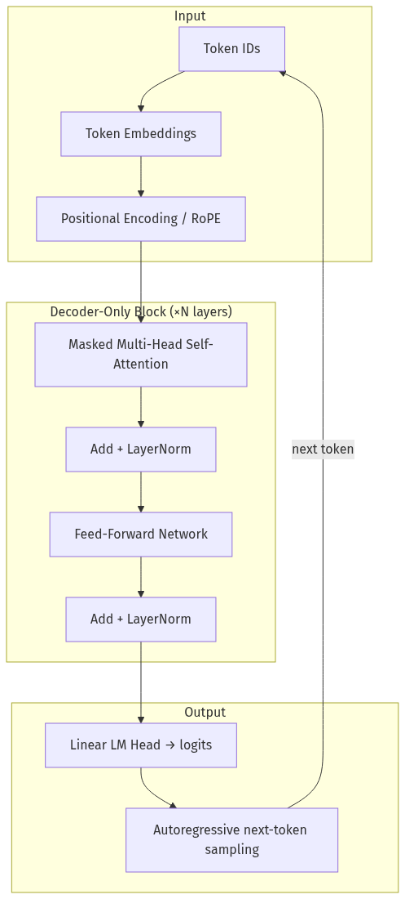
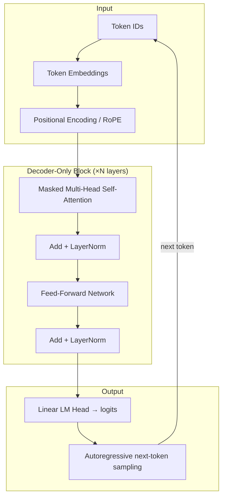
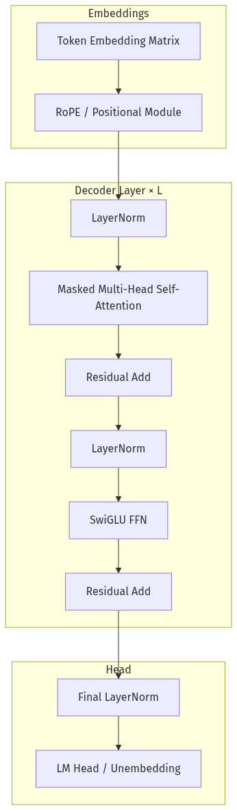
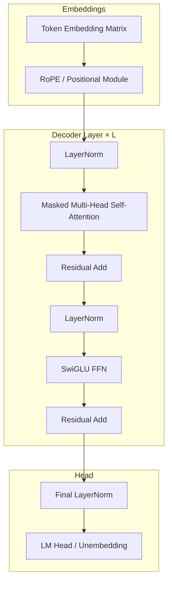
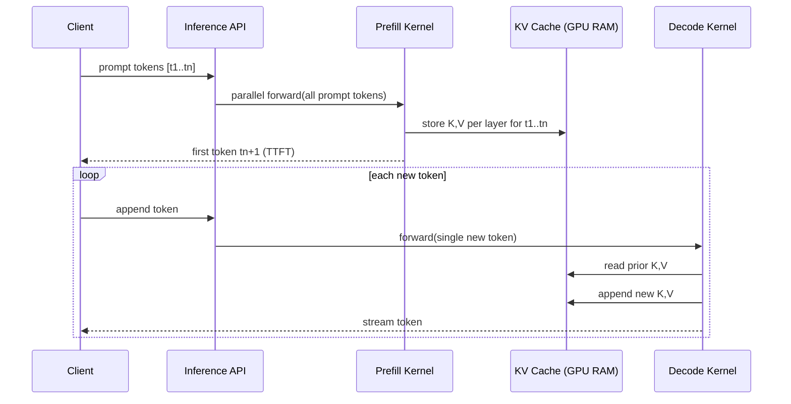

# 01-01 — Transformer Architecture for AI Engineers

| Meta | Value |
|------|-------|
| **Estimated Time** | 5–6 hours (read 2.5h · lab 2h · attention walkthrough 1h) |
| **Difficulty** | Intermediate (concepts) · Advanced (production tradeoffs) |
| **Prerequisites** | Basic Python; matrix multiplication intuition; [00-01](../00-Foundations/00-01-AI-Engineering-Mindset.md) mindset |
| **Module** | 01 — LLM Engineering |
| **Related** | [01-02](01-02-Tokenization-Context-Windows.md) · [01-03](01-03-Inference-Serving-vLLM.md) · [10-04](../10-Production-Infrastructure/10-04-Cost-Latency-Optimization.md) · [Architecture Index](../../Architecture Index.md) |

---

## Learning Objectives

By the end of this chapter you will be able to:

1. Explain **encoder-only**, **encoder–decoder**, and **decoder-only** transformers and name which production LLMs use each.
2. Walk through **self-attention** and **multi-head attention** with Q/K/V intuition—without deriving gradients.
3. Describe why **residual connections**, **LayerNorm**, and the **FFN** exist and what breaks if you remove them.
4. Compare **sinusoidal** vs **RoPE** positional encodings at a practitioner level.
5. Explain **autoregressive generation**, **KV cache**, and how they drive **TTFT**, **throughput**, and **cost**.
6. Use **scaling laws intuition** to justify model-size and context-window decisions in architecture reviews.

---

## Why This Topic Matters

You do not need to train transformers to ship LLM products. You **do** need to know what the model is doing well enough to:

- predict why latency spikes when context doubles,
- explain why a 70B model costs 10× more than a 7B for the same prompt,
- choose between encoder-only embeddings vs decoder-only chat models,
- debug “it forgot the beginning of the document” failures,
- and hold your own in Staff/Principal interviews when someone whiteboards attention.

The transformer is the **computational substrate** of modern GenAI. Treat it like a senior engineer treats the Linux kernel: you are not writing schedulers, but you must know where time and memory go.

If you skip this chapter and jump straight to prompting:

- you will treat **context window** as magic bytes instead of quadratic (pre-cache) attention cost,
- you will over-prompt when the bottleneck is **decode throughput**,
- you will pick models by leaderboard rank instead of **architecture fit** (embeddings vs generation),
- and you will fail system design questions on ChatGPT-like products.

---

## Business Impact

| Business outcome | How transformer literacy changes decisions |
|------------------|---------------------------------------------|
| **Lower COGS** | Right-size model; cap context; use KV-cache-aware serving ([10-04](../10-Production-Infrastructure/10-04-Cost-Latency-Optimization.md)) |
| **Better latency SLOs** | Separate prefill vs decode; stream tokens; batch smartly |
| **Fewer “model is broken” escalations** | Distinguish attention limits from RAG gaps from prompt issues |
| **Credible architecture reviews** | Defend GPT-4-class vs open-weight vs embedding model choices |
| **Hire signal** | Candidates who explain KV cache beat candidates who say “it’s just vectors” |

---

## Architecture Overview

Three transformer families dominate production. **Decoder-only** models (GPT, Llama, Claude) power chat, code, and agents. **Encoder-only** models (BERT, modern embedding models) power search and classification. **Encoder–decoder** models (T5, BART, early translation stacks) power seq2seq tasks—less common for frontier chat, still relevant for summarization and fine-tuned pipelines.





**Mental model for AI engineers:** A decoder-only transformer is a **massively parallel conditional next-token predictor**. Each layer refines a hidden representation by asking, “Which prior tokens should I attend to?” The FFN then **stores and transforms** what attention gathered. Generation is a loop: predict one token, append, repeat.

---

## Core Concepts

### 1) Encoder-Only vs Encoder–Decoder vs Decoder-Only

#### Definition

| Variant | Attention pattern | Typical pretraining | Production use today |
|---------|-------------------|---------------------|----------------------|
| **Encoder-only** | Bidirectional (each token sees all tokens) | Masked language modeling (MLM) | Embeddings, rerankers, classifiers |
| **Encoder–decoder** | Encoder bidirectional; decoder causal cross-attn to encoder | Span corruption / translation | Summarization, translation, some enterprise fine-tunes |
| **Decoder-only** | Causal (token *i* sees tokens ≤ *i* only) | Next-token prediction (GPT-style) | Chat, agents, code, most frontier APIs |

#### Intuition

- **Encoder-only** builds rich **representations** of fixed text. Great for “what does this paragraph mean?” Not for open-ended generation without extra machinery.
- **Encoder–decoder** separates **understanding** (encoder) from **generation** (decoder). Powerful for structured input→output, but two stacks = more complexity at serve time.
- **Decoder-only** unifies understanding and generation: the same causal stack that reads the prompt also writes the answer. Simplicity won the market for general assistants.

#### When to use each

| Need | Prefer |
|------|--------|
| Semantic search / clustering / reranking | Encoder-only embedding model |
| Chat, tool use, code completion | Decoder-only |
| Document → fixed schema summary with tight input/output | Encoder–decoder or decoder-only with good prompting |
| Real-time classification on short text | Encoder-only (cheaper, faster) |

#### When NOT to use decoder-only

- You only need a vector for retrieval → don’t pay for a 70B generator; use a 300M–7B embedding model.
- You need strict bidirectional context for a **single forward pass** label → encoder-only is natural.

#### Interview discussion

> “We use `text-embedding-3-large` for retrieval and GPT-4.1 for generation because encoder-only vs decoder-only is a cost and capability split—not one model for everything.”

---

### 2) Self-Attention — The Core Mechanism

#### Definition

Self-attention lets each token produce a new representation by taking a **weighted sum** of all other tokens’ representations. Weights come from **compatibility scores** between queries and keys.

For one head (simplified):

\[
\text{Attention}(Q, K, V) = \text{softmax}\left(\frac{QK^T}{\sqrt{d_k}}\right) V
\]

Where:

- **Q** (query): “What am I looking for?”
- **K** (key): “What do I contain?”
- **V** (value): “What information do I pass if selected?”

#### Intuition — The library catalog analogy

Imagine each token is a librarian holding a catalog card:

- **Query** = the question on your notepad (“Who is the subject?”)
- **Key** = the index line on each card (“subject: refund policy”)
- **Value** = the paragraph text on the card

Attention scores measure how well each key matches your query. High match → you copy more of that card’s value into your updated notes.

Self-attention means **every token asks every other token** the same kind of question—in parallel.

#### Why \(\sqrt{d_k}\) scaling?

Dot products grow with dimension. Without scaling, softmax saturates (one weight → 1, rest → 0), gradients vanish, training destabilizes. The scale keeps score magnitudes in a reasonable range.

#### Causal (masked) self-attention

Decoder-only models apply a **causal mask**: token *i* may only attend to positions ≤ *i*. Future tokens are masked to \(-\infty\) before softmax. This enforces autoregressive validity: you cannot cheat by peeking at the answer token during training.

#### When NOT to assume bidirectional attention

If someone says “the model read the whole document,” clarify **when**:

- During **prefill**, the prompt tokens attend within the prompt (causally left-to-right).
- During **decode**, new tokens attend to all prior tokens.
- It is **not** BERT-style bidirectional unless you are using an encoder-only model.

---

### 3) Multi-Head Attention

#### Definition

Instead of one attention pass, the model runs **h** parallel heads, each with smaller dimension \(d_k = d_{\text{model}} / h\). Outputs are concatenated and projected.

#### Intuition

One head might track **syntax** (verb agrees with subject). Another tracks **coreference** (“it” → “refund”). Another tracks **local bigrams**. Multi-head = **specialized parallel lookups** instead of one averaged blur.

#### Why it exists

A single attention map is a bottleneck. Multiple heads let the model attend to **different relationship types** at the same layer without committing to one averaging scheme.

#### When NOT to over-index on head count in production

More heads ≠ better for your API call. Head count is baked into the checkpoint. What matters to you: **hidden size**, **layer count**, **context length**, and **quantization**—not whether there are 32 or 64 heads.

---

### 4) QKV — What Engineers Should Picture

#### Definition

Given hidden vector \(x\) for each token, learned linear projections produce:

\[
Q = x W_Q,\quad K = x W_K,\quad V = x W_V
\]

\(W_Q, W_K, W_V\) are weight matrices learned during training.

#### Mental model

| Tensor | Shape intuition (batch of 1) | Role |
|--------|------------------------------|------|
| Hidden states | `[seq_len, d_model]` | Current token representations |
| Q | `[seq_len, d_k]` | Questions each token asks |
| K | `[seq_len, d_k]` | Labels each token advertises |
| V | `[seq_len, d_v]` | Content each token offers |
| Attention weights | `[seq_len, seq_len]` | Who listens to whom |

#### Why separate Q and K?

You could imagine one vector per token, but **matching** is asymmetric: “I search for X” (query) is not the same as “I am tagged X” (key). Separating them gives the model **flexible similarity**—like search query vs document title.

#### Production implication

During **decode**, you append one new token. Its query must attend to **all prior keys and values**. That is exactly why **KV cache** stores past K and V—recomputing them every step would waste compute.

---

### 5) Residual Connections + LayerNorm

#### Definition

A transformer sublayer typically looks like:

\[
x' = \text{LayerNorm}(x + \text{Sublayer}(x))
\]

Some implementations use **Pre-LN** (norm before sublayer), which is what most modern LLMs use—better training stability at depth.

#### Intuition

- **Residual (`x +`)**: “Keep a highway for the original signal.” Without it, deep stacks **forget** early features and become hard to train.
- **LayerNorm**: Rescale activations per token so layers receive **consistent magnitude**. Stabilizes training and inference.

#### Why it exists

Transformers can be **80+ layers deep**. Residuals + norm are the reason depth is possible without vanishing/exploding signal.

#### When NOT to hand-wave as “implementation detail”

If you fine-tune or merge models (see Module 09), numeric instability often shows up as **NaN losses** when learning rates ignore Pre-LN dynamics. At serve time, quantization interacts with norm scales—bad quant configs show up as garbled output.

---

### 6) Feed-Forward Network (FFN)

#### Definition

After attention, each token passes through the same MLP (applied per token, independently):

\[
\text{FFN}(x) = W_2 \cdot \text{activation}(W_1 x + b_1) + b_2
\]

Typically inner dimension is **4×** `d_model` (e.g., 4096 → 16384 → 4096).

#### Intuition

Attention **mixes information between tokens**. FFN **processes each token’s mixed representation**—often described as where the model stores **memorized patterns** and **feature transforms** (factual associations, syntactic rules).

#### SwiGLU variant (Llama, Mistral, many modern LLMs)

Replace vanilla ReLU/GELU FFN with **gated linear units** (SwiGLU). More parameters and compute, better quality per parameter at scale. As an engineer: SwiGLU means **wider FFN blocks** → decode is often **FFN-bound** on GPU.

#### When NOT to ignore FFN in perf work

Kernel fusion and quantization often target **FFN matmuls**. If profiling shows FFN dominates, smaller model or MoE routing (Module 12) may beat “just add KV cache.”

---

### 7) Positional Encodings — Sinusoidal vs RoPE

#### Definition

Attention is **permutation-equivariant** without positions: shuffling tokens shuffles outputs the same way. Models need **position information**.

| Scheme | How position enters | Used in |
|--------|---------------------|---------|
| **Sinusoidal (absolute)** | Add fixed sin/cos vectors to embeddings | Original Transformer, early GPT/BERT |
| **Learned absolute** | Learned embedding per position index | GPT-2, many BERT variants |
| **RoPE (Rotary Position Embedding)** | Rotate Q/K by position-dependent angles | Llama, Mistral, Qwen, most modern OSS LLMs |
| **ALiBi** | Add linear bias to attention scores by distance | Some MPT/Bloom variants (less dominant now) |

#### Sinusoidal — high-level intuition

Add a unique wave pattern per position dimension. Nearby positions have similar patterns; distant positions differ. The model learns to use these **absolute coordinates**.

**Limit:** Extrapolation beyond trained max length is weak—positions never seen at train time look alien.

#### RoPE — high-level intuition

Instead of adding position to embeddings, **rotate** query and key vectors in 2D subspaces by an angle proportional to position. Attention score naturally encodes **relative distance** via angle differences.

**Why practitioners care:** RoPE models often **extend context** via scaling tricks (NTK-aware scaling, YaRN, etc.)—still imperfect, but the default for modern stacks.

#### When to use which (practitioner view)

You rarely **choose**—the checkpoint chooses for you. You **must know**:

- Extending context on RoPE models needs **compatible scaling** or fine-tune; don’t assume 128K “just works.”
- Embedding models (encoder-only) may use different schemes than your chat model—**don’t mix positional assumptions** across pipelines.

#### When NOT to trust “we support 1M context” marketing

Read the model card. Long-context often means **interpolated RoPE** with quality cliffs. Always eval **your** documents at target length ([01-02](01-02-Tokenization-Context-Windows.md)).

---

### 8) Autoregressive Generation

#### Definition

Decoder-only models generate by repeating:

1. Forward pass → logits for next token.
2. Sample or argmax → pick token \(t_{n+1}\).
3. Append \(t_{n+1}\) to input; goto 1 until EOS or max tokens.

#### Intuition

The model is a **compressive autocomplete engine** trained on internet-scale text. “Intelligence” emerges because next-token prediction at scale requires **world modeling**, **planning**, and **instruction following** to minimize loss.

#### Prefill vs decode (critical for production)

| Phase | What happens | Parallelism | Dominant cost driver |
|-------|--------------|-------------|----------------------|
| **Prefill** | Process entire prompt in one (or few) forwards | High — all prompt tokens at once | Attention over prompt length |
| **Decode** | Generate one token at a time | Low — sequential steps | Number of output tokens × model width |

**TTFT (time to first token)** ≈ prefill latency.  
**Inter-token latency** ≈ decode step latency.

#### When NOT to use autoregressive generation

- Fixed label from short text → classifier or embedding + logistic regression.
- Structured extraction with schema → often faster with smaller model + constrained decoding ([02-02](../02-Prompt-Engineering/02-02-Structured-Outputs-Tool-Calling.md)).
- Bulk offline transforms with known output length → batch encoder–decoder may pipeline better.

---

### 9) KV Cache — Latency & Cost Implications

#### Definition

During decode, keys and values for **past tokens don’t change**. KV cache **stores** them in GPU memory so each new step only computes Q/K/V for the **latest token**, then attends to cached K/V.

Without cache: step *t* recomputes K/V for all *t* tokens → **O(t²)** per generated token.  
With cache: **O(t)** per step (still grows with context, but avoids full recompute).

#### Memory intuition

Rough per-layer KV memory (bytes, both K and V):

\[
\text{KV memory} \approx 2 \times \text{layers} \times \text{seq\_len} \times \text{num\_kv\_heads} \times \text{head\_dim} \times \text{dtype\_bytes}
\]

**Grouped-query attention (GQA)** and **multi-query attention (MQA)** reduce `num_kv_heads`, shrinking cache—why Llama 3 and others adopted GQA for serve economics.

#### Production implications

| Effect | Without KV cache awareness | With KV cache awareness |
|--------|---------------------------|-------------------------|
| Long chats | Latency accelerates as context grows | Cap history; summarize; sliding window |
| Cost | You pay for prompt tokens once in prefill—but **long context still hurts decode** | Trim tool outputs; compress memory |
| Batching | Variable-length contexts fragment batches | Continuous batching (vLLM) ([01-03](01-03-Inference-Serving-vLLM.md)) |
| Multi-tenant | GPU RAM exhaustion | Max context quotas per tenant |

#### When NOT to rely on “infinite cache”

KV cache is **GPU RAM**. At 128K context × many concurrent sessions, you OOM before you finish the moral argument about context windows.

See [10-04](../10-Production-Infrastructure/10-04-Cost-Latency-Optimization.md) for cost/latency playbooks.

---

### 10) Scaling Laws — Practitioner Intuition

#### Definition

Scaling laws (Kaplan, Chinchilla, Hoffmann et al.) observe that loss improves as **power laws** of model size, data, and compute—within regimes. **Chinchilla-optimal** roughly says: for a compute budget, **smaller model + more tokens** beats giant model + few tokens.

#### What practitioners should take away (not prove)

| Claim | Engineering translation |
|-------|-------------------------|
| Bigger models → better quality | …until latency/cost kills the product |
| Diminishing returns | 70B → 405B may not fix a bad RAG pipeline |
| Data matters | Fine-tune on 500 examples won’t mimic GPT-4 pretrain |
| Emergent abilities are debated | Plan for smooth metrics, not cliff hype |
| Optimal sizing | Match model to **task difficulty** and **SLO**, not ego |

#### Rule-of-thumb decision table

| Signal | Lean smaller | Lean larger |
|--------|--------------|-------------|
| Task | Classification, extraction | Open-ended reasoning, code |
| Context | Short prompts | Long doc synthesis |
| Traffic | High QPS chat | Offline batch |
| Budget | Fixed COGS cap | Quality-at-all-costs research assistant |
| Eval gap | 7B passes golden set | 7B fails reasoning consistently |

#### When NOT to invoke scaling laws

- “We need GPT-5” without eval evidence.
- Ignoring **system bottlenecks** (retrieval, tools, safety) because “bigger model fixes it.”

---

## Implementation

### Tiny attention from scratch (NumPy)

This is **educational**, not production code—but mirrors what frameworks do under the hood. Run locally:

```bash
python attention_demo.py
```

```python
"""Tiny scaled dot-product attention — educational, production-commented.

Demonstrates:
  - Q/K/V projections
  - causal mask (decoder-only)
  - multi-head reshape
  - softmax attention weights

NOT for production: no fused kernels, no KV cache, no GQA.
For serving patterns see 01-03 and HuggingFace Transformers.
"""

from __future__ import annotations

import math
from typing import Tuple

import numpy as np


def softmax(x: np.ndarray, axis: int = -1) -> np.ndarray:
    """Numerically stable softmax."""
    x_max = np.max(x, axis=axis, keepdims=True)
    exp_x = np.exp(x - x_max)
    return exp_x / np.sum(exp_x, axis=axis, keepdims=True)


def layer_norm(x: np.ndarray, eps: float = 1e-5) -> np.ndarray:
    """Simplified LayerNorm over last dimension."""
    mean = x.mean(axis=-1, keepdims=True)
    var = x.var(axis=-1, keepdims=True)
    return (x - mean) / np.sqrt(var + eps)


def linear(x: np.ndarray, weight: np.ndarray, bias: np.ndarray | None = None) -> np.ndarray:
    """x: [..., in_features]  weight: [in_features, out_features]"""
    out = x @ weight
    return out + bias if bias is not None else out


def causal_mask(seq_len: int) -> np.ndarray:
    """Upper triangle = -inf so softmax assigns 0 mass to future tokens."""
    mask = np.triu(np.full((seq_len, seq_len), -np.inf, dtype=np.float32), k=1)
    return mask


def split_heads(x: np.ndarray, num_heads: int) -> np.ndarray:
    """[batch, seq, d_model] -> [batch, heads, seq, head_dim]"""
    batch, seq_len, d_model = x.shape
    head_dim = d_model // num_heads
    return x.reshape(batch, seq_len, num_heads, head_dim).transpose(0, 2, 1, 3)


def merge_heads(x: np.ndarray) -> np.ndarray:
    """[batch, heads, seq, head_dim] -> [batch, seq, d_model]"""
    batch, num_heads, seq_len, head_dim = x.shape
    return x.transpose(0, 2, 1, 3).reshape(batch, seq_len, num_heads * head_dim)


def scaled_dot_product_attention(
    q: np.ndarray,
    k: np.ndarray,
    v: np.ndarray,
    mask: np.ndarray | None = None,
) -> Tuple[np.ndarray, np.ndarray]:
    """Core attention op.

    q,k,v: [batch, heads, seq, head_dim]
    mask:  [seq, seq] broadcastable
    returns: output, attn_weights
    """
    head_dim = q.shape[-1]
    scores = (q @ k.transpose(0, 1, 3, 2)) / math.sqrt(head_dim)  # [b,h,s,s]
    if mask is not None:
        scores = scores + mask  # future positions get -inf
    weights = softmax(scores, axis=-1)
    output = weights @ v  # [b,h,s,head_dim]
    return output, weights


def multi_head_self_attention(
    x: np.ndarray,
    w_q: np.ndarray,
    w_k: np.ndarray,
    w_v: np.ndarray,
    w_o: np.ndarray,
    num_heads: int,
    causal: bool = True,
) -> Tuple[np.ndarray, np.ndarray]:
    """One MHA block (no residual/norm yet)."""
    batch, seq_len, _ = x.shape
    q = split_heads(linear(x, w_q), num_heads)
    k = split_heads(linear(x, w_k), num_heads)
    v = split_heads(linear(x, w_v), num_heads)
    mask = causal_mask(seq_len) if causal else None
    attn_out, weights = scaled_dot_product_attention(q, k, v, mask)
    merged = merge_heads(attn_out)
    projected = linear(merged, w_o)
    return projected, weights


def ffn_block(x: np.ndarray, w1: np.ndarray, w2: np.ndarray) -> np.ndarray:
    """Two-layer MLP with GELU-ish tanh approximation omitted — use ReLU for clarity."""
    hidden = np.maximum(0, linear(x, w1))  # ReLU
    return linear(hidden, w2)


def transformer_decoder_layer(
    x: np.ndarray,
    attn_params: dict[str, np.ndarray],
    ffn_params: dict[str, np.ndarray],
    num_heads: int,
) -> np.ndarray:
    """Pre-LN style: Norm -> SubLayer -> Residual."""
    # Self-attention sublayer
    h = layer_norm(x)
    attn_out, _ = multi_head_self_attention(
        h,
        attn_params["w_q"],
        attn_params["w_k"],
        attn_params["w_v"],
        attn_params["w_o"],
        num_heads=num_heads,
        causal=True,
    )
    x = x + attn_out  # residual

    # FFN sublayer
    h = layer_norm(x)
    ff_out = ffn_block(h, ffn_params["w1"], ffn_params["w2"])
    x = x + ff_out
    return x


def init_params(d_model: int, d_ff: int, num_heads: int, seed: int = 0) -> tuple[dict, dict]:
    rng = np.random.default_rng(seed)
    def w(in_f: int, out_f: int) -> np.ndarray:
        # Xavier-ish scale for demo stability
        scale = math.sqrt(2.0 / (in_f + out_f))
        return (rng.standard_normal((in_f, out_f)) * scale).astype(np.float32)

    attn = {
        "w_q": w(d_model, d_model),
        "w_k": w(d_model, d_model),
        "w_v": w(d_model, d_model),
        "w_o": w(d_model, d_model),
    }
    ffn = {"w1": w(d_model, d_ff), "w2": w(d_ff, d_model)}
    return attn, ffn


def demo() -> None:
    # Toy "tokens": 4 tokens, d_model=8, 2 heads, FFN inner=32
    batch, seq_len, d_model, num_heads, d_ff = 1, 4, 8, 2, 32
    rng = np.random.default_rng(42)

    # Token embeddings (normally from nn.Embedding)
    x = rng.standard_normal((batch, seq_len, d_model)).astype(np.float32)

    attn_params, ffn_params = init_params(d_model, d_ff, num_heads)

    # Forward one decoder layer
    x_out = transformer_decoder_layer(x, attn_params, ffn_params, num_heads)

    # Autoregressive logits for next token (toy LM head)
    w_lm = init_params(d_model, d_ff, num_heads)[0]["w_q"]  # reuse random weights for demo
    logits = linear(x_out[:, -1, :], w_lm)  # last token predicts next
    probs = softmax(logits, axis=-1)

    print("Input hidden shape:", x.shape)
    print("Output hidden shape:", x_out.shape)
    print("Next-token prob mass (sum):", probs.sum())
    print("Argmax next-token dim:", int(np.argmax(probs)))

    # Show causal attention weights from a fresh forward
    _, weights = multi_head_self_attention(
        layer_norm(x),
        attn_params["w_q"],
        attn_params["w_k"],
        attn_params["w_v"],
        attn_params["w_o"],
        num_heads=num_heads,
        causal=True,
    )
    # weights: [batch, heads, seq, seq] — row i sums to 1 over columns <= i
    print("Head-0 attention matrix (rows=query token, cols=key token):")
    np.set_printoptions(precision=3, suppress=True)
    print(weights[0, 0])


if __name__ == "__main__":
    demo()
```

#### What to notice when you run it

1. Each attention **row** is a probability distribution over prior tokens (and self).
2. Future columns are **exactly zero** due to causal mask.
3. Residual paths preserve input shape—critical for stacking dozens of layers.
4. Production stacks swap NumPy for fused CUDA kernels and add **KV cache** across decode steps.

---

## Production Considerations

| Concern | Practice |
|---------|----------|
| Context growth | Summarize or truncate history before KV RAM blows up |
| Model choice | Embedding vs chat vs code-specialized **architecture + weights** |
| Streaming | Improves TTFT perception; doesn’t reduce total decode FLOPs |
| Version pins | Architecture details (context, RoPE scaling) change across releases |
| Quantization | INT4/INT8 cuts bandwidth; watch perplexity on **your** evals |

---

## Security

| Threat | Transformer-relevant note |
|--------|---------------------------|
| Long-context injection | More tokens = more surface in **one forward**; combine with policy layers ([11-02](../11-Security-Safety/11-02-Prompt-Injection-Defense.md)) |
| Model extraction | Larger models leak more capability via logits; rate-limit and watermark |
| Side channels | Shared GPU batching can leak timing; isolate tenants for sensitive workloads |

Architecture alone doesn’t secure systems—see [00-01](../00-Foundations/00-01-AI-Engineering-Mindset.md) trust zones.

---

## Performance

| Knob | Effect |
|------|--------|
| Shorter prompts | Less prefill; smaller KV cache |
| Fewer output tokens | Linear decode savings |
| Smaller `d_model` / fewer layers | Direct throughput win |
| GQA/MQA checkpoints | Less KV memory → more batch concurrency |
| Speculative decoding | Draft model proposes tokens; target verifies ([01-03](01-03-Inference-Serving-vLLM.md)) |

**Profile prefill and decode separately.** Optimizing the wrong phase wastes engineering weeks.

---

## Cost

| Driver | Billing intuition |
|--------|-------------------|
| Input tokens | Prefill FLOPs ≈ O(seq × layers × d²) |
| Output tokens | Decode FLOPs ≈ O(out × layers × d²) |
| KV RAM | Limits concurrent sessions on fixed GPU fleet |
| Model size | Parameter count → memory bandwidth bound |

Token pricing on APIs roughly tracks this physics—see [01-02](01-02-Tokenization-Context-Windows.md) for counting nuances.

---

## Scalability

Horizontal scale for transformers = **more inference replicas** + **request routing**, not “split one forward pass across 50 CPUs” (except specialized inference frameworks). Use:

- continuous batching,
- queue-based autoscaling on GPU pools,
- model routing to smaller checkpoints for easy queries ([01-04](01-04-Model-Routing-LiteLLM.md)).

---

## Failure Modes

| Failure | Symptom | Mitigation |
|---------|---------|------------|
| Context overflow | Truncated prompt, “forgot” instructions | Count tokens; prioritize system prompt |
| RoPE extrap failure | Gibberish after 2× trained context | Use model’s documented max; eval long docs |
| KV OOM | 500s under load | Cap history; offload cache; fewer concurrent slots |
| Wrong architecture for task | Weak retrieval embeddings | Swap to encoder embedding model |
| Quantization collapse | Loops, repetition | Raise bitwidth or switch checkpoint |

---

## Observability

Log transformer-relevant fields alongside app fields:

```text
trace_id, model_id, arch_family (decoder/encoder),
prompt_tokens, completion_tokens, prefill_ms, decode_ms_per_token,
kv_cache_bytes, gpu_model, quant_format, context_truncated
```

If `prefill_ms` dominates, shrink prompts. If `decode_ms_per_token` dominates, shrink output or model.

---

## Debugging

| Question | Where to look |
|----------|---------------|
| Slow first token? | Prefill length, model size, cold GPU |
| Slow overall chat? | Output token count, decode profiling |
| Quality drops at long docs? | Context length vs RoPE config |
| Identical prompts, different results? | Sampling params; not “attention randomness” alone |
| RAM spikes per session? | KV cache size × concurrent turns |

---

## Common Mistakes

1. Treating **context window** as “how much I can paste” instead of “how much I can afford per request.”
2. Using a **chat model** for embeddings because “it’s smarter.”
3. Ignoring **decode cost** when agents emit 4K-token tool JSON.
4. Assuming **bidirectional attention** in GPT-style models.
5. Picking the largest model before measuring **task-level eval deltas**.

---

## Tradeoffs

| Choice | Upside | Downside |
|--------|--------|----------|
| Decoder-only chat model | One stack for read+write | Expensive vs encoder for retrieval |
| Encoder-only embeddings | Fast, cheap vectors | No native open-ended generation |
| Long context (128K+) | Whole doc in prompt | KV RAM, latency, quality cliffs |
| Larger model | Higher quality ceiling | Cost, latency, ops burden |
| Aggressive quantization | Higher throughput | Quality/regression risk |

---

## Architecture Diagram

### Full decoder-only stack (conceptual)





---

## Mermaid Diagram — Autoregressive Decode with KV Cache



---

## Production Examples

| Pattern | Architecture move |
|---------|-------------------|
| RAG assistant | Encoder embeddings + decoder generator (two models) |
| Copilot-style complete | Decoder-only; short prompt, long decode → watch output tokens |
| Semantic dedup | Encoder-only cosine similarity; no generation |
| Translation microservice | Fine-tuned encoder–decoder or decoder-only with fixed prompt |

---

## Real Companies Using It (Public Patterns)

| Org | Public pattern | Lesson |
|-----|----------------|--------|
| **OpenAI** | Decoder-only GPT family; API token billing | Prefill vs decode shows up in latency guides |
| **Meta** | Llama — RoPE, GQA, open weights | KV cache economics drove GQA adoption |
| **Google** | Gemini / PaLM — mixture-of-experts variants at scale | Not all frontier models are dense FFN |
| **Mistral** | Sliding-window + GQA in some checkpoints | Architecture tricks for serve cost |
| **Hugging Face** | Transformers library abstracts arch families | Know what's under `AutoModelForCausalLM` |

Use names as **pattern references**, not claims about internal unreleased stacks.

---

## Hands-on Labs

### Lab A — Attention matrix inspection (30 min)

Run `attention_demo.py`. For a 4-token sequence, verify head-0 weights are lower-triangular (causal). Change `seq_len` to 8; observe row sums ≈ 1.

### Lab B — Prefill vs decode timing (45 min)

Using any local model (Ollama) or API, measure:

- time to first token vs
- total time / output tokens.

Compare a 500-token vs 4000-token prompt with **fixed 100-token completion**.

### Lab C — KV cache A/B (45 min)

If using vLLM or llama.cpp, run the same chat with and without context caching flags (where supported). Note RAM and tokens/sec.

---

## Coding Assignments

1. Extend the NumPy demo with **explicit KV cache** dict per layer for incremental decode.
2. Plot attention weights as a heatmap for a real sentence tokenized with `tiktoken`.
3. Write a one-page **model selection memo**: encoder vs decoder for a search product.

---

## Mini Project

**Title:** Attention From Scratch Notebook  
**Done when:** Implements MHA + causal mask + one decoder layer; README explains Q/K/V in plain English.

---

## Production Project

**Title:** Prefill vs Decode Profiler  
**Done when:** FastAPI endpoint logs `prefill_ms`, `decode_ms`, token counts; dashboard shows p50/p95 by prompt length bucket.

---

## Stretch Project

Read a HuggingFace `config.json` for Llama 3 and map each field (`hidden_size`, `num_attention_heads`, `num_key_value_heads`, `max_position_embeddings`, `rope_theta`) to concepts in this chapter. Write a team doc: “What changes if we swap 8B → 70B?”

---

## Interview Questions

### Senior Engineer

1. Explain self-attention in plain English without equations.
2. What is the difference between encoder-only and decoder-only transformers?
3. Why does generation slow down as the conversation gets longer even with KV cache?
4. What are Q, K, and V intuitively?
5. What is causal masking and why is it required for GPT-style models?

### Staff Engineer

1. Your RAG system is slow at 32K context. Is the bottleneck prefill, decode, or retrieval? How do you prove it?
2. Explain GQA/MQA and why Meta adopted it.
3. When would you choose an embedding model over a chat model for retrieval?
4. How does RoPE differ from absolute positional embeddings at a high level?
5. Design token budgets for a customer-support bot with 20-turn history.

### Principal Engineer

1. Propose a **model routing strategy** using 3 model sizes. What signals route up/down?
2. A vendor claims 1M context on a RoPE model. What evals and infra questions do you ask?
3. Explain scaling laws well enough to justify **not** fine-tuning a 70B model.
4. How would you architect **shared GPU inference** for 50 teams without KV cache OOM storms?
5. Compare dense vs MoE transformers for **cost at fixed quality**.

### Engineering Manager

1. Your team wants “GPT-4 for everything.” How do you facilitate a data-driven model matrix decision?
2. What metrics belong on an inference platform dashboard for executives vs for engineers?
3. How do you explain to finance why output tokens cost the same as input tokens on APIs but hurt latency differently?
4. When is it worth sponsoring a custom fine-tune vs prompt+RAG on a smaller model?
5. How do you hire for “transformer literacy” without requiring a PhD?

### Whiteboard

Draw a decoder layer: LayerNorm → MHA → residual → LayerNorm → FFN → residual. Label where KV cache attaches during decode.

### Follow-ups

- What if attention heads are pruned at inference?
- What if users paste adversarially long JSON into context?
- How does speculative decoding change the sequence diagram?
- Why might temperature not affect prefill?

---

## Revision Notes

- **Decoder-only** = causal self-attention + next-token loop. Dominates chat/agents.
- **Encoder-only** = bidirectional representations. Dominates embeddings/rerankers.
- **Q/K/V** = query/key/value projections; attention = weighted sum of values.
- **Residual + LayerNorm** enable deep stacks; **FFN** transforms per-token mixed state.
- **RoPE** is the modern default positional scheme; long context needs care.
- **Prefill** processes prompt; **decode** generates tokens—profile separately.
- **KV cache** avoids recomputing past K/V; still grows with context → RAM + latency.
- **Scaling laws**: bigger helps until system constraints; measure on **your** task.

---

## Summary

Transformers are not black boxes—they are **repeatable blocks** of attention (mix tokens) and FFN (transform tokens), wrapped in residuals and normalization, fed by positional schemes, and driven at inference by an **autoregressive loop** whose economics are shaped by **KV cache** and **token physics**. AI engineers who understand this make better model choices, set realistic SLOs, and debug faster than teams who treat the API as pure magic.

Next: [01-02 Tokenization, Context Windows & Attention Economics](01-02-Tokenization-Context-Windows.md) — where tokens meet money.

---

## Further Reading

| Title | URL | Difficulty | Reading Time | Why Read | Important Sections |
|-------|-----|------------|--------------|----------|--------------------|
| Attention Is All You Need | https://arxiv.org/abs/1706.03762 | Advanced | 60–90 min | Original architecture; shared vocabulary | §3 Model Architecture; §3.2 Attention |
| Hugging Face Transformers Docs | https://huggingface.co/docs/transformers/en/index | Intro–Intermediate | 45 min | Production model APIs & config objects | Quickstart; Model docs; Generation |
| HF NLP Course Ch.1 | https://huggingface.co/learn/nlp-course/chapter1/1 | Intro | 30 min | Gentle transformer intuition for engineers | Transformer models section |
| OpenAI Production Best Practices | https://developers.openai.com/api/docs/guides/production-best-practices | Intermediate | 40 min | Latency/cost tied to token generation physics | Improving latencies; Managing costs |
| RoFormer (RoPE paper) | https://arxiv.org/abs/2104.09864 | Advanced | 45 min | Deep dive on rotary embeddings | RoPE formulation (optional) |
| Training Compute-Optimal LLMs (Chinchilla) | https://arxiv.org/abs/2203.15556 | Advanced | 60 min | Scaling laws for sizing decisions | Abstract; compute-optimal frontier |

---

## Resume Bullet (after lab)

- Implemented **multi-head causal self-attention from scratch** in NumPy, documented Q/K/V and KV-cache implications, and built a **prefill/decode latency profiler** guiding model-size and context-window decisions for production LLM features.
