# 01-02 — Tokenization, Context Windows & Attention Economics

| Meta | Value |
|------|-------|
| **Estimated Time** | 5–6 hours (read 2.5h · lab 2h · cost model exercise 1h) |
| **Difficulty** | Intermediate (tokenization) · Advanced (context economics, packing) |
| **Prerequisites** | [01-01 Transformer Architecture](01-01-Transformer-Architecture.md) (attention basics); Python + FastAPI comfort |
| **Module** | 01 — LLM Engineering |
| **Related** | [01-01](01-01-Transformer-Architecture.md) · [01-03 Inference Serving](01-03-Inference-Serving-vLLM.md) · [04-01 RAG Architecture](../04-RAG/04-01-RAG-Architecture.md) · [10-04 Cost & Latency](../10-Production-Infrastructure/10-04-Cost-Latency-Optimization.md) · [Architecture Index](../../Architecture%20Index.md) · [Study Plan](../../Study%20Plan.md) |

---

## Learning Objectives

By the end of this chapter you will be able to:

1. Explain **BPE** and **WordPiece** tokenization with engineer-level intuition—not just vocabulary size.
2. Distinguish **tokens vs words vs characters** and predict which inputs inflate token counts.
3. Model **context window economics**: input vs output tokens, attention cost, and provider billing.
4. Implement **packing strategies** and **truncation policies** that preserve task-critical information.
5. Count tokens with **tiktoken** (or a documented fallback) and build a **FastAPI cost estimator**.
6. Decide **when to summarize vs retrieve** for long documents and multi-turn agents.
7. Speak at Senior→EM interview altitude about context rot, KV cache, and budget governance.

---

## Why This Topic Matters

Every LLM API call is priced and bounded in **tokens**, not words. A team that treats prompts as “just text” will:

- blow budgets on code, JSON, and non-English content (token-dense),
- silently truncate the wrong end of a conversation,
- confuse a 1M-token **window** with 1M tokens of **reliable recall**,
- and ship agents that degrade after ten tool turns.

Tokenization is the **unit of account** for cost, latency, memory, and attention. Context windows are the **hard RAM limit** of the probabilistic CPU introduced in [01-01](01-01-Transformer-Architecture.md). Getting this wrong is not a micro-optimization—it is a product and margin decision.

> **Staff move:** Always separate *capacity* (context window size) from *quality* (effective recall at that length). Providers sell the first; users experience the second.

---

## Business Impact

| Business outcome | How token/context literacy changes decisions |
|------------------|---------------------------------------------|
| **Predictable COGS** | Pre-flight token counts; per-feature budgets; route long docs to RAG not paste |
| **Latency SLOs** | Shorter prompts → faster prefill; fewer tokens → faster decode |
| **Quality** | Right truncation preserves instructions; wrong truncation drops system prompt |
| **Compliance** | Audit what entered context; prove PII was not over-retained |
| **Capacity planning** | KV cache scales with context × concurrency—see [01-03](01-03-Inference-Serving-vLLM.md) |

---

## Architecture Overview

Production systems treat the context window as a **scarce resource** managed by a budget layer:

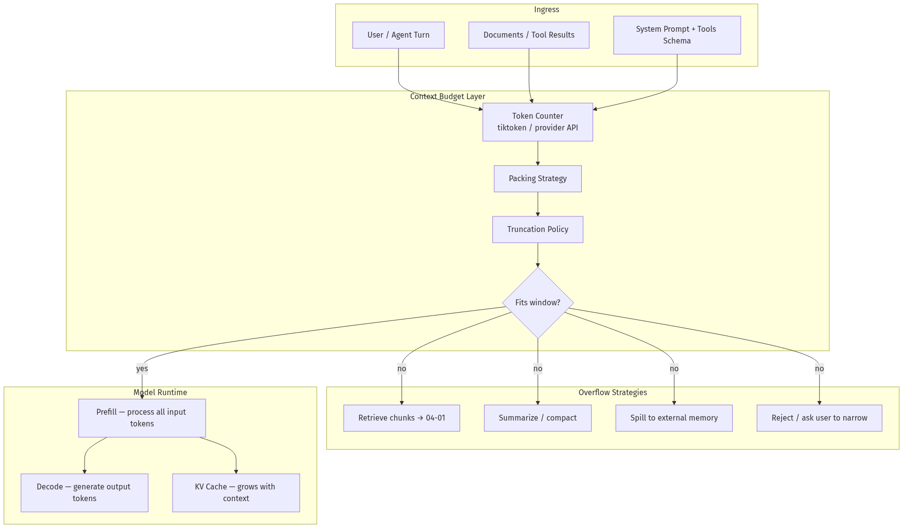

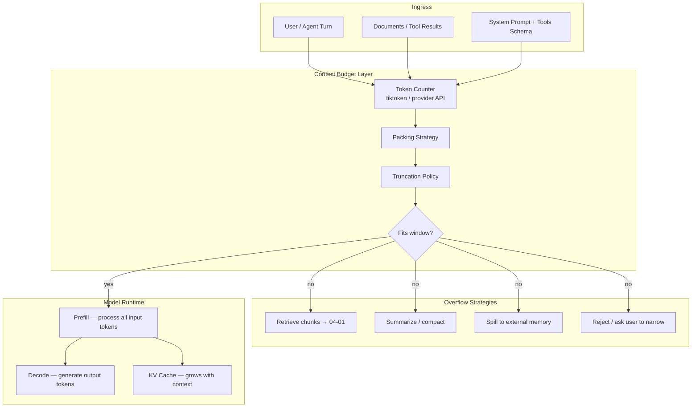

**Mental model:** Tokens are **bytes of working memory**. The context window is **RAM**. RAG and summarization are **paging to disk**. Cost controls live in [10-04](10-04-Cost-Latency-Optimization.md).

---

## Core Concepts

### 1) Subword Tokenization — Why Not Words?

#### Definition

LLMs do not read Unicode strings directly. A **tokenizer** maps text → integer token IDs from a fixed vocabulary (typically 32k–256k entries). Most modern LLMs use **subword** schemes: frequent words stay whole; rare words split into pieces.

Two dominant families:

| Algorithm | Used by | Core idea |
|-----------|---------|-----------|
| **BPE** (Byte Pair Encoding) | GPT / OpenAI (`cl100k_base`, `o200k_base`), Llama, many open models | Iteratively merge most frequent byte/char pairs until vocabulary size reached |
| **WordPiece** | BERT, some T5 variants | Greedy longest-match from vocabulary; merge score based on likelihood |

Both produce **reversible** encodings: token IDs → detokenize back to text (modulo whitespace quirks).

#### Intuition — BPE in 60 seconds

Start with bytes or characters. Count pairs:

```text
"low" → l, o, w
"lower" → l, o, w, e, r
Most frequent pair: ("l","o") → merge to "lo"
Next: ("lo","w") → "low"
...
```

After training, `"tokenization"` might become `["token", "ization"]` and `"Tokenization"` might become `["Token", "ization"]`—**case and punctuation affect splits**.

#### Intuition — WordPiece

Similar outward behavior, different training objective (language-model likelihood of merges). For engineering purposes: **both fragment rare strings; both are model-specific**.

#### Why it exists

| Requirement | Word-level vocab | Subword vocab |
|-------------|------------------|---------------|
| Open vocabulary (URLs, typos, code) | OOV holes | Handles via pieces |
| Fixed embedding table size | Huge for morphologically rich languages | Bounded (~50k–200k) |
| Compression efficiency | Poor on code/JSON | Better average bits/token |

#### When NOT to assume “1 word ≈ 1 token”

- Source code (`def`, `{`, `}`, indentation)
- JSON / XML / HTML
- Base64, hashes, UUIDs
- CJK languages (often **more** tokens per perceived “word”)
- Emoji and rare Unicode
- Repeated whitespace in prompts

**Rule of thumb (English prose only):** ~1 token ≈ 0.75 words ≈ 4 characters. **Do not use this in billing code.**

#### Interview discussion

> “We tokenize with the **same encoding as the target model**. Counting with `len(text.split())` is wrong for cost, truncation, and compliance.”

---

### 2) Tokens vs Words vs Characters

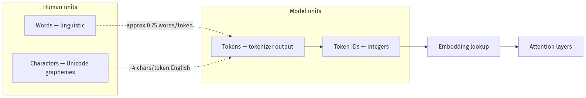

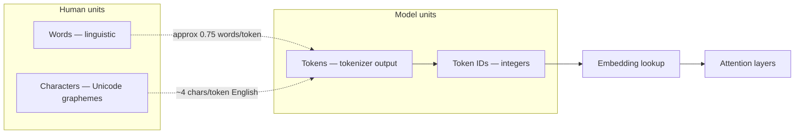

| Unit | What it measures | Production use |
|------|------------------|----------------|
| **Character** | Storage, transport | HTTP payload size—not billing |
| **Word** | Readability, UX copy limits | User-facing “summary in 100 words” |
| **Token** | Model input, API billing, context limits | Budgets, truncation, cost estimation |

#### Worked example (conceptual)

| String | Word count | Token behavior |
|--------|------------|----------------|
| `"Hello world"` | 2 | Often 2 tokens |
| `"ChatGPT"` | 1 | Often 1 token (frequent in training) |
| `"ChatGPT-4o-mini"` | 1 | Often 4–6 tokens |
| `{"user_id": "a1b2c3d4"}` | ~2 | Often 15–25 tokens |
| `"안녕하세요"` | 1 | Often 3–8 tokens depending on model |

Use **tiktoken** or provider counters for real counts—see Implementation section.

---

### 3) Context Window Economics

#### Definition

The **context window** is the maximum number of tokens the model can attend to in one forward pass: **input + output** (and on some providers, thinking/tool overhead). It is **not** the training corpus size—it is **working memory** for a single request or session.

Provider docs:

- OpenAI: [Text generation guide](https://developers.openai.com/api/docs/guides/text-generation)
- Anthropic: [Context windows](https://platform.claude.com/docs/en/docs/build-with-claude/context-windows)
- Google Gemini: [Long context](https://ai.google.dev/gemini-api/docs/long-context)

#### What counts toward the window

| Component | Typically counts? | Notes |
|-----------|-------------------|-------|
| System prompt | Yes | Often cached—still occupies window |
| Message history | Yes | Full multi-turn unless compacted |
| Tool definitions | Yes | Large schemas are silent budget killers |
| Tool results | Yes | JSON blobs add up in agents |
| Images / PDFs | Yes | Converted to token equivalents |
| Model output | Yes | Includes `max_tokens` reservation on some APIs |
| Extended thinking | Yes | Billed as output; may persist in context |

Anthropic documents **context rot**: accuracy and recall degrade as token count grows even within the window. A 200k window does not mean 200k tokens of equally reliable reasoning.

#### Attention economics (link to 01-01)

Self-attention cost scales **O(n²)** with sequence length *n* during prefill (all-pairs attention). That drives:

- **Higher latency** for long prompts (prefill-bound)
- **Larger KV cache** during decode (linear in context length)
- **Higher GPU memory** per concurrent request

This is why [01-03 Inference Serving](01-03-Inference-Serving-vLLM.md) discusses continuous batching, paged attention, and quantization—the serving stack exists to amortize token economics.

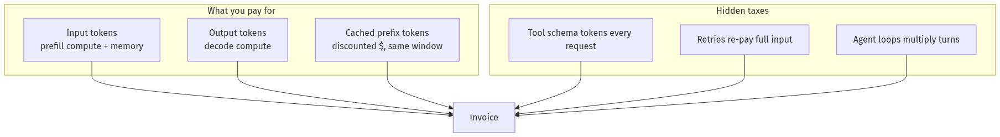

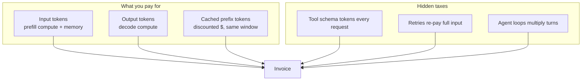

---

### 4) Cost Formulas

#### Standard per-request cost

\[
\text{cost\_usd} = \frac{t_{\text{in}}}{1000} \cdot p_{\text{in}} + \frac{t_{\text{out}}}{1000} \cdot p_{\text{out}} + \frac{t_{\text{cached}}}{1000} \cdot p_{\text{cached}}
\]

Where:

- \(t_{\text{in}}\) = uncached input tokens
- \(t_{\text{out}}\) = output tokens generated
- \(t_{\text{cached}}\) = cache-read input tokens (provider-specific)
- \(p_{\text{in}}, p_{\text{out}}, p_{\text{cached}}\) = price per 1K tokens for the chosen model tier

#### Multi-turn agent cost (first-order estimate)

\[
\text{cost}_{\text{session}} \approx \sum_{i=1}^{T} \left( \frac{T_{\text{in}}^{(i)}}{1000} p_{\text{in}} + \frac{T_{\text{out}}^{(i)}}{1000} p_{\text{out}} \right)
\]

Turn *i* re-sends **all prior context** unless you compact. Agent loops are **super-linear** in turns because input grows each step.

#### Cost per successful task

\[
\text{\$/successful task} = \frac{\sum \text{session costs}}{\text{tasks completed without human repair}}
\]

This is the metric EM and Principal interviews probe—see [10-04](10-04-Cost-Latency-Optimization.md).

#### Break-even: summarize vs retrieve vs long-context

| Strategy | Cost driver | Favor when |
|----------|-------------|------------|
| **Paste full doc** | Input tokens × doc size | Doc < ~8k tokens AND single-shot QA |
| **Retrieve (RAG)** | Embedding + small context | Large corpus, repeated queries, freshness matters — [04-01](../04-RAG/04-01-RAG-Architecture.md) |
| **Summarize then reason** | Extra LLM call + smaller context | Need holistic narrative; chunks lose global structure |
| **Long-context model** | Premium $/token + latency | Legal review, cross-doc reasoning, low query volume |

---

### 5) Packing Strategies

**Packing** = arranging multiple logical segments into one context budget efficiently.

#### Common patterns

| Pattern | Description | Best for |
|---------|-------------|----------|
| **Fixed slots** | Reserve % for system, tools, user, output | Chat products with stable schemas |
| **Priority queue** | Rank segments; drop lowest priority first | Agents with tool results |
| **Concatenate + separators** | Clear delimiters (`---`, XML tags) | RAG chunks |
| **Batch packing (training/serving)** | Multiple examples in one sequence with attention masks | Fine-tuning; some inference optimizers—not chat APIs |

#### Production slot template (example)

| Slot | Budget (% of window) | Priority |
|------|----------------------|----------|
| System + safety | 10–15% | P0 — never drop |
| Tool definitions | 5–20% | P0 — shrink schema before drop |
| Retrieved evidence | 30–50% | P1 — truncate by rerank score |
| Conversation history | 20–40% | P2 — FIFO or summary |
| Output reservation | 10–20% | P0 — always reserve `max_tokens` |

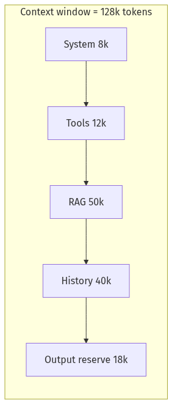

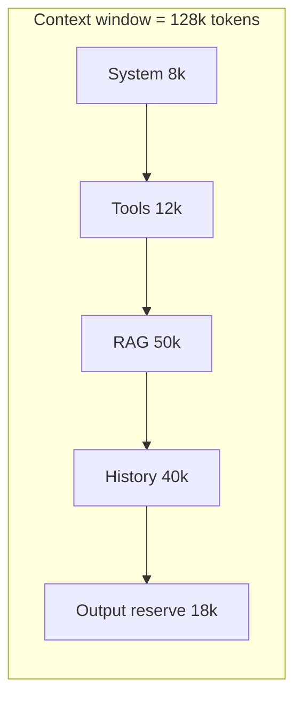

#### Packing anti-patterns

- Stuffing retrieval until user message is squeezed out
- Duplicating the same policy text in every chunk
- Including full tool JSON schemas when only 2 of 40 tools are enabled

---

### 6) Truncation Policies

**Truncation** = removing tokens when content exceeds budget.

| Policy | Behavior | Risk |
|--------|----------|------|
| **Head truncate** | Keep start, drop end | Loses recent user message |
| **Tail truncate** | Keep end, drop start | Loses system prompt / instructions |
| **Middle truncate** | Keep head + tail, drop middle | Good for logs; bad for narrative coherence |
| **FIFO eviction** | Drop oldest turns | Standard for chat; loses early constraints |
| **Priority eviction** | Drop by score (rerank, recency, role) | Best for agents |
| **Structured drop** | Drop tool results before user messages | Preserves intent |

#### Recommended default for chat/agents

1. Never truncate **system prompt** or **output reservation**.
2. Truncate **tool results** first (summarize if needed).
3. Truncate **retrieved docs** by lowest rerank score.
4. Truncate **history** FIFO or summarize oldest turns.
5. If still over budget → **reject** with actionable error, don’t silent-truncate the latest user message.

Anthropic and OpenAI return explicit errors when input alone exceeds the window—handle these in your gateway, not in the UI alone.

---

### 7) tiktoken-Style Counting

OpenAI’s [tiktoken](https://github.com/openai/tiktoken) is a fast BPE implementation aligned with OpenAI model encodings (`cl100k_base`, `o200k_base`, etc.).

#### Principles for production counters

1. **Model-specific encoding** — `gpt-4o` and `claude-3-5-sonnet` use different tokenizers.
2. **Count messages, not raw strings** — chat templates add role tokens and separators.
3. **Count before send** — pre-flight for UX (“this doc is too large”) and billing alerts.
4. **Fallback honestly** — if tiktoken unavailable, use a conservative estimator and label confidence.

#### Minimal tiktoken usage

```python
import tiktoken

enc = tiktoken.encoding_for_model("gpt-4o")
text = "def hello():\n    return 'world'"
print(len(enc.encode(text)))  # exact for OpenAI gpt-4o family
```

For Claude/Gemini, use provider token counting APIs when available; do not assume `cl100k_base` matches.

---

### 8) Long-Context Tradeoffs

| Dimension | Short context + RAG | Long-context model |
|-----------|---------------------|-------------------|
| **Recall** | Depends on retrieval quality | Better cross-document reasoning if truly in window |
| **Cost** | Lower per query if chunks small | High input $ on every call |
| **Latency** | Retrieval add-on; small prefill | Large prefill—seconds possible |
| **Freshness** | Index update decoupled | Paste is point-in-time |
| **Debuggability** | Citations from chunks | Harder to trace which part influenced answer |
| **Context rot** | Smaller *n* → often sharper | Large *n* → “lost in the middle” failures |

#### “Lost in the middle”

Models often underweight information placed in the **middle** of very long contexts. Mitigations:

- Put critical instructions at **start and end**
- Retrieve fewer, higher-quality chunks
- Use hierarchical summarize-then-answer for multi-doc tasks

#### When 1M context is worth it

- Cross-corpus legal / forensic review (low QPS, high value)
- Single-session code archaeology where graph is implicit
- Prototyping before investing in RAG index

#### When it is not

- High-QPS customer support (use RAG + small model)
- Anything with a fresh data plane (DB rows, tickets)—retrieve beats paste
- Cost-sensitive batch processing at millions of docs/day

---

### 9) Summarize vs Retrieve — Decision Framework

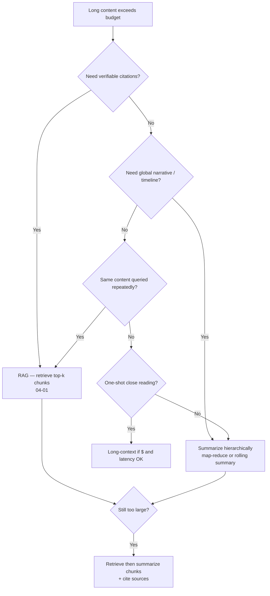

| Signal | Prefer **retrieve** | Prefer **summarize** |
|--------|---------------------|----------------------|
| Source of truth | External corpus, updates often | Static meeting notes |
| User need | “Where does it say X?” | “What happened overall?” |
| Audit | Citations required | Narrative OK |
| Size | TB-scale | Fits in 2–3 summarization passes |
| Multi-hop | Local evidence suffices | Global synthesis required |

**Hybrid (production default):** Retrieve top-k → compress each chunk → pack → generate with citations. Detailed patterns in [04-01 RAG Architecture](../04-RAG/04-01-RAG-Architecture.md).

**Agent sessions:** Prefer **rolling summarization** of old turns + **vector memory** for facts; don’t rely on infinite FIFO history. Anthropic documents server-side **compaction** for this class of problem.

---

## Implementation

### Production FastAPI: Token & Cost Estimator

This service provides **pre-flight token counting** and **USD estimation** with tiktoken when available, plus a **pure-Python fallback** with explicit uncertainty bounds.

```python
"""Token & cost estimator API.

Run:
  pip install fastapi uvicorn pydantic
  pip install tiktoken   # optional but recommended for OpenAI models

  uvicorn token_cost_app:app --reload --port 8080

Examples:
  curl -s localhost:8080/v1/estimate -H 'Content-Type: application/json' -d '{
    "model": "gpt-4o",
    "messages": [{"role":"user","content":"Hello"}],
    "max_output_tokens": 500
  }' | jq

Env:
  DEFAULT_MODEL=gpt-4o-mini
"""

from __future__ import annotations

import math
import re
from enum import Enum
from typing import Any

from fastapi import FastAPI, HTTPException
from pydantic import BaseModel, Field

# ---------------------------------------------------------------------------
# Optional tiktoken — exact counts for OpenAI encodings
# ---------------------------------------------------------------------------
try:
    import tiktoken

    TIKTOKEN_AVAILABLE = True
except ImportError:  # pragma: no cover
    tiktoken = None  # type: ignore
    TIKTOKEN_AVAILABLE = False


# ---------------------------------------------------------------------------
# Pricing table (USD per 1M tokens) — UPDATE when providers change prices
# Source: provider pricing pages; treat as config, not hardcoded forever
# ---------------------------------------------------------------------------
class ModelTier(str, Enum):
    GPT_4O = "gpt-4o"
    GPT_4O_MINI = "gpt-4o-mini"
    GPT_4_1_MINI = "gpt-4.1-mini"
    CLAUDE_SONNET = "claude-sonnet-4-20250514"
    GEMINI_FLASH = "gemini-2.0-flash"


PRICING_PER_1M: dict[str, dict[str, float]] = {
    # input, output, cached_input (0 if N/A)
    ModelTier.GPT_4O.value: {"input": 2.50, "output": 10.00, "cached_input": 1.25},
    ModelTier.GPT_4O_MINI.value: {"input": 0.15, "output": 0.60, "cached_input": 0.075},
    ModelTier.GPT_4_1_MINI.value: {"input": 0.40, "output": 1.60, "cached_input": 0.10},
    ModelTier.CLAUDE_SONNET.value: {"input": 3.00, "output": 15.00, "cached_input": 0.30},
    ModelTier.GEMINI_FLASH.value: {"input": 0.10, "output": 0.40, "cached_input": 0.025},
}

# Context window limits (tokens) — conservative defaults; verify per deployment
CONTEXT_LIMITS: dict[str, int] = {
    ModelTier.GPT_4O.value: 128_000,
    ModelTier.GPT_4O_MINI.value: 128_000,
    ModelTier.GPT_4_1_MINI.value: 1_047_576,
    ModelTier.CLAUDE_SONNET.value: 200_000,
    ModelTier.GEMINI_FLASH.value: 1_048_576,
}

# OpenAI model → tiktoken encoding mapping (extend as needed)
OPENAI_ENCODING: dict[str, str] = {
    "gpt-4o": "o200k_base",
    "gpt-4o-mini": "o200k_base",
    "gpt-4.1-mini": "o200k_base",
    "gpt-4.1": "o200k_base",
}


class Message(BaseModel):
    role: str
    content: str


class EstimateRequest(BaseModel):
    model: str = Field(default="gpt-4o-mini")
    messages: list[Message]
    max_output_tokens: int = Field(default=1024, ge=0, le=128_000)
    cached_input_tokens: int = Field(default=0, ge=0)
    tool_schema_tokens: int = Field(default=0, ge=0, description="Approx tokens for tool definitions")


class TokenBreakdown(BaseModel):
    method: str  # "tiktoken" | "fallback_heuristic"
    confidence: str  # "exact" | "approximate"
    input_tokens: int
    output_reserved: int
    total_tokens: int
    context_limit: int
    fits_context: bool
    overflow_tokens: int


class CostBreakdown(BaseModel):
    input_usd: float
    output_usd: float
    cached_input_usd: float
    total_usd: float
    pricing_unit: str = "USD per 1M tokens"


class EstimateResponse(BaseModel):
    model: str
    tokens: TokenBreakdown
    cost_if_fits: CostBreakdown
    notes: list[str]


app = FastAPI(title="Token & Cost Estimator", version="1.0.0")


# ---------------------------------------------------------------------------
# Pure fallback counter — NO external deps; intentionally conservative
# Heuristic: ~4 chars/token English; + overhead for chat template
# ---------------------------------------------------------------------------
def fallback_count_tokens(text: str) -> int:
    """Approximate token count without tiktoken.

    Method:
      - Base: ceil(len(text) / 4)  (OpenAI rule-of-thumb for English)
      - Penalty for code/JSON: extra 15% if high symbol density
    This OVER-estimates slightly — safer for budget alerts.
    """
    if not text:
        return 0
    base = math.ceil(len(text) / 4)
    symbols = len(re.findall(r"[^\w\s]", text))
    density = symbols / max(len(text), 1)
    if density > 0.08:  # code, JSON, markdown heavy
        base = math.ceil(base * 1.15)
    return base


def chat_template_overhead(num_messages: int) -> int:
    """Rough tokens added by role tags / separators (OpenAI-style)."""
    # ~4 tokens per message for role framing + 3 priming tokens
    return num_messages * 4 + 3


def count_with_tiktoken(model: str, text: str) -> int | None:
    if not TIKTOKEN_AVAILABLE:
        return None
    enc_name = OPENAI_ENCODING.get(model)
    if not enc_name:
        return None
    try:
        enc = tiktoken.get_encoding(enc_name)
        return len(enc.encode(text))
    except Exception:
        return None


def count_messages(model: str, messages: list[Message]) -> tuple[int, str, str]:
    """Return (input_tokens, method, confidence)."""
    combined = "\n".join(f"{m.role}: {m.content}" for m in messages)
    exact = count_with_tiktoken(model, combined)
    if exact is not None:
        # Add template overhead on top of raw encode (templates add a few tokens)
        total = exact + chat_template_overhead(len(messages))
        return total, "tiktoken", "exact"

    # Fallback path
    total = sum(fallback_count_tokens(m.content) for m in messages)
    total += chat_template_overhead(len(messages))
    return total, "fallback_heuristic", "approximate"


def compute_cost(
    model: str,
    input_tokens: int,
    output_tokens: int,
    cached_input_tokens: int,
) -> CostBreakdown:
    prices = PRICING_PER_1M.get(model)
    if not prices:
        raise HTTPException(status_code=400, detail=f"unknown model pricing: {model}")

    billable_input = max(input_tokens - cached_input_tokens, 0)
    input_usd = (billable_input / 1_000_000) * prices["input"]
    cached_usd = (cached_input_tokens / 1_000_000) * prices.get("cached_input", 0.0)
    output_usd = (output_tokens / 1_000_000) * prices["output"]
    return CostBreakdown(
        input_usd=round(input_usd, 6),
        output_usd=round(output_usd, 6),
        cached_input_usd=round(cached_usd, 6),
        total_usd=round(input_usd + cached_usd + output_usd, 6),
    )


@app.get("/health")
def health() -> dict[str, Any]:
    return {"status": "ok", "tiktoken_available": TIKTOKEN_AVAILABLE}


@app.post("/v1/estimate", response_model=EstimateResponse)
def estimate(req: EstimateRequest) -> EstimateResponse:
    if req.model not in PRICING_PER_1M:
        raise HTTPException(
            status_code=400,
            detail=f"unsupported model '{req.model}'. Add to PRICING_PER_1M config.",
        )

    input_tokens, method, confidence = count_messages(req.model, req.messages)
    input_tokens += req.tool_schema_tokens

    context_limit = CONTEXT_LIMITS.get(req.model, 128_000)
    total_needed = input_tokens + req.max_output_tokens
    fits = total_needed <= context_limit
    overflow = max(total_needed - context_limit, 0)

    notes: list[str] = []
    if method == "fallback_heuristic":
        notes.append(
            "Using char/4 fallback — install tiktoken for OpenAI-exact counts "
            "(https://github.com/openai/tiktoken)."
        )
    if req.model.startswith("claude") or req.model.startswith("gemini"):
        notes.append(
            "Non-OpenAI model: counts are approximate unless you plug in "
            "provider token counting APIs."
        )
    if req.tool_schema_tokens > 0:
        notes.append(f"Includes {req.tool_schema_tokens} tool schema tokens.")
    if not fits:
        notes.append(
            f"Overflow {overflow} tokens — apply truncation, RAG, or summarization "
            "before calling the model."
        )

    tokens = TokenBreakdown(
        method=method,
        confidence=confidence,
        input_tokens=input_tokens,
        output_reserved=req.max_output_tokens,
        total_tokens=total_needed,
        context_limit=context_limit,
        fits_context=fits,
        overflow_tokens=overflow,
    )

    cost = compute_cost(
        req.model,
        input_tokens=input_tokens,
        output_tokens=req.max_output_tokens,
        cached_input_tokens=req.cached_input_tokens,
    )

    return EstimateResponse(model=req.model, tokens=tokens, cost_if_fits=cost, notes=notes)


# ---------------------------------------------------------------------------
# Truncation helper — priority eviction for agent contexts
# ---------------------------------------------------------------------------
class ContextSegment(BaseModel):
    name: str
    text: str
    priority: int = Field(ge=0, le=100, description="100 = never drop first")
    token_count: int | None = None


class PackRequest(BaseModel):
    model: str
    segments: list[ContextSegment]
    max_input_tokens: int
    reserve_output_tokens: int = 1024


class PackResponse(BaseModel):
    packed_segments: list[ContextSegment]
    dropped_segments: list[str]
    total_input_tokens: int
    fits: bool


@app.post("/v1/pack", response_model=PackResponse)
def pack_context(req: PackRequest) -> PackResponse:
    """Greedy pack by priority (high first); drop lowest priority when over budget."""
    budget = req.max_input_tokens - req.reserve_output_tokens
    if budget <= 0:
        raise HTTPException(status_code=400, detail="reserve_output_tokens exceeds max_input_tokens")

    enriched: list[ContextSegment] = []
    for seg in req.segments:
        if seg.token_count is None:
            n, _, _ = count_messages(req.model, [Message(role="user", content=seg.text)])
            seg = seg.model_copy(update={"token_count": n})
        enriched.append(seg)

    enriched.sort(key=lambda s: s.priority, reverse=True)

    kept: list[ContextSegment] = []
    dropped: list[str] = []
    used = 0
    for seg in enriched:
        assert seg.token_count is not None
        if used + seg.token_count <= budget:
            kept.append(seg)
            used += seg.token_count
        else:
            dropped.append(seg.name)

    # Restore original segment order for kept items
    name_order = {s.name: i for i, s in enumerate(req.segments)}
    kept.sort(key=lambda s: name_order[s.name])

    return PackResponse(
        packed_segments=kept,
        dropped_segments=dropped,
        total_input_tokens=used,
        fits=len(dropped) == 0,
    )
```

#### Why this implementation is production-shaped

1. **Exact path** when tiktoken matches the model encoding.
2. **Fallback path** documented and conservative—never silently claims exact counts.
3. **Cost formula** matches provider billing structure (input / output / cached).
4. **Context fit check** before spend—returns overflow for gateway decisions.
5. **`/v1/pack`** encodes priority eviction—wire it ahead of your LLM client.

---

## Production Considerations

| Concern | Practice |
|---------|----------|
| Model renames | Externalize `PRICING_PER_1M` and `CONTEXT_LIMITS` to config/DB |
| Token drift | Re-count after prompt template changes; store hash in traces |
| Multi-provider | One counter interface; provider plugins behind it |
| Agents | Budget per turn; compact history at 70% window |
| Batch jobs | Pre-filter docs by token count before enqueue |
| Cached prefixes | Still count toward window; only $ changes |

---

## Security

| Threat | Control |
|--------|---------|
| **Prompt exfiltration via huge paste** | Max upload tokens; reject before model |
| **Token-count side channel** | Rate-limit `/v1/estimate`; no PII in logs |
| **Tool schema bloat** | Minimize tools exposed per request |
| **History retention** | Truncate/redact PII before persistence |

---

## Performance

| Stage | Dominant factor | Lever |
|-------|-----------------|-------|
| Prefill | Input token count | Shorter prompts, cache prefixes |
| Decode | Output token count | Lower `max_tokens`, stop sequences |
| KV cache | Context × batch size | Quantization, paged attention — [01-03](01-03-Inference-Serving-vLLM.md) |
| RAG | Retrieval + rerank | Smaller *k*, better chunking — [04-01](../04-RAG/04-01-RAG-Architecture.md) |

**Rule:** Measure p95 **prefill ms per input token** separately from **decode ms per output token**.

---

## Cost

| Lever | Typical savings |
|-------|-----------------|
| Pre-flight reject | 100% of would-be oversize calls |
| Prompt caching | 50–90% on repeated system prefixes |
| Smaller model for draft | 5–20× on output $ |
| RAG vs full paste | 10–100× on input $ for large corpora |
| History compaction | Linear reduction in agent turn cost |

Deep dive: [10-04 Cost & Latency Optimization](../10-Production-Infrastructure/10-04-Cost-Latency-Optimization.md)

---

## Scalability

At high QPS, **input tokens per request** drives GPU memory and prefill throughput. Design for:

- Central token budget service (this estimator pattern)
- Async summarization workers for compaction
- Index-backed retrieval instead of megabyte prompts

---

## Failure Modes

| Failure | Symptom | Mitigation |
|---------|---------|------------|
| Wrong tokenizer | Off-by-30% budgets | Model-specific encodings |
| Silent middle truncation | Ignored instructions | Priority eviction + tests |
| Tool result avalanche | Context blown by turn 5 | Summarize tool JSON |
| Confusing window with recall | “It missed page 47” | RAG + cite; don’t paste 500 pages |
| `max_tokens` too low | Truncated JSON mid-field | Reserve output headroom |
| Cache double-count | Wrong $ estimates | Separate cached vs uncached fields |

---

## Observability

Minimum token telemetry per request:

```text
trace_id, model, tokenizer_method, token_in, token_out,
token_cached_read, context_limit, overflow_rejected,
truncation_policy, segments_dropped[], cost_usd,
prefill_ms, decode_ms
```

Dashboards: **tokens per successful task**, **overflow reject rate**, **$/1K tokens by feature flag**.

---

## Debugging

| Question | Where to look |
|----------|---------------|
| Bill spike? | `token_in` trend + agent turn count |
| Quality drop on long sessions? | History length + compaction events |
| RAG ignores doc? | Chunk token counts + rerank scores |
| Latency regression? | Prefill ms vs input tokens scatter plot |

---

## Common Mistakes

1. Using `split()` for billing or truncation.
2. Assuming 128k context = 128k reliable facts.
3. Dropping system prompt under pressure.
4. Ignoring tool schema tokens in every agent call.
5. Pasting entire PDFs instead of retrieve + cite.
6. No output token reservation → broken JSON tool calls.
7. One global truncation policy for chat, RAG, and batch ETL.

---

## Tradeoffs

| Choice | Upside | Downside |
|--------|--------|----------|
| Long-context frontier model | Simple architecture | $, latency, context rot |
| RAG | Cheap at scale, fresh index | Retrieval errors, infra |
| Rolling summarization | Bounded agent cost | Summary drift, lost detail |
| Hard reject on overflow | Safe, predictable UX | User friction |
| Silent truncation | Always returns something | Wrong answers, compliance risk |

---

## Architecture Diagram — Context Gateway

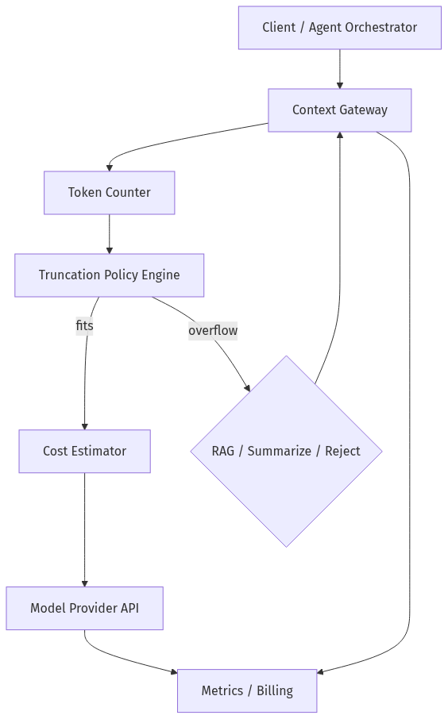

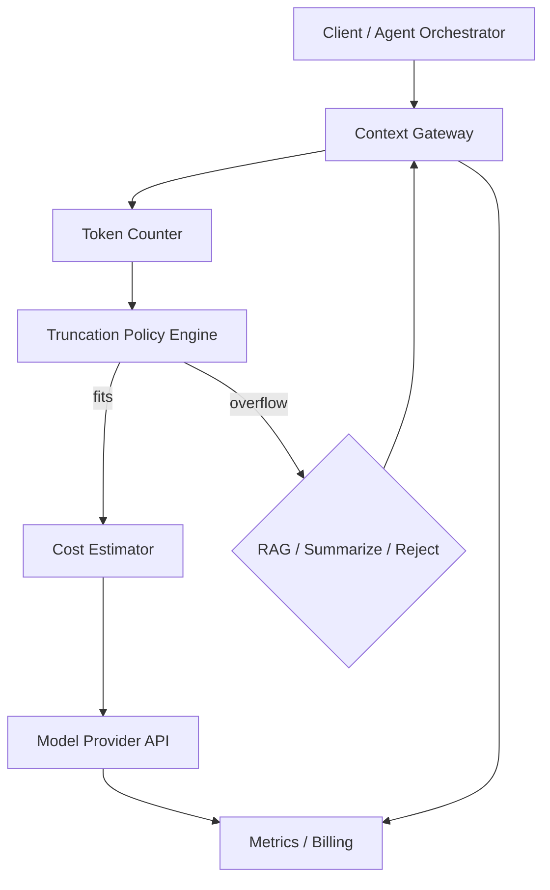

---

## Mermaid Diagram — Agent Turn Token Growth

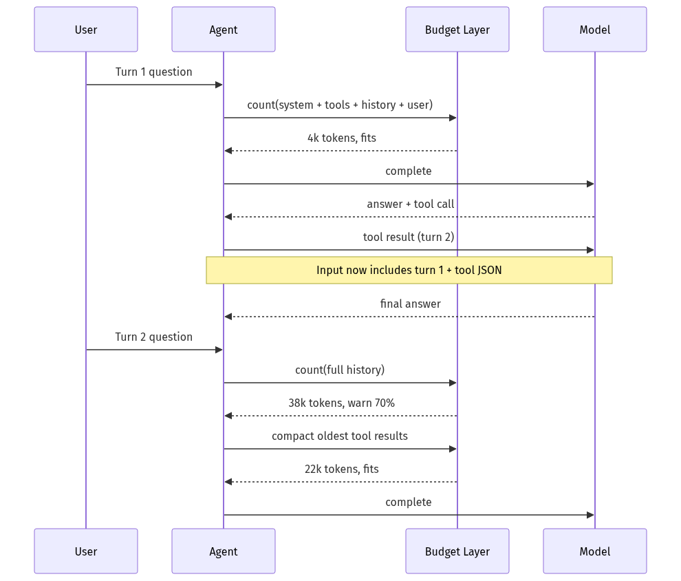

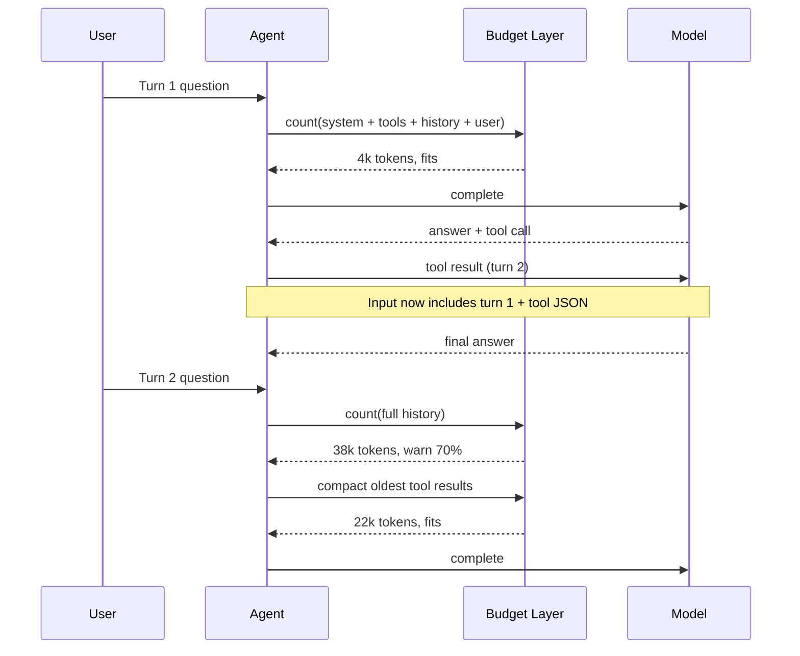

---

## Production Examples

| Pattern | Token move |
|---------|------------|
| **Cursor / IDE assistants** | Retrieve relevant files; never whole repo in prompt |
| **Support copilots** | Ticket + KB chunks; strict output JSON schema |
| **Legal review** | Long-context for single matter; RAG for firm-wide corpus |
| **Batch summarization** | Map-reduce with chunk token caps |

---

## Real Companies Using It (Public Patterns)

| Org | Public pattern | Lesson |
|-----|----------------|--------|
| **OpenAI** | tiktoken + per-model encodings | Tokenizer is part of the model contract |
| **Anthropic** | Context rot docs; compaction beta | Window size ≠ uniform quality |
| **Google DeepMind** | Gemini long-context marketing + docs | Cross-modal tokens share one budget |
| **Perplexity-style search** | Retrieve + cite; small synthesis context | RAG is the default economics winner |

---

## Hands-on Labs

### Lab A — Token surprise matrix (45 min)

Tokenize: English paragraph, Python file, JSON payload, Korean sentence, emoji string. Record tokens/word ratio per category.

### Lab B — Cost estimator (60 min)

Run the FastAPI service. Estimate cost for a 50-message support thread with `tool_schema_tokens=8000`. Toggle tiktoken on/off; compare confidence flags.

### Lab C — Packing drill (45 min)

POST `/v1/pack` with segments: `system` (P100), `tools` (P100), `rag` (P80), `history` (P50), `user` (P90). Force overflow; verify lowest priority drops first.

### Lab D — Summarize vs retrieve (60 min)

Same 200-page handbook excerpt: (1) paste until overflow, (2) RAG top-8 chunks, (3) hierarchical summary. Compare answer quality, cost, latency.

---

## Coding Assignments

1. Add provider plugins: Claude token counting API wrapper with fallback.
2. Persist price tables in Redis; hot-reload without redeploy.
3. Wire `/v1/estimate` into an API gateway that returns `413` on overflow.
4. Emit OpenTelemetry metrics from the packer (`segments_dropped` counter).

---

## Mini Project

**Title:** Context Budget Middleware  
**Done when:** All LLM calls pass through token check; overflow returns structured error with suggested `max_chars`; unit tests for truncation policy.

---

## Production Project

**Title:** Feature-Level Token Governance Dashboard  
**Done when:** Per-feature daily token/cost charts; alerts at 80% of budget; links traces to prompt versions. Cross-link metrics design to [10-04](../10-Production-Infrastructure/10-04-Cost-Latency-Optimization.md).

---

## Stretch Project

Build a **map-reduce summarizer** that reads a directory of markdown files, respects a 8k-token map budget, and produces a 2k-token reduce brief. Compare total cost vs one long-context call on the concatenated corpus.

---

## Interview Questions

### Senior Engineer

1. Why don’t LLMs tokenize on words?
2. What is the difference between context window size and effective recall?
3. How would you implement pre-flight checks before calling an LLM API?
4. Why does JSON inflate token counts?
5. When would you truncate middle vs FIFO history?

### Staff Engineer

1. Design a context budget system for a 10-tool customer-support agent.
2. Your agent costs 3× forecast—walk through diagnosis using token telemetry.
3. Compare RAG, summarization, and long-context for an internal wiki Q&A product.
4. How does prefill cost scale with context length, and what does that imply for serving?
5. How do cached prompt prefixes affect **billing** vs **context occupancy**?

### Principal Engineer

1. Propose org-wide standards for truncation policies across teams.
2. When is “lost in the middle” a product risk vs a model risk?
3. How would you migrate from paste-everything to retrieve-first without quality regression?
4. Define SLIs for context health (`overflow_reject_rate`, `tokens_per_success`).
5. How do token economics change your model routing tier strategy with [01-03](01-03-Inference-Serving-vLLM.md)?

### Engineering Manager

1. How do you explain a token budget to a PM who thinks in words/pages?
2. What KPIs go on the scorecard for an LLM feature beyond “accuracy”?
3. A stakeholder wants 500-page PDF analysis in every chat message—how do you respond?
4. How do you staff infra vs application work for context management?
5. When do you approve premium long-context models vs invest in RAG platform?

### Whiteboard

Draw the flow: user message → token counter → truncation → cost estimate → model → observability. Label where RAG and summarization branches attach.

### Follow-ups

- What if tokenizer differs between dev (OpenAI) and prod (Azure OpenAI same model)?
- What if compaction summaries drift over 50 turns?
- What if legal requires full audit trail of what was **not** shown to the model?

---

## Revision Notes

- **Tokens** are the billing and memory unit—not words.
- Use the **same tokenizer as the target model** for counts.
- Context **capacity ≠ quality**; watch context rot and lost-in-the-middle.
- **Reserve output tokens**; truncate by **priority**, not convenience.
- Agents multiply cost—**compact** early, **retrieve** by default, **long-context** when economics allow.
- Formula: \(\text{\$} = t_{\text{in}} p_{\text{in}} + t_{\text{out}} p_{\text{out}} + t_{\text{cached}} p_{\text{cached}}\) (per 1K/1M per provider).

---

## Summary

Tokenization and context windows are the **financial and physical limits** of LLM engineering. BPE and WordPiece turn text into model-native units; every production decision—truncation, RAG, summarization, model choice—should be expressed in **tokens**, with explicit **packing**, **counting**, and **cost estimation** before the model runs. Master this chapter and you can explain both the **invoice** and the **architecture** in the same breath.

---

## Further Reading

| Title | URL | Difficulty | Reading Time | Why Read | Important Sections |
|-------|-----|------------|--------------|----------|--------------------|
| tiktoken (OpenAI BPE) | https://github.com/openai/tiktoken | Intro | 20 min | Exact OpenAI token counting | README; `encoding_for_model` |
| OpenAI Text Generation Guide | https://developers.openai.com/api/docs/guides/text-generation | Intro | 45 min | Official context & message semantics | Max tokens; message roles |
| Anthropic Context Windows | https://platform.claude.com/docs/en/docs/build-with-claude/context-windows | Intermediate | 40 min | Context rot, thinking tokens, compaction | What counts; overflow behavior |
| Gemini Long Context | https://ai.google.dev/gemini-api/docs/long-context | Intermediate | 30 min | Multimodal long-context constraints | Limits; best practices |
| Attention Is All You Need | https://arxiv.org/abs/1706.03762 | Advanced | 60 min | Why prefill scales with sequence² — ties to [01-01](01-01-Transformer-Architecture.md) | Multi-head attention |
| Lost in the Middle (Liu et al.) | https://arxiv.org/abs/2307.03172 | Intermediate | 45 min | Evidence for long-context recall limits | Experiments on placement |
| Neural Machine Translation by Jointly Learning to Align and Translate | https://arxiv.org/abs/1409.0473 | Advanced | Optional | Historical attention intuition | Attention mechanism |

---

## Resume Bullet (after lab)

- Built a **FastAPI token & cost estimator** with tiktoken exact counts, conservative fallback heuristics, priority-based context packing, and pre-flight overflow rejection—cut unexpected LLM spend by enforcing budgets before provider calls.
