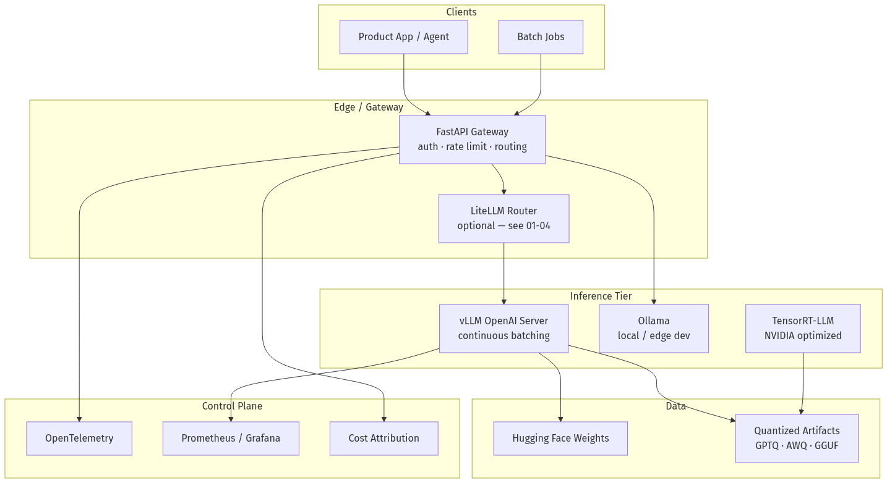
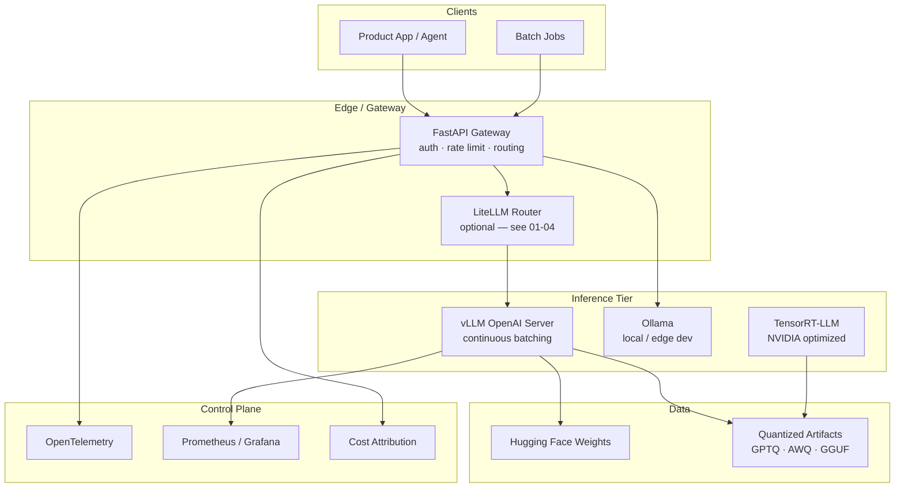
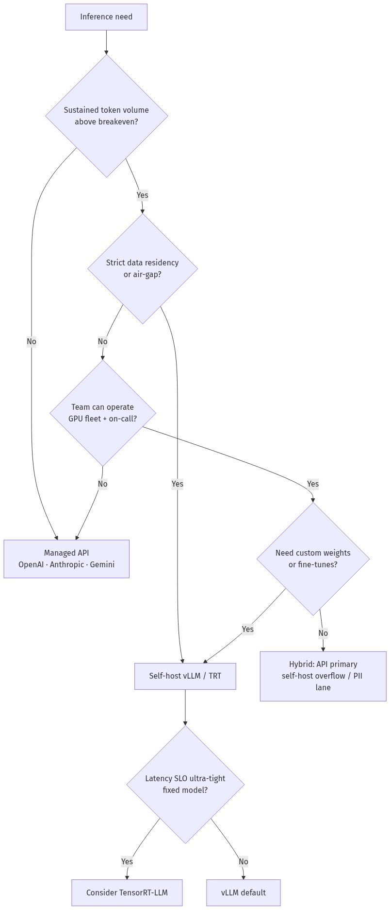
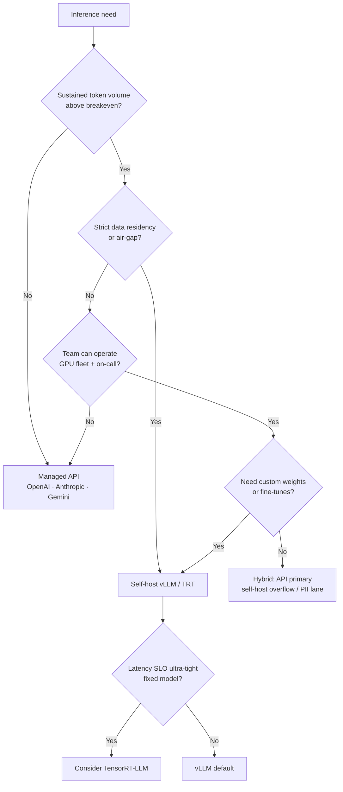
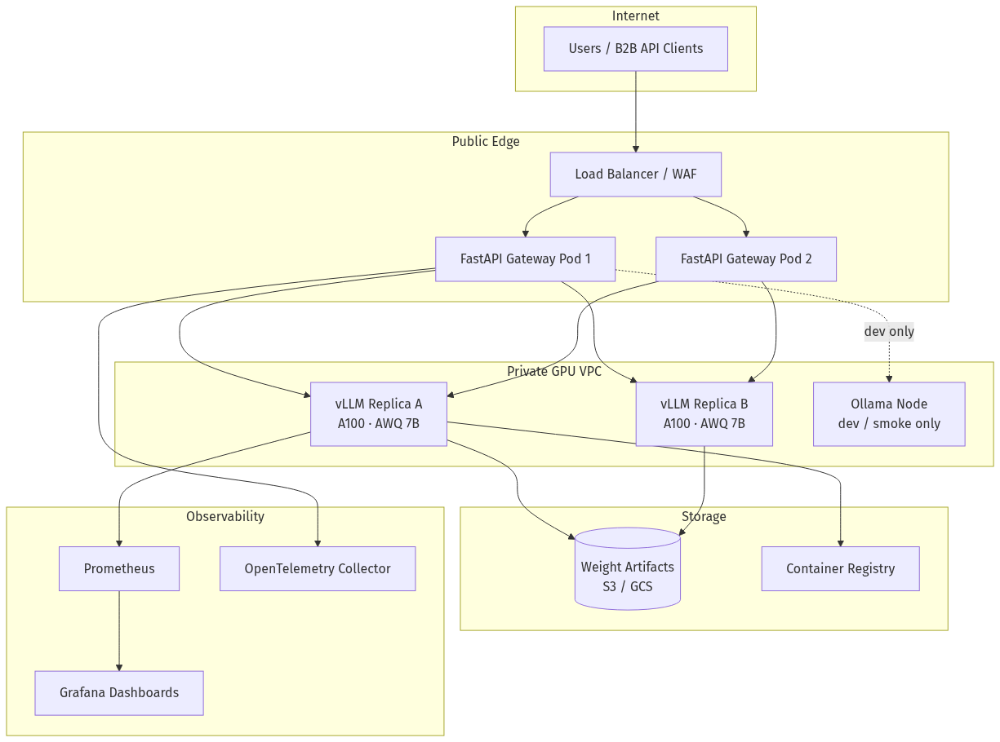
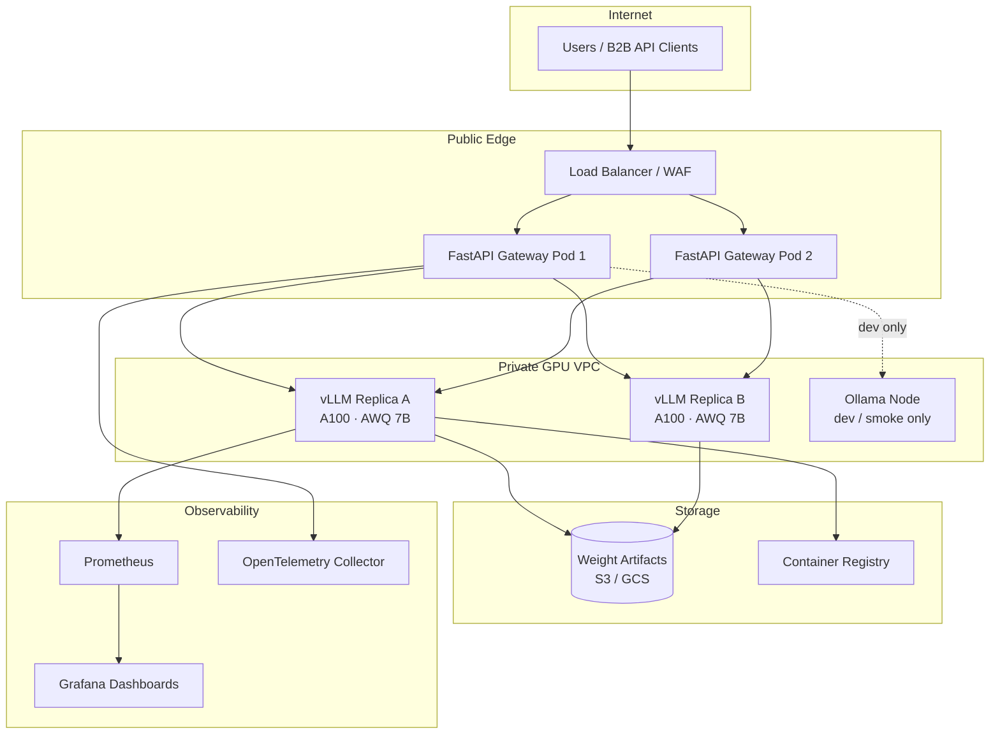
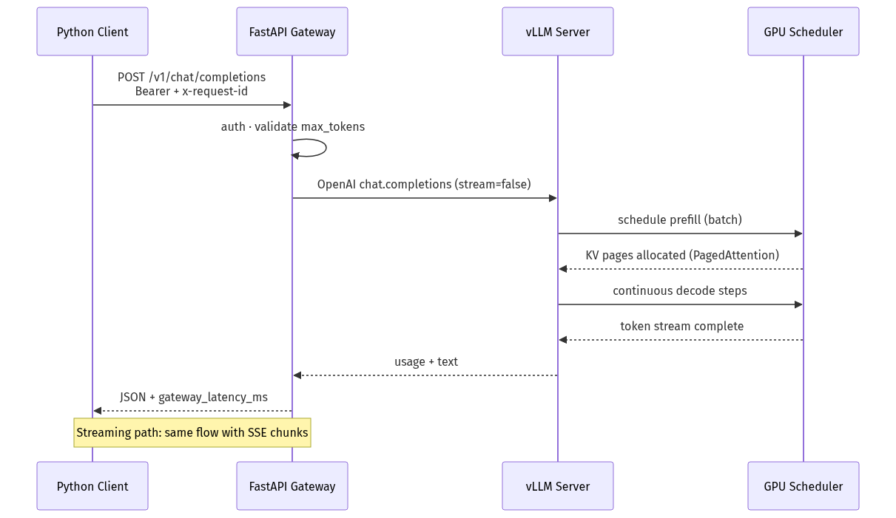
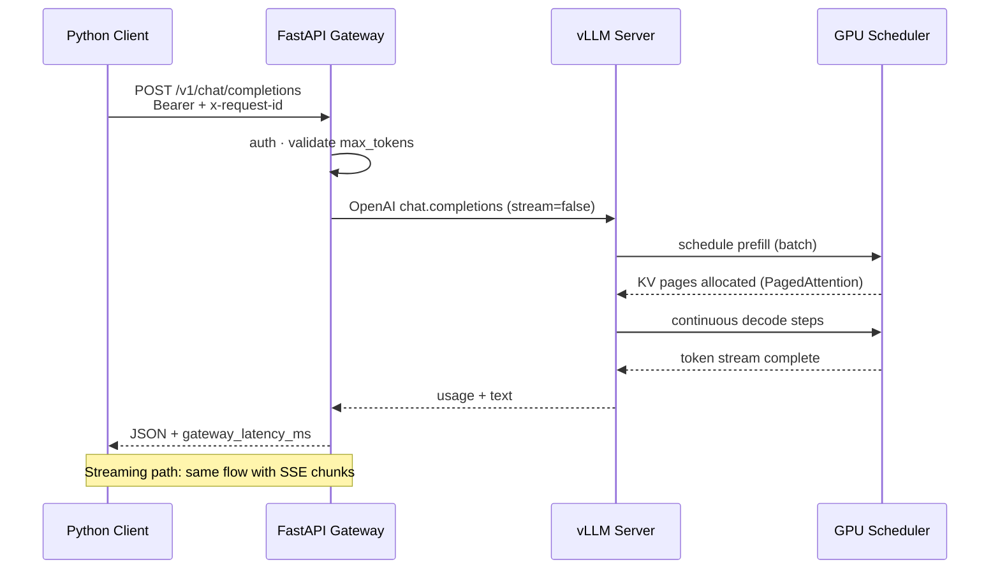

# 01-03 — Inference Serving with vLLM, Ollama & Quantization

| Meta | Value |
|------|-------|
| **Estimated Time** | 5–6 hours (read 2.5h · lab 2h · capacity planning 1h) |
| **Difficulty** | Intermediate (concepts) · Advanced (production sizing & SLOs) |
| **Prerequisites** | [01-02 Tokenization & Context Windows](01-02-Tokenization-Context-Windows.md); basic GPU/HTTP literacy; Python async familiarity |
| **Module** | 01 — LLM Engineering |
| **Related** | [01-02](01-02-Tokenization-Context-Windows.md) · [01-04](01-04-Model-Routing-LiteLLM.md) · [10-02 Docker/K8s/CI/CD](../10-Production-Infrastructure/10-02-Docker-Kubernetes-CICD.md) · [10-04 Cost & Latency](../10-Production-Infrastructure/10-04-Cost-Latency-Optimization.md) · [Architecture Index](../../Architecture Index.md) · [Study Plan](../../Study Plan.md) |

---

## Learning Objectives

By the end of this chapter you will be able to:

1. Explain **inference serving** vs training and why production latency is dominated by **memory bandwidth**, not FLOPs alone.
2. Contrast **static batching**, **dynamic batching**, and **continuous batching** (iteration-level scheduling).
3. Build intuition for **PagedAttention** and why KV-cache memory fragmentation kills naive serving.
4. Deploy and call **vLLM** via its OpenAI-compatible API, fronted by a **FastAPI gateway** with auth, timeouts, and observability hooks.
5. Choose between **Ollama** (local dev), **vLLM** (self-hosted GPU fleet), **TensorRT-LLM** (NVIDIA-optimized), and **managed APIs**.
6. Select quantization formats (**GPTQ**, **AWQ**, **GGUF**) at a Staff-level tradeoff altitude.
7. Describe **speculative decoding** and when it improves tokens/sec without changing model quality.
8. Decide **self-host vs API** using cost, latency, compliance, and operational maturity—not hype.

---

## Why This Topic Matters

Calling `openai.chat.completions.create()` hides the hardest part of LLM engineering: **serving a 70B model to thousands of concurrent users without melting GPUs or budgets**.

Training gets the headlines. **Inference is where product economics live.** Every agent loop, RAG re-rank, and multi-turn chat multiplies:

- **Prefill** cost (processing the prompt / context — scales with input tokens),
- **Decode** cost (generating each new token — scales with output length × concurrency),
- **KV-cache** residency (memory that grows with sequence length × active requests).

A Principal engineer who cannot reason about batching and KV-cache will:

- over-provision GPUs and burn margin,
- miss p95 latency SLOs under bursty traffic,
- pick quantization that silently degrades tool-calling accuracy,
- and fail system design interviews that start with “Design ChatGPT inference.”

This chapter connects token economics from [01-02](01-02-Tokenization-Context-Windows.md) to routing and fallbacks in [01-04](01-04-Model-Routing-LiteLLM.md), and to fleet operations in [10-02](../10-Production-Infrastructure/10-02-Docker-Kubernetes-CICD.md) and unit economics in [10-04](../10-Production-Infrastructure/10-04-Cost-Latency-Optimization.md).

---

## Business Impact

| Business outcome | How inference choices move the needle |
|------------------|---------------------------------------|
| **Gross margin** | Quantization + right-sized GPUs can cut $/1M tokens 3–10× vs naive FP16 serving |
| **Conversion / retention** | TTFT (time-to-first-token) and streaming UX drive perceived quality |
| **Compliance** | Self-host keeps prompts/responses in your VPC; APIs export data to third parties |
| **Time-to-market** | Managed APIs ship fastest; self-host pays back at sustained volume |
| **Reliability story** | Multi-region API + local cache vs single GPU node — different failure modes |

---

## Architecture Overview

Production inference is rarely “run `transformers.generate()` in a Flask app.” It is a **serving stack**:





**Mental model:** The gateway owns **product contracts** (auth, schemas, SLOs). The inference engine owns **throughput** (batching, KV-cache, kernels). Quantization owns **$/token**. Routing ([01-04](01-04-Model-Routing-LiteLLM.md)) owns **which engine answers which request**.

---

## Core Concepts

### 1) Inference Serving — Prefill vs Decode

#### Definition

| Phase | What happens | Cost driver |
|-------|--------------|-------------|
| **Prefill** | Process entire prompt/context; build initial KV states | Input token count; parallelizable across sequence |
| **Decode** | Generate one token at a time autoregressively | Output length; **memory-bound**; serial per sequence |

#### Intuition

Prefill is like **bulk-loading** a database index. Decode is like **serving one row at a time** while keeping the index hot in RAM. Long contexts (see [01-02](01-02-Tokenization-Context-Windows.md)) explode KV-cache size; long outputs explode decode steps.

#### Production metrics

| Metric | Meaning | Typical SLO context |
|--------|---------|---------------------|
| **TTFT** | Time to first token | Chat UX, voice pipelines |
| **ITL** | Inter-token latency | Streaming smoothness |
| **TPS** | Tokens/sec (aggregate or per user) | Capacity planning |
| **Goodput** | Successful tokens/sec under SLO | What finance should track |

#### Interview discussion

> “We optimize TTFT with chunked prefill and prefix caching; we optimize cost with quantization and continuous batching—not by blindly raising `max_tokens`.”

---

### 2) Batching — Static, Dynamic, Continuous

#### Definition

| Strategy | Behavior | Pros | Cons |
|----------|----------|------|------|
| **Static batching** | Wait until batch full or timeout; all sequences finish together | Simple | **Padding waste**; tail latency when one sequence is long |
| **Dynamic batching** | Group requests arriving within a window | Better GPU utilization | Still blocked by longest sequence in batch |
| **Continuous batching** | Add/remove sequences **between decode steps** (iteration-level) | High throughput; low tail latency | Requires scheduler + paged KV memory (vLLM) |

#### Intuition — the restaurant analogy

- **Static:** One table cannot order until every seat is filled; everyone waits for the slowest eater.
- **Continuous:** Diners join and leave between courses; the kitchen keeps cooking.

#### When to use each

- **Static:** Offline batch eval jobs with uniform output lengths.
- **Dynamic:** Early prototypes without vLLM.
- **Continuous:** **Any online serving** with variable output lengths — default for production chat.

#### When NOT to use static batching online

Interactive chat with 20–2000 token replies. One 4K-token outlier stalls the entire batch.

---

### 3) PagedAttention — KV-Cache as Virtual Memory

#### Definition

During decode, each layer stores **key/value tensors** for every prior token — the **KV-cache**. Naive implementations allocate contiguous GPU memory per sequence, causing **fragmentation** (holes) and **over-reservation** (allocate max context up front).

**PagedAttention** (vLLM) stores KV blocks in fixed-size **pages**, mapped via a block table — analogous to OS virtual memory.

#### Intuition

```text
Naive:     [==== seq A max 8192 =====][== hole ==][==== seq B max 8192 =====]
Paged:     [blk][blk][blk] A  +  [blk] B  +  [blk][blk] C  → pack tightly
```

#### Why it exists

Continuous batching requires **dynamic join/leave**. Without paged KV, memory fragmentation caps concurrency far below theoretical GPU RAM.

#### Production implication

`gpu_memory_utilization=0.9` in vLLM is meaningful because the scheduler can **pack** blocks. Without paging, you leave 30–50% VRAM unused or OOM early.

#### Interview one-liner

> “PagedAttention lets the scheduler treat KV-cache like malloc’d pages instead of one giant contiguous buffer per request.”

---

### 4) vLLM — Production Open-Source Serving

#### Definition

[vLLM](https://github.com/vllm-project/vllm) is a high-throughput LLM inference engine featuring continuous batching, PagedAttention, OpenAI-compatible APIs, tensor parallelism, pipeline parallelism, speculative decoding, and broad model support.

**Docs:** [https://docs.vllm.ai/en/latest/](https://docs.vllm.ai/en/latest/)

#### Key flags (production mental map)

| Flag / setting | Purpose |
|----------------|---------|
| `--tensor-parallel-size N` | Shard model across N GPUs (large models) |
| `--max-model-len` | Cap context — protects KV memory |
| `--gpu-memory-utilization` | Fraction of VRAM for weights + KV |
| `--enable-prefix-caching` | Reuse KV for shared system prompts / RAG prefixes |
| `--quantization awq/gptq` | Load pre-quantized weights |
| `--speculative-model` | Draft model for speculative decoding |

#### When to use vLLM

- Sustained self-hosted traffic on **NVIDIA GPUs** (cloud or on-prem).
- Need OpenAI-compatible surface for drop-in SDK clients.
- Multi-tenant internal platform serving several open-weight models.

#### When NOT to use vLLM

- Laptop CPU-only inference → **Ollama** or llama.cpp/GGUF.
- You need zero GPU ops headcount → **managed API**.
- You require maximum single-GPU perf on NVIDIA with engineering for TRT engines → evaluate **TensorRT-LLM**.

---

### 5) Ollama — Local Development & Edge

#### Definition

[Ollama](https://github.com/ollama/ollama) packages model pull, quantization (GGUF), and a local HTTP API for fast iteration on macOS/Linux.

#### When to use Ollama

- Developer laptops, demos, integration tests without cloud spend.
- Privacy-sensitive local experiments before promoting weights to vLLM fleet.
- CI smoke tests with tiny models (`llama3.2:1b`).

#### When NOT to use Ollama as “production”

- High concurrency multi-tenant SaaS (no continuous batching at vLLM scale).
- Strict p99 SLOs under burst traffic.
- Multi-GPU tensor-parallel serving.

**Pattern:** Ollama in dev → vLLM (or API) in prod. Same OpenAI SDK with different `base_url`.

---

### 6) Quantization — GPTQ, AWQ, GGUF (High Level)

**Reference:** [Hugging Face Quantization Guide](https://huggingface.co/docs/transformers/en/main_classes/quantization)

#### Definition

Quantization reduces weight (and sometimes activation) precision — **FP16/BF16 → INT8/INT4** — shrinking memory and increasing tokens/sec at possible quality loss.

| Format | Typical use | Notes |
|--------|-------------|-------|
| **GPTQ** | GPU inference (4-bit weights) | Post-training quant; widely supported in vLLM |
| **AWQ** | GPU inference (4-bit, activation-aware) | Often better accuracy per bit vs GPTQ on same model |
| **GGUF** | CPU/GPU via llama.cpp, **Ollama** | File format + runtime; great for local, not vLLM’s primary path |

#### Intuition

You compress a high-resolution photo to JPEG. Smaller file, faster load — but fine text may blur. **Tool-calling JSON** and **math** are the first casualties of aggressive quant.

#### Production rules

1. **Always eval after quant** — same golden set as pre-quant ([08-01](../08-Evaluation-LLMOps/08-01-Evaluation-Lifecycle.md)).
2. Prefer **AWQ/GPTQ 4-bit** for GPU fleet; **GGUF Q4_K_M** for Ollama local.
3. Keep a **BF16 fallback** route for high-stakes requests ([01-04 routing](01-04-Model-Routing-LiteLLM.md)).
4. Quantization ≠ security. It is a **performance** lever.

#### When NOT to quantize aggressively

- Fragile structured outputs (OpenAPI tool schemas).
- Small models already fitting in VRAM — quant savings may not justify eval risk.

---

### 7) Speculative Decoding

#### Definition

A small **draft model** proposes K tokens; the large **target model** verifies them in parallel. Accepted tokens advance in one step; rejection rolls back.

#### Intuition

Spell-check autocomplete: a fast guesser proposes words; the expert editor confirms in bulk.

#### When it helps

- Target model is large/slow; draft is same family but smaller.
- Acceptable to run second model — memory tradeoff.
- vLLM `--speculative-model` or TensorRT-LLM speculative mode.

#### When NOT to use

- Draft/target mismatch causes low acceptance rate → wasted compute.
- Memory-constrained single-GPU already near OOM.

---

### 8) TensorRT-LLM (Mention)

**NVIDIA TensorRT-LLM:** [https://developer.nvidia.com/tensorrt-llm](https://developer.nvidia.com/tensorrt-llm)

Compiled CUDA kernels + graph optimizations for NVIDIA GPUs. Often wins raw benchmarks vs generic PyTorch paths. Tradeoffs:

| Upside | Downside |
|--------|----------|
| Top-tier latency/throughput on NVIDIA | Build complexity (engine compile per model/GPU) |
| Strong FP8/INT4 paths on H100/L40S | Less agile than vLLM for rapid model churn |
| Enterprise NVIDIA support story | Operational skill set differs from “pip install vllm” |

**Staff move:** vLLM for **velocity**; TensorRT-LLM when **single-digit ms ITL** at fixed model revision is worth compile pipelines ([10-02](../10-Production-Infrastructure/10-02-Docker-Kubernetes-CICD.md) for baking engines into images).

---

### 9) Self-Host vs Managed API





#### Rough breakeven intuition (not financial advice — measure yours)

| Factor | API wins | Self-host wins |
|--------|----------|----------------|
| Volume | Spiky, low total tokens | Steady **>100M–500M tokens/mo** (model/GPU dependent) |
| Team | No ML infra | Platform team + GPU on-call |
| Compliance | Standard SaaS DPA OK | Regulated data, sovereign cloud |
| Model churn | Weekly frontier swaps | Fixed open-weight revision for quarters |
| Latency | Good enough p95 | Custom colo + batching tuning |

Deep cost math: [10-04 Cost & Latency Optimization](../10-Production-Infrastructure/10-04-Cost-Latency-Optimization.md).

---

## Implementation

### Stack layout

```text
Client (OpenAI SDK)
    → FastAPI Gateway (:8080)  auth, rate limits, tracing
        → vLLM OpenAI Server (:8000)  continuous batching
```

### Step 1 — Launch vLLM (OpenAI-compatible server)

```bash
# Example: single A100 80GB, AWQ-quantized Llama 3 8B
pip install "vllm>=0.6.0"

python -m vllm.entrypoints.openai.api_server \
  --model "Qwen/Qwen2.5-7B-Instruct-AWQ" \
  --quantization awq \
  --host 0.0.0.0 \
  --port 8000 \
  --max-model-len 8192 \
  --gpu-memory-utilization 0.92 \
  --enable-prefix-caching
```

Verify:

```bash
curl -s http://localhost:8000/v1/models | jq .
```

### Step 2 — FastAPI gateway (production-shaped)

The gateway is **your** code: authentication, request IDs, timeouts, structured logging, and future routing to [01-04 LiteLLM](01-04-Model-Routing-LiteLLM.md).

```python
"""FastAPI gateway in front of vLLM OpenAI-compatible server.

Run vLLM on :8000, then:
  pip install fastapi uvicorn httpx openai pydantic
  export VLLM_BASE_URL=http://127.0.0.1:8000/v1
  export GATEWAY_API_KEY=dev-secret-key
  uvicorn gateway:app --host 0.0.0.0 --port 8080

Env:
  VLLM_BASE_URL   — upstream OpenAI-compatible base URL
  GATEWAY_API_KEY — bearer token clients must send
  VLLM_MODEL      — default model id (must exist on vLLM)
  REQUEST_TIMEOUT — seconds (default 120)
"""

from __future__ import annotations

import os
import time
import uuid
from contextlib import asynccontextmanager
from typing import Any, AsyncIterator

import httpx
from fastapi import Depends, FastAPI, Header, HTTPException, Request
from fastapi.responses import JSONResponse, StreamingResponse
from openai import AsyncOpenAI
from pydantic import BaseModel, Field

VLLM_BASE_URL = os.getenv("VLLM_BASE_URL", "http://127.0.0.1:8000/v1")
GATEWAY_API_KEY = os.getenv("GATEWAY_API_KEY", "dev-secret-key")
DEFAULT_MODEL = os.getenv("VLLM_MODEL", "Qwen/Qwen2.5-7B-Instruct-AWQ")
REQUEST_TIMEOUT = float(os.getenv("REQUEST_TIMEOUT", "120"))


class ChatMessage(BaseModel):
    role: str
    content: str


class ChatCompletionRequest(BaseModel):
    model: str = Field(default=DEFAULT_MODEL)
    messages: list[ChatMessage]
    temperature: float = Field(default=0.2, ge=0.0, le=2.0)
    max_tokens: int = Field(default=512, ge=1, le=8192)
    stream: bool = False
    user: str | None = None  # for abuse tracking / rate limits


class ChatCompletionResponse(BaseModel):
    id: str
    object: str = "chat.completion"
    model: str
    choices: list[dict[str, Any]]
    usage: dict[str, int]
    gateway_latency_ms: int


def require_api_key(authorization: str | None = Header(default=None)) -> None:
    if not authorization or not authorization.startswith("Bearer "):
        raise HTTPException(status_code=401, detail="missing bearer token")
    token = authorization.removeprefix("Bearer ").strip()
    if token != GATEWAY_API_KEY:
        raise HTTPException(status_code=403, detail="invalid api key")


@asynccontextmanager
async def lifespan(app: FastAPI) -> AsyncIterator[None]:
    app.state.http = httpx.AsyncClient(timeout=REQUEST_TIMEOUT)
    app.state.openai = AsyncOpenAI(
        base_url=VLLM_BASE_URL,
        api_key="EMPTY",  # vLLM ignores; gateway enforces auth
        http_client=app.state.http,
        timeout=REQUEST_TIMEOUT,
    )
    yield
    await app.state.http.aclose()


app = FastAPI(title="LLM Gateway", version="1.0.0", lifespan=lifespan)


@app.get("/healthz")
async def healthz() -> dict[str, str]:
    try:
        r = await app.state.http.get(f"{VLLM_BASE_URL.rstrip('/v1')}/health")
        r.raise_for_status()
    except httpx.HTTPError as exc:
        raise HTTPException(status_code=503, detail=f"vllm unhealthy: {exc}") from exc
    return {"status": "ok", "upstream": VLLM_BASE_URL}


@app.post("/v1/chat/completions")
async def chat_completions(
    body: ChatCompletionRequest,
    request: Request,
    _: None = Depends(require_api_key),
) -> Any:
    trace_id = request.headers.get("x-request-id", str(uuid.uuid4()))
    started = time.perf_counter()

    messages = [m.model_dump() for m in body.messages]

    if body.stream:
        return await _stream_completion(body, messages, trace_id)

    client: AsyncOpenAI = request.app.state.openai
    try:
        resp = await client.chat.completions.create(
            model=body.model,
            messages=messages,
            temperature=body.temperature,
            max_tokens=body.max_tokens,
            user=body.user,
            extra_headers={"x-request-id": trace_id},
        )
    except Exception as exc:  # noqa: BLE001 — gateway maps upstream errors
        raise HTTPException(status_code=502, detail=f"upstream error: {exc}") from exc

    latency_ms = int((time.perf_counter() - started) * 1000)
    payload = resp.model_dump()
    payload["gateway_latency_ms"] = latency_ms
    payload["id"] = trace_id
    return JSONResponse(content=payload)


async def _stream_completion(
    body: ChatCompletionRequest,
    messages: list[dict[str, str]],
    trace_id: str,
) -> StreamingResponse:
    client: AsyncOpenAI = app.state.openai

    async def event_generator() -> AsyncIterator[bytes]:
        try:
            stream = await client.chat.completions.create(
                model=body.model,
                messages=messages,
                temperature=body.temperature,
                max_tokens=body.max_tokens,
                stream=True,
                user=body.user,
                extra_headers={"x-request-id": trace_id},
            )
            async for chunk in stream:
                yield f"data: {chunk.model_dump_json()}\n\n".encode()
            yield b"data: [DONE]\n\n"
        except Exception as exc:  # noqa: BLE001
            err = {"error": str(exc), "trace_id": trace_id}
            yield f"data: {err}\n\n".encode()

    return StreamingResponse(event_generator(), media_type="text/event-stream")


@app.get("/v1/models")
async def list_models(_: None = Depends(require_api_key)) -> Any:
    client: AsyncOpenAI = app.state.openai
    models = await client.models.list()
    return models.model_dump()
```

#### Why the gateway exists

1. **Auth** at the edge — vLLM should not sit on the public internet raw.
2. **Stable contract** even if upstream swaps vLLM → TensorRT-LLM → API ([01-04](01-04-Model-Routing-LiteLLM.md)).
3. **Observability** hooks (`x-request-id`, latency envelope).
4. **Policy** insertion point: max tokens, PII scrubbing, content filters.

---

### Step 3 — Python clients (sync, async, streaming)

#### Sync client (scripts, batch jobs)

```python
"""Sync client against FastAPI gateway (OpenAI SDK)."""

import os
from openai import OpenAI

client = OpenAI(
    base_url=os.getenv("GATEWAY_BASE_URL", "http://127.0.0.1:8080/v1"),
    api_key=os.getenv("GATEWAY_API_KEY", "dev-secret-key"),
)

resp = client.chat.completions.create(
    model="Qwen/Qwen2.5-7B-Instruct-AWQ",
    messages=[
        {"role": "system", "content": "You are a concise assistant."},
        {"role": "user", "content": "Explain continuous batching in two sentences."},
    ],
    temperature=0.2,
    max_tokens=256,
    extra_headers={"x-request-id": "lab-sync-001"},
)
print(resp.choices[0].message.content)
print("usage:", resp.usage)
```

#### Async client (FastAPI / Starlette services)

```python
"""Async client — use inside your product backend."""

import asyncio
import os
from openai import AsyncOpenAI


async def summarize_ticket(ticket_text: str) -> str:
    client = AsyncOpenAI(
        base_url=os.getenv("GATEWAY_BASE_URL", "http://127.0.0.1:8080/v1"),
        api_key=os.getenv("GATEWAY_API_KEY", "dev-secret-key"),
    )
    resp = await client.chat.completions.create(
        model=os.getenv("VLLM_MODEL", "Qwen/Qwen2.5-7B-Instruct-AWQ"),
        messages=[
            {"role": "system", "content": "Summarize support tickets in 3 bullets."},
            {"role": "user", "content": ticket_text},
        ],
        max_tokens=200,
        temperature=0.1,
    )
    return resp.choices[0].message.content or ""


if __name__ == "__main__":
    print(asyncio.run(summarize_ticket("Customer cannot reset MFA after device loss.")))
```

#### Streaming client (chat UX)

```python
"""Streaming tokens for responsive UI."""

import os
from openai import OpenAI

client = OpenAI(
    base_url=os.getenv("GATEWAY_BASE_URL", "http://127.0.0.1:8080/v1"),
    api_key=os.getenv("GATEWAY_API_KEY", "dev-secret-key"),
)

stream = client.chat.completions.create(
    model="Qwen/Qwen2.5-7B-Instruct-AWQ",
    messages=[{"role": "user", "content": "Write a haiku about KV-cache."}],
    stream=True,
    max_tokens=80,
)

for event in stream:
    delta = event.choices[0].delta.content
    if delta:
        print(delta, end="", flush=True)
print()
```

#### Resilience pattern (timeouts + retry once)

```python
import os
import time
from openai import OpenAI, APITimeoutError

client = OpenAI(
    base_url=os.getenv("GATEWAY_BASE_URL", "http://127.0.0.1:8080/v1"),
    api_key=os.getenv("GATEWAY_API_KEY", "dev-secret-key"),
    timeout=60.0,
    max_retries=0,
)

def complete_with_retry(prompt: str, retries: int = 1) -> str:
    last_err: Exception | None = None
    for attempt in range(retries + 1):
        try:
            r = client.chat.completions.create(
                model=os.getenv("VLLM_MODEL", "Qwen/Qwen2.5-7B-Instruct-AWQ"),
                messages=[{"role": "user", "content": prompt}],
                max_tokens=400,
            )
            return r.choices[0].message.content or ""
        except APITimeoutError as exc:
            last_err = exc
            time.sleep(0.5 * (attempt + 1))
    raise RuntimeError("inference failed") from last_err
```

---

### Step 4 — Ollama local parity (dev)

```bash
# Install Ollama from https://github.com/ollama/ollama
ollama pull llama3.2:3b

# Ollama exposes OpenAI-compatible endpoints on recent versions
export GATEWAY_BASE_URL=http://127.0.0.1:11434/v1
export GATEWAY_API_KEY=ollama  # ignored locally
```

Point the **same Python client** at Ollama in dev and vLLM in staging — only env vars change. Promote to [10-02](../10-Production-Infrastructure/10-02-Docker-Kubernetes-CICD.md) containers for prod.

---

## Production Considerations

| Concern | Practice |
|---------|----------|
| Model revision pins | Immutable image tags; record `model_weights_sha` in traces |
| Context limits | Enforce `max_model_len` at gateway **and** vLLM — [01-02](01-02-Tokenization-Context-Windows.md) |
| Warmup | Health-check with real prefill before receiving traffic |
| Rolling deploy | Drain connections; KV-cache cold start causes TTFT spike |
| Multi-GPU | `--tensor-parallel-size` must match hardware topology |
| Prefix caching | Enable for shared system prompts / RAG templates |
| Quant regression | Block deploy if tool-call JSON parse rate drops |

---

## Security

| Threat | Control |
|--------|---------|
| Public vLLM port | Gateway auth; private VPC; no inbound to GPU nodes |
| Model exfiltration | Signed weights in object storage; IAM least privilege |
| Prompt injection to tools | Gateway does not fix this — see [11-02](../11-Security-Safety/11-02-Prompt-Injection-Defense.md) |
| DoS via huge prompts | `max_tokens`, `max_model_len`, rate limits per API key |
| Tenant bleed | Separate vLLM replicas or strict per-tenant keys + quotas |

---

## Performance

| Knob | Effect |
|------|--------|
| Continuous batching (vLLM default) | ↑ throughput under concurrent chat |
| `--enable-prefix-caching` | ↓ TTFT for repeated prefixes |
| AWQ/GPTQ 4-bit | ↑ tokens/sec; may ↓ quality |
| Speculative decoding | ↑ decode TPS if acceptance rate high |
| Lower `max_model_len` | ↑ concurrent requests fit in VRAM |
| Chunked prefill (vLLM schedulers) | Balances prefill vs decode starvation |

**Rule:** Measure **p50/p95 TTFT** and **p95 ITL** separately. Optimizing average TPS alone hides bad UX tails.

---

## Cost

| Lever | Effect |
|-------|--------|
| Quantization | Fewer/smaller GPUs for same model class |
| Right-size model | 7B AWQ often beats 70B API for narrow tasks |
| Prefix caching | Cuts repeated prefill spend on RAG system prompts |
| Route easy queries to small model | See [01-04](01-04-Model-Routing-LiteLLM.md) |
| Cap `max_tokens` | Decode is linear in output length |
| Spot GPU instances | ↓ $/hr; ↑ interruption risk — need checkpoint/drain |

Unit economics worksheet: [10-04](../10-Production-Infrastructure/10-04-Cost-Latency-Optimization.md).

---

## Scalability

| Layer | Scale pattern |
|-------|---------------|
| Gateway | Horizontal pods behind load balancer — stateless |
| vLLM | One replica per GPU pool; scale replicas for QPS |
| Large models | Tensor parallel within node; multi-node pipeline parallel (advanced) |
| Queueing | Kafka/Redis queue when GPU saturated — [10-03](../10-Production-Infrastructure/10-03-Redis-Kafka-Ray.md) |

**Anti-pattern:** One giant vLLM process on a shared GPU with batch jobs and online chat — batch prefill starves interactive TTFT.

---

## Failure Modes

| Failure | Symptom | Mitigation |
|---------|---------|------------|
| KV OOM | 500s under long contexts | Lower `max_model_len`; reject oversize prompts at gateway |
| Bad quant | JSON tool calls break | Eval gate; AWQ vs GPTQ A/B; BF16 fallback route |
| Cold GPU | TTFT spike after deploy | Warmup traffic; pre-loaded models |
| Head-of-line blocking (no continuous batching) | Tail latency explodes | Use vLLM / modern scheduler |
| Single GPU SPOF | Region outage | Multi-replica + queue; API fallback |
| Speculative mismatch | Low acceptance, higher latency | Tune draft model; disable if acceptance < ~40% |
| Uncapped agents | Cost blowout | Gateway token budgets per `user` id |

---

## Observability

Minimum fields per inference request:

```text
trace_id, tenant_id, model, quant_format, input_tokens, output_tokens,
prefill_ms, ttft_ms, total_ms, gpu_replica_id, finish_reason,
gateway_status, upstream_status, cost_usd_estimate
```

Export vLLM Prometheus metrics (`vllm:num_requests_running`, KV cache usage) and correlate with gateway logs.

---

## Debugging

| Question | Where to look |
|----------|---------------|
| Slow TTFT? | Input token count; prefix cache hit; prefill queue depth |
| Slow streaming? | ITL histogram; GPU util; batch size |
| OOM? | `max_model_len`; concurrent sessions; quant disabled? |
| Quality regression post-deploy? | Golden eval diff; compare AWQ vs BF16 |
| Client timeouts? | Gateway timeout vs vLLM `--max-num-seqs` backlog |

---

## Common Mistakes

1. Serving `transformers.generate()` in a Flask thread pool for production chat.
2. Ignoring KV-cache memory — sizing GPUs on weight size alone.
3. Quantizing without task-specific eval (especially tools/json).
4. Exposing vLLM `:8000` to the internet without auth.
5. Using Ollama throughput assumptions to size production GPU fleets.
6. Conflating **tokens/sec benchmark** with **p95 latency under load**.
7. Self-hosting to “save money” at low volume — ops cost dominates.

---

## Tradeoffs

| Choice | Upside | Downside |
|--------|--------|----------|
| vLLM | Fast iteration; continuous batching; OpenAI API | Requires GPU ops |
| TensorRT-LLM | Peak NVIDIA perf | Compile/maintenance burden |
| Ollama | Zero-friction local dev | Not a multi-tenant serving tier |
| AWQ/GPTQ 4-bit | Cost ↓ | Quality/tool risk |
| Managed API | No GPU fleet | $/token; data residency |
| Speculative decoding | Decode TPS ↑ | VRAM for draft model; tuning |
| Self-host | Control, fixed cost at scale | On-call, capacity planning |
| Hybrid (API + self-host) | Best of both | Routing complexity ([01-04](01-04-Model-Routing-LiteLLM.md)) |

---

## Architecture Diagram — Deployment





Deploy patterns (K8s HPA, node pools, CI): [10-02 Docker, Kubernetes & CI/CD](../10-Production-Infrastructure/10-02-Docker-Kubernetes-CICD.md).

---

## Mermaid Diagram — Request Sequence





---

## Production Examples

| Pattern | Inference stack | Lesson |
|---------|-----------------|--------|
| Internal copilot | vLLM AWQ 7B + gateway + SSO | Prefix cache for long system policy prompts |
| Regulated RAG | Self-host vLLM in VPC; no external API | Data residency beats marginal quality |
| Coding assistant | Speculative decoding + small draft | TTFT less critical; ITL matters |
| Burst marketing chat | API primary; vLLM overflow queue | Hybrid saves idle GPU cost |
| Local feature dev | Ollama → same SDK tests | Env-parity without cloud spend |

---

## Real Companies Using It (Public Patterns)

| Org | Public pattern | Lesson |
|-----|----------------|--------|
| **Anyscale / vLLM ecosystem** | vLLM originated from UC Berkeley / Anyscale research | Continuous batching is industry default |
| **Meta** | Open-weight Llama + community vLLM deployments | Self-host economics at scale |
| **NVIDIA** | TensorRT-LLM reference stacks | Compile-time optimization for fixed models |
| **Startups on managed APIs** | OpenAI/Anthropic until volume justifies GPUs | Don’t self-host prematurely |

> Use names as **pattern references**, not claims you operated their internal stacks.

---

## Hands-on Labs

### Lab A — vLLM smoke test (30 min)

Launch vLLM on a GPU cloud instance. Hit `/v1/chat/completions` with `curl`. Record TTFT with `time` and token counts from `usage`.

### Lab B — Gateway hardening (45 min)

Deploy the FastAPI gateway. Reject requests without bearer token. Add `max_tokens` ceiling (e.g. 1024) independent of client ask.

### Lab C — Quant comparison (60 min)

Run the same 20 prompts through BF16 and AWQ weights. Score JSON tool-call validity manually or with a parser script.

### Lab D — Ollama dev parity (20 min)

Run identical Python client against Ollama and vLLM; diff latency only — output shape should match.

---

## Coding Assignments

1. Add **Prometheus middleware** to gateway: histogram for `gateway_latency_ms`.
2. Implement **413** response when estimated input tokens exceed budget (use tiktoken — [01-02](01-02-Tokenization-Context-Windows.md)).
3. Add **circuit breaker**: after N upstream 503s, return fallback message and alert.
4. Wire **streaming** endpoint through your existing product UI component.

---

## Mini Project

**Title:** vLLM Gateway v0  
**Done when:** vLLM + FastAPI gateway run in Docker Compose; sync + streaming Python clients succeed; README documents env vars and health checks.

---

## Production Project

**Title:** GPU Inference Tier on Kubernetes  
**Done when:** Two vLLM replicas behind gateway; Prometheus dashboards for running requests and KV usage; deploy pipeline documented per [10-02](../10-Production-Infrastructure/10-02-Docker-Kubernetes-CICD.md); cost estimate per 1M tokens in README linking [10-04](../10-Production-Infrastructure/10-04-Cost-Latency-Optimization.md).

---

## Stretch Project

Implement **hybrid routing** in the gateway: PII-flagged requests → self-host vLLM; general knowledge → managed API; compare p95 latency and $/request over 10K synthetic calls. Foreshadows [01-04 Model Routing with LiteLLM](01-04-Model-Routing-LiteLLM.md).

---

## Interview Questions

### Senior Engineer

1. What is the difference between prefill and decode?
2. Why does continuous batching beat static batching for chat?
3. How would you call vLLM from Python without changing OpenAI SDK code?

### Staff Engineer

1. Explain PagedAttention and KV-cache fragmentation.
2. When would you pick AWQ over GPTQ? When would you refuse either?
3. Design health checks for a vLLM deployment behind Kubernetes.
4. How does speculative decoding improve throughput without changing outputs?

### Principal Engineer

1. Self-host vs API for a B2B SaaS with 200M tokens/month — what data do you need?
2. When is TensorRT-LLM worth the compile pipeline vs vLLM?
3. How do prefix caching and RAG chunking interact? ([04-01](../04-RAG/04-01-RAG-Architecture.md))
4. Propose a multi-region inference strategy with failover without doubling GPU spend.

### Engineering Manager

1. What roles hire for GPU inference on-call vs using APIs?
2. How do you decide when to invest in a platform inference team?
3. What KPIs go on the infra dashboard for executives?

### Whiteboard

Draw continuous batching timeline: three requests joining and leaving decode steps across T=0…T=5.

### Follow-ups

- What if p95 TTFT regresses after enabling prefix caching?
- What if quant model passes perplexity but fails tool calls?
- What if legal requires EU-only processing?

---

## Revision Notes

- **Inference economics** = prefill (input tokens) + decode (output tokens) + KV memory (context × concurrency).
- **Continuous batching + PagedAttention** are the modern serving baseline — not optional for chat scale.
- **vLLM** for GPU fleet velocity; **TensorRT-LLM** when compiled perf is worth ops; **Ollama** for local dev.
- **Quantization** always ships with eval gates — GPTQ/AWQ on GPU, GGUF on Ollama.
- **Gateway** owns auth/SLOs; **engine** owns throughput.
- **Self-host** when volume + compliance + control exceed ops cost; else API or hybrid ([01-04](01-04-Model-Routing-LiteLLM.md), [10-04](../10-Production-Infrastructure/10-04-Cost-Latency-Optimization.md)).

---

## Summary

Inference serving is where **token economics meet systems engineering**. vLLM’s continuous batching and PagedAttention solve the concurrency problems naive `generate()` loops cannot. Quantization and speculative decoding squeeze more tokens from each GPU dollar — but only with measurement. Ollama keeps dev loops fast; TensorRT-LLM pursues last-mile NVIDIA perf. Wrap engines behind a **FastAPI gateway**, call them with the **OpenAI SDK**, and choose self-host vs API based on volume, compliance, and operational maturity — not ideology.

---

## Further Reading

| Title | URL | Difficulty | Reading Time | Why Read | Important Sections |
|-------|-----|------------|--------------|----------|--------------------|
| vLLM Documentation | https://docs.vllm.ai/en/latest/ | Intermediate | 60 min | Official serving flags, APIs, schedulers | Installation; OpenAI server; optimization |
| vLLM GitHub | https://github.com/vllm-project/vllm | Intermediate | 30 min | Issue tracker, release notes, examples | README; performance tips |
| Ollama GitHub | https://github.com/ollama/ollama | Intro | 20 min | Local model pull/run workflow | API; modelfiles |
| HF Quantization | https://huggingface.co/docs/transformers/en/main_classes/quantization | Intermediate | 45 min | GPTQ/AWQ/BnB overview | Method comparison tables |
| TensorRT-LLM | https://developer.nvidia.com/tensorrt-llm | Advanced | 45 min | When compiled NVIDIA stacks win | Quick start; perf guides |
| PagedAttention paper (vLLM) | https://arxiv.org/abs/2309.06180 | Advanced | 45 min | Primary source for paging intuition | §3 Memory management |
| Speculative Decoding | https://arxiv.org/abs/2211.17192 | Advanced | 30 min | Draft/verify mental model | Algorithm 1 |
| Token/context economics (handbook) | [01-02](01-02-Tokenization-Context-Windows.md) | Intermediate | 30 min | Connect context size to KV RAM | Attention economics |
| Model routing (handbook) | [01-04](01-04-Model-Routing-LiteLLM.md) | Intermediate | 30 min | Hybrid API/self-host | Fallback chains |
| K8s deploy (handbook) | [10-02](../10-Production-Infrastructure/10-02-Docker-Kubernetes-CICD.md) | Intermediate | 45 min | Ship GPU workloads | GPU node pools |
| Cost/latency (handbook) | [10-04](../10-Production-Infrastructure/10-04-Cost-Latency-Optimization.md) | Intermediate | 45 min | $/token math | Breakeven models |

---

## Resume Bullet (after lab)

- Built a **production-shaped FastAPI gateway** in front of **vLLM** (AWQ-quantized open models), with OpenAI-compatible clients, streaming SSE, auth, and latency instrumentation — deployed via containerized GPU replicas with Prometheus metrics for KV-cache and request concurrency.
