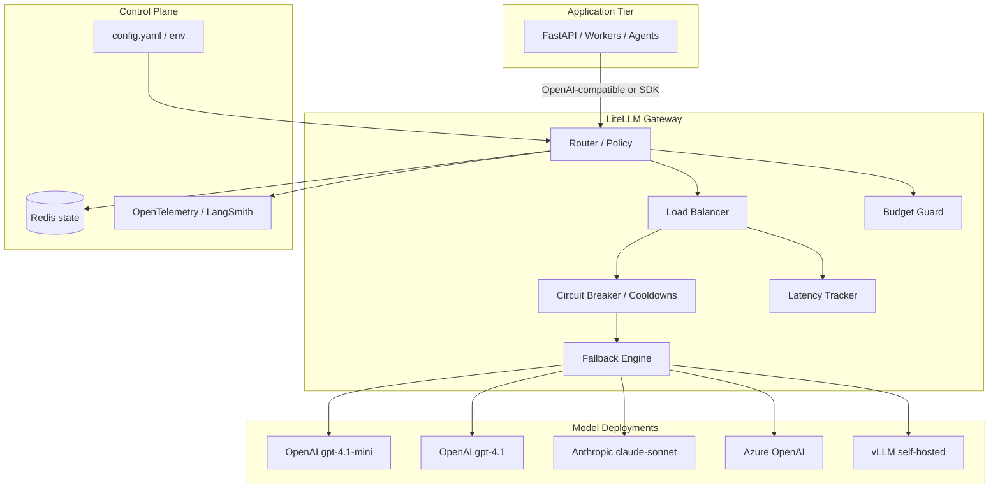
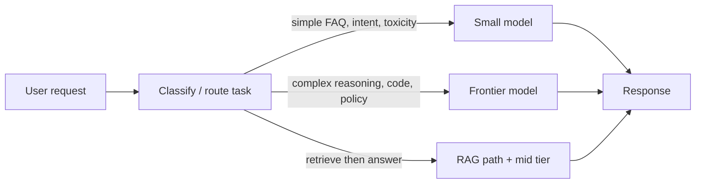
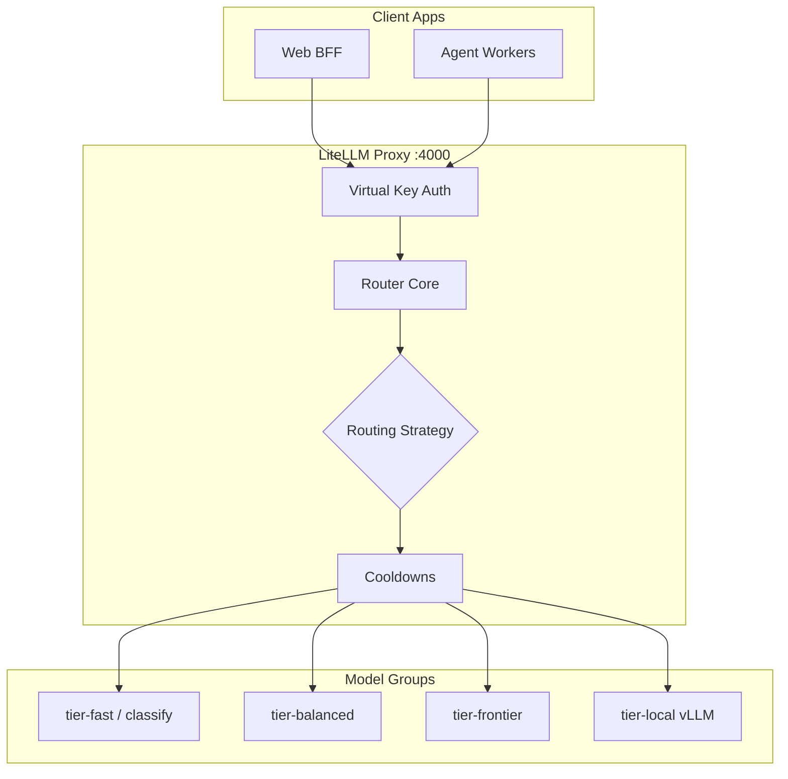
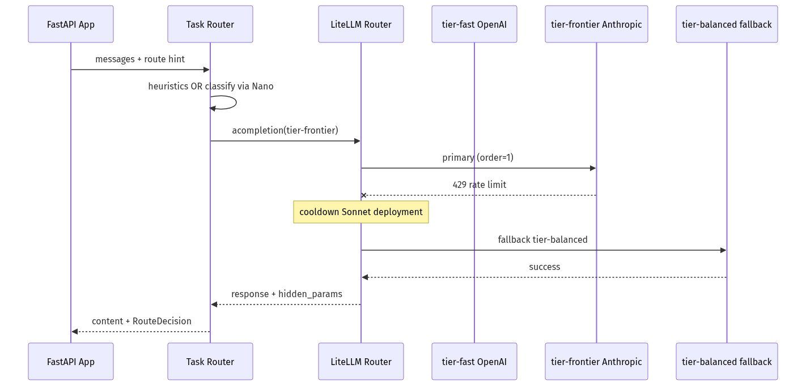
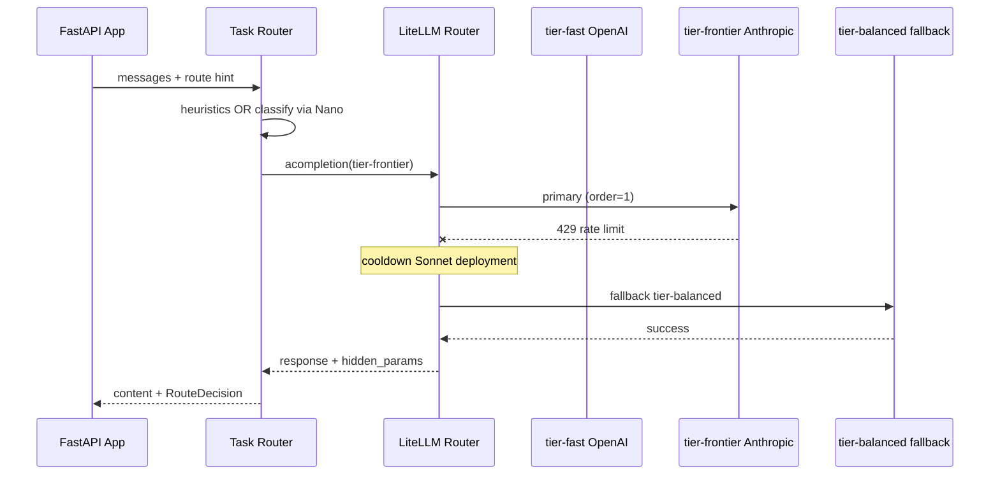

# 01-04 — Model Routing with LiteLLM

| Meta | Value |
|------|-------|
| **Estimated Time** | 6–8 hours (read 2.5h · lab 3h · proxy deploy 2h) |
| **Difficulty** | Intermediate (SDK routing) · Advanced (proxy mesh + budgets) |
| **Prerequisites** | [01-03 Inference Serving](01-03-Inference-Serving-vLLM.md) · basic FastAPI · env-based secrets |
| **Module** | 01 — LLM Engineering |
| **Related** | [01-03](01-03-Inference-Serving-vLLM.md) · [01-05](01-05-Provider-SDKs-OpenAI-Claude-Gemini.md) · [10-04 Cost & Latency](../10-Production-Infrastructure/10-04-Cost-Latency-Optimization.md) · [08-02 Observability](../08-Evaluation-LLMOps/08-02-Observability-LangSmith-OTel.md) · [Architecture Index](../../Architecture Index.md) |

---

## Learning Objectives

By the end of this chapter you will be able to:

1. Route requests across **multiple providers and deployments** with a single OpenAI-compatible interface.
2. Configure **fallback chains**, **load balancing**, and **priority ordering** for high availability.
3. Enforce **budget limits** at provider, key, and model-group levels.
4. Deploy the **LiteLLM Proxy** as a centralized model gateway with Redis-backed state.
5. Implement **latency-based** and **task-based routing** (cheap classify → frontier reason).
6. Apply **circuit breakers** (cooldowns, allowed fails, timeouts) to stop cascading outages.
7. Instrument routing decisions for production observability and cost attribution.

---

## Why This Topic Matters

Calling one model from one provider works in a demo. Production systems face:

- **429 rate limits** and regional outages on a single deployment.
- **Cost explosions** when every request hits a frontier model.
- **Latency SLOs** that require picking the fastest healthy deployment.
- **Compliance** that mandates certain workloads stay on Azure while others use Anthropic.
- **Model churn** — providers rename, deprecate, and price-change models monthly.

Without a routing layer, every application team re-implements retries, fallbacks, and spend caps differently. That is how you get silent quality regressions, duplicate API keys in repos, and on-call pages at 2 a.m. because one pod still points at a retired endpoint.

**LiteLLM** is the de facto **model gateway SDK + proxy** for Python teams: one `completion()` surface, 100+ providers, router semantics, and an optional OpenAI-compatible HTTP proxy. Pair it with self-hosted inference from [01-03](01-03-Inference-Serving-vLLM.md) and provider-native features from [01-05](01-05-Provider-SDKs-OpenAI-Claude-Gemini.md).

---

## Business Impact

| Business outcome | How routing changes decisions |
|------------------|-------------------------------|
| **Higher availability** | Automatic failover across deployments; users never see provider blips |
| **Lower COGS** | Task-based routing sends 70–90% of traffic to small models |
| **Predictable spend** | Provider/key budgets with fallbacks to cheaper tiers |
| **Faster p95 latency** | Latency-based routing picks the fastest warm deployment |
| **Faster vendor negotiation** | Swap providers in config, not in 40 microservices |
| **Audit-ready attribution** | Central gateway logs model, provider, cost, and route reason |

---

## Architecture Overview

Production model routing sits between your **application** and **model providers** (cloud APIs + self-hosted vLLM/Ollama from [01-03](01-03-Inference-Serving-vLLM.md)):



**Mental model:** LiteLLM Router is a **smart load balancer for LLMs**. The Proxy is that router exposed as **HTTP**. Your app should not embed provider-specific retry logic — it should emit **intent** (`task=classify`, `tier=fast`) and let the gateway pick the deployment.

---

## Core Concepts

### 1) Multi-Provider Routing

#### Definition

**Multi-provider routing** sends the same logical model name (e.g. `bank-support`) to different physical backends: OpenAI, Anthropic, Azure, Vertex, or a vLLM endpoint you operate.

#### Intuition

Think DNS for models: callers use stable names; ops changes the backing records.

#### LiteLLM model strings

| Pattern | Example | Use when |
|---------|---------|----------|
| OpenAI | `openai/gpt-4.1-mini` | Direct OpenAI API |
| Anthropic | `anthropic/claude-sonnet-4-20250514` | Claude via Messages API |
| Azure | `azure/my-gpt4-deployment` | Enterprise contract + data residency |
| OpenAI-compatible | `openai/gpt-4` + `api_base=http://vllm:8000/v1` | Self-hosted from [01-03](01-03-Inference-Serving-vLLM.md) |

Reference: [LiteLLM Docs](https://docs.litellm.ai/docs/) · [GitHub](https://github.com/BerriAI/litellm)

#### When to use

- You need **vendor diversification** (no single-provider lock-in).
- Different tenants/regions require different backends.
- You mix **cloud frontier** with **self-hosted** for cost or privacy.

#### When NOT to use

- Single model, single deployment, low traffic — direct SDK from [01-05](01-05-Provider-SDKs-OpenAI-Claude-Gemini.md) is fine until you hit the second provider.

#### Interview discussion

> "We expose one internal model alias per workload. Provider swaps are config changes reviewed in infra, not scattered PRs across app repos."

---

### 2) Fallbacks (Provider Failover)

#### Definition

A **fallback chain** defines the next model group to try when the primary fails after retries — connection errors, 429, 5xx, timeouts.

#### Mental model

```
primary → same-group retry → fallback model group → budget fallback → error
```

#### LiteLLM mechanisms

| Mechanism | Scope | Example |
|-----------|-------|---------|
| `order` in `litellm_params` | Priority within same `model_name` | Azure primary `order=1`, OpenAI `order=2` |
| `fallbacks` in router settings | Cross model-group failover | `gpt-4` → `claude-sonnet` → `gpt-4.1-mini` |
| `num_retries` + `timeout` | Per-hop resilience | 2 retries, 30s timeout |
| `enable_pre_call_checks` | Context window guard | Fail fast before burning tokens |

#### When to use

- Any customer-facing path with an SLO.
- Batch jobs where partial degradation beats total failure.

#### When NOT to use

- Fallback to a **much weaker** model on safety-critical classification without re-validation.
- Chains so deep that p95 latency doubles silently.

Reference: [Router — Load Balancing](https://docs.litellm.ai/docs/routing)

---

### 3) Load Balancing

#### Definition

When multiple **deployments share the same `model_name`**, LiteLLM distributes traffic among healthy instances.

#### Strategies

| Strategy | Behavior | Best for |
|----------|----------|----------|
| `simple-shuffle` (default) | Random among eligible deployments | General production |
| `least-busy` | Fewest in-flight requests | High concurrency |
| `latency-based-routing` | Lowest recent latency | Interactive UX |
| `usage-based-routing` | Lowest RPM/TPM utilization | Rate-limit fairness (perf cost) |
| `cost-based-routing` | Cheapest deployment | Batch / offline |

#### Redis for multi-instance

Pass `redis_host`, `redis_port`, `redis_password` so **multiple proxy pods** share RPM/TPM counters and cooldown state.

Reference: [Proxy — Load Balancing](https://docs.litellm.ai/docs/proxy/load_balancing)

#### Interview discussion

> "We default to simple-shuffle until metrics prove latency-based wins on p95 — latency routing needs enough traffic to keep estimates warm."

---

### 4) Budget Limits

#### Definition

**Budget routing** skips providers or models that exceeded a spend cap for a time window, optionally falling back to cheaper tiers.

#### Layers

| Layer | Config | Effect |
|-------|--------|--------|
| Provider budget | `provider_budget_config` in proxy YAML | Skip OpenAI when daily cap hit |
| Key model budget | `model_max_budget` on virtual keys | Per-team caps |
| Budget fallbacks | `budget_fallbacks` on keys | Roll from `gpt-4.1` → `gpt-4.1-mini` → `gpt-4.1-nano` |

Reference: [Budget Routing](https://docs.litellm.ai/docs/proxy/provider_budget_routing) · [Budget Fallbacks](https://docs.litellm.ai/docs/proxy/budget_fallbacks)

#### When to use

- Shared platform with many internal consumers.
- FinOps needs hard stops, not monthly surprises.

#### When NOT to use

- Budget caps without **observability** — teams will not know why requests suddenly route to weaker models. See [08-02 Observability](../08-Evaluation-LLMOps/08-02-Observability-LangSmith-OTel.md).

#### Tie-in to [10-04](../10-Production-Infrastructure/10-04-Cost-Latency-Optimization.md)

Budget limits are the **enforcement** layer; [10-04](../10-Production-Infrastructure/10-04-Cost-Latency-Optimization.md) covers **optimization** (caching, prompt compression, batching). Use both.

---

### 5) LiteLLM Proxy Pattern

#### Definition

The **LiteLLM Proxy** runs as a standalone service exposing **OpenAI-compatible** endpoints (`/v1/chat/completions`, `/v1/embeddings`, etc.). Apps point `base_url` at the proxy instead of OpenAI.

#### Why teams adopt it

| Benefit | Detail |
|---------|--------|
| Central secrets | API keys live in proxy env, not 50 repos |
| Uniform auth | Virtual keys, teams, rate limits |
| Admin UI | Model list, spend dashboards |
| Drop-in SDK swap | OpenAI client + custom `base_url` |

#### Deployment sketch

```bash
pip install 'litellm[proxy]'
litellm --config /etc/litellm/config.yaml --port 4000
```

Apps call `http://litellm-proxy:4000/v1` with a **proxy master key** or **virtual key**.

Reference: [LiteLLM Proxy](https://docs.litellm.ai/docs/simple_proxy)

#### When to use

- Platform team owns models; product teams consume HTTP.
- Polyglot stack (Java, TS, Python) needs one gateway.

#### When NOT to use

- Ultra-low-latency embedded inference on-device — add edge routing, not another hop, unless you measure net win.

---

### 6) Latency-Based Routing

#### Definition

The router tracks **recent response times per deployment** and prefers the fastest healthy backend.

#### Requirements

- Enough request volume per deployment to keep latency estimates stable.
- **Cooldowns** so a fast but failing node is removed.
- Trace **which deployment served** each request for debugging.

#### Pattern

```yaml
router_settings:
  routing_strategy: latency-based-routing
  routing_strategy_args:
    ttl: 60  # seconds to consider latency samples
```

Combine with `order` for **region preference**: try `order=1` US deployments with latency routing inside the group; fail over to `order=2` EU.

#### Interview discussion

> "Latency routing optimizes p95 for warm traffic. Cold start on a new deployment requires ramp-up or shadow traffic."

---

### 7) Task-Based Routing (Cheap Classify → Frontier Reason)

#### Definition

**Task-based routing** selects model tier by **intent**, not by user-facing model name. Most production systems spend most tokens on the wrong tier unless this is explicit.

#### Canonical pipeline



#### Task taxonomy (example)

| Task | Model tier | Rationale |
|------|------------|-----------|
| Intent classification | `gpt-4.1-nano` / Haiku | Structured JSON, high volume |
| Summarize < 2k tokens | `gpt-4.1-mini` | Quality/cost sweet spot |
| Multi-step reasoning | `gpt-4.1` / Sonnet | Tool loops, nuance |
| Regulated legal review | Azure deployment + HITL | Data residency |

#### Implementation options

1. **Application router** — FastAPI decides `model=` before calling LiteLLM (full control, more code).
2. **Proxy aliases** — `model=support-classify` vs `model=support-reason` in config (ops-owned).
3. **Two-phase agent** — Classifier node in LangGraph picks specialist (see Module 03).

#### Production rule

Never let the **frontier model** run if a **deterministic rule** or **classifier** already knows the path. This is the highest ROI cost lever before [10-04](../10-Production-Infrastructure/10-04-Cost-Latency-Optimization.md) micro-optimizations.

---

### 8) Circuit Breakers (Cooldowns & Allowed Fails)

#### Definition

LiteLLM implements **circuit breaker semantics** via **cooldowns**: after `allowed_fails` failures (or 429), a deployment is temporarily removed from the pool.

#### Key parameters

| Parameter | Purpose |
|-----------|---------|
| `allowed_fails` | Failures before cooldown |
| `cooldown_time` | Seconds deployment stays out of rotation |
| `disable_cooldowns` | Emergency override (incident debugging only) |
| `max_fallbacks` | Cap fallback chain depth (default 5) |

#### Mental model

Same as microservices circuit breakers: **fail fast locally** so one bad endpoint does not stall every request.

#### 429 handling

Rate-limit responses often **immediately cooldown** the hot deployment and shift to siblings or the next `order` — critical for burst traffic.

Reference: [Router reliability](https://docs.litellm.ai/docs/routing)

#### Observability tie-in

Export cooldown events to [08-02](../08-Evaluation-LLMOps/08-02-Observability-LangSmith-OTel.md): `deployment_id`, `cooldown_reason`, `fallback_model`.

---

## Implementation

This section gives a **production-shaped FastAPI service** using LiteLLM Router in-process, plus a **Proxy config** for platform teams.

### Project layout

```text
model-router/
├── app/
│   ├── __init__.py
│   ├── main.py              # FastAPI routes
│   ├── router_factory.py    # LiteLLM Router singleton
│   ├── task_router.py       # Classify → tier selection
│   ├── schemas.py           # Pydantic contracts
│   └── telemetry.py         # OpenTelemetry hooks
├── config/
│   └── litellm_config.yaml  # Proxy deployment (optional)
├── tests/
│   └── test_task_router.py
├── requirements.txt
└── README.md
```

### requirements.txt

```text
fastapi>=0.115.0
uvicorn[standard]>=0.32.0
litellm>=1.55.0
pydantic>=2.9.0
pydantic-settings>=2.6.0
httpx>=0.27.0
opentelemetry-api>=1.28.0
opentelemetry-sdk>=1.28.0
opentelemetry-instrumentation-fastapi>=0.49b0
redis>=5.2.0
pytest>=8.3.0
pytest-asyncio>=0.24.0
```

---

### schemas.py — contracts

```python
"""Request/response schemas for the model router API."""

from __future__ import annotations

from enum import Enum
from typing import Any

from pydantic import BaseModel, Field


class TaskType(str, Enum):
    CLASSIFY = "classify"
    SUMMARIZE = "summarize"
    REASON = "reason"
    CODE = "code"


class ChatMessage(BaseModel):
    role: str
    content: str


class RouteHint(BaseModel):
    """Optional override; normally inferred by task_router."""

    task: TaskType | None = None
    force_model: str | None = None
    max_cost_usd: float | None = Field(default=None, ge=0)


class ChatRequest(BaseModel):
    messages: list[ChatMessage]
    route: RouteHint = Field(default_factory=RouteHint)
    user_id: str = Field(min_length=1)
    trace_id: str | None = None


class RouteDecision(BaseModel):
    task: TaskType
    model: str
    deployment_id: str | None = None
    fallback_used: bool = False
    latency_ms: float | None = None
    cost_usd: float | None = None
    provider: str | None = None


class ChatResponse(BaseModel):
    content: str
    route: RouteDecision
    raw: dict[str, Any] | None = None
```

---

### router_factory.py — LiteLLM Router with fallbacks & circuit breakers

```python
"""Singleton LiteLLM Router: multi-provider, fallbacks, cooldowns."""

from __future__ import annotations

import os
from functools import lru_cache
from typing import Any

from litellm import Router


def _env(key: str, default: str = "") -> str:
    return os.getenv(key, default)


@lru_cache(maxsize=1)
def get_router() -> Router:
    """Build Router once per process. Reload requires process restart."""
    model_list: list[dict[str, Any]] = [
        # --- Cheap tier: classification / high volume ---
        {
            "model_name": "tier-fast",
            "litellm_params": {
                "model": "openai/gpt-4.1-nano",
                "api_key": _env("OPENAI_API_KEY"),
                "timeout": 15,
                "max_retries": 1,
            },
            "model_info": {"tier": "fast", "provider": "openai"},
        },
        {
            "model_name": "tier-fast",
            "litellm_params": {
                "model": "anthropic/claude-3-5-haiku-20241022",
                "api_key": _env("ANTHROPIC_API_KEY"),
                "timeout": 15,
                "max_retries": 1,
                "order": 2,  # fallback within group
            },
            "model_info": {"tier": "fast", "provider": "anthropic"},
        },
        # --- Mid tier: summarization ---
        {
            "model_name": "tier-balanced",
            "litellm_params": {
                "model": "openai/gpt-4.1-mini",
                "api_key": _env("OPENAI_API_KEY"),
                "timeout": 30,
            },
            "model_info": {"tier": "balanced", "provider": "openai"},
        },
        # --- Frontier tier: reasoning / code ---
        {
            "model_name": "tier-frontier",
            "litellm_params": {
                "model": "openai/gpt-4.1",
                "api_key": _env("OPENAI_API_KEY"),
                "timeout": 60,
                "order": 1,
            },
            "model_info": {"tier": "frontier", "provider": "openai"},
        },
        {
            "model_name": "tier-frontier",
            "litellm_params": {
                "model": "anthropic/claude-sonnet-4-20250514",
                "api_key": _env("ANTHROPIC_API_KEY"),
                "timeout": 60,
                "order": 2,
            },
            "model_info": {"tier": "frontier", "provider": "anthropic"},
        },
        # --- Self-hosted (from 01-03) ---
        {
            "model_name": "tier-local",
            "litellm_params": {
                "model": "openai/meta-llama/Llama-3.1-8B-Instruct",
                "api_base": _env("VLLM_BASE_URL", "http://localhost:8000/v1"),
                "api_key": _env("VLLM_API_KEY", "dummy"),
                "timeout": 45,
            },
            "model_info": {"tier": "local", "provider": "vllm"},
        },
    ]

    redis_host = _env("REDIS_HOST")
    redis_kwargs: dict[str, Any] = {}
    if redis_host:
        redis_kwargs = {
            "redis_host": redis_host,
            "redis_port": int(_env("REDIS_PORT", "6379")),
            "redis_password": _env("REDIS_PASSWORD") or None,
        }

    return Router(
        model_list=model_list,
        routing_strategy=_env("LITELLM_ROUTING_STRATEGY", "simple-shuffle"),
        num_retries=int(_env("LITELLM_NUM_RETRIES", "2")),
        timeout=float(_env("LITELLM_TIMEOUT", "30")),
        fallbacks=[
            {"tier-frontier": ["tier-balanced"]},
            {"tier-balanced": ["tier-fast"]},
            {"tier-fast": ["tier-local"]},
        ],
        allowed_fails=int(_env("LITELLM_ALLOWED_FAILS", "3")),
        cooldown_time=int(_env("LITELLM_COOLDOWN_TIME", "60")),
        max_fallbacks=int(_env("LITELLM_MAX_FALLBACKS", "5")),
        set_verbose=_env("LITELLM_VERBOSE", "false").lower() == "true",
        **redis_kwargs,
    )


TASK_TO_MODEL_GROUP: dict[str, str] = {
    "classify": "tier-fast",
    "summarize": "tier-balanced",
    "reason": "tier-frontier",
    "code": "tier-frontier",
}


async def acompletion_for_task(
    task: str,
    messages: list[dict[str, str]],
    *,
    force_model_group: str | None = None,
    metadata: dict[str, Any] | None = None,
) -> Any:
    router = get_router()
    model_group = force_model_group or TASK_TO_MODEL_GROUP[task]
    return await router.acompletion(
        model=model_group,
        messages=messages,
        metadata=metadata or {},
    )
```

---

### task_router.py — cheap classifier → frontier path

```python
"""Task-based routing: classify with small model, execute with appropriate tier."""

from __future__ import annotations

import json
import re
from typing import Any

from app.router_factory import TASK_TO_MODEL_GROUP, acompletion_for_task
from app.schemas import RouteHint, TaskType

CLASSIFIER_SYSTEM = """You are a routing classifier. Output ONLY valid JSON:
{"task":"classify|summarize|reason|code","confidence":0.0-1.0}
Rules:
- classify: intent detection, yes/no, toxicity, routing labels
- summarize: condense existing text
- reason: multi-step analysis, planning, ambiguous policy
- code: programming, debugging, SQL generation
"""


async def infer_task(messages: list[dict[str, str]], hint: RouteHint) -> TaskType:
    if hint.task is not None:
        return hint.task

    # Cheap heuristic before spending a model call
    last_user = next((m["content"] for m in reversed(messages) if m["role"] == "user"), "")
    if len(last_user) < 120 and re.search(r"\b(classify|intent|label|route)\b", last_user, re.I):
        return TaskType.CLASSIFY
    if re.search(r"\b(def |import |SELECT |```)", last_user):
        return TaskType.CODE

    classify_messages = [
        {"role": "system", "content": CLASSIFIER_SYSTEM},
        {
            "role": "user",
            "content": f"Conversation to classify:\n{json.dumps(messages[-3:], ensure_ascii=False)}",
        },
    ]
    resp = await acompletion_for_task(
        "classify",
        classify_messages,
        metadata={"routing_stage": "classifier"},
    )
    text = resp.choices[0].message.content or "{}"
    try:
        payload = json.loads(text)
        return TaskType(payload.get("task", "reason"))
    except (json.JSONDecodeError, ValueError):
        return TaskType.REASON


def model_group_for_task(task: TaskType, hint: RouteHint) -> str:
    if hint.force_model:
        return hint.force_model
    if hint.max_cost_usd is not None and hint.max_cost_usd < 0.002:
        return "tier-fast"
    return TASK_TO_MODEL_GROUP[task.value]


async def route_and_complete(
    messages: list[dict[str, str]],
    hint: RouteHint,
    *,
    user_id: str,
    trace_id: str | None,
) -> tuple[Any, TaskType, str]:
    task = await infer_task(messages, hint)
    model_group = model_group_for_task(task, hint)
    metadata = {
        "user_id": user_id,
        "trace_id": trace_id,
        "inferred_task": task.value,
        "model_group": model_group,
    }
    response = await acompletion_for_task(
        task.value,
        messages,
        force_model_group=model_group,
        metadata=metadata,
    )
    return response, task, model_group
```

---

### telemetry.py — hooks for [08-02](../08-Evaluation-LLMOps/08-02-Observability-LangSmith-OTel.md)

```python
"""Minimal OpenTelemetry setup; extend with LangSmith in 08-02."""

from __future__ import annotations

from opentelemetry import trace
from opentelemetry.sdk.resources import Resource
from opentelemetry.sdk.trace import TracerProvider
from opentelemetry.sdk.trace.export import BatchSpanProcessor, ConsoleSpanExporter

_tracer: trace.Tracer | None = None


def init_tracer(service_name: str = "model-router") -> trace.Tracer:
    global _tracer
    if _tracer is not None:
        return _tracer
    provider = TracerProvider(resource=Resource.create({"service.name": service_name}))
    provider.add_span_processor(BatchSpanProcessor(ConsoleSpanExporter()))
    trace.set_tracer_provider(provider)
    _tracer = trace.get_tracer(__name__)
    return _tracer


def get_tracer() -> trace.Tracer:
    return _tracer or init_tracer()
```

---

### main.py — FastAPI production entrypoint

```python
"""Production FastAPI service: task-based routing via LiteLLM Router.

Run:
  export OPENAI_API_KEY=...
  export ANTHROPIC_API_KEY=...
  uvicorn app.main:app --host 0.0.0.0 --port 8080

Optional proxy mode: point OpenAI SDK at LiteLLM proxy instead of this app.
"""

from __future__ import annotations

import time
from typing import Any

from fastapi import FastAPI, HTTPException, Request
from fastapi.middleware.cors import CORSMiddleware

from app.schemas import ChatRequest, ChatResponse, RouteDecision
from app.task_router import route_and_complete
from app.telemetry import get_tracer, init_tracer

app = FastAPI(title="Model Router API", version="1.0.0")
app.add_middleware(
    CORSMiddleware,
    allow_origins=["*"],
    allow_methods=["POST", "GET"],
    allow_headers=["*"],
)

init_tracer()


@app.get("/health")
async def health() -> dict[str, str]:
    return {"status": "ok"}


@app.post("/v1/chat/route", response_model=ChatResponse)
async def chat_route(body: ChatRequest, request: Request) -> ChatResponse:
    tracer = get_tracer()
    trace_id = body.trace_id or request.headers.get("x-trace-id")

    messages = [m.model_dump() for m in body.messages]
    start = time.perf_counter()

    with tracer.start_as_current_span("chat_route") as span:
        span.set_attribute("user_id", body.user_id)
        if trace_id:
            span.set_attribute("trace_id", trace_id)
        try:
            response, task, model_group = await route_and_complete(
                messages,
                body.route,
                user_id=body.user_id,
                trace_id=trace_id,
            )
        except Exception as exc:  # noqa: BLE001 — surface as 502 for gateway errors
            span.record_exception(exc)
            raise HTTPException(status_code=502, detail=f"model_routing_failed: {exc}") from exc

    latency_ms = (time.perf_counter() - start) * 1000
    choice = response.choices[0]
    content = choice.message.content or ""

    hidden: dict[str, Any] = getattr(response, "_hidden_params", {}) or {}
    model_used = hidden.get("model", model_group)
    response_cost = hidden.get("response_cost")
    deployment = hidden.get("deployment", None)

    route = RouteDecision(
        task=task,
        model=model_used,
        deployment_id=deployment,
        fallback_used=bool(hidden.get("fallbacks", [])),
        latency_ms=round(latency_ms, 2),
        cost_usd=response_cost,
        provider=hidden.get("custom_llm_provider"),
    )

    return ChatResponse(content=content, route=route, raw=None)


@app.post("/v1/chat/completions")
async def openai_compat(body: dict[str, Any], request: Request) -> dict[str, Any]:
    """OpenAI-shaped endpoint for drop-in clients."""
    try:
        chat_req = ChatRequest(
            messages=body["messages"],
            user_id=body.get("user", "anonymous"),
            trace_id=request.headers.get("x-trace-id"),
        )
    except KeyError as exc:
        raise HTTPException(status_code=422, detail="messages required") from exc

    result = await chat_route(chat_req, request)
    return {
        "id": f"chatcmpl-{int(time.time())}",
        "object": "chat.completion",
        "model": result.route.model,
        "choices": [
            {
                "index": 0,
                "message": {"role": "assistant", "content": result.content},
                "finish_reason": "stop",
            }
        ],
        "usage": {},
        "system_fingerprint": result.route.deployment_id,
        "route_metadata": result.route.model_dump(),
    }
```

---

### config/litellm_config.yaml — Proxy pattern (platform team)

```yaml
# LiteLLM Proxy — central gateway
# Start: litellm --config config/litellm_config.yaml --port 4000

model_list:
  - model_name: support-classify
    litellm_params:
      model: openai/gpt-4.1-nano
      api_key: os.environ/OPENAI_API_KEY
      timeout: 15
  - model_name: support-reason
    litellm_params:
      model: openai/gpt-4.1
      api_key: os.environ/OPENAI_API_KEY
      order: 1
  - model_name: support-reason
    litellm_params:
      model: anthropic/claude-sonnet-4-20250514
      api_key: os.environ/ANTHROPIC_API_KEY
      order: 2
  - model_name: support-local
    litellm_params:
      model: openai/meta-llama/Llama-3.1-8B-Instruct
      api_base: os.environ/VLLM_BASE_URL
      api_key: os.environ/VLLM_API_KEY

router_settings:
  routing_strategy: latency-based-routing
  num_retries: 2
  timeout: 30
  allowed_fails: 3
  cooldown_time: 90
  fallbacks:
    - support-reason: [support-classify]
  provider_budget_config:
    openai:
      budget_limit: 500.0
      time_period: 1d
    anthropic:
      budget_limit: 300.0
      time_period: 1d

  redis_host: os.environ/REDIS_HOST
  redis_port: os.environ/REDIS_PORT
  redis_password: os.environ/REDIS_PASSWORD

general_settings:
  master_key: os.environ/LITELLM_MASTER_KEY
  database_url: os.environ/DATABASE_URL  # optional: spend tracking UI

litellm_settings:
  success_callback: ["langfuse"]  # see 08-02
  failure_callback: ["langfuse"]
```

#### Calling the proxy from Python (OpenAI SDK)

```python
from openai import OpenAI

client = OpenAI(
    api_key="sk-litellm-virtual-key",
    base_url="http://localhost:4000/v1",
)

resp = client.chat.completions.create(
    model="support-reason",
    messages=[{"role": "user", "content": "Explain overdraft fees policy."}],
)
print(resp.choices[0].message.content)
```

Reference: [OpenAI API Docs](https://developers.openai.com/api/docs/) · [Anthropic API Overview](https://docs.anthropic.com/en/api/overview)

---

### tests/test_task_router.py

```python
import pytest

from app.schemas import RouteHint, TaskType
from app.task_router import model_group_for_task


@pytest.mark.parametrize(
    "task,expected",
    [
        (TaskType.CLASSIFY, "tier-fast"),
        (TaskType.SUMMARIZE, "tier-balanced"),
        (TaskType.REASON, "tier-frontier"),
        (TaskType.CODE, "tier-frontier"),
    ],
)
def test_model_group_mapping(task: TaskType, expected: str) -> None:
    assert model_group_for_task(task, RouteHint()) == expected


def test_budget_hint_forces_fast_tier() -> None:
    hint = RouteHint(max_cost_usd=0.001)
    assert model_group_for_task(TaskType.REASON, hint) == "tier-fast"
```

---

## Production Considerations

| Concern | Practice |
|---------|----------|
| **Config ownership** | Platform owns `model_list`; apps own task taxonomy |
| **Secret rotation** | Keys only in proxy env / secret manager |
| **Version pins** | Pin `litellm` in requirements; test upgrades in staging |
| **Sync vs async** | Use `router.acompletion()` in FastAPI; weighted failover is async-first |
| **Context limits** | Enable pre-call context checks for long RAG payloads |
| **Data residency** | Route PII workloads to Azure/`order=1` regional deployments |
| **Cold deployments** | Warm new backends with shadow traffic before latency routing |

---

## Security

| Threat | Control |
|--------|---------|
| API key sprawl | Proxy + virtual keys; never embed provider keys in apps |
| Key leakage in logs | Redact `Authorization` headers; use master key rotation |
| Prompt injection altering route | Classifier uses fixed system prompt; ignore user "use model X" unless admin flag |
| Cross-tenant bleed | Pass `user_id` / `team_id` in metadata; enforce at proxy auth layer |
| Unauthorized model access | Map virtual keys to allowed `model_name` lists |

Provider-specific auth patterns: [01-05 Provider SDKs](01-05-Provider-SDKs-OpenAI-Claude-Gemini.md).

---

## Performance

| Path | Target |
|------|--------|
| Classifier | p95 < 400ms, small max tokens |
| Balanced tier | p95 < 1.5s for 500-token out |
| Frontier + tools | p95 budget owned by product SLO |
| Proxy hop | Measure — typically 5–20ms overhead at platform scale |

**Latency-based routing** needs traffic. For low-QPS dev stacks, prefer `simple-shuffle`.

---

## Cost

| Lever | Effect |
|-------|--------|
| Task-based routing | Largest savings — classify on nano/haiku |
| Budget fallbacks | Automatic step-down when caps hit |
| Self-hosted tier-local | Near-zero marginal $; ops cost in [01-03](01-03-Inference-Serving-vLLM.md) |
| Fallback depth cap | Prevents runaway multi-model spend on retries |
| Central logging | Find teams bypassing router to call frontier directly |

Deep dive: [10-04 Cost & Latency Optimization](../10-Production-Infrastructure/10-04-Cost-Latency-Optimization.md).

---

## Scalability

| Component | Scale pattern |
|-----------|---------------|
| LiteLLM Proxy | Horizontal pods + Redis shared state |
| FastAPI router app | Stateless replicas; Router rebuilt per process |
| Redis | Required for multi-instance RPM/TPM and cooldown sync |
| Self-hosted vLLM | Scale GPU pool independently ([01-03](01-03-Inference-Serving-vLLM.md)) |

---

## Failure Modes

| Failure | Symptom | Mitigation |
|---------|---------|------------|
| All providers in cooldown | 502 bursts | Raise `allowed_fails` carefully; add healthy `order=2` |
| Budget exhausted | Silent quality drop | Alert on budget fallback rate; budget fallbacks + comms |
| Classifier wrong | Frontier over-use or bad answers | Log `inferred_task`; offline eval; heuristic guards |
| Stale latency stats | Traffic to bad node | Lower TTL; combine with cooldowns |
| Fallback to weaker model on safety task | Policy miss | Block fallback for regulated tasks; fail closed |
| Redis down | Split-brain rate limits | Run Redis HA; degrade to single-instance mode with alert |

---

## Observability

Minimum fields per request (export to [08-02](../08-Evaluation-LLMOps/08-02-Observability-LangSmith-OTel.md)):

```text
trace_id, user_id, team_id, inferred_task, model_group, model_deployment,
provider, fallback_used, fallback_chain, cooldown_triggered,
latency_ms, ttft_ms, tokens_in, tokens_out, cost_usd,
router_strategy, error_class
```

LiteLLM supports callbacks (`langfuse`, `otel`, custom). Wire **success** and **failure** callbacks in proxy config.

---

## Debugging

| Question | Where to look |
|----------|---------------|
| Why frontier for a FAQ? | Classifier output + `inferred_task` span |
| Why slow p95? | Per-deployment latency routing stats |
| Why Anthropic not OpenAI? | `order`, cooldown logs, budget skip events |
| Cost spike? | `response_cost` by `model_group` dashboard |
| 429 storm? | Cooldown timeline; RPM per deployment |

---

## Common Mistakes

1. **One model for everything** — destroys margin and latency.
2. **Fallback without quality gate** — cheaper model silently ships wrong answers.
3. **No Redis in multi-pod proxy** — double rate limits and broken cooldowns.
4. **Sync `router.completion` in async FastAPI** — blocks event loop; use `acompletion`.
5. **Routing logic copied into every service** — centralize in proxy or shared library.
6. **Ignoring self-hosted** — cloud-only routing misses cheapest tier for bulk workloads.

---

## Tradeoffs

| Choice | Upside | Downside |
|--------|--------|----------|
| In-process Router | Low latency, full app control | Config drift across services |
| LiteLLM Proxy | Central governance | Extra hop; platform team bottleneck |
| Latency-based routing | Best p95 when warm | Cold-start bias; more moving parts |
| Aggressive budget caps | Predictable spend | Surprising downgrades |
| Deep fallback chains | High availability | Cost + latency multiply |
| Classifier model call | Flexible tasks | +1 hop on every request — use heuristics first |

---

## Architecture Diagram



---

## Mermaid Diagram — Sequence (task-based route with fallback)





---

## Production Examples

| Pattern | Routing design |
|---------|----------------|
| Support platform | Classify → RAG + balanced → escalate frontier |
| Code assistant | Local vLLM for completion; frontier for architecture |
| Batch enrichment | Cost-based routing to cheapest deployment with time budget |
| Regulated bank | Azure `order=1` only for PII; fallbacks stay in-region |

---

## Real Companies Using It (Public Patterns)

| Org | Public pattern | Lesson |
|-----|----------------|--------|
| **Enterprises on LiteLLM** | OpenAI-compatible proxy over many providers | Central keys + uniform SDK |
| **OpenAI / Anthropic customers** | Multi-model products with tiered SKUs | Product tier ≈ model tier mapping |
| **Self-host adopters** | vLLM + cloud burst ([01-03](01-03-Inference-Serving-vLLM.md)) | Hybrid routing cuts cost |

> Pattern references only — verify against your vendor contracts and data policies.

---

## Hands-on Labs

### Lab A — Fallback under fire (45 min)

Simulate primary failure: revoke OpenAI key temporarily, confirm Anthropic or local tier serves `tier-frontier`.

### Lab B — Budget cap (45 min)

Set `provider_budget_config.openai.budget_limit` to a tiny value in proxy YAML. Observe skip/fallback behavior and logs.

### Lab C — Latency routing (60 min)

Run two identical mock deployments with artificial delay on one. Enable `latency-based-routing` and verify skew to faster node.

### Lab D — Classifier audit (45 min)

Log 50 sample requests with `inferred_task`. Manually label errors; compute classifier accuracy.

---

## Coding Assignments

1. Add **Redis-backed** rate limit per `user_id` in FastAPI middleware.
2. Emit **OpenTelemetry** attributes for every field in Observability section.
3. Implement **regulatory mode**: `route.regulated=true` disables cross-provider fallbacks.
4. Add **shadow traffic** hook: duplicate 1% of requests to candidate deployment without returning it.

---

## Mini Project

**Title:** Task Router API v1  
**Done when:** `/v1/chat/route` returns `RouteDecision`; tests pass; README documents tier mapping and env vars.

---

## Production Project

**Title:** LiteLLM Proxy Platform  
**Done when:** Helm/K8s deploy of proxy + Redis; virtual keys per team; Grafana dashboard for cost and fallback rate; runbook for cooldown incidents.

---

## Stretch Project

Build a **routing simulator**: replay production traces, compare strategies (`simple-shuffle` vs `latency-based-routing` vs task-based), report cost/latency/quality tradeoffs for [10-04](../10-Production-Infrastructure/10-04-Cost-Latency-Optimization.md).

---

## Interview Questions

### Senior Engineer

1. Why use LiteLLM instead of calling OpenAI SDK directly?
2. Explain fallback vs load balancing vs `order` priority.
3. How would you route classify vs reason tasks?

### Staff Engineer

1. Design a multi-region model gateway with budget limits and circuit breakers.
2. When does latency-based routing hurt more than help?
3. How do you prevent fallback from violating data residency?

### Principal Engineer

1. Platform API: virtual keys, model groups, and FinOps budgets — what belongs in gateway vs app?
2. Compare in-process Router vs sidecar proxy vs service mesh egress policy.
3. How do you eval routing quality, not just model quality?

### Engineering Manager

1. Staffing platform vs product teams for a LiteLLM rollout.
2. KPIs: fallback rate, $/successful task, budget downgrade rate.
3. Vendor outage comms playbook when router masks failures.

### Whiteboard

Draw task-based routing for a customer support agent with RAG, tools, and HITL.

### Follow-ups

- What if classifier and frontier disagree on task type?
- What if Redis fails during Black Friday traffic?
- How do you test routing config before prod?

---

## Revision Notes

- **Stable names, mutable deployments** — apps call `tier-*` or product aliases, not raw provider strings.
- **Classify cheap, reason expensive** — default task-based economics.
- **Fallbacks are not free** — cap depth; measure quality on fallback paths.
- **Circuit breakers** = cooldowns + allowed fails; watch 429 behavior.
- **Proxy for governance**, in-process Router for latency-sensitive control.
- **Redis** for any multi-instance production proxy.
- Instrument everything → [08-02](../08-Evaluation-LLMOps/08-02-Observability-LangSmith-OTel.md).

---

## Summary

Model routing is how production teams turn fragile single-provider demos into **reliable, cost-bounded model infrastructure**. LiteLLM provides the Router and Proxy primitives; your architecture still must define **task taxonomy**, **fallback policy**, **budget enforcement**, and **observability**. Master this chapter and you can swap providers, survive outages, and cut spend without rewriting application logic — the bridge between [01-03 self-hosted inference](01-03-Inference-Serving-vLLM.md), [01-05 provider SDKs](01-05-Provider-SDKs-OpenAI-Claude-Gemini.md), and platform operations in [10-04](../10-Production-Infrastructure/10-04-Cost-Latency-Optimization.md).

---

## Further Reading

| Title | URL | Difficulty | Reading Time | Why Read | Important Sections |
|-------|-----|------------|--------------|----------|--------------------|
| LiteLLM Documentation | https://docs.litellm.ai/docs/ | Intro | 45 min | Canonical API and proxy reference | Router; Proxy; Provider list |
| LiteLLM GitHub | https://github.com/BerriAI/litellm | Intro | 20 min | Source, issues, release notes | Router examples; config samples |
| Router — Load Balancing | https://docs.litellm.ai/docs/routing | Intermediate | 40 min | Fallbacks, cooldowns, strategies | Routing strategies; fallbacks |
| Proxy — Load Balancing | https://docs.litellm.ai/docs/proxy/load_balancing | Intermediate | 30 min | Production proxy setup | Redis; router_settings |
| Budget Routing | https://docs.litellm.ai/docs/proxy/provider_budget_routing | Intermediate | 25 min | Provider spend caps | provider_budget_config |
| Budget Fallbacks | https://docs.litellm.ai/docs/proxy/budget_fallbacks | Intermediate | 20 min | Step-down on key budgets | budget_fallbacks chains |
| OpenAI API Documentation | https://developers.openai.com/api/docs/ | Intro | 60 min | Baseline OpenAI-compatible contract | Chat Completions; models |
| Anthropic API Overview | https://docs.anthropic.com/en/api/overview | Intro | 45 min | Claude routing strings | Messages API; models |
| 01-03 Inference Serving | [01-03-Inference-Serving-vLLM.md](01-03-Inference-Serving-vLLM.md) | Advanced | 3h | Self-hosted `api_base` targets | vLLM OpenAI server |
| 10-04 Cost & Latency | [10-04-Cost-Latency-Optimization.md](../10-Production-Infrastructure/10-04-Cost-Latency-Optimization.md) | Advanced | 2h | Optimization beyond routing | Caching; batching |
| 08-02 Observability | [08-02-Observability-LangSmith-OTel.md](../08-Evaluation-LLMOps/08-02-Observability-LangSmith-OTel.md) | Intermediate | 2h | Trace routing decisions | OTel; LangSmith |

---

## Resume Bullet (after lab)

- Built a **production FastAPI model router** with LiteLLM multi-provider fallbacks, task-based tier selection (classify → frontier), circuit-breaker cooldowns, and OpenTelemetry instrumentation for cost/latency attribution.
