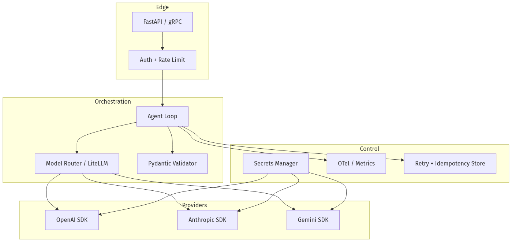
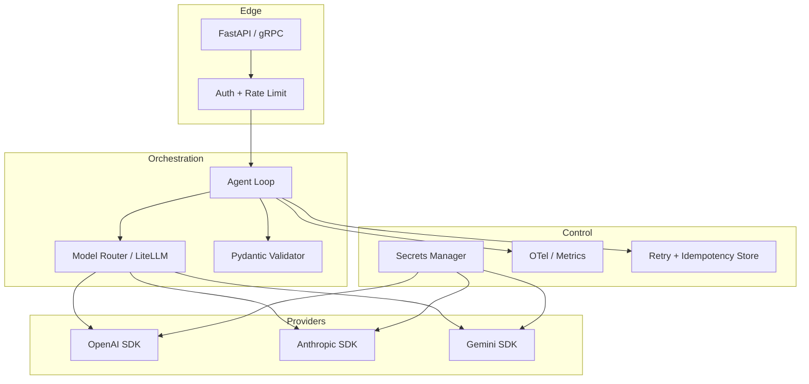
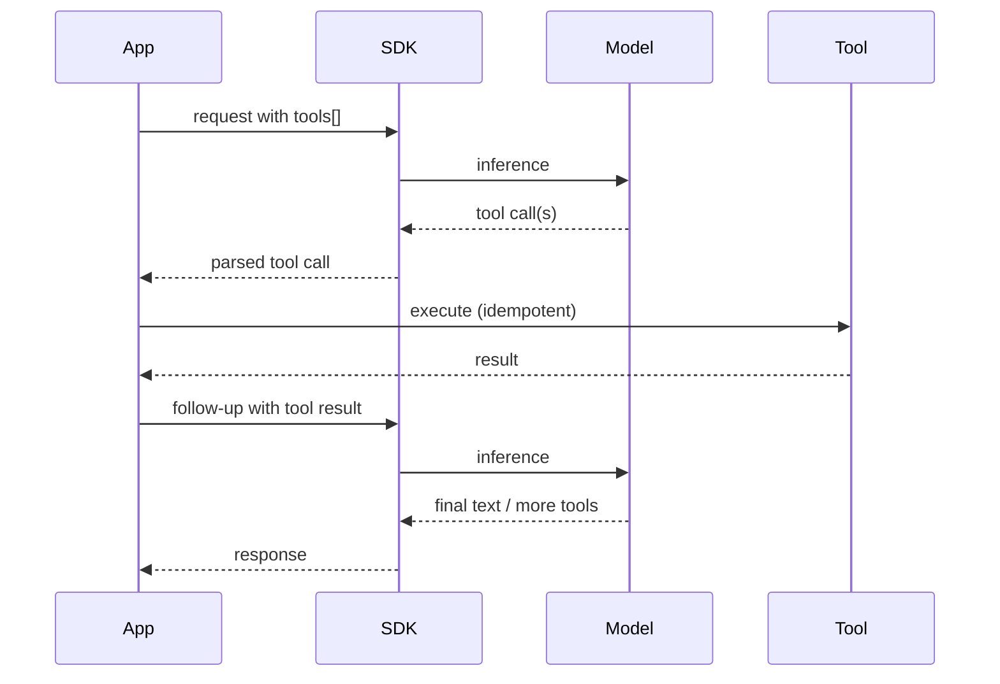
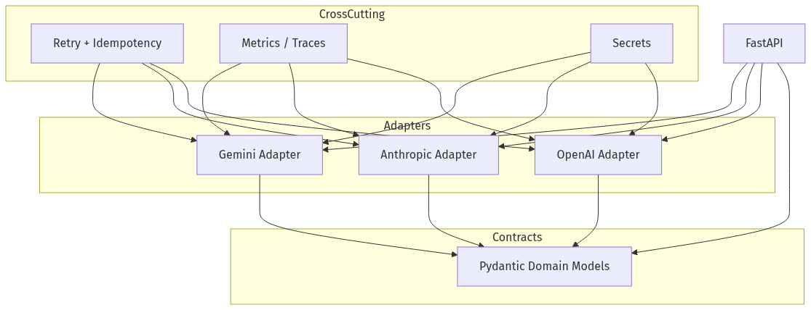
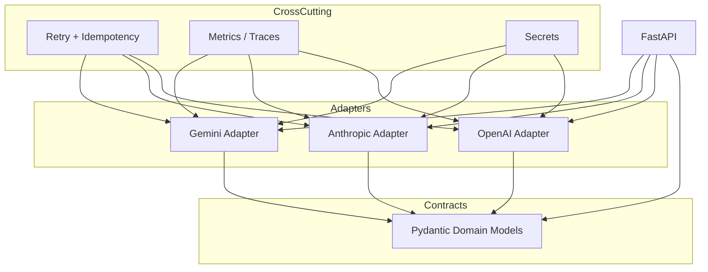
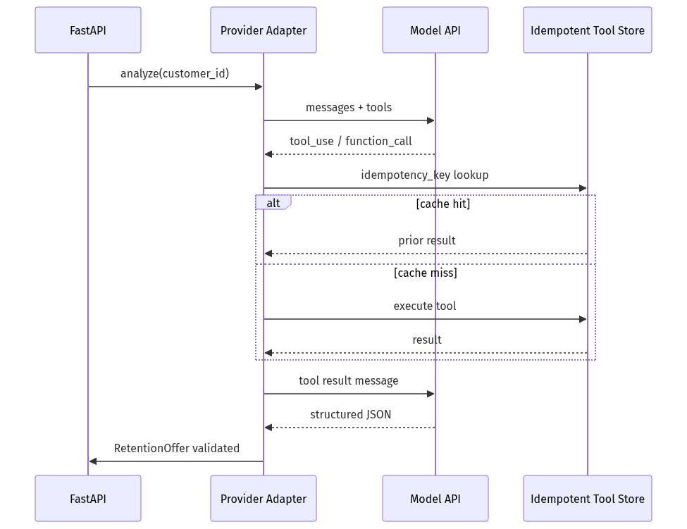
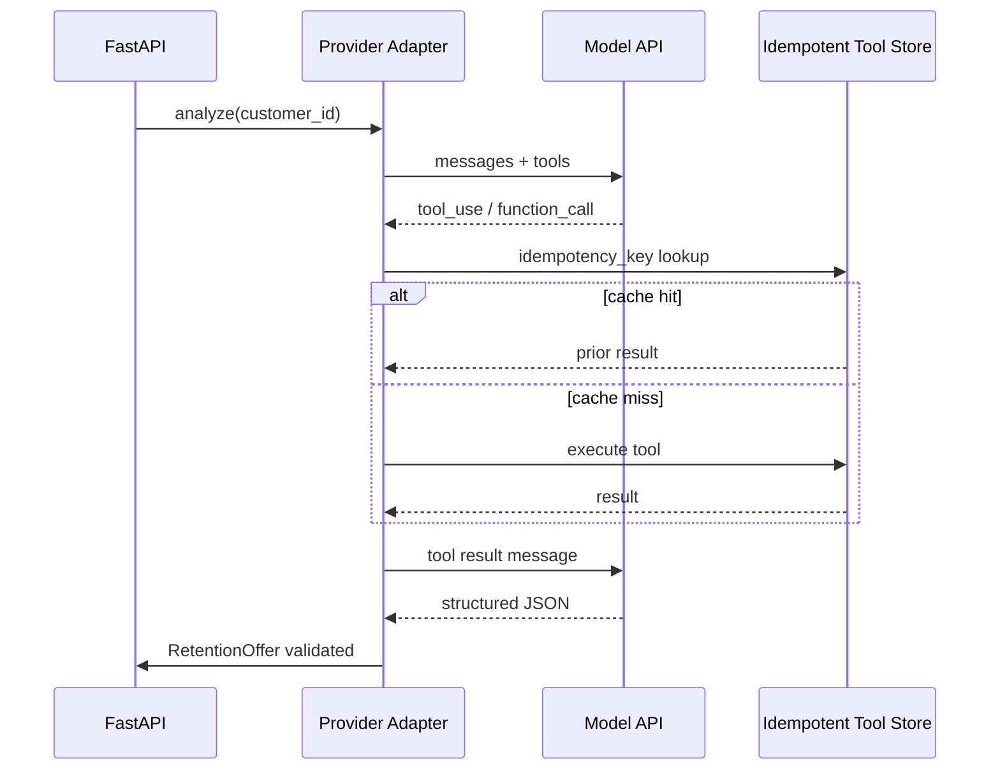

# 01-05 — Provider SDKs: OpenAI, Claude, Gemini & DeepSeek

| Meta | Value |
|------|-------|
| **Estimated Time** | 7–9 hours (read 3.5h · lab 3.5h · comparison matrix 2h) |
| **Difficulty** | Intermediate (SDK usage) · Advanced (production hardening) |
| **Prerequisites** | [01-04 Model Routing with LiteLLM](01-04-Model-Routing-LiteLLM.md) · Python 3.11+ · Pydantic v2 · basic async/HTTP |
| **Module** | 01 — LLM Engineering |
| **Related** | [01-04](01-04-Model-Routing-LiteLLM.md) · [02-02](../02-Prompt-Engineering/02-02-Structured-Outputs-Tool-Calling.md) · [03-02](../03-Agentic-Fundamentals/03-02-Tools-Memory-Control-Flow.md) · [Architecture Index](../../Architecture Index.md) · [08-02 Observability](../08-Evaluation-LLMOps/08-02-Observability-LangSmith-OTel.md) · [Master Study Roadmap](../../Master%20Study%20Roadmap.md) |

---

## Learning Objectives

By the end of this chapter you will be able to:

1. Choose between **OpenAI Responses API**, **Chat Completions**, **Anthropic Messages API**, **Google Gemini SDK**, and **DeepSeek** for a given workload.
2. Implement **structured outputs** with Pydantic validation across providers (including OpenAI-compatible DeepSeek).
3. Implement **tool calling** loops with idempotent handlers and safe retries.
4. Stream responses with correct **TTFT / token accounting** and client-side parsing.
5. Handle **rate limits**, **429 backoff**, and **idempotency keys** in production Python services.
6. Manage **API secrets** without leaking keys into logs, traces, or git.

---

## Why This Topic Matters

Every agentic system eventually talks to a model provider. Frameworks (LangChain, LangGraph, LiteLLM) abstract the wire protocol—but **Staff/Principal engineers must know what happens underneath** when:

- structured JSON fails validation at 2 a.m.,
- a tool call retries and double-charges a customer,
- streaming stalls because you blocked the event loop,
- Anthropic returns `stop_reason: tool_use` but your handler expects text,
- Gemini's schema rejects your Pydantic model,
- or compliance asks which API key touched PII.

LiteLLM ([01-04](01-04-Model-Routing-LiteLLM.md)) gives you a unified *interface*; this chapter gives you **provider-native fluency** so you can debug, optimize, and ship without framework blind spots.

---

## Business Impact

| Business outcome | SDK-level decision |
|------------------|-------------------|
| **Reliability** | Idempotent tool handlers + validated schemas reduce incident rate |
| **Latency UX** | Streaming + correct chunk parsing improves perceived speed |
| **Cost control** | Token usage fields differ per provider—normalize in your billing layer |
| **Vendor flexibility** | Shared Pydantic contracts let you swap providers behind one domain model |
| **Compliance** | Secrets in vaults, not env files in Docker images |
| **Time-to-debug** | Knowing `stop_reason` / `finish_reason` semantics cuts MTTR |

---

## Architecture Overview

Production services rarely call SDKs directly from HTTP handlers. The usual shape:





**Mental model:** SDK = thin HTTP client + typed objects. Your **domain contracts** (Pydantic models) live in *your* codebase; providers enforce JSON shape at inference time.

---

## Core Concepts

### 1) OpenAI: Responses API vs Chat Completions

#### Definition

| API | Primary use | Stateful? | Key params |
|-----|-------------|-----------|------------|
| **Responses API** (`client.responses.*`) | OpenAI's unified surface for text, tools, structured output, multimodal | Optional via `previous_response_id` | `input`, `model`, `tools`, `text.format`, `store` |
| **Chat Completions** (`client.chat.completions.*`) | Legacy-compatible chat; still widely used | Client sends full `messages[]` each turn | `messages`, `response_format`, `tools` |

Official docs: [OpenAI API Documentation](https://developers.openai.com/api/docs/) · SDK: [openai-python](https://github.com/openai/openai-python)

#### Intuition

**Responses** is the forward path: one object model for instructions, tool calls, and output items. **Chat Completions** is the lingua franca every router (including LiteLLM) speaks. In greenfield agent code, prefer Responses; when integrating older libraries, you will still see Chat Completions.

#### Message / input roles (Chat Completions mental model)

Even on Responses, thinking in chat roles helps:

| Role | Purpose |
|------|---------|
| `system` | Policy, persona, output contract |
| `user` | End-user or upstream task |
| `assistant` | Model output (including tool call proposals) |
| `tool` | Tool execution results fed back to the model |

Responses accepts `input` as a string or a list of message-like items; Chat Completions requires explicit `messages`.

#### When to use Responses

- New OpenAI-native agents with tools + structured output.
- You want `client.responses.parse()` with Pydantic `text_format`.
- You need built-in conversation chaining via `previous_response_id`.

#### When NOT to use Responses alone

- Your stack (eval harness, router, legacy LangChain chain) only supports Chat Completions—use [01-04](01-04-Model-Routing-LiteLLM.md) or dual-path adapters.
- You require a feature documented only on Chat Completions in your SDK version—check release notes.

#### Interview discussion

> "We standardize domain schemas in Pydantic, expose OpenAI via Responses for new services, and keep Chat Completions as a compatibility shim behind LiteLLM."

---

### 2) Anthropic Claude Messages API

#### Definition

The **Messages API** (`POST /v1/messages`) accepts alternating `user` / `assistant` turns plus a top-level `system` prompt. It returns **content blocks**—not a single string.

Official docs: [Anthropic API Overview](https://platform.claude.com/docs/en/api/overview) · SDK: [anthropic-sdk-python](https://github.com/anthropics/anthropic-sdk-python)

#### Content block types (common)

| Block type | Meaning |
|------------|---------|
| `text` | Natural language |
| `tool_use` | Model requests a client tool (`id`, `name`, `input`) |
| `tool_result` | Your tool output (sent in next `user` message) |
| `thinking` | Extended reasoning (when enabled) |

#### Stop reasons (critical for agents)

| `stop_reason` | Your code should |
|---------------|------------------|
| `end_turn` | Return text to caller |
| `tool_use` | Execute tools, append `tool_result`, call again |
| `max_tokens` | Retry with higher limit or truncate prompt |
| `pause_turn` | Resume with same response in next request (long tasks) |

#### When to use Claude SDK directly

- Long-context workflows, strong instruction following, document-heavy tasks.
- You need Anthropic-specific features: prompt caching (`cache_control`), extended thinking, server tools (web search).

#### When NOT to

- You only need a dumb completion and already route everything through LiteLLM—stay on the router until you hit a Claude-specific feature gap.

---

### 3) Google Gemini SDK (`google-genai`)

#### Definition

Google's unified Python SDK exposes:

| Surface | Use |
|---------|-----|
| `client.models.generate_content()` | Single-turn / multi-turn via `contents` |
| `client.interactions.create()` | Higher-level interaction API with `response_format` |
| Function calling via `tools` + `FunctionDeclaration` | Agent tool loops |

Official docs: [Gemini API Docs](https://ai.google.dev/gemini-api/docs) · SDK: [python-genai](https://github.com/googleapis/python-genai)

#### Intuition

Gemini combines **multimodal `contents`** (text, images, audio) with **JSON schema constrained output**. Pydantic models map cleanly via `Model.model_json_schema()`.

#### When to use Gemini

- Cost-sensitive high-volume extraction, multimodal pipelines, Google Cloud–adjacent stacks.
- You want native Google Search grounding tools (check current model docs for availability).

#### When NOT to

- You require identical tool-loop semantics to OpenAI without an abstraction layer—plan an adapter ([03-02](../03-Agentic-Fundamentals/03-02-Tools-Memory-Control-Flow.md)).

---

### 4) DeepSeek API (OpenAI-compatible)

#### Definition

DeepSeek exposes an **OpenAI-compatible** chat/completions surface with competitive pricing and strong coding/reasoning models. Official docs: [https://api-docs.deepseek.com/](https://api-docs.deepseek.com/)

| Surface | Use |
|---------|-----|
| Chat Completions (`/chat/completions`) | Default integration path via OpenAI SDK `base_url` |
| Reasoning / specialized models | Check current model cards (`deepseek-chat`, `deepseek-reasoner`, etc.) |
| LiteLLM route | Prefer unified routing in production ([01-04](01-04-Model-Routing-LiteLLM.md)) |

#### Intuition

Treat DeepSeek as a **fourth cost/quality tier** in your router — not a one-off SDK. Because the wire format is OpenAI-compatible, you reuse adapters and focus engineering on **eval gates**, **data residency**, and **rate-limit isolation**.

#### When to use DeepSeek

- High-volume batch extraction, offline eval judges, coding assistance backends where unit economics dominate.
- You already normalize providers behind LiteLLM or an OpenAI-compatible client factory.
- You have golden-set evidence that quality is acceptable for the task class.

#### When NOT to

- Regulated workloads that forbid the provider’s data handling / region model without legal review.
- You need Claude-style content-block tool loops or Gemini multimodal natives without an adapter.
- Latency SLOs require a provider with proven regional capacity for your traffic profile.

```python
# Minimal OpenAI-compatible DeepSeek client (lab pattern)
from openai import OpenAI
import os

deepseek = OpenAI(
    api_key=os.environ["DEEPSEEK_API_KEY"],
    base_url="https://api.deepseek.com",
)

resp = deepseek.chat.completions.create(
    model="deepseek-chat",
    messages=[{"role": "user", "content": "Summarize RAG in 2 sentences."}],
    temperature=0.2,
)
print(resp.choices[0].message.content)
print(resp.usage)  # normalize into your billing layer
```

**Production rule:** Add DeepSeek to the same **Pydantic contracts + idempotent tools + 429 backoff** path as OpenAI. Never special-case it as “just a cheap model” without eval coverage.

---

### 5) Structured Outputs — Cross-Provider Comparison

Deep dive also in [02-02 Structured Outputs & Tool Calling](../02-Prompt-Engineering/02-02-Structured-Outputs-Tool-Calling.md).

| Dimension | OpenAI | Anthropic | Gemini | DeepSeek |
|-----------|--------|-----------|--------|----------|
| **Mechanism** | `text.format` / `response_format` JSON schema | `output_config.format` with `json_schema` | `response_format` / `response_schema` with MIME `application/json` | OpenAI-compatible `response_format` (verify model support) |
| **Pydantic helper** | `client.responses.parse(text_format=Model)` | Manual `Model.model_validate_json()` on text block | `Model.model_validate_json(interaction.output_text)` | Validate JSON text with Pydantic after completion |
| **Strict mode** | JSON Schema `strict: true` on tools & schema | `strict: true` on tools | Schema required fields enforced per API version | Depends on model; always re-validate in-app |
| **Streaming structured** | Partial via `responses.create(stream=True)`; validate at end | Stream text deltas; validate at end | Stream; validate at end | Stream; validate at end |
| **Failure mode** | Truncated JSON → parse error | Refusal / `stop_reason` | Schema rejection at API layer | Truncation / JSON drift → app validation catch |

**Production rule:** Always **validate again in your app** with Pydantic even when the provider promises schema adherence. Providers reduce variance; they do not replace your domain validation.

---

### 6) Tool Calling — Cross-Provider Comparison

Agent control flow is covered in [03-02 Tools, Memory & Control Flow](../03-Agentic-Fundamentals/03-02-Tools-Memory-Control-Flow.md).

| Dimension | OpenAI | Anthropic | Gemini |
|-----------|--------|-----------|--------|
| **Call signal** | `output` items type `function_call` / Chat: `tool_calls` | `tool_use` content blocks | `function_call` parts in candidate |
| **Result return** | `function_call_output` item / Chat: `role: tool` | `tool_result` block in `user` message | `FunctionResponse` in `contents` |
| **Parallel tools** | Supported (disable with `parallel_tool_calls=false` if needed) | `disable_parallel_tool_use` on `tool_choice` | Model-dependent |
| **Strict schema** | `strict: true` in tool definition | `strict: true` on tool | JSON Schema on parameters |
| **Server-side tools** | Limited (e.g., hosted tools evolve) | `web_search`, `code_execution`, etc. | Google Search grounding |

**Golden loop (all providers):**



---

### 6) Streaming

| Provider | Enable | What you receive | Production tip |
|----------|--------|------------------|----------------|
| **OpenAI** | `stream=True` on Responses or Chat | SSE events / typed stream iterator | Measure **TTFT** on first text delta |
| **Anthropic** | `stream=True` on `messages.create` | `message_start`, `content_block_delta`, etc. | Do not assume final JSON until stream ends |
| **Gemini** | `stream=True` on `generate_content` | Incremental `text` chunks | Accumulate before Pydantic validation |

**Rules:**

1. Never block the event loop—use `async` clients (`AsyncOpenAI`, `AsyncAnthropic`, async genai) in FastAPI.
2. Flush partial text to UI; validate structured output **once** at end.
3. Attach `stream_id` / `trace_id` to every chunk log.

---

### 7) Rate Limits

Each provider returns HTTP **429** when exceeding tier quotas. Headers differ; normalize in your retry layer.

| Signal | OpenAI | Anthropic | Gemini |
|--------|--------|-----------|--------|
| Status | 429 | 429 | 429 / RESOURCE_EXHAUSTED |
| Backoff hint | `retry-after` header | `retry-after` | Retry guidance in error details |
| Token vs request limits | RPM + TPM | RPM + input/output TPM | Quota units per model |

**Production pattern:** exponential backoff with jitter, cap max retries, circuit-break per provider, fallback route via [01-04](01-04-Model-Routing-LiteLLM.md).

```python
# Shared retry policy (conceptual)
MAX_RETRIES = 5
BASE_DELAY = 0.5  # seconds

def backoff(attempt: int) -> float:
    import random
    return min(30.0, BASE_DELAY * (2 ** attempt) + random.uniform(0, 0.25))
```

---

### 8) Idempotency

LLM HTTP calls are **not** automatically idempotent. Side effects live in **your tools** (charge card, send email, write row).

| Layer | Strategy |
|-------|----------|
| **HTTP** | OpenAI supports `Idempotency-Key` header on mutating requests (check current docs for endpoints). |
| **Tool execution** | Pass `idempotency_key` derived from `(trace_id, tool_name, canonical_args_hash)`; store results in Redis/DB. |
| **Retries** | Retry **read-only** LLM calls freely; retry **tool writes** only with same idempotency key. |
| **Streaming** | If connection drops, do not blindly retry partial streams—use request IDs in logs to detect duplicates. |

```python
import hashlib
import json

def tool_idempotency_key(trace_id: str, tool: str, args: dict) -> str:
    payload = json.dumps({"t": tool, "a": args}, sort_keys=True, default=str)
    digest = hashlib.sha256(payload.encode()).hexdigest()[:16]
    return f"{trace_id}:{tool}:{digest}"
```

---

### 9) Secrets Management

| Anti-pattern | Production approach |
|--------------|---------------------|
| Keys in git / `.env` in images | Vault, AWS Secrets Manager, GCP Secret Manager, Doppler |
| Keys in prompt logs | Redact `Authorization` headers in OTel |
| One global key for all envs | Separate keys per env + per service; rotate quarterly |
| Long-lived personal keys in CI | Short-lived OIDC → cloud secret |

**Minimum viable Python pattern:**

```python
import os

def require_secret(name: str) -> str:
    value = os.environ.get(name)
    if not value:
        raise RuntimeError(f"Missing secret: {name}")
    if value.startswith("sk-") and len(value) < 20:
        raise RuntimeError(f"Suspicious secret format: {name}")
    return value
```

Instantiate SDK clients **once** at process startup (connection pooling), not per request.

---

## Implementation

### Shared domain models (all providers)

```python
"""shared_contracts.py — provider-agnostic Pydantic models."""

from __future__ import annotations

from enum import Enum
from typing import Literal

from pydantic import BaseModel, Field, field_validator


class RiskLevel(str, Enum):
    LOW = "low"
    MEDIUM = "medium"
    HIGH = "high"


class RetentionOffer(BaseModel):
    """Structured output contract for BankCo retention assistant."""

    customer_id: str
    risk_level: RiskLevel
    recommended_action: Literal["none", "fee_waiver", "loyalty_points", "human_review"]
    rationale: list[str] = Field(min_length=1, max_length=5)
    email_draft: str | None = None

    @field_validator("customer_id")
    @classmethod
    def strip_id(cls, v: str) -> str:
        v = v.strip()
        if not v:
            raise ValueError("customer_id required")
        return v
```

---

### A) OpenAI — Responses API (structured + tools + streaming)

```python
"""openai_provider.py — production OpenAI Responses patterns.

Install: pip install openai pydantic

Env: OPENAI_API_KEY
Docs: https://developers.openai.com/api/docs/
SDK:  https://github.com/openai/openai-python
"""

from __future__ import annotations

import os
from typing import Any

from openai import AsyncOpenAI, OpenAI, RateLimitError
from pydantic import ValidationError

from shared_contracts import RetentionOffer

OPENAI_MODEL = os.getenv("OPENAI_MODEL", "gpt-4.1-mini")


def openai_client() -> OpenAI:
    return OpenAI(api_key=os.environ["OPENAI_API_KEY"], max_retries=0)


def openai_async_client() -> AsyncOpenAI:
    return AsyncOpenAI(api_key=os.environ["OPENAI_API_KEY"], max_retries=0)


# --- 1) Structured output via responses.parse ---

def analyze_retention_openai(customer_note: str, customer_id: str) -> RetentionOffer:
    client = openai_client()
    prompt = (
        "You are a bank retention analyst. Return JSON matching the schema. "
        f"customer_id={customer_id}. Note: {customer_note}"
    )
    response = client.responses.parse(
        model=OPENAI_MODEL,
        input=[
            {"role": "system", "content": "Be concise. Never invent account numbers."},
            {"role": "user", "content": prompt},
        ],
        text_format=RetentionOffer,
    )
    parsed = response.output_parsed
    if parsed is None:
        raise ValidationError.from_exception_data(
            "RetentionOffer",
            [{"type": "missing", "loc": ("output_parsed",), "msg": "empty parse"}],
        )
    return parsed


# --- 2) Tool calling loop ---

TOOLS = [
    {
        "type": "function",
        "name": "get_spend_trend",
        "description": "Return spend drop percentage for a customer over 90 days.",
        "parameters": {
            "type": "object",
            "properties": {"customer_id": {"type": "string"}},
            "required": ["customer_id"],
            "additionalProperties": False,
        },
        "strict": True,
    }
]


def get_spend_trend(customer_id: str) -> dict[str, Any]:
    # Idempotent read — safe to retry
    return {"customer_id": customer_id, "spend_drop_pct": 28.5}


def run_tool(name: str, args: dict[str, Any]) -> dict[str, Any]:
    if name == "get_spend_trend":
        return get_spend_trend(args["customer_id"])
    raise ValueError(f"unknown tool: {name}")


def retention_with_tools_openai(customer_id: str) -> str:
    client = openai_client()
    input_items: list[Any] = [
        {
            "role": "user",
            "content": f"Should we retain customer {customer_id}? Call tools if needed.",
        }
    ]

    for _ in range(5):
        resp = client.responses.create(
            model=OPENAI_MODEL,
            input=input_items,
            tools=TOOLS,
        )
        input_items += resp.output  # append model outputs per SDK guidance

        tool_calls = [o for o in resp.output if o.type == "function_call"]
        if not tool_calls:
            return resp.output_text or ""

        for call in tool_calls:
            result = run_tool(call.name, call.arguments)  # type: ignore[attr-defined]
            input_items.append(
                {
                    "type": "function_call_output",
                    "call_id": call.call_id,  # type: ignore[attr-defined]
                    "output": str(result),
                }
            )
    raise RuntimeError("tool loop exceeded max turns")


# --- 3) Streaming (Chat Completions stream helper — widely supported) ---

def stream_draft_openai(prompt: str) -> None:
    client = openai_client()
    with client.chat.completions.stream(
        model=OPENAI_MODEL,
        messages=[{"role": "user", "content": prompt}],
    ) as stream:
        for event in stream:
            if event.type == "content.delta":
                print(event.delta, end="", flush=True)
        print()
        final = stream.get_final_completion()
        usage = final.usage
        if usage:
            print(f"[tokens in={usage.prompt_tokens} out={usage.completion_tokens}]")


# --- 4) Rate limit retry wrapper ---

def with_openai_retry(fn, *, max_attempts: int = 5):
    import time
    import random

    for attempt in range(max_attempts):
        try:
            return fn()
        except RateLimitError:
            if attempt == max_attempts - 1:
                raise
            delay = min(30.0, 0.5 * (2**attempt) + random.uniform(0, 0.25))
            time.sleep(delay)
    raise RuntimeError("unreachable")
```

---

### B) Anthropic — Messages API (structured + tools + streaming)

```python
"""anthropic_provider.py — production Claude Messages patterns.

Install: pip install anthropic pydantic

Env: ANTHROPIC_API_KEY
Docs: https://platform.claude.com/docs/en/api/overview
SDK:  https://github.com/anthropics/anthropic-sdk-python
"""

from __future__ import annotations

import json
import os
from typing import Any

import anthropic
from pydantic import ValidationError

from shared_contracts import RetentionOffer

CLAUDE_MODEL = os.getenv("CLAUDE_MODEL", "claude-sonnet-4-6")


def anthropic_client() -> anthropic.Anthropic:
    return anthropic.Anthropic(api_key=os.environ["ANTHROPIC_API_KEY"], max_retries=0)


def analyze_retention_claude(customer_note: str, customer_id: str) -> RetentionOffer:
    client = anthropic_client()
    schema = RetentionOffer.model_json_schema()

    message = client.messages.create(
        model=CLAUDE_MODEL,
        max_tokens=1024,
        system="You are a bank retention analyst. Output only valid JSON.",
        messages=[
            {
                "role": "user",
                "content": f"customer_id={customer_id}. Note: {customer_note}",
            }
        ],
        output_config={
            "format": {
                "type": "json_schema",
                "schema": schema,
            }
        },
    )

    text_blocks = [b.text for b in message.content if b.type == "text"]
    if not text_blocks:
        raise ValidationError.from_exception_data(
            "RetentionOffer",
            [{"type": "missing", "loc": ("text",), "msg": "no text block"}],
        )
    return RetentionOffer.model_validate_json(text_blocks[0])


TOOLS = [
    {
        "name": "get_spend_trend",
        "description": "Return spend drop percentage for a customer over 90 days.",
        "input_schema": {
            "type": "object",
            "properties": {"customer_id": {"type": "string"}},
            "required": ["customer_id"],
        },
        "strict": True,
    }
]


def run_tool(name: str, args: dict[str, Any]) -> dict[str, Any]:
    if name == "get_spend_trend":
        return {"customer_id": args["customer_id"], "spend_drop_pct": 28.5}
    raise ValueError(f"unknown tool: {name}")


def retention_with_tools_claude(customer_id: str) -> str:
    client = anthropic_client()
    messages: list[dict[str, Any]] = [
        {"role": "user", "content": f"Should we retain customer {customer_id}?"}
    ]

    for _ in range(5):
        msg = client.messages.create(
            model=CLAUDE_MODEL,
            max_tokens=1024,
            system="Use tools when you need account signals.",
            messages=messages,
            tools=TOOLS,
        )

        if msg.stop_reason != "tool_use":
            texts = [b.text for b in msg.content if b.type == "text"]
            return texts[0] if texts else ""

        messages.append({"role": "assistant", "content": msg.content})

        tool_results = []
        for block in msg.content:
            if block.type == "tool_use":
                output = run_tool(block.name, block.input)  # type: ignore[arg-type]
                tool_results.append(
                    {
                        "type": "tool_result",
                        "tool_use_id": block.id,
                        "content": json.dumps(output),
                    }
                )
        messages.append({"role": "user", "content": tool_results})

    raise RuntimeError("tool loop exceeded max turns")


def stream_draft_claude(prompt: str) -> None:
    client = anthropic_client()
    accumulated = ""
    with client.messages.stream(
        model=CLAUDE_MODEL,
        max_tokens=512,
        messages=[{"role": "user", "content": prompt}],
    ) as stream:
        for text in stream.text_stream:
            accumulated += text
            print(text, end="", flush=True)
        print()
        final = stream.get_final_message()
        print(f"[tokens in={final.usage.input_tokens} out={final.usage.output_tokens}]")
```

---

### C) Google Gemini — `google-genai` (structured + tools + streaming)

```python
"""gemini_provider.py — production Gemini patterns.

Install: pip install google-genai pydantic

Env: GEMINI_API_KEY or GOOGLE_API_KEY
Docs: https://ai.google.dev/gemini-api/docs
SDK:  https://github.com/googleapis/python-genai
"""

from __future__ import annotations

import os
from typing import Any

from google import genai
from google.genai import types
from pydantic import ValidationError

from shared_contracts import RetentionOffer

GEMINI_MODEL = os.getenv("GEMINI_MODEL", "gemini-2.5-flash")


def gemini_client() -> genai.Client:
    api_key = os.getenv("GEMINI_API_KEY") or os.getenv("GOOGLE_API_KEY")
    if not api_key:
        raise RuntimeError("Set GEMINI_API_KEY or GOOGLE_API_KEY")
    return genai.Client(api_key=api_key)


# --- 1) Structured output via generate_content + response_schema ---

def analyze_retention_gemini(customer_note: str, customer_id: str) -> RetentionOffer:
    client = gemini_client()
    schema = RetentionOffer.model_json_schema()

    response = client.models.generate_content(
        model=GEMINI_MODEL,
        contents=(
            f"Analyze retention for customer_id={customer_id}. "
            f"Note: {customer_note}. Return JSON only."
        ),
        config=types.GenerateContentConfig(
            response_mime_type="application/json",
            response_schema=schema,
            temperature=0.2,
        ),
    )

    text = response.text
    if not text:
        raise ValidationError.from_exception_data(
            "RetentionOffer",
            [{"type": "missing", "loc": ("text",), "msg": "empty response"}],
        )
    return RetentionOffer.model_validate_json(text)


# --- 2) Tool calling ---

def get_spend_trend(customer_id: str) -> dict[str, Any]:
    return {"customer_id": customer_id, "spend_drop_pct": 28.5}


TOOL_DECL = types.Tool(
    function_declarations=[
        types.FunctionDeclaration(
            name="get_spend_trend",
            description="Return spend drop percentage for a customer over 90 days.",
            parameters={
                "type": "object",
                "properties": {"customer_id": {"type": "string"}},
                "required": ["customer_id"],
            },
        )
    ]
)


def retention_with_tools_gemini(customer_id: str) -> str:
    client = gemini_client()
    contents: list[Any] = [
        f"Should we retain customer {customer_id}? Use tools if needed."
    ]

    for _ in range(5):
        response = client.models.generate_content(
            model=GEMINI_MODEL,
            contents=contents,
            config=types.GenerateContentConfig(tools=[TOOL_DECL]),
        )

        candidate = response.candidates[0] if response.candidates else None
        if not candidate or not candidate.content:
            return response.text or ""

        parts = candidate.content.parts or []
        function_calls = [p for p in parts if p.function_call]

        if not function_calls:
            return response.text or ""

        contents.append(candidate.content)

        tool_response_parts = []
        for part in function_calls:
            fc = part.function_call
            name = fc.name
            args = dict(fc.args or {})
            if name == "get_spend_trend":
                result = get_spend_trend(args["customer_id"])
            else:
                result = {"error": f"unknown tool {name}"}
            tool_response_parts.append(
                types.Part.from_function_response(name=name, response=result)
            )
        contents.append(types.Content(role="user", parts=tool_response_parts))

    raise RuntimeError("tool loop exceeded max turns")


# --- 3) Streaming ---

def stream_draft_gemini(prompt: str) -> None:
    client = gemini_client()
    for chunk in client.models.generate_content_stream(
        model=GEMINI_MODEL,
        contents=prompt,
    ):
        if chunk.text:
            print(chunk.text, end="", flush=True)
    print()
```

---

### D) Unified FastAPI entrypoint (multi-provider)

```python
"""app.py — expose one HTTP contract, three backends.

Run: uvicorn app:app --reload
"""

from __future__ import annotations

import os
import uuid
from enum import Enum

from fastapi import FastAPI, HTTPException
from pydantic import BaseModel, Field

from shared_contracts import RetentionOffer

app = FastAPI(title="BankCo Retention LLM Gateway", version="1.0.0")


class Provider(str, Enum):
    openai = "openai"
    claude = "claude"
    gemini = "gemini"


class AnalyzeRequest(BaseModel):
    customer_id: str = Field(min_length=1)
    note: str = Field(min_length=1, max_length=4000)
    provider: Provider = Provider.openai
    trace_id: str | None = None


class AnalyzeResponse(BaseModel):
    trace_id: str
    provider: Provider
    result: RetentionOffer


@app.post("/v1/retention/analyze", response_model=AnalyzeResponse)
def analyze(req: AnalyzeRequest) -> AnalyzeResponse:
    trace_id = req.trace_id or str(uuid.uuid4())
    try:
        if req.provider == Provider.openai:
            from openai_provider import analyze_retention_openai

            result = analyze_retention_openai(req.note, req.customer_id)
        elif req.provider == Provider.claude:
            from anthropic_provider import analyze_retention_claude

            result = analyze_retention_claude(req.note, req.customer_id)
        else:
            from gemini_provider import analyze_retention_gemini

            result = analyze_retention_gemini(req.note, req.customer_id)
    except Exception as exc:  # narrow in production
        raise HTTPException(status_code=502, detail=str(exc)) from exc

    return AnalyzeResponse(trace_id=trace_id, provider=req.provider, result=result)


@app.get("/health")
def health() -> dict[str, str]:
    configured = {
        "openai": bool(os.getenv("OPENAI_API_KEY")),
        "anthropic": bool(os.getenv("ANTHROPIC_API_KEY")),
        "gemini": bool(os.getenv("GEMINI_API_KEY") or os.getenv("GOOGLE_API_KEY")),
    }
    return {"status": "ok", "providers": str(configured)}
```

#### Why this implementation is production-shaped

1. **One Pydantic contract** (`RetentionOffer`) across providers—enables fair evals and LiteLLM fallback ([01-04](01-04-Model-Routing-LiteLLM.md)).
2. **Tool loops bounded** (`max 5 turns`)—prevents runaway spend ([03-02](../03-Agentic-Fundamentals/03-02-Tools-Memory-Control-Flow.md)).
3. **`max_retries=0`** on SDK clients—*you* own retry policy with idempotency awareness.
4. **Structured parse + validate** even when APIs promise schema adherence ([02-02](../02-Prompt-Engineering/02-02-Structured-Outputs-Tool-Calling.md)).

---

## Production Considerations

| Concern | Practice |
|---------|----------|
| Model pins | Set explicit model strings per env; log `model` on every call |
| Timeouts | `timeout=60.0` on clients; shorter for classification, longer for agents |
| Connection reuse | Singleton clients per worker process |
| Partial failures | Return 502 with `trace_id`; never leak provider stack traces |
| Version drift | Lock SDK versions in `requirements.txt`; CI smoke test monthly |
| Multi-provider | Same schema, different latency/cost—route via policy ([01-04](01-04-Model-Routing-LiteLLM.md)) |

---

## Security

| Threat | Control |
|--------|---------|
| API key exfiltration via logs | Never log request headers; redact in OTel |
| Prompt injection altering tools | Validate tool args with Pydantic; allowlist tools |
| SSRF via fetch tools | Disable server tools unless required; domain allowlists |
| PII in prompts | Tokenize account numbers; minimize fields |
| Supply-chain SDK risk | Pin hashes; dependabot |

Deep dive: [11-02 Prompt Injection Defense](../11-Security-Safety/11-02-Prompt-Injection-Defense.md)

---

## Performance

| Path | Typical p95 | Knob |
|------|-------------|------|
| Structured single-shot | 0.8–3s | Smaller model, shorter schema |
| Tool loop (2 hops) | 2–8s | Parallelize read-only tools carefully |
| Streaming TTFT | 200–800ms | Edge buffering, CDN not applicable—choose closer region |
| Prompt cache (Claude) | −30–90% input cost | Mark stable prefixes with `cache_control` |

Use **async** clients for concurrent requests; default thread-pool wrapping blocks under load.

---

## Cost

| Lever | Effect |
|-------|--------|
| Schema-constrained output | Less repair / re-call churn |
| Tool strict mode | Fewer malformed calls |
| Prompt caching (Anthropic/OpenAI where available) | Lower input $ |
| Gemini Flash for extraction | Often lowest $/1M tokens |
| Normalize `usage` fields | See provider-specific token accounting |

Always compute **$/successful task**, not $/call.

---

## Scalability

| Layer | Scale first |
|-------|-------------|
| Stateless LLM calls | Horizontal pod autoscaling on queue depth |
| Tool side effects | Idempotent workers + queue (Kafka/SQS) |
| Provider RPM | Token bucket per provider key |
| Streaming connections | Increase uvicorn workers; watch file descriptors |

Avoid **one global sync client** in multi-threaded servers without locks.

---

## Failure Modes

| Failure | Symptom | Mitigation |
|---------|---------|------------|
| JSON parse error | 500 after model returns | Retry once; fallback model; shrink schema |
| Infinite tool loop | Cost spike | Max turns; `tool_choice` none on retry |
| 429 storm | Cascading timeouts | Jitter backoff; circuit breaker; alternate provider |
| Stream disconnect | Partial UI text | Client-side resync; log `response.id` |
| Schema drift | ValidationError in prod | Contract tests in CI; pin prompts |
| Wrong `stop_reason` handling | Silent empty response | Explicit branching table per provider |

---

## Observability

Minimum span attributes:

```text
trace_id, provider, model, sdk_version,
latency_ms, ttft_ms, input_tokens, output_tokens,
stop_reason, tool_calls_count, idempotency_key,
schema_name, validation_ok, retry_count, cost_usd
```

Normalize provider usage objects in one module—do not scatter parsing across handlers.

---

## Debugging

| Symptom | Check |
|---------|-------|
| Empty structured output | Raw response payload; truncation / refusal |
| Tool not called | Tool description clarity; `tool_choice` settings |
| Gemini schema rejected | Unsupported JSON Schema keywords in Pydantic export |
| OpenAI parse None | Model supports `responses.parse`; upgrade SDK |
| Claude pause_turn | Resume per Anthropic long-task docs |

---

## Common Mistakes

1. Validating JSON with `json.loads` but skipping Pydantic business rules.
2. Retrying tool writes without idempotency keys.
3. Using sync SDK inside `async def` FastAPI routes.
4. Assuming Chat Completions and Responses share identical tool payload shapes.
5. Logging full prompts containing PAN/SSN.
6. Hard-coding "latest" model aliases in production.

---

## Tradeoffs

| Choice | Upside | Downside |
|--------|--------|----------|
| Direct SDK vs LiteLLM only | Full feature access | More code paths to test |
| Responses vs Chat | Modern tool/parse helpers | Ecosystem still catching up |
| Strict JSON schema | Fewer malformed outputs | Model may refuse edge cases |
| Streaming always | Better UX | Harder to validate mid-flight |
| Multi-provider from day 1 | Resilience | 3× eval surface |

---

## Architecture Diagram






---

## Mermaid Diagram — Sequence (tool loop)






---

## Production Examples

| Pattern | OpenAI | Claude | Gemini |
|---------|--------|--------|--------|
| Ticket triage JSON | Responses.parse | output_config.format | response_schema |
| CRM summarization | Chat stream | messages.stream | generate_content_stream |
| Agent with 3 tools | Responses loop | tool_use blocks | function_call parts |
| Batch overnight jobs | Batch API | Message Batches API | Batch mode (see docs) |

---

## Real Companies Using It (Public Patterns)

| Org | Pattern | Lesson |
|-----|---------|--------|
| **OpenAI product surface** | Responses-native tooling | Provider APIs converge on items + tools |
| **Anthropic Claude apps** | Messages + server tools | Strong defaults for long docs |
| **Google Gemini in Workspace** | Multimodal `contents` | Same SDK patterns at consumer scale |
| **Enterprises via LiteLLM** | Chat-completions shim | Abstraction without losing escape hatches |

Use as **architecture references**, not claims about your own production traffic.

---

## Hands-on Labs

### Lab A — Schema parity (60 min)

Implement `analyze_retention_*` for all three providers. Feed 10 fixture notes; assert identical Pydantic validation passes ≥ 8/10 across providers.

### Lab B — Tool idempotency (45 min)

Add Redis (or in-memory dict) keyed by `tool_idempotency_key`. Force a simulated 503 mid-tool; verify no double side effect.

### Lab C — Streaming TTFT (30 min)

Measure TTFT for each provider on the same 200-token prompt. Record p50/p95 in a markdown table.

### Lab D — 429 fire drill (30 min)

Artificially lower retry budget; trigger rate limit (or mock). Confirm circuit breaker routes to secondary provider via [01-04](01-04-Model-Routing-LiteLLM.md).

---

## Coding Assignments

1. Add `requirements.txt` with pinned SDK versions and a `Makefile` target `make smoke`.
2. Implement async variants (`AsyncOpenAI`, `AsyncAnthropic`) for the FastAPI route.
3. Emit OpenTelemetry spans with normalized token usage.
4. Add property-based tests for `RetentionOffer` validation edge cases.

---

## Mini Project

**Title:** Tri-Provider Retention Analyzer CLI  
**Done when:** `python -m cli --provider gemini --customer C123 --note "..."` prints validated JSON; README documents env vars and failure behavior.

---

## Production Project

**Title:** LLM Gateway with Idempotent Tools  
**Done when:** FastAPI service deploys with secrets from env/vault; Redis idempotency; structured logs; pytest coverage for all three adapters; load test 50 RPS with <2% error.

---

## Stretch Project

Build a **provider comparison dashboard**: same golden set run nightly across OpenAI/Claude/Gemini; track quality (LLM-judge), cost, latency, schema validation rate. Integrate with [08-01 Evaluation Lifecycle](../08-Evaluation-LLMOps/08-01-Evaluation-Lifecycle.md).

---

## Interview Questions

### Senior Engineer

1. Difference between OpenAI Responses and Chat Completions?
2. How do you return tool results to Claude?
3. Where do you validate structured output—provider or app?

### Staff Engineer

1. Design idempotent retries for a payment tool in an agent loop.
2. How would you normalize observability across three SDKs?
3. When would you bypass LiteLLM and call Anthropic directly?

### Principal Engineer

1. Propose a provider abstraction that preserves escape hatches.
2. How do you govern model/SDK upgrades across 20 microservices?
3. Compare strict JSON schema vs post-hoc validation at scale.

### Engineering Manager

1. How do you budget spend with three providers?
2. What KPIs prove it is worth multi-provider vs single?
3. How do you rotate API keys without downtime?

### Whiteboard

Draw the tool loop for Claude vs Gemini, labeling message/content differences.

### Follow-ups

- What if schemas differ slightly between providers?
- What if Gemini rejects your Pydantic JSON Schema export?
- What if OpenAI changes model behavior under the same alias?

---

## Revision Notes

- **LiteLLM routes; SDKs reveal truth** — know both ([01-04](01-04-Model-Routing-LiteLLM.md)).
- **Pydantic at the boundary** — provider schema + app validation ([02-02](../02-Prompt-Engineering/02-02-Structured-Outputs-Tool-Calling.md)).
- **Tools are syscalls** — idempotent, allowlisted, bounded loops ([03-02](../03-Agentic-Fundamentals/03-02-Tools-Memory-Control-Flow.md)).
- **429 is normal** — backoff + alternate route, not panic.
- **Secrets never in logs** — rotate, scope per env.

---

## Summary

Provider SDK fluency is the foundation beneath every router and agent framework. OpenAI's **Responses API** modernizes chat + tools + parsing; Anthropic's **Messages API** centers content blocks and explicit `stop_reason`; Gemini's **`google-genai`** SDK unifies multimodal generation and JSON schema outputs; **DeepSeek** adds an OpenAI-compatible cost tier for high-volume and coding workloads. Production code shares **Pydantic contracts**, implements **bounded tool loops** with **idempotent side effects**, streams for UX, and treats **rate limits and secrets** as first-class control-plane concerns—not afterthoughts.

---

## Further Reading

| Title | URL | Difficulty | Reading Time | Why Read | Important Sections |
|-------|-----|------------|--------------|----------|--------------------|
| OpenAI API Documentation | https://developers.openai.com/api/docs/ | Intro | 60 min | Canonical Responses + tools reference | Responses API; structured outputs; streaming |
| OpenAI Python SDK | https://github.com/openai/openai-python | Intro | 30 min | `responses.parse`, streaming helpers | helpers.md; examples |
| Anthropic API Overview | https://platform.claude.com/docs/en/api/overview | Intro | 45 min | Messages API mental model | Messages; tool use; streaming |
| Anthropic Python SDK | https://github.com/anthropics/anthropic-sdk-python | Intro | 30 min | Typed messages + stream context managers | README; streaming |
| Gemini API Docs | https://ai.google.dev/gemini-api/docs | Intro | 45 min | Structured output + function calling | generateContent; tools; JSON schema |
| Google GenAI Python SDK | https://github.com/googleapis/python-genai | Intro | 30 min | `Client`, `types`, async patterns | README; samples |
| DeepSeek API Docs | https://api-docs.deepseek.com/ | Intro | 30 min | OpenAI-compatible cost tier | models; chat; pricing |
| LiteLLM Routing (prior chapter) | [01-04](01-04-Model-Routing-LiteLLM.md) | Intermediate | 30 min | When to abstract vs go native | Router config; fallbacks |
| Structured Outputs Deep Dive | [02-02](../02-Prompt-Engineering/02-02-Structured-Outputs-Tool-Calling.md) | Intermediate | 45 min | Cross-provider schema tactics | Strict mode; repair strategies |
| Tools & Control Flow | [03-02](../03-Agentic-Fundamentals/03-02-Tools-Memory-Control-Flow.md) | Intermediate | 45 min | Agent loop ownership | Think→Act→Observe; memory |

---

## Resume Bullet (after lab)

- Built a **multi-provider LLM gateway** (OpenAI Responses, Anthropic Messages, Gemini) with shared **Pydantic contracts**, **idempotent tool execution**, streaming TTFT metrics, and production-grade **429 backoff** and **secrets hygiene**.
