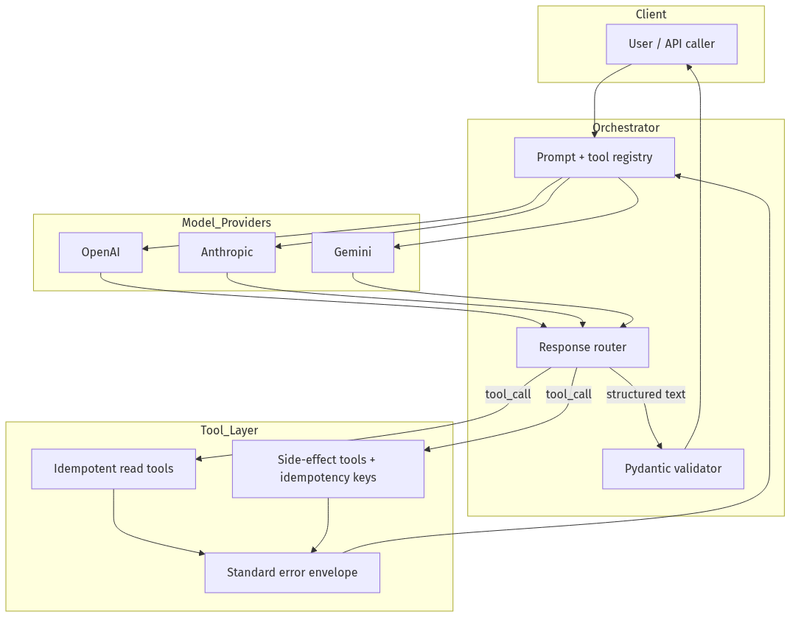
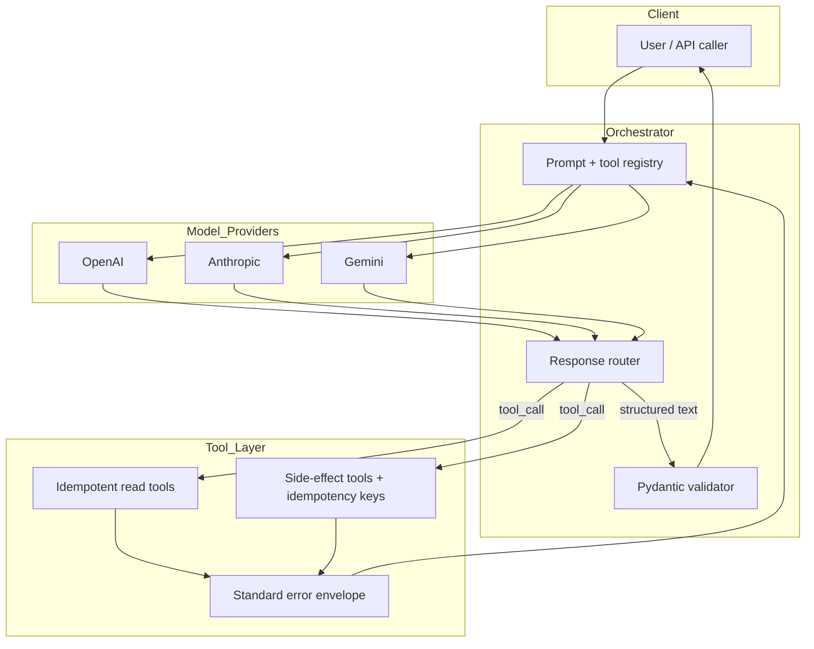
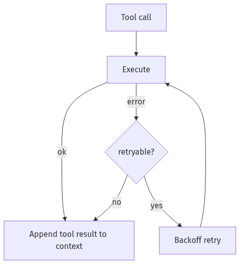
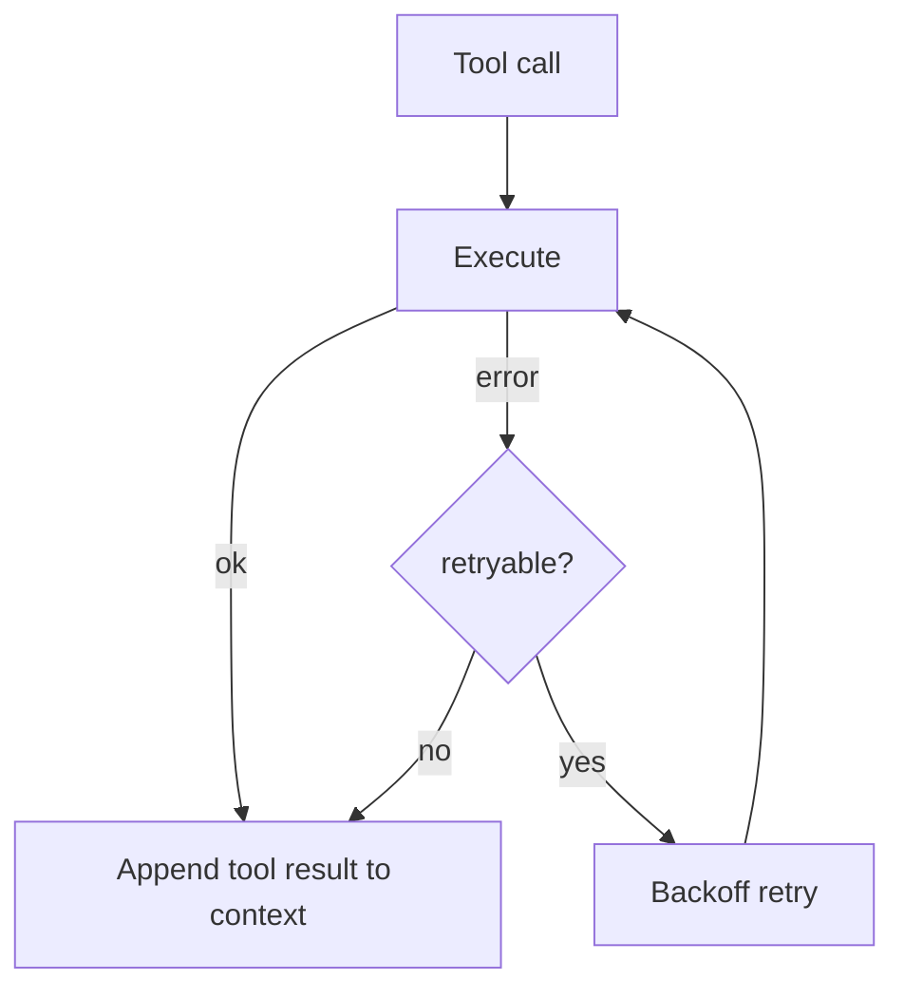
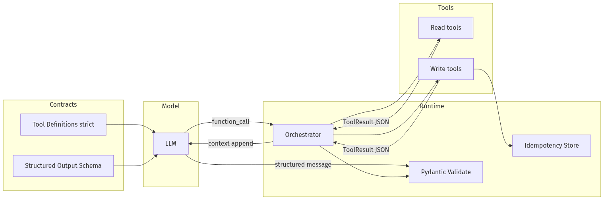
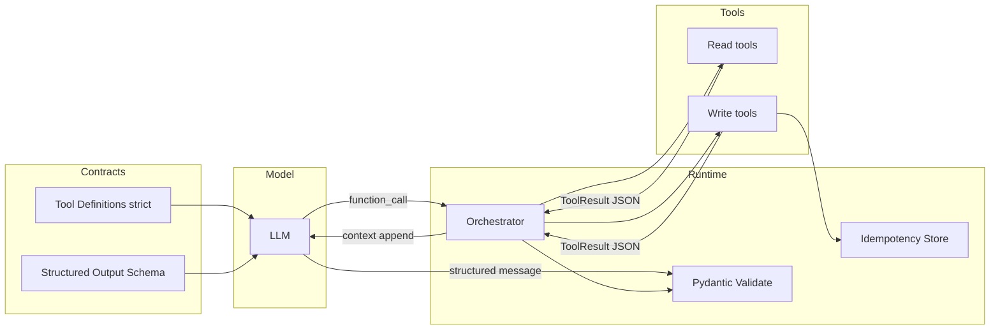
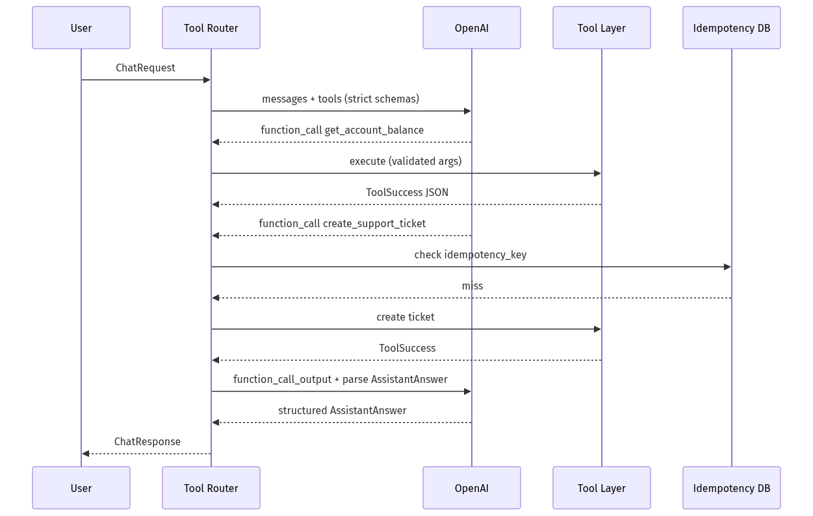
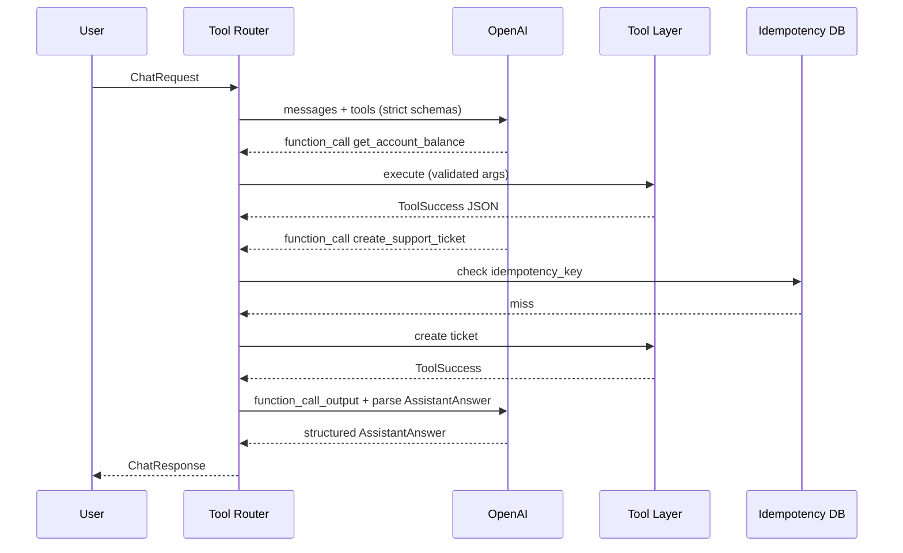

# 02-02 — Structured Outputs & Tool Calling

| Meta | Value |
|------|-------|
| **Estimated Time** | 6–7 hours (read 3h · lab 3h · provider comparison 1h) |
| **Difficulty** | Intermediate (schemas) · Advanced (multi-provider tool loops) |
| **Prerequisites** | [02-01 Production Prompt Engineering](02-01-Production-Prompt-Engineering.md) · [01-05 Provider SDKs](../01-LLM-Engineering/01-05-Provider-SDKs-OpenAI-Claude-Gemini.md) |
| **Module** | 02 — Prompt Engineering |
| **Related** | [02-01 Production Prompt Engineering](02-01-Production-Prompt-Engineering.md) · [03-01 Agent Anatomy](../03-Agentic-Fundamentals/03-01-Agent-Anatomy-and-Loop.md) · [01-05 Provider SDKs](../01-LLM-Engineering/01-05-Provider-SDKs-OpenAI-Claude-Gemini.md) · [Architecture Index](../../Architecture Index.md) · [Study Plan](../../Study Plan.md) |

---

## Learning Objectives

By the end of this chapter you will be able to:

1. Enforce **JSON Schema structured outputs** with provider-native APIs and **Pydantic** validation.
2. Design **tool/function calling contracts** that models can invoke reliably.
3. Implement **idempotent tools** safe under retries and agent loops.
4. Standardize **error return shapes** so the model can recover gracefully.
5. Compare **OpenAI, Anthropic, and Gemini** tool-calling behavior at a practical integration level.

---

## Why This Topic Matters

Natural language is a terrible API between systems. Production GenAI features need **machine-parseable contracts**:

- downstream UI depends on field names,
- billing depends on exact enums,
- agents depend on tool names and argument shapes,
- compliance depends on refusals being detectable.

Structured outputs and tool calling turn the LLM from a chat partner into a **typed component** in your architecture. This is the bridge from [02-01 prompts as contracts](02-01-Production-Prompt-Engineering.md) to [03-01 agent loops](../03-Agentic-Fundamentals/03-01-Agent-Anatomy-and-Loop.md) that Think→Act→Observe via tools.

Without schemas:

- you regex-parse JSON and pray,
- retries duplicate side effects,
- provider differences break your orchestrator,
- and interviews expose "we just ask the model nicely."

---

## Business Impact

| Business outcome | How structured I/O delivers |
|------------------|------------------------------|
| **Reliable UX** | Render cards, charts, actions from typed fields |
| **Fewer incidents** | Invalid tool args caught before execution |
| **Safer automation** | Allowlisted tools; no surprise API calls |
| **Multi-provider strategy** | Abstract contracts; swap models with eval gates |
| **Faster debugging** | Trace shows exact tool name + args JSON |

---

## Architecture Overview






**Mental model:** Structured output = **function return type**. Tool call = **syscall**. Pydantic = **runtime type checker**. Error envelope = **errno for the model**.

---

## Core Concepts

### 1) JSON Schema Structured Outputs

#### Definition

**Structured Outputs** constrain model responses to a JSON Schema—field names, types, enums, required keys—so parsing is deterministic.

OpenAI supports this via:

- **`text.format` / `response_format`** with `json_schema` + `strict: true` for user-facing structured answers ([Structured Outputs guide](https://developers.openai.com/api/docs/guides/structured-outputs))
- **Function/tool calling** with strict schemas when the model invokes your APIs ([Function Calling guide](https://developers.openai.com/api/docs/guides/function-calling))

#### Structured Outputs vs JSON mode

| Feature | Structured Outputs | JSON mode |
|---------|-------------------|-----------|
| Valid JSON | Yes | Yes |
| Schema adherence | Yes | No |
| Retry parsing hacks | Rarely needed | Often needed |

**Production rule:** Prefer Structured Outputs over JSON mode when the model supports it.

#### Refusals

Safety refusals may not match your schema. OpenAI exposes a **`refusal`** content type—handle explicitly instead of crashing parse logic ([Structured Outputs — refusals](https://developers.openai.com/api/docs/guides/structured-outputs)).

---

### 2) Pydantic Validation

#### Definition

**Pydantic** models define Python types that map to JSON Schema and validate at runtime.

#### Why it exists

- Single source of truth for API + LLM schema
- Automatic validation beyond JSON Schema (cross-field rules)
- Native OpenAI SDK support: `client.responses.parse(..., text_format=MyModel)`

#### Pattern

```python
from pydantic import BaseModel, Field
from enum import Enum

class RiskTier(str, Enum):
    LOW = "low"
    HIGH = "high"

class Decision(BaseModel):
    risk_tier: RiskTier
    approved: bool
    reason: str = Field(max_length=200)
```

#### When NOT to rely on Pydantic alone

- Model may still produce **semantically wrong** but valid JSON ("approved: true" for fraud). Add **business validators** and **policy code** ([02-01](02-01-Production-Prompt-Engineering.md)).

#### CI guard

Generate JSON Schema from Pydantic; fail CI if hand-edited schema diverges.

---

### 3) Tool / Function Calling Contracts

#### Definition

**Tool calling** lets the model emit a structured request: `{name, arguments}` instead of executing code itself. Your orchestrator runs the tool and returns results to the model.

#### Contract checklist

| Element | Requirement |
|---------|-------------|
| **Name** | Stable, verb-noun (`get_account_balance`) |
| **Description** | When to use / not use (disambiguates similar tools) |
| **Parameters** | JSON Schema; minimal required fields |
| **Returns** | Document shape in description; enforce via error envelope |
| **Side effects** | Explicit in description ("creates ticket") |
| **Auth scope** | Tool implementation enforces ACL—not the model |

#### Tool vs structured user response

From OpenAI docs:

- **Tool calling** — model connects to your system (DB, APIs, UI actions)
- **Structured `text.format`** — model formats reply to user ([Structured Outputs guide](https://developers.openai.com/api/docs/guides/structured-outputs))

Agents often use **both**: structured final answer + tool calls mid-loop ([03-01](../03-Agentic-Fundamentals/03-01-Agent-Anatomy-and-Loop.md)).

---

### 4) Idempotent Tools

#### Definition

An **idempotent tool** produces the same system state when called multiple times with the same **idempotency key** (or when the operation is naturally read-only).

#### Why it exists

Agent loops and HTTP retries **will** duplicate calls. Without idempotency:

- double refunds,
- duplicate tickets,
- repeated emails.

#### Patterns

| Tool type | Idempotency approach |
|-----------|---------------------|
| **Read** (`get_balance`) | Naturally idempotent |
| **Create** (`create_ticket`) | Require `idempotency_key`; dedupe in DB |
| **Update** | Upsert or version check |
| **Delete** | Soft-delete; second call returns `already_deleted: true` |

```python
def create_ticket(idempotency_key: str, subject: str) -> dict:
    existing = db.find_ticket_by_key(idempotency_key)
    if existing:
        return {"status": "ok", "ticket_id": existing.id, "duplicate": True}
    ticket = db.insert(..., idempotency_key=idempotency_key)
    return {"status": "ok", "ticket_id": ticket.id, "duplicate": False}
```

#### Interview line

> "Every side-effect tool in an agent loop accepts an idempotency key derived from trace_id + tool_name + normalized args hash."

---

### 5) Error Return Shapes

#### Definition

Tools return **structured errors** the model can read—not stack traces.

#### Standard envelope (recommended)

```json
{
  "status": "error",
  "error_code": "ACCOUNT_NOT_FOUND",
  "message": "No account for customer_id=C-123",
  "retryable": false,
  "details": {"customer_id": "C-123"}
}
```

Success envelope:

```json
{
  "status": "ok",
  "data": {"balance_usd": 42.10},
  "meta": {"source": "core_banking_ro", "cached": false}
}
```

#### Rules

| Rule | Rationale |
|------|-----------|
| Stable `error_code` enums | Model learns recovery policies |
| Human `message` | Model paraphrases for user |
| `retryable` flag | Orchestrator decides retry/backoff |
| Never leak secrets in `details` | Model may repeat them to user |
| Max size cap | Prevent context blow-up |

#### Orchestrator behavior






Teach the model in developer prompt: "On `ACCOUNT_NOT_FOUND`, ask user to verify ID; do not invent balance."

---

### 6) OpenAI vs Anthropic vs Gemini (Practical Differences)

Use [01-05 Provider SDKs](../01-LLM-Engineering/01-05-Provider-SDKs-OpenAI-Claude-Gemini.md) for installation and auth. Below is **integration-level** comparison for tool loops.

| Dimension | OpenAI | Anthropic (Claude) | Google Gemini |
|-----------|--------|-------------------|---------------|
| **Docs** | [Function Calling](https://developers.openai.com/api/docs/guides/function-calling) | [Tool use](https://platform.claude.com/docs/en/docs/build-with-claude/tool-use) | [Function calling](https://ai.google.dev/gemini-api/docs/function-calling) |
| **Tool definition** | `tools[]` with `function` + JSON Schema | `tools[]` with `input_schema` | `functionDeclarations` |
| **Structured user output** | `responses.parse` + Pydantic; `json_schema` strict | Tool or JSON via prompt; check model for native JSON mode | `responseSchema` in generationConfig |
| **Parallel tool calls** | Supported (model-dependent) | Supported | Supported (model-dependent) |
| **Tool result message** | `role: tool` / tool output items in Responses API | `tool_result` content blocks | `functionResponse` parts |
| **Forced tool choice** | `tool_choice: {type: function, name: ...}` | `tool_choice: {type: tool, name: ...}` | `functionCallingConfig` mode `ANY` |
| **Refusals** | Explicit `refusal` type in structured outputs | Stop reasons + content blocks | Safety block reasons; check finish reason |
| **Strict schema** | `strict: true` on schemas | Strong schema adherence in recent models | `responseSchema` enforcement |

#### Abstraction layer recommendation

Define internal **`ToolSpec`** and **`ToolResult`** dataclasses; write thin adapters per provider. Never leak provider message shapes into business logic.

#### Eval note

Run [promptfoo](https://www.promptfoo.dev/docs/intro/) matrices across providers for the **same** tool schema—parity is not guaranteed on edge enums.

---

## Implementation

### Production-shaped service: tool router with Pydantic + idempotency

FastAPI service demonstrating structured final answers, tool registry, idempotent side effects, and standard error envelopes—OpenAI Responses API as primary provider.

```python
"""Structured outputs + tool calling demo service.

Run:
  pip install fastapi uvicorn pydantic openai
  export OPENAI_API_KEY=sk-...
  uvicorn tool_router:app --reload
"""

from __future__ import annotations

import hashlib
import json
import os
import uuid
from datetime import datetime, timezone
from enum import Enum
from typing import Any, Literal

from fastapi import FastAPI, HTTPException
from openai import OpenAI
from pydantic import BaseModel, Field, field_validator

# ---------------------------------------------------------------------------
# Domain models (Pydantic = source of truth)
# ---------------------------------------------------------------------------

class ToolErrorCode(str, Enum):
    ACCOUNT_NOT_FOUND = "ACCOUNT_NOT_FOUND"
    INVALID_ARGUMENT = "INVALID_ARGUMENT"
    UPSTREAM_TIMEOUT = "UPSTREAM_TIMEOUT"
    PERMISSION_DENIED = "PERMISSION_DENIED"


class ToolSuccess(BaseModel):
    status: Literal["ok"] = "ok"
    data: dict[str, Any]
    meta: dict[str, Any] = Field(default_factory=dict)


class ToolError(BaseModel):
    status: Literal["error"] = "error"
    error_code: ToolErrorCode
    message: str
    retryable: bool = False
    details: dict[str, Any] = Field(default_factory=dict)


ToolResult = ToolSuccess | ToolError


class AssistantAnswer(BaseModel):
    """Structured user-facing response — not freeform prose."""
    summary: str = Field(max_length=500)
    balance_usd: float | None = None
    actions_taken: list[str] = Field(default_factory=list)
    needs_human: bool = False


class ChatRequest(BaseModel):
    customer_id: str
    message: str
    trace_id: str | None = None

    @field_validator("customer_id", "message")
    @classmethod
    def non_empty(cls, v: str) -> str:
        if not v.strip():
            raise ValueError("must not be empty")
        return v.strip()


class ChatResponse(BaseModel):
    trace_id: str
    answer: AssistantAnswer
    tool_calls_executed: list[str]
    model: str
    created_at: datetime


# ---------------------------------------------------------------------------
# Fake backing stores (replace with real services)
# ---------------------------------------------------------------------------

ACCOUNTS: dict[str, float] = {"C-1001": 1250.75, "C-1002": 42.10}
TICKETS_BY_KEY: dict[str, str] = {}
AUDIT: list[dict[str, Any]] = []


def audit(trace_id: str, event: str, payload: dict[str, Any]) -> None:
    AUDIT.append(
        {"trace_id": trace_id, "event": event, "payload": payload, "ts": datetime.now(timezone.utc).isoformat()}
    )


# ---------------------------------------------------------------------------
# Idempotent tools
# ---------------------------------------------------------------------------

def get_account_balance(customer_id: str) -> ToolResult:
    if customer_id not in ACCOUNTS:
        return ToolError(
            error_code=ToolErrorCode.ACCOUNT_NOT_FOUND,
            message=f"No account for customer_id={customer_id}",
            retryable=False,
            details={"customer_id": customer_id},
        )
    return ToolSuccess(data={"balance_usd": ACCOUNTS[customer_id]}, meta={"source": "mock_core"})


def create_support_ticket(idempotency_key: str, customer_id: str, subject: str) -> ToolResult:
    if not idempotency_key or len(subject) < 3:
        return ToolError(
            error_code=ToolErrorCode.INVALID_ARGUMENT,
            message="idempotency_key and subject (min 3 chars) required",
            retryable=False,
        )
    if idempotency_key in TICKETS_BY_KEY:
        return ToolSuccess(
            data={"ticket_id": TICKETS_BY_KEY[idempotency_key], "duplicate": True},
            meta={"idempotency_key": idempotency_key},
        )
    ticket_id = f"T-{uuid.uuid4().hex[:8]}"
    TICKETS_BY_KEY[idempotency_key] = ticket_id
    return ToolSuccess(
        data={"ticket_id": ticket_id, "duplicate": False},
        meta={"idempotency_key": idempotency_key},
    )


def idempotency_key(trace_id: str, tool_name: str, args: dict[str, Any]) -> str:
    raw = json.dumps({"trace_id": trace_id, "tool": tool_name, "args": args}, sort_keys=True)
    return hashlib.sha256(raw.encode()).hexdigest()


TOOL_IMPL = {
    "get_account_balance": lambda trace_id, args: get_account_balance(args["customer_id"]),
    "create_support_ticket": lambda trace_id, args: create_support_ticket(
        args.get("idempotency_key") or idempotency_key(trace_id, "create_support_ticket", args),
        args["customer_id"],
        args["subject"],
    ),
}


def openai_tools_schema() -> list[dict[str, Any]]:
    """Provider tool definitions — keep descriptions disambiguating."""
    return [
        {
            "type": "function",
            "name": "get_account_balance",
            "description": "Read-only. Fetch USD balance for a customer_id. Never use for refunds.",
            "parameters": {
                "type": "object",
                "properties": {"customer_id": {"type": "string"}},
                "required": ["customer_id"],
                "additionalProperties": False,
            },
            "strict": True,
        },
        {
            "type": "function",
            "name": "create_support_ticket",
            "description": "Create a human support ticket. Side effect. Use when issue cannot be resolved with balance lookup alone.",
            "parameters": {
                "type": "object",
                "properties": {
                    "customer_id": {"type": "string"},
                    "subject": {"type": "string"},
                    "idempotency_key": {"type": "string"},
                },
                "required": ["customer_id", "subject"],
                "additionalProperties": False,
            },
            "strict": True,
        },
    ]


def execute_tool(trace_id: str, name: str, arguments: str) -> ToolResult:
    if name not in TOOL_IMPL:
        return ToolError(
            error_code=ToolErrorCode.INVALID_ARGUMENT,
            message=f"Unknown tool {name}",
            retryable=False,
        )
    try:
        args = json.loads(arguments) if arguments else {}
    except json.JSONDecodeError:
        return ToolError(
            error_code=ToolErrorCode.INVALID_ARGUMENT,
            message="Tool arguments must be valid JSON object",
            retryable=False,
        )
    try:
        result = TOOL_IMPL[name](trace_id, args)
        audit(trace_id, "tool_executed", {"tool": name, "args": args, "result": result.model_dump()})
        return result
    except Exception as exc:  # noqa: BLE001 — demo boundary
        return ToolError(
            error_code=ToolErrorCode.UPSTREAM_TIMEOUT,
            message=str(exc)[:200],
            retryable=True,
        )


# ---------------------------------------------------------------------------
# Agent loop (Think → Act → Observe) — simplified; see 03-01 for full pattern
# ---------------------------------------------------------------------------

app = FastAPI(title="Tool Router API", version="1.0.0")
MODEL = os.getenv("OPENAI_MODEL", "gpt-4.1-mini")
MAX_TOOL_ROUNDS = 5


def get_client() -> OpenAI:
    if not os.getenv("OPENAI_API_KEY"):
        raise HTTPException(status_code=503, detail="OPENAI_API_KEY not configured")
    return OpenAI()


@app.post("/v1/support/chat", response_model=ChatResponse)
def support_chat(req: ChatRequest) -> ChatResponse:
    trace_id = req.trace_id or str(uuid.uuid4())
    client = get_client()
    tools = openai_tools_schema()
    executed: list[str] = []

    system = (
        "You are a support assistant. Use tools for facts. "
        "Never guess balances. On tool error ACCOUNT_NOT_FOUND, set needs_human=true. "
        "Final reply must use structured answer schema."
    )
    developer = (
        "Tool errors use status=error with error_code. "
        "Do not expose internal error details verbatim to users."
    )
    input_messages: list[Any] = [
        {"role": "system", "content": system},
        {"role": "developer", "content": developer},
        {"role": "user", "content": f"<customer_message>{req.message}</customer_message>"},
    ]

    # Tool loop
    for _ in range(MAX_TOOL_ROUNDS):
        response = client.responses.create(
            model=MODEL,
            input=input_messages,
            tools=tools,
        )
        input_messages += response.output

        tool_calls = [o for o in response.output if o.type == "function_call"]
        if not tool_calls:
            break

        for call in tool_calls:
            executed.append(call.name)
            result = execute_tool(trace_id, call.name, call.arguments)
            input_messages.append(
                {
                    "type": "function_call_output",
                    "call_id": call.call_id,
                    "output": result.model_dump_json(),
                }
            )

    # Structured final answer
    final = client.responses.parse(
        model=MODEL,
        input=input_messages
        + [
            {
                "role": "developer",
                "content": "Produce final structured answer only. No tool calls.",
            }
        ],
        text_format=AssistantAnswer,
    )

    answer: AssistantAnswer | None = None
    for output in final.output:
        if output.type != "message":
            continue
        for item in output.content:
            if item.type == "refusal":
                raise HTTPException(status_code=422, detail={"refusal": item.refusal})
            if item.parsed:
                answer = item.parsed
                break

    if answer is None:
        raise HTTPException(status_code=502, detail="Failed to produce structured answer")

    # Code-level policy (02-01): never trust model for permissions
    if req.customer_id not in ACCOUNTS and not answer.needs_human:
        answer.needs_human = True
        answer.summary = "We could not locate your account. A human agent will help."

    audit(trace_id, "chat_complete", {"answer": answer.model_dump(), "tools": executed})

    return ChatResponse(
        trace_id=trace_id,
        answer=answer,
        tool_calls_executed=executed,
        model=MODEL,
        created_at=datetime.now(timezone.utc),
    )


@app.get("/v1/traces/{trace_id}/audit")
def get_audit(trace_id: str) -> list[dict[str, Any]]:
    return [e for e in AUDIT if e["trace_id"] == trace_id]
```

#### Provider adapter sketch (Anthropic)

```python
# Anthropic tool loop — conceptual; see 01-05 for full SDK setup
# Docs: https://platform.claude.com/docs/en/docs/build-with-claude/tool-use

def anthropic_tool_spec() -> list[dict]:
    return [
        {
            "name": "get_account_balance",
            "description": "Read-only balance lookup",
            "input_schema": {
                "type": "object",
                "properties": {"customer_id": {"type": "string"}},
                "required": ["customer_id"],
            },
        }
    ]

# Map ToolResult envelope to tool_result content block (same JSON string)
```

#### Provider adapter sketch (Gemini)

```python
# Gemini function calling — conceptual
# Docs: https://ai.google.dev/gemini-api/docs/function-calling

def gemini_tool_spec() -> list[dict]:
    return [
        {
            "name": "get_account_balance",
            "description": "Read-only balance lookup",
            "parameters": {
                "type": "object",
                "properties": {"customer_id": {"type": "string"}},
                "required": ["customer_id"],
            },
        }
    ]

# Return functionResponse with ToolResult.model_dump_json() as structured content
```

---

## Production Considerations

| Concern | Practice |
|---------|----------|
| Schema drift | Pydantic generates schema; CI diff |
| Tool sprawl | ≤10 tools per agent; compose sub-agents later |
| Long tool outputs | Summarize before re-prompting |
| Mixed providers | Internal `ToolSpec`; adapter per vendor ([01-05](../01-LLM-Engineering/01-05-Provider-SDKs-OpenAI-Claude-Gemini.md)) |
| Strict mode limits | Some JSON Schema features unsupported—check provider docs |

---

## Security

| Threat | Control |
|--------|---------|
| Tool injection via user text | Allowlist tools; validate args in code |
| Over-privileged tools | Separate read vs write tools; auth in implementation |
| Data exfiltration | Tool outputs filtered; PII redaction |
| Argument tampering | Model args validated against Pydantic before execution |

Tool calling is the **permission boundary**—treat it like OAuth scopes ([11-01 OWASP](../11-Security-Safety/11-01-OWASP-LLM-Top-10.md)).

---

## Performance

| Technique | Effect |
|-----------|--------|
| Parallel read tools | Lower round trips when provider supports parallel calls |
| Short tool descriptions | ↓ input tokens every turn |
| Cache read tools | ↓ latency (respect freshness meta) |
| Cap `MAX_TOOL_ROUNDS` | Prevents runaway loops |

---

## Cost

Each tool round adds **full context re-send**. Mitigations:

- compact tool results (`data` only, no prose),
- smaller model for tool selection, larger for final answer,
- exit loop early when `tool_choice` not needed.

---

## Scalability

- **Tool registry** as versioned service; blue/green tool definitions.
- **Idempotency store** (Redis/Postgres) shared across replicas.
- **Async tool execution** for slow tools; poll with checkpointing ([03-01](../03-Agentic-Fundamentals/03-01-Agent-Anatomy-and-Loop.md)).

---

## Failure Modes

| Failure | Symptom | Mitigation |
|---------|---------|------------|
| Invalid JSON args | Tool not executed | `strict: true`; retry with error hint |
| Duplicate side effects | Double tickets | Idempotency keys |
| Model invents tool name | 400 from provider | Enum tool list; orchestrator guard |
| Huge tool output | Context overflow | Truncate + summarize |
| Provider mismatch | Works on OpenAI, fails on Gemini | promptfoo cross-provider matrix |

---

## Observability

```text
trace_id, model, tool_name, tool_args_hash, tool_latency_ms,
tool_status, error_code, retryable, idempotency_key, round_index
```

Alert on: spike in `INVALID_ARGUMENT`, tool loop hitting `MAX_TOOL_ROUNDS`, refusal rate.

---

## Debugging

| Symptom | Check |
|---------|-------|
| Tool never called | Description ambiguous? missing forced tool for smoke tests? |
| Wrong args | Schema examples in developer prompt; strict mode |
| Loop won't terminate | Add terminal tool; reduce available tools |
| Cross-provider break | Adapter unit tests with recorded fixtures |

---

## Common Mistakes

1. Parsing assistant prose with regex instead of structured outputs.
2. Side-effect tools without idempotency keys.
3. Returning Python tracebacks as tool results.
4. 30 tools with overlapping descriptions.
5. Trusting model-emitted `approved: true` without code policy.

---

## Tradeoffs

| Choice | Upside | Downside |
|--------|--------|----------|
| Strict JSON Schema | Reliable parsing | Less flexible wording |
| Fat tools (one mega-API) | Fewer tools | Harder for model to choose |
| Thin tools (many small) | Precise | More rounds / tokens |
| Provider-native parse | Less code | Vendor lock-in on API shape |
| Internal ToolSpec abstraction | Portable | Adapter maintenance |

---

## Architecture Diagram






---

## Mermaid Diagram — Sequence






---

## Production Examples

| Pattern | Where |
|---------|-------|
| Strict tool schemas | OpenAI `strict: true` function tools |
| Pydantic parse | `responses.parse(text_format=...)` |
| Idempotent writes | Payment APIs, ticket systems, webhooks |
| Error codes | Stripe-style machine-readable errors for agents |

---

## Real Companies Using It (Public Patterns)

| Org | Public pattern | Lesson |
|-----|----------------|--------|
| **OpenAI** | Structured Outputs + function calling docs | Dual path: tools vs response format |
| **Anthropic** | Tool use with `input_schema` | Explicit schemas reduce misfires |
| **Google** | Gemini function calling + `responseSchema` | Schema-first generation |
| **Uber / Klarna (LangGraph case studies)** | Tool loops in production | Idempotency + traces mandatory |

---

## Hands-on Labs

### Lab A — Pydantic strict schema (45 min)

Add `TransferRequest` with cross-field validation; wire to `responses.parse`; handle refusals.

### Lab B — Idempotency (60 min)

Hammer `create_support_ticket` with same key 20×; assert one ticket.

### Lab C — Error recovery (45 min)

Return `ACCOUNT_NOT_FOUND`; verify model sets `needs_human=true` in structured answer.

### Lab D — Provider matrix (90 min)

Implement Anthropic or Gemini adapter for `get_account_balance`; run promptfoo across providers.

---

## Coding Assignments

1. Add `ToolRegistry` class loading YAML tool specs.
2. Implement retry with exponential backoff for `retryable: true` errors only.
3. Emit OpenTelemetry spans per tool round.

---

## Mini Project

**Title:** Strict Support Tool Router  
**Done when:** Two tools, idempotent create, standard error envelope, structured final answer, audit endpoint.

---

## Production Project

**Title:** Multi-Provider Tool Adapter  
**Done when:** Shared `ToolSpec`; OpenAI + one of Anthropic/Gemini; eval parity report.

---

## Stretch Project

Port tool loop to [03-04 LangGraph](../03-Agentic-Fundamentals/03-04-LangGraph-Production-Agents.md) with checkpointing and HITL on write tools.

---

## Interview Questions

### Senior Engineer

1. Structured Outputs vs JSON mode?
2. What belongs in a tool description?
3. Why idempotent tools in agent loops?

### Staff Engineer

1. Design a standard `ToolResult` envelope for your org.
2. How do you prevent duplicate side effects on retry?
3. Compare OpenAI and Anthropic tool calling integration.

### Principal Engineer

1. Platform API for registering tools with schema validation and auth.
2. When to use structured user output vs tool calling vs both?
3. Migration plan when a provider deprecates a schema feature.

### Engineering Manager

1. How do you review new tools for security before production?
2. Metrics for tool health in production?
3. Build vs buy for multi-provider abstraction?

### Whiteboard

Draw a 3-round tool loop with idempotency and error paths.

### Follow-ups

- Max tools before quality degrades?
- How to test tool calling offline?
- Link to [03-01 agent loop](../03-Agentic-Fundamentals/03-01-Agent-Anatomy-and-Loop.md)?

---

## Revision Notes

- **Structured output** = typed model response; **tool call** = typed action request.
- Pydantic is source of truth; avoid schema drift.
- Side-effect tools **always** idempotent.
- Errors: `{status, error_code, message, retryable}` — never stack traces.
- OpenAI: `strict` + `responses.parse`; Anthropic: `input_schema`; Gemini: `functionDeclarations` + `responseSchema`.
- Prev: [02-01 Prompt Engineering](02-01-Production-Prompt-Engineering.md) · Next: [03-01 Agent Loop](../03-Agentic-Fundamentals/03-01-Agent-Anatomy-and-Loop.md).

---

## Summary

Structured outputs and tool calling make LLMs **composable, testable components**. Use JSON Schema strict mode and Pydantic validation for responses; design narrow tool contracts with idempotent side effects and standard error envelopes; abstract provider differences while eval-ing parity. This is the substrate for reliable agents in [03-01](../03-Agentic-Fundamentals/03-01-Agent-Anatomy-and-Loop.md).

---

## Further Reading

| Title | URL | Difficulty | Reading Time | Why Read | Important Sections |
|-------|-----|------------|--------------|----------|--------------------|
| OpenAI Structured Outputs | https://developers.openai.com/api/docs/guides/structured-outputs | Intermediate | 40 min | Primary pattern for typed responses | Pydantic; refusals; vs function calling |
| OpenAI Function Calling | https://developers.openai.com/api/docs/guides/function-calling | Intermediate | 45 min | Tool loop mechanics | Strict schemas; tool choice; Responses API |
| Anthropic Tool Use | https://platform.claude.com/docs/en/docs/build-with-claude/tool-use | Intermediate | 40 min | Claude integration | input_schema; tool results |
| Gemini Function Calling | https://ai.google.dev/gemini-api/docs/function-calling | Intermediate | 35 min | Google integration | functionDeclarations; parallel calls |
| promptfoo Intro | https://www.promptfoo.dev/docs/intro/ | Intro | 20 min | Cross-provider eval | Matrix testing workflow |
| OpenAI Prompt Engineering | https://developers.openai.com/api/docs/guides/prompt-engineering | Intro | 30 min | Tool description craft | Clear instructions |
| JSON Schema Spec | https://json-schema.org/learn/getting-started-step-by-step | Intermediate | 45 min | Schema limits | Types; required; enums |

---

## Resume Bullet (after lab)

- Implemented a **strict-schema tool router** with Pydantic validation, idempotent write tools, standard error envelopes, and structured final answers—provider-agnostic contracts with OpenAI Responses API and cross-provider eval matrix.
