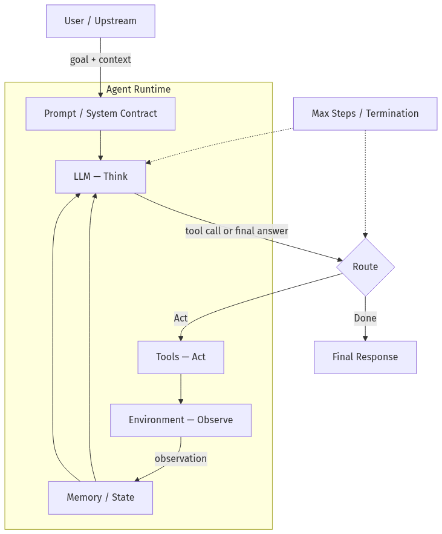
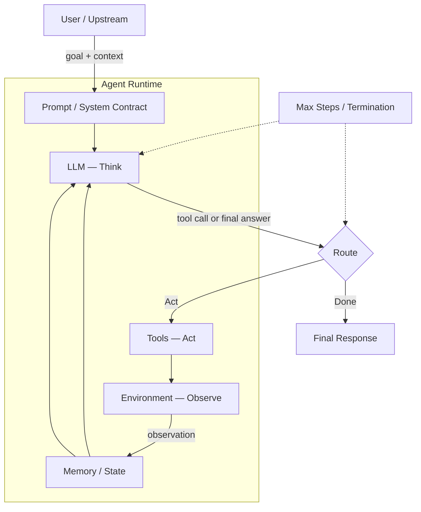
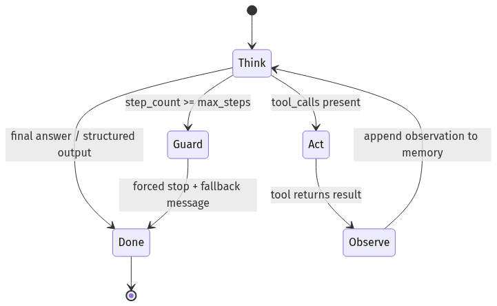
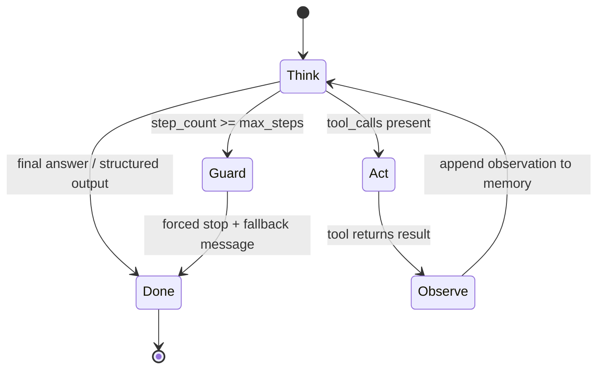
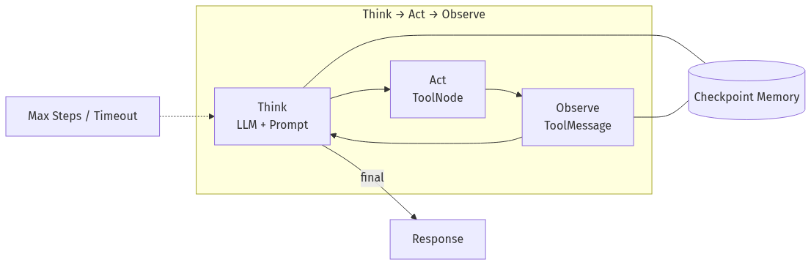
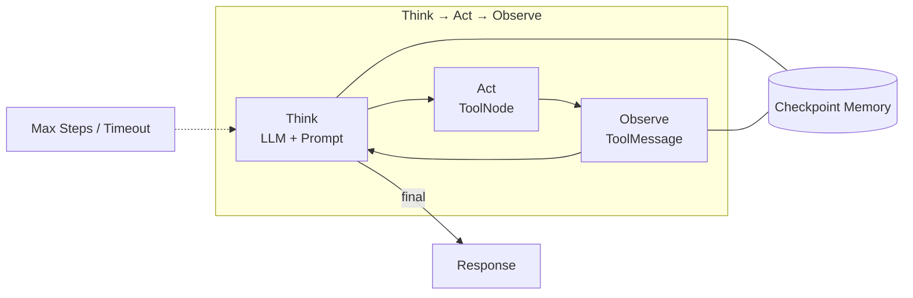
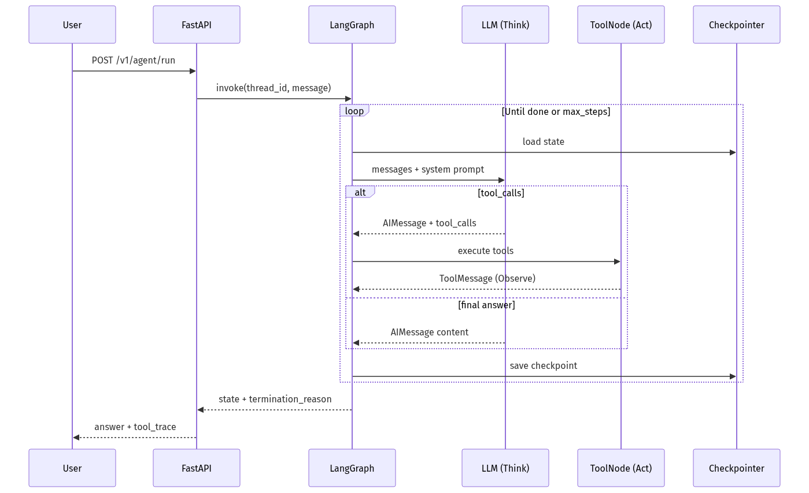
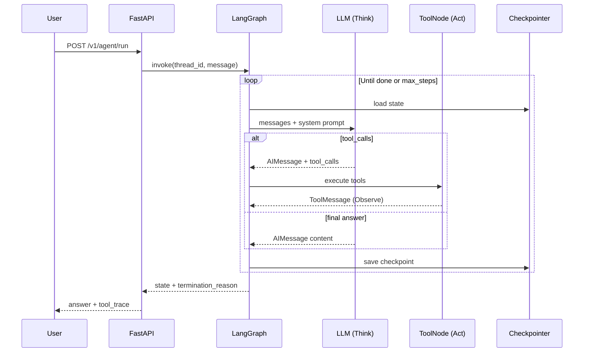

# 03-01 — Agent Anatomy & the Think→Act→Observe Loop

| Meta | Value |
|------|-------|
| **Estimated Time** | 5–6 hours (read 2.5h · lab 2.5h · trace review 1h) |
| **Difficulty** | Intermediate (concepts) · Advanced (production loop design) |
| **Prerequisites** | [00-01](../00-Foundations/00-01-AI-Engineering-Mindset.md) · [02-02](../02-Prompt-Engineering/02-02-Structured-Outputs-Tool-Calling.md) · Python · basic FastAPI |
| **Module** | 03 — Agentic Fundamentals |
| **Related** | [00-01](../00-Foundations/00-01-AI-Engineering-Mindset.md) · [02-02](../02-Prompt-Engineering/02-02-Structured-Outputs-Tool-Calling.md) · [03-02](03-02-Tools-Memory-Control-Flow.md) · [03-03](03-03-Agentic-Design-Patterns.md) · [03-04](03-04-LangGraph-Production-Agents.md) · [Architecture Index](../../Architecture Index.md) |

---

## Learning Objectives

By the end of this chapter you will be able to:

1. Decompose any agent into **Prompt + Tools + Memory × LLM** and identify missing components.
2. Implement the **Think → Act → Observe** loop with explicit state transitions.
3. Define **termination conditions** and **max-step guards** that prevent runaway loops.
4. Explain **ReAct** and map it to modern tool-calling agents.
5. Articulate **why LLMs alone fail** in production and what each layer fixes.
6. Ship a **LangGraph + FastAPI** agent with checkpointed state and bounded steps.

---

## Why This Topic Matters

An LLM API call returns text. A product needs **actions**, **continuity**, and **stop conditions**.

Without a disciplined loop:

- agents hallucinate facts they could have fetched,
- repeat the same tool call until budget exhaustion,
- never know when the task is done,
- and cannot be debugged because there is no trace of reasoning vs execution.

**Staff/Principal interviews** probe whether you understand the loop—not whether you can import `create_react_agent`. This chapter gives you the vocabulary and the production skeleton.

---

## Business Impact

| Business outcome | How loop design changes decisions |
|------------------|-----------------------------------|
| **Predictable cost** | Max steps + token budgets cap worst-case spend |
| **Faster resolution** | Observe→Think feedback reduces blind retries |
| **Auditability** | Each loop iteration is a traceable event |
| **Reliability** | Termination rules prevent infinite support tickets |
| **Customer trust** | Grounded answers via tools, not confident fiction |

---

## Architecture Overview

An agent runtime is a **state machine** driven by an LLM:





**Equation (from [00-01](../00-Foundations/00-01-AI-Engineering-Mindset.md)):**

\[
\text{Agent} = (\text{Prompt} + \text{Tools} + \text{Memory}) \times \text{LLM}
\]

The LLM is the **planner/selector**. The parentheses are what make planning **grounded and bounded**.

---

## Core Concepts

### 1) Agent Anatomy — Four Components

#### Definition

| Component | Role in the loop | Production artifact |
|-----------|------------------|---------------------|
| **Prompt** | Goals, constraints, output schema, tool-use policy | Versioned system prompt + message templates |
| **Tools** | Side effects and truth-fetching | Typed functions with auth, timeouts, idempotency |
| **Memory** | State across Think/Act/Observe iterations | Message history, scratchpad, checkpoint store |
| **LLM** | Reason, plan, choose tools or finish | Routed model with structured output mode |

#### Intuition

Think of the LLM as a **CPU** that emits instructions. Tools are **syscalls**. Memory is **RAM + disk**. Without syscalls, the CPU simulates the world. Without memory, it forgets what it just did.

#### When to use a full loop vs one-shot

| Pattern | Use when |
|---------|----------|
| One-shot LLM | Single transform (rewrite, classify) |
| Tool call once | One fact fetch, deterministic follow-up |
| Full loop | Multi-step research, ticket triage, coding tasks |

#### Interview discussion

> "We don't loop for a FAQ answer. We loop when the next action depends on what we learn from the last tool result."

---

### 2) The Think → Act → Observe Loop

#### Definition

| Phase | Agent behavior | LangGraph node (typical) |
|-------|----------------|--------------------------|
| **Think** | LLM reads state, decides next move | `agent` / `call_model` |
| **Act** | Execute selected tool(s) | `tools` / `tool_node` |
| **Observe** | Append tool results to state | automatic via message reducer |

#### Mental model





#### Why it exists

Real tasks are **sequential and conditional**. "Look up account → if delinquent route to collections else offer retention" cannot be a single static prompt.

#### When NOT to expose raw loop to users

Long loops belong **server-side**. Stream intermediate thoughts only when product policy allows (support copilots yes; compliance workflows often no).

---

### 3) ReAct — Reasoning + Acting

#### Definition

**ReAct** (Yao et al., 2022) interleaves natural-language **reasoning traces** with **actions** and **observations**. Modern agents often hide explicit "Thought:" lines but keep the same structure via tool-calling APIs.

Paper: [ReAct: Synergizing Reasoning and Acting](https://arxiv.org/abs/2210.03629)

#### Classic ReAct trace (abbreviated)

```text
Question: What is the elevation of the city where the 2024 Olympics opening ceremony was held?

Thought: I need the host city first.
Action: search["2024 Olympics opening ceremony host city"]
Observation: Paris, France

Thought: Now I need Paris elevation.
Action: search["Paris France elevation meters"]
Observation: ~35 m average

Thought: I can answer.
Action: finish["Paris, ~35 m"]
```

#### Mapping to modern tool-calling

| ReAct element | Modern equivalent |
|---------------|-------------------|
| Thought | Model chain-of-thought (often internal) |
| Action | `tool_calls[]` in assistant message |
| Observation | `tool` role message with result JSON/text |
| Finish | Assistant message with no tool calls |

Deep patterns: [03-03 Agentic Design Patterns](03-03-Agentic-Design-Patterns.md)

---

### 4) Termination Conditions

#### Definition

A run ends when **any** configured stop rule fires:

| Condition | Example | Production priority |
|-----------|---------|---------------------|
| **Task complete** | Model returns final answer schema | Primary |
| **No tool calls** | Assistant message is user-facing | Primary |
| **Max steps** | `step_count >= 10` | Safety |
| **Token budget** | Cumulative tokens > ceiling | Cost guard |
| **Timeout** | Wall clock > 30s | SLO guard |
| **Tool failure budget** | 3 consecutive tool errors | Fail closed |
| **Human interrupt** | HITL rejection | Compliance |
| **Duplicate action** | Same tool+args repeated | Loop detector |

#### When to use strict vs loose termination

- **Strict** (financial, medical): require structured `AgentResult` schema + policy node approval.
- **Loose** (internal research): max steps + graceful "best effort" summary.

#### Interview discussion

> "Termination is not an afterthought—it's part of the agent's public API contract."

---

### 5) Max Steps — The Non-Negotiable Guardrail

#### Definition

**Max steps** limits **Think→Act→Observe cycles**, not LLM tokens alone.

#### Why tokens alone fail

A model can burn tokens **within one step** (huge tool JSON) or loop **cheap short steps** (100 tiny searches).

#### Recommended starting defaults

| Agent type | max_steps | Notes |
|------------|-----------|-------|
| FAQ + single lookup | 3–5 | Usually 1–2 sufficient |
| Support triage | 8–12 | Multiple lookups + draft |
| Research / coding | 15–25 | Monitor cost closely |
| Open-ended browsing | Avoid | Require human checkpoints |

#### Production pattern

Always return **partial result + reason** when max steps hit—not a generic 500.

```python
if state["step_count"] >= MAX_STEPS:
    return {
        "status": "max_steps_exceeded",
        "partial_answer": synthesize_from_state(state),
        "steps_used": state["step_count"],
    }
```

Control-flow details: [03-02 Tools, Memory & Control Flow](03-02-Tools-Memory-Control-Flow.md)

---

### 6) Why LLMs Alone Fail

#### Definition

A bare LLM is a **text prior** over training data. It is not a database, executor, or session store.

#### Failure modes without tools/memory/loop discipline

| Failure | Symptom | Fix |
|---------|---------|-----|
| **Stale knowledge** | Wrong dates, prices, policies | Tools / RAG ([04-01](../04-RAG/04-01-RAG-Architecture.md)) |
| **Hallucinated actions** | "I refunded the customer" | Real tools with idempotency keys |
| **No multi-step plans** | Drops sub-goals | Loop + memory |
| **Amnesia** | Re-asks same question | Short-term message history |
| **Unbounded spend** | 40 tool calls | max_steps + budgets |
| **No audit trail** | Cannot explain decision | Structured logging per step |

#### When an LLM-alone answer is acceptable

- Creative writing with no factual claims
- Classification with stable labels and eval coverage
- Drafting from user-provided context only

#### The multiplication in the equation

If any of {Prompt, Tools, Memory} is zero, **reliability collapses** even with GPT-4/Claude Opus. The model amplifies whatever structure you give it—it does not substitute for structure.

---

## Implementation

### Production agent: LangGraph ReAct loop + FastAPI

This service implements a **bounded** account-support agent with checkpointed threads.

**Stack:** LangGraph · LangChain tools · FastAPI · SQLite checkpointer (swap to Postgres in prod)

```python
"""Bounded ReAct agent — LangGraph + FastAPI.

Run:
  pip install langgraph langchain-openai fastapi uvicorn langgraph-checkpoint-sqlite
  export OPENAI_API_KEY=...
  uvicorn agent_app:app --reload

Endpoints:
  POST /v1/agent/run       — start or continue a thread
  GET  /v1/agent/{thread_id} — fetch latest checkpoint state (debug)
"""

from __future__ import annotations

import os
import uuid
from datetime import datetime, timezone
from typing import Annotated, Any, Literal, TypedDict

from fastapi import FastAPI, HTTPException
from langchain_core.messages import AIMessage, HumanMessage, SystemMessage, ToolMessage
from langchain_core.tools import tool
from langchain_openai import ChatOpenAI
from langgraph.checkpoint.sqlite import SqliteSaver
from langgraph.graph import END, StateGraph
from langgraph.graph.message import add_messages
from langgraph.prebuilt import ToolNode
from pydantic import BaseModel, Field

# --- Config ---
MAX_STEPS = 10
MODEL = os.getenv("AGENT_MODEL", "gpt-4.1-mini")
DB_PATH = os.getenv("CHECKPOINT_DB", "checkpoints.db")

SYSTEM_PROMPT = """You are BankCo support agent.
Rules:
- Use tools for account facts; never invent balances or statuses.
- If tools fail twice, summarize what you know and ask for human help.
- When the issue is resolved, respond with a concise final answer (no tool calls).
"""


# --- Tools (Act) ---
@tool
def get_account_status(account_id: str) -> dict[str, Any]:
    """Return account status, balance, and delinquency flag."""
    # Production: call core banking API with auth + timeout
    db = {
        "ACC-1001": {"status": "active", "balance_usd": 1200.50, "delinquent": False},
        "ACC-2002": {"status": "restricted", "balance_usd": -40.00, "delinquent": True},
    }
    if account_id not in db:
        return {"error": "not_found", "account_id": account_id}
    return {"account_id": account_id, **db[account_id]}


@tool
def create_support_ticket(account_id: str, summary: str, priority: Literal["low", "high"] = "low") -> dict[str, str]:
    """Create a CRM ticket. Idempotent on (account_id, summary) in production."""
    ticket_id = f"TCK-{uuid.uuid4().hex[:8].upper()}"
    return {"ticket_id": ticket_id, "account_id": account_id, "priority": priority, "summary": summary}


TOOLS = [get_account_status, create_support_ticket]
TOOL_NODE = ToolNode(TOOLS)


# --- State (Memory) ---
class AgentState(TypedDict):
    messages: Annotated[list, add_messages]
    step_count: int
    status: Literal["running", "completed", "max_steps_exceeded", "error"]
    termination_reason: str | None


# --- LLM (Think) ---
llm = ChatOpenAI(model=MODEL, temperature=0).bind_tools(TOOLS)


def think(state: AgentState) -> dict[str, Any]:
    """Think phase: model chooses tools or final answer."""
    if state["step_count"] >= MAX_STEPS:
        return {
            "status": "max_steps_exceeded",
            "termination_reason": f"step_count>={MAX_STEPS}",
            "messages": [
                AIMessage(
                    content=(
                        "I hit the step limit. Partial summary: please review account manually "
                        "or retry with a narrower question."
                    )
                )
            ],
        }

    response = llm.invoke([SystemMessage(content=SYSTEM_PROMPT), *state["messages"]])
    return {"messages": [response], "step_count": state["step_count"] + 1}


def route_after_think(state: AgentState) -> str:
    """Route: Act (tools), Done, or forced stop."""
    if state.get("status") == "max_steps_exceeded":
        return "done"
    last = state["messages"][-1]
    if isinstance(last, AIMessage) and last.tool_calls:
        return "act"
    return "done"


def finalize(state: AgentState) -> dict[str, Any]:
    if state.get("status") == "max_steps_exceeded":
        return state
    return {"status": "completed", "termination_reason": "model_final_answer"}


# --- Graph ---
def build_graph():
    graph = StateGraph(AgentState)
    graph.add_node("think", think)
    graph.add_node("act", TOOL_NODE)  # Observe happens via ToolMessage append
    graph.add_node("finalize", finalize)

    graph.set_entry_point("think")
    graph.add_conditional_edges("think", route_after_think, {"act": "act", "done": "finalize"})
    graph.add_edge("act", "think")  # Observe → Think
    graph.add_edge("finalize", END)
    return graph


checkpointer = SqliteSaver.from_conn_string(DB_PATH)
AGENT = build_graph().compile(checkpointer=checkpointer)


# --- FastAPI ---
class RunRequest(BaseModel):
    message: str = Field(min_length=1, max_length=4000)
    thread_id: str | None = None
    account_id: str | None = None


class RunResponse(BaseModel):
    thread_id: str
    status: str
    termination_reason: str | None
    steps_used: int
    answer: str
    tool_trace: list[dict[str, Any]]


app = FastAPI(title="BankCo Agent API", version="1.0.0")


def extract_tool_trace(messages: list) -> list[dict[str, Any]]:
    trace: list[dict[str, Any]] = []
    for i, msg in enumerate(messages):
        if isinstance(msg, AIMessage) and msg.tool_calls:
            for tc in msg.tool_calls:
                trace.append({"step": len(trace) + 1, "tool": tc["name"], "args": tc["args"]})
        if isinstance(msg, ToolMessage):
            trace.append({"observation": msg.content, "tool_call_id": msg.tool_call_id})
    return trace


@app.post("/v1/agent/run", response_model=RunResponse)
def run_agent(req: RunRequest) -> RunResponse:
    thread_id = req.thread_id or str(uuid.uuid4())
    config = {"configurable": {"thread_id": thread_id}}

    user_text = req.message
    if req.account_id:
        user_text = f"[account_id={req.account_id}] {req.message}"

    try:
        result = AGENT.invoke(
            {
                "messages": [HumanMessage(content=user_text)],
                "step_count": 0,
                "status": "running",
                "termination_reason": None,
            },
            config=config,
        )
    except Exception as exc:  # pragma: no cover
        raise HTTPException(status_code=502, detail=f"agent_failed: {exc}") from exc

    # Last non-tool AI content
    answer = ""
    for msg in reversed(result["messages"]):
        if isinstance(msg, AIMessage) and msg.content and not msg.tool_calls:
            answer = msg.content if isinstance(msg.content, str) else str(msg.content)
            break

    return RunResponse(
        thread_id=thread_id,
        status=result.get("status", "completed"),
        termination_reason=result.get("termination_reason"),
        steps_used=result.get("step_count", 0),
        answer=answer,
        tool_trace=extract_tool_trace(result["messages"]),
    )


@app.get("/v1/agent/{thread_id}")
def get_thread_state(thread_id: str) -> dict[str, Any]:
    config = {"configurable": {"thread_id": thread_id}}
    snap = AGENT.get_state(config)
    if not snap or not snap.values:
        raise HTTPException(status_code=404, detail="thread_not_found")
    return {
        "thread_id": thread_id,
        "step_count": snap.values.get("step_count"),
        "status": snap.values.get("status"),
        "updated_at": datetime.now(timezone.utc).isoformat(),
    }
```

#### Why this implementation embodies the loop

1. **Think** — `think` node calls the LLM with system prompt + message memory.
2. **Act** — `ToolNode` executes typed tools with real side-effect boundaries.
3. **Observe** — tool results append as `ToolMessage`; reducer merges into state.
4. **Termination** — `route_after_think` stops on final answer; `MAX_STEPS` forces exit.
5. **Persistence** — `SqliteSaver` checkpoint enables resume/HITL ([LangGraph persistence](https://langchain-ai.github.io/langgraph/concepts/persistence/)).

Production hardening lives in [03-04 LangGraph Production Agents](03-04-LangGraph-Production-Agents.md).

---

## Production Considerations

| Concern | Practice |
|---------|----------|
| Step limits | Enforce in graph + API; log `termination_reason` |
| Streaming | Stream tokens from Think; batch Observe in traces |
| Model swaps | Keep tool schemas stable; eval after provider change |
| Thread lifecycle | TTL old checkpoints; PII scrub on retention |
| Partial success | Return structured `max_steps_exceeded` with summary |

Reference: [LangGraph high-level concepts](https://langchain-ai.github.io/langgraph/concepts/high_level/)

---

## Security

| Threat | Control |
|--------|---------|
| Prompt injection driving tools | Tool allowlists; argument validation; separate policy node |
| Tool overreach | Scoped credentials per tool; no admin tools in customer agents |
| Data exfil via observations | Redact tool outputs before re-prompting |
| Runaway automation | max_steps + human approval on ticket creation |

See also [11-01 OWASP LLM Top 10](../11-Security-Safety/11-01-OWASP-LLM-Top-10.md)

---

## Performance

| Phase | Typical latency | Optimization |
|-------|-----------------|--------------|
| Think | 300ms–3s | Smaller model for routing; cache system prompt |
| Act | 50ms–2s | Parallel tools when independent |
| Observe | negligible | Truncate large payloads before next Think |
| Full loop | 1–15s p95 | Lower max_steps for interactive UX |

---

## Cost

| Lever | Effect |
|-------|--------|
| max_steps | Hard cap on tool+LLM cycles |
| Tool choice | Cheaper than asking model to guess |
| Summarize old steps | Trim message history ([memory concepts](https://langchain-ai.github.io/langgraph/concepts/memory/)) |
| Exit early | Strong "answer now" instruction in prompt |

---

## Scalability

- **Horizontal:** Stateless API + external checkpointer (Postgres/Redis).
- **Vertical:** Limit concurrent loops per tenant; queue long research tasks.
- **Do not** scale by removing step guards—that scales incidents.

---

## Failure Modes

| Failure | Symptom | Mitigation |
|---------|---------|------------|
| Infinite loop | Same tool repeated | Duplicate-action detector; max_steps |
| Premature stop | Wrong "done" | Structured output schema; critic node ([03-03](03-03-Agentic-Design-Patterns.md)) |
| Silent tool error | Model ignores failure | Surface errors in Observation; fail after N errors |
| Context overflow | Truncated history | Rolling summary memory ([03-02](03-02-Tools-Memory-Control-Flow.md)) |
| No termination | Runs until timeout | Explicit finalize node + wall-clock timeout |

---

## Observability

Minimum fields per loop iteration:

```text
trace_id, thread_id, step_index, phase(think|act|observe),
model, tool_name, tool_latency_ms, tool_status,
step_count, termination_reason, token_in, token_out, cost_usd
```

LangSmith / OpenTelemetry integration: [08-02](../08-Evaluation-LLMOps/08-02-Observability-LangSmith-OTel.md)

---

## Debugging

| Question | Where to look |
|----------|---------------|
| Why did it call tool X? | Think message + tool_call args in trace |
| Why didn't it stop? | `route_after_think` decisions; missing finalize |
| Why max steps? | tool_trace for repeated failures |
| Wrong answer with good tools? | Prompt contract; observation truncation |

Use `GET /v1/agent/{thread_id}` and checkpoint history in LangGraph Studio.

---

## Common Mistakes

1. Treating `create_react_agent` as production without max_steps.
2. Logging only final answer—not each Think/Act/Observe.
3. Assuming temperature=0 prevents loops.
4. Embedding tool results only in hidden state the model never re-reads.
5. Confusing "agent" with "chatbot that has one API tool."

---

## Tradeoffs

| Choice | Upside | Downside |
|--------|--------|----------|
| Explicit ReAct text | Debuggable reasoning | Token cost; leakage risk |
| Hidden chain-of-thought | Cleaner UX | Harder debugging |
| Low max_steps | Cheap, fast | Incomplete tasks |
| High max_steps | Higher success rate | Cost + latency spikes |
| Sync loop in API | Simple | Poor UX for long tasks → async queue |

---

## Architecture Diagram





---

## Mermaid Diagram — Sequence





---

## Production Examples

| Pattern | Loop shape | Termination |
|---------|--------------|-------------|
| Support copilot | 3–8 steps | Ticket created or answer |
| Code agent | 10–20 steps | Tests pass or max_steps |
| Research brief | 5–15 steps | Citations + summary |
| Refund workflow | 2–4 steps + HITL | Policy node approval |

---

## Real Companies Using It (Public Patterns)

| Org | Public pattern | Lesson |
|-----|----------------|--------|
| **LangChain / LangGraph docs (Uber, Klarna cited)** | Stateful graphs with persistence | Loops need checkpointing |
| **OpenAI Assistants / Responses** | Tool loops with thread state | Same anatomy, managed runtime |
| **Microsoft Copilot** | Multi-step tool use in productivity | Observe before next Think |
| **ReAct paper benchmarks** | Interleaved reasoning improves grounding | Foundation for modern agents |

---

## Hands-on Labs

### Lab A — Trace a loop (45 min)

Run the API with `account_id=ACC-2002`. Map each HTTP response `tool_trace` entry to Think/Act/Observe.

### Lab B — Break termination (30 min)

Set `MAX_STEPS=2`. Confirm `max_steps_exceeded` returns partial answer, not hang.

### Lab C — LLM-only baseline (45 min)

Remove tools; ask balance question. Document hallucination vs grounded path.

---

## Coding Assignments

1. Add **wall-clock timeout** middleware that cancels graph invoke.
2. Add **duplicate tool detector** (same name+args twice → force finalize).
3. Emit OpenTelemetry spans per Think/Act/Observe with shared `trace_id`.

---

## Mini Project

**Title:** Bounded support agent v0  
**Done when:** max_steps enforced; checkpoint resume works; README documents termination table.

---

## Production Project

**Title:** Agent run audit service  
**Done when:** Postgres checkpointer; trace export JSON; dashboard of `termination_reason` rates.

---

## Stretch Project

Implement the same agent twice: LangGraph vs raw LangChain `AgentExecutor`. Compare trace clarity, checkpointing, and testability. Document in a one-page ADR.

---

## Interview Questions

### Senior Engineer

1. Name the four parts of `Agent = (Prompt + Tools + Memory) × LLM`.
2. What is the difference between Act and Observe?
3. Why is max_steps necessary if you already limit tokens?

### Staff Engineer

1. Design termination for a refund agent with HITL.
2. How does ReAct map to OpenAI tool calling?
3. When would you refuse to deploy a looped agent?

### Principal Engineer

1. Propose a company-wide standard for agent loop telemetry.
2. Compare managed Assistants vs self-hosted LangGraph for regulated workloads.
3. How do you eval loop quality vs single-shot quality?

### Engineering Manager

1. What SLO do you set for "agent resolved without human"?
2. How do you prevent runaway cloud spend from agent loops?
3. What roles own prompts vs tools vs graph topology?

### Whiteboard

Draw Think→Act→Observe with max_steps guard and checkpoint store.

### Follow-ups

- What if the model refuses to call tools?
- What if observations are 100KB JSON?
- What if users need mid-run correction?

---

## Revision Notes

- Agent = Prompt + Tools + Memory **×** LLM — missing pieces multiply failure.
- **Think → Act → Observe** is the universal loop; ReAct names it.
- **Termination** and **max_steps** are product requirements, not infra details.
- LLMs alone: no fresh facts, no real actions, no guaranteed multi-step plans.
- Checkpoint state for debug/resume/HITL — see [03-02](03-02-Tools-Memory-Control-Flow.md).

---

## Summary

Agent anatomy is **structured non-determinism**: the LLM proposes moves; tools and memory ground them; termination rules bound them. Production excellence is measured in **traceable loops**, not clever single prompts.

---

## Further Reading

| Title | URL | Difficulty | Reading Time | Why Read | Important Sections |
|-------|-----|------------|--------------|----------|--------------------|
| LangGraph High-Level Concepts | https://langchain-ai.github.io/langgraph/concepts/high_level/ | Intro | 25 min | Official mental model for graphs + persistence | Benefits; state; compile |
| LangGraph Memory | https://langchain-ai.github.io/langgraph/concepts/memory/ | Intermediate | 30 min | Short vs long-term in graph terms | Memory types; when to summarize |
| LangGraph Persistence | https://langchain-ai.github.io/langgraph/concepts/persistence/ | Intermediate | 30 min | Checkpointing threads | Checkpointers; thread_id |
| LangChain Tools | https://python.langchain.com/docs/concepts/tools/ | Intro | 20 min | Tool contracts for Act phase | Tool definition; binding |
| ReAct Paper | https://arxiv.org/abs/2210.03629 | Intermediate | 45 min | Original Think-Act-Observe | Figures; prompting templates |
| AI Engineering Mindset | [00-01](../00-Foundations/00-01-AI-Engineering-Mindset.md) | Intro | 30 min | Agent equation + when not to agent | Agent equation; decision framework |
| Structured Outputs & Tool Calling | [02-02](../02-Prompt-Engineering/02-02-Structured-Outputs-Tool-Calling.md) | Intermediate | 40 min | Schema contracts for Think phase | Tool schemas; JSON mode |

---

## Resume Bullet (after lab)

- Built a **checkpointed LangGraph ReAct agent** with explicit Think→Act→Observe phases, max-step termination, and FastAPI trace export for support triage grounded in live account tools.
