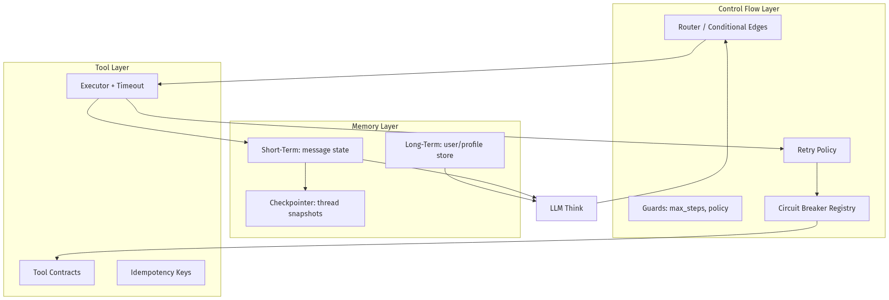
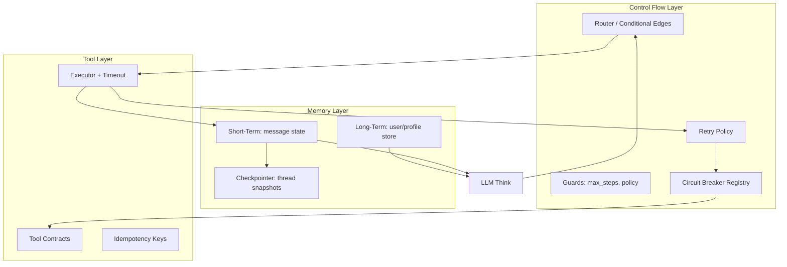
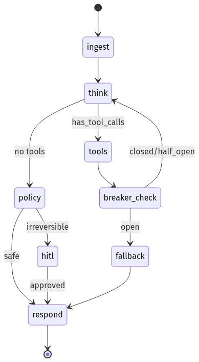
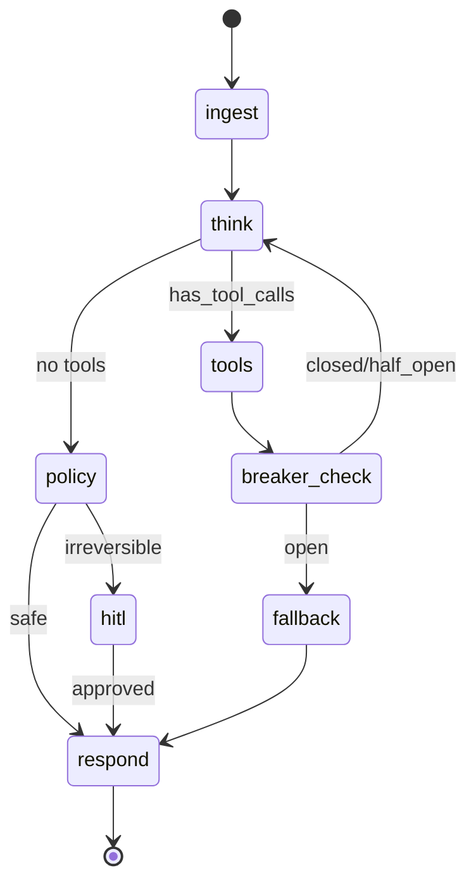
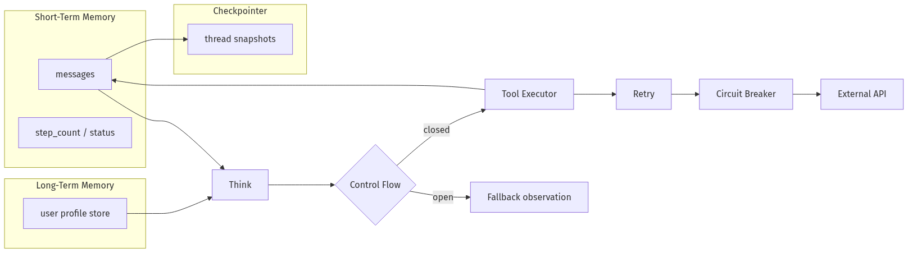
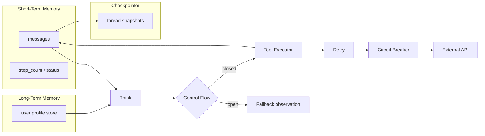
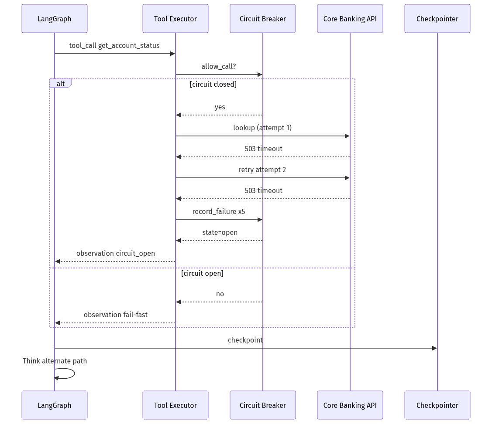
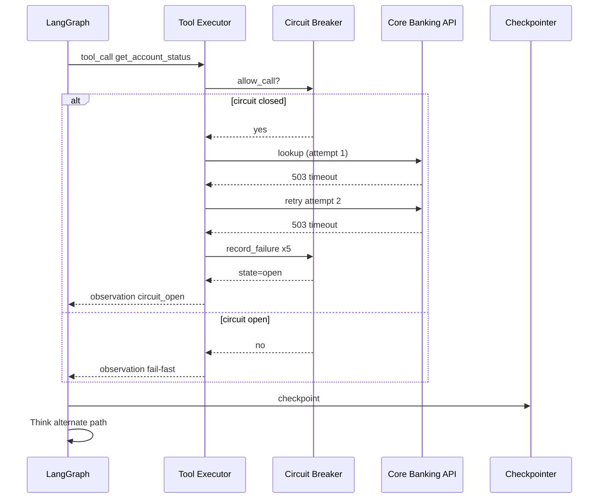

# 03-02 — Tools, Memory & Control Flow

| Meta | Value |
|------|-------|
| **Estimated Time** | 6–7 hours (read 3h · lab 3h · failure injection 1h) |
| **Difficulty** | Intermediate (tools/memory) · Advanced (control flow + resilience) |
| **Prerequisites** | [00-01](../00-Foundations/00-01-AI-Engineering-Mindset.md) · [02-02](../02-Prompt-Engineering/02-02-Structured-Outputs-Tool-Calling.md) · [03-01](03-01-Agent-Anatomy-and-Loop.md) · Python · FastAPI |
| **Module** | 03 — Agentic Fundamentals |
| **Related** | [00-01](../00-Foundations/00-01-AI-Engineering-Mindset.md) · [02-02](../02-Prompt-Engineering/02-02-Structured-Outputs-Tool-Calling.md) · [03-01](03-01-Agent-Anatomy-and-Loop.md) · [03-03](03-03-Agentic-Design-Patterns.md) · [03-04](03-04-LangGraph-Production-Agents.md) · [Architecture Index](../../Architecture Index.md) |

---

## Learning Objectives

By the end of this chapter you will be able to:

1. Design **tool contracts** (schema, auth, idempotency, timeouts) that models can invoke safely.
2. Separate **short-term** (thread) vs **long-term** (cross-session) memory and choose storage.
3. Configure **checkpointers** for resume, HITL, and crash recovery.
4. Implement **control flow** in LangGraph: branching, parallel tools, early exit.
5. Add **retries** with backoff and **circuit breakers** for flaky tools.
6. Ship a resilient FastAPI agent service with observable tool health.

---

## Why This Topic Matters

The agent loop from [03-01](03-01-Agent-Anatomy-and-Loop.md) is only as reliable as its **tools** and **state**.

Production incidents cluster here:

- tools without schemas → model passes garbage args,
- unbounded message history → context overflow mid-run,
- no checkpointing → duplicate tickets after retry,
- naive retries → thundering herd on a dying API,
- missing circuit breakers → agents burn budget calling dead dependencies.

**Staff/Principal** candidates distinguish "demo tool calling" from **operable tool platforms**.

---

## Business Impact

| Business outcome | How tools/memory/control flow deliver it |
|------------------|------------------------------------------|
| **Correct actions** | Typed contracts + validation before side effects |
| **Session continuity** | Short-term memory + checkpointers |
| **Customer memory** | Long-term store for preferences/history |
| **Uptime** | Circuit breakers fail fast; retries recover transient errors |
| **Compliance** | Checkpoint audit trail of what was known when |

---

## Architecture Overview





References: [LangGraph memory](https://langchain-ai.github.io/langgraph/concepts/memory/) · [LangGraph persistence](https://langchain-ai.github.io/langgraph/concepts/persistence/) · [LangChain tools](https://python.langchain.com/docs/concepts/tools/)

---

## Core Concepts

### 1) Tool Contracts

#### Definition

A **tool contract** specifies everything the model and runtime need to invoke a capability safely:

| Field | Purpose | Example |
|-------|---------|---------|
| **name** | Stable identifier | `get_account_status` |
| **description** | When to use / avoid | "Read-only account lookup" |
| **input schema** | Valid arguments | Pydantic / JSON Schema |
| **output schema** | Predictable observations | `{account_id, balance, error?}` |
| **auth scope** | Least privilege | `accounts:read` |
| **timeout** | Wall-clock limit | 3s |
| **idempotency** | Safe retry | `Idempotency-Key` header |
| **side_effect class** | read / write / irreversible | write → HITL |

#### Intuition

Tools are **micro-APIs exposed to a stochastic client** (the LLM). You would never expose internal REST endpoints without validation—same rule applies.

#### When to use strict vs loose schemas

| Strict (Pydantic + enum) | Loose (free text) |
|----------------------------|-------------------|
| Financial, CRM, infra | Internal scratchpad tools |
| High-volume automation | Prototype spikes only |

Structured tool calling foundations: [02-02 Structured Outputs & Tool Calling](../02-Prompt-Engineering/02-02-Structured-Outputs-Tool-Calling.md)

#### Interview discussion

> "The tool description is part of your UX—models route on it."

---

### 2) Short-Term vs Long-Term Memory

#### Definition

| Type | Scope | Lifetime | Storage pattern | LangGraph mapping |
|------|-------|----------|-------------------|-------------------|
| **Short-term** | Current run / thread | Minutes–hours | Message list in graph state | `messages` channel + reducer |
| **Working** | Derived scratchpad | Same thread | Summaries, plans, entity slots | Custom state keys |
| **Long-term** | User/org across sessions | Days–years | Vector + KV + warehouse | Store API / external DB |
| **Checkpoint** | Serializable snapshot | Policy TTL | Postgres/SQLite/Redis | `checkpointer` |

#### Mental model

- **Short-term** = conversation RAM — what the model sees this turn.
- **Long-term** = disk — preferences, past tickets, embeddings.
- **Checkpoint** = VM snapshot — resume exactly after crash/HITL.

#### When NOT to put data in short-term

- Large docs → RAG retrieve on demand ([04-01](../04-RAG/04-01-RAG-Architecture.md))
- Secrets → inject at execution, never log in messages
- Stable user profile → long-term store, inject summary only

#### Summarization trigger

Roll short-term when tokens > 70% context window; keep last K raw turns + summary blob.

Docs: [LangGraph memory concepts](https://langchain-ai.github.io/langgraph/concepts/memory/)

---

### 3) Checkpointers

#### Definition

A **checkpointer** persists graph state after each super-step so runs can **resume**, **fork**, or **replay**.

| Capability | Without checkpointer | With checkpointer |
|------------|---------------------|-------------------|
| API retry after 502 | Duplicate side effects | Resume same `thread_id` |
| HITL pause | Restart from scratch | Interrupt → approve → continue |
| Debug | Logs only | Time-travel state |
| Multi-turn chat | Client sends full history | Server owns canonical state |

#### Production choices

| Backend | Good for | Notes |
|---------|----------|-------|
| SQLite | Local dev | Single writer |
| Postgres | Production | Durable, queryable |
| Redis | Low-latency | TTL + memory cost |

Docs: [LangGraph persistence](https://langchain-ai.github.io/langgraph/concepts/persistence/)

#### thread_id rules

- Client may supply `thread_id` but server validates ownership.
- Never embed PII in `thread_id`; use opaque UUID.

Loop basics: [03-01 Agent Anatomy & Loop](03-01-Agent-Anatomy-and-Loop.md) · Production graph: [03-04 LangGraph Production Agents](03-04-LangGraph-Production-Agents.md)

---

### 4) Control Flow

#### Definition

**Control flow** is how the graph decides **which node runs next**—not the LLM's plan, but the **engine's routing**.

#### LangGraph primitives

| Primitive | Use |
|-----------|-----|
| `add_conditional_edges` | Branch on state / tool outcome |
| `Send` / map-reduce | Parallel fan-out |
| `interrupt_before` | HITL gate |
| Subgraphs | Reusable phases |
| `END` | Hard stop |

#### Example routing policies





#### When to use code routing vs LLM routing

| Code routing | LLM routing |
|--------------|-------------|
| Compliance gates | Ambiguous tool choice |
| Circuit open | Natural language planning |
| Known workflows | Research tasks |

Patterns catalog: [03-03 Agentic Design Patterns](03-03-Agentic-Design-Patterns.md)

---

### 5) Retries

#### Definition

**Retries** recover **transient** failures (timeouts, 503, rate limits). They must not amplify damage on **logical** errors (400, validation).

#### Retry policy table

| Error class | Retry? | Backoff | Max attempts |
|-------------|--------|---------|--------------|
| Timeout | Yes | exponential + jitter | 3 |
| 429 rate limit | Yes | respect `Retry-After` | 5 |
| 503 upstream | Yes | exponential | 3 |
| 400 bad args | No | — | 0 (fix schema/LLM) |
| 401 auth | No | — | 0 (page on-call) |

#### Idempotency requirement

Any retried **write** tool must accept an idempotency key stored in checkpoint metadata.

#### Agent-specific rule

After max tool retries, return **structured observation** to the LLM:

```json
{"error": "tool_exhausted_retries", "tool": "create_ticket", "last_status": 503}
```

Let Think decide alternate path—do not infinite loop Act.

---

### 6) Circuit Breakers for Tools

#### Definition

A **circuit breaker** stops calls to a failing dependency until it recovers—protecting latency, cost, and upstream systems.

| State | Behavior |
|-------|----------|
| **Closed** | Normal calls; track failure rate |
| **Open** | Fail fast; skip tool; return cached/degraded observation |
| **Half-open** | Probe with single call; close on success |

#### When to open

Typical policy: **5 failures in 60s** or **p95 latency > 5s for 3 consecutive calls**.

#### Agent integration

When open, inject observation:

```text
Circuit OPEN for payments_api — do not retry. Offer manual escalation path.
```

Model must route to fallback tool (`create_support_ticket`) not keep calling payments.

#### Interview discussion

> "Retries without breakers retry into a outage."

---

## Implementation

### Resilient tool layer: contracts + memory + control flow

Full FastAPI + LangGraph service with Postgres-ready patterns (SQLite checkpointer for local dev).

```python
"""Resilient agent — tool contracts, memory, retries, circuit breakers.

Run:
  pip install langgraph langchain-openai fastapi uvicorn langgraph-checkpoint-sqlite tenacity pydantic
  export OPENAI_API_KEY=...
  uvicorn resilient_agent:app --reload
"""

from __future__ import annotations

import asyncio
import hashlib
import json
import os
import time
import uuid
from collections import deque
from dataclasses import dataclass, field
from datetime import datetime, timezone
from enum import Enum
from typing import Annotated, Any, Literal, TypedDict

from fastapi import FastAPI, HTTPException
from langchain_core.messages import AIMessage, HumanMessage, SystemMessage, ToolMessage
from langchain_core.tools import StructuredTool
from langchain_openai import ChatOpenAI
from langgraph.checkpoint.sqlite import SqliteSaver
from langgraph.graph import END, StateGraph
from langgraph.graph.message import add_messages
from pydantic import BaseModel, Field, ValidationError
from tenacity import retry, retry_if_exception_type, stop_after_attempt, wait_exponential_jitter

# --- Tool contract models ---
class AccountLookupInput(BaseModel):
    account_id: str = Field(pattern=r"^ACC-\d{4}$", description="BankCo account id")


class TicketInput(BaseModel):
    account_id: str = Field(pattern=r"^ACC-\d{4}$")
    summary: str = Field(min_length=5, max_length=500)
    priority: Literal["low", "high"] = "low"
    idempotency_key: str = Field(min_length=8, max_length=64)


class CircuitState(str, Enum):
    CLOSED = "closed"
    OPEN = "open"
    HALF_OPEN = "half_open"


@dataclass
class CircuitBreaker:
    name: str
    failure_threshold: int = 5
    window_seconds: int = 60
    open_seconds: int = 30
    state: CircuitState = CircuitState.CLOSED
    failures: deque[float] = field(default_factory=deque)
    opened_at: float | None = None

    def record_success(self) -> None:
        self.state = CircuitState.CLOSED
        self.failures.clear()
        self.opened_at = None

    def record_failure(self) -> None:
        now = time.time()
        self.failures.append(now)
        cutoff = now - self.window_seconds
        while self.failures and self.failures[0] < cutoff:
            self.failures.popleft()
        if len(self.failures) >= self.failure_threshold:
            self.state = CircuitState.OPEN
            self.opened_at = now

    def allow_call(self) -> bool:
        if self.state == CircuitState.CLOSED:
            return True
        if self.state == CircuitState.OPEN:
            assert self.opened_at is not None
            if time.time() - self.opened_at >= self.open_seconds:
                self.state = CircuitState.HALF_OPEN
                return True
            return False
        return True  # half_open: allow probe


BREAKERS: dict[str, CircuitBreaker] = {
    "core_banking": CircuitBreaker("core_banking"),
    "crm": CircuitBreaker("crm"),
}

# Simulated flaky dependency
FLAKY_FAIL_NEXT = False
IDEMPOTENCY_CACHE: dict[str, dict[str, Any]] = {}

# --- Long-term memory (production: Postgres / Redis) ---
LONG_TERM: dict[str, dict[str, Any]] = {}


def load_user_context(user_id: str) -> str:
    profile = LONG_TERM.get(user_id, {})
    if not profile:
        return ""
    return f"User profile: preferred_language={profile.get('language','en')}; tier={profile.get('tier','standard')}."


def save_user_context(user_id: str, patch: dict[str, Any]) -> None:
    LONG_TERM.setdefault(user_id, {}).update(patch)


# --- Tool implementations with retries ---
class TransientToolError(Exception):
    pass


@retry(
    reraise=True,
    stop=stop_after_attempt(3),
    wait=wait_exponential_jitter(initial=0.2, max=2.0),
    retry=retry_if_exception_type(TransientToolError),
)
def _core_banking_lookup(account_id: str) -> dict[str, Any]:
    breaker = BREAKERS["core_banking"]
    if not breaker.allow_call():
        raise RuntimeError("circuit_open:core_banking")

    global FLAKY_FAIL_NEXT
    if FLAKY_FAIL_NEXT:
        FLAKY_FAIL_NEXT = False
        breaker.record_failure()
        raise TransientToolError("upstream timeout")

    db = {
        "ACC-1001": {"status": "active", "balance_usd": 1200.50},
        "ACC-2002": {"status": "restricted", "balance_usd": -40.00},
    }
    if account_id not in db:
        breaker.record_success()
        return {"error": "not_found", "account_id": account_id}
    breaker.record_success()
    return {"account_id": account_id, **db[account_id]}


def get_account_status(account_id: str) -> str:
    """Read-only account lookup. Use before giving balance or status."""
    try:
        validated = AccountLookupInput(account_id=account_id)
    except ValidationError as exc:
        return json.dumps({"error": "validation", "details": exc.errors()})
    try:
        result = _core_banking_lookup(validated.account_id)
        return json.dumps(result)
    except RuntimeError as exc:
        return json.dumps({"error": str(exc), "hint": "escalate_to_human"})
    except TransientToolError:
        return json.dumps({"error": "tool_exhausted_retries", "tool": "get_account_status"})


def create_support_ticket(
    account_id: str,
    summary: str,
    priority: Literal["low", "high"] = "low",
    idempotency_key: str = "",
) -> str:
    """Create CRM ticket. Always pass idempotency_key for safe retries."""
    try:
        payload = TicketInput(
            account_id=account_id,
            summary=summary,
            priority=priority,
            idempotency_key=idempotency_key or str(uuid.uuid4()),
        )
    except ValidationError as exc:
        return json.dumps({"error": "validation", "details": exc.errors()})

    breaker = BREAKERS["crm"]
    if not breaker.allow_call():
        return json.dumps({"error": "circuit_open:crm", "hint": "queue_manual_followup"})

    if payload.idempotency_key in IDEMPOTENCY_CACHE:
        return json.dumps(IDEMPOTENCY_CACHE[payload.idempotency_key])

    ticket = {
        "ticket_id": f"TCK-{uuid.uuid4().hex[:8].upper()}",
        "account_id": payload.account_id,
        "priority": payload.priority,
        "summary": payload.summary,
    }
    IDEMPOTENCY_CACHE[payload.idempotency_key] = ticket
    breaker.record_success()
    return json.dumps(ticket)


TOOLS = [
    StructuredTool.from_function(get_account_status, name="get_account_status"),
    StructuredTool.from_function(create_support_ticket, name="create_support_ticket"),
]
TOOL_MAP = {t.name: t for t in TOOLS}

SYSTEM = """You are BankCo support. Use tools for facts. If circuit_open or tool_exhausted_retries,
create a ticket or ask for human help — do not invent balances."""


# --- Graph state: short-term + control metadata ---
class AgentState(TypedDict):
    messages: Annotated[list, add_messages]
    user_id: str
    step_count: int
    status: Literal["running", "completed", "failed"]
    termination_reason: str | None


MAX_STEPS = 12
llm = ChatOpenAI(model=os.getenv("AGENT_MODEL", "gpt-4.1-mini"), temperature=0).bind_tools(TOOLS)


def think(state: AgentState) -> dict[str, Any]:
    if state["step_count"] >= MAX_STEPS:
        return {
            "status": "failed",
            "termination_reason": "max_steps",
            "messages": [AIMessage(content="Step limit reached; escalating with partial context.")],
        }
    profile = load_user_context(state["user_id"])
    msgs = [SystemMessage(content=SYSTEM + ("\n" + profile if profile else ""))]
    msgs.extend(state["messages"])
    ai = llm.invoke(msgs)
    return {"messages": [ai], "step_count": state["step_count"] + 1}


def execute_tools(state: AgentState) -> dict[str, Any]:
    last = state["messages"][-1]
    if not isinstance(last, AIMessage) or not last.tool_calls:
        return {}

    tool_messages: list[ToolMessage] = []
    for tc in last.tool_calls:
        name = tc["name"]
        args = tc["args"]
        if name not in TOOL_MAP:
            content = json.dumps({"error": "unknown_tool", "tool": name})
        else:
            # Inject idempotency for writes
            if name == "create_support_ticket" and "idempotency_key" not in args:
                seed = f"{state['user_id']}|{name}|{json.dumps(args, sort_keys=True)}"
                args["idempotency_key"] = hashlib.sha256(seed.encode()).hexdigest()[:32]
            try:
                content = TOOL_MAP[name].invoke(args)
            except Exception as exc:  # pragma: no cover
                content = json.dumps({"error": "tool_exception", "detail": str(exc)})
        tool_messages.append(ToolMessage(content=content, tool_call_id=tc["id"]))
    return {"messages": tool_messages}


def route_after_think(state: AgentState) -> str:
    if state.get("termination_reason") == "max_steps" or state.get("status") == "failed":
        return "finalize"
    last = state["messages"][-1]
    if isinstance(last, AIMessage) and last.tool_calls:
        return "tools"
    return "finalize"


def finalize(state: AgentState) -> dict[str, Any]:
    if state.get("status") == "failed":
        return state
    save_user_context(state["user_id"], {"last_seen_at": datetime.now(timezone.utc).isoformat()})
    return {"status": "completed", "termination_reason": "done"}


def build_graph():
    g = StateGraph(AgentState)
    g.add_node("think", think)
    g.add_node("tools", execute_tools)
    g.add_node("finalize", finalize)
    g.set_entry_point("think")
    g.add_conditional_edges("think", route_after_think, {"tools": "tools", "finalize": "finalize"})
    g.add_edge("tools", "think")
    g.add_edge("finalize", END)
    return g


checkpointer = SqliteSaver.from_conn_string(os.getenv("CHECKPOINT_DB", "agent_memory.db"))
GRAPH = build_graph().compile(checkpointer=checkpointer)


# --- FastAPI ---
class RunBody(BaseModel):
    message: str
    user_id: str = "user-001"
    thread_id: str | None = None


class RunOut(BaseModel):
    thread_id: str
    status: str
    answer: str
    breaker_states: dict[str, str]
    steps: int


app = FastAPI(title="Resilient Agent", version="1.0.0")


@app.post("/v1/agent/run", response_model=RunOut)
async def run(body: RunBody) -> RunOut:
    thread_id = body.thread_id or str(uuid.uuid4())
    config = {"configurable": {"thread_id": thread_id}}

    # Seed long-term demo profile once
    if body.user_id not in LONG_TERM:
        save_user_context(body.user_id, {"language": "en", "tier": "gold"})

    result = await asyncio.to_thread(
        GRAPH.invoke,
        {
            "messages": [HumanMessage(content=body.message)],
            "user_id": body.user_id,
            "step_count": 0,
            "status": "running",
            "termination_reason": None,
        },
        config,
    )

    answer = ""
    for msg in reversed(result["messages"]):
        if isinstance(msg, AIMessage) and msg.content and not msg.tool_calls:
            answer = str(msg.content)
            break

    return RunOut(
        thread_id=thread_id,
        status=result.get("status", "completed"),
        answer=answer,
        breaker_states={k: v.state.value for k, v in BREAKERS.items()},
        steps=result.get("step_count", 0),
    )


@app.post("/v1/debug/flaky/on")
def flaky_on() -> dict[str, str]:
    global FLAKY_FAIL_NEXT
    FLAKY_FAIL_NEXT = True
    return {"status": "next core_banking call will fail once"}


@app.get("/v1/debug/breakers")
def breaker_status() -> dict[str, Any]:
    return {
        name: {"state": b.state.value, "recent_failures": len(b.failures)}
        for name, b in BREAKERS.items()
    }
```

#### Implementation highlights

1. **Tool contracts** — Pydantic-validated inputs; JSON observations.
2. **Short-term memory** — `messages` reducer across Think/Act cycles.
3. **Long-term memory** — `load_user_context` / `save_user_context` per `user_id`.
4. **Checkpointer** — `thread_id` for resume ([persistence docs](https://langchain-ai.github.io/langgraph/concepts/persistence/)).
5. **Control flow** — conditional edges + finalize node ([03-01 loop](03-01-Agent-Anatomy-and-Loop.md)).
6. **Retries** — `tenacity` on transient banking errors only.
7. **Circuit breakers** — per-dependency registry with open/half-open/closed.

---

## Production Considerations

| Concern | Practice |
|---------|----------|
| Tool versioning | `tool_name@v2` or separate graph deployment |
| Observation size | Truncate/locate large JSON before next Think |
| Checkpoint PII | Encrypt at rest; retention policy |
| Breaker metrics | Export state transitions to Prometheus |
| Long-term memory | Async write; don't block loop |

LangGraph overview: [high-level concepts](https://langchain-ai.github.io/langgraph/concepts/high_level/)

---

## Security

| Threat | Control |
|--------|---------|
| Tool argument injection | Pydantic + allowlists; never eval args |
| Cross-tenant memory leak | Bind `user_id` server-side; ignore client spoof |
| Idempotency replay abuse | Keys scoped to tenant + tool + payload hash |
| Checkpoint tampering | AuthZ on `thread_id`; server-side ownership |
| Breaker bypass via model | Code-level open circuit skips invoke |

---

## Performance

| Layer | Target | Tactic |
|-------|--------|--------|
| Tool read | p95 < 500ms | Cache hot lookups; co-locate |
| Tool write | async queue optional | Return ticket id fast |
| Checkpoint write | < 50ms | Batch; Postgres tuning |
| Long-term fetch | parallel with first Think | Prefetch profile |
| Open circuit | ~0ms fail | Skip network entirely |

---

## Cost

| Lever | Savings |
|-------|---------|
| Circuit open | Stops useless retry tokens |
| Summarize STM | Fewer input tokens per Think |
| Idempotent writes | Avoid duplicate CRM charges |
| Tool-poor graphs | Model-only steps cost less than bad tool storms |

---

## Scalability

- **Checkpointer:** Postgres with connection pooling; partition by tenant.
- **Long-term memory:** Separate service (Redis/ Dynamo / PG); cache per user.
- **Breakers:** In-process for single replica; Redis-backed for fleet-wide open state.
- **Tool execution:** Worker pool for slow tools; graph waits on futures.

---

## Failure Modes

| Failure | Symptom | Mitigation |
|---------|---------|------------|
| Schema drift | Validation errors loop | Version tools; fix prompt examples |
| Retry storm | Upstream meltdown | Circuit breaker + jitter |
| Amnesia | User repeats context | Long-term inject + checkpoint resume |
| Duplicate writes | Double ticket | Idempotency keys in checkpoint |
| Stale breaker | Never closes | Half-open probes; alert on open > N min |
| Context overflow | Mid-run truncation | Summarize STM; retrieve don't paste |

---

## Observability

```text
trace_id, thread_id, user_id, tool_name, tool_version,
validation_ok, retry_count, breaker_state, latency_ms,
idempotency_key, checkpoint_seq, stm_tokens, ltm_fields_used
```

Alert on: breaker open rate, retry exhaustion rate, validation error spike.

---

## Debugging

| Symptom | Check |
|---------|-------|
| Tool never called | Descriptions vs prompt; model binding |
| Repeated 503 observations | Breaker metrics; upstream health |
| Wrong user context | `user_id` binding; long-term key |
| Duplicate tickets | Idempotency cache + checkpoint replay |
| Resume fails | `thread_id` mismatch; checkpointer conn |

Inject faults via `/v1/debug/flaky/on` in lab.

---

## Common Mistakes

1. Raw `@tool` with no schema for production writes.
2. Client-owned conversation history without server checkpoint.
3. Retrying 400 validation errors.
4. Global retry without per-tool policies.
5. Storing full tool JSON in long-term memory instead of summaries.

---

## Tradeoffs

| Choice | Upside | Downside |
|--------|--------|----------|
| Strict Pydantic tools | Safety | Model arg friction |
| Aggressive summarization | Cost | Lost nuance |
| Fleet-wide breaker (Redis) | Coordinated protection | Infra complexity |
| In-process breaker | Simple | Per-replica inconsistency |
| Sync tool node | Easier trace | Blocks on slow IO |

---

## Architecture Diagram





---

## Mermaid Diagram — Sequence (retry + breaker)





---

## Production Examples

| Company pattern | Tools/memory move |
|-----------------|-------------------|
| Support automation | Idempotent ticket tool + thread checkpoint |
| Coding agents | Read-only repo tools + STM summarization |
| Fintech agents | Breakers on payment APIs + HITL interrupt |
| Personal assistants | Long-term preference store + per-user thread |

---

## Real Companies Using It (Public Patterns)

| Org | Pattern | Lesson |
|-----|---------|--------|
| **LangGraph docs** | Checkpointers + stores | Memory is first-class |
| **Stripe-style idempotency** | Keys on writes | Agents need same discipline |
| **Netflix Hystrix / resilience4j** | Circuit breakers | Apply to tool dependencies |
| **ReAct research** | Observations drive next step | Contract quality matters ([paper](https://arxiv.org/abs/2210.03629)) |

---

## Hands-on Labs

### Lab A — Contract validation (45 min)

Send malformed `account_id`. Confirm validation observation and no API call.

### Lab B — Breaker trip (45 min)

Call `/v1/debug/flaky/on` repeatedly until `core_banking` opens. Verify agent escalates without hang.

### Lab C — Idempotent ticket (30 min)

Replay same `thread_id` after ticket creation; confirm single CRM row via idempotency cache.

### Lab D — Memory split (45 min)

Change long-term `tier` in `LONG_TERM`; new thread should inject updated profile in Think.

---

## Coding Assignments

1. Move breakers to **Redis** for multi-replica fail-fast.
2. Add **interrupt_before** `finalize` when tool is `create_support_ticket` with `priority=high`.
3. Implement **STM summarization** node when message count > 20.

---

## Mini Project

**Title:** Tool health dashboard  
**Done when:** `/v1/debug/breakers` metrics in Grafana; runbook for open circuit.

---

## Production Project

**Title:** Postgres checkpointer + user store  
**Done when:** Thread resume across API restarts; encrypted checkpoints; tenant isolation tests pass.

---

## Stretch Project

Implement **parallel tool fan-out** with `asyncio.gather` for independent read tools; compare latency vs sequential ToolNode.

---

## Interview Questions

### Senior Engineer

1. What belongs in a tool contract?
2. Short-term vs long-term memory — examples?
3. When do you retry vs open a circuit?

### Staff Engineer

1. Design idempotency for agent write tools.
2. How do checkpointers interact with HTTP retries?
3. Where does control flow live vs LLM planning?

### Principal Engineer

1. Standardize tool SDK across 20 teams.
2. Multi-region breaker consistency.
3. Memory retention vs GDPR erasure.

### Engineering Manager

1. Who owns tool SLAs vs model quality?
2. Incident response when CRM breaker stuck open.
3. Hiring: what signals tool/platform maturity?

### Whiteboard

Draw STM, LTM, checkpointer, and breaker on one diagram.

### Follow-ups

- Exactly-once vs at-least-once for agents?
- How to test breakers without prod outages?
- MCP tools vs in-app tools ([07-01](../07-Protocols-MCP-A2A/07-01-MCP-Model-Context-Protocol.md))?

---

## Revision Notes

- **Tool contract** = schema + auth + timeout + idempotency + side-effect class.
- **STM** in graph state; **LTM** in store; **checkpoints** for resume/HITL.
- **Retries** for transient; **breakers** for sustained failure.
- Control flow in **code** for compliance; LLM for ambiguity.
- Loop context: [03-01](03-01-Agent-Anatomy-and-Loop.md) · Patterns: [03-03](03-03-Agentic-Design-Patterns.md) · Prod: [03-04](03-04-LangGraph-Production-Agents.md)

---

## Summary

Tools, memory, and control flow turn the agent loop into an **operable system**. Contracts make Act safe; memory makes Think coherent; checkpointers make runs resumable; retries and breakers make tools survivable.

---

## Further Reading

| Title | URL | Difficulty | Reading Time | Why Read | Important Sections |
|-------|-----|------------|--------------|----------|--------------------|
| LangChain Tools | https://python.langchain.com/docs/concepts/tools/ | Intro | 25 min | Tool definition + binding | Creating tools; toolkits |
| LangGraph Memory | https://langchain-ai.github.io/langgraph/concepts/memory/ | Intermediate | 35 min | STM/LTM patterns | Memory types; summarization |
| LangGraph Persistence | https://langchain-ai.github.io/langgraph/concepts/persistence/ | Intermediate | 35 min | Checkpointers deep dive | Threads; interrupts |
| LangGraph High-Level | https://langchain-ai.github.io/langgraph/concepts/high_level/ | Intro | 25 min | Control flow primitives | StateGraph; compile |
| ReAct Paper | https://arxiv.org/abs/2210.03629 | Intermediate | 45 min | Why observations matter | Action-observation cycles |
| Agent Anatomy & Loop | [03-01](03-01-Agent-Anatomy-and-Loop.md) | Intermediate | 40 min | Think→Act→Observe baseline | Termination; max steps |
| Structured Outputs & Tool Calling | [02-02](../02-Prompt-Engineering/02-02-Structured-Outputs-Tool-Calling.md) | Intermediate | 40 min | Schema-first tools | JSON schema; validation |

---

## Resume Bullet (after lab)

- Implemented **Pydantic tool contracts**, **LangGraph checkpoint memory**, and **retry + circuit-breaker control flow** for a FastAPI support agent with idempotent write tools and fail-fast degradation paths.
