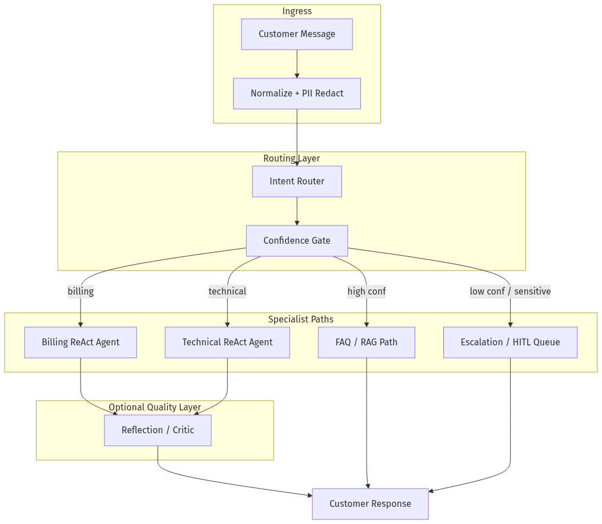
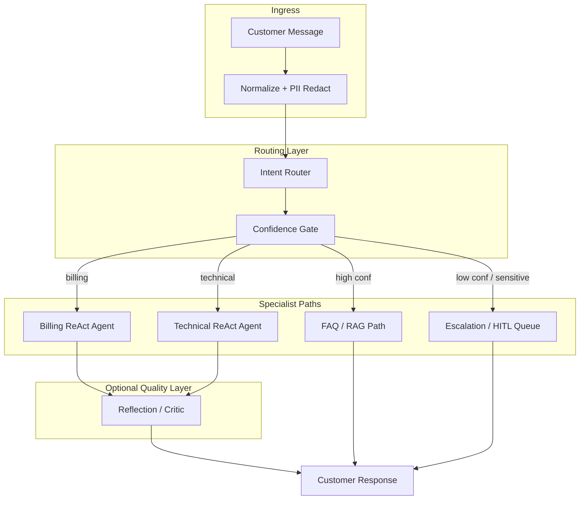
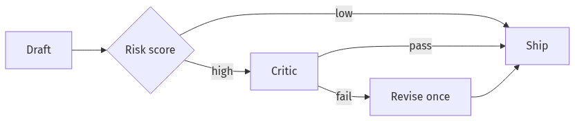
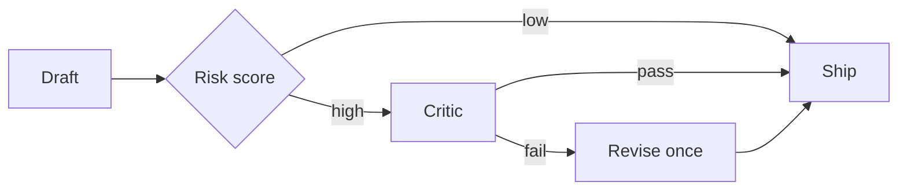
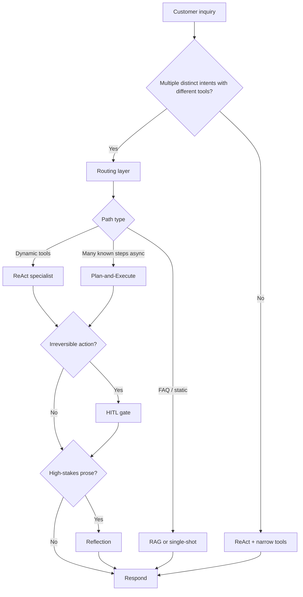
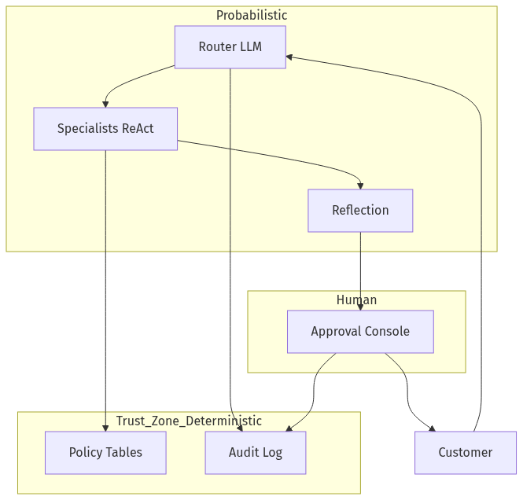
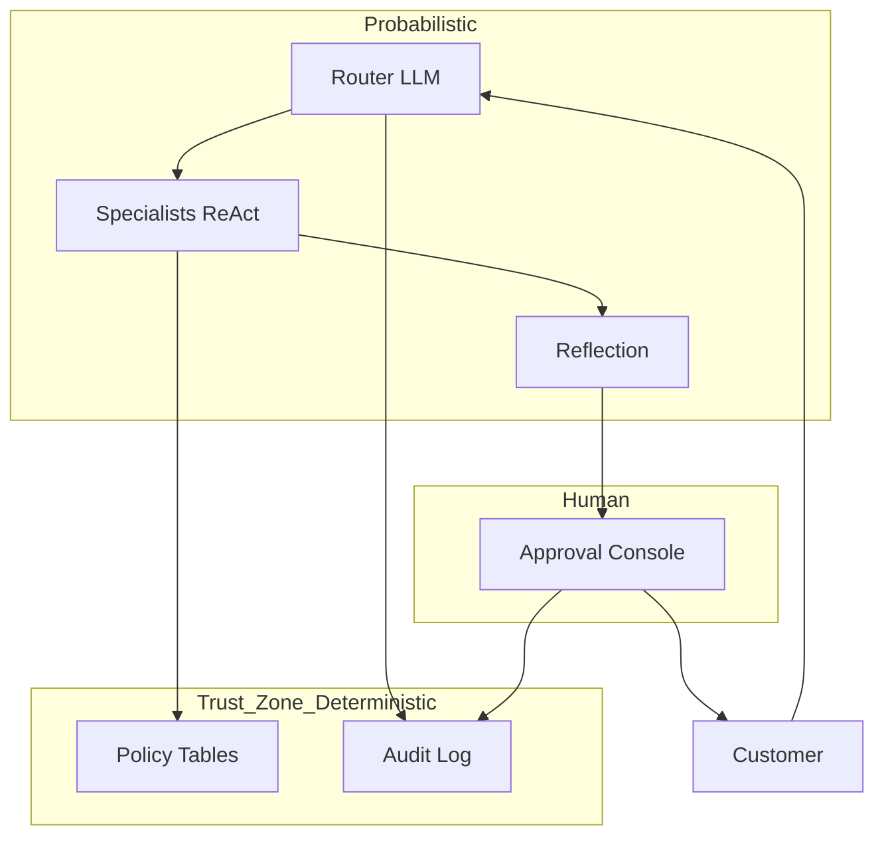
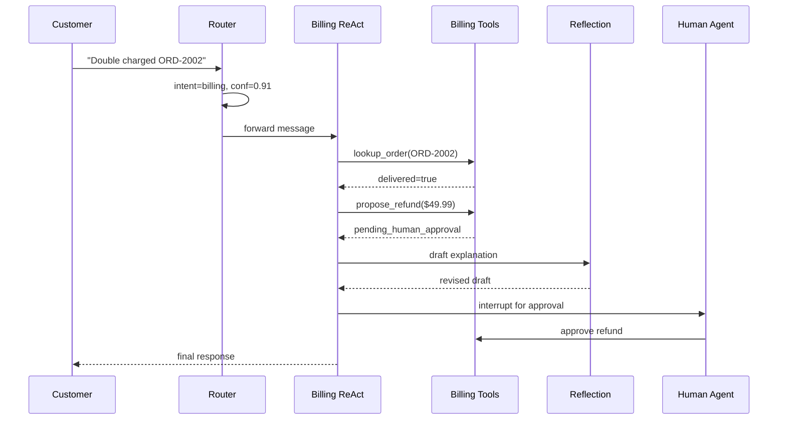

# 03-03 — Agentic Design Patterns: Routing, Reflection, ReAct & More

| Meta | Value |
|------|-------|
| **Estimated Time** | 5–6 hours (read 2.5h · lab 2.5h · design memo 1h) |
| **Difficulty** | Intermediate (patterns) · Advanced (production routing design) |
| **Prerequisites** | [03-01 Agent Anatomy & Loop](03-01-Agent-Anatomy-and-Loop.md) · [03-02 Tools, Memory & Control Flow](03-02-Tools-Memory-Control-Flow.md) |
| **Module** | 03 — Agentic Fundamentals |
| **Related** | [03-01](03-01-Agent-Anatomy-and-Loop.md) · [03-02](03-02-Tools-Memory-Control-Flow.md) · [03-04 LangGraph Production](03-04-LangGraph-Production-Agents.md) · [05-01 Multi-Agent Orchestration](../05-Multi-Agent/05-01-Multi-Agent-Orchestration.md) · [08-02 Observability](../08-Evaluation-LLMOps/08-02-Observability-LangSmith-OTel.md) · [Architecture Index](../../Architecture Index.md) · [Study Plan](../../Study Plan.md) |

---

## Learning Objectives

By the end of this chapter you will be able to:

1. Name six core agentic patterns and explain **when to use** and **when not to use** each.
2. Compose patterns into a **customer inquiry routing agent** with deterministic guardrails.
3. Distinguish **routing** (intent → path) from **ReAct** (think → act → observe) from **plan-and-execute** (plan once, execute many).
4. Apply **reflection** without doubling latency on every request.
5. Place **human-in-the-loop** at trust boundaries, not as a band-aid for bad tools.
6. Design **tool-use** contracts that survive production traffic.

---

## Why This Topic Matters

Frameworks give you loops. Patterns give you **architecture**.

Staff and Principal interviews rarely ask “what is ReAct?” They ask:

- “Why route before you agent?”
- “When would you add a critic?”
- “How do you stop a plan-and-execute agent from executing unsafe steps?”

Patterns are the vocabulary for those answers. A routing agent that sends billing questions to a refund specialist sounds simple until you realize:

- overlapping intents break naive classifiers,
- reflection on every ticket doubles cost,
- plan-and-execute without checkpoints duplicates side effects,
- tool-use without schemas creates silent failures.

This chapter turns pattern names into **production decisions**.

---

## Business Impact

| Business outcome | Pattern lever |
|------------------|---------------|
| **Lower support COGS** | Route 70% of tickets to cheap paths (FAQ, status lookup) before frontier models |
| **Higher CSAT** | Reflection on high-value drafts; skip on password resets |
| **Fewer incidents** | HITL on refunds; deterministic routing for compliance intents |
| **Predictable latency** | Plan-and-execute only for async research; ReAct for interactive tools |
| **Auditability** | Explicit routing decisions logged before tool execution |

---

## Architecture Overview

A production support routing stack typically layers patterns:





**Read this with [03-01](03-01-Agent-Anatomy-and-Loop.md):** every specialist path still runs the Think→Act→Observe loop; routing chooses **which** loop and **which** tools.

---

## Core Concepts

### Pattern Catalog (Quick Reference)

| Pattern | One-line job | Primary cost | Primary risk |
|---------|--------------|--------------|--------------|
| **Routing** | Pick the right specialist path | 1 extra LLM/classifier call | Misroute → wrong tools |
| **ReAct** | Interleave reasoning and tool calls | Multi-step tokens + tool latency | Runaway loops |
| **Tool-use** | Ground actions in APIs | Tool failures, schema drift | Over-privileged tools |
| **Plan-and-Execute** | Plan once, execute steps | Upfront planning tokens | Stale plan mid-flight |
| **Reflection** | Critique and revise output | 2×+ model calls | Latency, critic bias |
| **Human-in-the-loop** | Pause for approval | Ops queue time | False sense of safety |

---

### 1) Routing

#### Definition

**Routing** classifies an incoming request (by intent, domain, risk, or customer tier) and sends it to a **specialist handler**—another agent, a RAG pipeline, a deterministic API, or a human queue.

#### Mental model

Think of a **load balancer for cognition**: same front door, different backends.

#### When to use

- You have **3+ distinct intent classes** with different tools or policies.
- Latency/cost varies widely by path (FAQ vs full agent).
- You need **audit logs** that say “routed to billing because …”.
- Taxonomy is stable enough to evaluate (precision/recall per intent).

#### When NOT to use

- Single intent domain with one tool set → skip router; use ReAct directly.
- Intents overlap heavily with no clear labels → fix taxonomy first or use hybrid retrieval.
- You route **only** to hide a bad monolithic prompt → refactor tools/prompt instead.
- Sub-10ms SLO on every request → use rules/classifier first, LLM router second.

#### Interview discussion

> “We route before we agent because billing tools should never be in the same graph as password reset.”

#### Routing implementation styles

| Style | Pros | Cons |
|-------|------|------|
| Rules / regex | Fast, auditable | Brittle on language variation |
| Embedding classifier | Cheap at scale | Needs labeled data |
| LLM structured output | Flexible | Slower, needs confidence gate |
| Hybrid (rules → LLM) | Best of both | More code paths to test |

---

### 2) ReAct (Reason + Act)

#### Definition

**ReAct** interleaves **reasoning** (chain-of-thought visible to the model), **acting** (tool calls), and **observing** (tool results) until the task completes or a stop condition fires.

Paper: [ReAct: Synergizing Reasoning and Acting](https://arxiv.org/abs/2210.03629)

#### Mental model

A REPL for the world: think, run a command, read stdout, repeat.

#### When to use

- Tool choice **depends on intermediate results** (look up order → then decide refund eligibility).
- Steps are not known upfront (exploratory troubleshooting).
- You need **traceable** reasoning for support/debug (with caveats on exposing raw CoT to users).

#### When NOT to use

- Procedure is fixed (password reset flow) → deterministic workflow.
- All steps known in advance → plan-and-execute or plain orchestration.
- Tools are slow/expensive and plan is stable → plan once, execute without re-planning each step.
- Strict latency budget (<2s p95) with many possible tools → route + smaller tool sets.

#### Relationship to [03-01](03-01-Agent-Anatomy-and-Loop.md)

ReAct **is** the Think→Act→Observe loop with explicit tool observations fed back as messages. Control flow (max iterations, stop tokens) lives in [03-02](03-02-Tools-Memory-Control-Flow.md).

---

### 3) Tool-Use

#### Definition

**Tool-use** gives the model **structured actions**: function schemas, API wrappers, database queries, retrieval, ticket updates. The model selects tools; your runtime executes them and returns observations.

#### Mental model

Syscalls: the LLM is user space; tools are kernel space with permissions.

#### When to use

- Facts must come from systems of record (CRM, billing, inventory).
- Actions must change state (create ticket, apply credit).
- Grounding reduces hallucination on dynamic data.

#### When NOT to use

- Pure language transformation (rewrite, summarize) with no external truth.
- Tool surface is so wide the model confuses similar tools → narrow per route.
- Side effects are irreversible and tool args are ambiguous → HITL + strict schemas first.
- You have not implemented idempotency → fix tools before adding agent autonomy.

#### Production rules

| Rule | Why |
|------|-----|
| One tool = one job | Reduces wrong-tool selection |
| JSON schema + validation | Fail fast before API call |
| Read-only default | Elevate write tools per route |
| Idempotent writes | Safe retries from agent loops |

---

### 4) Plan-and-Execute

#### Definition

**Plan-and-execute** splits work into two phases: (1) a **planner** produces a structured multi-step plan; (2) an **executor** runs steps (often with cheaper/smaller models or deterministic code), optionally re-planning on failure.

#### Mental model

Project manager writes the checklist; engineers execute items; PM revises checklist if blocked.

#### When to use

- Many steps with ** predictable structure** but variable content (research report, migration checklist).
- You want to **parallelize** independent steps after planning.
- Executor steps should use **different models** (frontier planner, mini executor).

#### When NOT to use

- Short single-tool tasks → ReAct overhead wins.
- Environment changes every second → plan goes stale; use ReAct or frequent re-plan gates.
- Interactive chat with user clarifications mid-flight → rigid plans frustrate users.
- No checkpointing → one wrong plan step duplicates side effects.

#### Contrast with ReAct

| Dimension | ReAct | Plan-and-Execute |
|-----------|-------|------------------|
| Planning | Implicit each step | Explicit upfront |
| Adaptability | High | Medium (needs re-plan node) |
| Cost profile | Steady per step | Spike at plan time |
| Best for | Interactive tools | Batch / async workflows |

Deep multi-agent variants: [05-01 Multi-Agent Orchestration](../05-Multi-Agent/05-01-Multi-Agent-Orchestration.md).

---

### 5) Reflection

#### Definition

**Reflection** adds a **critic** pass: a second model invocation (or rule set) evaluates draft output against rubric (accuracy, tone, policy) and optionally triggers revision.

Variants: self-reflection, separate critic model, tool-verified reflection (run checks, not vibes).

#### Mental model

Code review before merge—not every line needs a reviewer on every save.

#### When to use

- Customer-facing prose where tone/compliance matters (retention emails, policy explanations).
- High-value outputs (executive summaries, legal-adjacent FAQs).
- You have **objective rubrics** or tool-based verifiers (citation check, math check).

#### When NOT to use

- Tight latency SLO on every request → reflect only on sampled or high-risk paths.
- Critic has no ground truth → amplifies model bias; add tools/RAG first.
- Simple structured extraction → schema validation beats reflection.
- Cost-sensitive high volume → route 90% away before reflecting the rest.

#### Cost-aware pattern





---

### 6) Human-in-the-Loop (HITL)

#### Definition

**HITL** pauses agent execution before irreversible or high-risk actions until a human approves, edits, or rejects. In graph terms: **interrupt → review → resume** (see [03-04](03-04-LangGraph-Production-Agents.md)).

LangGraph reference: [Human-in-the-loop](https://langchain-ai.github.io/langgraph/concepts/human_in_the_loop/)

#### Mental model

Dual-control for refunds—not for spell-check.

#### When to use

- Money movement, account closure, legal commitments, medical advice boundaries.
- Model confidence below threshold on regulated intents.
- Customer explicitly requests human (escalation path).
- Audit requires named approver on action.

#### When NOT to use

- Fully reversible low-risk actions (suggest reply draft user can edit).
- HITL replaces missing evals → measure first, automate the safe tail.
- Ops queue cannot meet SLA → you have a product problem, not an AI pattern problem.
- Every message → humans become the bottleneck; route + automate the long tail.

#### HITL placement

| Good | Bad |
|------|-----|
| Before `issue_refund()` | After customer already saw wrong answer |
| On structured action payload | On entire conversation transcript |
| With diff of proposed tool args | With vague “please review” |

---

## Pattern Composition Decision Tree



---

## Implementation

### Customer Inquiry Routing Agent (Production-Shaped)

This implementation composes **routing**, **ReAct specialists**, **tool-use**, optional **reflection**, and **HITL** for refunds. It uses LangGraph-style structure without requiring you to have completed [03-04](03-04-LangGraph-Production-Agents.md) first.

```python
"""Customer inquiry routing agent — pattern composition lab.

Patterns demonstrated:
  - Routing (intent → specialist)
  - ReAct loops inside specialists
  - Tool-use with schema validation
  - Reflection on customer-facing drafts
  - HITL gate before refund tool

Run:
  pip install langgraph langchain-openai pydantic
  export OPENAI_API_KEY=...
  python routing_agent.py

Observability: trace each route decision — see 08-02.
"""

from __future__ import annotations

import json
import uuid
from dataclasses import dataclass, field
from datetime import datetime, timezone
from enum import Enum
from typing import Annotated, Any, Literal, TypedDict

from langchain_core.messages import AIMessage, BaseMessage, HumanMessage, SystemMessage
from langchain_openai import ChatOpenAI
from langgraph.graph import END, START, StateGraph
from langgraph.graph.message import add_messages
from pydantic import BaseModel, Field, ValidationError


# ---------------------------------------------------------------------------
# Domain models & fake tools (swap for real CRM/billing APIs)
# ---------------------------------------------------------------------------

class Intent(str, Enum):
    FAQ = "faq"
    ORDER_STATUS = "order_status"
    BILLING = "billing"
    TECHNICAL = "technical"
    ESCALATE = "escalate"


class RouteDecision(BaseModel):
    intent: Intent
    confidence: float = Field(ge=0.0, le=1.0)
    rationale: str


class OrderLookupResult(BaseModel):
    order_id: str
    status: str
    delivered: bool


class RefundProposal(BaseModel):
    order_id: str
    amount_usd: float = Field(gt=0, le=500)
    reason: str


FAKE_ORDERS: dict[str, OrderLookupResult] = {
    "ORD-1001": OrderLookupResult(order_id="ORD-1001", status="shipped", delivered=False),
    "ORD-2002": OrderLookupResult(order_id="ORD-2002", status="delivered", delivered=True),
}

REFUND_QUEUE: list[dict[str, Any]] = []
AUDIT: list[dict[str, Any]] = []


def audit(event: str, payload: dict[str, Any]) -> None:
    AUDIT.append({"ts": datetime.now(timezone.utc).isoformat(), "event": event, **payload})


def lookup_order(order_id: str) -> dict[str, Any]:
    result = FAKE_ORDERS.get(order_id.upper())
    if not result:
        return {"error": "order_not_found", "order_id": order_id}
    return result.model_dump()


def propose_refund(proposal: RefundProposal) -> dict[str, Any]:
    """Side effect queued — in production, HITL approves before calling payment API."""
    ticket = {
        "proposal_id": str(uuid.uuid4()),
        "status": "pending_human_approval",
        **proposal.model_dump(),
    }
    REFUND_QUEUE.append(ticket)
    audit("refund_proposed", ticket)
    return ticket


TOOLS_SPEC = [
    {
        "name": "lookup_order",
        "description": "Fetch order status by order_id",
        "parameters": {
            "type": "object",
            "properties": {"order_id": {"type": "string"}},
            "required": ["order_id"],
        },
    },
    {
        "name": "propose_refund",
        "description": "Propose a refund up to $500 — requires human approval",
        "parameters": RefundProposal.model_json_schema(),
    },
]


def run_tool(name: str, args: dict[str, Any]) -> dict[str, Any]:
    if name == "lookup_order":
        return lookup_order(args["order_id"])
    if name == "propose_refund":
        try:
            proposal = RefundProposal.model_validate(args)
        except ValidationError as e:
            return {"error": "validation_failed", "details": e.errors()}
        return propose_refund(proposal)
    return {"error": "unknown_tool", "name": name}


# ---------------------------------------------------------------------------
# Graph state
# ---------------------------------------------------------------------------

class AgentState(TypedDict):
    messages: Annotated[list[BaseMessage], add_messages]
    route: RouteDecision | None
    draft_response: str | None
    reflection_notes: str | None
    hitl_required: bool
    thread_id: str


llm = ChatOpenAI(model="gpt-4.1-mini", temperature=0)
router_llm = llm.with_structured_output(RouteDecision)


# ---------------------------------------------------------------------------
# Node: Router (Routing pattern)
# ---------------------------------------------------------------------------

ROUTER_SYSTEM = """You are an intent router for Acme Shop support.
Choose exactly one intent:
- faq: general policy questions answerable from static FAQ
- order_status: where is my order, tracking
- billing: refunds, charges, invoices
- technical: product bugs, login errors, app crashes
- escalate: legal threats, harassment, or confidence < 0.55

Be conservative: billing/refund language → billing. Angry + charge → billing.
If ambiguous, choose escalate with low confidence."""


def route_node(state: AgentState) -> dict[str, Any]:
    user_text = next(m.content for m in reversed(state["messages"]) if isinstance(m, HumanMessage))
    decision = router_llm.invoke(
        [SystemMessage(content=ROUTER_SYSTEM), HumanMessage(content=str(user_text))]
    )
    audit("route", {"intent": decision.intent.value, "confidence": decision.confidence})
    return {"route": decision}


def route_selector(state: AgentState) -> str:
    assert state["route"] is not None
    r = state["route"]
    if r.confidence < 0.55 or r.intent == Intent.ESCALATE:
        return "escalate"
    if r.intent == Intent.FAQ:
        return "faq"
    if r.intent == Intent.ORDER_STATUS:
        return "order_status"
    if r.intent == Intent.BILLING:
        return "billing"
    if r.intent == Intent.TECHNICAL:
        return "technical"
    return "escalate"


# ---------------------------------------------------------------------------
# Nodes: Specialists
# ---------------------------------------------------------------------------

FAQ_ANSWERS = {
    "return": "Returns accepted within 30 days with receipt.",
    "shipping": "Standard shipping 3–5 business days.",
}


def faq_node(state: AgentState) -> dict[str, Any]:
    text = str(state["messages"][-1].content).lower()
    answer = FAQ_ANSWERS.get("return") if "return" in text else FAQ_ANSWERS["shipping"]
    draft = f"{answer} (FAQ path — no tools invoked)"
    return {"draft_response": draft, "hitl_required": False}


def react_specialist(state: AgentState, domain: str, max_steps: int = 4) -> dict[str, Any]:
    """ReAct + Tool-use loop (simplified explicit loop for clarity)."""
    system = SystemMessage(
        content=(
            f"You are a {domain} support agent. Use tools when needed. "
            "For refunds, call propose_refund only when policy clearly applies. "
            "Never invent order data."
        )
    )
    msgs: list[BaseMessage] = [system] + state["messages"]
    hitl = False
    last_observation: dict[str, Any] | None = None

    for step in range(max_steps):
        ai = llm.bind_tools(TOOLS_SPEC).invoke(msgs)
        msgs.append(ai)

        if not ai.tool_calls:
            return {
                "messages": [ai],
                "draft_response": str(ai.content),
                "hitl_required": hitl,
            }

        for call in ai.tool_calls:
            obs = run_tool(call["name"], call["args"])
            last_observation = obs
            msgs.append(
                AIMessage(
                    content="",
                    tool_calls=[],
                    additional_kwargs={"tool_result": obs},  # teaching simplification
                )
            )
            # In LangChain, use ToolMessage — shown abbreviated here
            msgs.append(HumanMessage(content=f"TOOL_RESULT {call['name']}: {json.dumps(obs)}"))
            if call["name"] == "propose_refund":
                hitl = True

    fallback = "I'm still working on your request; escalating to a human."
    if last_observation and last_observation.get("error"):
        fallback = f"Blocked: {last_observation['error']}. Connecting you to an agent."
        hitl = True
    return {"draft_response": fallback, "hitl_required": hitl}


def order_status_node(state: AgentState) -> dict[str, Any]:
    return react_specialist(state, domain="order status")


def billing_node(state: AgentState) -> dict[str, Any]:
    return react_specialist(state, domain="billing")


def technical_node(state: AgentState) -> dict[str, Any]:
    return react_specialist(state, domain="technical")


def escalate_node(state: AgentState) -> dict[str, Any]:
    draft = (
        "I'm connecting you with a specialist who can help further. "
        "Expected response within 4 business hours."
    )
    return {"draft_response": draft, "hitl_required": True}


# ---------------------------------------------------------------------------
# Reflection pattern (conditional)
# ---------------------------------------------------------------------------

REFLECT_RUBRIC = """Score the draft 1-5 on: accuracy, empathy, policy compliance.
If any score < 4, rewrite the draft once. Output JSON:
{"scores": {"accuracy": n, "empathy": n, "policy": n}, "final_draft": "..."}"""


def reflection_node(state: AgentState) -> dict[str, Any]:
    if not state.get("draft_response"):
        return {}
    if not state.get("hitl_required"):  # skip reflection on low-risk FAQ
        prompt = [
            SystemMessage(content=REFLECT_RUBRIC),
            HumanMessage(content=f"Draft:\n{state['draft_response']}"),
        ]
        raw = llm.invoke(prompt).content
        try:
            parsed = json.loads(str(raw))
            return {
                "draft_response": parsed.get("final_draft", state["draft_response"]),
                "reflection_notes": str(parsed.get("scores")),
            }
        except json.JSONDecodeError:
            return {"reflection_notes": "reflection_parse_failed"}
    return {}


# ---------------------------------------------------------------------------
# HITL pattern — interrupt surrogate (CLI demo)
# ---------------------------------------------------------------------------

def hitl_gate_node(state: AgentState) -> dict[str, Any]:
    if not state.get("hitl_required"):
        return {}
    audit("hitl_required", {"draft": state.get("draft_response"), "queue": REFUND_QUEUE[-1:]})
    # Production: graph interrupt — see 03-04
    approved = True  # demo assumes human approved in backoffice
    if not approved:
        return {"draft_response": "Your request was not approved.", "hitl_required": True}
    return {"hitl_required": False}


def finalize_node(state: AgentState) -> dict[str, Any]:
    text = state.get("draft_response") or "Thanks for contacting Acme Shop."
    return {"messages": [AIMessage(content=text)]}


# ---------------------------------------------------------------------------
# Build graph
# ---------------------------------------------------------------------------

def build_graph():
    g = StateGraph(AgentState)
    g.add_node("route", route_node)
    g.add_node("faq", faq_node)
    g.add_node("order_status", order_status_node)
    g.add_node("billing", billing_node)
    g.add_node("technical", technical_node)
    g.add_node("escalate", escalate_node)
    g.add_node("reflect", reflection_node)
    g.add_node("hitl", hitl_gate_node)
    g.add_node("finalize", finalize_node)

    g.add_edge(START, "route")
    g.add_conditional_edges(
        "route",
        route_selector,
        {
            "faq": "faq",
            "order_status": "order_status",
            "billing": "billing",
            "technical": "technical",
            "escalate": "escalate",
        },
    )
    for specialist in ["faq", "order_status", "billing", "technical", "escalate"]:
        g.add_edge(specialist, "reflect")
    g.add_edge("reflect", "hitl")
    g.add_edge("hitl", "finalize")
    g.add_edge("finalize", END)
    return g.compile()


if __name__ == "__main__":
    graph = build_graph()
    thread_id = str(uuid.uuid4())
    result = graph.invoke(
        {
            "messages": [HumanMessage(content="I was charged twice for order ORD-2002. Refund one payment.")],
            "route": None,
            "draft_response": None,
            "reflection_notes": None,
            "hitl_required": False,
            "thread_id": thread_id,
        },
        config={"configurable": {"thread_id": thread_id}},
    )
    print(result["messages"][-1].content)
    print("AUDIT tail:", AUDIT[-3:])
    print("REFUND_QUEUE:", REFUND_QUEUE)
```

#### Design notes on the example

1. **Router runs first** — specialists never see each other's tools.
2. **Billing path** gets write-capable tools; FAQ path stays tool-free.
3. **Reflection skipped** when `hitl_required` — ops reviews anyway ([08-02](../08-Evaluation-LLMOps/08-02-Observability-LangSmith-OTel.md) traces both paths).
4. **HITL** sits after draft, before customer send — matches [03-04 interrupt model](03-04-LangGraph-Production-Agents.md).

---

### Plan-and-Execute Snippet (Async Research Path)

Use for “investigate this account history and summarize” — not live chat under 3s SLO.

```python
from pydantic import BaseModel, Field


class PlanStep(BaseModel):
    id: int
    action: Literal["lookup_order", "fetch_tickets", "summarize"]
    args: dict[str, str] = Field(default_factory=dict)


class SupportPlan(BaseModel):
    steps: list[PlanStep]


def plan_and_execute(user_goal: str, order_id: str) -> str:
    planner = ChatOpenAI(model="gpt-4.1", temperature=0)
    plan: SupportPlan = planner.with_structured_output(SupportPlan).invoke(
        [
            SystemMessage(
                content="Emit 2-4 steps using actions: lookup_order, fetch_tickets, summarize."
            ),
            HumanMessage(content=f"Goal: {user_goal}\nOrder: {order_id}"),
        ]
    )

    context: dict[str, Any] = {"order_id": order_id}
    executor = ChatOpenAI(model="gpt-4.1-mini", temperature=0)

    for step in plan.steps:
        if step.action == "lookup_order":
            context["order"] = lookup_order(order_id)
        elif step.action == "fetch_tickets":
            context["tickets"] = [{"id": "T-1", "topic": "billing"}]  # stub
        elif step.action == "summarize":
            summary = executor.invoke(
                [
                    HumanMessage(
                        content=f"Summarize for customer support: {json.dumps(context)}"
                    )
                ]
            )
            return str(summary.content)

    return "Plan did not produce summarize step."
```

**When NOT here:** customer asks “where is my package?” → order_status ReAct path is faster.

---

## Production Considerations

| Concern | Pattern-specific practice |
|---------|---------------------------|
| Router drift | Weekly eval on intent confusion matrix |
| ReAct loops | Hard cap iterations; log tool sequence |
| Reflection cost | Gate by route + risk score |
| Plan stale | Re-plan node after failed tool |
| HITL SLA | Queue metrics, not model metrics alone |

Instrument routes and tool spans per [08-02 Observability](../08-Evaluation-LLMOps/08-02-Observability-LangSmith-OTel.md).

---

## Security

| Threat | Pattern control |
|--------|-----------------|
| Prompt injection steers router | Separate system prompts; never pass raw HTML as intent labels |
| Tool privilege escalation | Route-scoped tool allowlists |
| Reflection laundering unsafe content | Critic checks policy list, not just tone |
| HITL fatigue → rubber stamp | Sample review quality; require arg diff view |

---

## Performance

| Path | Typical p95 | Pattern |
|------|-------------|---------|
| FAQ / rules | 200–800 ms | Routing only |
| ReAct + 2 tools | 2–6 s | Tool latency dominates |
| + Reflection | +1–3 s | Skip on low risk |
| Plan-and-execute | 5–30 s async | Not for sync chat |

**Rule:** Route cheap first; measure before adding reflection everywhere.

---

## Cost

| Pattern | Token profile | Cost lever |
|---------|---------------|------------|
| Routing | +500–1.5K tokens/request | Smaller router model |
| ReAct | N × (think + tool JSON) | Cap steps; mini executor |
| Reflection | ~2× draft tokens | Conditional gate |
| Plan-and-Execute | Large plan + M executors | Cache plans by intent template |
| HITL | Model + human minutes | Automate tail after eval |

---

## Scalability

- **Horizontally scale routers** statelessly; sticky sessions only for memory ([03-02](03-02-Tools-Memory-Control-Flow.md)).
- **Shard specialists** by domain team ownership (billing graph ≠ tech graph).
- **Queue HITL** actions; never block HTTP worker on human.

Multi-agent scale-out patterns: [05-01](../05-Multi-Agent/05-01-Multi-Agent-Orchestration.md).

---

## Failure Modes

| Failure | Symptom | Mitigation |
|---------|---------|------------|
| Router always picks billing | Wrong refunds | Confusion matrix eval; merge intents |
| ReAct infinite loop | Timeout, cost spike | max_iterations + circuit breaker |
| Plan executes wrong order | Bad customer email | Structured plan schema; step validators |
| Reflection agrees with bad draft | Polished wrong answer | Tool-verified critics |
| HITL bypass bug | Refunds without approval | Tool only callable post-resume token |

---

## Observability

Minimum fields per request:

```text
trace_id, thread_id, route_intent, route_confidence,
specialist_path, tool_names[], iteration_count,
reflection_applied, hitl_required, hitl_outcome,
latency_ms_route, latency_ms_specialist, cost_usd
```

LangSmith project setup: [LangSmith docs](https://docs.langchain.com/langsmith/home) · chapter [08-02](../08-Evaluation-LLMOps/08-02-Observability-LangSmith-OTel.md).

---

## Debugging

| Symptom | First check |
|---------|-------------|
| Wrong department | Router logs + labeled eval set |
| Tool not called | Tool descriptions vs user phrasing |
| Slow responses | Count ReAct iterations; reflection on? |
| Refunds duplicate | Idempotency keys on propose_refund |

---

## Common Mistakes

1. One mega-agent with all tools instead of routing.
2. Reflection on every message “for quality.”
3. Plan-and-execute for synchronous chat.
4. HITL after the customer already received the answer.
5. Routing labels that mirror org chart, not customer language.

---

## Tradeoffs

| Composition | Upside | Downside |
|-------------|--------|----------|
| Route → ReAct | Safe tools, clearer evals | +router latency |
| Route → RAG FAQ | Cheapest path | Stale FAQ if not maintained |
| ReAct + Reflection | Better prose | 2× model on that path |
| Plan-and-Execute async | Parallel steps | Stale plans |
| HITL on writes | Compliance | Ops cost |

---

## Architecture Diagram — Customer Inquiry Routing





---

## Mermaid Diagram — Sequence (Billing + HITL)



---

## Production Examples

| Company pattern | Pattern stack |
|-----------------|---------------|
| Tier-1 support automation | Route → FAQ/RAG; escalate tail |
| Fintech disputes | Route → ReAct read tools → HITL write |
| Internal IT bot | ReAct with CMDB tools; no reflection |
| Research copilot | Plan-and-execute + reflection |

---

## Real Companies Using It (Public Patterns)

| Org | Public pattern | Lesson |
|-----|----------------|--------|
| **Klarna** | Support automation with measurement | Route before full agent |
| **Shopify** | Merchant support tooling | Domain-specific specialists |
| **LangChain case studies** | LangGraph routing graphs | Stateful HITL in production |

> Pattern references only—not claims about your operating their stacks.

---

## Hands-on Labs

### Lab A — Router eval (60 min)

Build 30 labeled inquiries; measure per-intent precision/recall. Target: billing recall ≥ 0.95 before enabling refund tools.

### Lab B — Remove reflection (30 min)

A/B latency and human rating with reflection on vs off for FAQ path. Expect FAQ needs no critic.

### Lab C — HITL failure injection (45 min)

Force `propose_refund` without approval path; verify tool cannot hit payment API.

---

## Coding Assignments

1. Add embedding-based router fallback when LLM confidence < 0.6.
2. Implement plan-and-execute branch for “account history summary” async endpoint.
3. Export OpenTelemetry spans for `route`, `react_step`, `reflect`, `hitl` ([08-02](../08-Evaluation-LLMOps/08-02-Observability-LangSmith-OTel.md)).

---

## Mini Project

**Title:** Inquiry Router v0  
**Done when:** Five intents route correctly on eval set; billing refunds pause for HITL; audit log reconstructs path.

---

## Production Project

**Title:** Support Routing Graph  
**Done when:** LangGraph compiled graph ([03-04](03-04-LangGraph-Production-Agents.md)), checkpointed threads, LangSmith traces, RM approval UI.

---

## Stretch Project

Add a **supervisor** that delegates to billing/tech subgraphs ([05-01](../05-Multi-Agent/05-01-Multi-Agent-Orchestration.md)). Compare latency vs flat router.

---

## Interview Questions

### Senior Engineer

1. When do you route vs single ReAct agent?
2. What tools belong on the billing path only?
3. Where would you put reflection?

### Staff Engineer

1. Design customer inquiry routing for 10M tickets/month.
2. How do you eval router regressions?
3. Plan-and-execute vs ReAct for dispute investigation?

### Principal Engineer

1. Org-wide pattern library: which patterns are platform vs product?
2. How do you prevent HITL rubber-stamping at scale?
3. Cost model for route + reflect + HITL.

### Engineering Manager

1. Staffing router evals vs building new specialists?
2. KPIs for automated resolution vs CSAT?
3. When do you pause rollout after misroute incident?

### Whiteboard

Draw route → specialist → HITL for duplicate charge scenario.

### Follow-ups

- What if intents are multilingual?
- What if router and specialist disagree?
- When do you fine-tune the router vs prompt it?

---

## Revision Notes

- **Route before you agent** when tools differ by domain.
- **ReAct** for interactive tool choice; **plan-and-execute** for async multi-step.
- **Reflect** high-stakes prose, not password resets.
- **HITL** on irreversible tools, not on all chats.
- **Tool-use** needs schemas, idempotency, route-scoped allowlists.

---

## Summary

Agentic design patterns are **composable control structures**, not buzzwords. Production excellence is picking the **minimum pattern stack** that meets quality, latency, cost, and risk—and measuring each layer ([08-02](../08-Evaluation-LLMOps/08-02-Observability-LangSmith-OTel.md)). The customer inquiry routing agent is the canonical lab: **router → specialist ReAct → conditional reflection → HITL on writes**.

---

## Further Reading

| Title | URL | Difficulty | Reading Time | Why Read | Important Sections |
|-------|-----|------------|--------------|----------|--------------------|
| LangGraph High Level | https://langchain-ai.github.io/langgraph/concepts/high_level/ | Intro | 25 min | Persistence + HITL foundation for patterns | Benefits; state; checkpointers |
| LangGraph Human-in-the-Loop | https://langchain-ai.github.io/langgraph/concepts/human_in_the_loop/ | Intermediate | 30 min | Interrupt/resume semantics | Breakpoints; approve/edit |
| ReAct Paper | https://arxiv.org/abs/2210.03629 | Intermediate | 45 min | Original Think-Act-Observe | Examples; synergy |
| LangSmith | https://docs.langchain.com/langsmith/home | Intro | 20 min | Trace routes and tool loops | Projects; runs; feedback |
| Agent Anatomy (handbook) | [03-01](03-01-Agent-Anatomy-and-Loop.md) | Intro | 40 min | Loop beneath all patterns | Think→Act→Observe |
| Multi-Agent Orchestration | [05-01](../05-Multi-Agent/05-01-Multi-Agent-Orchestration.md) | Advanced | 50 min | When routing becomes supervision | Supervisor pattern |

---

## Resume Bullet (after lab)

- Composed a **production customer inquiry routing agent** using routing, ReAct specialists, schema-validated tool-use, conditional reflection, and HITL-gated refund actions—with full audit tracing and intent-level eval gates.
