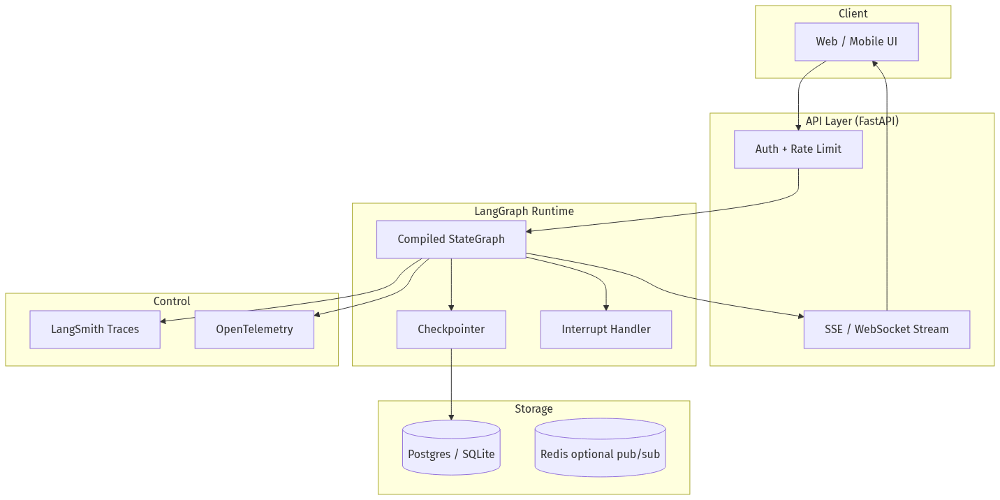
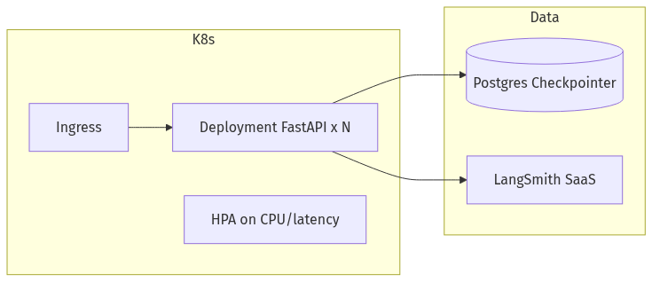
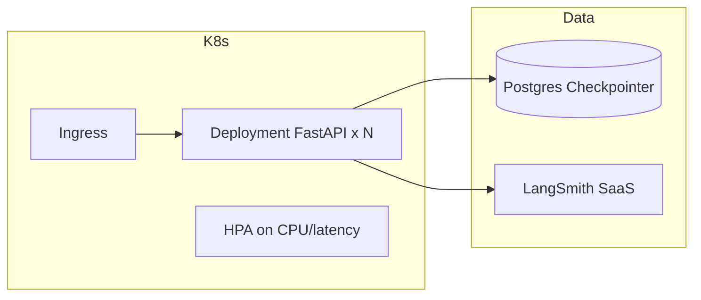
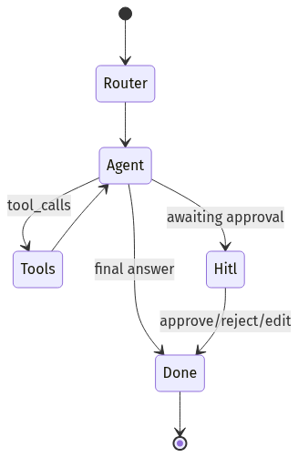
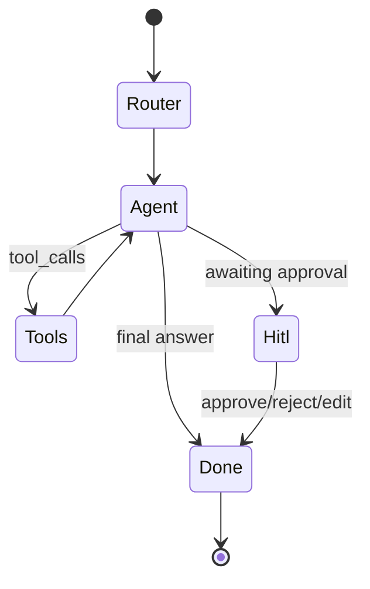
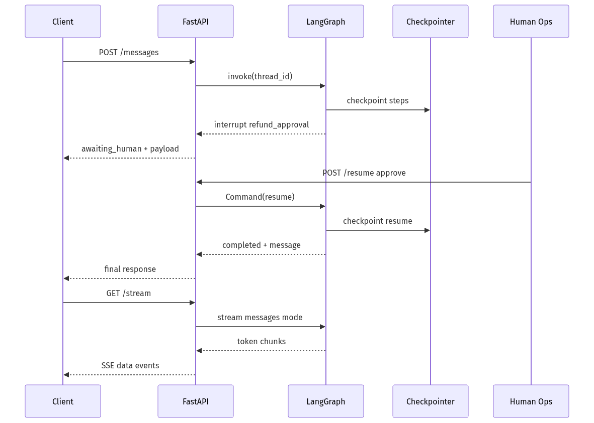
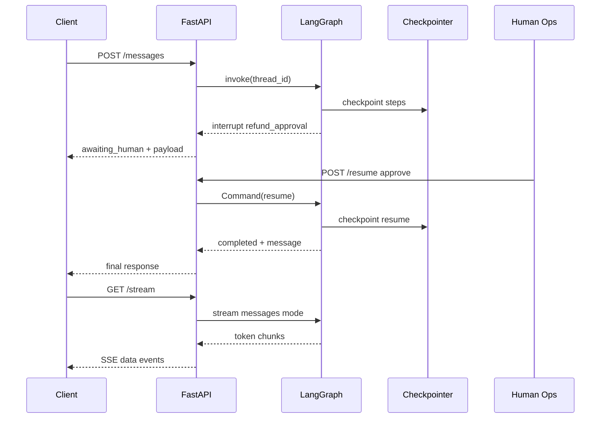

# 03-04 — LangGraph Production Agents: State, Memory, HITL & Deployment

| Meta | Value |
|------|-------|
| **Estimated Time** | 6–7 hours (read 3h · lab 3h · deploy drill 1h) |
| **Difficulty** | Intermediate (LangGraph API) · Advanced (production deployment) |
| **Prerequisites** | [03-01 Agent Anatomy & Loop](03-01-Agent-Anatomy-and-Loop.md) · [03-02 Tools, Memory & Control Flow](03-02-Tools-Memory-Control-Flow.md) · [03-03 Agentic Design Patterns](03-03-Agentic-Design-Patterns.md) |
| **Module** | 03 — Agentic Fundamentals |
| **Related** | [03-01](03-01-Agent-Anatomy-and-Loop.md) · [03-02](03-02-Tools-Memory-Control-Flow.md) · [03-03](03-03-Agentic-Design-Patterns.md) · [05-01 Multi-Agent Orchestration](../05-Multi-Agent/05-01-Multi-Agent-Orchestration.md) · [08-02 Observability](../08-Evaluation-LLMOps/08-02-Observability-LangSmith-OTel.md) · [Architecture Index](../../Architecture Index.md) · [Study Plan](../../Study Plan.md) |

---

## Learning Objectives

By the end of this chapter you will be able to:

1. Build a **StateGraph** with typed state, nodes, and conditional edges.
2. Use **MessagesState** / `add_messages` reducers for chat history without duplication bugs.
3. Configure **memory** via thread IDs and checkpointing backends.
4. Implement **interrupts** and **human-in-the-loop** approve/edit/reject flows.
5. Stream **tokens and graph events** to clients with clear UX contracts.
6. Wrap a **compiled graph** in production **FastAPI** with auth, timeouts, and observability hooks.
7. Know when to stay single-graph vs delegate to **multi-agent** topologies ([05-01](../05-Multi-Agent/05-01-Multi-Agent-Orchestration.md)).

---

## Why This Topic Matters

Notebooks call `graph.invoke()` once. Production runs graphs **thousands of times per hour** with:

- concurrent threads,
- mid-flight human approvals,
- server restarts mid-conversation,
- streaming UI,
- and on-call engineers reading traces at 2 a.m.

LangGraph is not “yet another agent wrapper.” It is a **state machine runtime** for agents: persistence, interrupts, and streaming are first-class. That is why it appears in the Architecture Index alongside routing and HITL patterns ([03-03](03-03-Agentic-Design-Patterns.md)).

If you skip this chapter, you will re-implement checkpointing badly and discover HITL race conditions in staging.

---

## Business Impact

| Business outcome | LangGraph capability |
|------------------|----------------------|
| **Resume conversations** | Checkpointing + thread_id |
| **Compliance approvals** | Interrupt before side-effect nodes |
| **Responsive UX** | Streaming modes (`messages`, `updates`, `custom`) |
| **Lower incident MTTR** | LangSmith traces per node ([08-02](../08-Evaluation-LLMOps/08-02-Observability-LangSmith-OTel.md)) |
| **Safe deploys** | Graph version pinned; state schema migrated deliberately |

Official overview: [LangGraph high-level concepts](https://langchain-ai.github.io/langgraph/concepts/high_level/)

---

## Architecture Overview

```mermaid
flowchart TB
    subgraph Client
      UI[Web / Mobile UI]
    end
    subgraph API_Layer["API Layer (FastAPI)"]
      GW[Auth + Rate Limit]
      SSE[SSE / WebSocket Stream]
    end
    subgraph LangGraph_Runtime["LangGraph Runtime"]
      SG[Compiled StateGraph]
      CP[Checkpointer]
      INT[Interrupt Handler]
    end
    subgraph Storage
      PG[(Postgres / SQLite)]
      REDIS[(Redis optional pub/sub)]
    end
    subgraph Control
      LS[LangSmith Traces]
      OTEL[OpenTelemetry]
    end
    UI --> GW --> SG
    SG --> CP --> PG
    SG --> INT
    SG --> SSE --> UI
    SG --> LS
    SG --> OTEL
```






**Mental model:** FastAPI owns HTTP; LangGraph owns **agent state transitions**; checkpointer owns **durability**.

---

## Core Concepts

### 1) StateGraph

#### Definition

A **StateGraph** defines:

- **State schema** (TypedDict / Pydantic) — what flows between nodes.
- **Nodes** — Python callables that return partial state updates.
- **Edges** — fixed or conditional transitions.
- **Compile** — produces a runnable graph with optional checkpointer, interrupt points, and debug hooks.

#### When to use

- Multi-step agents with branching ([03-03 routing](03-03-Agentic-Design-Patterns.md)).
- Need persistence, HITL, or resume after failure.
- Tool loops with explicit max-iteration guards ([03-01](03-01-Agent-Anatomy-and-Loop.md)).

#### When NOT to use

- Single LLM call with no state → direct API call.
- Hard real-time (<100ms) path with no branching → deterministic code.
- Team unwilling to operate checkpointer DB → you will lose threads on deploy.

---

### 2) MessagesState & Reducers

#### Definition

**MessagesState** is a built-in state shape:

```python
class MessagesState(TypedDict):
    messages: Annotated[list[AnyMessage], add_messages]
```

The **`add_messages` reducer** merges new messages intelligently (update-by-id, append) instead of blind list concat—critical for tool call repair and human edits.

#### Mental model

Reducer = **how partial updates combine**. Wrong reducer → duplicated tool messages or lost history.

#### When to use

- Chat agents where state is primarily conversation + optional fields.
- You want LangChain message types (`HumanMessage`, `AIMessage`, `ToolMessage`).

#### When NOT to use

- Pure JSON workflow state with no chat → custom TypedDict only.
- You need complex CRDT-style merging → design custom reducers.

See also memory patterns in [03-02](03-02-Tools-Memory-Control-Flow.md).

---

### 3) Memory

#### Definition

In LangGraph, **memory** = **checkpointed thread state** keyed by `thread_id` (plus optional long-term store for cross-thread facts).

| Memory type | Scope | Mechanism |
|-------------|-------|-----------|
| **Short-term (thread)** | One conversation | Checkpointer + `thread_id` |
| **Working** | Current run | In-memory state during `invoke/stream` |
| **Long-term** | Cross-session user facts | Store API / external DB ([03-02](03-02-Tools-Memory-Control-Flow.md)) |

#### When to use thread memory

- Multi-turn support tickets, copilots, onboarding wizards.

#### When NOT to rely on thread memory alone

- User switches device and expects recall → add long-term store keyed by `user_id`.
- Compliance deletion requests → implement thread purge + store TTL.

---

### 4) Checkpointing

#### Definition

**Checkpointing** persists graph state after each super-step so runs survive process restarts and can **time-travel** debug.

Common checkpointers:

| Backend | Use case |
|---------|----------|
| `MemorySaver` | Local dev/tests only |
| `SqliteSaver` | Laptop demos, single-node |
| `PostgresSaver` | Production multi-worker |

#### When to use

- Always in production multi-turn agents.
- HITL flows that may wait hours/days for human action.

#### When NOT to use

- Stateless one-shot transforms (still OK with MemorySaver in tests).
- You have not planned schema migrations for state fields.

#### Production rule

**Same `thread_id` + same checkpointer DB** across all API workers. Sticky sessions alone are insufficient.

---

### 5) Interrupts & Human-in-the-Loop

#### Definition

**Interrupts** pause graph execution **before or after** specified nodes until you resume with a command (`Command(resume=...)`) or human input.

Docs: [Human-in-the-loop](https://langchain-ai.github.io/langgraph/concepts/human_in_the_loop/)

Patterns:

| Pattern | Behavior |
|---------|----------|
| **Approve / reject** | Human confirms tool args |
| **Edit state** | Human modifies draft message in checkpoint |
| **Escalate** | Route to external queue; resume later |

#### When to use

- Irreversible tools (payments, deletes, external sends).
- Regulatory dual-control ([03-03 HITL](03-03-Agentic-Design-Patterns.md)).

#### When NOT to use

- Blocking HTTP request thread waiting for human → use async job + webhook resume.
- HITL as substitute for missing tool authZ.

---

### 6) Streaming

#### Definition

LangGraph supports streaming **graph execution events**—not just LLM tokens.

Docs: [Streaming](https://langchain-ai.github.io/langgraph/concepts/streaming/)

| Mode | Streams |
|------|---------|
| `values` | Full state after each step |
| `updates` | Partial state updates per node |
| `messages` | LLM tokens + metadata |
| `custom` | User-defined chunks from nodes |
| `debug` | Internal execution detail |

#### When to use

- Chat UX (token streaming).
- Admin UI showing “Searching orders…” (`custom` or `updates`).

#### When NOT to use

- Batch ETL pipelines → `invoke` + log file is enough.
- You expose `debug` stream to end users → leak internals.

---

### 7) Multi-Agent Notes

LangGraph supports **subgraphs**, **supervisor routing**, and **handoffs** between agents.

Docs: [Multi-agent](https://langchain-ai.github.io/langgraph/concepts/multi_agent/)

| Topology | When |
|----------|------|
| **Supervisor** | Central router delegates to specialists ([05-01](../05-Multi-Agent/05-01-Multi-Agent-Orchestration.md)) |
| **Swarm / handoff** | Agents pass control with shared thread |
| **Hierarchical** | Planner graph invokes worker subgraphs |

#### When to use multi-agent graphs

- Clear domain boundaries with different tools/prompts.
- Teams own subgraphs independently.

#### When NOT to use

- One generalist would work with routing ([03-03](03-03-Agentic-Design-Patterns.md)).
- Coordination overhead exceeds quality gain (measure on eval set).

This chapter stays **single-graph production depth**; orchestration scale lives in [05-01](../05-Multi-Agent/05-01-Multi-Agent-Orchestration.md).

---

## Implementation

### Project layout

```text
support_agent/
├── graph/
│   ├── state.py
│   ├── nodes.py
│   ├── tools.py
│   └── builder.py
├── api/
│   └── main.py
├── requirements.txt
└── README.md
```

### `graph/state.py` — State schema

```python
from typing import Annotated, Literal

from langgraph.graph.message import add_messages
from typing_extensions import TypedDict


class SupportState(TypedDict):
    """Graph state: messages + routing + HITL metadata."""

    messages: Annotated[list, add_messages]
    route: str | None
    pending_action: dict | None
    hitl_status: Literal["none", "awaiting", "approved", "rejected"] | None
    customer_id: str
```

---

### `graph/tools.py` — Idempotent tools

```python
from pydantic import BaseModel, Field


class RefundRequest(BaseModel):
    order_id: str
    amount_usd: float = Field(gt=0, le=500)
    reason: str


_REFUND_IDEMPOTENCY: set[str] = set()


def propose_refund(req: RefundRequest, idempotency_key: str) -> dict:
    if idempotency_key in _REFUND_IDEMPOTENCY:
        return {"status": "duplicate_ignored", "idempotency_key": idempotency_key}
    _REFUND_IDEMPOTENCY.add(idempotency_key)
    return {
        "status": "pending_approval",
        "order_id": req.order_id,
        "amount_usd": req.amount_usd,
        "reason": req.reason,
        "idempotency_key": idempotency_key,
    }


def lookup_order(order_id: str) -> dict:
    db = {"ORD-42": {"status": "delivered", "total_usd": 49.99}}
    row = db.get(order_id.upper())
    if not row:
        return {"error": "not_found", "order_id": order_id}
    return {"order_id": order_id.upper(), **row}
```

---

### `graph/nodes.py` — Nodes with ReAct + interrupt payload

```python
from __future__ import annotations

import json
import uuid

from langchain_core.messages import AIMessage, HumanMessage, SystemMessage, ToolMessage
from langchain_openai import ChatOpenAI
from langgraph.types import interrupt

from graph.state import SupportState
from graph.tools import RefundRequest, lookup_order, propose_refund

llm = ChatOpenAI(model="gpt-4.1-mini", temperature=0)

TOOLS = [
    {
        "type": "function",
        "function": {
            "name": "lookup_order",
            "description": "Get order status",
            "parameters": {
                "type": "object",
                "properties": {"order_id": {"type": "string"}},
                "required": ["order_id"],
            },
        },
    },
    {
        "type": "function",
        "function": {
            "name": "propose_refund",
            "description": "Propose refund (requires human approval)",
            "parameters": RefundRequest.model_json_schema(),
        },
    },
]


def router_node(state: SupportState) -> dict:
    text = state["messages"][-1].content
    sys = SystemMessage(
        content="Classify: faq | order | billing | tech. Reply with one word only."
    )
    intent = str(llm.invoke([sys, HumanMessage(content=str(text))]).content).strip().lower()
    if intent not in {"faq", "order", "billing", "tech"}:
        intent = "tech"
    return {"route": intent}


def agent_node(state: SupportState) -> dict:
    """ReAct-style node: one model step per graph super-step (loop via conditional edge)."""
    bound = llm.bind_tools(TOOLS)
    ai = bound.invoke(
        [
            SystemMessage(
                content=(
                    "You are Acme support. Use lookup_order before refunds. "
                    "Call propose_refund only when policy applies."
                )
            ),
            *state["messages"],
        ]
    )
    return {"messages": [ai]}


def tool_node(state: SupportState) -> dict:
    last = state["messages"][-1]
    outputs: list[ToolMessage] = []
    pending = None
    hitl_status = state.get("hitl_status") or "none"

    for call in last.tool_calls:
        name = call["name"]
        args = call["args"]
        if name == "lookup_order":
            result = lookup_order(args["order_id"])
        elif name == "propose_refund":
            req = RefundRequest.model_validate(args)
            idem = str(uuid.uuid4())
            result = propose_refund(req, idempotency_key=idem)
            pending = {"tool": name, "args": req.model_dump(), "idempotency_key": idem}
            hitl_status = "awaiting"
        else:
            result = {"error": "unknown_tool", "name": name}

        outputs.append(
            ToolMessage(content=json.dumps(result), tool_call_id=call["id"], name=name)
        )

    update: dict = {"messages": outputs, "hitl_status": hitl_status}
    if pending:
        update["pending_action"] = pending
    return update


def hitl_node(state: SupportState) -> dict:
    """Interrupt for human approval before side effects complete."""
    if state.get("hitl_status") != "awaiting" or not state.get("pending_action"):
        return {}

    decision = interrupt(
        {
            "kind": "refund_approval",
            "proposal": state["pending_action"],
            "instruction": "Approve, edit amount, or reject.",
        }
    )
    # `decision` populated on resume — e.g. {"action": "approve"} | {"action": "reject"}
    action = (decision or {}).get("action", "reject")

    if action == "approve":
        msg = AIMessage(content="Refund approved and queued for processing.")
        return {
            "messages": [msg],
            "hitl_status": "approved",
            "pending_action": None,
        }
    if action == "edit":
        edited = (decision or {}).get("edited_args") or state["pending_action"]["args"]
        msg = AIMessage(content=f"Refund updated and queued: {edited}")
        return {
            "messages": [msg],
            "hitl_status": "approved",
            "pending_action": None,
        }
    return {
        "messages": [AIMessage(content="Refund request was not approved.")],
        "hitl_status": "rejected",
        "pending_action": None,
    }


def should_continue(state: SupportState) -> str:
    last = state["messages"][-1]
    if getattr(last, "tool_calls", None):
        return "tools"
    if state.get("hitl_status") == "awaiting":
        return "hitl"
    return "end"
```

---

### `graph/builder.py` — StateGraph assembly

```python
from langgraph.checkpoint.memory import MemorySaver
from langgraph.graph import END, START, StateGraph

from graph.nodes import agent_node, hitl_node, router_node, should_continue, tool_node
from graph.state import SupportState


def build_graph(*, checkpointer=None):
    g = StateGraph(SupportState)

    g.add_node("router", router_node)
    g.add_node("agent", agent_node)
    g.add_node("tools", tool_node)
    g.add_node("hitl", hitl_node)

    g.add_edge(START, "router")
    g.add_edge("router", "agent")
    g.add_conditional_edges(
        "agent",
        should_continue,
        {"tools": "tools", "hitl": "hitl", "end": END},
    )
    g.add_edge("tools", "agent")
    g.add_edge("hitl", END)

    cp = checkpointer or MemorySaver()
    return g.compile(checkpointer=cp, interrupt_before=["hitl"])
```

**Note:** `interrupt_before=["hitl"]` ensures the checkpointer captures pre-approval state; combine with `interrupt()` inside the node for rich payloads ([LangGraph HITL docs](https://langchain-ai.github.io/langgraph/concepts/human_in_the_loop/)).

---

### Streaming client (CLI demo)

```python
"""Stream tokens + node updates for debugging.

Usage:
  python stream_demo.py
"""

from langchain_core.messages import HumanMessage

from graph.builder import build_graph


def main():
    graph = build_graph()
    config = {"configurable": {"thread_id": "demo-thread-1"}}

    inputs = {
        "messages": [HumanMessage(content="Refund order ORD-42 — duplicate charge")],
        "route": None,
        "pending_action": None,
        "hitl_status": "none",
        "customer_id": "cust_123",
    }

    print("--- messages stream ---")
    for chunk, meta in graph.stream(
        inputs, config=config, stream_mode="messages"
    ):
        if chunk.content:
            print(chunk.content, end="", flush=True)
    print()

    print("--- updates stream ---")
    for update in graph.stream(inputs, config=config, stream_mode="updates"):
        print(update)


if __name__ == "__main__":
    main()
```

Streaming reference: [LangGraph streaming concepts](https://langchain-ai.github.io/langgraph/concepts/streaming/)

---

### Production FastAPI wrapper

```python
"""Production API wrapping compiled LangGraph.

Run:
  pip install fastapi uvicorn langgraph langchain-openai pydantic
  export OPENAI_API_KEY=...
  export LANGCHAIN_TRACING_V2=true
  export LANGCHAIN_API_KEY=...   # LangSmith — see 08-02
  uvicorn api.main:app --host 0.0.0.0 --port 8080

Endpoints:
  POST /v1/threads/{thread_id}/messages        — user message
  POST /v1/threads/{thread_id}/resume        — HITL decision
  GET  /v1/threads/{thread_id}/stream          — SSE (messages mode)
"""

from __future__ import annotations

import asyncio
import json
import os
import uuid
from contextlib import asynccontextmanager
from typing import Any, AsyncIterator

from fastapi import Depends, FastAPI, Header, HTTPException
from fastapi.responses import StreamingResponse
from langchain_core.messages import HumanMessage
from langgraph.checkpoint.memory import MemorySaver
from langgraph.types import Command
from pydantic import BaseModel, Field

from graph.builder import build_graph

# ---------------------------------------------------------------------------
# App lifecycle — compile graph once
# ---------------------------------------------------------------------------

GRAPH = None


@asynccontextmanager
async def lifespan(app: FastAPI):
    global GRAPH
    # Production: PostgresSaver.from_conn_string(os.environ["DATABASE_URL"])
    checkpointer = MemorySaver()
    GRAPH = build_graph(checkpointer=checkpointer)
    yield
    GRAPH = None


app = FastAPI(title="Support Agent API", version="1.0.0", lifespan=lifespan)


# ---------------------------------------------------------------------------
# Auth stub — replace with real JWT/OAuth
# ---------------------------------------------------------------------------

def verify_api_key(x_api_key: str = Header(...)) -> str:
    expected = os.getenv("SERVICE_API_KEY", "dev-key")
    if x_api_key != expected:
        raise HTTPException(status_code=401, detail="invalid api key")
    return x_api_key


# ---------------------------------------------------------------------------
# Request / response models
# ---------------------------------------------------------------------------


class MessageRequest(BaseModel):
    content: str = Field(min_length=1, max_length=8000)
    customer_id: str


class ResumeRequest(BaseModel):
    action: str = Field(pattern="^(approve|reject|edit)$")
    edited_args: dict[str, Any] | None = None


class MessageResponse(BaseModel):
    thread_id: str
    status: str
    final_message: str | None = None
    interrupted: bool = False
    interrupt_payload: dict[str, Any] | None = None


# ---------------------------------------------------------------------------
# Helpers
# ---------------------------------------------------------------------------


def graph_config(thread_id: str) -> dict:
    return {"configurable": {"thread_id": thread_id}}


def extract_interrupt(result: dict) -> tuple[bool, dict | None]:
    """LangGraph surfaces interrupt metadata on result when paused."""
    if "__interrupt__" in result:
        interrupts = result["__interrupt__"]
        if interrupts:
            return True, interrupts[0].value
    return False, None


async def run_with_timeout(coro, timeout_s: float = 120.0):
    try:
        return await asyncio.wait_for(coro, timeout=timeout_s)
    except asyncio.TimeoutError as e:
        raise HTTPException(status_code=504, detail="graph execution timeout") from e


# ---------------------------------------------------------------------------
# Routes
# ---------------------------------------------------------------------------


@app.post("/v1/threads/{thread_id}/messages", response_model=MessageResponse)
async def post_message(
    thread_id: str,
    body: MessageRequest,
    _: str = Depends(verify_api_key),
) -> MessageResponse:
    assert GRAPH is not None

    initial_state = {
        "messages": [HumanMessage(content=body.content)],
        "route": None,
        "pending_action": None,
        "hitl_status": "none",
        "customer_id": body.customer_id,
    }

    result = await run_with_timeout(
        asyncio.to_thread(
            GRAPH.invoke,
            initial_state,
            graph_config(thread_id),
        )
    )

    interrupted, payload = extract_interrupt(result)
    if interrupted:
        return MessageResponse(
            thread_id=thread_id,
            status="awaiting_human",
            interrupted=True,
            interrupt_payload=payload,
        )

    final = result["messages"][-1].content if result.get("messages") else None
    return MessageResponse(
        thread_id=thread_id,
        status="completed",
        final_message=str(final) if final else None,
        interrupted=False,
    )


@app.post("/v1/threads/{thread_id}/resume", response_model=MessageResponse)
async def resume_thread(
    thread_id: str,
    body: ResumeRequest,
    _: str = Depends(verify_api_key),
) -> MessageResponse:
    assert GRAPH is not None

    resume_value = {"action": body.action}
    if body.action == "edit" and body.edited_args:
        resume_value["edited_args"] = body.edited_args

    result = await run_with_timeout(
        asyncio.to_thread(
            GRAPH.invoke,
            Command(resume=resume_value),
            graph_config(thread_id),
        )
    )

    interrupted, payload = extract_interrupt(result)
    if interrupted:
        return MessageResponse(
            thread_id=thread_id,
            status="awaiting_human",
            interrupted=True,
            interrupt_payload=payload,
        )

    final = result["messages"][-1].content if result.get("messages") else None
    return MessageResponse(
        thread_id=thread_id,
        status="completed",
        final_message=str(final) if final else None,
    )


@app.get("/v1/threads/{thread_id}/stream")
async def stream_messages(
    thread_id: str,
    q: str,
    customer_id: str = "anonymous",
    _: str = Depends(verify_api_key),
):
    assert GRAPH is not None

    async def event_generator() -> AsyncIterator[str]:
        inputs = {
            "messages": [HumanMessage(content=q)],
            "route": None,
            "pending_action": None,
            "hitl_status": "none",
            "customer_id": customer_id,
        }
        config = graph_config(thread_id)

        # Run sync stream in thread to avoid blocking event loop
        queue: asyncio.Queue[str | None] = asyncio.Queue()

        def _produce():
            try:
                for chunk, meta in GRAPH.stream(
                    inputs, config=config, stream_mode="messages"
                ):
                    if chunk.content:
                        payload = {"type": "token", "content": chunk.content, "meta": meta}
                        asyncio.run_coroutine_threadsafe(
                            queue.put(f"data: {json.dumps(payload)}\n\n"), loop
                        )
            finally:
                asyncio.run_coroutine_threadsafe(queue.put(None), loop)

        loop = asyncio.get_event_loop()
        asyncio.create_task(asyncio.to_thread(_produce))

        while True:
            item = await queue.get()
            if item is None:
                break
            yield item
        yield "data: {\"type\": \"done\"}\n\n"

    return StreamingResponse(event_generator(), media_type="text/event-stream")


@app.get("/health")
def health():
    return {"status": "ok", "graph_loaded": GRAPH is not None}
```

#### Production hardening checklist

| Item | Implementation |
|------|----------------|
| Checkpointer | Postgres + migrations |
| AuthN/Z | JWT + customer_id ownership check on `thread_id` |
| Timeouts | Per-invoke + global worker budget |
| Concurrency | Thread pool for sync `invoke`; consider async graph APIs |
| Observability | LangSmith + OTel ([08-02](../08-Evaluation-LLMOps/08-02-Observability-LangSmith-OTel.md)) |
| Versioning | `graph_version` in checkpoint metadata on deploy |

LangSmith home: [https://docs.langchain.com/langsmith/home](https://docs.langchain.com/langsmith/home)

---

## Deployment






| Stage | Recommendation |
|-------|----------------|
| Local | MemorySaver, `langgraph dev` |
| Staging | PostgresSaver, trace 100% |
| Production | Postgres HA, secrets manager, rate limits |
| Rollback | Pin graph version; backward-compatible state fields |

Container sketch:

```dockerfile
FROM python:3.12-slim
WORKDIR /app
COPY requirements.txt .
RUN pip install --no-cache-dir -r requirements.txt
COPY . .
ENV PORT=8080
CMD ["uvicorn", "api.main:app", "--host", "0.0.0.0", "--port", "8080", "--workers", "2"]
```

**Workers note:** multiple Uvicorn workers share Postgres checkpointer—do **not** use `MemorySaver` in production.

---

## Production Considerations

| Concern | Practice |
|---------|----------|
| State schema changes | Additive fields only; migrate checkpoints |
| Thread ownership | Bind `thread_id` to authenticated user |
| Long HITL waits | Async resume webhook; notify ops queue |
| Graph compile cost | Compile once at startup (see lifespan) |
| Duplicate messages | Always use `add_messages` reducer |

---

## Security

| Threat | Control |
|--------|---------|
| Cross-thread read | Authorize `thread_id` per customer |
| Resume forgery | Signed resume tokens; audit `action` + approver |
| Tool injection via messages | Tool allowlist per route ([03-03](03-03-Agentic-Design-Patterns.md)) |
| Stream leakage | Never stream `debug` to clients |

---

## Performance

| Knob | Effect |
|------|--------|
| Smaller model on router node | ↓ cost/latency |
| `stream_mode="messages"` | Better TTFT UX |
| Checkpoint every super-step | Small I/O cost — required for HITL |
| Subgraph isolation | Fault isolation; slight compile overhead |

Target: separate p95 **interactive** (stream) vs **HITL wait** (hours) metrics.

---

## Cost

| Component | Cost driver |
|-----------|-------------|
| LLM nodes | Tokens per super-step |
| Checkpointer | Postgres storage + write IOPS |
| LangSmith | Traced runs/month |
| HITL | Human minutes >> tokens |

Use LangSmith dashboards to find expensive nodes before adding specialists ([05-01](../05-Multi-Agent/05-01-Multi-Agent-Orchestration.md)).

---

## Scalability

- Scale FastAPI pods horizontally; **shared Postgres** checkpointer.
- Partition threads by `tenant_id` for large B2B customers.
- Push long-running plan-and-execute jobs to queue workers; keep API graph for interactive slice ([03-03](03-03-Agentic-Design-Patterns.md)).

---

## Failure Modes

| Failure | Symptom | Mitigation |
|---------|---------|------------|
| Lost threads | Amnesia after deploy | Postgres checkpointer |
| Double resume | Duplicate refund | Idempotent tools + resume tokens |
| Stuck interrupt | Graph never completes | TTL + ops dashboard |
| Stream stalls | Blank UI | Heartbeat SSE events |
| State reducer bug | Duplicated tool messages | Use `MessagesState` |

---

## Observability

Trace fields ([08-02](../08-Evaluation-LLMOps/08-02-Observability-LangSmith-OTel.md)):

```text
trace_id, thread_id, graph_version, node_name,
stream_mode, checkpoint_id, interrupt_kind,
hitl_status, latency_ms_per_node, token_usage
```

Enable:

```bash
export LANGCHAIN_TRACING_V2=true
export LANGCHAIN_PROJECT=support-agent-prod
```

---

## Debugging

| Question | Where |
|----------|-------|
| Why paused? | `interrupt_payload` + checkpoint snapshot |
| Wrong tool? | LangSmith run tree for `agent` node |
| Missing history | Verify same `thread_id` |
| Stream gaps | Compare `updates` vs `messages` modes |

LangGraph time-travel: reload checkpoint, replay from node (staging).

---

## Common Mistakes

1. `MemorySaver` in multi-worker production.
2. Blocking HTTP on HITL instead of resume endpoint.
3. List concat instead of `add_messages`.
4. Compiling graph per request.
5. Multi-agent sprawl before single-graph eval plateaus ([05-01](../05-Multi-Agent/05-01-Multi-Agent-Orchestration.md)).

---

## Tradeoffs

| Choice | Upside | Downside |
|--------|--------|----------|
| Postgres checkpointer | Durable, multi-worker | Ops burden |
| interrupt_before | Clear pause point | Extra resume flow |
| SSE streaming | Simple HTTP | One-way; use WS for barge-in |
| Monolithic graph | Easier trace | Team coupling |
| Subgraphs | Team ownership | Compile/debug complexity |

---

## Architecture Diagram — HITL State Machine






---

## Mermaid Diagram — Sequence (Stream + Resume)






---

## Production Examples

| Pattern | LangGraph features used |
|---------|-------------------------|
| Support copilot | MessagesState + Postgres + HITL |
| Sales research agent | Subgraphs + async invoke |
| Internal codegen bot | Streaming + short Memory in dev |

Public references: [LangGraph high-level](https://langchain-ai.github.io/langgraph/concepts/high_level/) case studies (Uber, Klarna cited in ecosystem docs).

---

## Real Companies Using It (Public Patterns)

| Org | Pattern | Lesson |
|-----|---------|--------|
| **Enterprise support** | Checkpointed threads | Conversations survive restarts |
| **Regulated finance** | Interrupt before writes | Graph pause == control gate |
| **DevTools copilots** | Streaming tokens | UX requires `messages` mode |

---

## Hands-on Labs

### Lab A — Checkpoint recovery (45 min)

Kill API mid-thread; restart with same `thread_id`; verify history intact with PostgresSaver.

### Lab B — HITL resume (60 min)

Trigger refund interrupt; call `/resume` with `reject`; ensure no side effect + audit log.

### Lab C — Streaming (30 min)

Compare `stream_mode` values for same prompt; measure TTFT.

---

## Coding Assignments

1. Swap `MemorySaver` → `PostgresSaver` with Docker Compose Postgres.
2. Add `graph_version` to state; reject incompatible checkpoints on deploy.
3. Wire LangSmith feedback scores on HITL outcomes ([08-02](../08-Evaluation-LLMOps/08-02-Observability-LangSmith-OTel.md)).

---

## Mini Project

**Title:** Checkpointed Support Graph  
**Done when:** FastAPI POST + resume works; interrupt returns structured payload; CLI stream prints tokens.

---

## Production Project

**Title:** HITL Support Service  
**Done when:** Postgres checkpointer, auth, SSE stream, LangSmith traces, runbook for stuck interrupts.

---

## Stretch Project

Extract billing subgraph; supervisor in parent graph ([05-01](../05-Multi-Agent/05-01-Multi-Agent-Orchestration.md) + [multi-agent docs](https://langchain-ai.github.io/langgraph/concepts/multi_agent/)).

---

## Interview Questions

### Senior Engineer

1. What does `add_messages` reducer do?
2. Difference between `interrupt_before` and `interrupt()`?
3. Why not MemorySaver in prod?

### Staff Engineer

1. Design FastAPI + LangGraph for 5k concurrent threads.
2. How do you migrate state schema v1 → v2?
3. Streaming modes — which for chat UX?

### Principal Engineer

1. Platform API for teams to ship subgraphs safely.
2. Checkpoint retention vs GDPR delete.
3. When LangGraph vs temporal/cadence for HITL?

### Engineering Manager

1. On-call runbook for stuck graphs?
2. LangSmith cost vs self-hosted OTel?
3. Team boundaries: platform vs product graphs?

### Whiteboard

Draw checkpoint timeline for message → tool → interrupt → resume.

### Follow-ups

- Exactly-once side effects with retries?
- How to load-test SSE streams?
- Multi-region checkpointer?

---

## Revision Notes

- **StateGraph** = nodes + reducers + compile.
- **MessagesState** + `add_messages` for chat agents.
- **Memory** = thread checkpoints (+ long-term store if needed).
- **Checkpointing** mandatory for production multi-turn.
- **Interrupts** implement HITL — async resume, not blocking HTTP.
- **Streaming** — pick mode per UX; never leak `debug`.
- **Deploy** — compile once, Postgres checkpointer, trace everything ([08-02](../08-Evaluation-LLMOps/08-02-Observability-LangSmith-OTel.md)).

---

## Summary

LangGraph production agents are **stateful, interruptible, streamable services**—not scripts. Master **StateGraph**, **MessagesState**, **checkpointing**, and **HITL resume** before multi-agent complexity ([05-01](../05-Multi-Agent/05-01-Multi-Agent-Orchestration.md)). Wrap compiled graphs in **FastAPI** with auth, timeouts, and observability; let Postgres hold threads while humans approve the irreversible steps ([03-03](03-03-Agentic-Design-Patterns.md)).

---

## Further Reading

| Title | URL | Difficulty | Reading Time | Why Read | Important Sections |
|-------|-----|------------|--------------|----------|--------------------|
| LangGraph High Level | https://langchain-ai.github.io/langgraph/concepts/high_level/ | Intro | 25 min | Runtime mental model | Persistence; compile |
| Human-in-the-Loop | https://langchain-ai.github.io/langgraph/concepts/human_in_the_loop/ | Intermediate | 35 min | Interrupt/resume | Breakpoints; Command |
| Streaming | https://langchain-ai.github.io/langgraph/concepts/streaming/ | Intermediate | 30 min | UX + debugging | stream_mode options |
| Multi-Agent | https://langchain-ai.github.io/langgraph/concepts/multi_agent/ | Advanced | 40 min | When to split graphs | Supervisor; handoffs |
| LangSmith | https://docs.langchain.com/langsmith/home | Intro | 25 min | Trace production graphs | Projects; evaluations |
| Design Patterns (handbook) | [03-03](03-03-Agentic-Design-Patterns.md) | Intermediate | 50 min | Routing + HITL composition | Pattern catalog |
| Observability (handbook) | [08-02](../08-Evaluation-LLMOps/08-02-Observability-LangSmith-OTel.md) | Intermediate | 45 min | OTel + LangSmith wiring | Traces; feedback |

---

## Resume Bullet (after lab)

- Shipped a **production FastAPI service** over a compiled LangGraph **StateGraph** with **Postgres checkpointing**, **SSE streaming**, **human-in-the-loop interrupt/resume**, and **LangSmith** tracing for customer support workflows.
