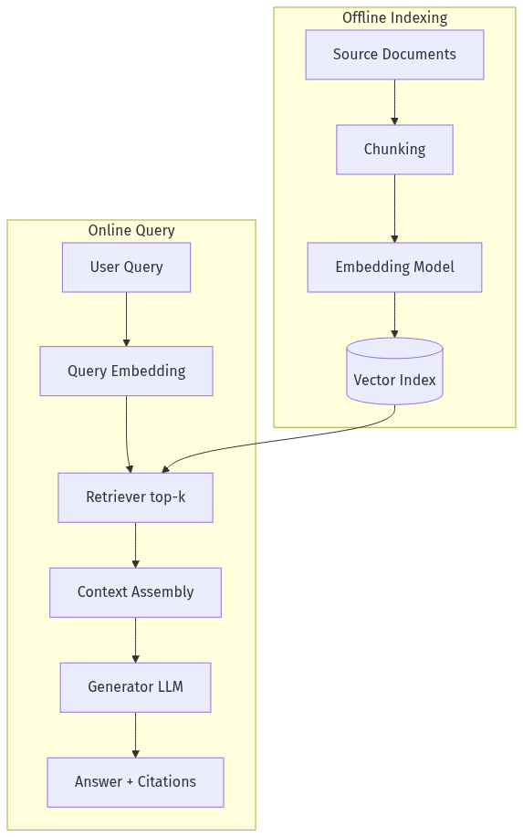
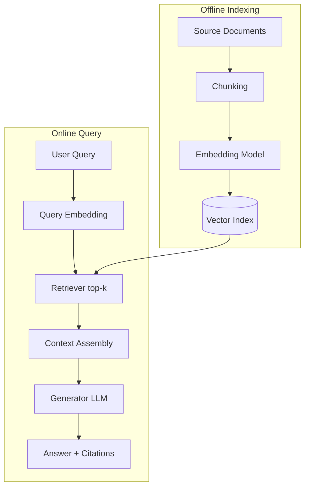
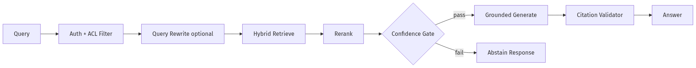
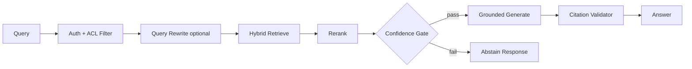
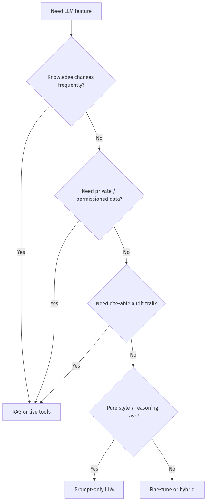
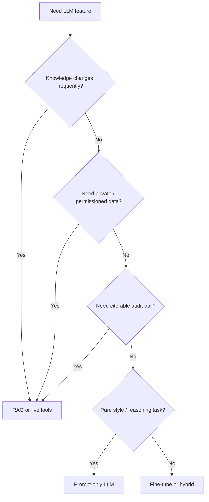
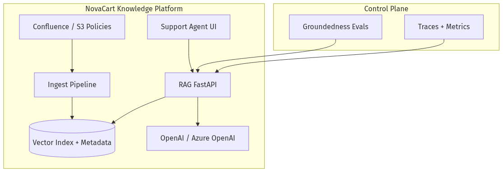
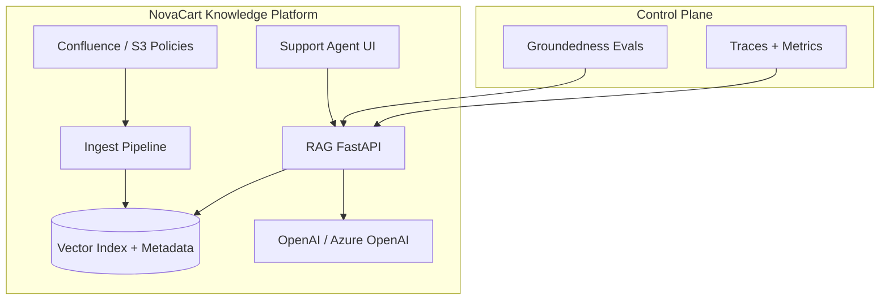
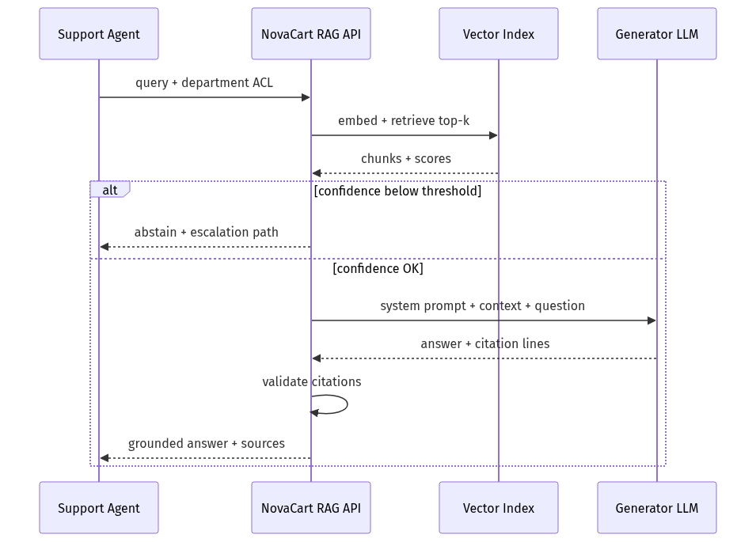
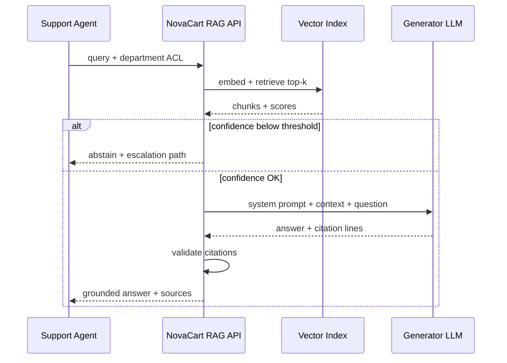

# 04-01 — RAG Architecture: Grounding LLMs with External Knowledge

| Meta | Value |
|------|-------|
| **Estimated Time** | 5–6 hours (read 2.5h · lab 2.5h · architecture memo 1h) |
| **Difficulty** | Intermediate (architecture) · Advanced (abstain + citation contracts) |
| **Prerequisites** | [00-01 AI Engineering Mindset](../00-Foundations/00-01-AI-Engineering-Mindset.md) · basic FastAPI · embeddings intuition |
| **Module** | 04 — RAG Knowledge Agents |
| **Related** | [04-02 Chunking & Embeddings](04-02-Chunking-Metadata-Embeddings.md) · [04-03 Vector DB & Reranking](04-03-Vector-DB-Hybrid-Search-Reranking.md) · [04-04 Advanced RAG](04-04-Advanced-RAG-HyDE-GraphRAG.md) · [03-01 Agent Anatomy](../03-Agentic-Fundamentals/03-01-Agent-Anatomy-and-Loop.md) · [08-01 Evaluation Lifecycle](../08-Evaluation-LLMOps/08-01-Evaluation-Lifecycle.md) · [11-02 Prompt Injection Defense](../11-Security-Safety/11-02-Prompt-Injection-Defense.md) · [Architecture Index](../../Architecture Index.md) |

---

## Learning Objectives

By the end of this chapter you will be able to:

1. Explain **why LLMs need external knowledge** and when parametric memory is insufficient.
2. Draw and defend a **production RAG architecture** from ingest to grounded answer.
3. Decide **RAG vs fine-tuning vs tool/API lookup** for a given business question.
4. Implement **context injection**, **grounded citations**, and **abstain logic** in FastAPI.
5. Design **hallucination prevention** as a system contract—not a prompt wish.

---

## Why This Topic Matters

Large language models are trained on static corpora with a knowledge cutoff. They cannot know:

- yesterday's NovaCart return-policy change,
- your private Confluence pages,
- per-customer order status,
- or regulatory text that updated last week.

**Retrieval-Augmented Generation (RAG)** connects the LLM to **authoritative, fresh, permissioned sources** at query time. Without RAG (or equivalent tools), internal knowledge bots confidently invent procedures—a failure mode that destroys trust faster than "I don't know."

For Staff/Principal interviews, RAG is not "call Pinecone." It is:

- **Trust architecture** (what the model is allowed to claim),
- **Latency/cost engineering** (retrieve → rerank → generate),
- **Evaluability** (groundedness, citation accuracy, abstain rate).

This chapter establishes the **NovaCart Internal Knowledge Agent** pattern used throughout Module 04.

---

## Business Impact

| Business outcome | How RAG architecture delivers |
|------------------|--------------------------------|
| **Accurate support answers** | Answers cite policy docs, not model priors |
| **Faster onboarding** | New hires query SOPs instead of Slack archaeology |
| **Compliance defensibility** | Citations + audit trail show source of truth |
| **Lower fine-tuning spend** | Update docs, not retrain models, when policies change |
| **Reduced hallucination incidents** | Abstain when retrieval confidence is low |

**NovaCart scenario:** Support agents ask *"Can I refund a digital gift card purchased 45 days ago?"* The agent must retrieve `returns-policy-v3.pdf` and `gift-card-exceptions.md`, cite section IDs, and abstain if no matching clause exists—never invent a 30-day rule from pretraining.

---

## Architecture Overview

Classic RAG from [Lewis et al., 2020](https://arxiv.org/abs/2005.11401):





**Production RAG** adds layers the paper diagram omits:





Cross-links: chunking details in [04-02](04-02-Chunking-Metadata-Embeddings.md), retrieval precision in [04-03](04-03-Vector-DB-Hybrid-Search-Reranking.md), query rewrite in [04-04](04-04-Advanced-RAG-HyDE-GraphRAG.md).

---

## Core Concepts

### 1) Why LLMs Need External Knowledge

#### Definition

| Memory type | What it holds | Freshness | Auditability |
|-------------|---------------|-----------|--------------|
| **Parametric** | Weights from pretraining | Frozen at train cutoff | Opaque |
| **Non-parametric** | Retrieved chunks at inference | As fresh as your index | Cite-able |

#### Intuition

The LLM is a **reasoning engine over text**. RAG supplies the **text that must be true** for this answer in this company at this time.

#### When parametric memory is enough

- Generic writing (tone, summarization style).
- Stable public facts with low blast radius if wrong.
- Tasks where creativity beats factual precision.

#### When it is not enough (use RAG or tools)

- Internal policies, SKUs, pricing, SLAs.
- Regulated domains (finance, healthcare, legal).
- Anything where "confidently wrong" has cost.

---

### 2) RAG Architecture Components

| Stage | Responsibility | NovaCart example |
|-------|----------------|------------------|
| **Ingest** | Pull docs from Confluence, S3, Zendesk | Policy PDFs, macro templates |
| **Parse** | Preserve structure (headings, tables) | Return-policy sections |
| **Chunk** | Split for retrieval granularity | See [04-02](04-02-Chunking-Metadata-Embeddings.md) |
| **Embed** | Vectorize chunks + query | `text-embedding-3-small` |
| **Index** | Store vectors + metadata + ACL | `department=support`, `doc_id` |
| **Retrieve** | top-k similarity (+ filters) | k=20 before rerank |
| **Rerank** | Cross-encoder precision | See [04-03](04-03-Vector-DB-Hybrid-Search-Reranking.md) |
| **Generate** | LLM answers **only from context** | Structured citations |
| **Validate** | Citation ↔ chunk alignment | Block orphan claims |

---

### 3) When to Use RAG





| Pattern | Choose RAG when… | Choose alternative when… |
|---------|------------------|--------------------------|
| **Support bot** | Answers must match KB | Real-time order lookup → **tool/API** |
| **Legal/compliance** | Citations required | Taxonomy fixed → **classifier** |
| **Code assistant** | Repo too large for context | Small repo → **full-file context** |
| **Sales enablement** | Battlecards change weekly | Tone-only → **prompt** |

Compare fine-tuning tradeoffs in Module 09; agent loops in [03-01](../03-Agentic-Fundamentals/03-01-Agent-Anatomy-and-Loop.md).

---

### 4) Hallucination Prevention

Hallucination in RAG usually means **ungrounded generation**: the model adds claims not supported by retrieved chunks.

| Layer | Technique | Effect |
|-------|-----------|--------|
| **Retrieval** | Higher k + rerank | Better evidence in context |
| **Prompt** | "Answer ONLY from context" | Reduces but does not eliminate drift |
| **Structured output** | `answer` + `citations[]` schema | Parseable, testable |
| **Post-validation** | Every citation must map to chunk ID | Block or regenerate |
| **Abstain** | Low retrieval/rerank score → no claim | Fail closed on uncertainty |
| **Eval** | Groundedness metrics | Regression gate — [08-01](../08-Evaluation-LLMOps/08-01-Evaluation-Lifecycle.md) |

**Interview move:** Never claim "RAG eliminates hallucination." Say **"RAG + citations + abstain + eval reduces ungrounded claims to a measured rate."**

---

### 5) Abstain Logic

#### Definition

**Abstain** = system refuses to answer substantively when evidence is insufficient, instead returning a safe fallback.

#### Triggers (combine with OR/AND policy)

| Signal | Example threshold |
|--------|-------------------|
| Max rerank score | `< 0.35` |
| Score gap (top1 − top2) | `< 0.05` (ambiguous) |
| Zero chunks after ACL filter | user lacks permission |
| Citation validation failure | model cited missing chunk |
| Out-of-domain classifier | not a NovaCart policy question |

#### NovaCart abstain copy

> "I couldn't find an authoritative NovaCart policy for this question in your accessible documents. Please escalate to Tier 2 or search Confluence tag `#returns-escalation`."

Abstain is a **product feature**, not an error—it protects trust.

---

### 6) Context Injection

#### Definition

**Context injection** = assembling retrieved chunks into the LLM prompt under a strict contract.

#### Best practices

| Practice | Why |
|----------|-----|
| Include chunk metadata (`doc_id`, `section`, `updated_at`) | Enables citations and debugging |
| Order by rerank score | Best evidence first (lost-in-middle mitigation) |
| Cap total tokens | Protect latency/cost |
| Delimit chunks clearly | Reduces cross-chunk confusion |
| System prompt: role + constraints | Separate policy from evidence |

#### Anti-pattern

Dumping 50 chunks "just in case." Noise increases hallucination and cost. Tune k after reranking ([04-03](04-03-Vector-DB-Hybrid-Search-Reranking.md)).

---

### 7) Grounded Citations

#### Definition

A **grounded citation** ties each factual claim to a **specific source chunk** the user (or auditor) can verify.

#### Citation contract

```json
{
  "answer": "Digital gift cards are non-refundable after 30 days except for billing errors.",
  "citations": [
    {"chunk_id": "gift-card-exceptions#sec-2", "quote": "non-refundable after 30 days"},
    {"chunk_id": "returns-policy-v3#sec-4.1", "quote": "billing error exception"}
  ],
  "confidence": "high",
  "abstained": false
}
```

#### Validation rules

1. Every `chunk_id` must exist in retrieved set.
2. `quote` must be substring (or fuzzy match) of chunk text.
3. If validation fails → regenerate once → abstain.

---

## Implementation

### NovaCart Knowledge Agent — RAG API (LlamaIndex + FastAPI + Pydantic)

Production-shaped service: retrieve → confidence gate → grounded generate → citation validate.

```python
"""NovaCart Internal Knowledge Agent — RAG architecture demo.

Run:
  pip install fastapi uvicorn pydantic llama-index llama-index-embeddings-openai \\
      llama-index-llms-openai
  export OPENAI_API_KEY=...
  uvicorn novacart_rag:app --reload

Index sample docs under ./data/ before first query (see ingest endpoint).
"""

from __future__ import annotations

import os
import re
import uuid
from datetime import datetime, timezone
from enum import Enum
from pathlib import Path
from typing import Any

from fastapi import FastAPI, HTTPException
from pydantic import BaseModel, Field, field_validator

from llama_index.core import Document, Settings, StorageContext, VectorStoreIndex
from llama_index.core.node_parser import SentenceSplitter
from llama_index.core.schema import TextNode
from llama_index.embeddings.openai import OpenAIEmbedding
from llama_index.llms.openai import OpenAI

# ---------------------------------------------------------------------------
# Config
# ---------------------------------------------------------------------------
DATA_DIR = Path("./data")
INDEX_DIR = Path("./storage")
EMBED_MODEL = "text-embedding-3-small"
LLM_MODEL = "gpt-4.1-mini"
TOP_K = 8
MIN_RERANK_PROXY_SCORE = 0.42  # stand-in when no cross-encoder yet
CHUNK_SIZE = 512
CHUNK_OVERLAP = 64

Settings.embed_model = OpenAIEmbedding(model=EMBED_MODEL)
Settings.llm = OpenAI(model=LLM_MODEL, temperature=0.0)


# ---------------------------------------------------------------------------
# Pydantic schemas
# ---------------------------------------------------------------------------
class Citation(BaseModel):
    chunk_id: str
    doc_title: str
    section: str | None = None
    quote: str
    score: float = Field(ge=0.0, le=1.0)


class RAGRequest(BaseModel):
    query: str = Field(min_length=3, max_length=2000)
    user_department: str = "support"
    top_k: int = Field(default=TOP_K, ge=1, le=20)

    @field_validator("query")
    @classmethod
    def strip_query(cls, v: str) -> str:
        return v.strip()


class RAGResponse(BaseModel):
    request_id: str
    query: str
    answer: str
    citations: list[Citation]
    abstained: bool
    abstain_reason: str | None = None
    retrieval_scores: list[float]
    model: str
    created_at: datetime


class IngestRequest(BaseModel):
    doc_id: str
    title: str
    text: str
    department: str = "support"
    section: str | None = None


class ConfidenceLevel(str, Enum):
    HIGH = "high"
    LOW = "low"
    NONE = "none"


# ---------------------------------------------------------------------------
# In-memory index (swap VectorStoreIndex persistence for prod)
# ---------------------------------------------------------------------------
_nodes: list[TextNode] = []
_index: VectorStoreIndex | None = None


def _build_index() -> VectorStoreIndex:
    global _index
    storage = StorageContext.from_defaults()
    _index = VectorStoreIndex(_nodes, storage_context=storage)
    return _index


def _get_index() -> VectorStoreIndex:
    if _index is None:
        if not _nodes:
            raise HTTPException(
                status_code=503,
                detail="Index empty. POST /v1/ingest first.",
            )
        return _build_index()
    return _index


def _acl_filter(department: str) -> list[TextNode]:
    """Metadata ACL: user sees own department + 'all'."""
    allowed = {department, "all"}
    return [n for n in _nodes if n.metadata.get("department") in allowed]


def _score_to_confidence(scores: list[float]) -> ConfidenceLevel:
    if not scores:
        return ConfidenceLevel.NONE
    if scores[0] >= MIN_RERANK_PROXY_SCORE:
        return ConfidenceLevel.HIGH
    if scores[0] >= 0.25:
        return ConfidenceLevel.LOW
    return ConfidenceLevel.NONE


def _validate_citations(citations: list[Citation], nodes: list[TextNode]) -> list[Citation]:
    node_map = {n.node_id: n for n in nodes}
    valid: list[Citation] = []
    for c in citations:
        node = node_map.get(c.chunk_id)
        if node is None:
            continue
        if c.quote.lower() not in node.get_content().lower():
            continue
        valid.append(c)
    return valid


def _parse_citations_from_llm(raw: str, nodes: list[TextNode]) -> tuple[str, list[Citation]]:
    """Expect LLM to return ANSWER: ... CITATIONS: chunk_id|quote lines."""
    answer = raw
    citations: list[Citation] = []
    node_map = {n.node_id: n for n in nodes}

    if "CITATIONS:" in raw:
        answer_part, cite_part = raw.split("CITATIONS:", 1)
        answer = answer_part.replace("ANSWER:", "").strip()
        for line in cite_part.strip().splitlines():
            if "|" not in line:
                continue
            chunk_id, quote = line.split("|", 1)
            chunk_id = chunk_id.strip()
            quote = quote.strip()
            node = node_map.get(chunk_id)
            if node:
                citations.append(
                    Citation(
                        chunk_id=chunk_id,
                        doc_title=node.metadata.get("title", "unknown"),
                        section=node.metadata.get("section"),
                        quote=quote,
                        score=float(node.metadata.get("score", 0.0)),
                    )
                )
    return answer, citations


SYSTEM_PROMPT = """You are NovaCart's internal knowledge assistant.
Answer ONLY using the provided CONTEXT chunks.
If context is insufficient, respond with ABSTAIN: <reason>.
Format:
ANSWER: <concise answer>
CITATIONS:
<chunk_id>|<verbatim quote from that chunk>
(one per line, only cite chunks you used)
"""


def _assemble_context(nodes: list[TextNode]) -> str:
    blocks: list[str] = []
    for n in nodes:
        meta = n.metadata
        blocks.append(
            f"[chunk_id={n.node_id} title={meta.get('title')} section={meta.get('section')}]\n"
            f"{n.get_content()}\n"
        )
    return "\n---\n".join(blocks)


# ---------------------------------------------------------------------------
# FastAPI
# ---------------------------------------------------------------------------
app = FastAPI(title="NovaCart Knowledge Agent", version="1.0.0")


@app.post("/v1/ingest")
def ingest(req: IngestRequest) -> dict[str, Any]:
    splitter = SentenceSplitter(chunk_size=CHUNK_SIZE, chunk_overlap=CHUNK_OVERLAP)
    doc = Document(
        text=req.text,
        metadata={
            "doc_id": req.doc_id,
            "title": req.title,
            "department": req.department,
            "section": req.section,
        },
    )
    nodes = splitter.get_nodes_from_documents([doc])
    for i, node in enumerate(nodes):
        node.node_id = f"{req.doc_id}#{i}"
        node.metadata["title"] = req.title
        node.metadata["department"] = req.department
    _nodes.extend(nodes)
    _build_index()
    DATA_DIR.mkdir(exist_ok=True)
    (DATA_DIR / f"{req.doc_id}.txt").write_text(req.text)
    return {"doc_id": req.doc_id, "chunks_created": len(nodes)}


@app.post("/v1/knowledge/query", response_model=RAGResponse)
def query(req: RAGRequest) -> RAGResponse:
    request_id = str(uuid.uuid4())
    index = _get_index()

    # ACL-filtered retriever
    allowed_nodes = _acl_filter(req.user_department)
    if not allowed_nodes:
        return RAGResponse(
            request_id=request_id,
            query=req.query,
            answer="",
            citations=[],
            abstained=True,
            abstain_reason="No accessible documents for your department.",
            retrieval_scores=[],
            model=LLM_MODEL,
            created_at=datetime.now(timezone.utc),
        )

    # Retrieve with metadata pre-filter (production: push filter to vector DB)
    retriever = index.as_retriever(similarity_top_k=req.top_k)
    retrieved = retriever.retrieve(req.query)
    allowed_ids = {n.node_id for n in allowed_nodes}
    retrieved = [r for r in retrieved if r.node.node_id in allowed_ids]

    scores = [float(r.score or 0.0) for r in retrieved]
    confidence = _score_to_confidence(scores)

    if confidence == ConfidenceLevel.NONE or not retrieved:
        return RAGResponse(
            request_id=request_id,
            query=req.query,
            answer=(
                "I couldn't find an authoritative NovaCart policy for this question "
                "in your accessible documents. Please escalate to Tier 2."
            ),
            citations=[],
            abstained=True,
            abstain_reason="retrieval_confidence_below_threshold",
            retrieval_scores=scores,
            model=LLM_MODEL,
            created_at=datetime.now(timezone.utc),
        )

    nodes = []
    for r in retrieved:
        r.node.metadata["score"] = float(r.score or 0.0)
        nodes.append(r.node)

    context = _assemble_context(nodes)
    user_prompt = f"CONTEXT:\n{context}\n\nQUESTION: {req.query}"

    llm = Settings.llm
    raw = llm.complete(
        f"{SYSTEM_PROMPT}\n\n{user_prompt}",
    ).text

    if raw.strip().startswith("ABSTAIN:"):
        return RAGResponse(
            request_id=request_id,
            query=req.query,
            answer=raw.replace("ABSTAIN:", "").strip(),
            citations=[],
            abstained=True,
            abstain_reason="model_abstain",
            retrieval_scores=scores,
            model=LLM_MODEL,
            created_at=datetime.now(timezone.utc),
        )

    answer, citations = _parse_citations_from_llm(raw, nodes)
    citations = _validate_citations(citations, nodes)

    if not citations and confidence == ConfidenceLevel.LOW:
        return RAGResponse(
            request_id=request_id,
            query=req.query,
            answer="Insufficient grounded evidence. Escalate to policy owner.",
            citations=[],
            abstained=True,
            abstain_reason="citation_validation_failed",
            retrieval_scores=scores,
            model=LLM_MODEL,
            created_at=datetime.now(timezone.utc),
        )

    return RAGResponse(
        request_id=request_id,
        query=req.query,
        answer=answer,
        citations=citations,
        abstained=False,
        abstain_reason=None,
        retrieval_scores=scores,
        model=LLM_MODEL,
        created_at=datetime.now(timezone.utc),
    )


@app.get("/health")
def health() -> dict[str, str]:
    return {"status": "ok", "chunks_indexed": str(len(_nodes))}
```

#### Why this implementation embodies RAG architecture

1. **Separation of retrieve vs generate** — auditable stages.
2. **ACL on metadata** — security is not an afterthought ([11-02](../11-Security-Safety/11-02-Prompt-Injection-Defense.md)).
3. **Abstain on low confidence** — fail closed.
4. **Citation validation** — post-generation grounding check.
5. **Pydantic contracts** — testable API surface for eval harness ([08-01](../08-Evaluation-LLMOps/08-01-Evaluation-Lifecycle.md)).

---

## Production Considerations

| Concern | Practice |
|---------|----------|
| Index freshness | Webhook re-ingest on doc publish; version metadata |
| Prompt versioning | Hash system prompt in audit log |
| Model swaps | Re-eval groundedness on every embed/LLM change |
| Multi-tenant ACL | Filter at retrieval, not post-hoc in prompt |
| Answer cache | Cache by `(query_hash, index_version)` only if citations included |

---

## Security

| Threat | Control |
|--------|---------|
| **Prompt injection via documents** | Sanitize ingest; treat retrieved text as untrusted data |
| **Cross-department leakage** | Metadata ACL + vector DB filters |
| **Citation spoofing** | Validate quotes against chunk store |
| **Data exfiltration** | Rate limits; log queries; DLP on exports |

Deep dive: [11-02 Prompt Injection Defense](../11-Security-Safety/11-02-Prompt-Injection-Defense.md)

---

## Performance

| Stage | Typical p95 budget (support bot) |
|-------|----------------------------------|
| Embed query | 20–80 ms |
| Vector retrieve (k=20) | 30–150 ms |
| Rerank | 100–400 ms |
| LLM generate | 500–2000 ms |
| **Total E2E** | **~1–3 s** target |

Parallelize embed + keyword search for hybrid ([04-03](04-03-Vector-DB-Hybrid-Search-Reranking.md)).

---

## Cost

| Lever | Effect |
|-------|--------|
| Smaller embed model | 5–10× cheaper indexing |
| Retrieve k=20, rerank to 5 | Better quality without huge context |
| Abstain early | Skip LLM call when retrieval fails |
| Cache frequent queries | Cut repeat token spend |

---

## Scalability

| Bottleneck | Scale strategy |
|------------|----------------|
| Embedding ingest | Batch jobs; queue workers |
| Vector queries | Sharded index; replicas |
| LLM generation | Rate-limit per team; route to smaller model for drafts |
| Confluence sync | Incremental ingest by `updated_at` |

---

## Failure Modes

| Failure | Symptom | Mitigation |
|---------|---------|------------|
| Stale index | Wrong policy cited | Version tags; freshness eval |
| Empty retrieval | Generic hallucination | Abstain gate |
| ACL misconfig | Leaked HR docs | Integration tests per role |
| Over-long context | Lost-in-middle errors | Rerank + cap chunks |
| No citation discipline | Unverifiable answers | Schema + validator |

---

## Observability

Minimum RAG trace fields:

```text
trace_id, request_id, query, user_department, top_k,
retrieval_scores[], chunk_ids[], abstained, abstain_reason,
citation_count, citation_valid, model, embed_model,
latency_ms_retrieve, latency_ms_generate, index_version
```

Ship dashboards: abstain rate, avg citation count, groundedness eval score.

---

## Debugging

| Symptom | Likely cause | Fix |
|---------|--------------|-----|
| Wrong policy era | Stale chunk | Re-ingest; boost `updated_at` in metadata |
| Good retrieve, bad answer | Prompt drift | Tighten system prompt; lower temperature |
| Always abstains | Threshold too high | Calibrate on golden set |
| Citations fail validation | Model paraphrased | Require shorter quotes; fine-tune prompt |

---

## Common Mistakes

1. **RAG without citations** — users cannot trust or verify.
2. **No abstain path** — model fills gaps with fiction.
3. **Ignoring ACL** — retrieval returns chunks user must not see.
4. **Huge k** — noise drowns signal.
5. **Skipping eval** — silent regressions on every doc update.

---

## Tradeoffs

| Choice | Upside | Downside |
|--------|--------|----------|
| RAG vs long context only | Cheaper; fresher via index | Retrieval tuning burden |
| Strict abstain | High trust | Lower answer rate |
| Inline citations | Verifiable | UX friction |
| Sync ingest | Simple | Stale until job runs |

---

## Architecture Diagram





---

## Mermaid Diagram — Sequence





---

## Production Examples

| Pattern | Company-style use |
|---------|-------------------|
| Internal KB bot | NovaCart support macros + returns policy |
| Enterprise search + answer | Slack AI, Notion Q&A |
| Regulated Q&A | Bank policy assistants with audit |
| Developer docs | Perplexity-style cited answers |

---

## Real Companies Using It (Public Patterns)

| Org | Public pattern | Lesson |
|-----|----------------|--------|
| **Microsoft** | Copilot + Graph grounding | ACL-aware retrieval is mandatory |
| **Databricks** | Knowledge assistants over docs | RAG + eval pipelines |
| **Pinecone customers** | Cited enterprise search | Metadata filters at scale |
| **Perplexity** | Search + synthesize + cite | Citations as core UX |

---

## Hands-on Labs

### Lab A — Ingest NovaCart policies (45 min)

Ingest `returns-policy-v3` and `gift-card-exceptions`. Query edge cases; verify citations.

### Lab B — Break abstain (30 min)

Ask out-of-domain questions; confirm abstain triggers, not hallucination.

### Lab C — ACL test (30 min)

Ingest HR doc with `department=hr`. Query as `support` user; must not retrieve.

---

## Coding Assignments

1. Add `index_version` to responses; bump on re-ingest.
2. Persist traces to JSONL for offline eval.
3. Swap LlamaIndex retriever for LangChain equivalent; compare API surface.

---

## Mini Project

**Title:** NovaCart Policy Q&A v0  
**Done when:** ingest endpoint works; queries return citations or abstain; pytest covers abstain + ACL.

---

## Production Project

**Title:** NovaCart Knowledge Agent with Confluence sync  
**Done when:** webhook re-ingest; OpenTelemetry spans per stage; groundedness eval in CI ([08-01](../08-Evaluation-LLMOps/08-01-Evaluation-Lifecycle.md)).

---

## Stretch Project

Add **agentic routing** ([03-01](../03-Agentic-Fundamentals/03-01-Agent-Anatomy-and-Loop.md)): policy questions → RAG; live order status → tool call. Compare single-RAG vs router architecture.

---

## Interview Questions

### Senior Engineer

1. What problem does RAG solve that prompting alone cannot?
2. How do you prevent the model from answering when retrieval fails?
3. What metadata would you store per chunk for a support KB?

### Staff Engineer

1. Design NovaCart's internal knowledge agent end-to-end.
2. How do grounded citations differ from "the model sounds confident"?
3. When would you choose a live API tool over RAG?

### Principal Engineer

1. Propose org-wide RAG standards (ACL, abstain, eval gates).
2. How do you measure $/grounded answer at scale?
3. What belongs in platform vs product team code?

### Engineering Manager

1. How do you prioritize RAG quality vs ship date?
2. What KPIs define success for an internal KB bot?
3. How do you handle policy owners who distrust AI answers?

### Whiteboard

Draw offline indexing vs online query paths; mark abstain decision point.

### Follow-ups

- What if two policies conflict in retrieved chunks?
- How do you handle doc updates mid-conversation?
- What evals block a index refresh deploy?

---

## Revision Notes

- LLMs need **external knowledge** for private, fresh, cite-able facts.
- RAG = retrieve → assemble context → generate → **validate citations**.
- **Abstain** is trust architecture, not failure.
- Hallucination prevention is **layered** (retrieve, prompt, schema, validator, eval).
- NovaCart thread continues in [04-02](04-02-Chunking-Metadata-Embeddings.md).

---

## Summary

RAG architecture grounds LLMs in **authoritative, permissioned, fresh documents**. Production systems add ACL, confidence gates, citation validation, and eval—not just vector search. The NovaCart Knowledge Agent pattern—cite or abstain—is the trust foundation for all advanced retrieval techniques in Module 04.

---

## Further Reading

| Title | URL | Difficulty | Reading Time | Why Read | Important Sections |
|-------|-----|------------|--------------|----------|--------------------|
| Retrieval-Augmented Generation for Knowledge-Intensive NLP Tasks | https://arxiv.org/abs/2005.11401 | Intermediate | 45–60 min | Foundational RAG paper | Architecture; retriever + generator |
| LlamaIndex Documentation | https://docs.llamaindex.ai/en/stable/ | Intro | 30 min | Framework used in labs | Indexing; querying; agents |
| LangChain RAG Concept | https://python.langchain.com/docs/concepts/rag/ | Intro | 25 min | Alternate mental model | Indexing pipeline; retrieval |
| Pinecone Getting Started | https://docs.pinecone.io/guides/get-started/overview | Intro | 20 min | Managed vector index concepts | Indexes; namespaces; metadata |
| Cohere Rerank Overview | https://docs.cohere.com/docs/rerank-overview | Intro | 15 min | Precision layer preview for 04-03 | When to rerank |
| Microsoft GraphRAG | https://microsoft.github.io/graphrag/ | Advanced | 45 min | Preview advanced grounding (04-04) | Indexing graphs; global search |
