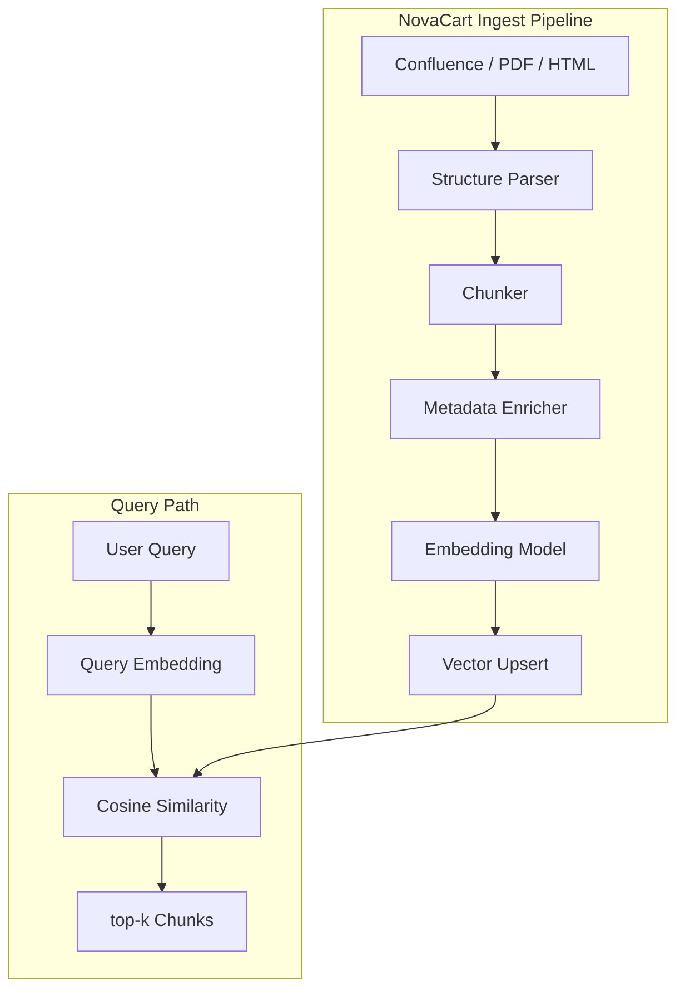
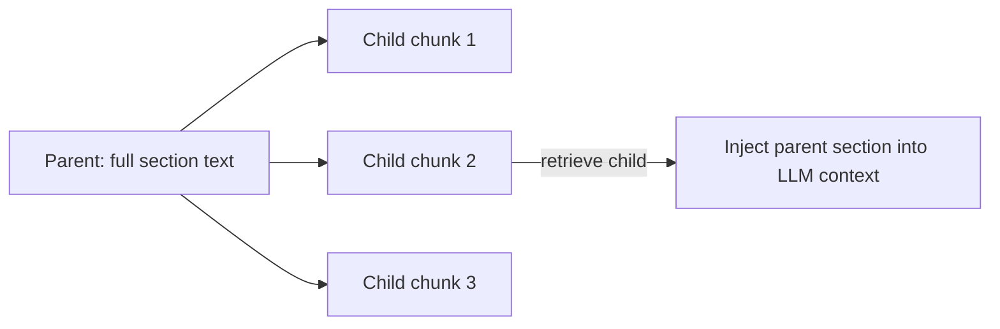
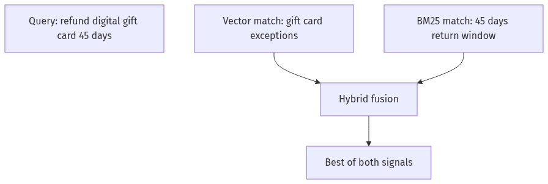
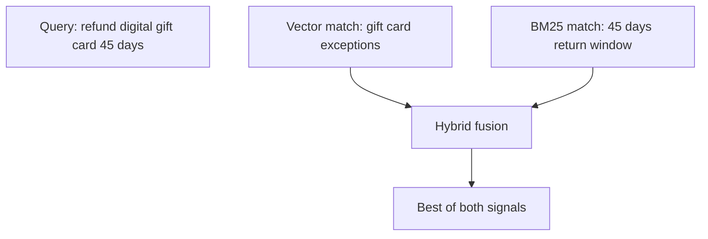
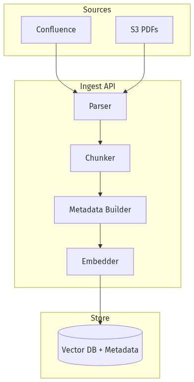
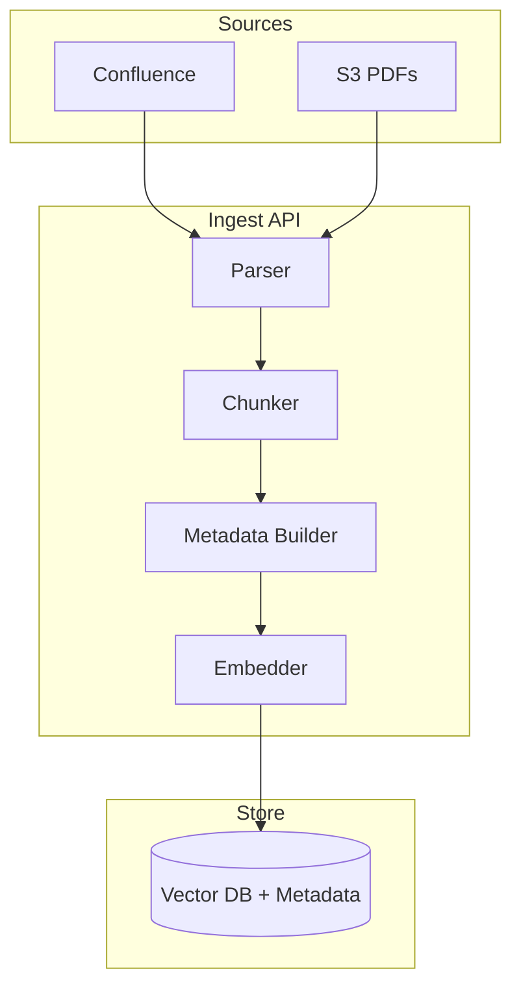
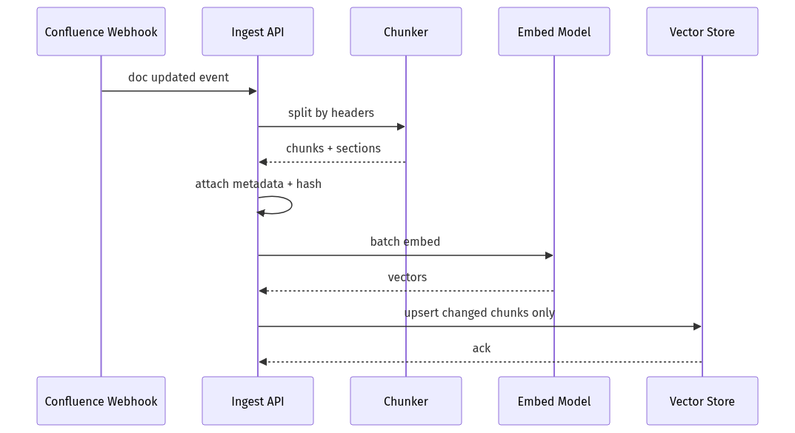
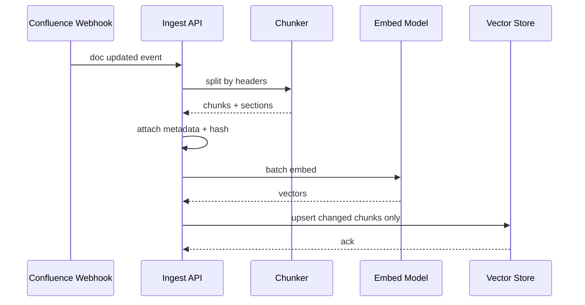

# 04-02 — Chunking, Metadata & Embeddings

| Meta | Value |
|------|-------|
| **Estimated Time** | 5–6 hours (read 2h · lab 3h · tuning worksheet 1h) |
| **Difficulty** | Intermediate (chunking) · Advanced (metadata schema + embed model selection) |
| **Prerequisites** | [04-01 RAG Architecture](04-01-RAG-Architecture.md) · Python · basic linear algebra intuition |
| **Module** | 04 — RAG Knowledge Agents |
| **Related** | [04-03 Vector DB & Reranking](04-03-Vector-DB-Hybrid-Search-Reranking.md) · [04-04 Advanced RAG](04-04-Advanced-RAG-HyDE-GraphRAG.md) · [03-01 Agent Anatomy](../03-Agentic-Fundamentals/03-01-Agent-Anatomy-and-Loop.md) · [08-01 Evaluation Lifecycle](../08-Evaluation-LLMOps/08-01-Evaluation-Lifecycle.md) · [11-02 Prompt Injection Defense](../11-Security-Safety/11-02-Prompt-Injection-Defense.md) · [Architecture Index](../../Architecture Index.md) |

---

## Learning Objectives

By the end of this chapter you will be able to:

1. Choose between **recursive**, **fixed**, and **structure-aware** chunking for NovaCart docs.
2. Tune **chunk size, overlap, and top-k** with explicit quality/latency tradeoffs.
3. Design a **metadata schema** supporting ACL, filtering, citations, and debugging.
4. Explain **embeddings** and **semantic similarity** as retrieval primitives.
5. Implement a production ingest pipeline with LangChain + FastAPI + Pydantic.

---

## Why This Topic Matters

Retrieval quality has a ceiling set **before** the LLM ever runs. Bad chunks produce:

- answers that cite the wrong paragraph,
- merged unrelated policies in one vector,
- missing tables and exception clauses,
- and "correct-ish" similarity that fails on SKU codes or legal citations.

Principal engineers get asked: *"We deployed RAG but accuracy is 60%. Should we change the LLM?"* Often the fix is **chunking + metadata + embeddings**—cheaper and more durable than swapping GPT versions.

This chapter builds the **NovaCart ingest layer** referenced in [04-01](04-01-RAG-Architecture.md) and consumed by [04-03](04-03-Vector-DB-Hybrid-Search-Reranking.md).

---

## Business Impact

| Business outcome | Chunk/metadata/embed lever |
|------------------|----------------------------|
| **Correct policy answers** | Section-aware chunks preserve "except when…" clauses |
| **Faster retrieval** | Right-sized chunks → fewer tokens in context |
| **Compliance audits** | Metadata carries `policy_version`, `effective_date` |
| **Department isolation** | `department` + `acl_roles` metadata filters |
| **Lower re-index cost** | Incremental ingest by `doc_id` + chunk hash |

**NovaCart example:** Merging "30-day return window" with "digital gift card exceptions" into one 4K chunk causes the retriever to surface irrelevant text. Structure-aware splitting keeps exceptions retrievable on their own.

---

## Architecture Overview



Chunking decisions flow downstream to reranking ([04-03](04-03-Vector-DB-Hybrid-Search-Reranking.md)) and multi-hop retrieval ([04-04](04-04-Advanced-RAG-HyDE-GraphRAG.md)).

---

## Core Concepts

### 1) Recursive Character Splitting

#### Definition

**Recursive splitting** tries separators in order (e.g. `\n\n`, `\n`, `. `, space) until chunks fit `chunk_size`.

#### Intuition

Respects natural boundaries when possible; falls back to hard splits for dense text.

#### When to use

- Mixed prose docs (Confluence, Notion export).
- Default starting point when structure is inconsistent.

#### When NOT to use

- Heavy tables, code, or nested lists → prefer structure-aware.

#### NovaCart defaults (starting point)

| Parameter | Value | Rationale |
|-----------|-------|-----------|
| `chunk_size` | 512 tokens (~400 words) | Fits policy paragraphs |
| `chunk_overlap` | 64 tokens (~12%) | Preserves boundary context |
| `separators` | `["\n## ", "\n\n", "\n", ". "]` | Markdown-aware |

---

### 2) Structure-Aware Chunking

#### Definition

Split on **document structure**—headings, sections, table rows, list blocks—not arbitrary character counts.

#### Techniques

| Technique | Best for |
|-----------|----------|
| **Markdown header splitter** | Confluence exports with `##` sections |
| **HTML DOM walker** | Help center pages |
| **PDF layout parser** | Scanned policies with headings |
| **Parent-child indexing** | Small retrieval units + large parent context |

#### Parent-child pattern



Retrieve on **child** (precise); generate with **parent** (complete context).

#### NovaCart structure map

| Doc type | Split strategy |
|----------|----------------|
| `returns-policy-v3.md` | H2 sections + max 800 tokens per section |
| `gift-card-exceptions.md` | One chunk per exception bullet |
| `sku-matrix.csv` | One row per chunk with column metadata |
| `macro-templates/` | One template per chunk |

---

### 3) Chunk Size, Overlap & top-k Tradeoffs

#### Chunk size

| Smaller chunks | Larger chunks |
|----------------|---------------|
| Higher precision per hit | More context per hit |
| Risk missing cross-paragraph reasoning | Risk diluting embedding signal |
| More index rows ($) | Fewer rows |

**Rule of thumb:** Size chunks to match the **smallest answerable unit** in your corpus.

#### Overlap

| More overlap | Less overlap |
|--------------|--------------|
| Boundary facts appear in 2 chunks | Less storage duplication |
| Better for definitions spanning breaks | Cleaner citations |

Typical: **10–15%** of chunk_size.

#### top-k

| Higher k | Lower k |
|----------|---------|
| Recall ↑ (don't miss the right chunk) | Precision ↑ in context |
| Noise ↑; LLM confusion ↑ | Miss relevant chunk risk ↑ |
| Latency/cost ↑ | Cheaper generation |

**Production pattern:** retrieve **k=20–50**, rerank to **n=5–8** ([04-03](04-03-Vector-DB-Hybrid-Search-Reranking.md)).


#### Tuning method (not vibes)

1. Build golden questions ([08-01](../08-Evaluation-LLMOps/08-01-Evaluation-Lifecycle.md)).
2. Sweep `(chunk_size, overlap, k)`.
3. Measure **recall@k** (is gold chunk in top-k?) and **answer groundedness**.
4. Pick Pareto point for latency SLO.

---

### 4) Metadata Design

#### Definition

**Metadata** = structured fields stored alongside each chunk for filter, cite, debug, and ACL.

#### NovaCart metadata schema

| Field | Type | Purpose |
|-------|------|---------|
| `chunk_id` | string | Stable citation key |
| `doc_id` | string | Source document |
| `title` | string | UI display |
| `section` | string | Heading path (`Returns > Digital Goods`) |
| `department` | enum | ACL filter (`support`, `hr`, `all`) |
| `policy_version` | semver | Filter latest policy |
| `effective_date` | ISO date | Time-bound rules |
| `source_uri` | URL | Link back to Confluence |
| `content_hash` | sha256 | Skip unchanged re-embed |
| `chunk_index` | int | Ordering within doc |
| `language` | string | `en`, `es`, … |
| `doc_type` | enum | `policy`, `macro`, `faq` |

#### Design principles

1. **Filter what you know** — department, version, language at index query time.
2. **Cite what you show** — title + section in API response.
3. **Debug what fails** — content_hash, ingest_job_id in logs.
4. **Never embed secrets** — metadata is query-logged.

#### Interview question

> "Why not put the full ACL user list in metadata?"  
> Because ACL belongs in **identity service + filter predicates**, not duplicated per chunk.

---

### 5) Embeddings

#### Definition

An **embedding** is a dense vector representation of text such that semantic similarity ≈ geometric proximity (cosine distance).

#### How retrieval works

1. Embed query: `q → ℝ^d`
2. Embed chunks at index time: `c_i → ℝ^d`
3. Rank by `cosine(q, c_i)` or dot product
4. Return top-k

#### Popular models (2025–2026 landscape)

| Model | dims | Notes |
|-------|------|-------|
| `text-embedding-3-small` | 1536 | Cost-effective default |
| `text-embedding-3-large` | 3072 | Higher quality, higher $ |
| `cohere-embed-v3` | varies | Strong multilingual |
| Open-source (e.g. BGE, E5) | varies | Self-host for data residency |

**Critical:** Query and document chunks must use the **same model** and **same dimension**.

#### Semantic similarity limits

| Retrieves well | Retrieves poorly |
|----------------|------------------|
| Paraphrases | Exact SKU / ticket IDs |
| Conceptual questions | Rare tokens absent from training |
| Policy intent | Numbers with no surrounding context |
| "Can I refund gift card?" | `NC-GC-8842-X` without description |

Mitigation: hybrid search ([04-03](04-03-Vector-DB-Hybrid-Search-Reranking.md)), enrich metadata, structure-aware chunks.

---

### 6) Semantic Similarity vs Lexical Match





Pure embedding search may miss exact day-count language; BM25 catches "45 days." NovaCart needs **both**—detailed in [04-03](04-03-Vector-DB-Hybrid-Search-Reranking.md).

---

## Implementation

### NovaCart Ingest Service — LangChain + FastAPI + Pydantic

```python
"""NovaCart document ingest: chunking, metadata, embeddings.

Run:
  pip install fastapi uvicorn pydantic langchain langchain-openai langchain-text-splitters
  export OPENAI_API_KEY=...
  uvicorn novacart_ingest:app --reload
"""

from __future__ import annotations

import hashlib
import json
import uuid
from datetime import date, datetime, timezone
from enum import Enum
from typing import Any

import numpy as np
from fastapi import FastAPI, HTTPException
from langchain_openai import OpenAIEmbeddings
from langchain_text_splitters import (
    MarkdownHeaderTextSplitter,
    RecursiveCharacterTextSplitter,
)
from pydantic import BaseModel, Field, field_validator

EMBED_MODEL = "text-embedding-3-small"
EMBED_DIM = 1536
DEFAULT_CHUNK_SIZE = 512
DEFAULT_OVERLAP = 64


class DocType(str, Enum):
    POLICY = "policy"
    MACRO = "macro"
    FAQ = "faq"
    SKU = "sku"


class ChunkStrategy(str, Enum):
    RECURSIVE = "recursive"
    MARKDOWN_HEADERS = "markdown_headers"


class IngestDocumentRequest(BaseModel):
    doc_id: str
    title: str
    text: str
    department: str = "support"
    policy_version: str = "1.0.0"
    effective_date: date | None = None
    source_uri: str | None = None
    doc_type: DocType = DocType.POLICY
    language: str = "en"
    chunk_strategy: ChunkStrategy = ChunkStrategy.MARKDOWN_HEADERS
    chunk_size: int = Field(default=DEFAULT_CHUNK_SIZE, ge=128, le=4096)
    chunk_overlap: int = Field(default=DEFAULT_OVERLAP, ge=0, le=512)

    @field_validator("doc_id", "title")
    @classmethod
    def non_empty(cls, v: str) -> str:
        if not v.strip():
            raise ValueError("must be non-empty")
        return v.strip()


class ChunkRecord(BaseModel):
    chunk_id: str
    doc_id: str
    title: str
    section: str | None
    text: str
    metadata: dict[str, Any]
    embedding: list[float]
    content_hash: str


class IngestResponse(BaseModel):
    job_id: str
    doc_id: str
    chunks_created: int
    chunks_skipped_unchanged: int
    embed_model: str
    created_at: datetime


class SimilarityRequest(BaseModel):
    query: str
    top_k: int = Field(default=5, ge=1, le=50)
    department: str = "support"


class SimilarityHit(BaseModel):
    chunk_id: str
    score: float
    title: str
    section: str | None
    text_preview: str


class SimilarityResponse(BaseModel):
    query: str
    hits: list[SimilarityHit]
    embed_model: str


# In-memory store (production: vector DB — see 04-03)
CHUNK_STORE: dict[str, ChunkRecord] = {}
embedder = OpenAIEmbeddings(model=EMBED_MODEL)


def content_hash(text: str) -> str:
    return hashlib.sha256(text.encode("utf-8")).hexdigest()


def cosine_similarity(a: list[float], b: list[float]) -> float:
    va, vb = np.array(a), np.array(b)
    denom = float(np.linalg.norm(va) * np.linalg.norm(vb))
    if denom == 0:
        return 0.0
    return float(np.dot(va, vb) / denom)


def split_recursive(text: str, chunk_size: int, overlap: int) -> list[tuple[str, str | None]]:
    splitter = RecursiveCharacterTextSplitter(
        chunk_size=chunk_size,
        chunk_overlap=overlap,
        separators=["\n## ", "\n\n", "\n", ". ", " "],
    )
    docs = splitter.create_documents([text])
    return [(d.page_content, None) for d in docs]


def split_markdown_headers(text: str, chunk_size: int, overlap: int) -> list[tuple[str, str | None]]:
    headers = [("#", "h1"), ("##", "h2"), ("###", "h3")]
    md_splitter = MarkdownHeaderTextSplitter(headers_to_split_on=headers)
    header_docs = md_splitter.split_text(text)
    recursive = RecursiveCharacterTextSplitter(
        chunk_size=chunk_size,
        chunk_overlap=overlap,
    )
    results: list[tuple[str, str | None]] = []
    for doc in header_docs:
        section_parts = [doc.metadata.get(k) for k in ("h1", "h2", "h3") if doc.metadata.get(k)]
        section = " > ".join(section_parts) if section_parts else None
        if len(doc.page_content) <= chunk_size:
            results.append((doc.page_content, section))
        else:
            subdocs = recursive.create_documents([doc.page_content])
            for sub in subdocs:
                results.append((sub.page_content, section))
    return results


def build_chunks(req: IngestDocumentRequest) -> list[tuple[str, str | None]]:
    if req.chunk_strategy == ChunkStrategy.RECURSIVE:
        return split_recursive(req.text, req.chunk_size, req.chunk_overlap)
    return split_markdown_headers(req.text, req.chunk_size, req.chunk_overlap)


app = FastAPI(title="NovaCart Ingest", version="1.0.0")


@app.post("/v1/ingest/document", response_model=IngestResponse)
def ingest_document(req: IngestDocumentRequest) -> IngestResponse:
    job_id = str(uuid.uuid4())
    pairs = build_chunks(req)
    created = 0
    skipped = 0

    texts = [p[0] for p in pairs]
    vectors = embedder.embed_documents(texts)

    for i, ((text, section), vector) in enumerate(zip(pairs, vectors)):
        c_hash = content_hash(text)
        chunk_id = f"{req.doc_id}#{i}"

        existing = CHUNK_STORE.get(chunk_id)
        if existing and existing.content_hash == c_hash:
            skipped += 1
            continue

        metadata = {
            "doc_id": req.doc_id,
            "title": req.title,
            "section": section,
            "department": req.department,
            "policy_version": req.policy_version,
            "effective_date": req.effective_date.isoformat() if req.effective_date else None,
            "source_uri": req.source_uri,
            "doc_type": req.doc_type.value,
            "language": req.language,
            "chunk_index": i,
            "chunk_strategy": req.chunk_strategy.value,
        }

        CHUNK_STORE[chunk_id] = ChunkRecord(
            chunk_id=chunk_id,
            doc_id=req.doc_id,
            title=req.title,
            section=section,
            text=text,
            metadata=metadata,
            embedding=vector,
            content_hash=c_hash,
        )
        created += 1

    return IngestResponse(
        job_id=job_id,
        doc_id=req.doc_id,
        chunks_created=created,
        chunks_skipped_unchanged=skipped,
        embed_model=EMBED_MODEL,
        created_at=datetime.now(timezone.utc),
    )


@app.post("/v1/search/similarity", response_model=SimilarityResponse)
def similarity_search(req: SimilarityRequest) -> SimilarityResponse:
    if not CHUNK_STORE:
        raise HTTPException(status_code=503, detail="No chunks indexed")

    q_vec = embedder.embed_query(req.query)
    allowed = {req.department, "all"}

    scored: list[tuple[float, ChunkRecord]] = []
    for rec in CHUNK_STORE.values():
        if rec.metadata.get("department") not in allowed:
            continue
        score = cosine_similarity(q_vec, rec.embedding)
        scored.append((score, rec))

    scored.sort(key=lambda x: x[0], reverse=True)
    hits = [
        SimilarityHit(
            chunk_id=rec.chunk_id,
            score=score,
            title=rec.title,
            section=rec.section,
            text_preview=rec.text[:240] + ("…" if len(rec.text) > 240 else ""),
        )
        for score, rec in scored[: req.top_k]
    ]

    return SimilarityResponse(query=req.query, hits=hits, embed_model=EMBED_MODEL)


@app.get("/v1/chunks/{chunk_id}", response_model=ChunkRecord)
def get_chunk(chunk_id: str) -> ChunkRecord:
    rec = CHUNK_STORE.get(chunk_id)
    if not rec:
        raise HTTPException(status_code=404, detail="chunk not found")
    # Redact embedding in production API if large
    return rec


@app.get("/health")
def health() -> dict[str, Any]:
    return {"status": "ok", "chunk_count": len(CHUNK_STORE), "embed_dim": EMBED_DIM}
```

#### Implementation notes

1. **Markdown header splitter** preserves NovaCart policy sections for citations.
2. **content_hash** enables incremental ingest—skip unchanged chunks.
3. **Metadata dict** is filter-ready for Pinecone/Weaviate in [04-03](04-03-Vector-DB-Hybrid-Search-Reranking.md).
4. **cosine_similarity** demonstrates the math; production uses vector DB ANN.

---

## Production Considerations

| Concern | Practice |
|---------|----------|
| Embed model change | Full re-index; never mix vectors |
| PDF tables | Use layout-aware parser; don't naive split |
| Multilingual | Language metadata + embed model per locale |
| PII in docs | Redact at ingest; block indexing |
| Chunk ID stability | Prefer `{doc_id}#{section_slug}#{idx}` over random UUIDs |

---

## Security

| Threat | Control |
|--------|---------|
| Malicious Confluence macros | Strip HTML/JS at parse |
| Metadata injection | Validate enums server-side |
| Cross-team leakage via `department=all` | Governance on `all` tag |
| Embedding inversion (theoretical) | Minimize sensitive raw text in shared indexes |

See [11-02 Prompt Injection Defense](../11-Security-Safety/11-02-Prompt-Injection-Defense.md) for document poisoning.

---

## Performance

| Stage | Typical cost |
|-------|--------------|
| Parse 100-page PDF | 1–10 s |
| Embed 1K chunks (API) | 5–30 s batch |
| Embed 1K chunks (GPU self-host) | 1–5 s |
| ANN query | 10–100 ms at scale |

Batch embed API calls (≤96 texts/request per provider limits).

---

## Cost

| Lever | Effect |
|-------|--------|
| Skip unchanged chunks (`content_hash`) | Avoid re-embed on typo fixes elsewhere |
| Smaller embed model | 3–5× cheaper index build |
| Larger chunks (fewer rows) | Lower storage; may hurt recall |
| Self-host embeddings | Cap $ at infra; ops burden ↑ |

---

## Scalability

| Component | Scale approach |
|-----------|----------------|
| Ingest workers | Queue (SQS/Kafka) per doc |
| Embedding | Horizontal GPU workers |
| Chunk store | Shard by `department` or `doc_type` |
| Incremental updates | Upsert/delete by `chunk_id` |

---

## Failure Modes

| Failure | Symptom | Mitigation |
|---------|---------|------------|
| Over-splitting | Fragmented answers | Parent-child or header split |
| Under-splitting | Wrong blended embedding | Reduce chunk_size |
| Zero overlap | Lost boundary facts | 10–15% overlap |
| Bad metadata | Filters return empty | Schema validation |
| Model swap without re-index | Random retrieval | Block query if index version mismatch |

---

## Observability

```text
ingest_job_id, doc_id, chunk_strategy, chunk_size, overlap,
chunks_created, chunks_skipped, embed_model, embed_latency_ms,
parse_errors, content_hash_conflicts
```

Alert on ingest failure rate and embed API 429s.

---

## Debugging

| Symptom | Check |
|---------|-------|
| Gold doc never retrieved | recall@k with chunk_id labeled set |
| Wrong section cited | Header split vs recursive |
| SKU queries fail | Add lexical field; hybrid in 04-03 |
| Duplicate chunks | Dedupe by content_hash |

---

## Common Mistakes

1. Using character counts instead of **token counts** for chunk_size.
2. Ignoring document structure in policy corpora.
3. Flat metadata with no filter keys.
4. Mixing embedding models in one index.
5. Tuning top-k without measuring recall@k.

---

## Tradeoffs

| Choice | Upside | Downside |
|--------|--------|----------|
| Small chunks | Precision | More rows; fragmented context |
| Header splitting | Clean citations | Fails on messy exports |
| Rich metadata | Strong filters | Ingest complexity |
| Large embed model | Better semantic match | Index cost |

---

## Architecture Diagram





---

## Mermaid Diagram — Sequence





---

## Production Examples

| Pattern | Chunking approach |
|---------|-------------------|
| Legal policies | Section + effective_date metadata |
| API docs | Code block aware splitting |
| E-commerce SKUs | One product per chunk + attributes |
| Slack export | Thread-level with timestamp metadata |

---

## Real Companies Using It (Public Patterns)

| Org | Pattern | Lesson |
|-----|---------|--------|
| **Notion** | Block structure maps to chunks | Structure beats naive split |
| **GitHub** | Repo-aware code indexing | Language-specific splitters |
| **Elastic** | Hybrid lexical + dense | Metadata powers filters |

---

## Hands-on Labs

### Lab A — Chunk size sweep (60 min)

Ingest same NovaCart policy at 256/512/1024 tokens. Measure recall@5 on 10 golden questions.

### Lab B — Header vs recursive (45 min)

Compare citation accuracy when exception clauses live under `## Digital Goods`.

### Lab C — Metadata filters (30 min)

Ingest HR + support docs; verify department filter excludes HR chunks.

---

## Coding Assignments

1. Add parent-child indexing: store `parent_chunk_id` in metadata.
2. Implement token-based chunk_size via `tiktoken`.
3. Export chunks to Pinecone upsert format for [04-03](04-03-Vector-DB-Hybrid-Search-Reranking.md).

---

## Mini Project

**Title:** NovaCart Ingest v1  
**Done when:** markdown header ingest; incremental hash skip; similarity endpoint with ACL.

---

## Production Project

**Title:** Confluence webhook pipeline  
**Done when:** async queue worker; dead-letter queue; ingest metrics dashboard.

---

## Stretch Project

Build **embedding model comparison report** on NovaCart golden set: small vs large OpenAI vs open-source E5.

---

## Interview Questions

### Senior Engineer

1. How do chunk size and overlap affect retrieval?
2. What metadata fields would you index for a policy bot?
3. Explain cosine similarity in one minute.

### Staff Engineer

1. When would you use parent-child chunking?
2. How do you detect it's time to re-embed the corpus?
3. Design ingest idempotency for nightly Confluence sync.

### Principal Engineer

1. Standardize chunking across 10 internal bots—what's platform vs team-owned?
2. How do you enforce metadata schema evolution?
3. Tradeoffs: self-host vs API embeddings at NovaCart scale?

### Engineering Manager

1. Ingest pipeline is 6 hours behind—what do you measure first?
2. Who owns chunk tuning vs LLM prompt tuning?
3. How do you explain recall@k to product stakeholders?

### Whiteboard

Draw recursive vs header split on a sample policy doc; label chunk boundaries.

### Follow-ups

- What if documents are 80% tables?
- How handle PDF footnotes?
- Embedding model upgrade mid-quarter—runbook?

---

## Revision Notes

- **Chunking** defines retrieval ceiling; tune with golden sets.
- **Structure-aware** splitting wins for policies and docs.
- **Metadata** enables ACL, filters, citations, debugging.
- **Embeddings** = semantic search; not a silver bullet for exact IDs.
- Next: vector DB + hybrid + rerank in [04-03](04-03-Vector-DB-Hybrid-Search-Reranking.md).

---

## Summary

Chunking, metadata, and embeddings are the **data plane** of RAG. NovaCart-quality answers start with section-faithful chunks, rich filterable metadata, and a consistent embedding model—measured by recall@k before any LLM token is spent.

---

## Further Reading

| Title | URL | Difficulty | Reading Time | Why Read | Important Sections |
|-------|-----|------------|--------------|----------|--------------------|
| Retrieval-Augmented Generation (RAG) | https://arxiv.org/abs/2005.11401 | Intermediate | 45 min | Original retrieve-then-generate framing | Retriever design motivation |
| LlamaIndex — Node Parser / Chunking | https://docs.llamaindex.ai/en/stable/ | Intro | 30 min | Chunking APIs and patterns | Text splitters; metadata |
| LangChain RAG Concept | https://python.langchain.com/docs/concepts/rag/ | Intro | 25 min | Document loaders + splitters | Indexing steps |
| Pinecone — Metadata Filtering | https://docs.pinecone.io/guides/get-started/overview | Intro | 20 min | Why metadata matters at query time | Metadata; namespaces |
| Cohere Rerank Overview | https://docs.cohere.com/docs/rerank-overview | Intro | 15 min | Precision after chunk retrieval | Rerank role |
| Microsoft GraphRAG | https://microsoft.github.io/graphrag/ | Advanced | 45 min | Beyond flat chunks (04-04) | Indexing pipeline |
