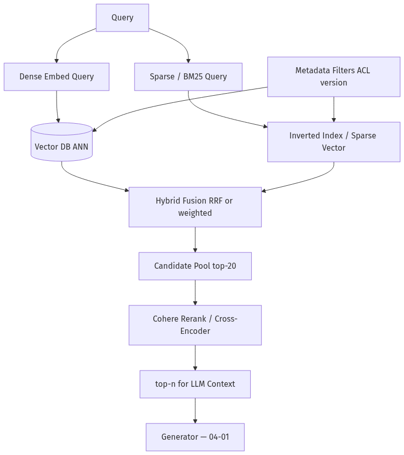
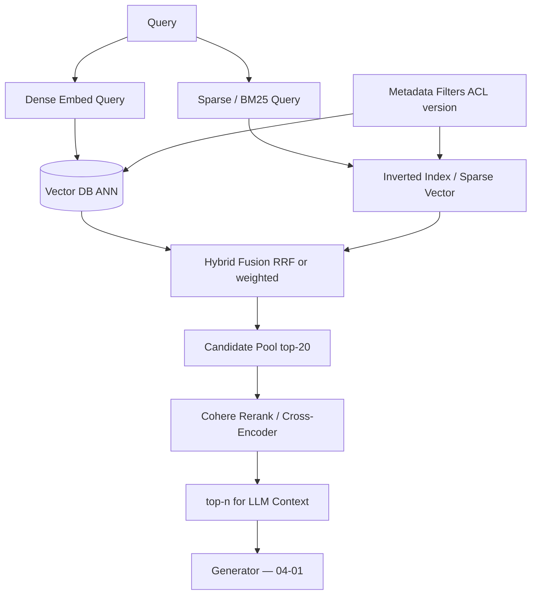
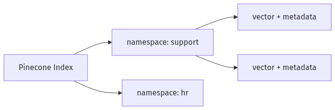
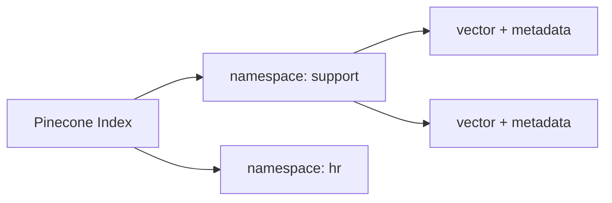
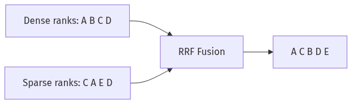
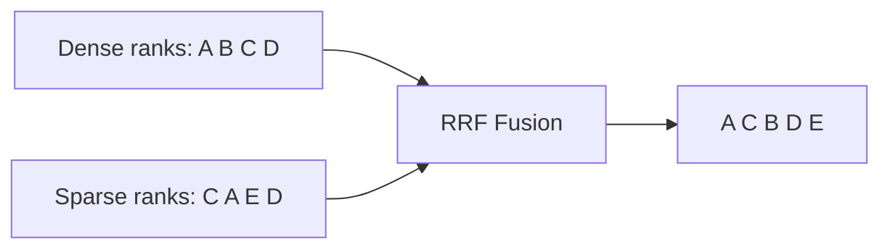
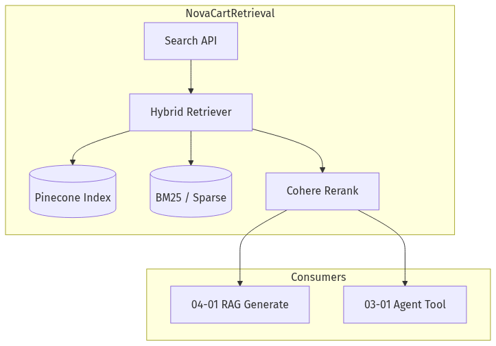
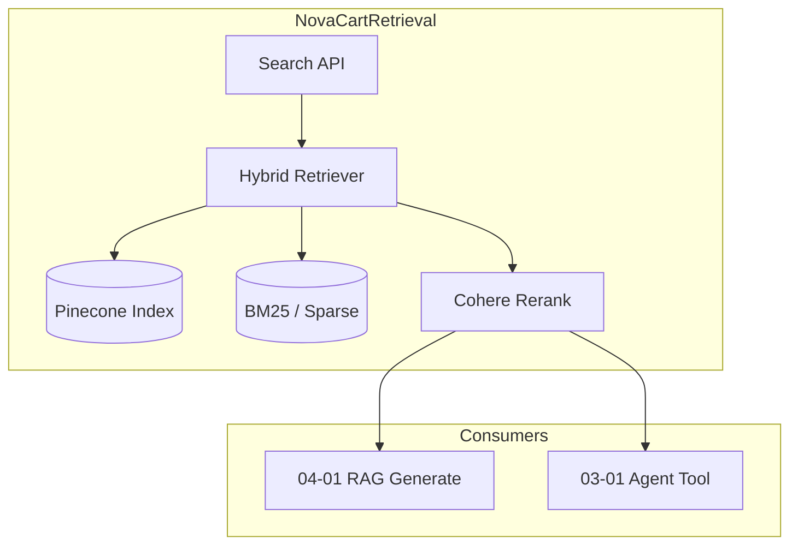
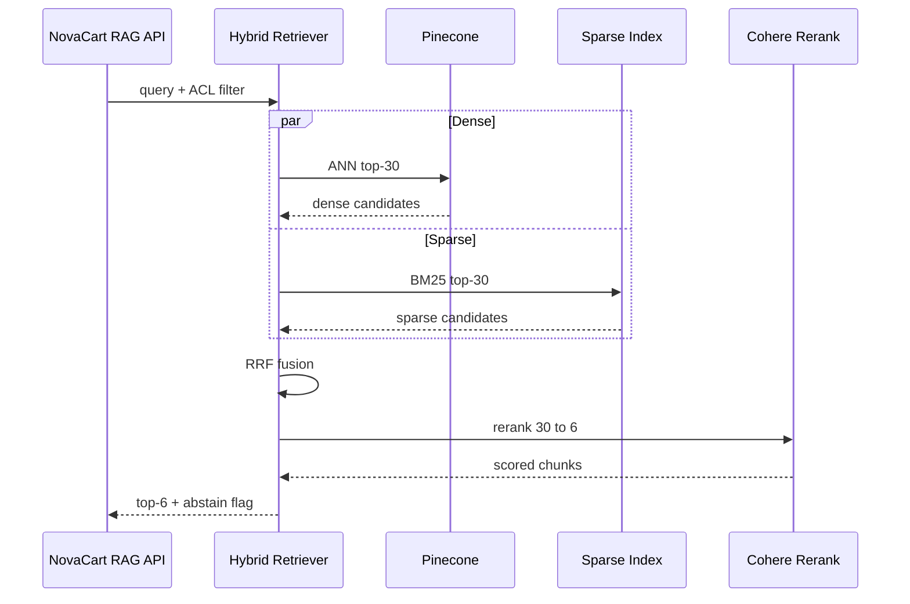

# 04-03 — Vector DBs, Hybrid Search & Reranking

| Meta | Value |
|------|-------|
| **Estimated Time** | 5–6 hours (read 2h · lab 3h · precision tuning 1h) |
| **Difficulty** | Intermediate (vector DB ops) · Advanced (hybrid fusion + rerank calibration) |
| **Prerequisites** | [04-01 RAG Architecture](04-01-RAG-Architecture.md) · [04-02 Chunking & Embeddings](04-02-Chunking-Metadata-Embeddings.md) |
| **Module** | 04 — RAG Knowledge Agents |
| **Related** | [04-04 Advanced RAG](04-04-Advanced-RAG-HyDE-GraphRAG.md) · [03-01 Agent Anatomy](../03-Agentic-Fundamentals/03-01-Agent-Anatomy-and-Loop.md) · [08-01 Evaluation Lifecycle](../08-Evaluation-LLMOps/08-01-Evaluation-Lifecycle.md) · [11-02 Prompt Injection Defense](../11-Security-Safety/11-02-Prompt-Injection-Defense.md) · [Architecture Index](../../Architecture Index.md) |

---

## Learning Objectives

By the end of this chapter you will be able to:

1. Navigate the **vector database landscape** and explain **Pinecone core concepts**.
2. Implement **hybrid search** (dense + sparse/BM25) with score fusion.
3. Apply **metadata filtering** for ACL and policy-version constraints.
4. Integrate **Cohere Rerank** / cross-encoder reranking for precision.
5. Calibrate retrieval pipelines for **precision vs recall** on NovaCart queries.

---

## Why This Topic Matters

Embedding search alone is **recall-biased**: it finds semantically similar text but misses exact tokens (`NC-GC-8842`, "45 days", §4.1). Vector DBs provide scalable ANN search; hybrid retrieval fixes lexical gaps; reranking fixes **"right neighborhood, wrong paragraph."**

Staff interviews probe: *"We retrieve 20 chunks but answers are still wrong—why?"* Expected answer: **bi-encoder retrieval is fast but imprecise; cross-encoder rerank is slower but accurate**—and metadata filters prevent ACL leaks.

This chapter upgrades the NovaCart stack from in-memory cosine ([04-02](04-02-Chunking-Metadata-Embeddings.md)) to production retrieval.

---

## Business Impact

| Outcome | Retrieval upgrade |
|---------|-------------------|
| **Exact policy clause match** | BM25 catches "30-day" / SKU tokens |
| **Secure multi-team KB** | Metadata filters enforce department ACL |
| **Higher answer precision** | Rerank top-20 → best 5 chunks |
| **Lower LLM cost** | Fewer junk tokens in context |
| **Scalable QPS** | Managed ANN vs brute-force cosine |

**NovaCart scenario:** Query *"refund gift card 45 days billing error"* — vector search finds gift-card policy; BM25 boosts "45 days"; rerank promotes the exception clause to rank 1.

---

## Architecture Overview





---

## Core Concepts

### 1) Vector DB Landscape

| System | Type | Strengths | Watch-outs |
|--------|------|-----------|------------|
| **Pinecone** | Managed SaaS | Ops-free scale; metadata filters | Vendor lock-in; cost at scale |
| **Weaviate** | OSS + cloud | Hybrid built-in; modules | Operate yourself if OSS |
| **Qdrant** | OSS + cloud | Filters; payload indexes | Tune HNSW params |
| **pgvector** | Postgres extension | Single DB for app + vectors | ANN scale limits |
| **Milvus / Zilliz** | OSS / cloud | Large-scale ANN | Complexity |
| **Elasticsearch** | Search engine + dense | Mature BM25 + hybrid | Vector ops newer |
| **Chroma / LanceDB** | Dev-friendly embedded | Fast prototyping | Prod scale patterns vary |

**Selection heuristic for NovaCart (Series B e-commerce):**

- **< 1M chunks, need speed to ship:** Pinecone or Weaviate Cloud.
- **Already on Postgres, < 500K chunks:** pgvector + BM25 sidecar.
- **Strict data residency:** Qdrant/Milvus self-hosted.

---

### 2) Pinecone Concepts

Reference: [Pinecone Getting Started](https://docs.pinecone.io/guides/get-started/overview)

| Concept | Meaning | NovaCart mapping |
|---------|---------|------------------|
| **Index** | Vector database container | `novacart-kb-prod` |
| **Namespace** | Logical partition inside index | `support`, `hr` (or use metadata instead) |
| **Vector ID** | Unique ID per chunk | `returns-policy-v3#12` |
| **Values** | Embedding floats | 1536-dim from `text-embedding-3-small` |
| **Metadata** | Filterable JSON | `department`, `policy_version`, `title` |
| **Query** | ANN search + optional filter | top_k=20 with `department=support` |
| **Upsert** | Insert/update vectors | Webhook ingest from [04-02](04-02-Chunking-Metadata-Embeddings.md) |





**Serverless vs pod-based:** Serverless suits variable traffic; pods for predictable high QPS with cost tuning.

---

### 3) Hybrid Search

#### Definition

**Hybrid search** combines **dense vector similarity** with **sparse lexical scoring** (BM25, SPLADE, or DB-native sparse vectors).

#### Why NovaCart needs it

| Query type | Dense alone | + Lexical |
|------------|-------------|-----------|
| "gift card refund policy" | Strong | Strong |
| "45 days billing error" | Weak on "45 days" | Strong |
| `NC-GC-8842` SKU | Often weak | Strong with SKU field |

#### Fusion strategies

| Method | Formula intuition | When to use |
|--------|-------------------|-------------|
| **Reciprocal Rank Fusion (RRF)** | Score by rank positions, not raw scores | Different score scales |
| **Weighted linear** | `α * dense + (1-α) * sparse` | Tunable on golden set |
| **DB-native hybrid** | Pinecone / Weaviate single query | Less glue code |





**Starting α:** 0.7 dense / 0.3 sparse; sweep on recall@20.

---

### 4) Metadata Filtering

#### Definition

**Pre-filter** or **post-filter** vectors by metadata predicates during query.

#### NovaCart filter examples

```json
{
  "department": {"$in": ["support", "all"]},
  "policy_version": {"$gte": "3.0.0"},
  "language": {"$eq": "en"},
  "doc_type": {"$in": ["policy", "faq"]}
}
```

#### Pre vs post filter

| Mode | Behavior | Risk |
|------|----------|------|
| **Pre-filter** | ANN within matching rows | Requires indexed metadata |
| **Post-filter** | ANN then drop non-matching | May return < k results |

**Security rule:** ACL filters are **mandatory pre-filters**, not prompt instructions ([11-02](../11-Security-Safety/11-02-Prompt-Injection-Defense.md)).

---

### 5) Reranking with Cohere / Cross-Encoders

#### Bi-encoder vs cross-encoder

| | Bi-encoder (embed + ANN) | Cross-encoder (rerank) |
|--|--------------------------|------------------------|
| **Scoring** | Separate query/doc embed | Joint attention on pair |
| **Speed** | Fast at millions | Slow per pair |
| **Use** | Retrieve top-20 | Rerank 20 → 5 |
| **Quality** | Good recall | High precision |

Reference: [Cohere Rerank Overview](https://docs.cohere.com/docs/rerank-overview)

#### Pipeline

1. Hybrid retrieve **k=20–50** (recall).
2. Rerank to **n=5–8** (precision).
3. Pass **n** to LLM context ([04-01](04-01-RAG-Architecture.md)).

#### Score calibration

Use rerank score for **abstain gate**:

| rerank top score | Action |
|------------------|--------|
| ≥ 0.45 | Generate with citations |
| 0.25 – 0.45 | Generate + low-confidence flag |
| < 0.25 | Abstain |

Calibrate on NovaCart golden set ([08-01](../08-Evaluation-LLMOps/08-01-Evaluation-Lifecycle.md)).

---

### 6) Precision vs Recall in Production

| Optimize recall when… | Optimize precision when… |
|-----------------------|--------------------------|
| Missing gold doc is costly | LLM context window is tight |
| Rare policies exist | Hallucination from noise chunks |
| Legal "must surface any mention" | User expects one crisp answer |

**NovaCart default:** high recall at retrieve (k=30), high precision at rerank (n=6).

---

## Implementation

### NovaCart Hybrid Retrieve + Cohere Rerank — FastAPI + Pydantic

Uses LangChain retriever patterns with pluggable vector store; includes BM25 fallback for local dev without Pinecone.

```python
"""NovaCart hybrid search + Cohere rerank API.

Run:
  pip install fastapi uvicorn pydantic langchain langchain-openai cohere rank-bm25
  export OPENAI_API_KEY=...
  export COHERE_API_KEY=...   # optional; falls back to score sort

  uvicorn novacart_retrieval:app --reload
"""

from __future__ import annotations

import math
import os
import uuid
from datetime import datetime, timezone
from typing import Any

import numpy as np
from fastapi import FastAPI, HTTPException
from pydantic import BaseModel, Field
from langchain_openai import OpenAIEmbeddings
from rank_bm25 import BM25Okapi

try:
    import cohere
except ImportError:  # pragma: no cover
    cohere = None  # type: ignore

EMBED_MODEL = "text-embedding-3-small"
RERANK_MODEL = "rerank-v3.5"
RETRIEVE_K = 30
RERANK_N = 6
MIN_RERANK_SCORE = 0.35


class ChunkPayload(BaseModel):
    chunk_id: str
    text: str
    metadata: dict[str, Any]


class UpsertRequest(BaseModel):
    chunks: list[ChunkPayload]


class SearchRequest(BaseModel):
    query: str = Field(min_length=2)
    department: str = "support"
    policy_version_min: str | None = "3.0.0"
    retrieve_k: int = Field(default=RETRIEVE_K, ge=5, le=100)
    rerank_n: int = Field(default=RERANK_N, ge=1, le=20)


class ScoredChunk(BaseModel):
    chunk_id: str
    text: str
    metadata: dict[str, Any]
    dense_score: float | None = None
    sparse_score: float | None = None
    rrf_score: float | None = None
    rerank_score: float | None = None
    rank: int


class SearchResponse(BaseModel):
    request_id: str
    query: str
    results: list[ScoredChunk]
    abstain_recommended: bool
    abstain_reason: str | None = None
    created_at: datetime


# ---------------------------------------------------------------------------
# In-memory hybrid index (swap Pinecone SDK in production)
# ---------------------------------------------------------------------------
STORE: dict[str, ChunkPayload] = {}
VECTORS: dict[str, list[float]] = {}
BM25: BM25Okapi | None = None
DOC_IDS: list[str] = []
embedder = OpenAIEmbeddings(model=EMBED_MODEL)


def _version_gte(v: str, minimum: str) -> bool:
    def parse(s: str) -> tuple[int, ...]:
        return tuple(int(x) for x in s.split(".")[:3])

    return parse(v) >= parse(minimum)


def _metadata_pass(meta: dict[str, Any], department: str, policy_version_min: str | None) -> bool:
    dept = meta.get("department", "all")
    if dept not in (department, "all"):
        return False
    if policy_version_min:
        pv = meta.get("policy_version", "0.0.0")
        if not _version_gte(str(pv), policy_version_min):
            return False
    return True


def _rebuild_bm25() -> None:
    global BM25, DOC_IDS
    DOC_IDS = list(STORE.keys())
    corpus = [STORE[cid].text.lower().split() for cid in DOC_IDS]
    BM25 = BM25Okapi(corpus) if corpus else None


def _cosine(a: list[float], b: list[float]) -> float:
    va, vb = np.array(a), np.array(b)
    d = float(np.linalg.norm(va) * np.linalg.norm(vb))
    return float(np.dot(va, vb) / d) if d else 0.0


def _rrf(rank: int, k: int = 60) -> float:
    return 1.0 / (k + rank)


def hybrid_search(
    query: str,
    department: str,
    policy_version_min: str | None,
    retrieve_k: int,
) -> list[tuple[str, float, float, float]]:
    if not STORE:
        return []

    allowed = {
        cid for cid, c in STORE.items()
        if _metadata_pass(c.metadata, department, policy_version_min)
    }

    q_vec = embedder.embed_query(query)

    dense_ranked: list[tuple[str, float]] = []
    for cid in allowed:
        vec = VECTORS.get(cid)
        if vec:
            dense_ranked.append((cid, _cosine(q_vec, vec)))
    dense_ranked.sort(key=lambda x: x[1], reverse=True)

    sparse_ranked: list[tuple[str, float]] = []
    if BM25 and DOC_IDS:
        tokens = query.lower().split()
        scores = BM25.get_scores(tokens)
        sparse_ranked = [
            (DOC_IDS[i], float(scores[i]))
            for i in range(len(DOC_IDS))
            if DOC_IDS[i] in allowed
        ]
        sparse_ranked.sort(key=lambda x: x[1], reverse=True)

    rrf_scores: dict[str, float] = {}
    dense_map = {cid: s for cid, s in dense_ranked}
    sparse_map = {cid: s for cid, s in sparse_ranked}

    for rank, (cid, _) in enumerate(dense_ranked[: retrieve_k * 2]):
        rrf_scores[cid] = rrf_scores.get(cid, 0.0) + _rrf(rank + 1)
    for rank, (cid, _) in enumerate(sparse_ranked[: retrieve_k * 2]):
        rrf_scores[cid] = rrf_scores.get(cid, 0.0) + _rrf(rank + 1)

    fused = sorted(rrf_scores.items(), key=lambda x: x[1], reverse=True)[:retrieve_k]
    return [
        (cid, dense_map.get(cid, 0.0), sparse_map.get(cid, 0.0), rrf)
        for cid, rrf in fused
    ]


def cohere_rerank(query: str, docs: list[tuple[str, str]], top_n: int) -> list[tuple[str, float]]:
    if not docs:
        return []
    api_key = os.getenv("COHERE_API_KEY")
    if cohere is None or not api_key:
        return [(cid, 1.0 - i * 0.01) for i, (cid, _) in enumerate(docs[:top_n])]

    client = cohere.ClientV2(api_key=api_key)
    resp = client.rerank(
        model=RERANK_MODEL,
        query=query,
        documents=[text for _, text in docs],
        top_n=min(top_n, len(docs)),
    )
    out: list[tuple[str, float]] = []
    for item in resp.results:
        cid = docs[item.index][0]
        out.append((cid, float(item.relevance_score)))
    return out


app = FastAPI(title="NovaCart Hybrid Retrieval", version="1.0.0")


@app.post("/v1/index/upsert")
def upsert(req: UpsertRequest) -> dict[str, int]:
    texts = [c.text for c in req.chunks]
    vectors = embedder.embed_documents(texts)
    for chunk, vec in zip(req.chunks, vectors):
        STORE[chunk.chunk_id] = chunk
        VECTORS[chunk.chunk_id] = vec
    _rebuild_bm25()
    return {"upserted": len(req.chunks), "total": len(STORE)}


@app.post("/v1/search/hybrid", response_model=SearchResponse)
def search(req: SearchRequest) -> SearchResponse:
    request_id = str(uuid.uuid4())
    fused = hybrid_search(
        req.query,
        req.department,
        req.policy_version_min,
        req.retrieve_k,
    )
    if not fused:
        return SearchResponse(
            request_id=request_id,
            query=req.query,
            results=[],
            abstain_recommended=True,
            abstain_reason="no_candidates_after_filter",
            created_at=datetime.now(timezone.utc),
        )

    doc_pairs = [(cid, STORE[cid].text) for cid, _, _, _ in fused]
    reranked = cohere_rerank(req.query, doc_pairs, req.rerank_n)

    results: list[ScoredChunk] = []
    for rank, (cid, rr_score) in enumerate(reranked, start=1):
        dense, sparse, rrf = next((d, s, r) for c, d, s, r in fused if c == cid)
        payload = STORE[cid]
        results.append(
            ScoredChunk(
                chunk_id=cid,
                text=payload.text,
                metadata=payload.metadata,
                dense_score=dense,
                sparse_score=sparse,
                rrf_score=rrf,
                rerank_score=rr_score,
                rank=rank,
            )
        )

    top = results[0].rerank_score if results else 0.0
    abstain = top < MIN_RERANK_SCORE

    return SearchResponse(
        request_id=request_id,
        query=req.query,
        results=results,
        abstain_recommended=abstain,
        abstain_reason="rerank_below_threshold" if abstain else None,
        created_at=datetime.now(timezone.utc),
    )


@app.get("/health")
def health() -> dict[str, Any]:
    return {"chunks": len(STORE), "bm25_ready": BM25 is not None}
```

#### Pinecone production swap (conceptual)

Replace `STORE`/`VECTORS` with:

```python
# index.upsert(vectors=[{"id": chunk_id, "values": vec, "metadata": meta}])
# index.query(vector=q_vec, top_k=30, filter={"department": {"$in": ["support", "all"]}})
```

Hybrid: enable sparse-dense on index or run parallel BM25 in Elasticsearch.

---

## Production Considerations

| Concern | Practice |
|---------|----------|
| Index rebuild | Blue/green index; alias swap |
| Embedding dim mismatch | Validate on upsert |
| Filter cardinality | Index metadata fields used in ACL |
| Rerank latency | Cache rerank for top queries; async for batch |
| Cold start | Warm ANN with representative queries |

---

## Security

| Threat | Control |
|--------|---------|
| Metadata filter bypass | Server-side filter only; never trust client |
| Namespace bleed | Separate indexes for highly sensitive data |
| Query logging PII | Redact; retention policy |
| Third-party rerank | Data processing agreement; no training opt-out |

Cross-ref: [11-02 Prompt Injection Defense](../11-Security-Safety/11-02-Prompt-Injection-Defense.md)

---

## Performance

| Stage | p95 target |
|-------|------------|
| Pinecone ANN k=30 | 50–200 ms |
| BM25 (sidecar) | 20–100 ms |
| Cohere rerank 30→6 | 150–400 ms |
| **Retrieve subtotal** | **< 500 ms** |

Run dense + sparse **in parallel**.

---

## Cost

| Component | Cost driver |
|-----------|-------------|
| Pinecone | Stored vectors + QPS tier |
| Embed API | Upsert volume |
| Cohere rerank | $ per search unit |
| Mitigation | Cache; reduce retrieve_k after tuning |

**Rule:** Rerank 30 docs × $/call beats stuffing 30 chunks into GPT context.

---

## Scalability

| Layer | Scale |
|-------|-------|
| Vector index | Replicas; namespace sharding |
| Hybrid lexical | Elasticsearch cluster |
| Rerank | Batch API for offline eval; sync for online |
| Read path | Stateless FastAPI + connection pooling |

---

## Failure Modes

| Failure | Symptom | Fix |
|---------|---------|-----|
| Post-filter too aggressive | Empty results | Pre-filter metadata indexes |
| RRF miscalibrated | Wrong fusion | Tune α or k constant |
| Rerank timeout | Slow API | Fallback to RRF order |
| Stale sparse index | Missing new docs | Sync BM25 on upsert |
| Score threshold too high | Over-abstain | Calibrate on golden set |

---

## Observability

```text
request_id, query, retrieve_k, rerank_n,
dense_top_score, sparse_top_score, rrf_top, rerank_top,
filter_predicate, result_chunk_ids[], abstain_recommended,
latency_ms_dense, latency_ms_sparse, latency_ms_rerank
```

---

## Debugging

| Issue | Investigation |
|-------|---------------|
| Gold chunk rank 25 | Increase k; check chunking ([04-02](04-02-Chunking-Metadata-Embeddings.md)) |
| Lexical miss | Add SKU to metadata `keywords` field |
| Rerank demotes gold | Query rewrite ([04-04](04-04-Advanced-RAG-HyDE-GraphRAG.md)) |
| Filter excludes all | Log metadata on gold chunk |

---

## Common Mistakes

1. Skipping rerank to "save latency" while wasting LLM tokens on noise.
2. Post-filter ACL with small k — returns empty.
3. Comparing dense and sparse raw scores without RRF.
4. rerank_n = retrieve_k (no precision gain).
5. No abstain threshold on rerank score.

---

## Tradeoffs

| Choice | Upside | Downside |
|--------|--------|----------|
| Managed Pinecone | Fast ship | Cost; vendor |
| pgvector only | Simple stack | Hybrid DIY |
| RRF vs weighted | Robust fusion | Needs tuning |
| Cross-encoder rerank | Best precision | Latency + $ |

---

## Architecture Diagram





---

## Mermaid Diagram — Sequence



---

## Production Examples

| Company pattern | Retrieval stack |
|-----------------|-----------------|
| Enterprise search | Elasticsearch hybrid + rerank |
| Support KB | Pinecone + Cohere |
| Dev docs | pgvector + ripgrep fallback |

---

## Real Companies Using It (Public Patterns)

| Org | Pattern |
|-----|---------|
| **Pinecone** | Documented hybrid + metadata filtering |
| **Cohere** | Rerank as API precision layer |
| **Weaviate** | Native hybrid fusion |
| **Perplexity-style** | Multi-stage retrieve + rerank |

---

## Hands-on Labs

### Lab A — Hybrid vs dense (60 min)

Run 15 NovaCart queries; compare recall@10 dense-only vs hybrid.

### Lab B — Rerank ablation (45 min)

Disable Cohere; measure groundedness drop on golden set.

### Lab C — Metadata ACL (30 min)

Upsert HR chunks; verify filter excludes them for support role.

---

## Coding Assignments

1. Replace in-memory store with Pinecone SDK upsert/query.
2. Add `keywords` metadata field boosted in BM25 token list.
3. Wire search API as LangChain tool for agent ([03-01](../03-Agentic-Fundamentals/03-01-Agent-Anatomy-and-Loop.md)).

---

## Mini Project

**Title:** NovaCart Hybrid Search v1  
**Done when:** RRF fusion; Cohere rerank; abstain flag; pytest on ACL filter.

---

## Production Project

**Title:** Blue/green index migration  
**Done when:** dual-index eval gate before alias swap ([08-01](../08-Evaluation-LLMOps/08-01-Evaluation-Lifecycle.md)).

---

## Stretch Project

Implement **async rerank cache** keyed by `(query_norm, index_version)`.

---

## Interview Questions

### Senior Engineer

1. Why hybrid search instead of vectors alone?
2. Explain bi-encoder vs cross-encoder in one minute.
3. What Pinecone metadata would you filter for ACL?

### Staff Engineer

1. Design NovaCart retrieval with k=30, rerank to 6—justify numbers.
2. How do you calibrate abstain threshold on rerank scores?
3. pgvector vs Pinecone for 2M chunks—decision?

### Principal Engineer

1. Org-wide retrieval platform: what is shared vs per-product?
2. How do you run shadow traffic on a new index version?
3. Cost model: rerank vs larger k into LLM?

### Engineering Manager

1. Retrieval p95 regressed 300ms—triage plan?
2. Vendor lock-in concerns with Pinecone + Cohere—mitigation?
3. KPIs for retrieval team vs generation team?

### Whiteboard

Draw hybrid fusion + rerank pipeline; mark abstain gate.

### Follow-ups

- What if Cohere is down?
- How handle multilingual queries?
- When does rerank hurt (adversarial docs)?

---

## Revision Notes

- **Vector DB** = scalable ANN + metadata filters.
- **Hybrid** = dense recall + lexical exactness.
- **Rerank** = precision layer before LLM.
- **Abstain** on low rerank score protects trust ([04-01](04-01-RAG-Architecture.md)).
- Advanced query strategies: [04-04](04-04-Advanced-RAG-HyDE-GraphRAG.md).

---

## Summary

Production NovaCart retrieval combines **vector search, lexical hybrid fusion, metadata ACL filters, and cross-encoder reranking** to maximize precision within a tight LLM context budget—measured, calibrated, and wired to abstain when evidence is weak.

---

## Further Reading

| Title | URL | Difficulty | Reading Time | Why Read | Important Sections |
|-------|-----|------------|--------------|----------|--------------------|
| RAG Paper | https://arxiv.org/abs/2005.11401 | Intermediate | 45 min | Retriever quality drives generation | Retrieval component |
| LlamaIndex — Vector Stores | https://docs.llamaindex.ai/en/stable/ | Intro | 30 min | Integrations including Pinecone | Vector store index |
| LangChain RAG | https://python.langchain.com/docs/concepts/rag/ | Intro | 25 min | Retriever + document chain | Retrieval |
| Pinecone Overview | https://docs.pinecone.io/guides/get-started/overview | Intro | 25 min | Indexes, metadata, query | Core concepts |
| Cohere Rerank | https://docs.cohere.com/docs/rerank-overview | Intro | 20 min | Rerank API and use cases | How rerank works |
| Microsoft GraphRAG | https://microsoft.github.io/graphrag/ | Advanced | 45 min | Graph-based retrieval alternative | Query modes |
