# 04-04 — Advanced RAG: HyDE, GraphRAG & Agentic RAG

| Meta | Value |
|------|-------|
| **Estimated Time** | 6–7 hours (read 2.5h · lab 3h · architecture comparison 1.5h) |
| **Difficulty** | Advanced (multi-hop + graph indexing) |
| **Prerequisites** | [04-01](04-01-RAG-Architecture.md) · [04-02](04-02-Chunking-Metadata-Embeddings.md) · [04-03](04-03-Vector-DB-Hybrid-Search-Reranking.md) · [03-01 Agent Anatomy](../03-Agentic-Fundamentals/03-01-Agent-Anatomy-and-Loop.md) |
| **Module** | 04 — RAG Knowledge Agents |
| **Related** | [03-01 Agent Anatomy](../03-Agentic-Fundamentals/03-01-Agent-Anatomy-and-Loop.md) · [03-04 LangGraph Agents](../03-Agentic-Fundamentals/03-04-LangGraph-Production-Agents.md) · [08-01 Evaluation Lifecycle](../08-Evaluation-LLMOps/08-01-Evaluation-Lifecycle.md) · [11-02 Prompt Injection Defense](../11-Security-Safety/11-02-Prompt-Injection-Defense.md) · [Architecture Index](../../Architecture Index.md) |

---

## Learning Objectives

By the end of this chapter you will be able to:

1. Implement **HyDE (Hypothetical Document Embeddings)** for vocabulary-mismatch queries.
2. Explain **GraphRAG** intuition—community summaries and multi-hop entity reasoning.
3. Design **agentic RAG** loops with query rewriting and tool use.
4. Execute **multi-hop retrieval** when one chunk is insufficient.
5. Choose when advanced patterns justify latency/cost vs baseline RAG from [04-01](04-01-RAG-Architecture.md).

---

## Why This Topic Matters

Baseline RAG fails on hard queries:

- *"Compare NovaCart return policy for marketplace vs first-party sellers when item is opened."* (vocabulary mismatch)
- *"Which teams must approve a billing-error exception over $500?"* (multi-doc hop)
- *"What changed between policy v2.4 and v3.0 for digital goods?"* (temporal + structural)

**Advanced RAG** techniques trade **complexity, latency, and cost** for **recall on hard questions**. Principal interviews expect you to name the pattern, draw the loop, and say when **not** to use it.

This chapter completes the NovaCart Knowledge Agent arc: from architecture ([04-01](04-01-RAG-Architecture.md)) through ingest ([04-02](04-02-Chunking-Metadata-Embeddings.md)) and retrieval ([04-03](04-03-Vector-DB-Hybrid-Search-Reranking.md)) to **adaptive retrieval**.

---

## Business Impact

| Hard question class | Advanced technique | NovaCart benefit |
|---------------------|-------------------|------------------|
| Colloquial user language | HyDE | Matches policy diction in embed space |
| Cross-policy reasoning | Multi-hop / GraphRAG | Correct escalations |
| Exploratory "what connects to X?" | Graph community search | Staff onboarding |
| Ambiguous intent | Agentic query rewrite | Fewer wrong retrieves |
| Ad-hoc tool + doc blend | Agentic RAG | Order lookup + policy in one flow |

**Cost warning:** HyDE adds 1 LLM call; multi-hop adds 2–5 retrieves; GraphRAG indexing is offline-heavy. Ship baseline RAG first; add advanced paths when evals prove need ([08-01](../08-Evaluation-LLMOps/08-01-Evaluation-Lifecycle.md)).

---

## Architecture Overview

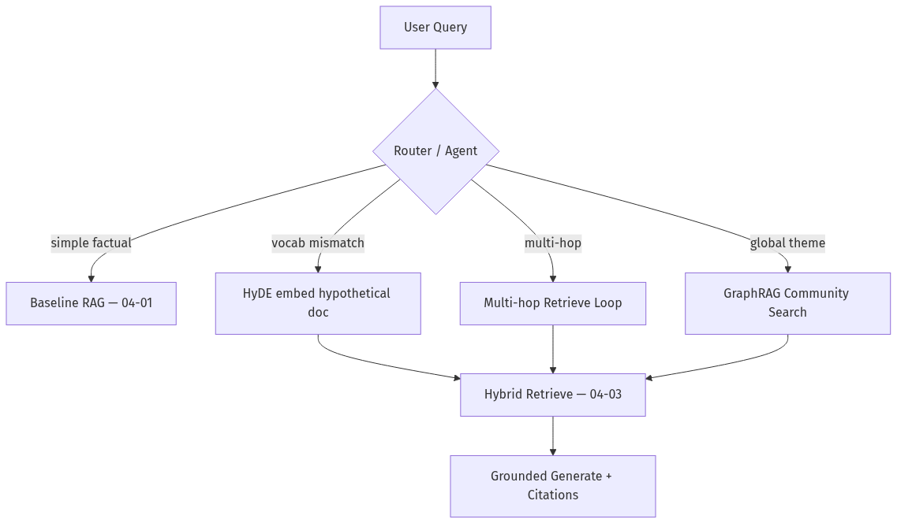

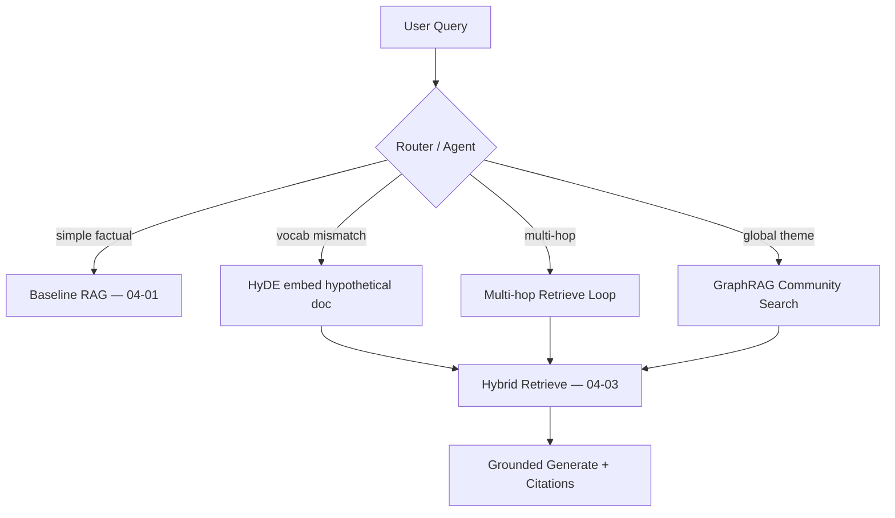

Agentic orchestration connects to [03-01 Think→Act→Observe](../03-Agentic-Fundamentals/03-01-Agent-Anatomy-and-Loop.md).

---

## Core Concepts

### 1) HyDE — Hypothetical Document Embeddings

#### Definition

**HyDE** asks the LLM to **write a hypothetical answer document** (not shown to user as truth), embeds that text, and retrieves real chunks similar to the hypothetical prose.

#### Intuition

User query: *"Can I get money back on a gift card after a month?"*  
Hypothetical doc uses policy language: *"Digital gift cards are non-refundable after 30 days except billing errors per Section 4.1…"*  
Embedding the hypothetical doc lands closer to actual policy chunks than embedding the casual query.

#### When to use

- Colloquial vs formal vocabulary gap.
- Short queries with low embed signal.
- Eval shows low recall@k on paraphrase-heavy questions.

#### When NOT to use

- Exact ID/SKU lookup → hybrid BM25 ([04-03](04-03-Vector-DB-Hybrid-Search-Reranking.md)).
- Latency-sensitive path with tight p95.
- High injection risk queries—hypothetical doc can drift if prompt hijacked ([11-02](../11-Security-Safety/11-02-Prompt-Injection-Defense.md)).

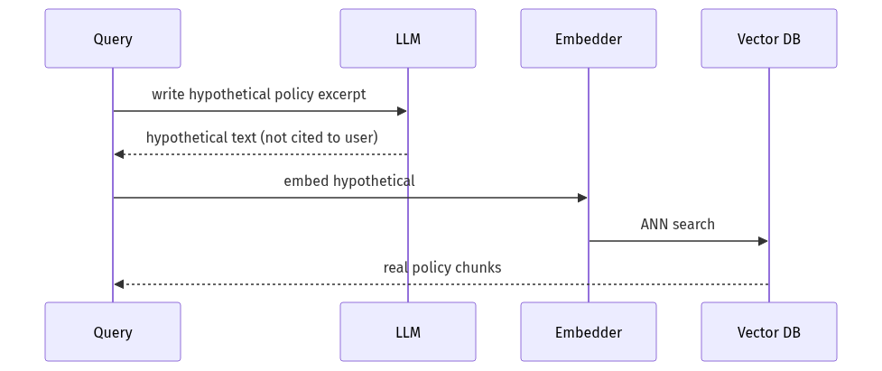

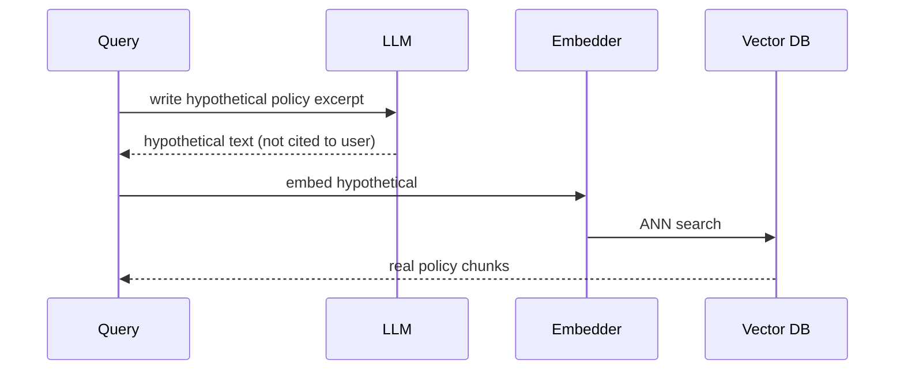

---

### 2) GraphRAG Intuition

Reference: [Microsoft GraphRAG](https://microsoft.github.io/graphrag/)

#### Definition

**GraphRAG** builds a **knowledge graph** from documents (entities + relationships), clusters into **communities**, summarizes communities, and supports **local** (entity-neighborhood) and **global** (theme-level) search.

#### Pipeline (offline)

1. Extract entities/edges from chunks via LLM.
2. Build graph (NetworkX / GraphML).
3. Detect communities (Leiden algorithm).
4. Generate community summaries.
5. Index: entity descriptions + community reports + source chunks.

#### Query modes

| Mode | Question type | NovaCart example |
|------|---------------|------------------|
| **Local search** | Specific entity + neighbors | "Billing error exception — who approves?" |
| **Global search** | Thematic overview | "What are major themes in returns policies?" |

#### When to use

- Corpus with **dense cross-references** (legal, compliance, architecture docs).
- Questions requiring **multi-document synthesis**.
- Exploratory analytics over KB.

#### When NOT to use

- Small FAQ (< 500 chunks)—baseline RAG wins.
- Strict citation to single paragraph—graph summaries are abstractive.
- Team lacks graph index ops maturity.

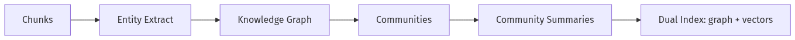

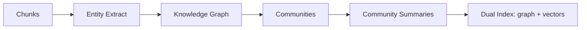

---

### 3) Agentic RAG

#### Definition

**Agentic RAG** wraps retrieval in an **agent loop** ([03-01](../03-Agentic-Fundamentals/03-01-Agent-Anatomy-and-Loop.md)): plan → retrieve → critique → maybe retrieve again → answer or abstain.

#### Capabilities beyond static RAG

| Capability | Agent action |
|------------|--------------|
| Query rewrite | Reformulate for retrieval |
| Tool selection | RAG vs SQL vs ticket API |
| Self-critique | "Context insufficient—search again" |
| Multi-step | Sub-questions for comparison queries |

#### Control flow

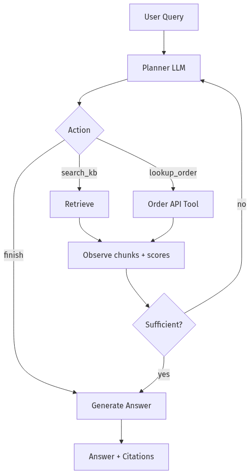

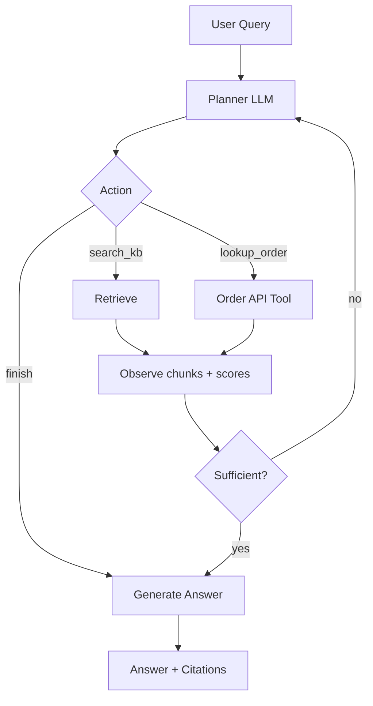

#### Production guardrails

- Max hops (e.g. 3 retrieves).
- Token budget per episode.
- Abstain if loop exhausts budget ([04-01](04-01-RAG-Architecture.md)).
- Log every hop for eval ([08-01](../08-Evaluation-LLMOps/08-01-Evaluation-Lifecycle.md)).

---

### 4) Query Rewriting

#### Definition

**Query rewriting** transforms the user message into retrieval-optimized text before embed/search.

#### Rewrite strategies

| Strategy | Example |
|----------|---------|
| **HyDE-style** | Generate hypothetical policy paragraph |
| **Decomposition** | Split comparison into two sub-queries |
| **Expansion** | Add synonyms: refund → return / credit |
| **Metadata injection** | Append `policy_version:3` when detected |
| **Clarification** | Ask user if ambiguous (conversational) |

#### NovaCart rewrite prompt (sketch)

> Rewrite the support agent's question into a formal policy lookup query. Include product category if inferable. Do not answer—output search query only.

**Risk:** Rewrite can hallucinate constraints—always retrieve on rewrite, never trust rewrite as fact.

---

### 5) Multi-Hop Retrieval

#### Definition

**Multi-hop** answers questions requiring **evidence from more than one retrieval step**, linked by intermediate entities or sub-questions.

#### Example

**Q:** *"Can Tier 1 approve a marketplace gift card refund if opened after 45 days?"*

| Hop | Sub-query | Retrieves |
|-----|-----------|-----------|
| 1 | marketplace seller return responsibility | marketplace-policy#2 |
| 2 | gift card 45 day exception tier 1 authority | gift-card-exceptions#3 |
| 3 | tier 1 approval limits dollar threshold | escalation-matrix#1 |

#### Patterns

| Pattern | Mechanism |
|---------|-----------|
| **Sequential** | Each hop conditions on prior chunks |
| **Parallel decompose** | Sub-queries run concurrently; merge context |
| **Graph walk** | Follow edges from GraphRAG entity |
| **Agent loop** | LLM decides next search ([03-01](../03-Agentic-Fundamentals/03-01-Agent-Anatomy-and-Loop.md)) |

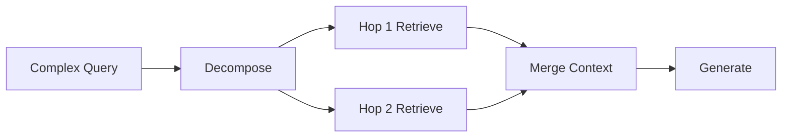

#### Stop conditions

- Max hops reached.
- Rerank score below threshold on new hop.
- Duplicate chunk IDs (loop detection).

---

### 6) Choosing Advanced vs Baseline RAG

| Signal | Start baseline | Add advanced |
|--------|----------------|--------------|
| Golden set accuracy | > 85% | < 75% on subset |
| Query types | Single-fact | Compare / synthesize |
| Latency SLO | < 2s | < 8s acceptable |
| Index ops budget | Small team | Dedicated search platform |
| Eval gap | Paraphrase failures | Multi-doc failures |

**Principal rule:** Advanced RAG is **conditional compilation**—route simple queries to fast path.

---

## Implementation

### NovaCart Advanced RAG Orchestrator — LlamaIndex + FastAPI + Pydantic

Unified API: routes to baseline, HyDE, or multi-hop agentic loop.

```python
"""NovaCart Advanced RAG: HyDE, query rewrite, multi-hop agentic retrieval.

Run:
  pip install fastapi uvicorn pydantic llama-index llama-index-embeddings-openai \\
      llama-index-llms-openai
  export OPENAI_API_KEY=...
  uvicorn novacart_advanced_rag:app --reload
"""

from __future__ import annotations

import json
import uuid
from datetime import datetime, timezone
from enum import Enum
from typing import Any

from fastapi import FastAPI, HTTPException
from pydantic import BaseModel, Field
from llama_index.core import Document, VectorStoreIndex
from llama_index.core.node_parser import SentenceSplitter
from llama_index.core.schema import TextNode
from llama_index.embeddings.openai import OpenAIEmbedding
from llama_index.llms.openai import OpenAI

EMBED_MODEL = "text-embedding-3-small"
LLM_MODEL = "gpt-4.1-mini"
MAX_HOPS = 3
MIN_SCORE = 0.38

embed_model = OpenAIEmbedding(model=EMBED_MODEL)
llm = OpenAI(model=LLM_MODEL, temperature=0.0)

_nodes: list[TextNode] = []
_index: VectorStoreIndex | None = None


class RetrievalMode(str, Enum):
    BASELINE = "baseline"
    HYDE = "hyde"
    MULTI_HOP = "multi_hop"
    AUTO = "auto"


class AdvancedRAGRequest(BaseModel):
    query: str = Field(min_length=3, max_length=4000)
    mode: RetrievalMode = RetrievalMode.AUTO
    department: str = "support"
    max_hops: int = Field(default=MAX_HOPS, ge=1, le=5)
    top_k: int = Field(default=6, ge=1, le=20)


class HopTrace(BaseModel):
    hop: int
    search_query: str
    chunk_ids: list[str]
    top_score: float
    rewrite_reason: str | None = None


class Citation(BaseModel):
    chunk_id: str
    quote: str


class AdvancedRAGResponse(BaseModel):
    request_id: str
    query: str
    mode_used: RetrievalMode
    answer: str
    citations: list[Citation]
    hops: list[HopTrace]
    abstained: bool
    created_at: datetime


def _ensure_index() -> VectorStoreIndex:
    global _index
    if _index is None:
        if not _nodes:
            raise HTTPException(status_code=503, detail="Index empty — POST /v1/seed")
        _index = VectorStoreIndex(_nodes, embed_model=embed_model)
    return _index


def _acl_nodes(department: str) -> set[str]:
    allowed = {department, "all"}
    return {n.node_id for n in _nodes if n.metadata.get("department") in allowed}


def _retrieve(query: str, department: str, top_k: int) -> list[tuple[TextNode, float]]:
    index = _ensure_index()
    allowed = _acl_nodes(department)
    results = index.as_retriever(similarity_top_k=top_k * 3).retrieve(query)
    filtered = [(r.node, float(r.score or 0.0)) for r in results if r.node.node_id in allowed]
    filtered.sort(key=lambda x: x[1], reverse=True)
    return filtered[:top_k]


def _hyde_query(user_query: str) -> str:
    prompt = (
        "Write a short hypothetical NovaCart internal policy excerpt that would answer "
        "the question below. Use formal policy language. Do not invent section numbers. "
        f"Question: {user_query}"
    )
    return llm.complete(prompt).text.strip()


def _rewrite_subqueries(user_query: str, context_snippets: list[str]) -> list[str]:
    ctx = "\n".join(context_snippets[:3])
    prompt = (
        "Decompose the question into 1-2 focused search queries for a policy KB. "
        "Return JSON list of strings only.\n"
        f"Question: {user_query}\n"
        f"Context so far: {ctx}"
    )
    raw = llm.complete(prompt).text.strip()
    try:
        queries = json.loads(raw)
        if isinstance(queries, list) and all(isinstance(q, str) for q in queries):
            return queries[:2]
    except json.JSONDecodeError:
        pass
    return [user_query]


def _generate_grounded(
    query: str,
    nodes: list[TextNode],
) -> tuple[str, list[Citation]]:
    blocks = []
    for n in nodes:
        blocks.append(f"[{n.node_id}]\n{n.get_content()}")
    context = "\n---\n".join(blocks)
    prompt = (
        "Answer ONLY from CONTEXT. Include CITATIONS as JSON list "
        '[{"chunk_id":"...","quote":"..."}] after ANSWER.\n\n'
        f"CONTEXT:\n{context}\n\nQUESTION: {query}"
    )
    raw = llm.complete(prompt).text
    if "CITATIONS:" in raw:
        ans, cite_raw = raw.split("CITATIONS:", 1)
        answer = ans.replace("ANSWER:", "").strip()
        try:
            cites_data = json.loads(cite_raw.strip())
            citations = [Citation(**c) for c in cites_data if "chunk_id" in c and "quote" in c]
            return answer, citations
        except json.JSONDecodeError:
            return answer if 'answer' in dir() else raw, []
    return raw, []


def _classify_mode(query: str) -> RetrievalMode:
    """Lightweight router — production: classifier or LLM router."""
    lower = query.lower()
    if any(w in lower for w in ("compare", "difference", "both", "and also", "versus", "vs")):
        return RetrievalMode.MULTI_HOP
    if len(query.split()) <= 6:
        return RetrievalMode.HYDE
    return RetrievalMode.BASELINE


def run_baseline(req: AdvancedRAGRequest) -> tuple[list[TextNode], list[HopTrace]]:
    hits = _retrieve(req.query, req.department, req.top_k)
    nodes = [n for n, _ in hits]
    score = hits[0][1] if hits else 0.0
    trace = [HopTrace(hop=1, search_query=req.query, chunk_ids=[n.node_id for n in nodes], top_score=score)]
    return nodes, trace


def run_hyde(req: AdvancedRAGRequest) -> tuple[list[TextNode], list[HopTrace]]:
    hypo = _hyde_query(req.query)
    hits = _retrieve(hypo, req.department, req.top_k)
    nodes = [n for n, _ in hits]
    score = hits[0][1] if hits else 0.0
    trace = [
        HopTrace(
            hop=1,
            search_query=hypo,
            chunk_ids=[n.node_id for n in nodes],
            top_score=score,
            rewrite_reason="hyde_hypothetical_document",
        )
    ]
    return nodes, trace


def run_multi_hop(req: AdvancedRAGRequest) -> tuple[list[TextNode], list[HopTrace]]:
    traces: list[HopTrace] = []
    seen: set[str] = set()
    collected: list[TextNode] = []

    subqueries = _rewrite_subqueries(req.query, [])
    hop = 0
    while hop < req.max_hops and subqueries:
        hop += 1
        sq = subqueries.pop(0)
        hits = _retrieve(sq, req.department, req.top_k)
        new_nodes = [n for n, s in hits if n.node_id not in seen]
        for n, _ in hits:
            seen.add(n.node_id)
        collected.extend(new_nodes)
        top_score = hits[0][1] if hits else 0.0
        traces.append(
            HopTrace(
                hop=hop,
                search_query=sq,
                chunk_ids=[n.node_id for n, _ in hits],
                top_score=top_score,
                rewrite_reason="decomposed_subquery" if hop > 1 else "initial_decomposition",
            )
        )
        if top_score < MIN_SCORE:
            break
        if hop < req.max_hops:
            snippets = [n.get_content()[:200] for n in collected[:4]]
            more = _rewrite_subqueries(req.query, snippets)
            for m in more:
                if m not in [t.search_query for t in traces]:
                    subqueries.append(m)

    # dedupe preserve order
    uniq: dict[str, TextNode] = {n.node_id: n for n in collected}
    return list(uniq.values())[: req.top_k * 2], traces


app = FastAPI(title="NovaCart Advanced RAG", version="1.0.0")


@app.post("/v1/seed")
def seed_sample_docs() -> dict[str, int]:
    global _index, _nodes
    samples = [
        Document(
            text="## Marketplace returns\nMarketplace sellers handle returns for third-party items. NovaCart facilitates dispute windows only.",
            metadata={"doc_id": "marketplace-policy", "department": "support", "title": "Marketplace Policy"},
        ),
        Document(
            text="## Digital gift cards\nNon-refundable after 30 days except documented billing errors. Tier 1 cannot approve over $500.",
            metadata={"doc_id": "gift-card-exceptions", "department": "support", "title": "Gift Card Exceptions"},
        ),
        Document(
            text="## Escalation matrix\nTier 1 limit $500. Tier 2 billing errors unlimited with supervisor note.",
            metadata={"doc_id": "escalation-matrix", "department": "support", "title": "Escalation Matrix"},
        ),
    ]
    splitter = SentenceSplitter(chunk_size=512, chunk_overlap=64)
    _nodes = splitter.get_nodes_from_documents(samples)
    for i, n in enumerate(_nodes):
        n.node_id = f"{n.metadata.get('doc_id')}#{i}"
    _index = VectorStoreIndex(_nodes, embed_model=embed_model)
    return {"chunks": len(_nodes)}


@app.post("/v1/knowledge/advanced-query", response_model=AdvancedRAGResponse)
def advanced_query(req: AdvancedRAGRequest) -> AdvancedRAGResponse:
    request_id = str(uuid.uuid4())
    mode = _classify_mode(req.query) if req.mode == RetrievalMode.AUTO else req.mode

    if mode == RetrievalMode.BASELINE:
        nodes, traces = run_baseline(req)
    elif mode == RetrievalMode.HYDE:
        nodes, traces = run_hyde(req)
    else:
        nodes, traces = run_multi_hop(req)

    top_score = traces[-1].top_score if traces else 0.0
    if not nodes or top_score < MIN_SCORE:
        return AdvancedRAGResponse(
            request_id=request_id,
            query=req.query,
            mode_used=mode,
            answer="Insufficient policy evidence located. Escalate to Tier 2 policy desk.",
            citations=[],
            hops=traces,
            abstained=True,
            created_at=datetime.now(timezone.utc),
        )

    answer, citations = _generate_grounded(req.query, nodes)
    return AdvancedRAGResponse(
        request_id=request_id,
        query=req.query,
        mode_used=mode,
        answer=answer,
        citations=citations,
        hops=traces,
        abstained=False,
        created_at=datetime.now(timezone.utc),
    )


@app.get("/health")
def health() -> dict[str, Any]:
    return {"chunks": len(_nodes), "modes": [m.value for m in RetrievalMode]}
```

#### GraphRAG integration note

For GraphRAG production, run Microsoft's indexing pipeline offline ([GraphRAG docs](https://microsoft.github.io/graphrag/)) and expose `local_search` / `global_search` as additional tools in the agent router—same abstain + citation validation as vector RAG.

---

## Production Considerations

| Concern | Practice |
|---------|----------|
| Mode router | Start rules-based; graduate to classifier with logged labels |
| HyDE drift | Never show hypothetical doc to user; retrieve only |
| Multi-hop loops | Hard cap hops; detect duplicate chunk sets |
| Graph index freshness | Rebuild communities on major doc releases |
| Cost controls | Route 80% traffic to baseline path |

---

## Security

| Threat | Control |
|--------|---------|
| HyDE injection via query | Sanitize; no tool execution from hypothetical |
| Agent loop exfiltration | Tool allowlist; ACL on every hop |
| Graph summary leakage | Community summaries inherit chunk ACL |
| Unbounded agent hops | Token + hop budget |

See [11-02 Prompt Injection Defense](../11-Security-Safety/11-02-Prompt-Injection-Defense.md).

---

## Performance

| Path | Typical p95 |
|------|-------------|
| Baseline RAG | 1–3 s |
| HyDE (+1 LLM + embed) | 2–5 s |
| Multi-hop (3 hops) | 4–10 s |
| GraphRAG global | 5–15 s |

Use **async** sub-queries in multi-hop where independent.

---

## Cost

| Pattern | Extra cost vs baseline |
|---------|------------------------|
| HyDE | +1 small LLM call + embed |
| Multi-hop | +2–4 retrieve + LLM plan calls |
| GraphRAG index | Offline LLM extract × corpus size |
| Agentic | Variable; cap with budget |

Measure **$/successful grounded answer** not $/query ([08-01](../08-Evaluation-LLMOps/08-01-Evaluation-Lifecycle.md)).

---

## Scalability

| Component | Strategy |
|-----------|----------|
| Router | Lightweight classifier at edge |
| HyDE | Cache by normalized query hash |
| Graph index | Batch rebuild; versioned artifacts in object storage |
| Agent state | Persist hops in Redis for long queries |

---

## Failure Modes

| Failure | Symptom | Mitigation |
|---------|---------|------------|
| HyDE fiction | Retrieves wrong domain | Constrain hypo prompt to policy excerpt |
| Multi-hop runaway | Latency spike | hop cap + duplicate detection |
| Graph stale | Wrong community theme | Version community summaries |
| Wrong mode router | Slow path for simple FAQ | Eval router accuracy |
| Over-merge context | LLM confusion | Rerank after merge ([04-03](04-03-Vector-DB-Hybrid-Search-Reranking.md)) |

---

## Observability

```text
request_id, query, mode_used, mode_router_reason,
hop_count, hop_queries[], chunk_ids_per_hop[],
top_scores[], latency_ms_hyde, latency_ms_total,
abstained, citation_count
```

Compare mode distribution vs quality weekly.

---

## Debugging

| Symptom | Check |
|---------|-------|
| HyDE worse than baseline | Log hypothetical text; eval side-by-side |
| Multi-hop repeats | Duplicate chunk detection |
| GraphRAG too abstract | Prefer local search + chunk citations |
| Agent ignores tools | Tool descriptions + eval trajectories |

---

## Common Mistakes

1. **HyDE for every query** — unnecessary cost/latency.
2. **GraphRAG without citation path** — summaries untrusted by compliance.
3. **Unbounded agent loops** — runaway tokens.
4. **No router** — advanced path becomes default hot path.
5. **Skipping eval per mode** — optimize wrong subsystem.

---

## Tradeoffs

| Pattern | Wins | Costs |
|---------|------|-------|
| HyDE | Paraphrase recall | Extra LLM; hypo drift risk |
| GraphRAG | Global + relational | Index complexity |
| Agentic RAG | Flexible | Hardest to eval/debug |
| Multi-hop | Cross-doc answers | Latency multiplies |

---

## Architecture Diagram

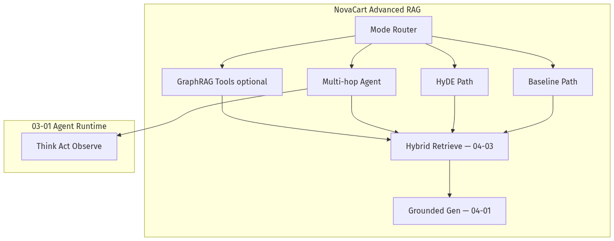

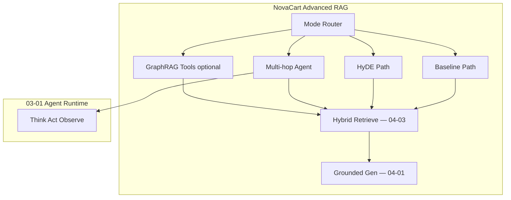

---

## Mermaid Diagram — Multi-Hop Sequence

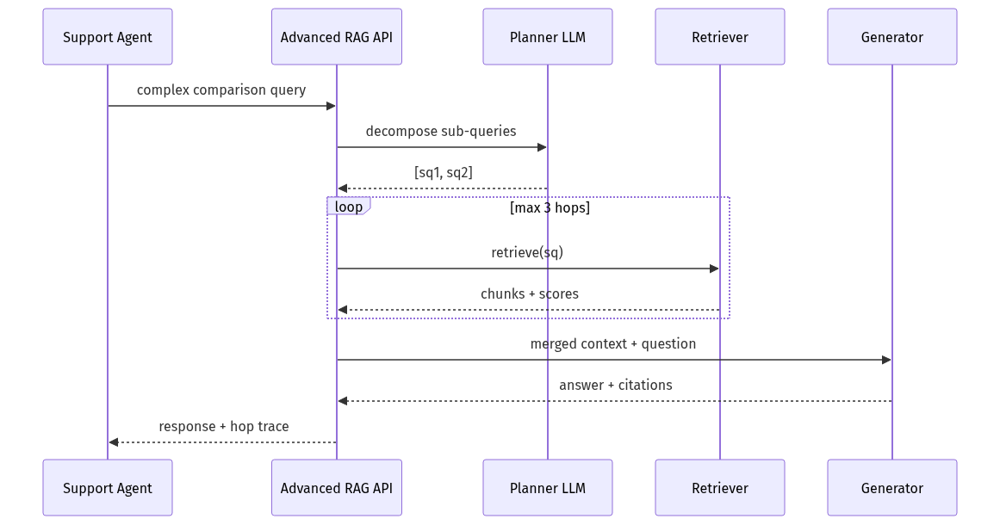

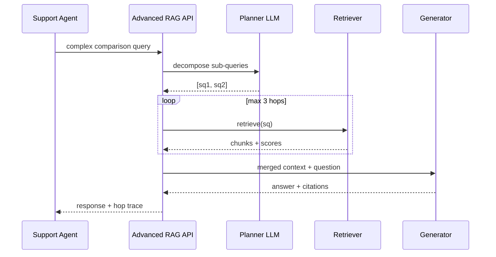

---

## Production Examples

| Pattern | Deployment |
|---------|------------|
| HyDE | Support bots with casual user language |
| GraphRAG | Compliance corpus thematic Q&A |
| Agentic RAG | Copilots with KB + live tools |
| Multi-hop | Comparison and escalation matrix questions |

---

## Real Companies Using It (Public Patterns)

| Org | Pattern |
|-----|---------|
| **Microsoft** | GraphRAG open-source reference |
| **LlamaIndex** | Agentic query engines + routers |
| **LangChain** | Multi-query retriever, self-RAG patterns |
| **Enterprise copilots** | Router between search, SQL, APIs |

---

## Hands-on Labs

### Lab A — HyDE A/B (60 min)

10 colloquial NovaCart queries; compare recall@5 baseline vs HyDE.

### Lab B — Multi-hop trace (45 min)

Run comparison query; inspect `HopTrace` for correct sub-queries.

### Lab C — Mode router (45 min)

Build labeled set (simple / hyde / multi-hop); measure router accuracy.

---

## Coding Assignments

1. Add GraphRAG `local_search` stub tool returning chunk IDs.
2. Integrate Cohere rerank after multi-hop merge ([04-03](04-03-Vector-DB-Hybrid-Search-Reranking.md)).
3. Export hop traces to LangSmith-style JSONL for eval ([08-01](../08-Evaluation-LLMOps/08-01-Evaluation-Lifecycle.md)).

---

## Mini Project

**Title:** NovaCart Advanced RAG Router v1  
**Done when:** AUTO mode routes correctly on 20-query labeled set; abstain on low score.

---

## Production Project

**Title:** Agentic NovaCart copilot  
**Done when:** LangGraph agent ([03-04](../03-Agentic-Fundamentals/03-04-LangGraph-Production-Agents.md)) with KB search + order lookup tool; hop budget enforced.

---

## Stretch Project

Run **Microsoft GraphRAG** indexer on NovaCart policy export; compare global search vs baseline on 15 thematic questions.

---

## Interview Questions

### Senior Engineer

1. What is HyDE and when does it help?
2. How does multi-hop differ from single retrieve?
3. What stops an agentic RAG loop from running forever?

### Staff Engineer

1. Design a router among baseline, HyDE, and multi-hop.
2. Explain GraphRAG local vs global search with NovaCart examples.
3. How evaluate agentic RAG vs static RAG fairly?

### Principal Engineer

1. Build vs buy GraphRAG for enterprise compliance KB.
2. Platform API for "retrieval modes" across 8 internal bots.
3. Cost governance for multi-hop at 1M queries/month.

### Engineering Manager

1. Team wants GraphRAG day one—how do you sequence delivery?
2. Latency SLO conflict with multi-hop—product tradeoff framing?
3. Skills needed for graph index vs baseline RAG team?

### Whiteboard

Draw agentic RAG loop with abstain exits; label hop budget.

### Follow-ups

- HyDE vs query expansion—difference?
- When GraphRAG hurts citation precision?
- How combine RAG with live order API in one agent?

---

## Revision Notes

- **HyDE** = embed hypothetical policy text, not user query.
- **GraphRAG** = graph + communities for local/global search.
- **Agentic RAG** = retrieval inside Think→Act→Observe ([03-01](../03-Agentic-Fundamentals/03-01-Agent-Anatomy-and-Loop.md)).
- **Multi-hop** = sequential/parallel sub-queries with merge + rerank.
- **Route** simple queries to baseline; advanced paths are eval-driven.

---

## Summary

Advanced RAG extends NovaCart's knowledge agent with **HyDE for vocabulary gap**, **multi-hop and agentic loops for cross-document questions**, and **GraphRAG for relational corpora**—always behind a router, always measured, always able to abstain. Module 04 complete: architecture → ingest → retrieve → adaptive retrieval.

---

## Further Reading

| Title | URL | Difficulty | Reading Time | Why Read | Important Sections |
|-------|-----|------------|--------------|----------|--------------------|
| RAG Paper | https://arxiv.org/abs/2005.11401 | Intermediate | 45 min | Baseline to compare against | Full pipeline |
| LlamaIndex Docs | https://docs.llamaindex.ai/en/stable/ | Intro–Advanced | 45 min | Agentic query engines | Agents; query pipelines |
| LangChain RAG | https://python.langchain.com/docs/concepts/rag/ | Intro | 25 min | Multi-query / advanced retrievers | Advanced patterns |
| Pinecone Overview | https://docs.pinecone.io/guides/get-started/overview | Intro | 20 min | Vector foundation for all modes | Query concepts |
| Cohere Rerank | https://docs.cohere.com/docs/rerank-overview | Intro | 15 min | Post-retrieval merge quality | API usage |
| Microsoft GraphRAG | https://microsoft.github.io/graphrag/ | Advanced | 60 min | Graph indexing + query modes | Indexing; local/global search |
