# 05-01 — Multi-Agent Orchestration: When One Agent Is Not Enough

| Meta | Value |
|------|-------|
| **Estimated Time** | 5–6 hours (read 2.5h · lab 2.5h · tradeoff memo 1h) |
| **Difficulty** | Intermediate (concepts) · Advanced (production orchestration) |
| **Prerequisites** | [03-01 Agent Anatomy](../03-Agentic-Fundamentals/03-01-Agent-Anatomy-and-Loop.md) · [03-02 Tools & Memory](../03-Agentic-Fundamentals/03-02-Tools-Memory-Control-Flow.md) · [03-04 LangGraph Production Agents](../03-Agentic-Fundamentals/03-04-LangGraph-Production-Agents.md) |
| **Module** | 05 — Multi-Agent Orchestration |
| **Related** | [05-02 Planner–Executor–Critic](05-02-Planner-Executor-Critic.md) · [05-03 Frameworks Comparison](05-03-Frameworks-CrewAI-AutoGen-LangGraph.md) · [08-02 Observability](../08-Evaluation-LLMOps/08-02-Observability-LangSmith-OTel.md) · [07-01 MCP](../07-Protocols-MCP-A2A/07-01-MCP-Model-Context-Protocol.md) · [07-02 A2A](../07-Protocols-MCP-A2A/07-02-A2A-Agent-to-Agent.md) · [Architecture Index](../../Architecture Index.md) |

---

## Learning Objectives

By the end of this chapter you will be able to:

1. Recognize **when single-agent systems break down** and multi-agent orchestration is justified.
2. Apply **orchestration principles**: bounded autonomy, explicit contracts, idempotent tools, and checkpointed state.
3. Compare **single vs multi-agent** tradeoffs across complexity, cost, latency, and extensibility.
4. Design **observability** for multi-agent runs: trace trees, per-agent budgets, and attribution.
5. Mitigate **cascading failures** with retries, circuit breakers, fallbacks, and blast-radius limits.

---

## Why This Topic Matters

Single-agent systems are the default for good reason: one loop, one context, one bill. Multi-agent systems exist because **specialization beats monolithic prompting** when:

- tasks decompose into **independent sub-domains** (research vs booking vs compliance),
- **context windows** cannot hold all tool schemas and history,
- **quality gates** require a separate critic with different temperature/model,
- or **parallelism** is structurally possible (fan-out research, merge synthesis).

The failure mode is not “multi-agent is hard.” The failure mode is **adding agents before proving single-agent failure**, then shipping a distributed system with no distributed debugging.

**Staff/Principal interview signal:** Candidates who can articulate *when not to multi-agent* and *how to operate one in production* beat candidates who name three frameworks.

---

## Business Impact

| Business outcome | Multi-agent orchestration impact |
|------------------|----------------------------------|
| **Higher task success on complex workflows** | Specialists + critics improve deliverable quality |
| **Higher COGS** | Each hop adds tokens + tool calls + coordination overhead |
| **Longer p95 latency** | Sequential hops stack; parallel helps but adds merge complexity |
| **Faster feature velocity (when designed well)** | New specialist = new node, not rewrite of monolith prompt |
| **Incident blast radius** | One bad agent can poison shared state or trigger tool storms |

**Rule of thumb:** Multi-agent buys **extensibility and quality ceilings**; it spends **complexity, cost, and latency**.

---

## Architecture Overview

Multi-agent orchestration is a **control plane over probabilistic workers**:

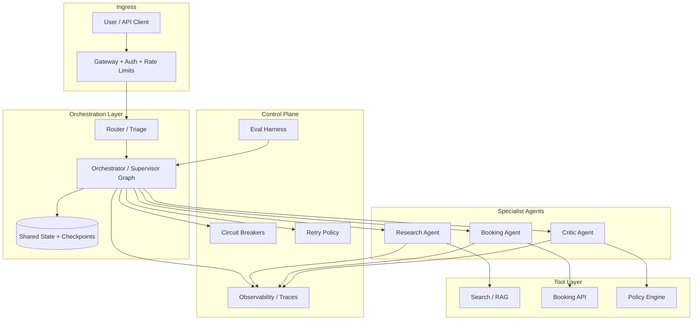

**Mental model:** Treat each agent as a **microservice with an LLM brain**. Same lessons apply: contracts, timeouts, idempotency, observability, failure isolation.

Deep dive on single-agent foundations: [03-04 LangGraph Production Agents](../03-Agentic-Fundamentals/03-04-LangGraph-Production-Agents.md).

---

## Core Concepts

### 1) When Single-Agent Breaks Down

#### Definition

Single-agent breakdown occurs when one loop cannot reliably satisfy **quality**, **latency**, or **maintainability** constraints despite prompt/tool tuning.

#### Symptoms (use as a checklist)

| Symptom | Likely root cause | Multi-agent lever |
|---------|-------------------|-------------------|
| Prompt > 8–12K tokens of instructions + tool defs | Context pollution | Split specialists |
| Frequent wrong-tool selection | Too many tools in one agent | Route to tool-poor agents |
| Quality OK but un-auditable reasoning | Monolithic chain-of-thought | Planner + critic separation |
| Parallelizable subtasks run serially | One agent, one thread | Fan-out with `Send` / parallel nodes |
| Frequent regressions when adding features | Fragile mega-prompt | Add node instead of edit prompt |
| Compliance needs independent review | Same model grades its own homework | Critic agent / rules node |

#### When NOT to go multi-agent

- Task is a **linear 3-step workflow** with known steps → DAG/workflow engine or single agent with fixed graph.
- Problem is **retrieval quality** → fix RAG before adding agents ([04-01 RAG Architecture](../04-RAG/04-01-RAG-Architecture.md)).
- Problem is **tool reliability** → harden tools, don’t add an agent to apologize for them.
- Traffic is high and SLO tight → multi-agent p95 often fails SLO without aggressive caching/routing.

#### Interview discussion

> “We split agents when decomposition is **structural**, not when we’re tired of prompt engineering.”

---

### 2) Orchestration Principles

#### Definition

**Orchestration** is the deterministic (or semi-deterministic) layer that decides *which* agent runs *when*, with *what* state, under *what* budget.

#### The Six Principles

| # | Principle | Production meaning |
|---|-----------|-------------------|
| 1 | **Explicit state schema** | Typed shared state; no hidden globals |
| 2 | **Output contracts** | Pydantic/JSON schema per agent hop |
| 3 | **Bounded autonomy** | `recursion_limit`, max hops, token budgets |
| 4 | **Idempotent side effects** | Safe retries; dedupe keys on writes |
| 5 | **Fail closed on ambiguity** | Escalate to human or abstain |
| 6 | **Observable by default** | Trace ID spans every agent hop |

#### Intuition

Orchestration is **traffic control**. Agents are **vehicles**. Without control, you get collisions (state corruption), gridlock (infinite loops), and pile-ups (cascading tool failures).

#### LangGraph alignment

LangGraph models orchestration as **StateGraph**: nodes (agents/functions), edges (routing), reducers (state merge), checkpointers (durability). See [LangGraph multi-agent concepts](https://langchain-ai.github.io/langgraph/concepts/multi_agent/).

---

### 3) Single vs Multi-Agent Tradeoffs

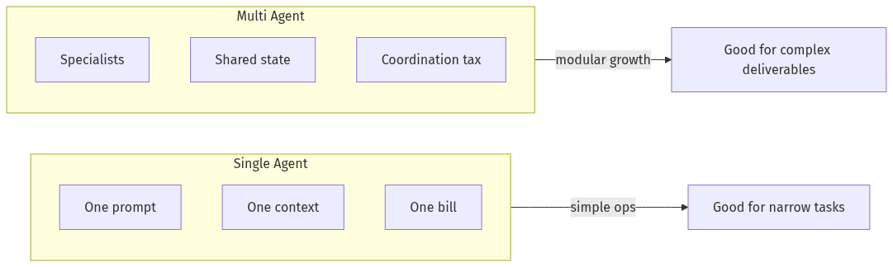

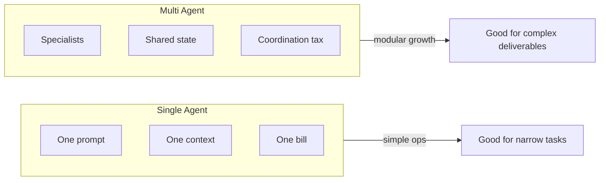

| Dimension | Single agent | Multi-agent |
|-----------|--------------|-------------|
| **Complexity** | Low — one loop to debug | High — interaction bugs, state merge bugs |
| **Cost** | 1× model calls (often) | N× hops; supervisor overhead; repeated context |
| **Latency** | Best p95 for simple tasks | Sequential hops add up; parallel adds merge step |
| **Extensibility** | Prompt grows brittle | Add specialist node / crew member |
| **Quality ceiling** | Limited by one context | Critics, specialists raise ceiling |
| **Observability** | One span | Trace tree required ([08-02](../08-Evaluation-LLMOps/08-02-Observability-LangSmith-OTel.md)) |
| **Testing** | End-to-end eval | Contract tests per agent + integration evals |

#### Cost model (back-of-envelope)

\[
\text{Cost/task} \approx \sum_{i=1}^{N} (\text{tokens}_i \times \text{price}_i) + \sum_{j=1}^{M} \text{tool\_cost}_j + \text{orchestration overhead}
\]

**Staff move:** Quote N (hops), average context size per hop, and critic re-runs before approving architecture.

#### Latency model

\[
\text{p95}_{multi} \approx \text{p95}_{supervisor} + \sum \text{p95}_{sequential agents} + \text{merge}
\]

Parallel fan-out: \(\text{p95} \approx \max(\text{p95}_{workers}) + \text{p95}_{merge}\).

---

### 4) Observability for Multi-Agent Systems

#### Definition

Multi-agent observability is the ability to reconstruct **who decided what, with which context, at which hop**, for a given `trace_id`.

#### Minimum span attributes

```text
trace_id, thread_id, graph_version, node_name, agent_role,
parent_span_id, hop_index, model, prompt_version,
token_in, token_out, cost_usd, latency_ms,
tool_calls[], tool_errors[], state_hash, outcome
```

#### Trace tree (conceptual)

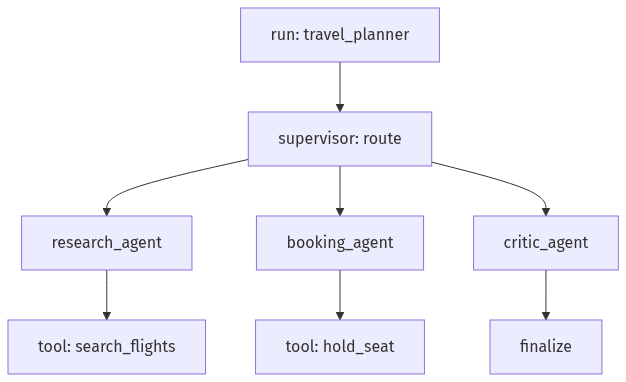

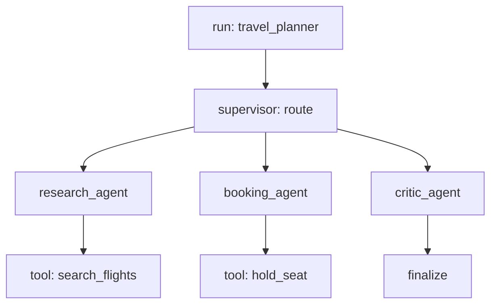

#### Practices

| Practice | Why |
|----------|-----|
| One `trace_id` per user request | Correlate across agents |
| Log **state diffs**, not full state every hop | Cost + PII control |
| Per-agent success/failure counters | SLO per specialist |
| Attribute spend by `agent_role` | FinOps for AI |
| Link to checkpoints | Replay / debug ([03-04](../03-Agentic-Fundamentals/03-04-LangGraph-Production-Agents.md)) |

Full stack: [08-02 Observability — LangSmith & OpenTelemetry](../08-Evaluation-LLMOps/08-02-Observability-LangSmith-OTel.md).

---

### 5) Cascading Failures

#### Definition

A **cascading failure** in multi-agent systems occurs when one agent’s error propagates: bad state → wrong routing → tool storm → budget exhaustion → user-visible failure.

#### Failure propagation patterns

| Pattern | Example | Containment |
|---------|---------|-------------|
| **State poisoning** | Research agent writes bad JSON; booking parses wrong airport | Schema validation at reducer boundary |
| **Retry storm** | Tool timeout → 3 agents retry same call | Exponential backoff + shared circuit breaker |
| **Routing loop** | Supervisor bounces research ↔ booking | `recursion_limit`, hop counter, loop detection |
| **Context explosion** | Each agent appends full history | Summarize / prune policy per hop |
| **Critic deadlock** | Critic rejects forever | Max critic rounds → HITL |

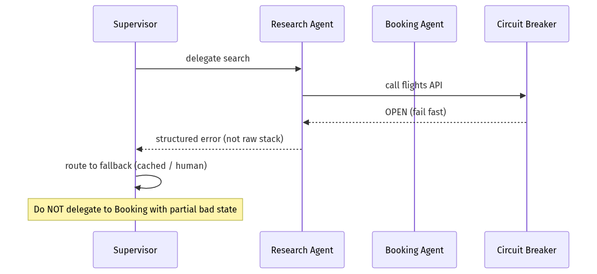

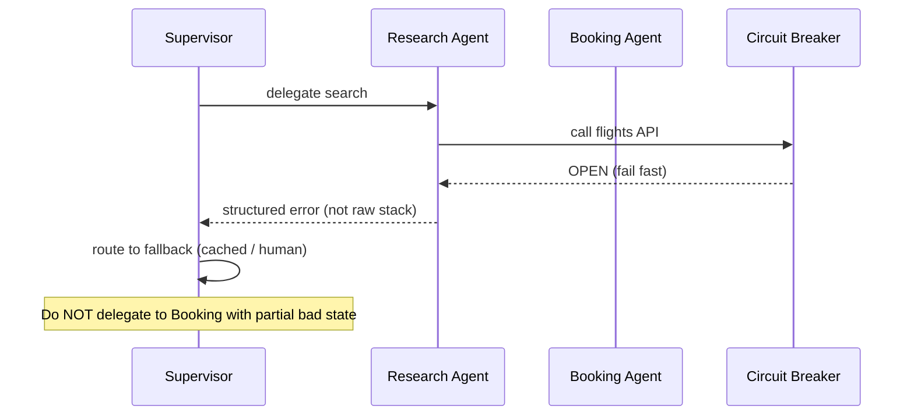

---

### 6) Retries, Timeouts, and Idempotency

#### Retry policy (production defaults)

| Layer | Policy |
|-------|--------|
| **LLM call** | 2 retries on 429/5xx; no retry on 400/content policy |
| **Tool call** | Idempotent only; exponential backoff; jitter |
| **Agent hop** | Retry once with trimmed context if schema validation failed |
| **Graph run** | Resume from checkpoint; never blind full replay |

#### Idempotency keys

```python
idempotency_key = f"{trace_id}:{node_name}:{tool_name}:{hash(args)}"
```

Use for: seat holds, payments, ticket creation, CRM writes.

---

### 7) Circuit Breakers

#### Definition

A **circuit breaker** stops calls to a failing dependency after a threshold, failing fast until a cooldown period elapses.

#### States

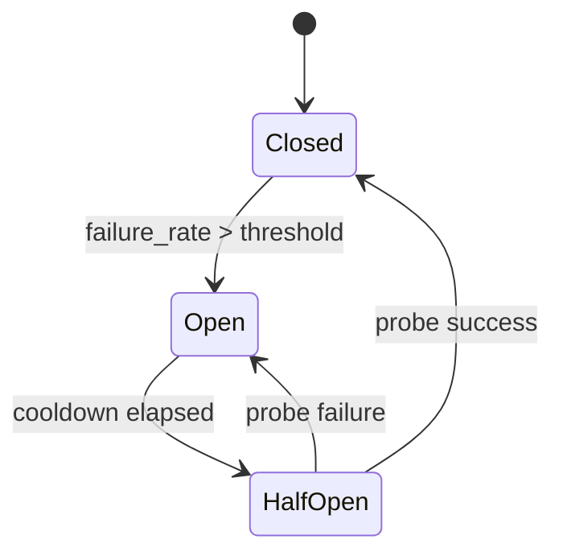

#### Where to place breakers

| Dependency | Breaker scope |
|------------|---------------|
| External API (flights, hotels) | Per tool, shared across agents |
| LLM provider | Per model route |
| Vector DB / RAG | Per collection |
| Downstream agent | Per agent node (advanced) |

#### Fallback ladder

1. Cached last-good result  
2. Degraded mode (text answer, no booking)  
3. Human handoff  
4. Hard fail with explicit error code  

---

## Implementation

### Production LangGraph multi-agent orchestrator (supervisor + specialists)

This example implements: **shared state**, **supervisor routing via `Command`**, **schema validation**, **hop limits**, **circuit breaker on tools**, and **structured observability hooks**.

```python
"""Multi-agent travel orchestrator — production-shaped LangGraph skeleton.

Requirements:
  pip install langgraph langchain-openai pydantic

Env:
  OPENAI_API_KEY=...

Run:
  python travel_orchestrator.py
"""

from __future__ import annotations

import hashlib
import json
import os
import time
import uuid
from dataclasses import dataclass, field
from enum import Enum
from typing import Annotated, Literal, TypedDict

from langchain_core.messages import AIMessage, BaseMessage, HumanMessage, SystemMessage
from langchain_openai import ChatOpenAI
from langgraph.checkpoint.memory import InMemorySaver
from langgraph.graph import END, START, StateGraph
from langgraph.types import Command
from pydantic import BaseModel, Field, ValidationError


# ---------------------------------------------------------------------------
# Observability hooks (wire to OTel / LangSmith in production — see 08-02)
# ---------------------------------------------------------------------------

@dataclass
class SpanEvent:
    trace_id: str
    node: str
    latency_ms: float
    token_estimate: int = 0
    error: str | None = None
    meta: dict = field(default_factory=dict)


TRACE_LOG: list[SpanEvent] = []


def emit(node: str, trace_id: str, t0: float, **meta) -> None:
    TRACE_LOG.append(
        SpanEvent(
            trace_id=trace_id,
            node=node,
            latency_ms=(time.perf_counter() - t0) * 1000,
            meta=meta,
        )
    )


# ---------------------------------------------------------------------------
# Circuit breaker (shared across agents for a given tool)
# ---------------------------------------------------------------------------

class BreakerState(str, Enum):
    CLOSED = "closed"
    OPEN = "open"
    HALF_OPEN = "half_open"


@dataclass
class CircuitBreaker:
    name: str
    failure_threshold: int = 3
    cooldown_sec: float = 30.0
    state: BreakerState = BreakerState.CLOSED
    failures: int = 0
    opened_at: float = 0.0

    def allow(self) -> bool:
        if self.state == BreakerState.CLOSED:
            return True
        if self.state == BreakerState.OPEN:
            if time.time() - self.opened_at >= self.cooldown_sec:
                self.state = BreakerState.HALF_OPEN
                return True
            return False
        return True  # half-open: allow probe

    def record_success(self) -> None:
        self.failures = 0
        self.state = BreakerState.CLOSED

    def record_failure(self) -> None:
        self.failures += 1
        if self.failures >= self.failure_threshold:
            self.state = BreakerState.OPEN
            self.opened_at = time.time()


BREAKERS: dict[str, CircuitBreaker] = {
    "flight_search": CircuitBreaker("flight_search"),
    "hotel_search": CircuitBreaker("hotel_search"),
}


# ---------------------------------------------------------------------------
# Output contracts (agent boundaries)
# ---------------------------------------------------------------------------

class FlightOption(BaseModel):
    airline: str
    price_usd: float = Field(ge=0)
    depart: str
    arrive: str


class ResearchResult(BaseModel):
    destination: str
    flights: list[FlightOption]
    notes: list[str] = Field(default_factory=list)


class BookingResult(BaseModel):
    confirmed: bool
    confirmation_id: str | None = None
    message: str


class CriticVerdict(BaseModel):
    approved: bool
    issues: list[str] = Field(default_factory=list)
    revised_summary: str | None = None


# ---------------------------------------------------------------------------
# Shared graph state
# ---------------------------------------------------------------------------

def add_messages(left: list[BaseMessage], right: list[BaseMessage]) -> list[BaseMessage]:
    return left + right


class OrchestratorState(TypedDict):
    messages: Annotated[list[BaseMessage], add_messages]
    trace_id: str
    user_request: str
    hop_count: int
    max_hops: int
    research: dict | None
    booking: dict | None
    critic: dict | None
    final_answer: str | None
    last_error: str | None
    next_agent: Literal["research", "booking", "critic", "finalize", "end"] | None


# ---------------------------------------------------------------------------
# Tools (with breaker + idempotency)
# ---------------------------------------------------------------------------

def search_flights(destination: str, trace_id: str) -> ResearchResult:
    breaker = BREAKERS["flight_search"]
    if not breaker.allow():
        raise RuntimeError("circuit_open:flight_search")

    # Simulated flaky API
    if destination.lower() == "failville":
        breaker.record_failure()
        raise TimeoutError("upstream timeout")

    breaker.record_success()
    return ResearchResult(
        destination=destination,
        flights=[
            FlightOption(airline="SkyCo", price_usd=420.0, depart="2026-08-01T09:00", arrive="2026-08-01T12:00"),
            FlightOption(airline="JetPath", price_usd=380.0, depart="2026-08-01T14:00", arrive="2026-08-01T17:00"),
        ],
        notes=[f"idempotency={hashlib.sha256(trace_id.encode()).hexdigest()[:12]}"],
    )


def hold_seat(flight_airline: str, trace_id: str) -> BookingResult:
    breaker = BREAKERS["hotel_search"]  # demo: separate breaker namespace
    if not breaker.allow():
        return BookingResult(confirmed=False, message="booking_service_unavailable")

    breaker.record_success()
    conf = hashlib.sha256(f"{trace_id}:{flight_airline}".encode()).hexdigest()[:10]
    return BookingResult(confirmed=True, confirmation_id=conf, message=f"Held on {flight_airline}")


# ---------------------------------------------------------------------------
# LLM (supervisor routing)
# ---------------------------------------------------------------------------

def get_llm() -> ChatOpenAI:
    return ChatOpenAI(model="gpt-4.1-mini", temperature=0)


ROUTER_PROMPT = """You are the orchestrator supervisor for a travel planning system.
Given the user request and current progress, choose EXACTLY ONE next step:
- research: gather flight options (if not done)
- booking: hold a seat (if research exists, booking not done)
- critic: review the plan (if research and booking exist, not yet approved)
- finalize: produce user-facing answer (if critic approved OR max issues resolved)
- end: abort if unrecoverable error

Reply with ONLY the step keyword."""


def supervisor_node(state: OrchestratorState) -> Command:
    t0 = time.perf_counter()
    trace_id = state["trace_id"]

    if state["hop_count"] >= state["max_hops"]:
        emit("supervisor", trace_id, t0, decision="end", reason="max_hops")
        return Command(goto="finalize_node", update={"next_agent": "end", "last_error": "max_hops_exceeded"})

    if state.get("last_error") and "circuit_open" in state["last_error"]:
        emit("supervisor", trace_id, t0, decision="finalize", reason="breaker")
        return Command(goto="finalize_node", update={"next_agent": "finalize"})

    # Deterministic fast-path (cheaper than LLM when state is obvious)
    if state["research"] is None:
        decision = "research"
    elif state["booking"] is None:
        decision = "booking"
    elif state["critic"] is None:
        decision = "critic"
    elif state["critic"] and state["critic"].get("approved"):
        decision = "finalize"
    else:
        llm = get_llm()
        context = (
            f"request={state['user_request']}\n"
            f"research={bool(state['research'])}\n"
            f"booking={bool(state['booking'])}\n"
            f"critic={state['critic']}\n"
        )
        resp = llm.invoke([SystemMessage(content=ROUTER_PROMPT), HumanMessage(content=context)])
        decision = resp.content.strip().lower().split()[0]

    node_map = {
        "research": "research_node",
        "booking": "booking_node",
        "critic": "critic_node",
        "finalize": "finalize_node",
        "end": "finalize_node",
    }
    target = node_map.get(decision, "finalize_node")
    emit("supervisor", trace_id, t0, decision=decision, target=target)
    return Command(
        goto=target,
        update={
            "hop_count": state["hop_count"] + 1,
            "next_agent": decision,  # type: ignore[arg-type]
            "messages": [AIMessage(content=f"[supervisor] routing to {decision}")],
        },
    )


def research_node(state: OrchestratorState) -> Command:
    t0 = time.perf_counter()
    trace_id = state["trace_id"]
    try:
        # Naive destination parse — replace with structured extraction in production
        dest = "Tokyo" if "tokyo" in state["user_request"].lower() else "Paris"
        if "fail" in state["user_request"].lower():
            dest = "Failville"
        result = search_flights(dest, trace_id)
        payload = result.model_dump()
        ResearchResult.model_validate(payload)  # contract enforcement
        emit("research_node", trace_id, t0, flights=len(result.flights))
        return Command(
            goto="supervisor_node",
            update={"research": payload, "last_error": None, "messages": [AIMessage(content=str(payload))]},
        )
    except Exception as exc:
        emit("research_node", trace_id, t0, error=str(exc))
        return Command(
            goto="supervisor_node",
            update={"last_error": str(exc), "messages": [AIMessage(content=f"research failed: {exc}")]},
        )


def booking_node(state: OrchestratorState) -> Command:
    t0 = time.perf_counter()
    trace_id = state["trace_id"]
    if not state["research"]:
        return Command(goto="supervisor_node", update={"last_error": "missing_research"})

    flights = state["research"].get("flights", [])
    if not flights:
        return Command(goto="supervisor_node", update={"last_error": "no_flights"})

    cheapest = min(flights, key=lambda f: f["price_usd"])
    result = hold_seat(cheapest["airline"], trace_id)
    payload = result.model_dump()
    emit("booking_node", trace_id, t0, confirmed=result.confirmed)
    return Command(
        goto="supervisor_node",
        update={"booking": payload, "messages": [AIMessage(content=str(payload))]},
    )


def critic_node(state: OrchestratorState) -> Command:
    t0 = time.perf_counter()
    trace_id = state["trace_id"]
    issues: list[str] = []
    if state["research"] and not state["research"].get("flights"):
        issues.append("no flights found")
    if state["booking"] and not state["booking"].get("confirmed"):
        issues.append("booking not confirmed")

    verdict = CriticVerdict(
        approved=len(issues) == 0,
        issues=issues,
        revised_summary="Plan looks viable." if not issues else "Plan needs attention.",
    )
    emit("critic_node", trace_id, t0, approved=verdict.approved)
    return Command(
        goto="supervisor_node",
        update={"critic": verdict.model_dump(), "messages": [AIMessage(content=verdict.model_dump_json())]},
    )


def finalize_node(state: OrchestratorState) -> dict:
    t0 = time.perf_counter()
    trace_id = state["trace_id"]
    if state.get("last_error"):
        answer = f"Unable to complete plan: {state['last_error']}. Please try again or contact support."
    else:
        answer = json.dumps(
            {"research": state.get("research"), "booking": state.get("booking"), "critic": state.get("critic")},
            indent=2,
        )
    emit("finalize_node", trace_id, t0)
    return {"final_answer": answer, "messages": [AIMessage(content=answer)]}


def build_graph():
    builder = StateGraph(OrchestratorState)
    builder.add_node("supervisor_node", supervisor_node)
    builder.add_node("research_node", research_node)
    builder.add_node("booking_node", booking_node)
    builder.add_node("critic_node", critic_node)
    builder.add_node("finalize_node", finalize_node)

    builder.add_edge(START, "supervisor_node")
    builder.add_edge("finalize_node", END)

    checkpointer = InMemorySaver()
    return builder.compile(checkpointer=checkpointer)


if __name__ == "__main__":
    graph = build_graph()
    trace_id = str(uuid.uuid4())
    config = {"configurable": {"thread_id": trace_id}, "recursion_limit": 20}

    initial: OrchestratorState = {
        "messages": [HumanMessage(content="Plan a trip to Tokyo with flights")],
        "trace_id": trace_id,
        "user_request": "Plan a trip to Tokyo with flights",
        "hop_count": 0,
        "max_hops": 12,
        "research": None,
        "booking": None,
        "critic": None,
        "final_answer": None,
        "last_error": None,
        "next_agent": None,
    }

    result = graph.invoke(initial, config=config)
    print("TRACE:", [(e.node, e.latency_ms, e.meta) for e in TRACE_LOG])
    print("FINAL:", result["final_answer"])
```

#### Why this implementation matters

1. **Supervisor returns `Command(goto=...)`** — explicit routing, LangGraph-native ([multi-agent handoffs](https://langchain-ai.github.io/langgraph/concepts/multi_agent/)).
2. **Pydantic contracts at boundaries** — prevents state poisoning between agents.
3. **`hop_count` + `recursion_limit`** — double layer against infinite loops.
4. **Shared circuit breakers** — one failing API does not get retried independently by every agent.
5. **Trace log** — placeholder for [08-02](../08-Evaluation-LLMOps/08-02-Observability-LangSmith-OTel.md) instrumentation.

Pattern catalog (Planner–Executor–Critic, DAG, Hybrid): [05-02](05-02-Planner-Executor-Critic.md).

---

## Production Considerations

| Concern | Practice |
|---------|----------|
| State schema evolution | Version state keys; migrate checkpoints ([LangGraph migrations](https://langchain-ai.github.io/langgraph/concepts/multi_agent/)) |
| Agent prompt drift | Pin `prompt_version` per node |
| Noisy supervisor | Prefer deterministic routing when state is unambiguous |
| Cross-team ownership | One DRI per specialist agent + one for orchestrator |
| Protocol boundaries | Expose tools via [MCP](../07-Protocols-MCP-A2A/07-01-MCP-Model-Context-Protocol.md); cross-org via [A2A](../07-Protocols-MCP-A2A/07-02-A2A-Agent-to-Agent.md) |

---

## Security

| Threat | Control |
|--------|---------|
| Agent A exfiltrates data via Agent B’s tools | Tool ACLs per agent role; least privilege |
| Prompt injection via shared message bus | Sanitize external content before supervisor sees it |
| Runaway tool spend | Per-trace budgets; breaker + rate limits |
| Cross-tenant state leakage | Thread isolation; no shared checkpointer keys |

---

## Performance

| Technique | Effect |
|-----------|--------|
| Deterministic routing fast-path | Skips LLM on obvious next step |
| Parallel fan-out (`Send`) | Cuts latency for independent research tasks |
| Context pruning per hop | Lowers tokens and latency |
| Smaller models for routing | Supervisor can use mini model; critic uses stronger model |

---

## Cost

| Lever | Savings |
|-------|---------|
| Single-agent until proven insufficient | Avoid N× baseline cost |
| Cache research results | Dedupe identical destination queries |
| Skip critic on low-risk paths | Route by policy |
| Token budgets per node | Hard stop before runaway |

---

## Scalability

| Layer | Scale first |
|-------|-------------|
| Stateless API tier | Horizontal pods |
| Checkpointer (Postgres/Redis) | Partition by `thread_id` |
| Tool workers | Queue-backed executors |
| LLM calls | Provider concurrency limits + routing |

Multi-agent graphs scale like **workflow engines**: the bottleneck is usually **sequential LLM hops**, not Python.

---

## Failure Modes

| Failure | Symptom | Mitigation |
|---------|---------|------------|
| State poisoning | Garbage in → wrong booking | Schema validation + reject hop |
| Supervisor loop | Same agent 10× | Hop limit + loop detection |
| Retry storm | API ban | Shared breaker + jitter |
| Partial completion | User charged, no ticket | Saga/compensation pattern |
| Observability gap | “Something failed” | Trace tree + state diffs |

---

## Observability

See [08-02 Observability](../08-Evaluation-LLMOps/08-02-Observability-LangSmith-OTel.md) for LangSmith + OTel wiring.

**Multi-agent SLO example:**

| Metric | Target |
|--------|--------|
| End-to-end task success | ≥ 92% on golden set |
| p95 latency | ≤ 15s (3-hop sequential) |
| Cost per successful task | ≤ $0.08 at 10K DAU |
| Cascading failure rate | < 1% of runs |

---

## Debugging

| Question | Where to look |
|----------|---------------|
| Wrong agent invoked? | Supervisor span + state snapshot before hop |
| Booking used stale research? | Checkpoint timeline |
| Sudden cost spike? | Per-node token attribution |
| Flaky only in prod? | Breaker state + tool p95 |

---

## Common Mistakes

1. Multi-agent before exhausting single-agent + slimmer tools.
2. No output schema between agents — “the next agent will figure it out.”
3. Independent retries per agent on the same failing tool.
4. Logging only final answer, not routing decisions.
5. Treating critic as optional polish instead of a gated ship criterion.

---

## Tradeoffs

| Choice | Upside | Downside |
|--------|--------|----------|
| Central supervisor | Clear control flow | Supervisor bottleneck + context growth |
| Peer handoffs (swarm) | Flexible negotiation | Harder to debug |
| Sync sequential hops | Simple mental model | Higher p95 |
| Parallel fan-out | Lower latency | Merge conflicts |
| Strong critic always | Quality | Cost + latency |

---

## Architecture Diagram — Cascading Failure Containment

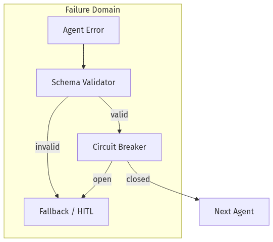

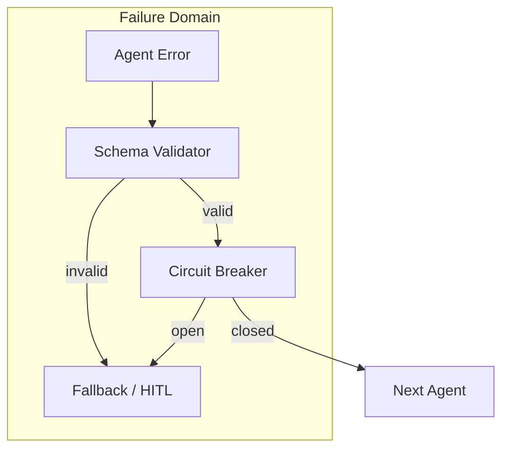

---

## Mermaid Diagram — Sequence (Happy Path)

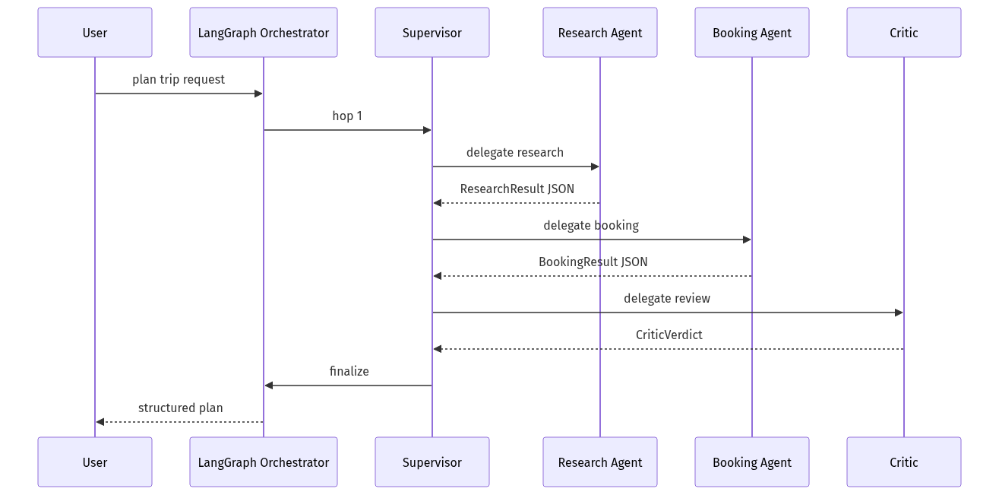

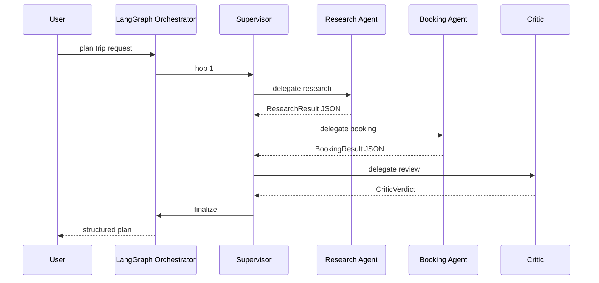

---

## Production Examples

| Domain | Multi-agent shape |
|--------|-------------------|
| Travel planning | Research + booking + critic ([05-02 example](05-02-Planner-Executor-Critic.md)) |
| Legal review | Draft agent + citation checker + policy agent |
| Incident response | Triage + runbook executor + comms drafter |
| Enterprise support | Router + KB agent + action agent + QA critic |

---

## Real Companies Using It (Public Patterns)

| Org | Pattern | Lesson |
|-----|---------|--------|
| **LangChain / LangGraph customers** | Stateful multi-agent with checkpoints | Orchestration + persistence co-designed |
| **Microsoft AutoGen** | Event-driven multi-agent ([AutoGen docs](https://microsoft.github.io/autogen/stable//index.html)) | Good for research & distributed agents |
| **CrewAI enterprise** | Crews + flows with guardrails ([CrewAI docs](https://docs.crewai.com/)) | Role-based teams for business automation |

> Reference as **public patterns**, not insider claims.

---

## Hands-on Labs

### Lab A — Prove single-agent insufficient (45 min)

Build one agent with 12 tools for travel. Measure wrong-tool rate and prompt size. Document why you split.

### Lab B — Breaker drill (30 min)

Force `Failville` destination. Verify fast-fail, no booking hop, degraded final message.

### Lab C — Trace reconstruction (45 min)

From `TRACE_LOG` only, reconstruct routing decisions and total latency.

---

## Coding Assignments

1. Wire `emit()` to OpenTelemetry spans ([08-02](../08-Evaluation-LLMOps/08-02-Observability-LangSmith-OTel.md)).
2. Add parallel research fan-out with LangGraph `Send`.
3. Implement compensation: release seat hold on critic rejection.

---

## Mini Project

**Title:** Travel Orchestrator v0  
**Done when:** supervisor routes research → booking → critic; breaker tested; trace log exported.

---

## Production Project

**Title:** Multi-Agent SLO Dashboard  
**Done when:** per-agent success, p95, cost; alert on cascade patterns (same tool failing across agents).

---

## Stretch Project

Run the same travel task as **single agent**, **2-agent**, and **4-agent** graphs. Report quality (human or LLM-judge), cost, p95, and operability score.

---

## Interview Questions

### Senior Engineer

1. When would you *not* use multi-agent?
2. How do you prevent one agent’s bad JSON from breaking the next?
3. What do you log for each agent hop?

### Staff Engineer

1. Design circuit breakers for a 5-agent support system.
2. How do single vs multi tradeoffs change at 10× traffic?
3. Where do MCP and A2A fit in multi-agent architecture?

### Principal Engineer

1. Propose an org standard for when teams may add a new agent node.
2. How do you version shared state schemas without breaking checkpoints?
3. Compare supervisor vs peer handoff for a regulated workflow.

### Engineering Manager

1. How do you estimate COGS for a proposed multi-agent feature?
2. What on-call runbooks differ from single-agent services?
3. How do you prevent every team from building their own orchestrator?

### Whiteboard

Draw trace tree + breaker placement for research → booking → critic.

### Follow-ups

- What if supervisor and critic disagree?
- What if booking API is idempotent but slow?
- How do you test routing without flaking on LLM stochasticity?

---

## Revision Notes

- Multi-agent when decomposition is **structural**, not fashionable.
- Orchestration = contracts + budgets + observability + failure containment.
- Single wins on **cost/latency/simplicity**; multi wins on **quality ceiling/extensibility**.
- Shared breakers and idempotency — not optional.
- Debug with **trace trees**, not grep of chat logs.

---

## Summary

Multi-agent orchestration is **distributed systems engineering with LLM workers**. Ship it when single-agent limits are measured, not assumed. Pay the complexity tax deliberately: explicit state, gated hops, observable spans, and containment for cascading failures.

Next: [05-02 Planner–Executor–Critic & Supervisor Patterns](05-02-Planner-Executor-Critic.md) · Framework comparison: [05-03](05-03-Frameworks-CrewAI-AutoGen-LangGraph.md).

---

## Further Reading

| Title | URL | Difficulty | Reading Time | Why Read | Important Sections |
|-------|-----|------------|--------------|----------|--------------------|
| LangGraph Multi-Agent Concepts | https://langchain-ai.github.io/langgraph/concepts/multi_agent/ | Intermediate | 45 min | Canonical orchestration primitives | State; handoffs; supervisor patterns |
| LangGraph Graph API | https://langchain-ai.github.io/langgraph/concepts/low_level/ | Intermediate | 60 min | Checkpoints, Command, reducers | StateGraph; Command; recursion limit |
| AutoGen Framework | https://microsoft.github.io/autogen/stable//index.html | Intermediate | 30 min | Alternative orchestration model | AgentChat vs Core |
| CrewAI Documentation | https://docs.crewai.com/ | Intro | 30 min | Role-based crew mental model | Agents; tasks; processes |
| MetaGPT (multi-agent paper) | https://arxiv.org/abs/2308.08155 | Advanced | 45 min | Academic view of role specialization | Method; failure modes |
| Observability chapter | ../08-Evaluation-LLMOps/08-02-Observability-LangSmith-OTel.md | Intermediate | 45 min | Trace trees in production | Span design; LangSmith |

---

## Resume Bullet (after lab)

- Built a **LangGraph multi-agent orchestrator** with supervisor routing, Pydantic inter-agent contracts, shared circuit breakers, hop limits, and trace instrumentation for travel-planning workflows.
