# 05-02 — Planner–Executor–Critic, Supervisor, DAG & Hybrid Patterns

| Meta | Value |
|------|-------|
| **Estimated Time** | 6–7 hours (read 3h · lab 3h · pattern memo 1h) |
| **Difficulty** | Intermediate (patterns) · Advanced (contracts + decomposition) |
| **Prerequisites** | [05-01 Multi-Agent Orchestration](05-01-Multi-Agent-Orchestration.md) · [03-03 Agentic Design Patterns](../03-Agentic-Fundamentals/03-03-Agentic-Design-Patterns.md) · [03-04 LangGraph Production Agents](../03-Agentic-Fundamentals/03-04-LangGraph-Production-Agents.md) |
| **Module** | 05 — Multi-Agent Orchestration |
| **Related** | [05-03 Frameworks Comparison](05-03-Frameworks-CrewAI-AutoGen-LangGraph.md) · [08-02 Observability](../08-Evaluation-LLMOps/08-02-Observability-LangSmith-OTel.md) · [07-01 MCP](../07-Protocols-MCP-A2A/07-01-MCP-Model-Context-Protocol.md) · [07-02 A2A](../07-Protocols-MCP-A2A/07-02-A2A-Agent-to-Agent.md) · [Architecture Index](../../Architecture Index.md) |

---

## Learning Objectives

By the end of this chapter you will be able to:

1. Select among **Planner–Executor–Critic**, **Supervisor**, **DAG/Workflow**, **Hybrid**, and **Triage** patterns for a given task.
2. Perform **task decomposition** with explicit dependencies, parallelism, and acceptance criteria.
3. Define **output contracts** (schemas, invariants, error envelopes) at every agent boundary.
4. Implement a **travel planner** multi-agent system in production-shaped LangGraph Python.
5. Explain pattern tradeoffs in Staff/Principal interviews with diagrams, not buzzwords.

---

## Why This Topic Matters

“Multi-agent” is not one architecture — it is a **family of coordination patterns**. Teams fail when they pick a pattern by framework default:

- CrewAI → hierarchical crew  
- AutoGen → group chat  
- LangGraph → supervisor graph  

Patterns exist to manage **uncertainty partitioning**:

| Pattern | Partitions uncertainty by… |
|---------|---------------------------|
| Planner–Executor–Critic | **Plan quality** vs **execution** vs **verification** |
| Supervisor | **Routing** vs **specialist depth** |
| DAG/Workflow | **Stage** (known topology) |
| Hybrid | **Stable spine** + **agentic edges** |
| Triage | **Intent** before expensive work |

The travel planner is the canonical teaching example because it naturally decomposes: constraints → research → booking → review → narrative — each with different tools, models, and failure modes.

Orchestration fundamentals: [05-01](05-01-Multi-Agent-Orchestration.md).

---

## Business Impact

| Pattern | Best business fit | Risk if misapplied |
|---------|-------------------|---------------------|
| Planner–Executor–Critic | High-stakes deliverables (legal, finance, travel bookings) | Cost/latency if critic loops unbounded |
| Supervisor | Dynamic support, ops copilots | Supervisor context bloat |
| DAG/Workflow | Onboarding, ETL-style AI pipelines | Brittle when steps aren’t actually fixed |
| Hybrid | Regulated products with creative edges | Two systems to maintain |
| Triage | High-volume entry points | Wrong routing → wasted spend |

---

## Architecture Overview

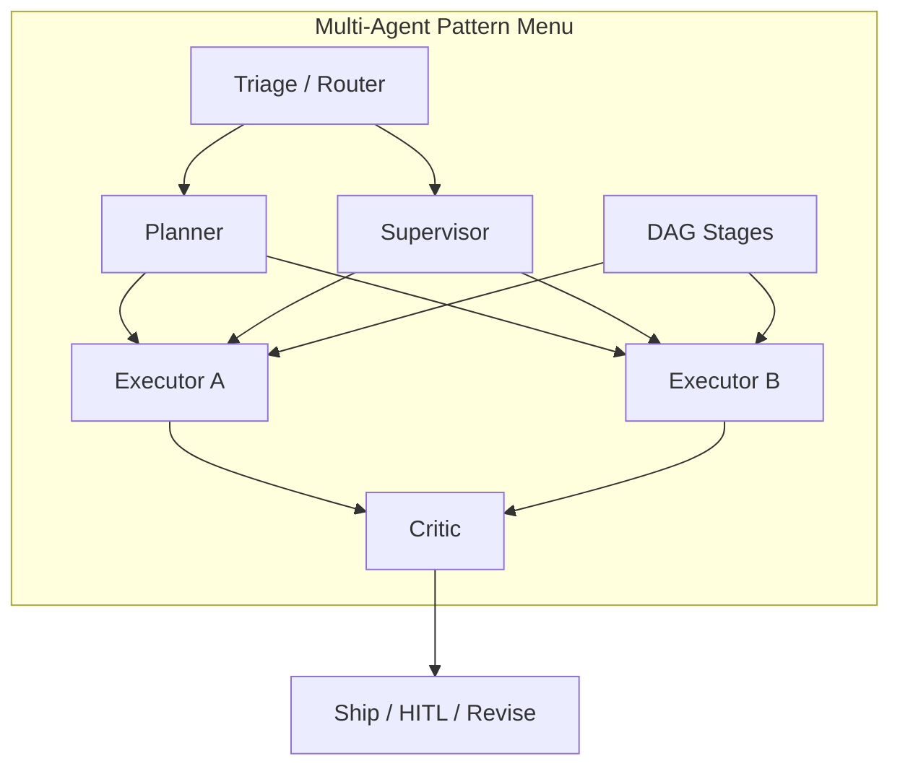

---

## Core Concepts

### 1) Planner–Executor–Critic (PEC)

#### Definition

**PEC** separates three cognitive roles:

1. **Planner** — decomposes goal into steps + dependencies + acceptance criteria.  
2. **Executor(s)** — perform steps with tools; may be multiple specialists.  
3. **Critic** — verifies outputs against criteria; approves, rejects, or requests revision.

#### Intuition

Same pattern as **design doc → implementation → code review**, but automated. The critic is not “another chatbot” — it is a **quality gate** with different prompts, often a different model, and sometimes deterministic checks.

#### When to use

- Deliverable has **objective criteria** (budget, dates, policy).
- Errors are **costly** (wrong flight, wrong clause).
- You can afford **extra hops** for quality.

#### When NOT to use

- Latency SLO < 2s conversational.
- Task is single-shot summarization.
- Critic has no actionable rubric → becomes noise.

#### Mermaid — PEC loop

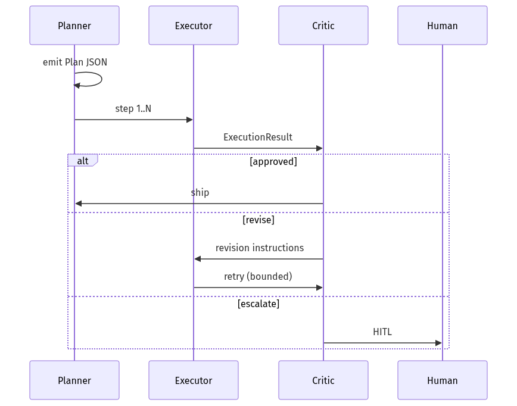

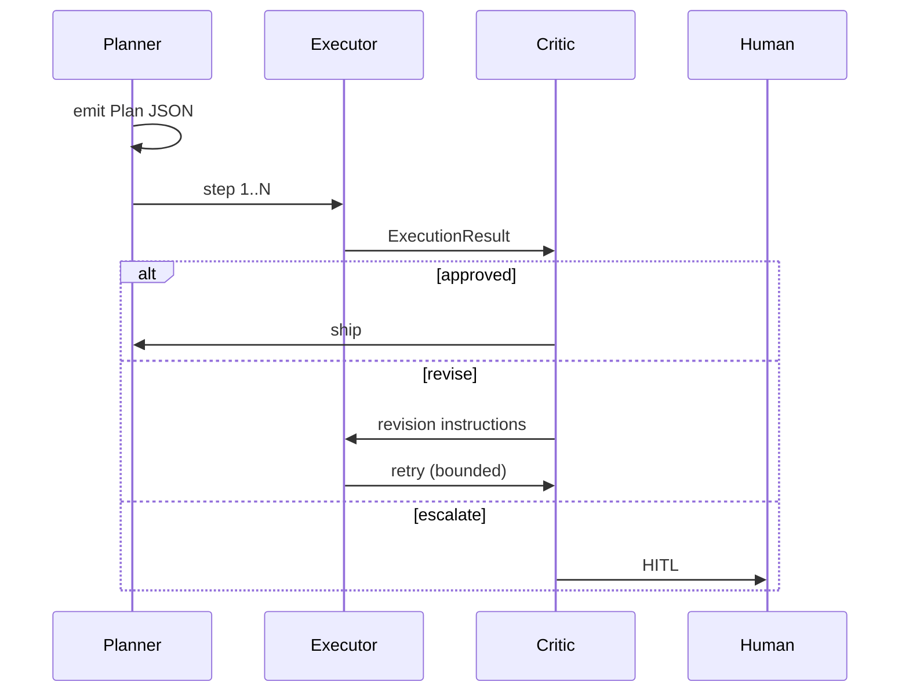

Research anchor: role-based multi-agent systems ([MetaGPT paper](https://arxiv.org/abs/2308.08155)) — useful vocabulary for specialization, not a production blueprint.

---

### 2) Supervisor Pattern

#### Definition

A **supervisor agent** (or node) routes work to specialists and regains control after each sub-run. LangGraph implements this via **tool-based handoffs** returning `Command(goto=...)` ([LangGraph multi-agent](https://langchain-ai.github.io/langgraph/concepts/multi_agent/)).

#### When to use

- Next step depends on **runtime findings**.
- Specialists are **peers** (research, booking, comms).
- You need **central audit trail** of routing decisions.

#### Supervisor vs PEC

| Aspect | Supervisor | PEC |
|--------|------------|-----|
| Plan artifact | Optional / implicit | Explicit Plan schema |
| Verification | May be separate critic node | Critic is first-class |
| Flexibility | High | Medium (plan may need replanning) |
| Debuggability | Trace routing spans | Trace plan versions |

Deep comparison with frameworks: [05-03](05-03-Frameworks-CrewAI-AutoGen-LangGraph.md).

---

### 3) DAG / Workflow Pattern

#### Definition

A **DAG** (directed acyclic graph) runs predefined stages with dependencies. AI agents occupy **nodes**, but topology is **mostly fixed**.

#### When to use

- Pipeline is stable: ingest → extract → validate → summarize.
- Parallel stages are known upfront.
- Compliance requires **predictable stage order**.

#### When NOT to use

- Branching logic is highly input-dependent early in the flow.
- You’re secretly building a supervisor with extra steps.

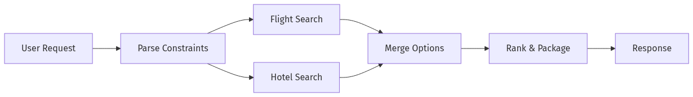

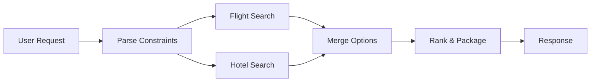

LangGraph fits DAGs natively: nodes + edges, optional conditional edges for small branches ([03-04](../03-Agentic-Fundamentals/03-04-LangGraph-Production-Agents.md)).

---

### 4) Hybrid Pattern

#### Definition

**Hybrid** = deterministic **spine** (code, rules, SQL, policy tables) + **agentic edges** (planning, drafting, ambiguous tool selection).

#### When to use

- Regulated domain with **creative UX** (banking, healthcare, travel policies).
- Most steps are known; 1–2 steps need judgment.

#### Example (travel)

| Step | Implementation |
|------|----------------|
| Parse budget cap | Deterministic parser |
| Policy check (visa, blackout) | Rules engine |
| Flight search | Executor agent + API |
| Itinerary narrative | LLM draft |
| Final approval | Critic + HITL if over budget |

Aligns with [00-01 AI Engineering Mindset](../00-Foundations/00-01-AI-Engineering-Mindset.md): policy in code, language in models.

---

### 5) Triage Pattern

#### Definition

**Triage** is a fast first hop that classifies intent, risk, and route **before** expensive multi-agent work.

#### When to use

- High QPS entry (support, voice, chat).
- Wide intent surface.
- Need to **reject/abstain** early.

#### Triage outputs (contract)

```python
class TriageDecision(BaseModel):
    intent: Literal["plan_trip", "change_booking", "policy_question", "other"]
    risk: Literal["low", "medium", "high"]
    route: Literal["pec_travel", "single_agent_faq", "human"]
    confidence: float = Field(ge=0, le=1)
```

#### Mermaid

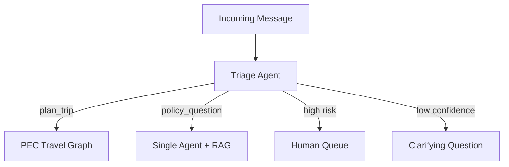

Tools exposed via [MCP](../07-Protocols-MCP-A2A/07-01-MCP-Model-Context-Protocol.md); cross-org handoffs via [A2A](../07-Protocols-MCP-A2A/07-02-A2A-Agent-to-Agent.md).

---

### 6) Task Decomposition

#### Definition

**Task decomposition** converts a user goal into bounded subtasks with dependencies, inputs, outputs, and done criteria.

#### Decomposition checklist

| Field | Question |
|-------|----------|
| **Subtask ID** | Stable name for tracing |
| **Input schema** | What must be present to start |
| **Output schema** | What downstream consumes |
| **Dependencies** | Which subtasks must finish first |
| **Parallelizable?** | Can run with siblings |
| **Tool set** | Minimal tools for this subtask |
| **Acceptance tests** | Objective pass/fail |
| **Fallback** | What if subtask fails |

#### Travel planner decomposition

| ID | Subtask | Depends | Output |
|----|---------|---------|--------|
| T1 | Extract constraints | — | `TravelConstraints` |
| T2 | Search flights | T1 | `FlightOptions` |
| T3 | Search hotels | T1 | `HotelOptions` |
| T4 | Build itinerary | T2, T3 | `ItineraryDraft` |
| T5 | Policy/budget check | T4 | `CriticVerdict` |
| T6 | User narrative | T5 approved | `FinalPlan` |

#### Interview move

Draw the DAG **before** naming agents. Agents map to subtasks; subtasks do not map to “whatever sounds cool.”

---

### 7) Output Contracts

#### Definition

An **output contract** is a machine-validated schema plus invariants that an agent guarantees (or explicitly fails) before handing off.

#### Contract layers

| Layer | Mechanism | Example |
|-------|-----------|---------|
| **Syntax** | JSON Schema / Pydantic | Required fields |
| **Semantics** | Cross-field rules | `depart < return` |
| **Policy** | Deterministic checker | budget ≤ user max |
| **Quality** | Critic rubric | citations present |

#### Error envelope (always return this on failure)

```python
class AgentError(BaseModel):
    agent: str
    code: Literal["validation", "tool", "timeout", "policy", "unknown"]
    message: str
    retryable: bool
    details: dict = Field(default_factory=dict)
```

#### Why contracts matter

Without contracts, multi-agent systems become **telephone game with JSON** — the dominant production failure mode ([05-01 cascading failures](05-01-Multi-Agent-Orchestration.md)).

---

## Pattern Selection Guide

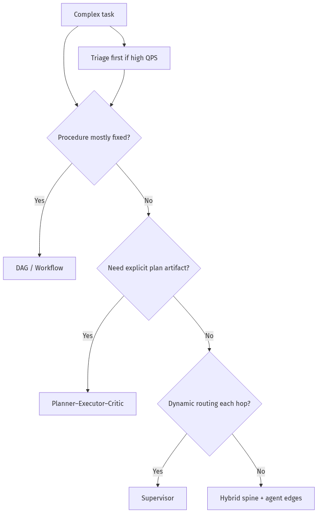

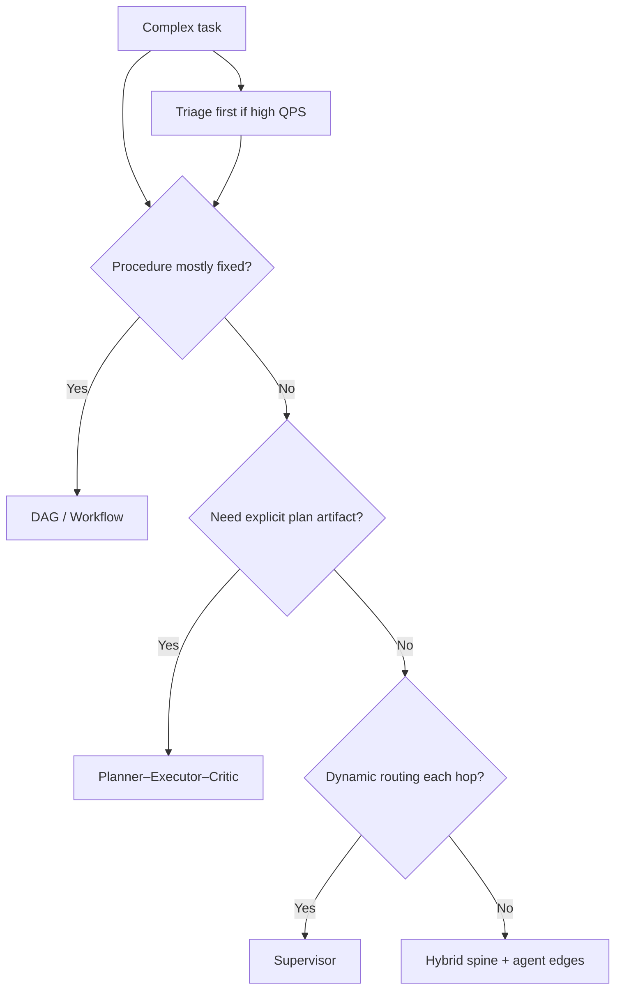

| Scenario | Recommended pattern |
|----------|----------------------|
| Travel planner with budget | PEC or Hybrid |
| Customer support router | Triage + Supervisor |
| Invoice processing pipeline | DAG |
| Compliance + email draft | Hybrid |
| Research report generation | PEC with parallel executors |

---

## Implementation

### Production LangGraph travel planner (PEC + parallel executors)

Full example: **Triage optional**, **Planner**, parallel **Flight/Hotel executors**, **Merger**, **Critic**, **Finalizer**. Uses Pydantic contracts throughout.

```python
"""Travel planner — Planner / Executor / Critic on LangGraph.

pip install langgraph langchain-openai pydantic

Env: OPENAI_API_KEY=...
"""

from __future__ import annotations

import json
import operator
import uuid
from datetime import date
from typing import Annotated, Literal, TypedDict

from langchain_core.messages import AIMessage, HumanMessage
from langchain_openai import ChatOpenAI
from langgraph.checkpoint.memory import InMemorySaver
from langgraph.graph import END, START, StateGraph
from langgraph.types import Send
from pydantic import BaseModel, Field, ValidationError, field_validator


# ---------------------------------------------------------------------------
# Contracts
# ---------------------------------------------------------------------------

class TravelConstraints(BaseModel):
    destination: str
    depart_date: date
    return_date: date
    budget_usd: float = Field(gt=0)
    travelers: int = Field(ge=1, le=9)

    @field_validator("return_date")
    @classmethod
    def return_after_depart(cls, v: date, info) -> date:
        depart = info.data.get("depart_date")
        if depart and v <= depart:
            raise ValueError("return_date must be after depart_date")
        return v


class PlanStep(BaseModel):
    step_id: str
    description: str
    agent: Literal["flight_executor", "hotel_executor", "merger", "critic"]
    depends_on: list[str] = Field(default_factory=list)


class TravelPlan(BaseModel):
    plan_id: str
    steps: list[PlanStep]
    acceptance_criteria: list[str]


class FlightOption(BaseModel):
    airline: str
    price_usd: float
    depart_iso: str


class HotelOption(BaseModel):
    name: str
    price_usd: float
    nights: int


class ExecutorResult(BaseModel):
    step_id: str
    agent: str
    payload: dict
    success: bool
    error: str | None = None


class ItineraryDraft(BaseModel):
    destination: str
    total_usd: float
    flights: list[FlightOption]
    hotels: list[HotelOption]
    summary: str


class CriticVerdict(BaseModel):
    approved: bool
    issues: list[str] = Field(default_factory=list)
    must_revise: bool = False


class TravelPlanState(TypedDict):
    messages: Annotated[list, operator.add]
    thread_id: str
    raw_request: str
    constraints: dict | None
    plan: dict | None
    executor_results: Annotated[list[dict], operator.add]
    itinerary: dict | None
    critic: dict | None
    critic_rounds: int
    max_critic_rounds: int
    final_response: str | None


# ---------------------------------------------------------------------------
# Nodes
# ---------------------------------------------------------------------------

def planner_node(state: TravelPlanState) -> dict:
    """Planner: decompose into flight + hotel executors (parallel) then merge + critic."""
    llm = ChatOpenAI(model="gpt-4.1-mini", temperature=0)

    # In production: LLM extracts constraints; here we parse deterministically for tests
    raw = state["raw_request"].lower()
    constraints = TravelConstraints(
        destination="Tokyo" if "tokyo" in raw else "Paris",
        depart_date=date(2026, 9, 1),
        return_date=date(2026, 9, 8),
        budget_usd=2500.0 if "budget" not in raw else 1800.0,
        travelers=2,
    )

    plan = TravelPlan(
        plan_id=str(uuid.uuid4()),
        steps=[
            PlanStep(step_id="S1", description="Search flights", agent="flight_executor"),
            PlanStep(step_id="S2", description="Search hotels", agent="hotel_executor"),
            PlanStep(step_id="S3", description="Merge itinerary", agent="merger", depends_on=["S1", "S2"]),
            PlanStep(step_id="S4", description="Verify budget and completeness", agent="critic", depends_on=["S3"]),
        ],
        acceptance_criteria=[
            "Total cost <= budget_usd",
            "At least one flight and one hotel",
            "Return date after depart date",
        ],
    )

    return {
        "constraints": constraints.model_dump(mode="json"),
        "plan": plan.model_dump(mode="json"),
        "messages": [AIMessage(content=f"Plan created: {plan.plan_id}")],
    }


def dispatch_executors(state: TravelPlanState) -> list[Send]:
    """Fan-out parallel executors after planner."""
    c = TravelConstraints.model_validate(state["constraints"])
    return [
        Send("flight_executor_node", {"constraints": state["constraints"], "thread_id": state["thread_id"]}),
        Send("hotel_executor_node", {"constraints": state["constraints"], "thread_id": state["thread_id"]}),
    ]


def flight_executor_node(state: dict) -> dict:
    c = TravelConstraints.model_validate(state["constraints"])
    flights = [
        FlightOption(airline="SkyCo", price_usd=650.0, depart_iso=f"{c.depart_date}T09:00"),
        FlightOption(airline="JetPath", price_usd=580.0, depart_iso=f"{c.depart_date}T13:00"),
    ]
    result = ExecutorResult(
        step_id="S1", agent="flight_executor",
        payload={"flights": [f.model_dump() for f in flights]}, success=True,
    )
    return {"executor_results": [result.model_dump()]}


def hotel_executor_node(state: dict) -> dict:
    c = TravelConstraints.model_validate(state["constraints"])
    nights = (c.return_date - c.depart_date).days
    hotels = [HotelOption(name="Central Inn", price_usd=120.0 * nights, nights=nights)]
    result = ExecutorResult(
        step_id="S2", agent="hotel_executor",
        payload={"hotels": [h.model_dump() for h in hotels]}, success=True,
    )
    return {"executor_results": [result.model_dump()]}


def merger_node(state: TravelPlanState) -> dict:
    c = TravelConstraints.model_validate(state["constraints"])
    flights, hotels = [], []
    for er in state["executor_results"]:
        parsed = ExecutorResult.model_validate(er)
        if parsed.agent == "flight_executor":
            flights = [FlightOption.model_validate(f) for f in parsed.payload.get("flights", [])]
        if parsed.agent == "hotel_executor":
            hotels = [HotelOption.model_validate(h) for h in parsed.payload.get("hotels", [])]

    total = sum(f.price_usd for f in flights) + sum(h.price_usd for h in hotels)
    draft = ItineraryDraft(
        destination=c.destination,
        total_usd=total,
        flights=flights,
        hotels=hotels,
        summary=f"{len(flights)} flights, {len(hotels)} hotels under review",
    )
    return {"itinerary": draft.model_dump(), "messages": [AIMessage(content=draft.summary)]}


def critic_node(state: TravelPlanState) -> dict:
    c = TravelConstraints.model_validate(state["constraints"])
    itinerary = ItineraryDraft.model_validate(state["itinerary"])
    issues: list[str] = []

    if itinerary.total_usd > c.budget_usd:
        issues.append(f"Over budget: {itinerary.total_usd} > {c.budget_usd}")
    if not itinerary.flights:
        issues.append("Missing flights")
    if not itinerary.hotels:
        issues.append("Missing hotels")

    verdict = CriticVerdict(approved=len(issues) == 0, issues=issues, must_revise=len(issues) > 0)
    return {
        "critic": verdict.model_dump(),
        "critic_rounds": state["critic_rounds"] + 1,
        "messages": [AIMessage(content=json.dumps(verdict.model_dump()))],
    }


def route_after_critic(state: TravelPlanState) -> Literal["finalize_node", "planner_node"]:
    verdict = CriticVerdict.model_validate(state["critic"])
    if verdict.approved:
        return "finalize_node"
    if state["critic_rounds"] >= state["max_critic_rounds"]:
        return "finalize_node"  # escalate in production
    return "planner_node"  # replan / revise


def finalize_node(state: TravelPlanState) -> dict:
    verdict = CriticVerdict.model_validate(state["critic"]) if state.get("critic") else None
    if verdict and verdict.approved:
        text = f"✅ Approved itinerary:\n{json.dumps(state['itinerary'], indent=2)}"
    else:
        text = f"⚠️ Could not approve: {verdict.issues if verdict else 'unknown'}"
    return {"final_response": text, "messages": [AIMessage(content=text)]}


def build_travel_planner_graph():
    g = StateGraph(TravelPlanState)
    g.add_node("planner_node", planner_node)
    g.add_node("flight_executor_node", flight_executor_node)
    g.add_node("hotel_executor_node", hotel_executor_node)
    g.add_node("merger_node", merger_node)
    g.add_node("critic_node", critic_node)
    g.add_node("finalize_node", finalize_node)

    g.add_edge(START, "planner_node")
    g.add_conditional_edges("planner_node", dispatch_executors, ["flight_executor_node", "hotel_executor_node"])
    g.add_edge("flight_executor_node", "merger_node")
    g.add_edge("hotel_executor_node", "merger_node")
    g.add_edge("merger_node", "critic_node")
    g.add_conditional_edges("critic_node", route_after_critic, ["finalize_node", "planner_node"])
    g.add_edge("finalize_node", END)

    return g.compile(checkpointer=InMemorySaver())


if __name__ == "__main__":
    graph = build_travel_planner_graph()
    tid = str(uuid.uuid4())
    init: TravelPlanState = {
        "messages": [HumanMessage(content="Plan Tokyo trip for 2, budget 2500 USD")],
        "thread_id": tid,
        "raw_request": "Plan Tokyo trip for 2, budget 2500 USD",
        "constraints": None,
        "plan": None,
        "executor_results": [],
        "itinerary": None,
        "critic": None,
        "critic_rounds": 0,
        "max_critic_rounds": 2,
        "final_response": None,
    }
    out = graph.invoke(init, config={"configurable": {"thread_id": tid}, "recursion_limit": 25})
    print(out["final_response"])
```

#### Implementation notes

1. **Planner emits `TravelPlan`** — auditable artifact, not just chat history.  
2. **`Send` fan-out** — flight and hotel executors run in parallel ([LangGraph multi-agent](https://langchain-ai.github.io/langgraph/concepts/multi_agent/)).  
3. **Merger enforces typed merge** — only consumes validated `ExecutorResult`.  
4. **Critic bounded** — `max_critic_rounds` prevents infinite revise loops ([05-01](05-01-Multi-Agent-Orchestration.md)).  
5. **Instrument with LangSmith** per [08-02](../08-Evaluation-LLMOps/08-02-Observability-LangSmith-OTel.md).

---

## Production Considerations

| Concern | Pattern-specific guidance |
|---------|---------------------------|
| PEC replanning | Version `plan_id`; diff plans in traces |
| Supervisor context | Summarize worker outputs before re-routing |
| DAG changes | Version graph; migrate checkpoints ([03-04](../03-Agentic-Fundamentals/03-04-LangGraph-Production-Agents.md)) |
| Hybrid drift | Unit test deterministic spine separately |
| Triage mistakes | Log confusion matrix; shadow mode new routes |

---

## Security

| Risk | Mitigation |
|------|------------|
| Critic bypass via prompt injection | Critic reads structured fields, not raw web HTML |
| Executor tool escalation | Role-scoped tool lists via MCP |
| Cross-agent data leakage | Separate private state channels in LangGraph |

---

## Performance

| Pattern | Latency profile |
|---------|-----------------|
| DAG fixed | Predictable |
| PEC sequential critic | +1–3 LLM hops |
| Parallel executors | ~max(worker) + merge |
| Triage | Adds ~200–500ms; saves misfires |

---

## Cost

| Pattern | Cost driver |
|---------|-------------|
| PEC | Planner + N executors + M critic rounds |
| Supervisor | Repeated supervisor calls with growing context |
| DAG | Pay only for nodes visited |
| Triage | Small model on every request |

**Optimization:** Cache executor results keyed by `(destination, dates)`; skip critic on low-risk internal previews.

---

## Scalability

- **DAG / Hybrid spine** scales horizontally like any workflow.  
- **PEC** scales by sharding executors; critic becomes bottleneck — use rubric batching.  
- **Supervisor** scales poorly if context grows unbounded — enforce summarization.

---

## Failure Modes

| Failure | Pattern | Fix |
|---------|---------|-----|
| Planner hallucinates steps | PEC | Validate plan against allowed step catalog |
| Executors race on merge | Parallel | Reducer lists + merger waits for both |
| Critic never approves | PEC | Max rounds → HITL |
| Supervisor ping-pong | Supervisor | Hop limits |
| Wrong triage route | Triage | Confidence threshold + clarify |

---

## Observability

Log pattern-specific fields:

```text
pattern=PEC, plan_id, step_id, agent_role, critic_round,
contract_validation_ms, merge_wait_ms
```

Trace example structure in [08-02](../08-Evaluation-LLMOps/08-02-Observability-LangSmith-OTel.md).

---

## Debugging

| Symptom | Check |
|---------|-------|
| Empty merger | Executor results count / schema |
| Critic false reject | Acceptance criteria vs deterministic checks |
| Replan loop | `critic_rounds` vs plan changes |
| Slow p95 | Parallel path actually fan-out? |

---

## Common Mistakes

1. Calling it PEC but skipping structured Plan object.  
2. Critic shares identical prompt/model with executor.  
3. DAG with 12 conditional surprises — it’s a supervisor in disguise.  
4. No triage on high-QPS endpoints.  
5. Output contracts only “documented,” not validated.

---

## Tradeoffs

| Pattern | Strength | Weakness |
|---------|----------|----------|
| PEC | Quality ceiling | Cost + latency |
| Supervisor | Dynamic | Context bloat |
| DAG | Predictable | Inflexible |
| Hybrid | Governed + flexible | Two paradigms |
| Triage | Spend control | Misroute risk |

---

## Architecture Diagram — Travel PEC

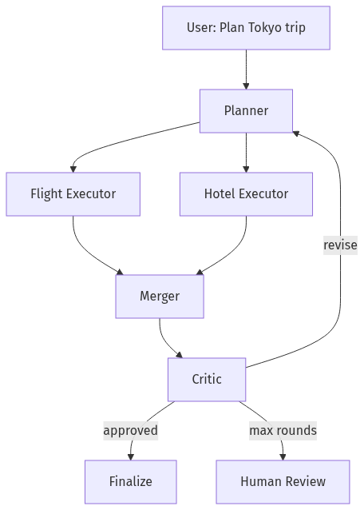

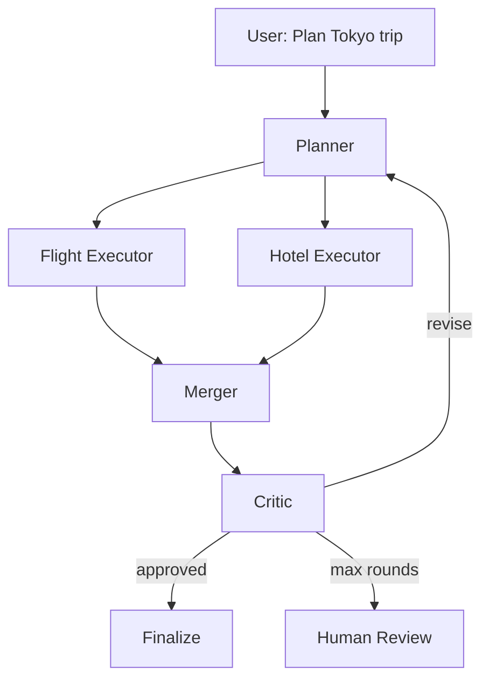

---

## Mermaid Diagram — Supervisor Alternative

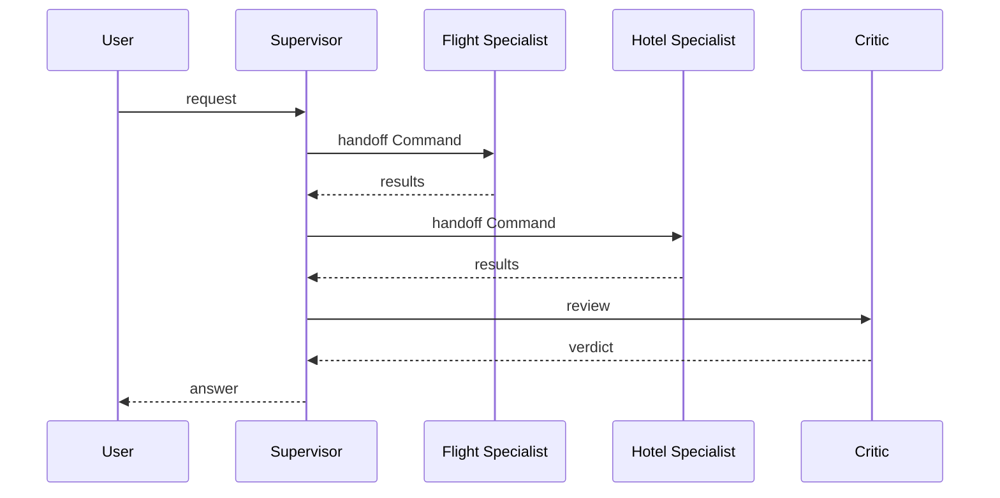

---

## Production Examples

| Product shape | Pattern |
|---------------|---------|
| Copilot for analysts | PEC (plan → SQL executors → critic) |
| Airline support | Triage → Supervisor |
| Contract review | Hybrid rules + PEC |
| Marketing content pipeline | DAG stages + single critic |

---

## Real Companies Using It (Public Patterns)

| Reference | Pattern hint |
|-----------|--------------|
| LangGraph multi-agent docs | Supervisor + handoffs |
| CrewAI hierarchical process | Role-based PEC-like crews |
| AutoGen group chat | Peer negotiation ([AutoGen](https://microsoft.github.io/autogen/stable//index.html)) |
| MetaGPT research | Role specialization ([arxiv:2308.08155](https://arxiv.org/abs/2308.08155)) |

---

## Hands-on Labs

### Lab A — Pattern pick (30 min)

Given 5 scenarios, assign pattern + justify in 3 sentences each.

### Lab B — Contract breakage (45 min)

Deliberately return malformed hotel JSON; verify merger/critic fails closed.

### Lab C — Critic bounds (30 min)

Set budget below trip cost; confirm max rounds → finalize with escalation message.

---

## Coding Assignments

1. Add `TriageDecision` node upstream of planner.  
2. Replace deterministic constraint parse with structured LLM extraction + validation.  
3. Add deterministic policy node between merger and critic (visa rules table).

---

## Mini Project

**Title:** PEC Travel Planner v1  
**Done when:** parallel executors, critic loop bound, contracts validated, sample trace exported.

---

## Production Project

**Title:** Pattern Router Service  
**Done when:** config selects DAG vs PEC vs Supervisor per tenant; metrics per pattern.

---

## Stretch Project

Implement same travel planner in **Supervisor** and **DAG** variants; compare LOC, p95, eval score.

---

## Interview Questions

### Senior Engineer

1. Difference between Supervisor and PEC?  
2. What goes in a Plan JSON vs chat history?  
3. How do you parallelize executors safely?

### Staff Engineer

1. Design triage for a support bot with 20 intents.  
2. When is Hybrid preferable to pure PEC?  
3. How do output contracts interact with MCP tools?

### Principal Engineer

1. Standardize patterns across 8 product teams — what’s in the platform?  
2. Travel planner: what must be deterministic for PCI/travel regs?  
3. A2A between your planner and partner booking agent — boundaries?

### Engineering Manager

1. Team owns planner prompts vs executor tools — how do you split ownership?  
2. Critic doubles cost — when do you ship without it?  
3. Eval plan for pattern migration (supervisor → PEC).

### Whiteboard

Draw travel PEC with parallel executors and critic revision loop.

---

## Revision Notes

- Pick pattern from **task structure**, not framework defaults.  
- Planner produces **artifacts**, not vibes.  
- Contracts at every hop — syntax + semantics + policy.  
- Bound critic loops; escalate to HITL.  
- Triage saves money at the front door.

---

## Summary

Multi-agent patterns are **coordination templates** for partitioning uncertainty. Planner–Executor–Critic excels when verification matters; Supervisor when routing is dynamic; DAG when topology is stable; Hybrid when regulation meets creativity; Triage when volume demands gatekeeping. The travel planner ties them together with schemas, parallel executors, and bounded critique.

Next: [05-03 Frameworks — CrewAI, AutoGen, LangGraph](05-03-Frameworks-CrewAI-AutoGen-LangGraph.md).

---

## Further Reading

| Title | URL | Difficulty | Reading Time | Why Read | Important Sections |
|-------|-----|------------|--------------|----------|--------------------|
| LangGraph Multi-Agent | https://langchain-ai.github.io/langgraph/concepts/multi_agent/ | Intermediate | 45 min | Handoffs, Send, subgraphs | Multi-agent architectures |
| MetaGPT Paper | https://arxiv.org/abs/2308.08155 | Advanced | 45 min | Role-based decomposition theory | Method |
| LangGraph Production Agents | ../03-Agentic-Fundamentals/03-04-LangGraph-Production-Agents.md | Intermediate | 60 min | Checkpointing, HITL | Persistence |
| Observability | ../08-Evaluation-LLMOps/08-02-Observability-LangSmith-OTel.md | Intermediate | 45 min | Trace per pattern | Span attributes |
| MCP | ../07-Protocols-MCP-A2A/07-01-MCP-Model-Context-Protocol.md | Intermediate | 40 min | Tool boundaries per executor | Server design |
| A2A | ../07-Protocols-MCP-A2A/07-02-A2A-Agent-to-Agent.md | Intermediate | 40 min | Cross-org executors | Negotiation |

---

## Resume Bullet (after lab)

- Implemented a **Planner–Executor–Critic travel planner** in LangGraph with parallel flight/hotel executors, Pydantic output contracts, bounded critic revision loops, and structured merge/finalize gates.
