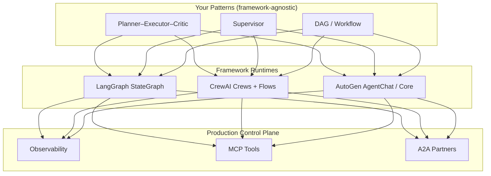
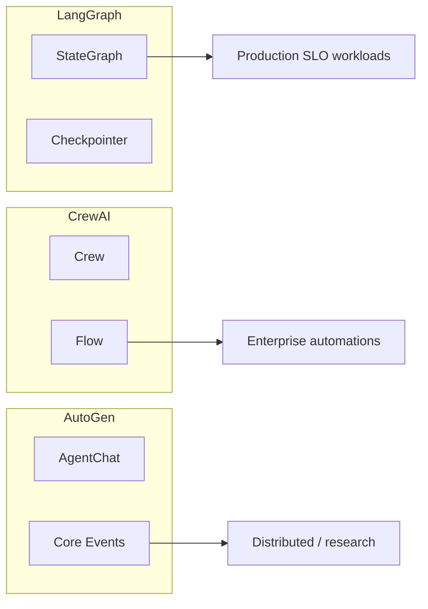
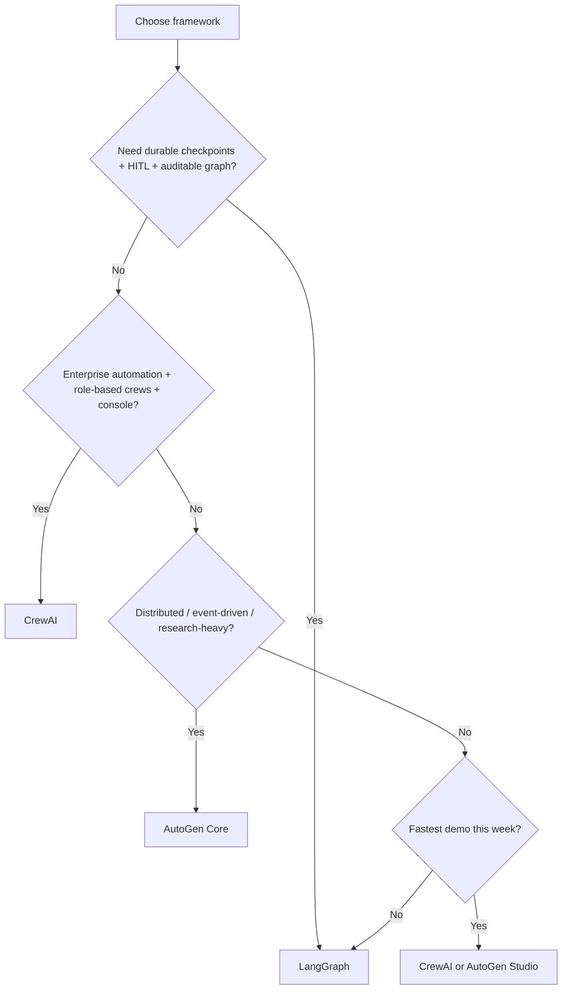
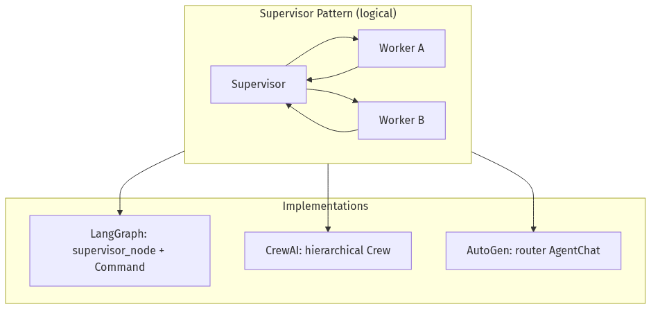
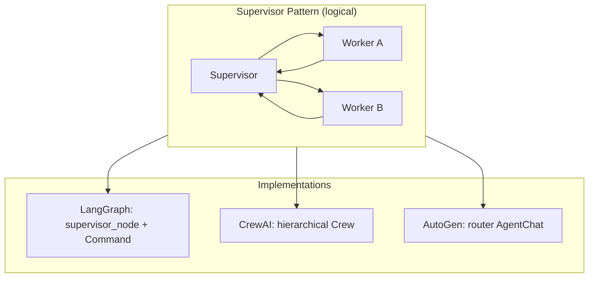
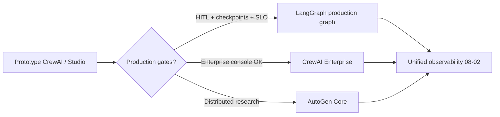

# 05-03 — Frameworks: CrewAI, AutoGen & LangGraph for Production

| Meta | Value |
|------|-------|
| **Estimated Time** | 5–6 hours (read 2.5h · lab 2h · migration exercise 1.5h) |
| **Difficulty** | Intermediate (comparison) · Advanced (production selection + migration) |
| **Prerequisites** | [05-01 Multi-Agent Orchestration](05-01-Multi-Agent-Orchestration.md) · [05-02 Planner–Executor–Critic](05-02-Planner-Executor-Critic.md) · [03-04 LangGraph Production Agents](../03-Agentic-Fundamentals/03-04-LangGraph-Production-Agents.md) |
| **Module** | 05 — Multi-Agent Orchestration |
| **Related** | [08-02 Observability](../08-Evaluation-LLMOps/08-02-Observability-LangSmith-OTel.md) · [07-01 MCP](../07-Protocols-MCP-A2A/07-01-MCP-Model-Context-Protocol.md) · [07-02 A2A](../07-Protocols-MCP-A2A/07-02-A2A-Agent-to-Agent.md) · [Architecture Index](../../Architecture Index.md) |

---

## Learning Objectives

By the end of this chapter you will be able to:

1. Compare **CrewAI**, **AutoGen**, and **LangGraph** on production dimensions: control, observability, persistence, testing, and ops maturity.
2. Select the right framework using a **decision matrix**, not hype or tutorial defaults.
3. Map handbook patterns ([05-02](05-02-Planner-Executor-Critic.md)) to each framework’s native abstractions.
4. Apply **migration notes** when moving prototypes to LangGraph (or between frameworks).
5. Implement a **production LangGraph multi-agent** reference aligned with LangChain’s current supervisor guidance.

---

## Why This Topic Matters

Framework choice is a **multi-year tax**:

| Hidden cost | What happens |
|-------------|--------------|
| **Debuggability** | Chat-transcript debugging vs explicit graph traces |
| **State ownership** | Opaque crew memory vs checkpointed state |
| **Vendor coupling** | Enterprise console vs self-hosted graph |
| **Hiring** | Team knows LangChain but you picked X |
| **Migration** | Prototype in CrewAI; production needs HITL + sagas |

Staff/Principal engineers treat frameworks as **orchestration runtimes**, not product architecture. The architecture is patterns ([05-01](05-01-Multi-Agent-Orchestration.md), [05-02](05-02-Planner-Executor-Critic.md)); the framework is how you execute them.

---

## Business Impact

| Stakeholder concern | Framework angle |
|---------------------|-----------------|
| **Time to demo** | CrewAI / AutoGen Studio often faster |
| **Time to production** | LangGraph + explicit graphs often faster |
| **Enterprise RBAC** | CrewAI Enterprise console |
| **Research / experimentation** | AutoGen Core event model |
| **Long-running workflows** | LangGraph checkpoints + HITL ([03-04](../03-Agentic-Fundamentals/03-04-LangGraph-Production-Agents.md)) |
| **Observability** | All need [08-02](../08-Evaluation-LLMOps/08-02-Observability-LangSmith-OTel.md); LangSmith integrates tightly with LangGraph |

---

## Architecture Overview



**Key insight:** Patterns are portable; **state model + routing primitives** are not.

---

## Core Concepts

### 1) LangGraph — Graph-Native Orchestration

#### Definition

[LangGraph](https://langchain-ai.github.io/langgraph/concepts/multi_agent/) models multi-agent systems as **StateGraph**: typed shared state, nodes (agents/functions), edges/`Command` routing, reducers, checkpointers, interrupts (HITL).

#### Production strengths

| Capability | Production value |
|------------|------------------|
| **Explicit graph** | Reviewable topology in code |
| **Checkpoints** | Durable threads, resume, time-travel ([03-04](../03-Agentic-Fundamentals/03-04-LangGraph-Production-Agents.md)) |
| **`Command(goto=...)` handoffs** | Recommended supervisor pattern (tool-based routing) |
| **`Send` API** | Parallel fan-out |
| **Interrupts** | Human approval gates |
| **LangSmith tracing** | First-class ([08-02](../08-Evaluation-LLMOps/08-02-Observability-LangSmith-OTel.md)) |

#### Production gaps / costs

- More boilerplate than “define a crew.”
- Team must learn graph thinking (reducers, compilation).
- LangChain ecosystem coupling (mitigated if you treat graph as boundary).

#### Best fit

- **Production agents** with SLOs, persistence, HITL.
- **Supervisor / DAG / PEC** patterns you need to audit.
- Teams already on LangChain/LangSmith.

Official reference: [LangGraph multi-agent concepts](https://langchain-ai.github.io/langgraph/concepts/multi_agent/).

---

### 2) CrewAI — Role-Based Crews & Flows

#### Definition

[CrewAI](https://docs.crewai.com/) organizes **agents** (roles, goals, backstories), **tasks**, and **processes** (sequential, hierarchical, hybrid). **Flows** add event-driven orchestration with state persistence and enterprise deployment.

#### Production strengths

| Capability | Production value |
|------------|------------------|
| **Role modeling** | Maps cleanly to business org language |
| **Hierarchical process** | Built-in manager/worker feel |
| **Enterprise platform** | Environments, RBAC, triggers (Gmail, Slack, etc.) |
| **Guardrails + memory + knowledge** | Productized cross-cutting concerns |
| **Fast prototype → pilot** | CLI scaffolding, cookbooks |

#### Production gaps / costs

- Less explicit graph visibility than LangGraph — debug via crew logs.
- Complex branching may fight the process model → use Flows.
- Heavy magic defaults — must still enforce contracts ([05-02](05-02-Planner-Executor-Critic.md)).

#### Best fit

- **Business automation** with clear roles (researcher, writer, reviewer).
- **Enterprise pilots** leveraging CrewAI deployment console.
- Teams prioritizing **time-to-demo** with guardrailed crews.

Docs: [CrewAI Documentation](https://docs.crewai.com/).

---

### 3) AutoGen — Conversational & Event-Driven Multi-Agent

#### Definition

[AutoGen](https://microsoft.github.io/autogen/stable//index.html) spans:

- **AutoGen Studio** — no-code UI prototyping.
- **AgentChat** — conversational single/multi-agent apps.
- **AutoGen Core** — event-driven framework for scalable, distributed multi-agent systems.
- **Extensions** — MCP (`McpWorkbench`), gRPC workers, Docker executors.

#### Production strengths

| Capability | Production value |
|------------|------------------|
| **Core event model** | Distributed / multi-language scenarios |
| **MCP extension** | Aligns with [07-01 MCP](../07-Protocols-MCP-A2A/07-01-MCP-Model-Context-Protocol.md) |
| **Research-friendly** | Dynamic agent collaboration experiments |
| **Studio** | PM/design prototyping |

#### Production gaps / costs

- AgentChat group-chat patterns can be **hard to operationalize** (conversation as control flow).
- Migration from 0.2 → 1.x required effort (note in official docs).
- You still build observability, cost controls, and idempotency ([05-01](05-01-Multi-Agent-Orchestration.md)).

#### Best fit

- **Research**, **multi-language distributed agents**, **Microsoft stack** integrations.
- Scenarios needing **event-driven** orchestration more than fixed graphs.
- Teams exploring [A2A-style negotiation](../07-Protocols-MCP-A2A/07-02-A2A-Agent-to-Agent.md).

---

### 4) Pattern → Framework Mapping

| Pattern ([05-02](05-02-Planner-Executor-Critic.md)) | LangGraph | CrewAI | AutoGen |
|------------------------------------------------------|-----------|--------|---------|
| **Planner–Executor–Critic** | Nodes + conditional edges + critic loop | Sequential/hierarchical tasks | Group chat or structured AgentChat |
| **Supervisor** | Supervisor node + `Command` handoffs | Hierarchical process + manager agent | Router agent in AgentChat |
| **DAG / Workflow** | Fixed edges, minimal conditionals | Sequential process / Flow steps | Core workflow graphs |
| **Hybrid** | Deterministic nodes + agent nodes | Flow + task callbacks | Core events + code handlers |
| **Triage** | Entry router node | Flow router step | First AgentChat agent |



---

### 5) Production Comparison Matrix

| Dimension | LangGraph | CrewAI | AutoGen |
|-----------|-----------|--------|---------|
| **Control flow clarity** | ★★★★★ explicit graph | ★★★ process/flow | ★★★ varies by layer |
| **Persistence / resume** | ★★★★★ checkpointers | ★★★★ Flow persistence | ★★★ Core durable events |
| **HITL** | ★★★★★ interrupts | ★★★★ enterprise triggers | ★★★ custom |
| **Parallelism** | ★★★★★ `Send` | ★★★ task parallel options | ★★★★ event parallel |
| **Observability** | ★★★★★ LangSmith | ★★★★ platform + custom | ★★★ bring-your-own |
| **Prototype speed** | ★★★ | ★★★★★ | ★★★★ Studio |
| **Enterprise console** | ★★★ LangSmith/LangGraph Platform | ★★★★★ CrewAI Enterprise | ★★★ |
| **MCP / A2A alignment** | ★★★★ via tools | ★★★★ integration tools | ★★★★★ McpWorkbench + research |
| **Testing** | ★★★★ node unit tests | ★★★ task mocks | ★★★ agent mocks |
| **Learning curve** | Steep | Moderate | Moderate (Core: steep) |

---

### 6) When to Choose Each (Decision Rules)



#### Choose **LangGraph** when

- Production SLOs, checkpoint resume, interrupts ([03-04](../03-Agentic-Fundamentals/03-04-LangGraph-Production-Agents.md)).
- Architects require **visible topology** and migration-safe state schemas.
- You already standardize on LangSmith ([08-02](../08-Evaluation-LLMOps/08-02-Observability-LangSmith-OTel.md)).

#### Choose **CrewAI** when

- Stakeholders think in **roles and tasks**, not graphs.
- Enterprise deployment, triggers, RBAC matter early.
- Pilot timeline dominates; graph can come later.

#### Choose **AutoGen** when

- **Event-driven** or **distributed** agents are core requirements.
- MCP-heavy tool ecosystem ([07-01](../07-Protocols-MCP-A2A/07-01-MCP-Model-Context-Protocol.md)).
- Research collaboration patterns ([2308.08155](https://arxiv.org/abs/2308.08155) style) before production hardening.

#### Choose **none / minimal** when

- Single agent suffices ([05-01 when NOT to multi-agent](05-01-Multi-Agent-Orchestration.md)).
- Pure DAG with no LLM routing → Temporal/Airflow + LLM nodes.

---

### 7) Migration Notes

#### CrewAI → LangGraph

| CrewAI concept | LangGraph target |
|----------------|------------------|
| Agent role/goal | System prompt + tool subset in node |
| Task | Node function + output schema |
| Sequential process | Linear edges |
| Hierarchical process | Supervisor node + handoffs |
| Crew kickoff | `graph.invoke` |
| Flow state | `StateGraph` typed state + checkpointer |

**Migration steps:**

1. Export **task I/O schemas** (Pydantic) — become state keys ([05-02 contracts](05-02-Planner-Executor-Critic.md)).  
2. Replace manager delegation with **supervisor `Command` routing**.  
3. Add **checkpointer** before parity with Flow persistence.  
4. Wire **LangSmith** traces ([08-02](../08-Evaluation-LLMOps/08-02-Observability-LangSmith-OTel.md)).  
5. Run golden evals — behavior will not match 1:1.

#### AutoGen AgentChat → LangGraph

| AgentChat | LangGraph |
|-----------|-----------|
| Group chat turn order | Graph edges / supervisor |
| `AssistantAgent` | Node with model + tools |
| Code execution | Tool node with sandbox |
| Human proxy | `interrupt()` HITL |

Prefer **AutoGen Core → LangGraph** only when you must unify runtimes; otherwise keep Core for distributed workers and LangGraph for product orchestration boundary.

#### Any framework → production checklist

- [ ] Output contracts at boundaries  
- [ ] Idempotent tools + circuit breakers ([05-01](05-01-Multi-Agent-Orchestration.md))  
- [ ] Trace ID + per-node metrics  
- [ ] `recursion_limit` / hop caps  
- [ ] Versioned prompts + graph  
- [ ] Eval gate in CI  

---

## Implementation

### Production LangGraph reference — tool-based supervisor (current LangChain recommendation)

LangChain maintainers now recommend implementing the **supervisor pattern via handoff tools** returning `Command`, rather than relying solely on helper libraries — for context control and clarity ([LangGraph multi-agent](https://langchain-ai.github.io/langgraph/concepts/multi_agent/)).

```python
"""Framework reference: LangGraph supervisor with handoff tools.

pip install langgraph langchain-openai pydantic

Compare mentally to CrewAI hierarchical crew / AutoGen group chat.
"""

from __future__ import annotations

import uuid
from typing import Annotated, Literal, TypedDict

from langchain_core.messages import AIMessage, BaseMessage, HumanMessage, SystemMessage
from langchain_core.tools import tool
from langchain_openai import ChatOpenAI
from langgraph.checkpoint.memory import InMemorySaver
from langgraph.graph import END, START, MessagesState, StateGraph
from langgraph.prebuilt import create_react_agent
from langgraph.types import Command
from pydantic import BaseModel, Field


# ---------------------------------------------------------------------------
# Shared state (extends MessagesState for supervisor compatibility)
# ---------------------------------------------------------------------------

class MultiAgentState(MessagesState):
    active_agent: str
    trace_id: str
    task_payload: dict


# ---------------------------------------------------------------------------
# Specialist worker subgraphs as nodes
# ---------------------------------------------------------------------------

class ResearchOutput(BaseModel):
    findings: list[str] = Field(default_factory=list)
    sources: list[str] = Field(default_factory=list)


class BookingOutput(BaseModel):
    status: Literal["held", "failed"]
    confirmation: str | None = None


def research_node(state: MultiAgentState) -> dict:
    llm = ChatOpenAI(model="gpt-4.1-mini", temperature=0)
    sys = SystemMessage(content="You are a travel research specialist. Be concise.")
    user = HumanMessage(content=f"Research: {state['task_payload']}")
    resp = llm.invoke([sys, user])
    out = ResearchOutput(findings=[resp.content], sources=["simulated-search"])
    return {
        "messages": [AIMessage(content=out.model_dump_json(), name="researcher")],
        "active_agent": "supervisor",
    }


def booking_node(state: MultiAgentState) -> dict:
    out = BookingOutput(status="held", confirmation="HK-" + state["trace_id"][:8])
    return {
        "messages": [AIMessage(content=out.model_dump_json(), name="booking")],
        "active_agent": "supervisor",
    }


# ---------------------------------------------------------------------------
# Handoff tools (supervisor pattern — LangGraph native)
# ---------------------------------------------------------------------------

@tool
def transfer_to_researcher(task: str) -> Command:
    """Assign flight/hotel research to the research specialist."""
    return Command(
        goto="research_node",
        update={"task_payload": {"task": task}, "active_agent": "researcher"},
    )


@tool
def transfer_to_booking(task: str) -> Command:
    """Assign seat/hotel hold to the booking specialist."""
    return Command(
        goto="booking_node",
        update={"task_payload": {"task": task}, "active_agent": "booking"},
    )


def build_supervisor_graph():
    llm = ChatOpenAI(model="gpt-4.1-mini", temperature=0)
    supervisor = create_react_agent(
        llm,
        tools=[transfer_to_researcher, transfer_to_booking],
        prompt=(
            "You are a travel supervisor. "
            "Delegate research first, then booking. "
            "Use tools to hand off; do not fabricate confirmations."
        ),
    )

    def supervisor_node(state: MultiAgentState):
        result = supervisor.invoke(state)
        # If no tool handoff, finish
        if state.get("active_agent") == "supervisor" and not result.get("messages"):
            return result
        return result

    def route_after_worker(state: MultiAgentState) -> Literal["supervisor_node", "__end__"]:
        last = state["messages"][-1].content if state["messages"] else ""
        if "confirmation" in last.lower() or "HK-" in last:
            return END
        return "supervisor_node"

    builder = StateGraph(MultiAgentState)
    builder.add_node("supervisor_node", supervisor_node)
    builder.add_node("research_node", research_node)
    builder.add_node("booking_node", booking_node)

    builder.add_edge(START, "supervisor_node")
    builder.add_edge("research_node", "supervisor_node")
    builder.add_edge("booking_node", "supervisor_node")
    builder.add_conditional_edges("supervisor_node", route_after_worker, ["supervisor_node", END])

    return builder.compile(checkpointer=InMemorySaver())


if __name__ == "__main__":
    graph = build_supervisor_graph()
    tid = str(uuid.uuid4())
    config = {"configurable": {"thread_id": tid}, "recursion_limit": 15}
    inputs: MultiAgentState = {
        "messages": [HumanMessage(content="Plan a Tokyo trip with held flights")],
        "active_agent": "supervisor",
        "trace_id": tid,
        "task_payload": {},
    }
    for event in graph.stream(inputs, config=config, stream_mode="updates"):
        print(event)
```

#### CrewAI equivalent (conceptual snippet — not interchangeable runtime)

```python
# Illustrative CrewAI shape — see https://docs.crewai.com/
# from crewai import Agent, Task, Crew, Process
#
# researcher = Agent(role="Researcher", goal="Find flights", backstory="...")
# booker = Agent(role="Booking Clerk", goal="Hold seats", backstory="...")
# manager = Agent(role="Manager", goal="Coordinate", allow_delegation=True)
#
# t1 = Task(description="Research Tokyo flights", agent=researcher, expected_output="JSON list")
# t2 = Task(description="Hold best option", agent=booker, context=[t1])
#
# crew = Crew(agents=[manager, researcher, booker], tasks=[t1, t2], process=Process.hierarchical)
# result = crew.kickoff(inputs={"destination": "Tokyo"})
```

**Delta:** CrewAI optimizes **role/task authoring**; LangGraph optimizes **explicit routing + checkpoints**. Production teams often **prototype in CrewAI**, **hard production in LangGraph** — plan migration early ([§ Migration Notes](#7-migration-notes)).

#### AutoGen equivalent (conceptual)

```python
# Illustrative AgentChat — see https://microsoft.github.io/autogen/stable//index.html
# from autogen_agentchat.agents import AssistantAgent
# from autogen_ext.models.openai import OpenAIChatCompletionClient
#
# client = OpenAIChatCompletionClient(model="gpt-4o")
# researcher = AssistantAgent("researcher", client, system_message="Research flights")
# booker = AssistantAgent("booker", client, system_message="Hold seats")
# # Group chat or structured turn-taking orchestrates delegation
```

**Delta:** AutoGen excels when conversation **is** the research interface; LangGraph excels when conversation **must become** auditable workflow.

---

## Production Considerations

| Topic | LangGraph | CrewAI | AutoGen |
|-------|-----------|--------|---------|
| **Pin versions** | Graph + node prompts | Crew package + agent defs | Core vs AgentChat versions |
| **Secrets** | Runtime context | `.env` + enterprise vault | Extension config |
| **Long runs** | Checkpointer + interrupt | Flow persistence | Durable events |
| **CI evals** | Invoke graph on fixtures | `crew.kickoff` tests | Agent unit tests |
| **FinOps** | Per-node token tags | Task-level logging | Event metrics |

Protocol strategy: standardize tools on [MCP](../07-Protocols-MCP-A2A/07-01-MCP-Model-Context-Protocol.md); cross-vendor agents on [A2A](../07-Protocols-MCP-A2A/07-02-A2A-Agent-to-Agent.md) — framework-agnostic layer above any runtime.

---

## Security

| Risk | Mitigation (all frameworks) |
|------|----------------------------|
| Over-delegation | Tool allowlists per agent role |
| Prompt injection via crew chat | Structured handoffs, not raw paste |
| Code execution (AutoGen) | Docker executors, network policies |
| Enterprise data in traces | Redact before [08-02](../08-Evaluation-LLMOps/08-02-Observability-LangSmith-OTel.md) export |

---

## Performance

| Framework | Typical p95 profile |
|-----------|---------------------|
| LangGraph | Predictable per graph depth |
| CrewAI | Sequential tasks stack; Flows improve |
| AutoGen AgentChat | Turn-taking overhead |

**Optimization:** Shared caching layer above framework — don’t duplicate flight search in each agent.

---

## Cost

| Framework | Cost gotcha |
|-----------|-------------|
| LangGraph | Supervisor re-reads context — summarize |
| CrewAI | Verbose role backstories burn tokens |
| AutoGen | Group chat broadcasts full history |

Apply budgets from [05-01 cost model](05-01-Multi-Agent-Orchestration.md).

---

## Scalability

| Framework | Scale path |
|-----------|------------|
| LangGraph | Horizontal API + external checkpointer (Postgres) |
| CrewAI | Enterprise automations + triggers |
| AutoGen Core | Distributed workers (gRPC), multi-language |

---

## Failure Modes

| Failure | Framework-specific symptom |
|---------|---------------------------|
| Opaque routing | CrewAI manager “decided” without trace |
| Chat loop | AutoGen agents talk past each other |
| State mismatch after migration | Crew task output not in LangGraph state schema |
| Graph compile errors | LangGraph orphaned nodes at deploy |

---

## Observability

| Framework | Recommended approach |
|-----------|---------------------|
| LangGraph | LangSmith + OTel ([08-02](../08-Evaluation-LLMOps/08-02-Observability-LangSmith-OTel.md)) |
| CrewAI | Platform logs + custom span wrappers |
| AutoGen | Event log + Core tracing hooks |

Normalize on **`trace_id`, `framework`, `node/agent`, `hop`** across all.

---

## Debugging

| Issue | LangGraph | CrewAI | AutoGen |
|-------|-----------|--------|---------|
| Wrong agent | Inspect `Command` / edge | Inspect manager delegation | Inspect speaker selection |
| Stuck run | Checkpointer thread | Flow state UI | Event queue |
| Flaky output | Node-level eval | Task output validation | Agent system message diff |

---

## Common Mistakes

1. Picking CrewAI because the tutorial was shortest — then needing HITL in week 4.  
2. AutoGen group chat as production control flow.  
3. LangGraph without checkpointer in production.  
4. Migrating without output contracts — silent behavior drift.  
5. Ignoring MCP/A2A and rebuilding tool plumbing per framework.

---

## Tradeoffs

| Decision | Win | Loss |
|----------|-----|------|
| LangGraph first | Ops maturity | Slower demo |
| CrewAI first | Stakeholder buy-in | Migration tax |
| AutoGen Core | Distributed scale | Engineering complexity |
| Multi-framework org | Best tool per team | No shared runbooks |

---

## Architecture Diagram — Three Runtimes, One Pattern





---

## Mermaid Diagram — Migration Path



---

## Production Examples

| Company pattern | Likely runtime |
|-----------------|----------------|
| Stateful customer agent with approvals | LangGraph |
| Marketing content crew with triggers | CrewAI Enterprise |
| Research lab multi-agent experiments | AutoGen |
| Cross-vendor booking partner | LangGraph + [A2A](../07-Protocols-MCP-A2A/07-02-A2A-Agent-to-Agent.md) |

---

## Real Companies Using It (Public Patterns)

| Source | Takeaway |
|--------|----------|
| [LangGraph docs / case studies](https://langchain-ai.github.io/langgraph/concepts/multi_agent/) | Graph + persistence for production agents |
| [CrewAI docs](https://docs.crewai.com/) | Role crews + enterprise automations |
| [AutoGen stable docs](https://microsoft.github.io/autogen/stable//index.html) | AgentChat for proto, Core for scale |
| [MetaGPT paper](https://arxiv.org/abs/2308.08155) | Role specialization research baseline |

---

## Hands-on Labs

### Lab A — Same task, three runtimes (2h)

Implement “research + book Tokyo trip” minimally in LangGraph, CrewAI, AutoGen. Compare LOC, trace clarity, persistence story.

### Lab B — Migration drill (1h)

Take CrewAI task JSON schemas; map to LangGraph state; run eval diff.

### Lab C — Observability parity (45 min)

Emit identical `trace_id` spans from LangGraph run; document gaps for CrewAI/AutoGen.

---

## Coding Assignments

1. Add MCP tool server as shared tool layer ([07-01](../07-Protocols-MCP-A2A/07-01-MCP-Model-Context-Protocol.md)).  
2. Document framework decision ADR for a fictional travel startup.  
3. Implement checkpointer-backed resume in LangGraph supervisor reference.

---

## Mini Project

**Title:** Framework Decision ADR + LangGraph reference impl  
**Done when:** ADR with matrix scores; supervisor handoffs working; eval README.

---

## Production Project

**Title:** Unified multi-agent observability wrapper  
**Done when:** Single OTel schema for LangGraph + one alternate framework run.

---

## Stretch Project

Build thin **pattern library** API: `run_pec()`, `run_supervisor()` implemented on LangGraph; CrewAI adapter behind feature flag.

---

## Interview Questions

### Senior Engineer

1. LangGraph vs CrewAI in one sentence each?  
2. What is a handoff `Command`?  
3. Where does AutoGen Core beat LangGraph?

### Staff Engineer

1. Your team prototyped in CrewAI — when do you migrate to LangGraph?  
2. How do MCP and framework choice interact?  
3. Design eval strategy framework-agnostically.

### Principal Engineer

1. Standardize one runtime or allow three? Criteria?  
2. Multi-agent platform roadmap: what is product vs open-source framework?  
3. A2A partner agents outside your LangGraph — boundary design?

### Engineering Manager

1. Hire for LangGraph or for multi-agent patterns?  
2. CrewAI Enterprise vs self-hosted LangGraph — build vs buy?  
3. Migration sprint risk communication to stakeholders.

### Whiteboard

Draw supervisor pattern in LangGraph vs CrewAI hierarchical process — highlight state ownership.

---

## Revision Notes

- Frameworks implement **patterns**, not replace architecture thinking.  
- **LangGraph** default for production graphs + HITL + checkpoints ([03-04](../03-Agentic-Fundamentals/03-04-LangGraph-Production-Agents.md)).  
- **CrewAI** for role-centric enterprise automations.  
- **AutoGen** for event-driven / distributed / research.  
- Plan **migration** when prototype framework ≠ production requirements.  
- Observability and contracts are **framework-agnostic** ([08-02](../08-Evaluation-LLMOps/08-02-Observability-LangSmith-OTel.md)).

---

## Summary

CrewAI, AutoGen, and LangGraph are **orchestration runtimes** with different sweet spots. LangGraph offers the most explicit control for production multi-agent systems with persistence and HITL. CrewAI accelerates role-based crews and enterprise deployment. AutoGen shines for event-driven and distributed agent research. Choose via decision rules, map patterns first, migrate with schemas and evals — not hope.

Module wrap-up: [05-01 Orchestration](05-01-Multi-Agent-Orchestration.md) · [05-02 Patterns](05-02-Planner-Executor-Critic.md).

---

## Further Reading

| Title | URL | Difficulty | Reading Time | Why Read | Important Sections |
|-------|-----|------------|--------------|----------|--------------------|
| LangGraph Multi-Agent | https://langchain-ai.github.io/langgraph/concepts/multi_agent/ | Intermediate | 45 min | Production graph patterns | Handoffs; supervisor |
| CrewAI Docs | https://docs.crewai.com/ | Intro–Intermediate | 45 min | Crews, flows, enterprise | Agents; tasks; processes |
| AutoGen Stable Docs | https://microsoft.github.io/autogen/stable//index.html | Intermediate | 45 min | AgentChat vs Core | Extensions; MCP |
| MetaGPT Paper | https://arxiv.org/abs/2308.08155 | Advanced | 45 min | Role-based multi-agent research | Methodology |
| LangGraph Production | ../03-Agentic-Fundamentals/03-04-LangGraph-Production-Agents.md | Advanced | 60 min | Checkpoints, interrupts | HITL |
| Observability | ../08-Evaluation-LLMOps/08-02-Observability-LangSmith-OTel.md | Intermediate | 45 min | Cross-framework traces | OTel schema |
| MCP | ../07-Protocols-MCP-A2A/07-01-MCP-Model-Context-Protocol.md | Intermediate | 40 min | Shared tools | Tool servers |
| A2A | ../07-Protocols-MCP-A2A/07-02-A2A-Agent-to-Agent.md | Intermediate | 40 min | External agents | Protocol overview |

---

## Resume Bullet (after lab)

- Evaluated **CrewAI, AutoGen, and LangGraph** for production multi-agent travel workflows; implemented supervisor handoffs in LangGraph with checkpoints and documented migration paths from role-based crew prototypes.
