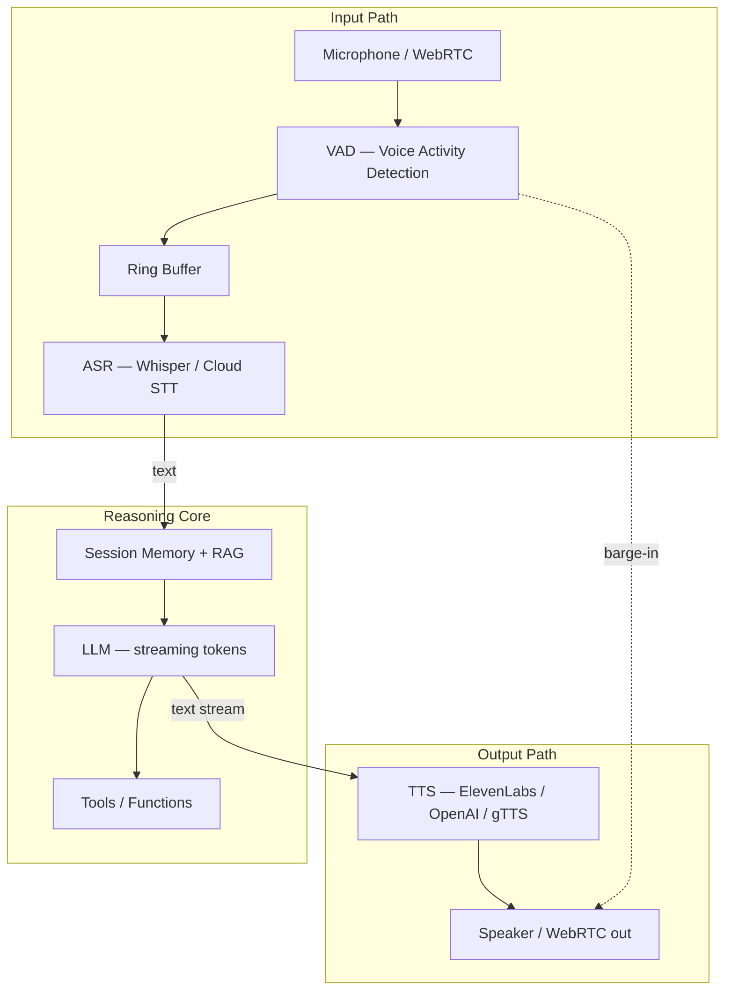
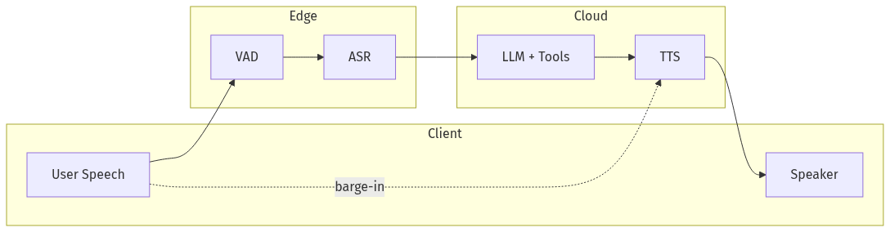
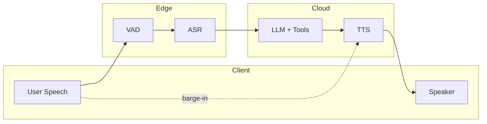
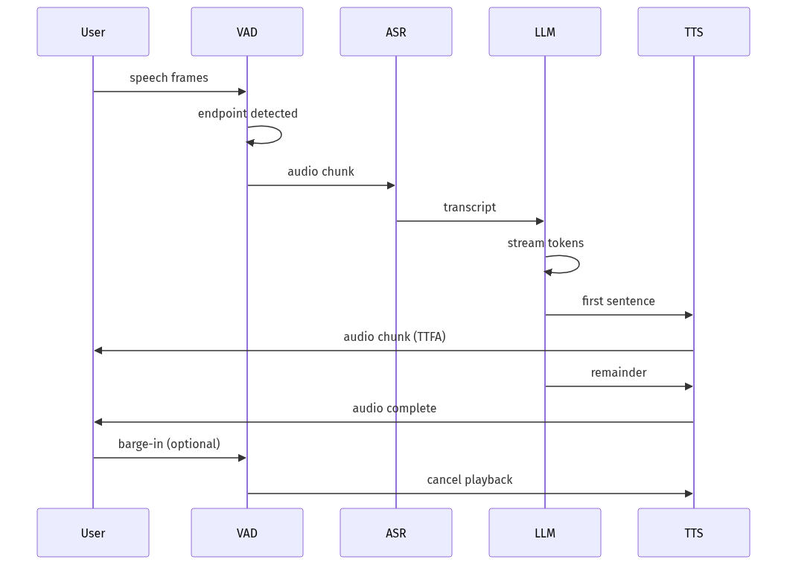
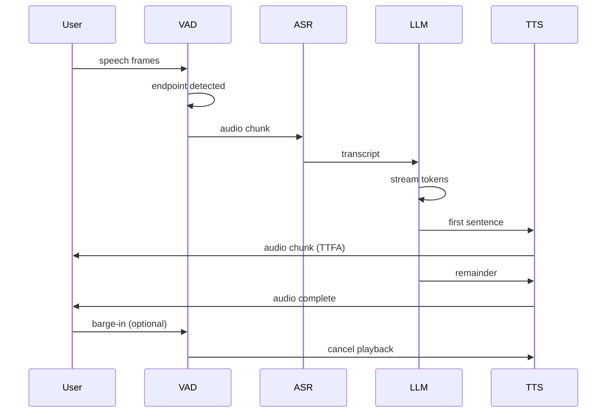

# 06-01 — Voice Pipelines: ASR → LLM → TTS

| Meta | Value |
|------|-------|
| **Estimated Time** | 5–6 hours (read 2h · lab 3h · latency budget memo 1h) |
| **Difficulty** | Intermediate (pipeline wiring) · Advanced (latency + cost SLOs) |
| **Prerequisites** | [02-01](../02-Prompt-Engineering/02-01-Production-Prompt-Engineering.md) · [03-01](../03-Agentic-Fundamentals/03-01-Agent-Anatomy-and-Loop.md) · basic audio I/O |
| **Module** | 06 — Conversational & Multimodal |
| **Related** | [06-02](06-02-Multimodal-Agents.md) · [03-04](../03-Agentic-Fundamentals/03-04-LangGraph-Production-Agents.md) · [08-02](../08-Evaluation-LLMOps/08-02-Observability-LangSmith-OTel.md) · [10-04](../10-Production-Infrastructure/10-04-Cost-Latency-Optimization.md) · [Design-AI-Voice](../../System Design/Design-AI-Voice-Assistant.md) |

---

## Learning Objectives

By the end of this chapter you will be able to:

1. Design a **cascaded voice pipeline** (ASR → LLM → TTS) with explicit latency budgets per stage.
2. Apply **VAD** (Voice Activity Detection) to reduce wasted ASR spend and improve turn-taking.
3. Compare **Whisper**, cloud ASR, and **native speech-to-speech (S2S)** models for product fit.
4. Model **TTFA** (Time To First Audio) and end-to-end conversational latency.
5. Implement a **Streamlit audio bot** pattern suitable for demos and internal pilots.
6. Build a **cost model** for voice agents at 1K / 100K / 1M minutes per month.

---

## Why This Topic Matters

Voice is the highest-friction modality to get wrong. Users tolerate 200 ms UI lag; they abandon voice assistants above ~800 ms **perceived** response delay. A naive “record → transcribe → chat → synthesize → play” loop often lands at 3–8 seconds unless you engineer streaming, barge-in, and partial results.

Staff/Principal interviews for conversational AI probe:

- Where do you cut latency without sacrificing safety?
- When is cascaded ASR+LLM+TTS better than end-to-end S2S?
- How do you handle overlapping speech, accents, and background noise?

---

## Business Impact

| Business outcome | Voice pipeline decision |
|------------------|-------------------------|
| **Support deflection** | IVR replacement with agent; must hit TTFA SLO |
| **Accessibility** | Hands-free workflows; ASR quality = inclusion |
| **Sales / concierge** | Premium TTS (ElevenLabs) vs commodity (gTTS) affects brand |
| **COGS control** | Streaming ASR + short LLM replies + cached TTS phrases |
| **Compliance** | Record retention, consent, PII in transcripts |

---

## Architecture Overview

The canonical **cascaded pipeline** treats speech as I/O adapters around an LLM core:



**Alternative:** Native **speech-to-speech** models (OpenAI Realtime API, Gemini Live) fuse perception and generation—fewer hops, less control.

---

## Core Concepts

### 1) ASR (Automatic Speech Recognition)

#### Definition

ASR converts audio waveforms to text. Production options:

| Engine | Deployment | Strengths | Weaknesses |
|--------|------------|-----------|------------|
| **OpenAI Whisper** (API or local) | Cloud / self-host | Robust accents, open weights | Latency on long files; not always lowest WER on telephony |
| **Cloud STT** (Google, Azure, Deepgram) | Managed | Streaming, telephony-tuned | Vendor lock-in, $/minute |
| **Faster-Whisper** | Self-host GPU/CPU | Cost at scale | Ops burden |

#### Intuition

ASR is the **input syscall**. Errors compound: “transfer $500” misheard as “transfer $5,000” is catastrophic without confirmation tools.

#### When to use Whisper vs cloud streaming

- **Whisper (batch/chunk):** offline transcription, multilingual pilots, cost-sensitive self-host.
- **Cloud streaming STT:** real-time voice bots, partial transcripts, telephony.

#### Interview discussion

> “We stream ASR partials to show ‘listening…’ UX and start LLM only after VAD endpoint—not after full utterance timeout.”

---

### 2) VAD (Voice Activity Detection)

#### Definition

VAD detects **speech vs silence/noise**. Used to:

- start/stop recording,
- trigger endpointing (“user finished speaking”),
- enable **barge-in** (user interrupts TTS).

#### Mental model

VAD is a **cheap gate** before expensive ASR. Without it, you pay for silence and add latency waiting for fixed timeouts.

#### Libraries

| Library | Notes |
|---------|-------|
| **webrtcvad** | Lightweight, 10/20/30 ms frames |
| **Silero VAD** | Neural, better in noise |
| **Provider VAD** | Built into Realtime APIs |

#### When NOT to rely on VAD alone

Noisy environments, cross-talk, and soft speakers cause false endpoints—combine VAD with **minimum utterance length** and **confirmation** on high-risk actions.

---

### 3) LLM in the Voice Loop

#### Definition

The LLM consumes **transcript + session state** and produces **spoken-friendly** text (short sentences, no markdown tables).

#### Voice-specific prompting rules

| Rule | Why |
|------|-----|
| Max ~2 sentences per turn | Long TTS = high TTFA |
| Spell out numbers on money paths | ASR/TTS round-trip errors |
| Explicit “confirm before action” | Irreversible tool calls |
| No bullet lists | Unspeakable |

Cross-link: [02-01 Production Prompt Engineering](../02-Prompt-Engineering/02-01-Production-Prompt-Engineering.md)

---

### 4) TTS (Text-to-Speech)

#### Definition

TTS renders text as audio. Tiers:

| Tier | Examples | Quality | Latency | Cost |
|------|----------|---------|---------|------|
| **Commodity** | gTTS, espeak, Polly standard | Robotic | Low | Very low |
| **Neural cloud** | OpenAI TTS, Azure Neural, Google WaveNet | Natural | Medium | $/char |
| **Premium clone** | ElevenLabs, PlayHT | Brand voice | Medium–high | Premium |

#### ElevenLabs vs gTTS (concepts)

- **gTTS:** Google Translate TTS wrapper—fine for prototypes, no SLA, limited voices, licensing gray for commercial scale.
- **ElevenLabs:** Neural voices, voice cloning, streaming API—use for brand-facing assistants; budget **$0.015–0.30/min** tier depending on plan/voice.

#### Streaming TTS

Request audio **chunk-by-chunk** as LLM tokens arrive → minimizes **TTFA**.

---

### 5) TTFA and Latency Budgets

#### Definition

| Metric | Meaning | Typical target (consumer) |
|--------|---------|---------------------------|
| **TTFT** | Time to first LLM token | 300–800 ms |
| **TTFA** | Time to first audible byte | 500 ms–1.5 s |
| **E2E** | End of user speech → start of reply audio | < 1.5 s ideal; < 2.5 s acceptable |

#### Budget template

```text
VAD endpoint:           150–400 ms
ASR (streaming final):  200–600 ms
LLM first token:        200–500 ms
TTS first chunk:        100–300 ms
─────────────────────────────────
TTFA (optimistic):      ~650 ms–1.8 s
```

Parallelize: start TTS on **first sentence**, not full completion.

---

### 6) Native Speech-to-Speech (S2S)

#### Definition

Single model maps **audio in → audio out** (optionally with tool use). Examples: OpenAI Realtime API, Google Gemini Live.

#### When to use S2S

| Use S2S | Use cascaded ASR→LLM→TTS |
|---------|--------------------------|
| Low-latency conversation | Full control over transcript audit |
| Emotional prosody matters | Custom ASR/TTS vendor mix |
| Rapid prototype | Heavy tool/RAG with text traces |

#### Tradeoff

S2S reduces hops but **obscures intermediate text**—harder compliance logging unless provider exposes transcripts.

---

### 7) Cost Modeling

#### Variables

```text
cost = (audio_minutes × ASR_rate)
     + (tokens_in + tokens_out) × LLM_rate
     + (characters or seconds) × TTS_rate
     + (infra: GPU for local Whisper, WebRTC)
```

#### Example (illustrative USD)

| Scale | ASR $/min | LLM/turn | TTS/min | ~$/1000 min |
|-------|-----------|----------|---------|-------------|
| Pilot | 0.006 | 0.002 | 0.015 | ~25–40 |
| Scale | 0.004 | 0.001 | 0.010 | ~18–28 |

**Levers:** VAD trim silence, shorter replies, cache common TTS phrases (“Your balance is…”), small LLM for routing.

Cross-link: [10-04 Cost & Latency Optimization](../10-Production-Infrastructure/10-04-Cost-Latency-Optimization.md)

---

## Implementation

### Production-shaped voice pipeline (Python + Streamlit)

Dependencies:

```bash
pip install streamlit openai faster-whisper webrtcvad pydub python-dotenv
# Optional TTS: pip install gTTS elevenlabs
```

```python
"""Streamlit voice bot — ASR → LLM → TTS with VAD gate.

Run:
  streamlit run voice_bot.py

Env:
  OPENAI_API_KEY=...
  ELEVENLABS_API_KEY=...  # optional
"""

from __future__ import annotations

import io
import os
import tempfile
import time
import wave
from dataclasses import dataclass, field
from enum import Enum
from typing import Any, Callable

import streamlit as st
import webrtcvad
from openai import OpenAI

try:
    from gtts import gTTS
except ImportError:
    gTTS = None  # type: ignore


class TTSBackend(str, Enum):
    OPENAI = "openai"
    GTTS = "gtts"


@dataclass
class LatencyBudget:
    vad_ms: int = 0
    asr_ms: int = 0
    llm_ms: int = 0
    tts_ms: int = 0

    @property
    def ttfa_ms(self) -> int:
        return self.vad_ms + self.asr_ms + self.llm_ms + self.tts_ms


@dataclass
class VoiceSession:
    messages: list[dict[str, str]] = field(default_factory=list)
    budgets: list[LatencyBudget] = field(default_factory=list)


def read_wav_pcm16(path: str, sample_rate: int = 16000) -> bytes:
    with wave.open(path, "rb") as wf:
        if wf.getnchannels() != 1:
            raise ValueError("mono required")
        if wf.getsampwidth() != 2:
            raise ValueError("16-bit PCM required")
        if wf.getframerate() != sample_rate:
            raise ValueError(f"expected {sample_rate} Hz")
        return wf.readframes(wf.getnframes())


def vad_trim(pcm: bytes, sample_rate: int = 16000, frame_ms: int = 30) -> tuple[bytes, int]:
    """Return speech-only PCM and elapsed ms spent in VAD."""
    t0 = time.perf_counter()
    vad = webrtcvad.Vad(2)  # aggressiveness 0–3
    frame_bytes = int(sample_rate * frame_ms / 1000) * 2
    frames = [pcm[i : i + frame_bytes] for i in range(0, len(pcm) - frame_bytes + 1, frame_bytes)]
    voiced = [f for f in frames if vad.is_speech(f, sample_rate)]
    elapsed = int((time.perf_counter() - t0) * 1000)
    return b"".join(voiced) if voiced else pcm, elapsed


def transcribe_whisper_api(client: OpenAI, audio_path: str) -> tuple[str, int]:
    t0 = time.perf_counter()
    with open(audio_path, "rb") as f:
        resp = client.audio.transcriptions.create(
            model="whisper-1",
            file=f,
            response_format="text",
        )
    text = resp if isinstance(resp, str) else str(resp)
    return text.strip(), int((time.perf_counter() - t0) * 1000)


def llm_reply(client: OpenAI, session: VoiceSession, user_text: str) -> tuple[str, int]:
    t0 = time.perf_counter()
    session.messages.append({"role": "user", "content": user_text})
    system = (
        "You are a voice assistant. Reply in 1–2 short spoken sentences. "
        "No markdown, bullets, or URLs. Confirm before any financial action."
    )
    resp = client.chat.completions.create(
        model="gpt-4.1-mini",
        messages=[{"role": "system", "content": system}, *session.messages],
        max_tokens=120,
        temperature=0.3,
    )
    text = resp.choices[0].message.content or ""
    session.messages.append({"role": "assistant", "content": text})
    return text, int((time.perf_counter() - t0) * 1000)


def synthesize_openai(client: OpenAI, text: str) -> tuple[bytes, int]:
    t0 = time.perf_counter()
    speech = client.audio.speech.create(model="tts-1", voice="alloy", input=text)
    audio_bytes = speech.read()
    return audio_bytes, int((time.perf_counter() - t0) * 1000)


def synthesize_gtts(text: str, lang: str = "en") -> tuple[bytes, int]:
    if gTTS is None:
        raise RuntimeError("pip install gTTS")
    t0 = time.perf_counter()
    buf = io.BytesIO()
    gTTS(text=text, lang=lang).write_to_fp(buf)
    return buf.getvalue(), int((time.perf_counter() - t0) * 1000)


def run_pipeline(
    audio_bytes: bytes,
    *,
    client: OpenAI,
    session: VoiceSession,
    tts_backend: TTSBackend = TTSBackend.OPENAI,
) -> dict[str, Any]:
    budget = LatencyBudget()
    with tempfile.NamedTemporaryFile(suffix=".wav", delete=False) as tmp:
        tmp.write(audio_bytes)
        wav_path = tmp.name

    pcm = read_wav_pcm16(wav_path)
    trimmed, budget.vad_ms = vad_trim(pcm)

    # Re-write trimmed audio for Whisper API
    trimmed_path = wav_path + ".trim.wav"
    with wave.open(trimmed_path, "wb") as wf:
        wf.setnchannels(1)
        wf.setsampwidth(2)
        wf.setframerate(16000)
        wf.writeframes(trimmed)

    transcript, budget.asr_ms = transcribe_whisper_api(client, trimmed_path)
    if not transcript:
        return {"error": "empty transcript", "budget": budget}

    reply, budget.llm_ms = llm_reply(client, session, transcript)

    if tts_backend == TTSBackend.OPENAI:
        audio_out, budget.tts_ms = synthesize_openai(client, reply)
    else:
        audio_out, budget.tts_ms = synthesize_gtts(reply)

    session.budgets.append(budget)
    return {
        "transcript": transcript,
        "reply": reply,
        "audio_out": audio_out,
        "budget": budget,
        "ttfa_ms": budget.ttfa_ms,
    }


def main() -> None:
    st.set_page_config(page_title="Voice Bot", layout="centered")
    st.title("ASR → LLM → TTS Voice Bot")

    if "session" not in st.session_state:
        st.session_state.session = VoiceSession()
    if not os.getenv("OPENAI_API_KEY"):
        st.error("Set OPENAI_API_KEY")
        st.stop()

    client = OpenAI()
    tts_choice = st.selectbox("TTS backend", [TTSBackend.OPENAI, TTSBackend.GTTS])

    audio_file = st.audio_input("Record your question")
    if audio_file is not None:
        with st.spinner("Processing…"):
            result = run_pipeline(
                audio_file.getvalue(),
                client=client,
                session=st.session_state.session,
                tts_backend=TTSBackend(tts_choice),
            )
        if "error" in result:
            st.warning(result["error"])
        else:
            st.write("**You said:**", result["transcript"])
            st.write("**Assistant:**", result["reply"])
            st.audio(result["audio_out"], format="audio/mp3" if tts_choice == TTSBackend.GTTS else "audio/wav")
            b = result["budget"]
            st.caption(
                f"Latency — VAD: {b.vad_ms}ms · ASR: {b.asr_ms}ms · "
                f"LLM: {b.llm_ms}ms · TTS: {b.tts_ms}ms · **TTFA≈{result['ttfa_ms']}ms**"
            )


if __name__ == "__main__":
    main()
```

#### Streamlit patterns worth copying

| Pattern | Purpose |
|---------|---------|
| `st.audio_input` | Zero-custom-JS capture in demos |
| Session state for `messages` | Multi-turn without re-auth |
| Per-stage latency caption | Teaches TTFA in every demo |
| TTS backend toggle | A/B commodity vs neural |

---

## Production Considerations

| Concern | Practice |
|---------|----------|
| **Format** | Standardize 16 kHz mono PCM for VAD/ASR |
| **Endpointing** | VAD + max silence ms + min speech ms |
| **Barge-in** | Stop TTS playback on new VAD speech |
| **Fallback** | Text mode if ASR confidence low |
| **Idempotency** | Tool calls keyed by utterance_id |
| **Consent** | Play “this call may be recorded” |

---

## Security

| Threat | Control |
|--------|---------|
| **Voice spoofing / deepfake** | Risk-based step-up auth |
| **PII in transcripts** | Redact before logs; retention TTL |
| **Prompt injection via speech** | Same defenses as text; tool allowlists |
| **Eavesdropping** | TLS for WebRTC; encrypt stored audio |

Cross-link: [11-01 OWASP LLM Top 10](../11-Security-Safety/11-01-OWASP-LLM-Top-10.md)

---

## Performance

| Stage | Optimization |
|-------|--------------|
| ASR | Streaming; partial results |
| LLM | `gpt-4.1-mini` router; stream tokens |
| TTS | First-sentence synthesis; MP3 vs WAV |
| Network | Edge POP; regional STT |

---

## Cost

| Lever | Savings |
|-------|---------|
| VAD | 10–30% fewer ASR minutes |
| Short replies | ↓ LLM + TTS |
| Cached intents | “Check balance” pre-baked TTS |
| Local Faster-Whisper at scale | ↓ cloud ASR $ |

---

## Scalability

Voice is **connection-heavy**. Plan for:

- WebRTC SFU / media servers,
- ASR worker pool,
- LLM concurrency limits,
- TTS rate limits per vendor.

---

## Failure Modes

| Failure | Symptom | Mitigation |
|---------|---------|------------|
| ASR homophones | Wrong account action | Confirm + structured tool args |
| Long LLM answer | User hangs up | Voice system prompt + max_tokens |
| TTS timeout | Silent gap | Fallback text + retry |
| VAD false end | Cut-off sentences | Adaptive thresholds |
| S2S opaque trace | Audit gap | Force transcript logging |

---

## Observability

Log per turn:

```text
utterance_id, session_id, asr_model, asr_ms, transcript, wpm,
llm_model, llm_ms, tokens_in, tokens_out, tts_backend, tts_ms,
ttfa_ms, barge_in, tool_calls, error_code
```

Cross-link: [08-02 Observability](../08-Evaluation-LLMOps/08-02-Observability-LangSmith-OTel.md)

---

## Debugging

| Symptom | Check |
|---------|-------|
| High TTFA | Stage timings; LLM cold start |
| Garbled ASR | Sample rate mismatch; noise |
| Robotic TTS | Wrong backend; SSML not supported |
| Looping | Session memory not updated |

---

## Common Mistakes

1. Fixed 5 s recording windows instead of VAD endpointing.
2. Letting LLM emit markdown in voice mode.
3. Ignoring barge-in—users talk over the bot.
4. Choosing S2S without transcript audit path.
5. Measuring batch ASR latency, not streaming TTFA.

---

## Tradeoffs

| Choice | Upside | Downside |
|--------|--------|----------|
| Cascaded pipeline | Control, audit, mix vendors | Higher TTFA |
| Native S2S | Natural, fast | Less transparent |
| Whisper self-host | Cost at scale | GPU ops |
| Premium TTS | Brand quality | COGS |
| gTTS prototype | Free, fast setup | Not production-grade |

---

## Architecture Diagram






---

## Mermaid Diagram — Sequence






---

## Production Examples

| Pattern | Stack hint |
|---------|------------|
| Bank IVR | Cloud STT + policy LLM + neural TTS + HITL |
| Drive-thru | On-prem ASR, noise models, menu RAG |
| Internal IT bot | Whisper + gpt-4.1-mini + OpenAI TTS |
| Companion app | S2S Realtime API, low latency |

---

## Real Companies Using It (Public Patterns)

| Org | Pattern | Lesson |
|-----|---------|--------|
| **Amazon Alexa** | Wake word + cascaded ASR + NLU | Endpointing is product |
| **OpenAI** | Realtime API S2S | Latency vs control tradeoff |
| **Deepgram** | Streaming STT APIs | ASR as infra layer |
| **ElevenLabs** | Voice API + cloning | TTS as brand surface |

---

## Hands-on Labs

### Lab A — Latency waterfall (45 min)

Run the Streamlit bot; log stage ms for 10 utterances. Chart p50 TTFA.

### Lab B — VAD A/B (30 min)

Disable VAD trim; compare ASR cost proxy (bytes sent) and WER on noisy sample.

### Lab C — Voice prompt (30 min)

Rewrite system prompt for “radio DJ” vs “bank teller”; measure average reply length.

---

## Coding Assignments

1. Add **streaming LLM → chunked TTS** (start audio before full reply).
2. Implement **barge-in** flag that clears audio queue.
3. Add **Faster-Whisper** local path behind feature flag.

---

## Mini Project

**Title:** TTFA Dashboard Bot  
**Done when:** Streamlit shows histogram of stage latencies over a session.

---

## Production Project

**Title:** Voice Support Agent v1  
**Done when:** FastAPI WebSocket audio ingress, Redis session, confirm-before-transfer tool, OTel spans per stage.

---

## Stretch Project

Compare cascaded pipeline vs OpenAI Realtime on same script—TTFA, cost, transcript quality, tool reliability.

---

## Interview Questions

### Senior Engineer

1. Draw ASR → LLM → TTS. Where do you shave 500 ms?
2. What does VAD buy you besides UX?
3. How do you prompt an LLM for speakable output?

### Staff Engineer

1. When would you reject native S2S for a regulated voice agent?
2. Design barge-in without race conditions on tool calls.
3. Cost model for 1M minutes/month—top three levers?

### Principal Engineer

1. Multi-region voice architecture with 1.5 s TTFA SLO.
2. How do evals differ for voice vs text chat?
3. Vendor strategy: one throat vs best-of-breed ASR/LLM/TTS.

### Engineering Manager

1. Team skills for voice vs text agents?
2. KPIs for a voice pilot?
3. When to kill a voice feature that demos well but fails latency?

### Whiteboard

Sketch turn-taking state machine: idle → listening → processing → speaking → interrupted.

### Follow-ups

- Accents and low-resource languages?
- Offline / edge deployment?
- Accessibility (captions, hearing impaired)?

---

## Revision Notes

- **TTFA** is the headline metric—not batch ASR time.
- **VAD** before **ASR** saves money and latency.
- Voice prompts ≠ chat prompts (short, speakable, confirm actions).
- **S2S** for speed; **cascaded** for audit and control.
- Log stage timings on every turn.

---

## Summary

Voice agents are **latency-critical distributed systems** with a probabilistic core. Production success requires VAD-gated ASR, streaming LLM+TTS, explicit TTFA budgets, and voice-specific prompting—not a chatbot with a microphone glued on.

---

## Further Reading

| Title | URL | Difficulty | Reading Time | Why Read | Important Sections |
|-------|-----|------------|--------------|----------|--------------------|
| OpenAI Speech-to-Text | https://platform.openai.com/docs/guides/speech-to-text | Intro | 25 min | Whisper API production options | Supported formats; streaming |
| OpenAI Text-to-Speech | https://platform.openai.com/docs/guides/text-to-speech | Intro | 20 min | Neural TTS integration | Voices; streaming |
| OpenAI Realtime API | https://platform.openai.com/docs/guides/realtime | Intermediate | 45 min | Native S2S path | Session lifecycle; VAD |
| Faster-Whisper | https://github.com/SYSTRAN/faster-whisper | Intermediate | 30 min | Self-host ASR economics | GPU/CPU benchmarks |
| WebRTC VAD | https://github.com/wiseman/py-webrtcvad | Intro | 15 min | Lightweight endpointing | Aggressiveness modes |
| Deepgram Streaming | https://developers.deepgram.com/docs/streaming | Intermediate | 30 min | Cloud streaming STT pattern | Interim results |
| ElevenLabs API | https://elevenlabs.io/docs/api-reference/text-to-speech | Intro | 25 min | Premium TTS | Streaming; voice settings |

---

## Resume Bullet (after lab)

- Built a **streaming voice agent pipeline** (VAD → Whisper ASR → LLM → TTS) with per-stage latency telemetry and TTFA under 2 s on pilot workloads using Streamlit and OpenAI APIs.
