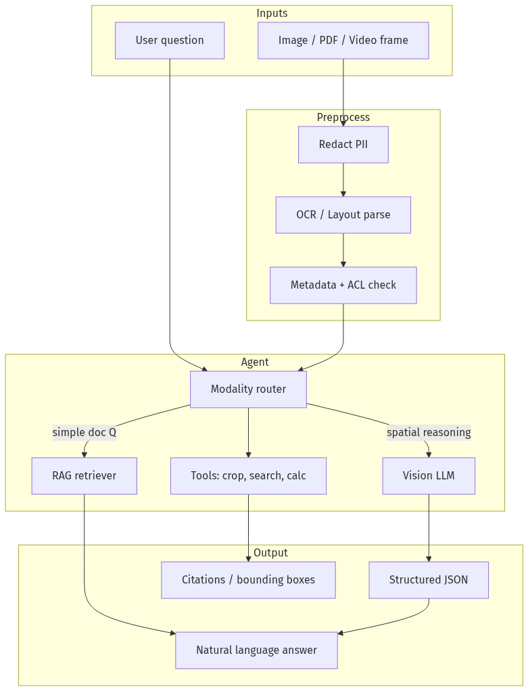
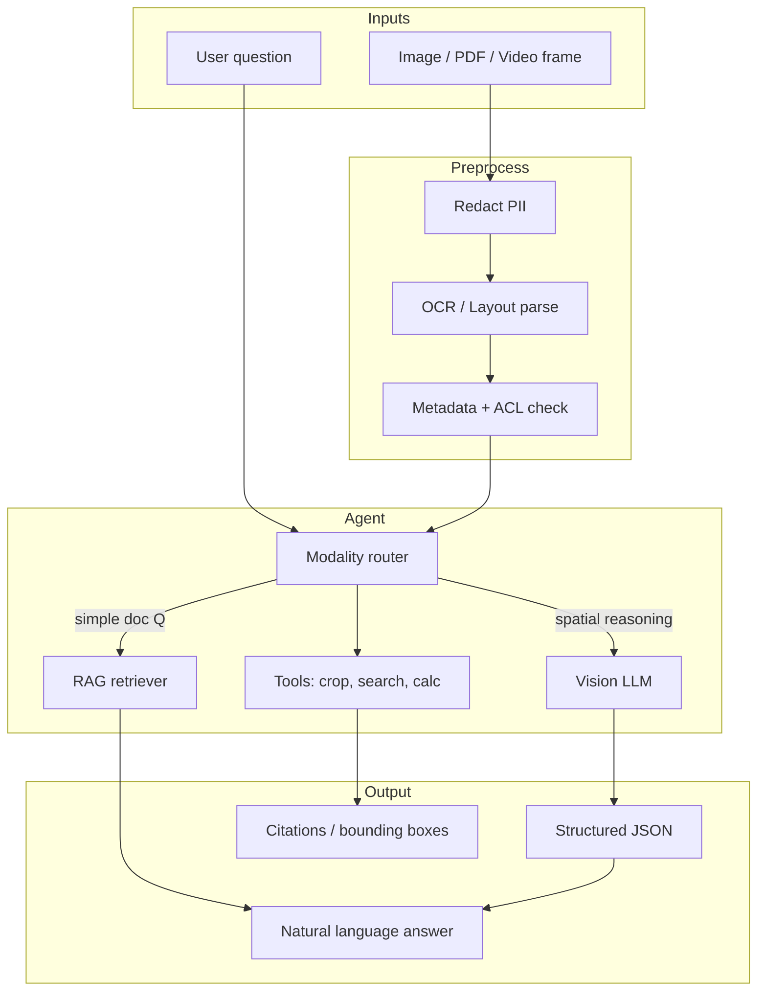
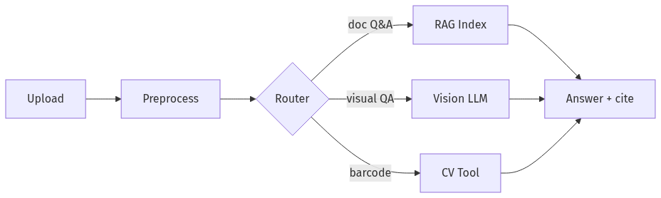
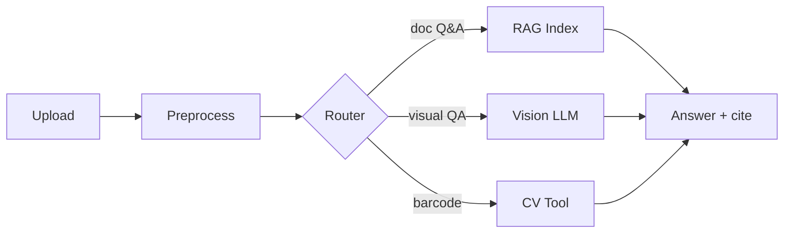
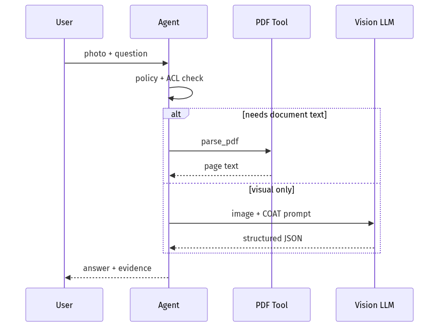
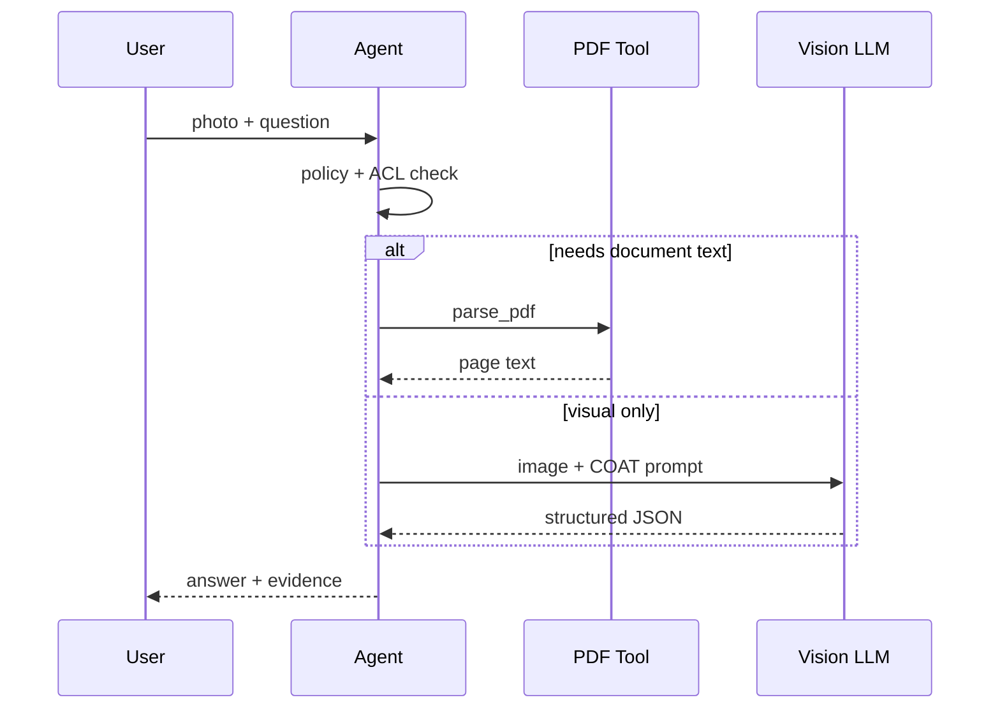

# 06-02 — Multimodal Agents (Vision + Text)

| Meta | Value |
|------|-------|
| **Estimated Time** | 5–6 hours (read 2h · lab 3h · modality decision memo 1h) |
| **Difficulty** | Intermediate (API usage) · Advanced (grounding + cost at scale) |
| **Prerequisites** | [03-02](../03-Agentic-Fundamentals/03-02-Tools-Memory-Control-Flow.md) · [04-01](../04-RAG/04-01-RAG-Architecture.md) · [02-02](../02-Prompt-Engineering/02-02-Structured-Outputs-Tool-Calling.md) |
| **Module** | 06 — Conversational & Multimodal |
| **Related** | [06-01](06-01-Voice-ASR-TTS-Pipelines.md) · [04-03](../04-RAG/04-03-Vector-DB-Hybrid-Search-Reranking.md) · [07-01](../07-Protocols-MCP-A2A/07-01-MCP-Model-Context-Protocol.md) · [08-01](../08-Evaluation-LLMOps/08-01-Evaluation-Lifecycle.md) · [Design-AI-Support](../../System Design/Design-AI-Customer-Support.md) |

---

## Learning Objectives

By the end of this chapter you will be able to:

1. Design **vision+text agents** that ground answers in pixels or documents—not free-form hallucination.
2. Write **multimodal prompts** with explicit observation vs inference separation.
3. Choose between **native multimodal LLM**, **OCR+RAG**, and **specialized vision tools**.
4. Implement **document/image tools** (PDF parse, crop, classify) in an agent loop.
5. Articulate **when NOT to use multimodal** (cheaper, safer alternatives).

---

## Why This Topic Matters

Multimodal is the default marketing story—“upload any file, ask anything.” In production, unconstrained vision costs more, fails silently on small text, and bypasses ACL if you feed raw images instead of indexed documents.

Principal interviews ask:

- When is GPT-4V-style input worse than OCR + RAG?
- How do you eval visual grounding?
- What is your PII story for ID document uploads?

---

## Business Impact

| Outcome | Multimodal decision |
|---------|---------------------|
| **Support ticket triage** | Screenshot → classify + route |
| **Insurance claims** | Damage photo → structured fields + human review |
| **Warehouse / field ops** | Barcode + label reading |
| **Knowledge work** | PDF tables → extract, not memorize |
| **Compliance risk** | ID/health images need redaction pipelines |

---

## Architecture Overview





---

## Core Concepts

### 1) Modalities and Representations

#### Definition

| Modality | Typical encoding | Agent access |
|----------|------------------|--------------|
| **Text** | Tokens | Direct |
| **Image** | Patches / pixels → vision encoder | Base64 URL, file API |
| **PDF** | Pages as images or text layer | Parse then route |
| **Video** | Frame sampling + audio track | Expensive; sparse frames |

#### Intuition

Multimodal models **bind** vision and language in one forward pass. Tool-based agents **sequentialize**: OCR first, reason second.

---

### 2) Native Multimodal LLM vs OCR + RAG

#### Decision matrix

| Signal | Prefer native VLM | Prefer OCR + RAG |
|--------|-------------------|------------------|
| Spatial layout (“circle the dent”) | ✓ | ✗ |
| Long policy PDF Q&A | △ | ✓ |
| Repeated corpus queries | ✗ | ✓ |
| Chart/table exact values | △ (verify) | ✓ with layout parser |
| Cost at high volume | ✗ | ✓ |
| Audit / citations | △ | ✓ |

#### Interview line

> “We use VLM for one-off visual reasoning; we index OCR text for the handbook.”

Cross-link: [04-01 RAG Architecture](../04-RAG/04-01-RAG-Architecture.md)

---

### 3) Multimodal Prompting

#### Structure (COAT pattern)

```text
Context: You analyze warehouse shelf images for compliance.
Observation: Describe only what is visible. If unreadable, say "unclear".
Analysis: Compare to policy {policy_snippet}.
Task: Return JSON matching ShelfAudit schema.
```

#### Rules

| Rule | Reason |
|------|--------|
| Separate **observe** vs **infer** | Reduces hallucinated objects |
| Ask for **confidence / unclear** | Enables abstain + HITL |
| Specify **output schema** | Downstream automation |
| Provide **scale reference** when needed | Size estimation |

Cross-link: [02-02 Structured Outputs](../02-Prompt-Engineering/02-02-Structured-Outputs-Tool-Calling.md)

---

### 4) Document and Image Tools

#### Tool catalog (typical)

| Tool | Input | Output |
|------|-------|--------|
| `parse_pdf` | PDF bytes | pages[], text, tables |
| `ocr_region` | image + bbox | text |
| `classify_image` | image | label, confidence |
| `detect_objects` | image | boxes[], labels |
| `barcode_scan` | image | SKU |
| `similarity_search` | embedding | doc chunks |

Expose tools via function calling or MCP ([07-01](../07-Protocols-MCP-A2A/07-01-MCP-Model-Context-Protocol.md)).

---

### 5) Grounding and Citations

#### Definition

**Grounding** ties claims to evidence: page number, bounding box, or retrieved chunk ID.

#### Patterns

- **Text RAG:** cite `chunk_id` + snippet.
- **Vision:** return `bbox` + cropped thumbnail in UI.
- **Tables:** cite cell coordinates from layout parser.

Eval: measure **groundedness** ([08-01](../08-Evaluation-LLMOps/08-01-Evaluation-Lifecycle.md)).

---

### 6) When NOT to Use Multimodal

#### Use something else when:

| Scenario | Better approach |
|----------|-----------------|
| Pure text FAQ | RAG or fine-tuned classifier |
| Structured form data | OCR + regex / layout model |
| High-volume duplicate docs | Index once; never re-send image |
| Pixel-perfect measurement | CV model + calibration, not VLM guess |
| Secret credentials in screenshot | Block upload; text-only policy |
| Video entire meeting | ASR transcript + text RAG ([06-01](06-01-Voice-ASR-TTS-Pipelines.md)) |

**Rule:** Multimodal is for **residual ambiguity** after cheaper extractors run.

---

## Implementation

### Multimodal agent with document tools (Python)

```python
"""Vision+text agent with PDF tool and structured audit output.

Run:
  python multimodal_agent.py --image shelf.jpg --question "Any expired labels?"

Env:
  OPENAI_API_KEY=...
"""

from __future__ import annotations

import argparse
import base64
import json
import mimetypes
from pathlib import Path
from typing import Any

from openai import OpenAI
from pydantic import BaseModel, Field

try:
    import pymupdf  # pip install pymupdf
except ImportError:
    pymupdf = None  # type: ignore


class ShelfAudit(BaseModel):
    expired_labels_visible: bool
    items: list[str] = Field(default_factory=list)
    unclear_regions: list[str] = Field(default_factory=list)
    confidence: float = Field(ge=0, le=1)
    recommendation: str


def parse_pdf(path: Path) -> dict[str, Any]:
    if pymupdf is None:
        raise RuntimeError("pip install pymupdf")
    doc = pymupdf.open(path)
    pages = []
    for i, page in enumerate(doc):
        pages.append({"page": i + 1, "text": page.get_text("text")})
    return {"pages": pages, "page_count": len(pages)}


def encode_image(path: Path) -> str:
    mime, _ = mimetypes.guess_type(path)
    data = base64.b64encode(path.read_bytes()).decode("utf-8")
    return f"data:{mime or 'image/jpeg'};base64,{data}"


TOOLS = [
    {
        "type": "function",
        "function": {
            "name": "parse_pdf",
            "description": "Extract text from a PDF by path",
            "parameters": {
                "type": "object",
                "properties": {"path": {"type": "string"}},
                "required": ["path"],
            },
        },
    }
]


def run_tool(name: str, args: dict[str, Any]) -> str:
    if name == "parse_pdf":
        return json.dumps(parse_pdf(Path(args["path"])))
    raise ValueError(f"unknown tool: {name}")


def analyze_image(client: OpenAI, image_path: Path, question: str) -> ShelfAudit:
    system = (
        "You audit retail shelf images. OBSERVE only visible facts. "
        "If text is unreadable, list it in unclear_regions. "
        "Return JSON matching ShelfAudit."
    )
    resp = client.chat.completions.create(
        model="gpt-4.1-mini",
        messages=[
            {"role": "system", "content": system},
            {
                "role": "user",
                "content": [
                    {"type": "text", "text": question},
                    {"type": "image_url", "image_url": {"url": encode_image(image_path)}},
                ],
            },
        ],
        response_format={"type": "json_object"},
        max_tokens=500,
    )
    raw = resp.choices[0].message.content or "{}"
    return ShelfAudit.model_validate_json(raw)


def agent_with_pdf(client: OpenAI, pdf_path: Path, question: str) -> str:
    messages: list[dict[str, Any]] = [
        {
            "role": "system",
            "content": "Answer using tools when PDF text is needed. Cite page numbers.",
        },
        {"role": "user", "content": f"PDF at {pdf_path}. Question: {question}"},
    ]
    for _ in range(4):
        resp = client.chat.completions.create(
            model="gpt-4.1-mini",
            messages=messages,
            tools=TOOLS,
        )
        msg = resp.choices[0].message
        if not msg.tool_calls:
            return msg.content or ""
        messages.append(msg.model_dump())
        for call in msg.tool_calls:
            result = run_tool(call.function.name, json.loads(call.function.arguments))
            messages.append(
                {"role": "tool", "tool_call_id": call.id, "content": result}
            )
    return "max tool iterations exceeded"


def main() -> None:
    parser = argparse.ArgumentParser()
    parser.add_argument("--image", type=Path)
    parser.add_argument("--pdf", type=Path)
    parser.add_argument("--question", required=True)
    args = parser.parse_args()
    client = OpenAI()

    if args.image:
        audit = analyze_image(client, args.image, args.question)
        print(audit.model_dump_json(indent=2))
    elif args.pdf:
        print(agent_with_pdf(client, args.pdf, args.question))
    else:
        raise SystemExit("Provide --image or --pdf")


if __name__ == "__main__":
    main()
```

---

## Production Considerations

| Concern | Practice |
|---------|----------|
| **File size limits** | Reject > N MB; downscale images |
| **ACL** | Check doc ownership before VLM call |
| **Caching** | Hash image → cache OCR / embeddings |
| **HITL** | Low confidence → human queue |
| **Retention** | TTL on uploaded media |

---

## Security

| Threat | Control |
|--------|---------|
| **Malicious image** | Strip EXIF; scan; sandbox parsers |
| **PII in ID uploads** | Auto-redact; block storage |
| **Prompt injection in PDF text** | Treat OCR as untrusted; separate system context |
| **Data exfil via image URL** | No arbitrary URL fetch |

Cross-link: [08-03 Guardrails](../08-Evaluation-LLMOps/08-03-Guardrails-Ship-Criteria.md)

---

## Performance

| Path | Latency driver |
|------|----------------|
| VLM single shot | Image tokens (resize!) |
| OCR + RAG | Index lookup dominates |
| PDF 100 pages | Never send all pages—chunk |

**Resize rule of thumb:** 768–1024 px longest edge for many VLMs.

---

## Cost

| Lever | Effect |
|-------|--------|
| Image downscale | ↓ vision tokens |
| OCR once, query many | ↓ repeat VLM $ |
| Route easy queries to text-only | ↓ multimodal calls |
| Batch offline extraction | ↓ online cost |

---

## Scalability

Separate **ingestion workers** (OCR, embed) from **online agent**. Store artifacts in object storage; pass references to the model.

---

## Failure Modes

| Failure | Mitigation |
|---------|------------|
| Hallucinated label text | Require OCR tool verification |
| Wrong table cell | Layout parser + validation |
| Rotation / blur | Preprocess; ask user retake |
| Color-only cue missed | Don't rely on VLM for safety-critical color |

---

## Observability

Log: `asset_id, mime, width, height, vision_tokens, tool_calls, schema_valid, confidence, grounded_cites[]`.

---

## Debugging

| Issue | Check |
|-------|-------|
| Wrong object count | Prompt observation section |
| PDF answer wrong page | Tool trace; chunk IDs |
| Intermittent JSON errors | response_format / schema |

---

## Common Mistakes

1. Sending 4K screenshots to the VLM every turn.
2. Skipping OCR for searchable PDFs.
3. No abstain path on blurry images.
4. Multimodal for tasks a $0 regex solves.
5. Storing uploads without encryption or TTL.

---

## Tradeoffs

| Choice | Upside | Downside |
|--------|--------|----------|
| Native VLM | Flexible spatial QA | Cost, opacity |
| OCR + RAG | Cheap repeat queries | Loses fine spatial detail |
| Specialized CV | Accurate counts | Narrow scope |
| Human review | Safe | Slow |

---

## Architecture Diagram





---

## Mermaid Diagram — Sequence





---

## Production Examples

| Use case | Pattern |
|----------|---------|
| Expense receipts | OCR + schema extraction + rules |
| Damage assessment | VLM describe + human adjuster |
| Diagram Q&A in docs | RAG on exported SVG text + optional VLM |
| Medical imaging | **Not** general VLM—regulated models + HITL |

---

## Real Companies Using It (Public Patterns)

| Org | Pattern |
|-----|---------|
| **Google Gemini** | Native multimodal API |
| **OpenAI** | GPT-4.1 vision + file inputs |
| **Anthropic Claude** | PDF/image document analysis |
| **Microsoft Azure DI** | Document Intelligence OCR/layout |

---

## Hands-on Labs

### Lab A — COAT prompt gallery (45 min)

Same image, three prompts (free-form vs COAT vs JSON schema). Score hallucinations.

### Lab B — OCR vs VLM (45 min)

10-page PDF: compare native file upload vs `parse_pdf` + RAG on exact table cell Q&A.

### Lab C — When NOT multimodal (30 min)

List 5 features in your product better served without vision.

---

## Coding Assignments

1. Add **bbox** field from a dummy detector tool.
2. Implement **modality router** (text-only vs vision) via cheap classifier.
3. Wire **DeepEval** groundedness metric on 20 samples.

---

## Mini Project

**Title:** Shelf Audit API  
**Done when:** FastAPI accepts image → returns `ShelfAudit` JSON + confidence gate.

---

## Production Project

**Title:** Support Screenshot Triage  
**Done when:** Classify + route + redact PII; eval set with precision/recall gates.

---

## Stretch Project

Hybrid agent: layout parser (tables) + VLM (spatial) + unified citation UI.

---

## Interview Questions

### Senior Engineer

1. How do you pass an image to an LLM safely?
2. OCR + RAG vs GPT vision for a 200-page manual?
3. What goes in a multimodal system prompt?

### Staff Engineer

1. Design upload pipeline with ACL + redaction + caching.
2. Eval plan for “correct table cell” tasks.
3. When would you fine-tune a layout model vs use VLM?

### Principal Engineer

1. Platform abstraction for modalities across providers.
2. Cost cap strategy for image-heavy social product.
3. Governance for biometric / ID document handling.

### Engineering Manager

1. Hire profile for multimodal vs backend RAG?
2. Pilot metrics before GA?
3. Communicate vision limitations to sales?

### Whiteboard

Draw router among text RAG, VLM, and human review for insurance claim photo.

### Follow-ups

- Video modality at scale?
- Multilingual OCR errors?
- Adversarial images?

---

## Revision Notes

- **Multimodal ≠ always better**—route by task and cost.
- **COAT**: Context, Observation, Analysis, Task.
- **Tools** for PDF/OCR; **VLM** for spatial reasoning.
- Ground answers with **citations or bboxes**.
- **Eval groundedness** before shipping.

---

## Summary

Multimodal agents combine **perception** and **reasoning**. Production systems preprocess, route, tool-call, and cite—rather than dumping pixels into the largest model available. Knowing **when not to use multimodal** is as important as knowing how.

---

## Further Reading

| Title | URL | Difficulty | Reading Time | Why Read | Important Sections |
|-------|-----|------------|--------------|----------|--------------------|
| OpenAI Vision Guide | https://platform.openai.com/docs/guides/images-vision | Intro | 30 min | Image input API | Detail vs low-res |
| Claude Vision | https://platform.claude.com/docs/en/build-with-claude/vision | Intro | 25 min | PDF/image patterns | Best practices |
| Gemini Multimodal | https://ai.google.dev/gemini-api/docs/vision | Intro | 25 min | Google stack | Image understanding |
| PyMuPDF | https://pymupdf.readthedocs.io/ | Intro | 20 min | PDF text extraction | Text extraction |
| LayoutParser | https://layout-parser.github.io/ | Intermediate | 40 min | Document layout | Detection models |
| DeepEval Multimodal | https://deepeval.com/docs/multimodal-metrics | Intermediate | 30 min | Eval patterns | Image QA metrics |

---

## Resume Bullet (after lab)

- Implemented a **multimodal support agent** routing PDFs through OCR tools and images through schema-constrained vision prompts, with confidence-gated human review and groundedness evals.
