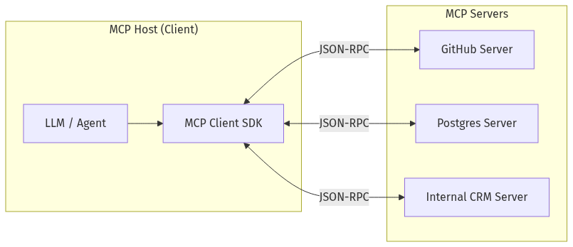
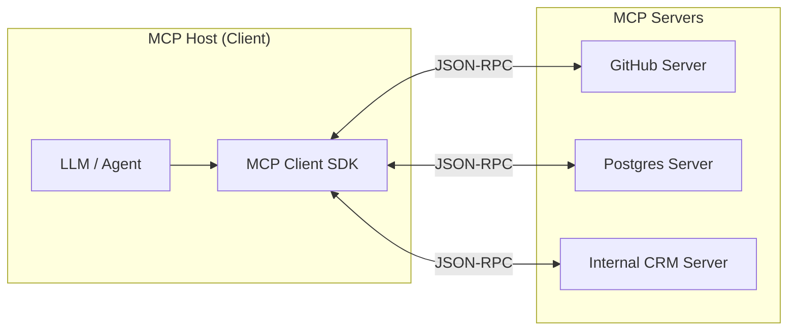
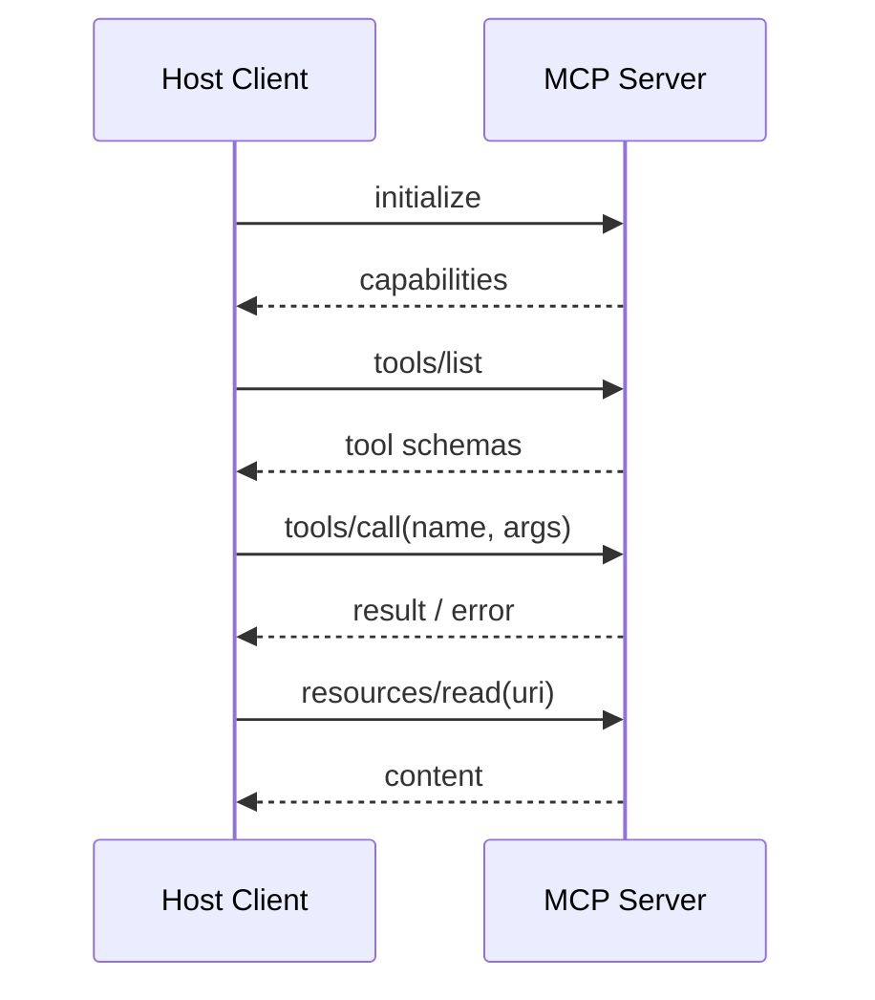
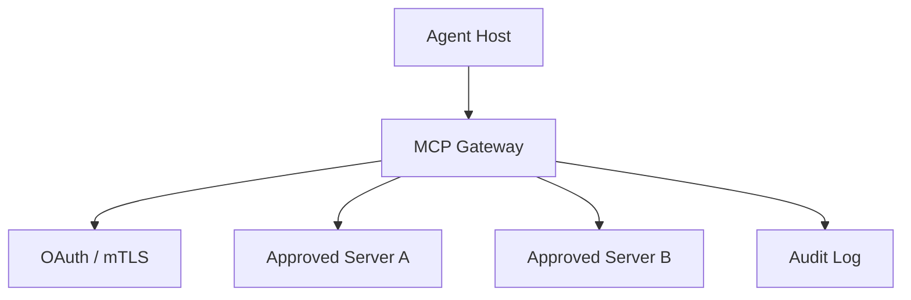
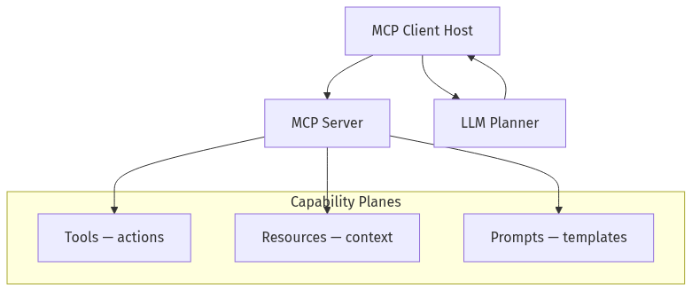
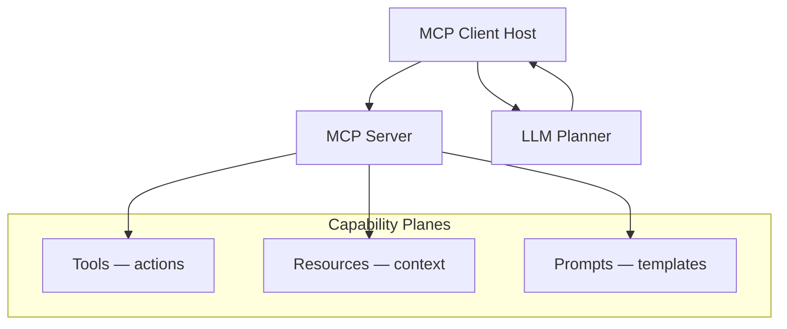
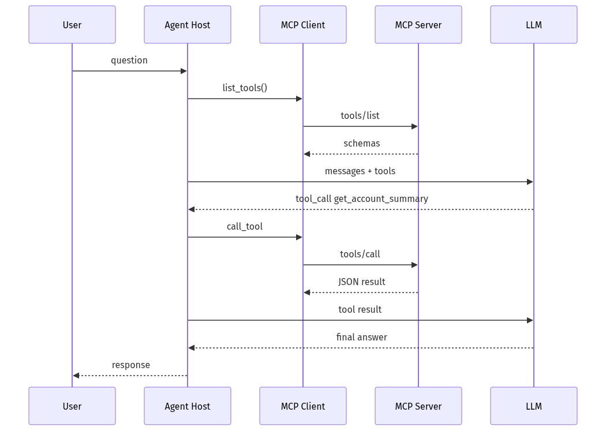
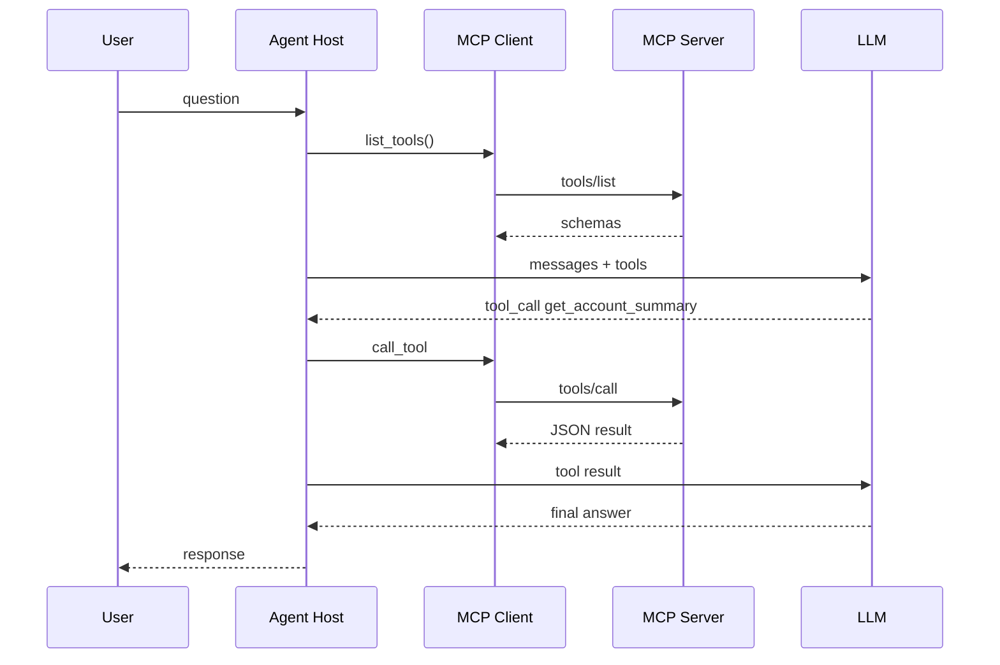

# 07-01 — Model Context Protocol (MCP)

| Meta | Value |
|------|-------|
| **Estimated Time** | 5–6 hours (read 2h · lab 3h · threat model 1h) |
| **Difficulty** | Intermediate (protocol) · Advanced (production hardening) |
| **Prerequisites** | [03-02](../03-Agentic-Fundamentals/03-02-Tools-Memory-Control-Flow.md) · [02-02](../02-Prompt-Engineering/02-02-Structured-Outputs-Tool-Calling.md) |
| **Module** | 07 — Protocols (MCP / A2A) |
| **Related** | [07-02](07-02-A2A-Agent-to-Agent.md) · [07-03](07-03-Negotiation-Async-Workflows.md) · [03-04](../03-Agentic-Fundamentals/03-04-LangGraph-Production-Agents.md) · [08-03](../08-Evaluation-LLMOps/08-03-Guardrails-Ship-Criteria.md) · [11-02](../11-Security-Safety/11-02-Prompt-Injection-Defense.md) |

---

## Learning Objectives

By the end of this chapter you will be able to:

1. Explain MCP as **USB-C for AI**: one client↔server contract for tools, resources, and prompts.
2. Distinguish **MCP servers, clients, tools, resources, and prompts**.
3. Build a **production-shaped MCP server** with FastMCP (Python).
4. Threat-model **MCP security**: auth, scope, tool injection, and data exfiltration.
5. Integrate MCP into agent runtimes (Cursor, Claude Desktop, custom hosts).

---

## Why This Topic Matters

Before MCP, every agent framework invented its own tool plugin shape—duplicate adapters for Slack, Postgres, GitHub. MCP standardizes **capability discovery** and **invocation**, so one server works across hosts.

Staff/Principal questions:

- When is MCP better than in-process Python functions?
- How do you govern third-party MCP servers in an enterprise?
- What is the blast radius of a compromised MCP tool?

---

## Business Impact

| Outcome | MCP angle |
|---------|-----------|
| **Integrator velocity** | Write once, plug into many hosts |
| **Vendor ecosystem** | Marketplace of MCP servers |
| **Governance** | Central allowlist + audit of tool calls |
| **Security debt** | Every server is a new trust boundary |

---

## Architecture Overview

### USB-C metaphor

| USB-C | MCP |
|-------|-----|
| Physical port standard | JSON-RPC over stdio/HTTP/SSE |
| Device exposes capabilities | **Server** exposes tools/resources/prompts |
| Host enumerates devices | **Client** discovers via `list_tools` |
| Cable doesn't imply trust | **Auth + scope** still required |





Official intro: [modelcontextprotocol.io](https://modelcontextprotocol.io/docs/getting-started/intro)

---

## Core Concepts

### 1) MCP Server

#### Definition

A process that implements the MCP spec and advertises **capabilities** to clients.

#### Transports

| Transport | Use case |
|-----------|----------|
| **stdio** | Local dev, Claude Desktop, Cursor |
| **SSE / HTTP** | Remote shared services |

#### When to run remote vs local

- **Local stdio:** developer tools, personal tokens, low latency.
- **Remote:** shared team services with OAuth gateway ([08-03](../08-Evaluation-LLMOps/08-03-Guardrails-Ship-Criteria.md)).

---

### 2) MCP Client

#### Definition

Embedded in the **host application** (IDE, agent runtime). Responsibilities:

1. Connect to servers
2. `list_tools` / `list_resources` / `list_prompts`
3. Map tool schemas → LLM function definitions
4. Execute `call_tool` and return results

Cross-link: [03-02 Tools & Memory](../03-Agentic-Fundamentals/03-02-Tools-Memory-Control-Flow.md)

---

### 3) Tools

#### Definition

**Model-invokable functions** with JSON Schema inputs. Example: `search_issues`, `run_query`.

#### vs in-process functions

| MCP tool | In-process |
|----------|------------|
| Separate OS process | Same Python interpreter |
| Network/explicit IPC | Direct import |
| Versioned server contract | Refactor coupling |

---

### 4) Resources

#### Definition

**Readable context** the host can fetch—files, DB rows, API docs—not necessarily invoked as a function.

Examples: `file://policy/handbook.md`, `postgres://schema/users`.

**Pattern:** Resources ground the model; tools mutate or query.

---

### 5) Prompts

#### Definition

**Reusable prompt templates** registered by the server (arguments → filled prompt). Helps standardize workflows: “summarize_repo”, “triage_issue”.

---

### 6) Lifecycle (Discovery → Call)



---

## Implementation

### Production-shaped MCP server (FastMCP)

Uses the official Python SDK pattern via **FastMCP** (`mcp` package).

```bash
pip install "mcp[cli]" httpx pydantic python-dotenv
```

```python
"""BankCo read-only account MCP server — FastMCP.

Run (stdio — for Cursor / Claude Desktop):
  python bankco_mcp_server.py

Or:
  fastmcp run bankco_mcp_server.py:mcp

Env:
  BANKCO_API_BASE=https://api.internal.example
  BANKCO_TOKEN=...
"""

from __future__ import annotations

import os
from typing import Any

import httpx
from mcp.server.fastmcp import FastMCP
from pydantic import BaseModel, Field

mcp = FastMCP(
    "bankco-readonly",
    instructions="Read-only BankCo customer tools. Never mutate balances.",
)


class AccountSummary(BaseModel):
    customer_id: str
    balance_usd: float = Field(ge=0)
    tier: str
    open_tickets: int = Field(ge=0)


def _client() -> httpx.Client:
    token = os.environ.get("BANKCO_TOKEN", "")
    base = os.environ.get("BANKCO_API_BASE", "http://localhost:8080")
    return httpx.Client(
        base_url=base,
        headers={"Authorization": f"Bearer {token}"},
        timeout=10.0,
    )


@mcp.tool()
def get_account_summary(customer_id: str) -> dict[str, Any]:
    """Fetch read-only account summary for a customer_id."""
    if not customer_id.strip():
        raise ValueError("customer_id required")
    # Demo fallback when API unavailable
    if not os.getenv("BANKCO_TOKEN"):
        summary = AccountSummary(
            customer_id=customer_id,
            balance_usd=12450.32,
            tier="gold",
            open_tickets=1,
        )
        return summary.model_dump()
    with _client() as c:
        r = c.get(f"/v1/customers/{customer_id}/summary")
        r.raise_for_status()
        return AccountSummary.model_validate(r.json()).model_dump()


@mcp.resource("bankco://policy/retention")
def retention_policy() -> str:
    """Retention offer policy excerpt for grounding."""
    return (
        "Retention policy v3.2: fee_waiver max once per 12 months; "
        "APR reduction requires manager approval; never promise legal outcomes."
    )


@mcp.prompt()
def triage_retention(customer_id: str) -> str:
    """Template for retention triage workflow."""
    return (
        f"Triage retention risk for customer {customer_id}. "
        "Use get_account_summary. Cite policy resource. Recommend HITL if tier=platinum."
    )


if __name__ == "__main__":
    mcp.run()
```

#### Host-side consumption (conceptual)

Hosts call `list_tools()`, inject schemas into the LLM, and route `call_tool` results back into the conversation. LangChain/LangGraph and Cursor embed MCP clients natively.

Python SDK: [github.com/modelcontextprotocol/python-sdk](https://github.com/modelcontextprotocol/python-sdk)

---

## Production Considerations

| Concern | Practice |
|---------|----------|
| **Versioning** | Semver MCP servers; pin in host config |
| **Timeouts** | Tool calls must not block agent forever |
| **Idempotency** | Document which tools are safe to retry |
| **Observability** | Log `tool_name, args_hash, latency, status` |
| **Allowlist** | Enterprise registry of approved servers |

---

## Security

MCP does **not** solve trust—it **surfaces** it.

| Threat | Control |
|--------|---------|
| **Malicious third-party server** | Allowlist; code review; sandbox |
| **Over-privileged tools** | Read-only roles; separate write servers |
| **Tool description injection** | Sanitize descriptions shown to model |
| **Data exfiltration** | Egress policies; no arbitrary URLs |
| **Token theft** | Short-lived OAuth; never log secrets |
| **Prompt injection via resources** | Treat resource text as untrusted |

Cross-link: [11-02 Prompt Injection Defense](../11-Security-Safety/11-02-Prompt-Injection-Defense.md)

#### Enterprise pattern



---

## Performance

| Factor | Guidance |
|--------|----------|
| stdio IPC | Low ms overhead |
| Remote HTTP | Pool connections; regional servers |
| Cold start | Keep warm sidecars for hot tools |

---

## Cost

MCP itself is free protocol overhead. Cost is **tool side effects** (API calls, DB, LLM nested calls). Rate-limit per session.

---

## Scalability

Scale **stateless MCP servers** horizontally behind a gateway. Stateful tools (browsers) need session affinity.

---

## Failure Modes

| Failure | Mitigation |
|---------|------------|
| Server down | Circuit breaker; degrade gracefully |
| Schema drift | Contract tests on `list_tools` |
| Hung tool | Client-side timeout + cancel |
| Duplicate adapters | Prefer MCP over one-off plugins |

---

## Observability

Emit OpenTelemetry spans: `mcp.server`, `mcp.tool.call`, attributes `tool.name`, `server.id`.

Cross-link: [08-02 Observability](../08-Evaluation-LLMOps/08-02-Observability-LangSmith-OTel.md)

---

## Debugging

| Symptom | Check |
|---------|-------|
| Tool not visible | `tools/list` response; host config |
| Invalid args | JSON Schema vs model output |
| Empty resource | URI registration; permissions |

Use MCP Inspector (official tooling) for interactive `list/call`.

---

## Common Mistakes

1. Giving write tools on the same server as browsing untrusted web.
2. No timeouts on `call_tool`.
3. Logging full tool args with PII.
4. Trusting tool **descriptions** as security policy.
5. Reimplementing MCP with ad-hoc REST instead of using SDK.

---

## Tradeoffs

| Choice | Upside | Downside |
|--------|--------|----------|
| MCP vs in-process | Interop, isolation | IPC latency, ops |
| stdio vs remote | Simple dev | Remote needs auth story |
| Many small servers | Least privilege | Config sprawl |
| Monolith MCP server | Easy deploy | Blast radius |

---

## Architecture Diagram





---

## Mermaid Diagram — Sequence (Agent Turn)





---

## Production Examples

| Host | MCP usage |
|------|-----------|
| **Cursor IDE** | Filesystem, git, custom servers |
| **Claude Desktop** | User-configured stdio servers |
| **Enterprise agent** | Gateway + internal CRM MCP |

---

## Real Companies Using It (Public Patterns)

| Org | Role |
|-----|------|
| **Anthropic** | MCP origin; Claude integrations |
| **OpenAI** | Agent SDK MCP support (ecosystem) |
| **Block, Apollo** | Early adopters cited in MCP launch materials |
| **Cursor** | IDE MCP host |

---

## Hands-on Labs

### Lab A — Hello MCP (45 min)

Run FastMCP server; connect via Claude Desktop or MCP Inspector; call `get_account_summary`.

### Lab B — Resource grounding (30 min)

Ask agent to cite `bankco://policy/retention` when recommending offers.

### Lab C — Threat sketch (45 min)

Red-team: malicious tool description tries to exfiltrate env vars—document controls.

---

## Coding Assignments

1. Add **`search_tickets` tool** with pagination schema.
2. Wrap server with **HTTP transport** behind API key.
3. Emit **OTel spans** on each tool call.

---

## Mini Project

**Title:** Team MCP Starter  
**Done when:** One read tool, one resource, one prompt; README with Cursor config JSON.

---

## Production Project

**Title:** MCP Gateway v1  
**Done when:** Allowlist, OAuth, audit log, per-tool rate limits.

---

## Stretch Project

Compare MCP tool calling vs LangChain `@tool` for same CRM—interop vs velocity report.

---

## Interview Questions

### Senior Engineer

1. What problem does MCP solve?
2. Difference between MCP **tool** and **resource**?
3. How does a host discover server capabilities?

### Staff Engineer

1. Design enterprise MCP governance.
2. stdio vs SSE—when which?
3. How do you test MCP servers in CI?

### Principal Engineer

1. MCP vs gRPC plugins for internal platform.
2. Multi-tenant MCP gateway architecture.
3. Incident response: compromised community server.

### Engineering Manager

1. Build vs buy MCP servers?
2. Security review checklist before allowlisting?
3. Developer experience metrics?

### Whiteboard

Draw USB-C metaphor: host, server, tool call, auth gateway.

### Follow-ups

- MCP vs OpenAPI tools?
- Version skew handling?
- Billing per tool call?

---

## Revision Notes

- MCP = **standard wire** for tools/resources/prompts—not automatic security.
- **Tools** act; **resources** ground; **prompts** template.
- Run untrusted servers **outside** the agent privilege boundary.
- Log and rate-limit every **`call_tool`**.
- Official SDK: **modelcontextprotocol/python-sdk**.

---

## Summary

MCP is the **interop layer** that lets agents use capabilities across hosts without N custom integrations—like USB-C for AI apps. Production success requires **governance, auth, and observability** on top of the protocol.

---

## Further Reading

| Title | URL | Difficulty | Reading Time | Why Read | Important Sections |
|-------|-----|------------|--------------|----------|--------------------|
| MCP Introduction | https://modelcontextprotocol.io/docs/getting-started/intro | Intro | 20 min | Canonical spec mindset | Concepts; architecture |
| MCP Python SDK | https://github.com/modelcontextprotocol/python-sdk | Intermediate | 45 min | FastMCP implementation | Server examples |
| MCP Specification | https://modelcontextprotocol.io/specification | Advanced | 90 min | Wire protocol details | Tools; resources; prompts |
| Anthropic MCP Announcement | https://www.anthropic.com/news/model-context-protocol | Intro | 15 min | Why USB-C metaphor | Problem framing |
| Cursor MCP Docs | https://docs.cursor.com/context/mcp | Intro | 20 min | IDE integration | Config JSON |

---

## Resume Bullet (after lab)

- Shipped a **FastMCP server** exposing read-only CRM tools, policy resources, and triage prompts, integrated with agent hosts under OAuth gateway and structured audit logging.
