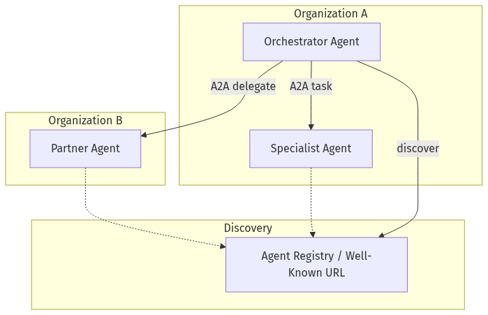
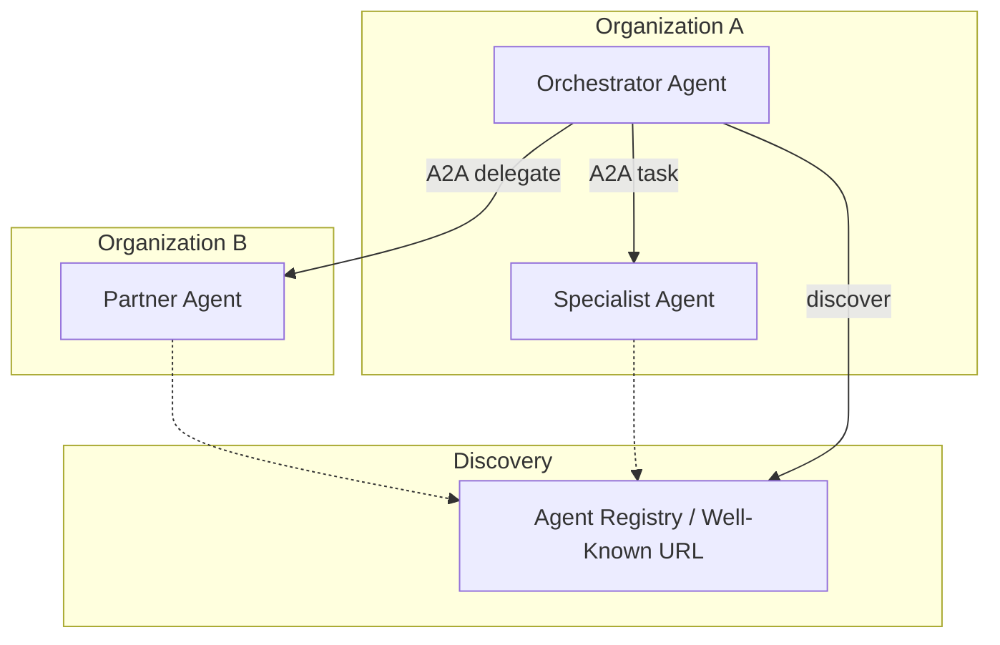
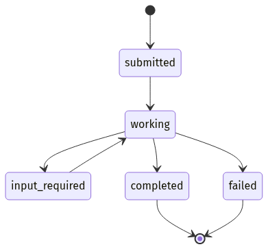
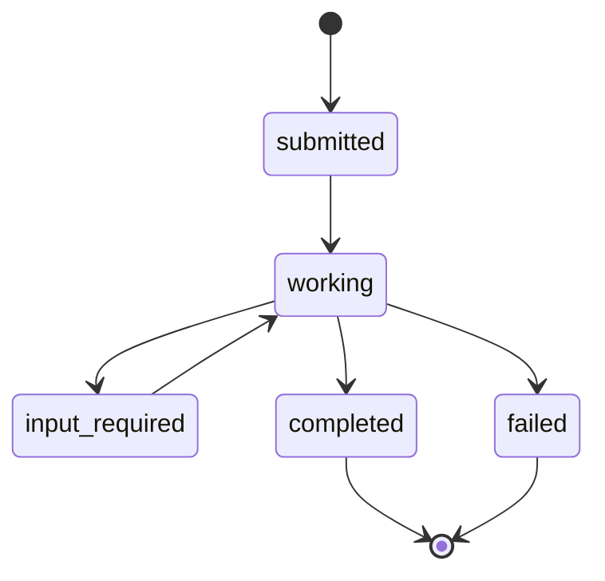
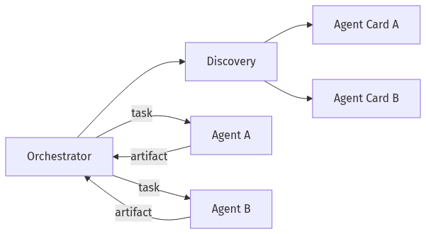
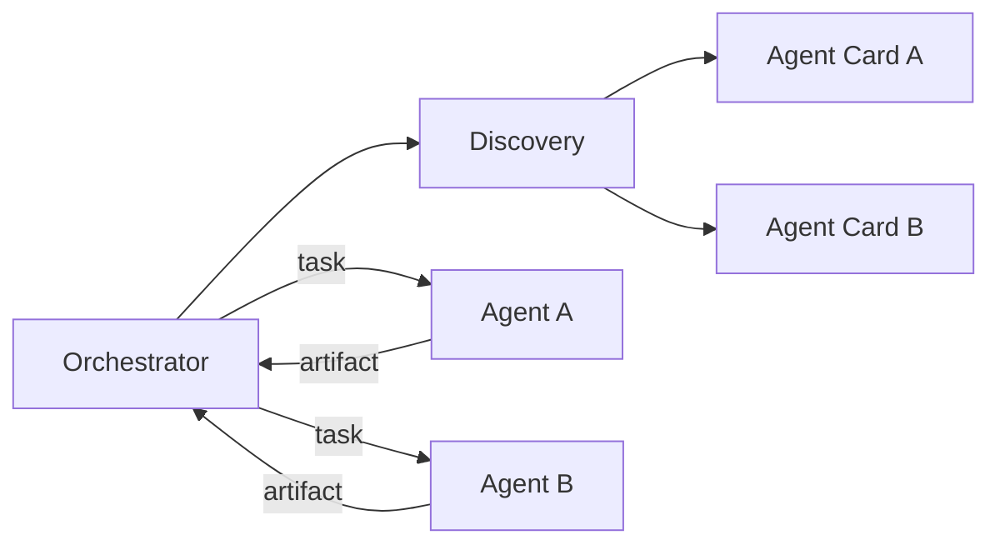
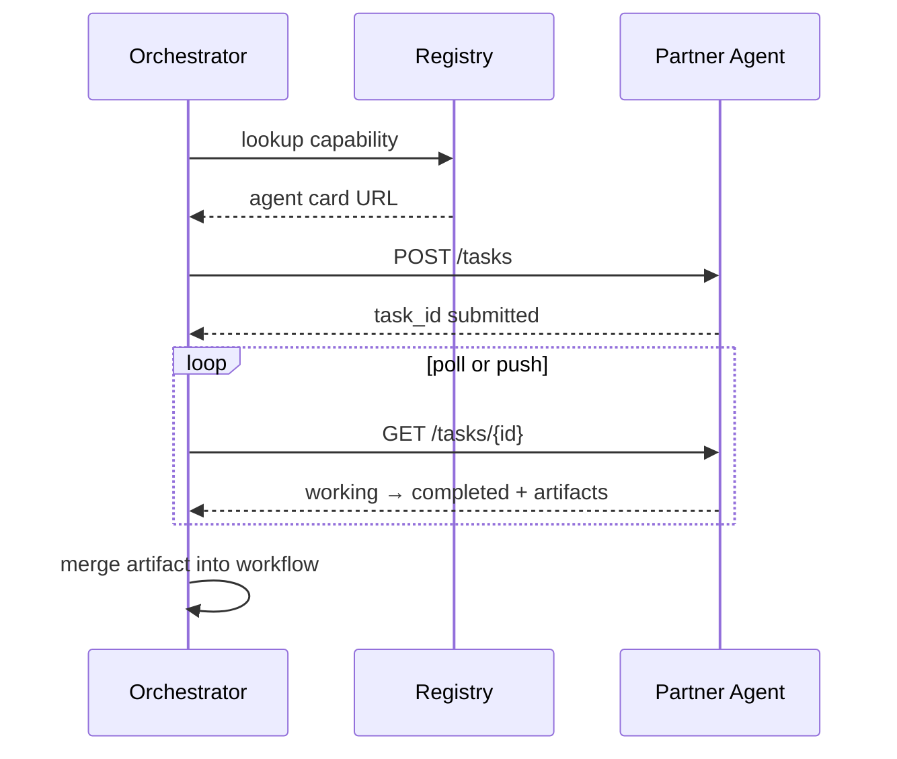

# 07-02 — Agent-to-Agent (A2A) Protocol

| Meta | Value |
|------|-------|
| **Estimated Time** | 5–6 hours (read 2h · lab 3h · discovery design 1h) |
| **Difficulty** | Intermediate (protocol concepts) · Advanced (multi-org trust) |
| **Prerequisites** | [07-01](07-01-MCP-Model-Context-Protocol.md) · [05-01](../05-Multi-Agent/05-01-Multi-Agent-Orchestration.md) · [03-03](../03-Agentic-Fundamentals/03-03-Agentic-Design-Patterns.md) |
| **Module** | 07 — Protocols (MCP / A2A) |
| **Related** | [07-03](07-03-Negotiation-Async-Workflows.md) · [05-02](../05-Multi-Agent/05-02-Planner-Executor-Critic.md) · [08-02](../08-Evaluation-LLMOps/08-02-Observability-LangSmith-OTel.md) · [Design-MA-Engine](../../System Design/Design-Multi-Agent-Workflow-Engine.md) |

---

## Learning Objectives

By the end of this chapter you will be able to:

1. Explain **A2A (Agent-to-Agent)** as an interoperability protocol for **remote agents**, distinct from MCP’s tool/resource plane.
2. Describe **agent cards**, **discovery**, and **task delegation** in the A2A model.
3. Contrast **Google-led A2A** ecosystem goals with in-framework multi-agent (CrewAI, LangGraph).
4. Design **discovery and authentication** for federated agents across teams or vendors.
5. Identify when A2A helps vs when a single orchestrator suffices.

---

## Why This Topic Matters

Multi-agent tutorials usually assume one process, one memory, one trust domain. Real enterprises have **separate teams’ agents**—procurement, legal, IT—each with its own data boundary. A2A standardizes how agents **advertise capabilities** and **exchange tasks** without sharing internal prompts or tools.

Principal interview angle:

> “MCP connects an agent to **tools**; A2A connects an **agent to another agent** across organizational boundaries.”

Official docs: [a2a-protocol.org](https://a2a-protocol.org/latest/) · Reference: [github.com/a2aproject/A2A](https://github.com/a2aproject/A2A)

---

## Business Impact

| Outcome | A2A relevance |
|---------|---------------|
| **Vendor composability** | Hire agent from partner without custom API |
| **Internal federation** | Domain agents stay owned by domain teams |
| **Auditability** | Task envelopes vs ad-hoc Slack handoffs |
| **Risk** | New trust boundary—every external agent is a supplier |

---

## Architecture Overview





### MCP vs A2A (quick reference)

| Dimension | MCP | A2A |
|-----------|-----|-----|
| **Connects** | Host ↔ tool server | Agent ↔ agent |
| **Unit of work** | Tool call | Task / message thread |
| **Visibility** | Functions + schemas | Agent card + skills |
| **Typical scope** | Same machine or gateway | Cross-service / cross-org |
| **Google / Anthropic** | Anthropic-led MCP | Google-led A2A (Linux Foundation) |

Use **both**: MCP for tools inside an agent; A2A to delegate whole subtasks to remote agents.

---

## Core Concepts

### 1) Agent Card

#### Definition

Machine-readable metadata describing a remote agent—like a **service manifest**:

```json
{
  "name": "legal-review-agent",
  "description": "Reviews contracts for standard risk clauses",
  "url": "https://agents.example.com/legal/a2a",
  "capabilities": ["contract_review", "clause_extraction"],
  "authentication": ["oauth2"],
  "version": "1.2.0"
}
```

#### Intuition

Clients **discover** skills before delegation—no hard-coded partner URLs in prompts.

---

### 2) Discovery

#### Patterns

| Pattern | Mechanism |
|---------|-----------|
| **Well-known URI** | `/.well-known/agent.json` |
| **Central registry** | Internal catalog with ACL |
| **Marketplace** | Signed agent cards (future ecosystem) |

#### Production rule

Discovery answers **what exists**; auth answers **who may invoke**.

Cross-link: [07-03 Negotiation & Async](07-03-Negotiation-Async-Workflows.md)

---

### 3) Tasks and Messages

#### Definition

A2A models interaction as **tasks** (units of work) exchanged via **messages** (structured payloads + optional artifacts).

#### Lifecycle





#### vs chat

Chat is open-ended; A2A tasks carry **status**, **artifacts**, and **terminal states**—better for workflow engines.

---

### 4) Negotiation (Preview)

Before expensive work, agents may exchange **capability checks**, **SLA estimates**, or **pricing hints**. Full patterns in [07-03](07-03-Negotiation-Async-Workflows.md).

---

### 5) Google A2A and Ecosystem

#### Public context

Google announced **A2A** (Agent2Agent) as an open protocol, contributed toward **Linux Foundation** governance, with partners (Salesforce, SAP, etc.) cited in launch materials. Goal: **interoperable agents** across platforms—complementary to MCP (tools) not competitive.

#### What to verify in implementations

- Transport (often HTTP + JSON-RPC / REST patterns per spec version)
- Agent card schema version
- Auth profiles (OAuth 2.0, mTLS)
- Artifact types (files, structured JSON)

Always pin spec version in production—A2A is evolving.

---

### 6) When NOT to Use A2A

| Scenario | Prefer |
|----------|--------|
| Single-team LangGraph | In-process subgraphs |
| Simple CRUD | Direct API |
| Sub-100 ms tool lookup | MCP tool, not remote agent |
| Same DB, same VPC | Shared orchestrator |

A2A shines at **organizational seams**, not inside a monolith.

---

## Implementation

### Minimal A2A-style agent server (Python / FastAPI)

Illustrative pattern aligned with A2A task/message concepts (check current spec for exact endpoint names).

```python
"""Illustrative A2A-style agent endpoint — task submit + status.

Run:
  uvicorn a2a_agent:app --reload --port 8090

Discovery:
  GET /.well-known/agent.json
"""

from __future__ import annotations

import uuid
from datetime import datetime, timezone
from enum import Enum
from typing import Any

from fastapi import FastAPI, HTTPException
from pydantic import BaseModel, Field

AGENT_CARD = {
    "name": "bankco-retention-agent",
    "description": "Analyzes churn risk and proposes retention offers",
    "url": "http://localhost:8090/a2a",
    "capabilities": ["retention_analysis", "offer_recommendation"],
    "authentication": ["bearer"],
    "version": "0.1.0",
}


class TaskState(str, Enum):
    SUBMITTED = "submitted"
    WORKING = "working"
    INPUT_REQUIRED = "input_required"
    COMPLETED = "completed"
    FAILED = "failed"


class Message(BaseModel):
    role: str
    parts: list[dict[str, Any]]


class TaskSubmit(BaseModel):
    messages: list[Message]
    metadata: dict[str, Any] = Field(default_factory=dict)


class TaskRecord(BaseModel):
    task_id: str
    state: TaskState
    messages: list[Message]
    artifacts: list[dict[str, Any]] = Field(default_factory=list)
    created_at: datetime
    updated_at: datetime


app = FastAPI(title="A2A Retention Agent")
TASKS: dict[str, TaskRecord] = {}


@app.get("/.well-known/agent.json")
def agent_card() -> dict[str, Any]:
    return AGENT_CARD


def analyze_retention(payload: dict[str, Any]) -> dict[str, Any]:
    """Deterministic stub — replace with real agent + MCP tools."""
    risk = "high" if payload.get("complaints", 0) >= 2 else "low"
    offer = "fee_waiver" if risk == "high" else "none"
    return {"risk": risk, "offer": offer, "requires_hitl": risk == "high"}


@app.post("/a2a/tasks")
def submit_task(body: TaskSubmit) -> TaskRecord:
    task_id = str(uuid.uuid4())
    now = datetime.now(timezone.utc)
    # Extract structured input from last user message
    user_parts = body.messages[-1].parts if body.messages else []
    payload = user_parts[0] if user_parts else {}
    try:
        result = analyze_retention(payload if isinstance(payload, dict) else {})
        state = TaskState.COMPLETED
        artifacts = [{"type": "application/json", "data": result}]
    except Exception as exc:
        state = TaskState.FAILED
        artifacts = [{"type": "error", "data": {"message": str(exc)}}]

    rec = TaskRecord(
        task_id=task_id,
        state=state,
        messages=body.messages,
        artifacts=artifacts,
        created_at=now,
        updated_at=now,
    )
    TASKS[task_id] = rec
    return rec


@app.get("/a2a/tasks/{task_id}")
def get_task(task_id: str) -> TaskRecord:
    if task_id not in TASKS:
        raise HTTPException(status_code=404, detail="unknown task")
    return TASKS[task_id]
```

#### Client orchestrator sketch

```python
import httpx

def discover(base: str) -> dict:
    return httpx.get(f"{base}/.well-known/agent.json", timeout=5).json()

def delegate(card_url: str, customer: dict) -> dict:
    base = card_url.rsplit("/a2a", 1)[0] if "/a2a" in card_url else card_url
    task = httpx.post(
        f"{base}/a2a/tasks",
        json={"messages": [{"role": "user", "parts": [customer]}]},
        timeout=30,
    ).json()
    return task["artifacts"][0]["data"]
```

---

## Production Considerations

| Concern | Practice |
|---------|----------|
| **Spec versioning** | Pin A2A schema; contract tests |
| **Idempotency** | `client_task_id` dedupe |
| **Timeouts** | Remote agents are slow dependencies |
| **Partial results** | Stream artifacts if spec supports |
| **Fallback** | Human queue when partner agent down |

---

## Security

| Threat | Control |
|--------|---------|
| **Spoofed agent card** | Sign cards; TLS + registry |
| **Over-delegation** | Policy engine approves partner |
| **Data leakage in tasks** | Minimize PII in payloads |
| **Replay** | Nonces, short-lived tokens |

Cross-link: [11-01 OWASP LLM](../11-Security-Safety/11-01-OWASP-LLM-Top-10.md)

---

## Performance

Remote A2A adds **network RTT** on top of LLM latency. Cache agent cards; pool HTTP connections; prefer async task polling over blocking.

---

## Cost

Chargeback model: **$/successful delegated task** per partner. Monitor token spend **inside** partner black box via SLAs not invoices alone.

---

## Scalability

Registry service + horizontal agent replicas. Task state in durable store (Postgres, Redis streams).

---

## Failure Modes

| Failure | Mitigation |
|---------|------------|
| Partner schema drift | Version negotiation |
| Stuck `working` | Watchdog + cancel |
| Duplicate delegation | Idempotency keys |
| Ambiguous completion | Terminal states only |

---

## Observability

Trace: `trace_id, delegator, partner_agent, task_id, state_transitions[], latency_ms, artifact_types`.

Cross-link: [08-02 Observability](../08-Evaluation-LLMOps/08-02-Observability-LangSmith-OTel.md)

---

## Debugging

| Symptom | Check |
|---------|-------|
| 404 on discover | Well-known path; ingress rules |
| Empty artifacts | Partner logs; task payload |
| Auth failures | Token scope vs agent card |

---

## Common Mistakes

1. Using A2A for in-process function calls.
2. No agent card versioning.
3. Treating partner output as trusted without validation.
4. Blocking UI on long `working` tasks—use async polling.
5. Confusing MCP server with A2A agent (different contracts).

---

## Tradeoffs

| Choice | Upside | Downside |
|--------|--------|----------|
| A2A federation | Clear ownership boundaries | Latency, trust |
| Monolith multi-agent | Fast iteration | Coupling |
| Central registry | Governance | Single point of failure |
| Ad-hoc webhooks | Quick | Non-standard, brittle |

---

## Architecture Diagram





---

## Mermaid Diagram — Sequence



---

## Production Examples

| Pattern | Description |
|---------|-------------|
| **Procurement bot delegates legal** | A2A to legal-review agent |
| **Travel planner + booking partner** | External vendor agent card |
| **Internal IT + HR** | Separate VPC agents, shared registry |

---

## Real Companies Using It (Public Patterns)

| Org | Role |
|-----|------|
| **Google** | A2A protocol originator |
| **Salesforce / SAP** | Partner ecosystem (launch citations) |
| **Linux Foundation** | Open governance direction |
| **Anthropic MCP** | Complementary tool layer |

---

## Hands-on Labs

### Lab A — Agent card (30 min)

Publish `/.well-known/agent.json` for a stub agent; validate with JSON Schema.

### Lab B — Delegate task (45 min)

Orchestrator discovers card, submits retention task, polls to completion.

### Lab C — MCP + A2A (45 min)

Local agent uses MCP for CRM read; delegates legal clause check via A2A.

---

## Coding Assignments

1. Add **`input_required`** state with clarifying question flow.
2. Persist tasks to **SQLite** for replay.
3. Implement **registry** with search by capability tag.

---

## Mini Project

**Title:** Two-Agent Federation Demo  
**Done when:** Orchestrator + specialist on different ports; discovery works.

---

## Production Project

**Title:** Partner Agent Gateway  
**Done when:** OAuth, signed agent cards, audit log, timeout policies.

---

## Stretch Project

Simulate **negotiation** (07-03) before delegating high-cost partner tasks.

---

## Interview Questions

### Senior Engineer

1. MCP vs A2A—in one sentence each?
2. What is an agent card?
3. Why task states vs free-form chat?

### Staff Engineer

1. Design discovery for 50 internal agents.
2. Handle partner agent timeout mid-workflow.
3. Validate untrusted artifacts from partner.

### Principal Engineer

1. Federation architecture for multi-cloud agents.
2. When to standardize on A2A vs internal event bus?
3. Governance model for third-party agents.

### Engineering Manager

1. Partner SLA and liability for agent errors?
2. Team boundaries: who owns orchestrator?
3. Pilot metrics before ecosystem commitment?

### Whiteboard

Draw orchestrator delegating to two remote agents with registry.

### Follow-ups

- Billing for delegated tasks?
- Spec evolution strategy?
- Relationship to FIPA / older agent protocols?

---

## Revision Notes

- **A2A** = agent ↔ agent; **MCP** = agent ↔ tools.
- **Agent card** enables discovery.
- Tasks have **lifecycle states** and **artifacts**.
- Google **A2A** is ecosystem play—pin spec versions.
- Don’t A2A what belongs **in-process**.

---

## Summary

A2A protocols turn agents into **composable services** with discoverable skills and structured task exchange—essential for cross-team and cross-vendor automation. Pair A2A delegation with MCP tool access inside each agent for a complete production pattern.

---

## Further Reading

| Title | URL | Difficulty | Reading Time | Why Read | Important Sections |
|-------|-----|------------|--------------|----------|--------------------|
| A2A Protocol Docs | https://a2a-protocol.org/latest/ | Intro | 40 min | Canonical concepts | Agent card; tasks |
| A2A GitHub | https://github.com/a2aproject/A2A | Intermediate | 45 min | Reference samples | Spec sources |
| Google A2A Announcement | https://developers.googleblog.com/en/a2a-a-new-era-of-agent-interoperability/ | Intro | 15 min | Ecosystem context | MCP complement |
| MCP Intro (contrast) | https://modelcontextprotocol.io/docs/getting-started/intro | Intro | 15 min | Tool vs agent boundary | Architecture |
| LangGraph Multi-Agent | https://langchain-ai.github.io/langgraph/concepts/multi_agent/ | Intermediate | 30 min | In-process alternative | Supervisor patterns |

---

## Resume Bullet (after lab)

- Prototyped **A2A-style agent federation** with well-known agent cards, async task lifecycle, and orchestrator delegation—complementing internal **MCP** tool servers for CRM grounding.
