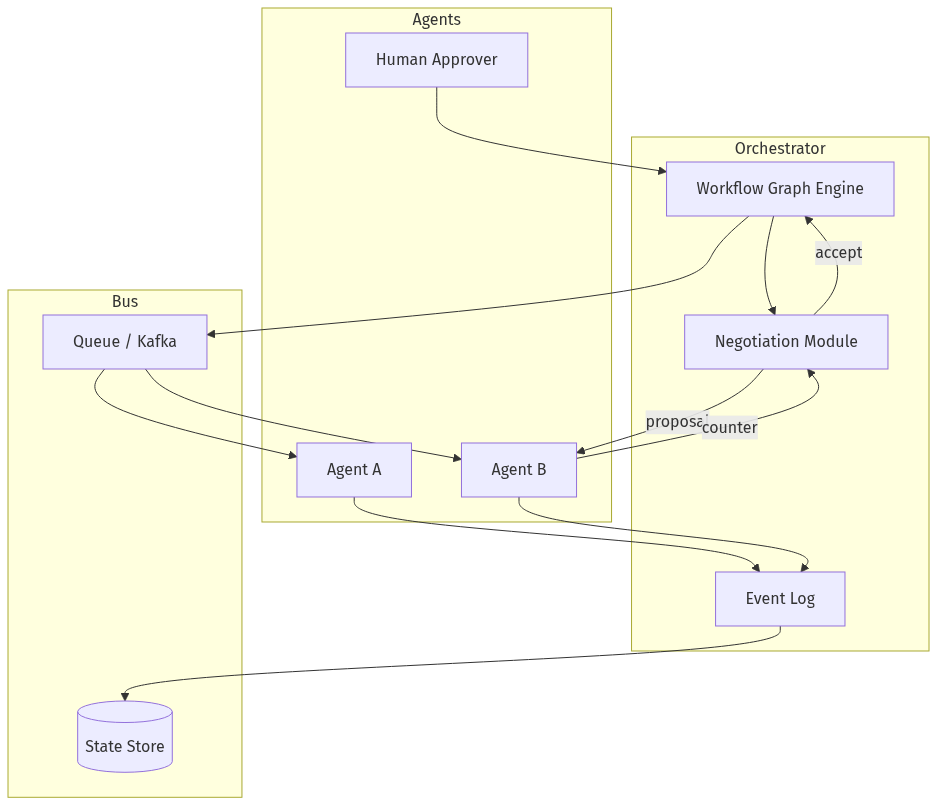
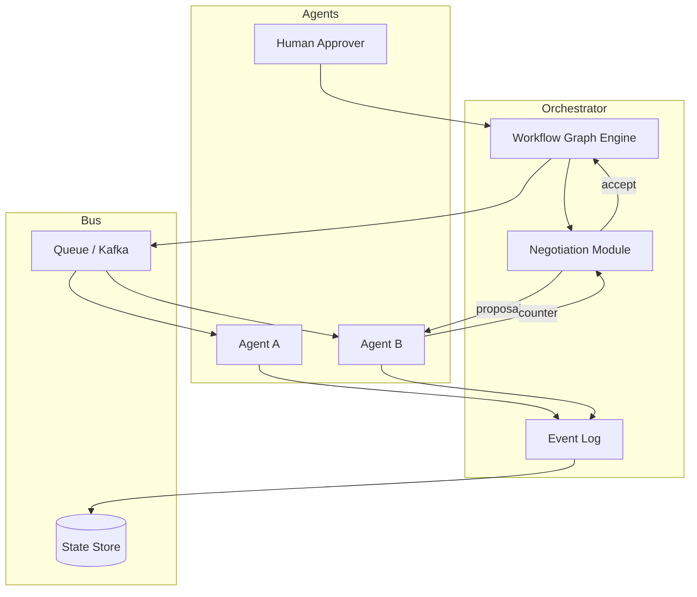
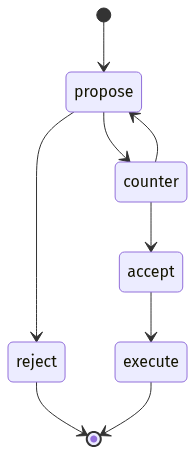
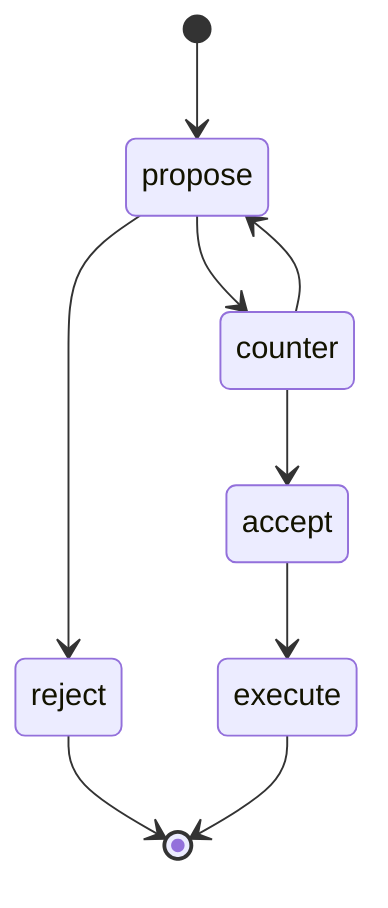
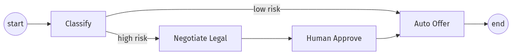
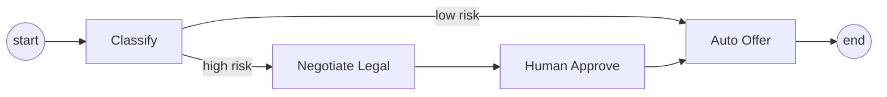
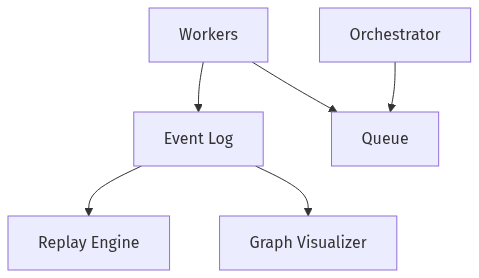
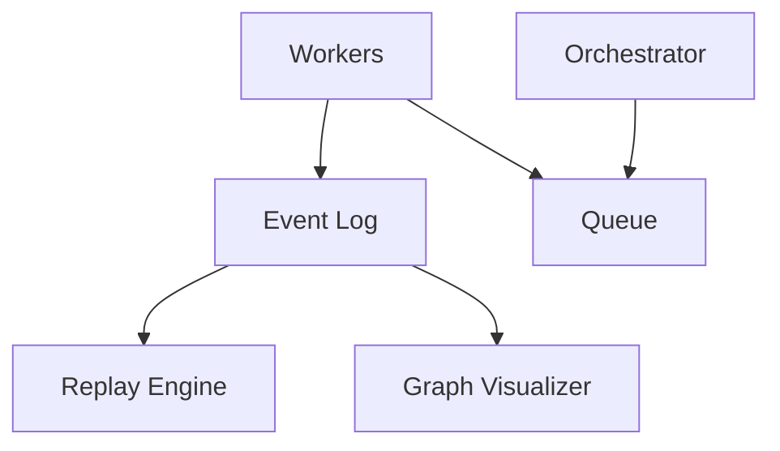
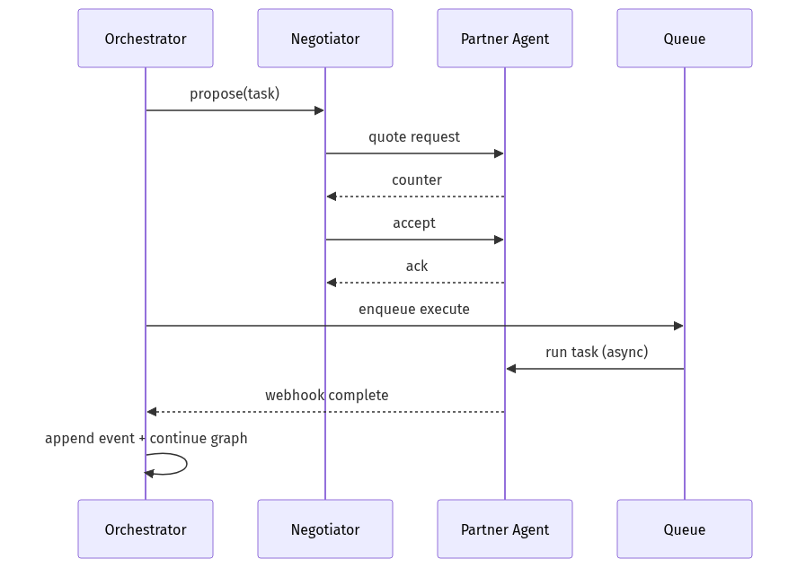
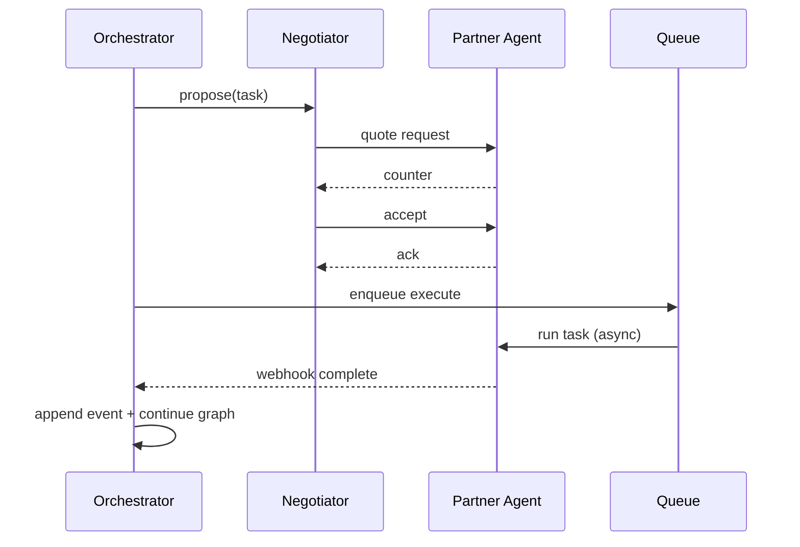

# 07-03 — Negotiation & Async Agent Workflows

| Meta | Value |
|------|-------|
| **Estimated Time** | 6–7 hours (read 2h · lab 4h · failure injection 1h) |
| **Difficulty** | Advanced (distributed coordination) |
| **Prerequisites** | [07-02](07-02-A2A-Agent-to-Agent.md) · [03-04](../03-Agentic-Fundamentals/03-04-LangGraph-Production-Agents.md) · [05-01](../05-Multi-Agent/05-01-Multi-Agent-Orchestration.md) |
| **Module** | 07 — Protocols (MCP / A2A) |
| **Related** | [07-01](07-01-MCP-Model-Context-Protocol.md) · [08-02](../08-Evaluation-LLMOps/08-02-Observability-LangSmith-OTel.md) · [08-01](../08-Evaluation-LLMOps/08-01-Evaluation-Lifecycle.md) · [10-03](../10-Production-Infrastructure/10-03-Redis-Kafka-Ray.md) |

---

## Learning Objectives

By the end of this chapter you will be able to:

1. Build a **negotiation simulator** where agents agree on scope, cost, and SLA before work proceeds.
2. Model **async workflows** with durable task state—not blocking request/response.
3. Represent coordination as **message graphs** (DAGs) with explicit edges and replay tokens.
4. **Replay-debug** failed multi-agent runs from persisted envelopes.
5. Classify **coordination failures**: split brain, duplicate work, lost replies, stale contracts.

---

## Why This Topic Matters

Synchronous “agent calls agent waits” collapses under network jitter, human-in-the-loop pauses, and 30-minute subtasks. Production multi-agent systems are **async message systems** first, LLM second.

Staff interviews probe:

- How do you avoid double booking when two agents negotiate the same resource?
- What is your source of truth for workflow state?
- Can you replay March 3’s failed run without re-calling partners?

---

## Business Impact

| Outcome | Async + negotiation |
|---------|---------------------|
| **Partner spend control** | Quote before delegate |
| **Reliability** | Survive worker restarts |
| **Compliance** | Immutable message log |
| **Ops** | Replay instead of reproduce |

---

## Architecture Overview





Cross-link: [A2A tasks](07-02-A2A-Agent-to-Agent.md) · [LangGraph persistence](../03-Agentic-Fundamentals/03-04-LangGraph-Production-Agents.md)

---

## Core Concepts

### 1) Negotiation Simulator

#### Definition

Before executing expensive delegation, agents exchange **structured proposals**:

| Field | Example |
|-------|---------|
| `task_type` | `legal_review` |
| `max_price_usd` | 12.00 |
| `deadline` | 2026-07-20T18:00:00Z |
| `inputs_hash` | sha256 of payload |
| `sla_p95_ms` | 45000 |

#### States





#### When negotiation matters

- Paid third-party agents
- GPU-heavy jobs
- Human reviewer capacity

#### When to skip

Internal free tools with fixed SLA—negotiation overhead wastes latency.

---

### 2) Async Workflows

#### Definition

**Async workflow:** each step emits events; workers consume; state advances on acknowledgements—not on open HTTP connections.

#### Patterns

| Pattern | Use |
|---------|-----|
| **Polling** | Simple partner A2A tasks |
| **Webhooks / callbacks** | Push completion |
| **Saga** | Compensating transactions on failure |
| **Outbox** | DB + queue atomic handoff |

Cross-link: [10-03 Redis, Kafka & Ray](../10-Production-Infrastructure/10-03-Redis-Kafka-Ray.md)

---

### 3) Message Graphs

#### Definition

A **message graph** is a DAG (or Petri-net-like structure) where:

- **Nodes** = steps (agent invocations, human gates, tools)
- **Edges** = dependencies + routing conditions
- **Envelopes** = immutable `{id, parent_id, payload, trace_id}`





LangGraph implements similar graphs with checkpointing; enterprise buses use Kafka + custom orchestrators.

---

### 4) Replay Debugging

#### Definition

**Replay** reconstructs a workflow from the **event log** at step *k* without re-executing prior side effects.

#### Requirements

| Requirement | Why |
|-------------|-----|
| Immutable log | Trustworthy history |
| Idempotent tools | Safe re-drive |
| Input snapshots | Same bytes at step k |
| Side-effect tags | Know what not to repeat |

#### Replay modes

- **Dry-run replay:** validate routing decisions
- **Partial re-drive:** resume from failed node
- **Counterfactual:** swap agent version on historical input

Cross-link: [08-02 Observability](../08-Evaluation-LLMOps/08-02-Observability-LangSmith-OTel.md)

---

### 5) Coordination Failures

| Failure | Description | Mitigation |
|---------|-------------|------------|
| **Lost reply** | Worker crashed after act, before ack | At-least-once + idempotency |
| **Duplicate work** | Retry creates two refunds | Idempotency keys |
| **Split brain** | Two orchestrators think they lead | Leader election / workflow lease |
| **Stale contract** | Accepted quote, inputs changed | Bind `inputs_hash` |
| **Orphan task** | Parent workflow cancelled | Cancellation tokens propagate |
| **Deadlock** | Agents wait on each other | Timeout + escalation |
| **Poison message** | Bad payload infinite fails | DLQ + quarantine |

---

## Implementation

### Negotiation simulator + async message graph (Python)

```python
"""Negotiation simulator with durable message graph and replay.

Run demo:
  python negotiation_workflow.py demo

Requires:
  pip install pydantic
"""

from __future__ import annotations

import hashlib
import json
import uuid
from dataclasses import dataclass, field
from datetime import datetime, timezone
from enum import Enum
from typing import Any, Callable


class NegotiationState(str, Enum):
    PROPOSE = "propose"
    COUNTER = "counter"
    ACCEPT = "accept"
    REJECT = "reject"


class StepStatus(str, Enum):
    PENDING = "pending"
    RUNNING = "running"
    COMPLETED = "completed"
    FAILED = "failed"


@dataclass
class Proposal:
    task_type: str
    max_price_usd: float
    deadline_iso: str
    inputs_hash: str
    sla_p95_ms: int

    def fingerprint(self) -> str:
        blob = json.dumps(self.__dict__, sort_keys=True)
        return hashlib.sha256(blob.encode()).hexdigest()[:16]


@dataclass
class NegotiationThread:
    thread_id: str
    state: NegotiationState
    history: list[dict[str, Any]] = field(default_factory=list)
    accepted: Proposal | None = None


@dataclass
class MessageEnvelope:
    envelope_id: str
    parent_id: str | None
    trace_id: str
    step: str
    payload: dict[str, Any]
    ts: str
    side_effects: bool = False


class EventLog:
    def __init__(self) -> None:
        self.events: list[MessageEnvelope] = []

    def append(self, env: MessageEnvelope) -> None:
        self.events.append(env)

    def replay_until(self, envelope_id: str) -> list[MessageEnvelope]:
        out: list[MessageEnvelope] = []
        for e in self.events:
            out.append(e)
            if e.envelope_id == envelope_id:
                break
        return out


class MessageGraph:
    def __init__(self, log: EventLog, trace_id: str) -> None:
        self.log = log
        self.trace_id = trace_id
        self.status: dict[str, StepStatus] = {}

    def emit(self, step: str, payload: dict[str, Any], *, parent: str | None = None, side_effects: bool = False) -> str:
        eid = str(uuid.uuid4())
        env = MessageEnvelope(
            envelope_id=eid,
            parent_id=parent,
            trace_id=self.trace_id,
            step=step,
            payload=payload,
            ts=datetime.now(timezone.utc).isoformat(),
            side_effects=side_effects,
        )
        self.log.append(env)
        return eid


def legal_agent_policy(proposal: Proposal) -> tuple[NegotiationState, Proposal | None]:
    """Simulated partner: counters if price low or SLA tight."""
    floor = 15.0 if proposal.task_type == "legal_review" else 5.0
    if proposal.max_price_usd >= floor and proposal.sla_p95_ms >= 30000:
        return NegotiationState.ACCEPT, proposal
    counter = Proposal(
        task_type=proposal.task_type,
        max_price_usd=max(floor, proposal.max_price_usd),
        deadline_iso=proposal.deadline_iso,
        inputs_hash=proposal.inputs_hash,
        sla_p95_ms=max(30000, proposal.sla_p95_ms),
    )
    return NegotiationState.COUNTER, counter


def negotiate(thread: NegotiationThread, initial: Proposal, rounds: int = 3) -> NegotiationThread:
    current = initial
    for _ in range(rounds):
        state, maybe = legal_agent_policy(current)
        thread.history.append({"state": state.value, "proposal": current.__dict__})
        thread.state = state
        if state == NegotiationState.ACCEPT:
            thread.accepted = maybe
            return thread
        if state == NegotiationState.COUNTER and maybe:
            current = Proposal(
                task_type=maybe.task_type,
                max_price_usd=min(maybe.max_price_usd, initial.max_price_usd + 5),
                deadline_iso=maybe.deadline_iso,
                inputs_hash=maybe.inputs_hash,
                sla_p95_ms=maybe.sla_p95_ms,
            )
            thread.state = NegotiationState.PROPOSE
    thread.state = NegotiationState.REJECT
    return thread


def run_workflow(customer: dict[str, Any]) -> EventLog:
    log = EventLog()
    trace = str(uuid.uuid4())
    graph = MessageGraph(log, trace)
    inputs_hash = hashlib.sha256(json.dumps(customer, sort_keys=True).encode()).hexdigest()

    n0 = graph.emit("classify", {"customer": customer})
    complaints = int(customer.get("complaints", 0))
    if complaints >= 2:
        thread = NegotiationThread(str(uuid.uuid4()), NegotiationState.PROPOSE)
        proposal = Proposal(
            task_type="legal_review",
            max_price_usd=10.0,
            deadline_iso="2026-07-20T18:00:00Z",
            inputs_hash=inputs_hash,
            sla_p95_ms=20000,
        )
        thread = negotiate(thread, proposal)
        graph.emit("negotiation", {"thread": thread.history, "final": thread.state.value}, parent=n0)
        if thread.state != NegotiationState.ACCEPT:
            graph.emit("escalate_human", {"reason": "negotiation_failed"}, parent=n0, side_effects=True)
            return log
        graph.emit("delegate_legal", {"accepted": thread.accepted.__dict__}, parent=n0, side_effects=True)
    else:
        graph.emit("auto_offer", {"offer": "points_bonus"}, parent=n0, side_effects=True)
    graph.emit("complete", {"status": "ok"})
    return log


def replay_debug(log: EventLog, stop_at: str) -> None:
    print(f"Replaying {len(log.replay_until(stop_at))} envelopes to {stop_at}:")
    for e in log.replay_until(stop_at):
        print(f"  [{e.step}] side_effects={e.side_effects} payload_keys={list(e.payload.keys())}")


def demo() -> None:
    log = run_workflow({"customer_id": "c-42", "complaints": 3})
    stop = log.events[2].envelope_id
    replay_debug(log, stop)


if __name__ == "__main__":
    demo()
```

---

## Production Considerations

| Concern | Practice |
|---------|----------|
| **Durability** | Postgres + outbox; not in-memory dict |
| **Leases** | Workflow worker holds time-bounded lease |
| **Cancellation** | Propagate `cancel_reason` on graph edges |
| **Versioning** | `graph_version` on each envelope |
| **Human steps** | SLA timers + escalation |

---

## Security

| Threat | Control |
|--------|---------|
| **Negotiation tampering** | Sign proposals |
| **Replay attack** | Nonce + expiry on accept |
| **Log PII exposure** | Redact payloads in event store |

---

## Performance

Async decouples **user-facing latency** from **partner p95**. Show “in progress” UI; push on completion.

---

## Cost

Negotiation avoids calling **$15 legal agent** when **$0 rules** suffice—measure `$ saved by reject/counter`.

---

## Scalability

Partition workflows by `trace_id`. Horizontal workers consume queue shards.

---

## Failure Modes

See coordination failures table in Core Concepts. Add **chaos tests**: kill worker mid-`delegate_legal`.

---

## Observability

Metrics: `workflow_started`, `negotiation_rounds`, `negotiation_outcome`, `step_latency_ms`, `dlq_depth`.

Spans link parent envelope → child ([OpenTelemetry](https://opentelemetry.io/docs/)).

---

## Debugging

| Tool | Purpose |
|------|---------|
| Event log UI | Step timeline |
| Replay CLI | Counterfactual agents |
| Graph viz | Stuck node detection |

---

## Common Mistakes

1. In-memory-only workflow state.
2. No idempotency on side-effect steps.
3. Blocking HTTP through human approval.
4. Negotiation without binding `inputs_hash`.
5. No DLQ for poison envelopes.

---

## Tradeoffs

| Choice | Upside | Downside |
|--------|--------|----------|
| Sync delegate | Simple | Fragile |
| Full async | Resilient | UX complexity |
| Heavy negotiation | Cost control | Latency |
| Kafka vs DB polling | Scale | Ops |

---

## Architecture Diagram





---

## Mermaid Diagram — Sequence (Async Delegate)





---

## Production Examples

| Domain | Pattern |
|--------|---------|
| **Insurance** | Negotiate expert reviewer slot |
| **Supply chain** | Async bid collection from vendor agents |
| **Enterprise IT** | Human approval node + 48h SLA |

---

## Real Companies Using It (Public Patterns)

| Org | Pattern |
|-----|---------|
| **Uber / LangGraph users** | Durable agent state |
| **Temporal.io workflows** | Async saga (non-LLM but analogous) |
| **AWS Step Functions** | Visual message graphs |

---

## Hands-on Labs

### Lab A — Negotiation rounds (45 min)

Tune floor price; measure accept/reject rates on synthetic tasks.

### Lab B — Replay (45 min)

Inject failure after `delegate_legal`; resume without duplicate side effect.

### Lab C — Chaos (45 min)

Kill worker; verify at-least-once does not double-charge.

---

## Coding Assignments

1. Persist `EventLog` to **SQLite**.
2. Add **DLQ** for failed steps after 3 tries.
3. Export graph to **Mermaid** for docs.

---

## Mini Project

**Title:** Negotiation Dashboard  
**Done when:** Streamlit shows threads, outcomes, replay button.

---

## Production Project

**Title:** Async A2A Orchestrator  
**Done when:** Kafka + Postgres + OTel + HITL gate.

---

## Stretch Project

Integrate LangGraph checkpointing; compare replay ergonomics vs custom event log.

---

## Interview Questions

### Senior Engineer

1. Sync vs async agent delegation?
2. What belongs in a message envelope?
3. Idempotency key placement?

### Staff Engineer

1. Design negotiation for paid partner agents.
2. Replay without duplicate side effects—how?
3. Detect deadlock in message graph.

### Principal Engineer

1. Event-sourced workflow platform for 100 teams.
2. SLA enforcement across async human steps.
3. Standardize graphs vs allow framework diversity.

### Engineering Manager

1. Ops cost of async vs sync for pilot?
2. Incident process when partner queue backs up?
3. Metrics proving negotiation ROI?

### Whiteboard

Draw propose/counter/accept then async execute with webhook.

### Follow-ups

- Exactly-once possible?
- GDPR delete vs immutable log?
- Visual vs code-defined graphs?

---

## Revision Notes

- **Async first** for multi-agent production.
- **Negotiation** binds price, SLA, and `inputs_hash`.
- **Message graph** + **event log** = replayability.
- Tag **side_effects** on envelopes.
- Study **coordination failures** deliberately.

---

## Summary

Negotiation and async message graphs turn multi-agent systems into **durable, auditable workflows**—not fragile call chains. Replay debugging and explicit failure taxonomy separate demo orchestration from production coordination.

---

## Further Reading

| Title | URL | Difficulty | Reading Time | Why Read | Important Sections |
|-------|-----|------------|--------------|----------|--------------------|
| A2A Protocol | https://a2a-protocol.org/latest/ | Intermediate | 40 min | Task async model | Task lifecycle |
| LangGraph Persistence | https://langchain-ai.github.io/langgraph/concepts/persistence/ | Intermediate | 35 min | Checkpoint replay | Threads; replay |
| Temporal Workflows | https://docs.temporal.io/workflows | Intermediate | 45 min | Async saga patterns | Signals; timers |
| OpenTelemetry | https://opentelemetry.io/docs/ | Intermediate | 30 min | Trace propagation | Context |
| Enterprise Integration Patterns | https://www.enterpriseintegrationpatterns.com/ | Advanced | 60 min | Message routing | Saga; DLQ |

---

## Resume Bullet (after lab)

- Built an **async multi-agent workflow engine** with proposal/counter negotiation, immutable message envelopes, idempotent side-effect tags, and step-level replay debugging for partner delegation failures.
