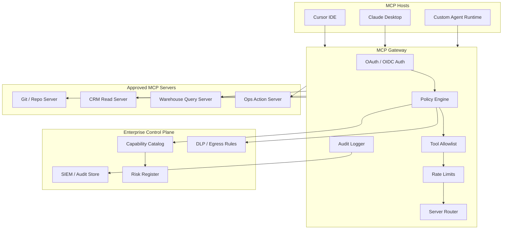
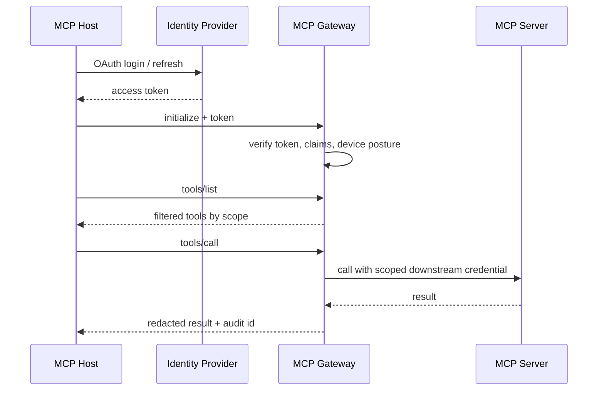

# 07-04 — MCP Production Patterns (Depth)

| Meta | Value |
|------|-------|
| **Estimated Time** | 6–7 hours (read 2.5h · lab 3h · governance review 1h) |
| **Difficulty** | Advanced (protocol operations, security boundaries, enterprise governance) |
| **Prerequisites** | [07-01 MCP](07-01-MCP-Model-Context-Protocol.md) · [03-02 Tools, Memory & Control Flow](../03-Agentic-Fundamentals/03-02-Tools-Memory-Control-Flow.md) · [11-02 Prompt Injection Defense](../11-Security-Safety/11-02-Prompt-Injection-Defense.md) |
| **Module** | 07 — Protocols (MCP / A2A) |
| **Related** | [07-01](07-01-MCP-Model-Context-Protocol.md) · [03-02](../03-Agentic-Fundamentals/03-02-Tools-Memory-Control-Flow.md) · [08-02 Observability](../08-Evaluation-LLMOps/08-02-Observability-LangSmith-OTel.md) · [08-03 Guardrails](../08-Evaluation-LLMOps/08-03-Guardrails-Ship-Criteria.md) · [11-02](../11-Security-Safety/11-02-Prompt-Injection-Defense.md) |

---

## Learning Objectives

By the end of this chapter you will be able to:

1. Design an **MCP gateway** that centralizes auth, policy, audit, routing, and rate limits.
2. Apply **OAuth, tenant isolation, tool allowlists, and sandboxing** to MCP deployments.
3. Integrate MCP safely into hosts such as **Cursor**, **Claude Desktop**, and custom agent runtimes.
4. Version MCP tools without breaking clients or silently changing model behavior.
5. Threat-model production MCP systems against prompt injection, data exfiltration, and side-effect abuse.
6. Explain enterprise governance patterns at **Staff/Principal** altitude.

Official references:

- [https://modelcontextprotocol.io/](https://modelcontextprotocol.io/)
- [https://spec.modelcontextprotocol.io/](https://spec.modelcontextprotocol.io/)
- [https://github.com/modelcontextprotocol/python-sdk](https://github.com/modelcontextprotocol/python-sdk)

---

## Why This Topic Matters

[07-01](07-01-MCP-Model-Context-Protocol.md) introduced MCP as the standard contract for tools, resources, and prompts. That is necessary but insufficient for production.

The protocol tells you how a host discovers and calls capabilities. It does **not** decide:

- which teams may run which servers,
- whether a tool can touch production data,
- how tenant boundaries are enforced,
- which calls require human approval,
- how audit records survive an incident,
- or how a malicious resource is kept away from write tools.

Staff and Principal engineers are usually asked a different question than "can we connect this MCP server?"

The real question is:

> Can we make hundreds of MCP capabilities available without turning every agent host into a new privileged production shell?

This chapter answers that question with architecture patterns rather than another hello-world server.

---

## Business Impact

| Business outcome | Production MCP pattern |
|------------------|------------------------|
| **Faster integration** | Shared gateway and approved server catalog |
| **Lower incident blast radius** | Per-tool scopes, sandboxed side effects, network egress control |
| **Compliance readiness** | Immutable audit logs and tenant-aware authorization |
| **Developer velocity** | Cursor / Claude Desktop profiles backed by the same governance plane |
| **Vendor leverage** | Standard MCP contract avoids bespoke plugin lock-in |
| **Platform reuse** | Tool metadata, rate limits, and policy attach once at the gateway |

Production MCP is a platform capability. If every team adds local servers with local tokens, the organization gets velocity for one quarter and security debt for years.

---

## Architecture Overview

The enterprise pattern is a **gateway between hosts and MCP servers**. Hosts still speak MCP. Servers still implement MCP. The gateway adds the missing control plane.



**Mental model:** MCP is the data plane. The gateway is the policy plane. Enterprise governance lives outside any single host.

---

## Core Concepts

### 1) MCP Gateway

#### Definition

An **MCP gateway** is a controlled proxy that sits between MCP hosts and MCP servers. It preserves the MCP contract while enforcing organization policy.

#### Responsibilities

| Responsibility | Example |
|----------------|---------|
| Authentication | Validate user / device / service identity |
| Authorization | Map user and tenant to permitted tools |
| Discovery filtering | Hide tools not allowed for this context |
| Rate limiting | Per user, tenant, host, tool, and environment |
| Audit logging | Capture who called what with which approved scope |
| Routing | Send calls to the right server version / region |
| Mediation | Normalize errors and redact sensitive fields |

#### Why not let hosts connect directly?

Direct connections are fine for a personal laptop demo. They break down when:

- teams need shared policy,
- security needs evidence,
- server owners need rollout controls,
- and platform teams need cost / usage visibility.

#### Staff-level rule

If the MCP tool can read sensitive data or perform a side effect, route it through a gateway or a host with equivalent controls.

---

### 2) AuthN/AuthZ and OAuth

Authentication answers **who is calling**; authorization answers **what may this identity do now**. Production MCP policy should consider user, tenant, role, host, environment, tool risk tier, and resource classification.



Token hygiene: prefer short-lived tokens; bind them to user, tenant, and host where possible; never expose broad backend credentials to local MCP code; redact tokens from logs; rotate downstream credentials independently.

Cross-link: [11-02 Prompt Injection Defense](../11-Security-Safety/11-02-Prompt-Injection-Defense.md)

---

### 3) Tool Allowlists

#### Definition

A **tool allowlist** is the set of MCP tools visible and callable for a specific user, tenant, host, and session.

The allowlist must affect both:

1. **Discovery**: what appears in `tools/list`
2. **Invocation**: what is accepted in `tools/call`

Filtering discovery alone is not a security boundary. The gateway must reject hidden tools if called directly.

#### Allowlist dimensions

| Dimension | Example |
|-----------|---------|
| User role | Support agent can read tickets; manager can approve refunds |
| Tenant | Tenant A cannot call Tenant B tools |
| Host | Cursor can use repo tools; public web chat cannot run shell-like tools |
| Risk tier | T3 action tools require HITL |
| Environment | Staging tools differ from production |
| Time window | Break-glass access expires after incident window |

---

### 4) Rate Limits and Budgets

MCP rate limits should be more granular than API gateway request limits.

| Limit | Why it matters |
|-------|----------------|
| Per user | Prevent runaway personal agents |
| Per tenant | Protect noisy-neighbor isolation |
| Per tool | Expensive tools need tighter quotas |
| Per downstream API | Respect vendor / internal service limits |
| Per session | Stop infinite tool loops |
| Per risk tier | Action tools need low ceilings |

#### Budget-first design

For agent loops, rate limits should be tied to a **run budget**:

```text
max_tool_calls_per_run = 20
max_write_tools_per_run = 1
max_total_tool_latency_ms = 30000
max_estimated_cost_usd = 0.50
```

Budget exhaustion is not always an error. It can be a legitimate model response:

> I reached the allowed tool budget and need human approval to continue.

Cross-link: [03-02 Tools, Memory & Control Flow](../03-Agentic-Fundamentals/03-02-Tools-Memory-Control-Flow.md)

---

### 5) Audit Logs

Record enough to reconstruct decisions: `audit_id`, timestamp, actor, tenant, host, server, tool, tool version, input hash, data classification, effect type, decision, latency, and result classification.

Do not blindly record raw secrets, full customer records, regulated tool outputs, large copied documents, or hidden model reasoning.

Audit logs should support incident response without becoming a second sensitive data lake.

---

### 6) Multi-Tenant Isolation

Multi-tenancy is not solved by naming tools carefully.

Isolation must be enforced at multiple layers:

| Layer | Control |
|-------|---------|
| Identity | Tenant claim in token |
| Gateway | Policy includes tenant filter |
| Server | Re-check tenant authorization |
| Data | Row-level security or tenant partition |
| Logs | Tenant-aware retention and access |
| Metrics | Avoid high-cardinality PII labels |

#### Defense in depth

The gateway should never be the only tenant boundary. MCP servers must treat tenant identity as an input from a trusted auth context, not from model-generated tool arguments.

Bad:

```json
{"tenant_id": "acme", "customer_id": "123"}
```

Better:

```text
tenant_id comes from verified token claims;
tool args include only customer_id within that tenant.
```

#### Principal-level question

Can a compromised host, a prompt-injected model, or a buggy server cross from Tenant A into Tenant B?

If the answer depends on the model choosing honest arguments, the design is not production-ready.

---

### 7) Cursor and Claude Desktop Host Integration

Cursor and Claude Desktop make MCP adoption fast because developers can configure local or remote servers and immediately use them in an IDE or desktop assistant. That local power is also an endpoint risk.

Use local hosts for repo search, docs, issue lookup, codegen support, and test helpers. Prefer read-only tools, narrow project config, secret references via environment variables, and gateway-hosted tools for sensitive access.

Cursor docs: [https://docs.cursor.com/](https://docs.cursor.com/) · MCP docs: [https://modelcontextprotocol.io/](https://modelcontextprotocol.io/)

| Host type | Good fit | Avoid |
|-----------|----------|-------|
| Local IDE | Code search, tests, docs, repo actions | Production write tools with broad creds |
| Desktop assistant | Knowledge lookup, personal workflows | Unsandboxed admin operations |
| Web app agent | Customer-specific workflows | Arbitrary local process tools |
| Backend worker | Repeatable batch tasks | Human identity impersonation without audit |

---

### 8) Tool Versioning

MCP tools are contracts exposed to a model. Changing them changes model behavior.

| Contract surface | Versioning guidance |
|------------------|--------------------|
| Tool name | Stable; use alias only with care |
| Input schema | Add optional fields; avoid changing meanings |
| Output schema | Keep stable keys; add fields rather than rename |
| Side effect semantics | Version explicitly |
| Auth scopes | Treat as security migration |
| Description | Test because it affects model selection |

| Strategy | Example | Use when |
|----------|---------|----------|
| Date suffix | `create_ticket_2026_07_01` | Semantics changed |
| Server version | `crm-mcp:v3` | Cohesive release train |
| Capability metadata | `version: "3.2.1"` | Gateway can route by metadata |
| Deprecation window | old and new tools visible | Migration needs host compatibility |

The tool description is not just documentation; it is part of the model's decision surface. Include description changes in evals because they alter tool selection behavior.

---

### 9) Sandboxed Side Effects

| Class | Examples | Production control |
|-------|----------|--------------------|
| Read | search docs, fetch ticket | Auth + audit |
| Draft | create email draft, prepare patch | Human review |
| Internal write | update ticket, create task | Idempotency + policy |
| External send | email customer, post Slack, issue refund | HITL + strong audit |
| System action | deploy, rotate secret, run shell | Sandbox + break-glass only |

Run side-effect tools in restricted containers with read-only mounts by default, denied arbitrary egress, CPU/memory/time limits, per-run workspaces, idempotency keys, and approval gates for irreversible actions.

---

### 10) Enterprise Governance

Every approved MCP server should have an entry:

| Field | Example |
|-------|---------|
| Owner | `team-crm-platform` |
| Data classification | PII / confidential |
| Tools exposed | `crm.search_customer`, `crm.get_account` |
| Effect tier | read-only |
| Hosts approved | Cursor, support-console |
| Auth model | OAuth user delegation |
| Rate limits | 100 calls/user/hour |
| Audit retention | 1 year |
| On-call | PagerDuty service |

| Gate | Required evidence |
|------|-------------------|
| Design review | Architecture, threat model, ownership |
| Security review | Auth, scopes, tenant isolation, egress |
| Eval review | Tool selection and failure-mode tests |
| Launch review | Runbook, audit, dashboards, rollback |
| Quarterly review | Usage, incidents, stale scopes |

Approve **capabilities**, not just servers. A server with one read-only tool and one production write tool is not a single risk tier.

---

## When to Use MCP Production Patterns

Use these patterns when:

- multiple hosts need the same internal tools,
- tools touch PII, customer data, money, infrastructure, or regulated workflows,
- the organization needs audit evidence,
- third-party or community servers are being evaluated,
- teams want local IDE productivity without distributing broad credentials,
- or you need consistent policy across Cursor, Claude Desktop, and custom agents.

---

## When NOT to Use MCP Production Patterns

Avoid heavy gateway architecture when:

- the tool is local-only and low risk,
- no sensitive data or side effects are involved,
- a single application already has mature in-process tools,
- latency budget is extremely tight and the tool is deterministic,
- or the team is still validating product-market fit with synthetic data.

Do not use MCP as a universal hammer. For internal code that will only ever run in one backend service, a typed function call may be simpler and safer.

---

## Implementation / Lab — MCP Gateway Pattern Sketch in Python

This lab sketches a gateway that authenticates context, filters discovery, enforces invocation policy, rate-limits calls, writes audit records, and forwards to registered handlers.

### Install

```bash
python -m venv .venv
source .venv/bin/activate
pip install fastapi uvicorn pydantic
```

### `gateway.py`

```python
from __future__ import annotations

import hashlib
import json
import time
from dataclasses import dataclass
from typing import Any, Callable

from fastapi import Depends, FastAPI, Header, HTTPException
from pydantic import BaseModel


app = FastAPI(title="MCP Gateway Sketch")


class ToolCall(BaseModel):
    name: str
    arguments: dict[str, Any] = {}


@dataclass(frozen=True)
class RequestContext:
    actor_id: str
    tenant_id: str
    role: str
    host_id: str


class RateLimiter:
    def __init__(self, max_calls: int, window_seconds: int) -> None:
        self.max_calls = max_calls
        self.window_seconds = window_seconds
        self.buckets: dict[str, list[float]] = {}

    def allow(self, key: str) -> bool:
        now = time.time()
        cutoff = now - self.window_seconds
        events = [t for t in self.buckets.get(key, []) if t >= cutoff]
        if len(events) >= self.max_calls:
            self.buckets[key] = events
            return False
        events.append(now)
        self.buckets[key] = events
        return True


ToolHandler = Callable[[RequestContext, dict[str, Any]], dict[str, Any]]
TOOLS = {
    "crm.search_customer": {
        "description": "Search customers within the authenticated tenant.",
        "effect": "read",
        "version": "2026-07-01",
    },
    "billing.prepare_refund": {
        "description": "Draft a refund request; does not issue money.",
        "effect": "draft",
        "version": "2026-07-01",
    },
}
ALLOW = {
    "support_agent": {"crm.search_customer"},
    "support_manager": {"crm.search_customer", "billing.prepare_refund"},
}
HOST_DENY = {"public_web": {"billing.prepare_refund"}}
HANDLERS: dict[str, ToolHandler] = {}
limiter = RateLimiter(max_calls=10, window_seconds=60)


def can_call(ctx: RequestContext, tool_name: str) -> bool:
    role_ok = tool_name in ALLOW.get(ctx.role, set())
    host_ok = tool_name not in HOST_DENY.get(ctx.host_id, set())
    return role_ok and host_ok


def canonical_hash(payload: dict[str, Any]) -> str:
    encoded = json.dumps(payload, sort_keys=True, separators=(",", ":")).encode()
    return hashlib.sha256(encoded).hexdigest()


def audit(ctx: RequestContext, tool: str, args: dict[str, Any], decision: str) -> str:
    audit_id = f"aud_{int(time.time() * 1000)}"
    record = {
        "audit_id": audit_id,
        "actor_id": ctx.actor_id,
        "tenant_id": ctx.tenant_id,
        "role": ctx.role,
        "host_id": ctx.host_id,
        "tool": tool,
        "arguments_hash": canonical_hash(args),
        "decision": decision,
        "ts": time.time(),
    }
    print(json.dumps(record, sort_keys=True))
    return audit_id


def get_context(
    authorization: str = Header(default=""),
    x_tenant_id: str = Header(default="demo-tenant"),
    x_host_id: str = Header(default="cursor"),
) -> RequestContext:
    # Demo only: production verifies JWT/OAuth tokens and device posture.
    token = authorization.replace("Bearer ", "")
    if token == "support":
        return RequestContext("user_123", x_tenant_id, "support_agent", x_host_id)
    if token == "manager":
        return RequestContext("user_456", x_tenant_id, "support_manager", x_host_id)
    raise HTTPException(status_code=401, detail="invalid_token")


def search_customer(ctx: RequestContext, args: dict[str, Any]) -> dict[str, Any]:
    return {"tenant_id": ctx.tenant_id, "matches": [{"customer_id": "cust_001"}]}


def prepare_refund(ctx: RequestContext, args: dict[str, Any]) -> dict[str, Any]:
    return {"status": "drafted", "requires_human_approval": True}


HANDLERS["crm.search_customer"] = search_customer
HANDLERS["billing.prepare_refund"] = prepare_refund


@app.get("/mcp/tools")
def list_tools(ctx: RequestContext = Depends(get_context)) -> dict[str, Any]:
    return {
        "tools": [
            {"name": name, **meta}
            for name, meta in TOOLS.items()
            if can_call(ctx, name)
        ]
    }


@app.post("/mcp/tools/call")
def call_tool(call: ToolCall, ctx: RequestContext = Depends(get_context)) -> dict[str, Any]:
    if call.name not in HANDLERS:
        raise HTTPException(status_code=404, detail="unknown_tool")
    if not can_call(ctx, call.name):
        audit(ctx, call.name, call.arguments, "denied")
        raise HTTPException(status_code=403, detail="tool_not_allowed")

    if not limiter.allow(f"{ctx.tenant_id}:{ctx.actor_id}:{call.name}"):
        audit(ctx, call.name, call.arguments, "rate_limited")
        raise HTTPException(status_code=429, detail="rate_limited")

    result = HANDLERS[call.name](ctx, call.arguments)
    audit_id = audit(ctx, call.name, call.arguments, "allowed")
    return {"content": [{"type": "json", "json": result}], "audit_id": audit_id}
```

### Run

```bash
uvicorn gateway:app --reload --port 8080
```

### Exercise A — Discovery filtering

```bash
curl -H "Authorization: Bearer support" http://localhost:8080/mcp/tools
curl -H "Authorization: Bearer manager" http://localhost:8080/mcp/tools
```

Expected result:

- support sees read tools,
- manager sees read and draft tools,
- neither receives tools outside policy.

### Exercise B — Invocation enforcement

```bash
curl -X POST http://localhost:8080/mcp/tools/call \
  -H "Authorization: Bearer support" \
  -H "Content-Type: application/json" \
  -d '{"name":"billing.prepare_refund","arguments":{"customer_id":"cust_001"}}'
```

Expected result:

- gateway returns `403`,
- audit log records `decision=denied`,
- downstream billing handler is never called.

### Exercise C — Production extension

Replace in-memory policy with OIDC JWT validation, Redis token buckets, Postgres audit tables, Open Policy Agent, real MCP transport adapters, and OpenTelemetry spans.

---

## Production Hardening Checklist

| Area | Control |
|------|---------|
| Auth | OAuth/OIDC, short-lived tokens, device posture for local hosts |
| Authorization | Tool-level allowlists and server-side tenant checks |
| Secrets | Secret manager; never checked into host config |
| Discovery | Filter `tools/list` by policy |
| Invocation | Enforce policy again on `tools/call` |
| Rate limits | User, tenant, host, tool, and run budget |
| Side effects | Idempotency keys, sandbox, approval gates |
| Audit | Immutable event store with sensitive-field redaction |
| Observability | OTel spans per tool call and downstream dependency |
| Versioning | Explicit tool versions and contract tests |
| Incident response | Disable tool/server centrally at gateway |

---

## Failure Modes

| Failure | Symptom | Mitigation |
|---------|---------|------------|
| Discovery-only policy | Hidden tool can still be called | Enforce on invocation |
| Tenant argument spoofing | Model passes another tenant ID | Tenant from auth context only |
| Local token sprawl | Secrets copied into desktop configs | OAuth gateway and secret manager |
| Prompt-injected resource | Model calls write tool after reading hostile text | Separate read and write scopes; HITL |
| Tool schema drift | Host/model sends outdated args | Contract tests on `tools/list` |
| Gateway outage | All tools unavailable | Health checks, fallback read-only servers, circuit breakers |
| Audit log PII lake | Logs become regulated dataset | Hash/redact inputs and classify fields |
| Rate limit bypass | Agent rotates sessions | Tenant and actor-level budgets |
| Overbroad server | One server exposes low and high-risk tools | Tool-level policy and split servers |
| Version surprise | Description change alters model behavior | Eval tool selection before rollout |

---

## Interview Questions

### Senior Engineer

1. What controls are missing if a host connects directly to a sensitive MCP server?
2. Why must tool allowlists apply to both discovery and invocation?
3. What should be included in an MCP audit log?

### Staff Engineer

1. Design an MCP gateway for 500 engineers using Cursor and Claude Desktop.
2. How would you implement tenant isolation for a shared CRM MCP server?
3. What is your rollout plan for a breaking tool schema change?

### Principal Engineer

1. Decide between MCP gateway, service mesh, and in-process tools for a regulated enterprise.
2. Create an incident response plan for a compromised community MCP server.
3. Define a governance model that lets teams ship tools quickly without central bottlenecks.

### Engineering Manager

1. Which teams own the gateway, server catalog, and security review?
2. What is the launch checklist before enabling MCP for all developers?
3. How do you measure developer productivity without ignoring risk?

---

## Revision Notes

- MCP standardizes capability access; production requires a **control plane**.
- A gateway centralizes **auth, policy, audit, routing, and revocation**.
- Filter tool discovery, but enforce again at invocation.
- Tenant identity must come from trusted auth context, not model-generated arguments.
- Tool descriptions are behavioral inputs and should be evaluated like prompts.
- Sandboxed side effects and HITL are mandatory for irreversible actions.
- Enterprise governance approves **capabilities**, not only servers.

---

## Summary

MCP lets hosts and servers interoperate, but production safety comes from architecture around the protocol. A mature MCP platform uses a gateway, OAuth, scoped tools, tenant isolation, rate limits, audit logs, versioning, and sandboxed side effects. The Staff/Principal move is to preserve developer velocity while making privileged capability governable across every host.

---

## Further Reading

- Model Context Protocol home: [https://modelcontextprotocol.io/](https://modelcontextprotocol.io/)
- MCP specification: [https://spec.modelcontextprotocol.io/](https://spec.modelcontextprotocol.io/)
- MCP Python SDK: [https://github.com/modelcontextprotocol/python-sdk](https://github.com/modelcontextprotocol/python-sdk)
- Cursor documentation: [https://docs.cursor.com/](https://docs.cursor.com/)
- Anthropic Claude Desktop documentation: [https://support.anthropic.com/](https://support.anthropic.com/)
- Open Policy Agent: [https://www.openpolicyagent.org/docs/latest/](https://www.openpolicyagent.org/docs/latest/)
- OWASP Top 10 for LLM Applications: [https://owasp.org/www-project-top-10-for-large-language-model-applications/](https://owasp.org/www-project-top-10-for-large-language-model-applications/)
