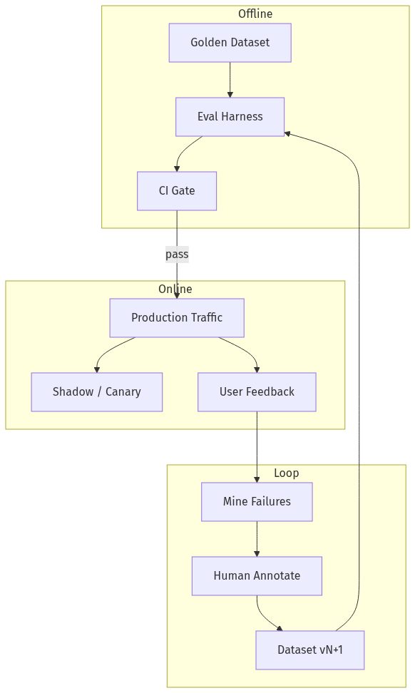
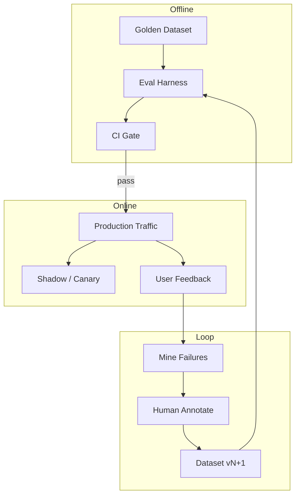
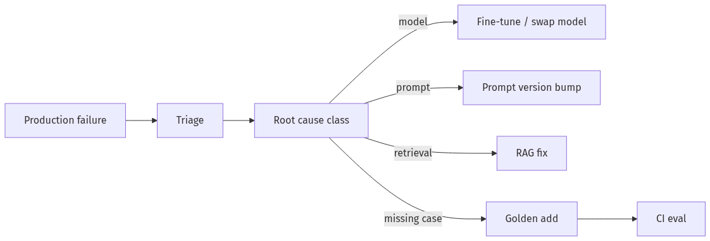
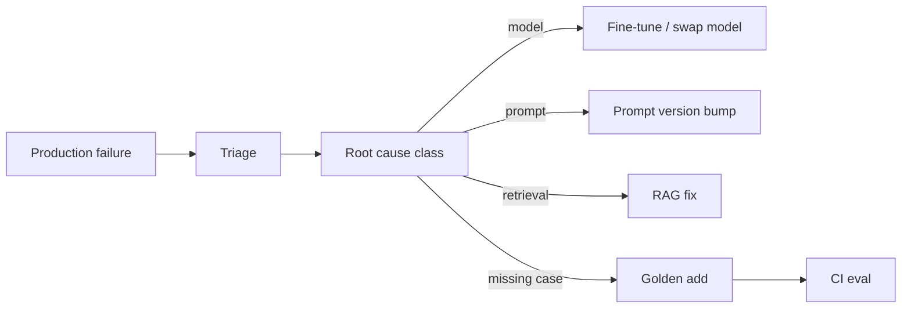
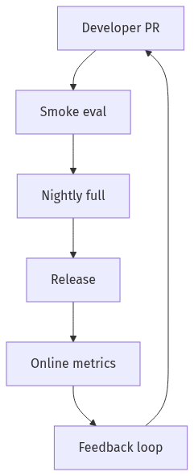
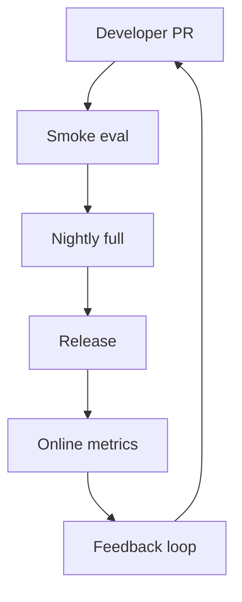
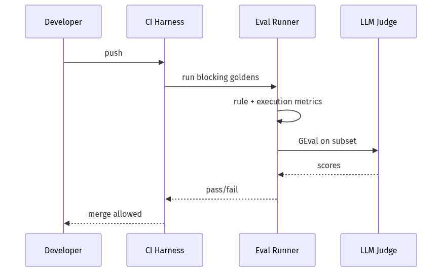
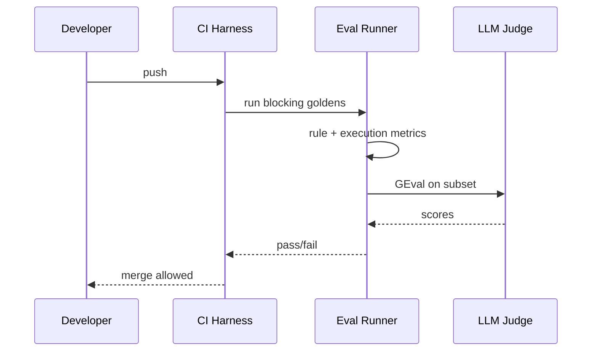

# 08-01 — Evaluation Lifecycle (Offline + Online)

| Meta | Value |
|------|-------|
| **Estimated Time** | 6–7 hours (read 2.5h · lab 4h · eval plan memo 1h) |
| **Difficulty** | Intermediate (metrics) · Advanced (production gates) |
| **Prerequisites** | [00-01](../00-Foundations/00-01-AI-Engineering-Mindset.md) · [02-01](../02-Prompt-Engineering/02-01-Production-Prompt-Engineering.md) · [04-01](../04-RAG/04-01-RAG-Architecture.md) |
| **Module** | 08 — Evaluation & LLMOps |
| **Related** | [08-02](08-02-Observability-LangSmith-OTel.md) · [08-03](08-03-Guardrails-Ship-Criteria.md) · [06-02](../06-Conversational-Multimodal/06-02-Multimodal-Agents.md) · [12-04](../12-Advanced-Topics/12-04-DSPy-Programmatic-Prompting.md) |

---

## Learning Objectives

By the end of this chapter you will be able to:

1. Design an **evaluation lifecycle** spanning offline CI gates and online monitoring.
2. Curate **golden datasets** with stable labels and regression tiers.
3. Apply **LLM-as-judge** responsibly—with calibration and human anchors.
4. Implement **DeepEval GEval** and classical metrics (rule, reference, execution).
5. Close **feedback loops** from production failures back to golden sets.

---

## Why This Topic Matters

GenAI without evals is **undeclared gambling**. Models, prompts, and retrieval change weekly; only measurement tells you if quality improved or COGS bought a worse experience.

Principal/Staff interviews:

- What blocks ship besides “vibes”?
- How do you prevent LLM-judge grade inflation?
- Offline vs online—what each can’t see?

---

## Business Impact

| Outcome | Eval lifecycle |
|---------|------------------|
| **Ship confidence** | Regression gates in CI |
| **Incident response** | Trace → failing case → golden add |
| **Cost-quality trade** | Pareto curve per model/prompt |
| **Compliance** | Documented acceptance criteria |

---

## Architecture Overview





DeepEval: [deepeval.com/docs/getting-started](https://deepeval.com/docs/getting-started)

---

## Core Concepts

### 1) Offline vs Online Evaluation

| Dimension | Offline | Online |
|-----------|---------|--------|
| **Data** | Golden set (fixed) | Live traffic |
| **When** | Pre-merge / nightly | Continuous |
| **Strength** | Reproducible regressions | Real distribution |
| **Weakness** | Stale vs prod | Noisy, expensive labels |
| **Examples** | Exact match, GEval | Thumbs down rate, task success |

**Rule:** Offline **blocks** bad releases; online **detects** drift offline missed.

---

### 2) Golden Datasets

#### Definition

Curated `(input, expected, metadata)` cases representing **contractual product behavior**.

#### Structure

```json
{
  "id": "ret-042",
  "input": {"customer_id": "c-1", "question": "Can I get a fee waiver?"},
  "expected": {"offer": "fee_waiver", "requires_hitl": true},
  "tags": ["retention", "high_risk"],
  "tier": "blocking"
}
```

#### Tiers

| Tier | CI behavior |
|------|-------------|
| **blocking** | Must pass 100% critical subset |
| **warning** | Alert on regression |
| **exploratory** | Track only |

#### Maintenance

- Add every **P0 incident** case within 48h.
- Review quarterly for **label rot** (product changed).

Cross-link: [08-03 Ship Criteria](08-03-Guardrails-Ship-Criteria.md)

---

### 3) Metric Families

#### Rule-based

Deterministic checks: JSON schema valid, regex, forbidden phrases, latency < SLO.

```python
def offer_allowed(offer: str, tier: str) -> bool:
    if tier == "standard" and offer == "retention_apr":
        return False
    return True
```

#### Reference-based

Compare to gold answer: BLEU/ROUGE (weak for GenAI), **exact match** on structured fields, embedding similarity.

#### Execution-based

Did the **tool run correctly**? SQL returns rows; API mock called with expected args; unit test on side effects.

#### Model-based (LLM-as-judge)

Rubric-scored quality: groundedness, helpfulness, toxicity.

---

### 4) LLM-as-Judge

#### Definition

A separate LLM scores outputs against a rubric.

#### Best practices

| Practice | Why |
|----------|-----|
| **Binary rubrics first** | Reduce variance |
| **Chain-of-thought hidden** | Ask for reason + score |
| **Human calibration set** | Detect judge drift |
| **Separate judge model** | Avoid self-preference |
| **Don't judge safety alone** | Combine rules |

#### When NOT to use

High-stakes legal/medical compliance—use human review + rules.

---

### 5) DeepEval GEval

#### Definition

**GEval** (DeepEval) uses LLM judges with customizable criteria via `GEval` metric class.

```python
from deepeval.metrics import GEval
from deepeval.test_case import LLMTestCase, LLMTestCaseParams

correctness = GEval(
    name="Correctness",
    criteria="Determine if the actual output is correct according to the expected output.",
    evaluation_params=[LLMTestCaseParams.ACTUAL_OUTPUT, LLMTestCaseParams.EXPECTED_OUTPUT],
    threshold=0.7,
)
```

#### When to use GEval

- Subjective quality with reference answers
- Rapid iteration before human eval budget

Cross-link: [DeepEval docs](https://deepeval.com/docs/getting-started)

---

### 6) Feedback Loops





**Closed loop KPI:** median time from P1 failure → golden case added.

---

## Implementation

### Eval harness with rule + GEval + execution metrics

```python
"""Retention agent eval harness — rules + DeepEval GEval + tool execution.

Run:
  pip install deepeval pydantic pytest
  deepeval test run retention_eval.py

Env:
  OPENAI_API_KEY=...  # for GEval judge
"""

from __future__ import annotations

import json
from dataclasses import dataclass
from typing import Any, Callable

from pydantic import BaseModel, ValidationError

try:
    from deepeval import assert_test
    from deepeval.metrics import GEval
    from deepeval.test_case import LLMTestCase, LLMTestCaseParams
except ImportError:
    assert_test = None  # type: ignore


class ExpectedOffer(BaseModel):
    offer: str
    requires_hitl: bool


@dataclass
class Case:
    case_id: str
    input_text: str
    signals: dict[str, Any]
    expected: ExpectedOffer
    tier: str = "blocking"


def run_agent(signals: dict[str, Any]) -> dict[str, Any]:
    """Stub agent — swap with real API."""
    complaints = int(signals.get("complaints", 0))
    if complaints >= 2:
        return {"offer": "fee_waiver", "requires_hitl": True, "tool_calls": ["get_account"]}
    return {"offer": "none", "requires_hitl": False, "tool_calls": []}


def rule_schema_valid(output: dict[str, Any]) -> bool:
    try:
        ExpectedOffer(offer=output["offer"], requires_hitl=output["requires_hitl"])
        return True
    except (KeyError, ValidationError):
        return False


def rule_forbidden_phrases(text: str) -> bool:
    banned = ["guaranteed", "lawsuit", "100% free money"]
    lower = text.lower()
    return not any(p in lower for p in banned)


def execution_tool_called(output: dict[str, Any], expected_tool: str | None) -> bool:
    tools = output.get("tool_calls", [])
    if expected_tool is None:
        return tools == []
    return expected_tool in tools


GOLDEN: list[Case] = [
    Case("r1", "fee waiver please", {"complaints": 3}, ExpectedOffer(offer="fee_waiver", requires_hitl=True)),
    Case("r2", "hello", {"complaints": 0}, ExpectedOffer(offer="none", requires_hitl=False)),
]


def eval_case(case: Case) -> dict[str, Any]:
    out = run_agent(case.signals)
    results = {
        "schema": rule_schema_valid(out),
        "execution": execution_tool_called(out, "get_account" if case.expected.offer == "fee_waiver" else None),
        "reference": out["offer"] == case.expected.offer and out["requires_hitl"] == case.expected.requires_hitl,
    }
    return results


def run_offline_suite() -> None:
    failures = []
    for case in GOLDEN:
        res = eval_case(case)
        if case.tier == "blocking" and not all(res.values()):
            failures.append((case.case_id, res))
    if failures:
        raise AssertionError(f"blocking failures: {failures}")
    print(f"passed {len(GOLDEN)} cases")


def deepeval_geval_example() -> None:
    if assert_test is None:
        return
    metric = GEval(
        name="OfferAlignment",
        criteria="Score 1 if actual JSON matches expected offer and HITL flag semantically.",
        evaluation_params=[
            LLMTestCaseParams.ACTUAL_OUTPUT,
            LLMTestCaseParams.EXPECTED_OUTPUT,
        ],
        threshold=0.7,
    )
    test_case = LLMTestCase(
        input="complaints=3",
        actual_output=json.dumps({"offer": "fee_waiver", "requires_hitl": True}),
        expected_output=json.dumps({"offer": "fee_waiver", "requires_hitl": True}),
    )
    assert_test(test_case, [metric])


if __name__ == "__main__":
    run_offline_suite()
    deepeval_geval_example()
```

---

## Production Considerations

| Concern | Practice |
|---------|----------|
| **Flaky GEval** | Run 3x median; widen CI tolerance for judge |
| **PII in goldens** | Synthetic or redacted |
| **Version pins** | Store `model, prompt, retrieval` version per run |
| **Statistical gates** | Pass if ≥ 95% blocking + no P0 drop |

---

## Security

Eval datasets are **attack surface**—don’t commit secrets. Sandboxed tool execution metrics only.

---

## Performance

Parallelize case runs; cache retrieval embeddings in RAG evals.

---

## Cost

Budget: `$ / nightly eval run`. Use small judge model; subset smoke on every PR, full nightly.

---

## Scalability

Store results in warehouse; trend dashboards per metric.

---

## Failure Modes

| Failure | Mitigation |
|---------|------------|
| Golden set too easy | Adversarial + prod mining |
| Judge aligns with bad model | Human anchor set |
| Metric gaming | Multi-metric gates |
| Stale labels | Owner + quarterly review |

---

## Observability

Log eval runs like deployments: `eval_run_id, git_sha, pass_rate, metric_breakdown`.

Cross-link: [08-02 LangSmith & OTel](08-02-Observability-LangSmith-OTel.md)

---

## Debugging

| Symptom | Check |
|---------|-------|
| CI flaky | Judge temperature; case ordering |
| Pass offline fail online | Distribution shift |
| Tool metric false fail | Mock drift |

---

## Common Mistakes

1. One BLEU score on free text.
2. No blocking tier.
3. LLM-judge only, no rules.
4. Golden set never updated post-launch.
5. Evals not wired to CI merge gate.

---

## Tradeoffs

| Choice | Upside | Downside |
|--------|--------|----------|
| GEval | Fast subjective | Variance |
| Human eval | Gold standard | Slow, costly |
| Execution metrics | Objective | Needs harness |
| 100% blocking | Safe ship | Slower iteration |

---

## Architecture Diagram





---

## Mermaid Diagram — Sequence





---

## Production Examples

| Company pattern | Eval move |
|-----------------|-----------|
| Support bots | Task success + CSAT correlation |
| RAG assistants | Groundedness + citation eval |
| Agents | Tool trajectory + outcome |

---

## Real Companies Using It (Public Patterns)

| Org | Pattern |
|-----|---------|
| **OpenAI evals** | Model release gates |
| **Anthropic** | Constitutional + benchmark suites |
| **LangSmith** | Dataset + experiment tracking |
| **Confident AI / DeepEval** | GEval + CI integration |

---

## Hands-on Labs

### Lab A — Golden tiering (45 min)

Split 30 cases into blocking/warning; define pass policy.

### Lab B — GEval calibration (60 min)

Compare judge vs 10 human labels; tune threshold.

### Lab C — Prod loop (45 min)

Take 5 synthetic “user thumbs down” → new golden cases.

---

## Coding Assignments

1. Wire harness to **GitHub Actions** with blocking gate.
2. Add **RAG retrieval** execution metric (correct doc id).
3. Dashboard: pass rate over last 20 runs.

---

## Mini Project

**Title:** Retention Eval Pack v1  
**Done when:** 25 goldens, 3 metric types, CI script.

---

## Production Project

**Title:** Eval Platform Slice  
**Done when:** LangSmith/DeepEval datasets, nightly cron, Slack alert on regression.

---

## Stretch Project

Build **judge ensemble** (2 models + rule vote) and measure variance reduction.

---

## Interview Questions

### Senior Engineer

1. Offline vs online eval?
2. Name three metric families with examples.
3. What goes in a golden case?

### Staff Engineer

1. Design CI gates for RAG agent.
2. LLM-judge pitfalls and mitigations.
3. Feedback loop from incident to dataset.

### Principal Engineer

1. Org-wide eval standard for 20 teams.
2. When fine-tune vs prompt vs RAG from eval signals?
3. $ budget for eval at scale.

### Engineering Manager

1. Quality KPIs on team scorecard?
2. Who owns golden datasets?
3. Ship with 90% pass—yes or no?

### Whiteboard

Draw eval lifecycle loop offline → online → mine → CI.

### Follow-ups

- Multimodal eval?
- Non-English judges?
- Adversarial eval sets?

---

## Revision Notes

- **Offline blocks**; **online detects drift**.
- Golden **tiers** + **blocking** subset.
- Combine **rule + execution + GEval**.
- Calibrate **LLM-as-judge** with humans.
- Close the **feedback loop** fast.

---

## Summary

Evaluation is the **control plane** of GenAI engineering. A mature lifecycle combines golden datasets, diverse metrics, LLM judges used carefully, and production feedback that returns failures to CI—not slide decks.

---

## Further Reading

| Title | URL | Difficulty | Reading Time | Why Read | Important Sections |
|-------|-----|------------|--------------|----------|--------------------|
| DeepEval Getting Started | https://deepeval.com/docs/getting-started | Intro | 30 min | GEval + CI | Metrics; test cases |
| DeepEval GEval | https://deepeval.com/docs/metrics-llm-evals | Intermediate | 35 min | Custom criteria | GEval setup |
| LangSmith Evaluation | https://docs.smith.langchain.com/evaluation | Intermediate | 40 min | Datasets + experiments | Feedback |
| OpenAI Evals Guide | https://platform.openai.com/docs/guides/evals | Intermediate | 35 min | Benchmark mindset | Best practices |
| HELM (Stanford) | https://crfm.stanford.edu/helm/ | Advanced | 60 min | Holistic eval framing | Metrics taxonomy |

---

## Resume Bullet (after lab)

- Built a **production eval harness** combining rule, execution, and DeepEval GEval metrics over tiered golden datasets with CI blocking gates and a production-to-golden feedback loop.
