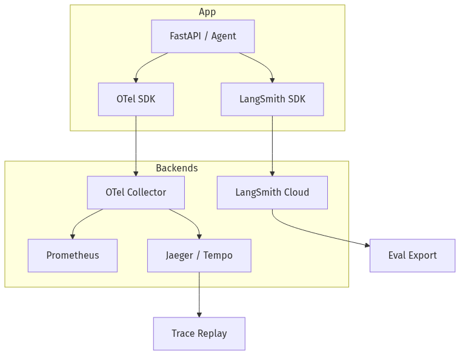
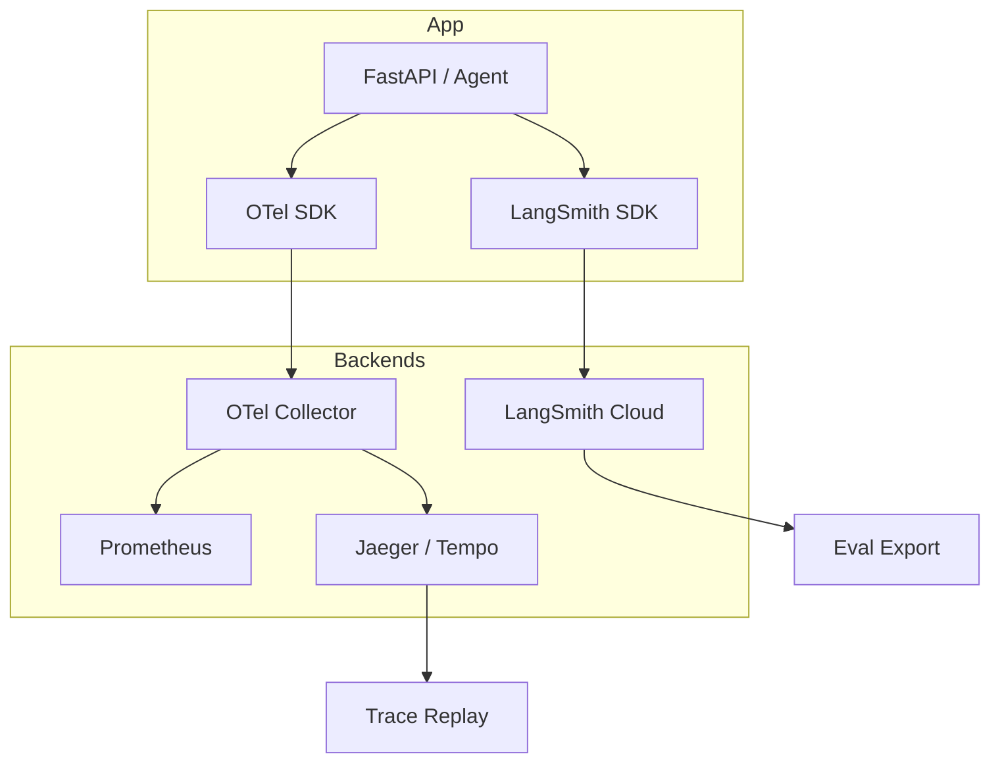
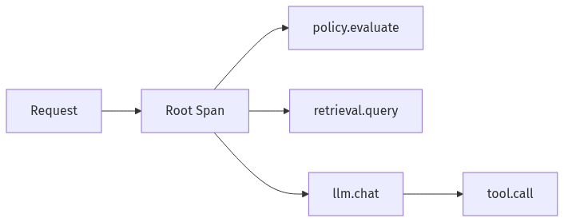
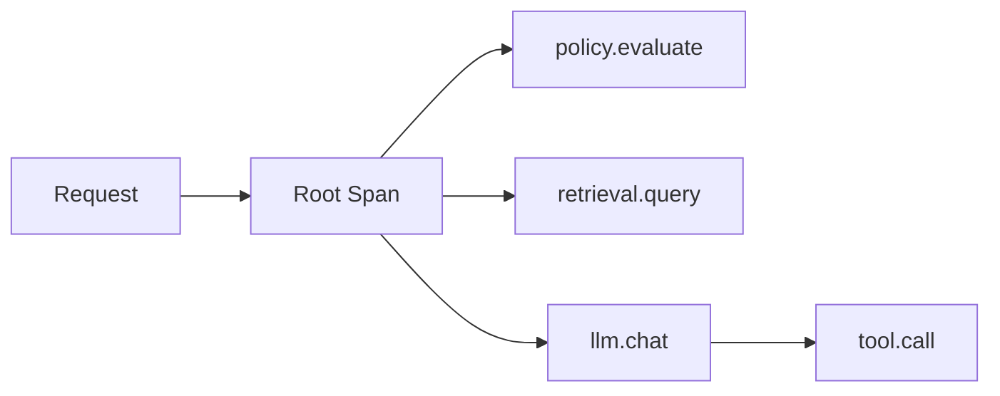
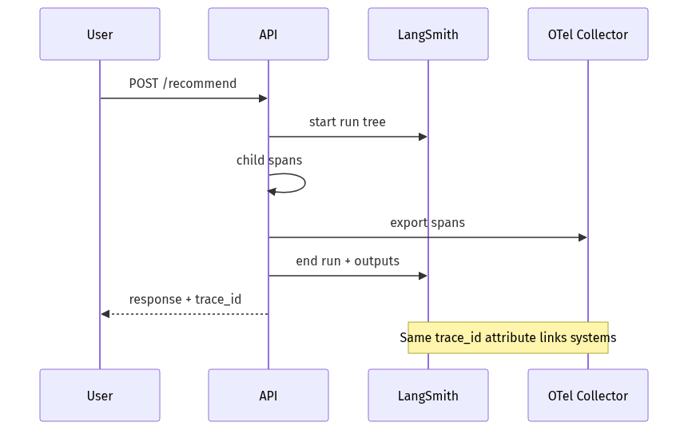
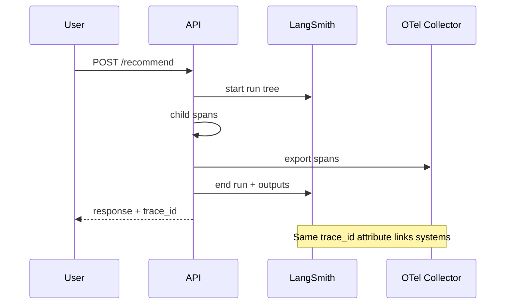

# 08-02 — Observability: LangSmith & OpenTelemetry

| Meta | Value |
|------|-------|
| **Estimated Time** | 5–6 hours (read 2h · lab 3h · trace schema design 1h) |
| **Difficulty** | Intermediate (tracing) · Advanced (cross-service LLM APM) |
| **Prerequisites** | [03-01](../03-Agentic-Fundamentals/03-01-Agent-Anatomy-and-Loop.md) · [08-01](08-01-Evaluation-Lifecycle.md) · basic logging literacy |
| **Module** | 08 — Evaluation & LLMOps |
| **Related** | [08-03](08-03-Guardrails-Ship-Criteria.md) · [07-03](../07-Protocols-MCP-A2A/07-03-Negotiation-Async-Workflows.md) · [06-01](../06-Conversational-Multimodal/06-01-Voice-ASR-TTS-Pipelines.md) · [10-01](../10-Production-Infrastructure/10-01-FastAPI-AI-Backends.md) |

---

## Learning Objectives

By the end of this chapter you will be able to:

1. Instrument LLM apps with **LangSmith traces** for prompts, tools, and retrievals.
2. Apply **OpenTelemetry** spans across model, tool, and MCP/A2A boundaries.
3. Define **metrics** that matter: TTFT, tokens, cost, tool error rate, task success.
3. **Replay** production traces in staging for debugging and eval mining.
4. Design a **trace schema** that survives multi-agent and voice pipelines.

---

## Why This Topic Matters

Without traces, “the agent felt dumber yesterday” is unactionable. Observability turns probabilistic systems into **debuggable distributed systems**—required for on-call, compliance, and eval mining.

Staff interview:

> “Show me a trace_id and I’ll tell you whether the bug is retrieval, tool, or model.”

LangSmith: [docs.smith.langchain.com](https://docs.smith.langchain.com/) · OpenTelemetry: [opentelemetry.io/docs](https://opentelemetry.io/docs/)

---

## Business Impact

| Outcome | Observability |
|---------|---------------|
| **MTTR** | Minutes not days |
| **Cost attribution** | Per feature / customer |
| **Quality loops** | Export failures → golden sets |
| **Audit** | Reconstruct decision path |

---

## Architecture Overview





---

## Core Concepts

### 1) Traces, Spans, and Runs

| Term | LLM context |
|------|-------------|
| **Trace** | One user request end-to-end |
| **Span** | Sub-step: embed, retrieve, llm, tool |
| **LangSmith Run** | First-class LLM run tree with inputs/outputs |

#### Standard span names

`llm.chat`, `retrieval.query`, `tool.call`, `mcp.tool`, `a2a.delegate`, `asr.transcribe`, `tts.synthesize`

---

### 2) LangSmith Tracing

#### What to capture

- Prompt template version + variables (redacted)
- Model name, tokens, latency
- Tool inputs/outputs (hashed if sensitive)
- Retrieval chunks + scores
- Feedback scores linked to run id

#### Enable (LangChain / LangGraph)

```python
import os
os.environ["LANGCHAIN_TRACING_V2"] = "true"
os.environ["LANGCHAIN_API_KEY"] = "..."
os.environ["LANGCHAIN_PROJECT"] = "retention-agent-prod"
```

#### Non-LangChain

Use LangSmith **RunTree** API or `@traceable` decorator from `langsmith`.

Cross-link: [08-01 Evaluation](../08-Evaluation-LLMOps/08-01-Evaluation-Lifecycle.md)

---

### 3) OpenTelemetry for LLM Apps

#### Why OTel when LangSmith exists?

| LangSmith | OTel |
|-----------|------|
| LLM-native UX | Unified with infra APM |
| LangChain ecosystem | Vendor-neutral |
| Eval datasets | K8s + DB + LLM one trace |

Use **both**: LangSmith for LLM dev loop; OTel for platform SRE.

#### Semantic conventions

Follow emerging **GenAI semantic conventions** (`gen_ai.system`, `gen_ai.request.model`, `gen_ai.usage.input_tokens`).

---

### 4) Metrics (Not Just Logs)

| Metric | Type | Use |
|--------|------|-----|
| `llm_ttft_ms` | histogram | UX SLO |
| `llm_tokens_total` | counter | Cost |
| `tool_errors_total` | counter | Reliability |
| `rag_hit_rate` | gauge | Retrieval health |
| `task_success` | counter | Product KPI |

Derive **$/successful task** = cost metric / success counter.

---

### 5) Replay

#### Definition

**Replay** re-executes a stored trace’s inputs against a new build (prompt/model/RAG index).

#### Modes

| Mode | Action |
|------|--------|
| **Read-only replay** | Compare outputs in LangSmith experiment |
| **Partial replay** | From span `tool.call` onward |
| **Shadow** | Prod input duplicated to staging |

Cross-link: [07-03 Replay debugging](../07-Protocols-MCP-A2A/07-03-Negotiation-Async-Workflows.md)

---

## Implementation

### FastAPI agent with LangSmith + OpenTelemetry

```python
"""Instrumented retention agent — OTel spans + LangSmith traceable.

Run:
  pip install fastapi uvicorn openai opentelemetry-sdk opentelemetry-exporter-otlp langsmith
  export OTEL_EXPORTER_OTLP_ENDPOINT=http://localhost:4317
  uvicorn observability_agent:app --reload

Env:
  OPENAI_API_KEY=...
  LANGCHAIN_API_KEY=...
  LANGCHAIN_TRACING_V2=true
  LANGCHAIN_PROJECT=retention-lab
"""

from __future__ import annotations

import os
import time
import uuid
from contextlib import contextmanager
from typing import Any, Generator

from fastapi import FastAPI
from openai import OpenAI
from opentelemetry import trace
from opentelemetry.sdk.resources import Resource
from opentelemetry.sdk.trace import TracerProvider
from opentelemetry.sdk.trace.export import BatchSpanProcessor
from opentelemetry.exporter.otlp.proto.grpc.trace_exporter import OTLPSpanExporter
from pydantic import BaseModel

try:
    from langsmith import traceable
except ImportError:
    def traceable(*_a, **_k):  # type: ignore
        def deco(fn):
            return fn
        return deco


def setup_otel() -> trace.Tracer:
    resource = Resource.create({"service.name": "retention-agent"})
    provider = TracerProvider(resource=resource)
    if os.getenv("OTEL_EXPORTER_OTLP_ENDPOINT"):
        provider.add_span_processor(BatchSpanProcessor(OTLPSpanExporter()))
    trace.set_tracer_provider(provider)
    return trace.get_tracer("retention-agent")


tracer = setup_otel()
app = FastAPI()
client = OpenAI()


class Signals(BaseModel):
    customer_id: str
    complaints: int = 0


@traceable(name="policy_evaluate")
def evaluate_policy(signals: Signals) -> dict[str, Any]:
    with tracer.start_as_current_span("policy.evaluate") as span:
        span.set_attribute("customer_id", signals.customer_id)
        risk = "high" if signals.complaints >= 2 else "low"
        offer = "fee_waiver" if risk == "high" else "none"
        span.set_attribute("risk", risk)
        return {"risk": risk, "offer": offer}


@traceable(name="llm_draft")
def draft_message(customer_id: str, offer: str) -> str:
    with tracer.start_as_current_span("llm.chat") as span:
        t0 = time.perf_counter()
        resp = client.chat.completions.create(
            model="gpt-4.1-mini",
            messages=[
                {"role": "system", "content": "Short compliant retention draft."},
                {"role": "user", "content": f"customer={customer_id} offer={offer}"},
            ],
            max_tokens=80,
        )
        text = resp.choices[0].message.content or ""
        usage = resp.usage
        ttft_ms = int((time.perf_counter() - t0) * 1000)
        span.set_attribute("gen_ai.request.model", "gpt-4.1-mini")
        span.set_attribute("gen_ai.usage.input_tokens", usage.prompt_tokens if usage else 0)
        span.set_attribute("gen_ai.usage.output_tokens", usage.completion_tokens if usage else 0)
        span.set_attribute("llm.latency_ms", ttft_ms)
        return text


@app.post("/v1/recommend")
def recommend(signals: Signals) -> dict[str, Any]:
    trace_id = str(uuid.uuid4())
    with tracer.start_as_current_span("http.recommend") as root:
        root.set_attribute("trace_id", trace_id)
        decision = evaluate_policy(signals)
        draft = draft_message(signals.customer_id, decision["offer"]) if decision["offer"] != "none" else None
        return {"trace_id": trace_id, **decision, "draft": draft}
```

---

## Production Considerations

| Concern | Practice |
|---------|----------|
| **PII redaction** | Scrub before export to LangSmith |
| **Sampling** | 100% errors; 1–10% success at scale |
| **Retention** | 30–90 day TTL per policy |
| **Correlation** | Propagate `trace_id` to MCP/A2A |
| **Cardinality** | Avoid high-cardinality metric labels |

---

## Security

Traces contain prompts—**RBAC** on LangSmith projects; encrypt at rest; no secrets in span attributes.

Cross-link: [08-03 Guardrails](08-03-Guardrails-Ship-Criteria.md)

---

## Performance

Batch span export; async logging; don’t log full retrieval corpora inline—use refs.

---

## Cost

LangSmith + OTLP storage costs grow with span volume—sample and aggregate.

---

## Scalability

OTel Collector fan-out to multiple backends; tail-based sampling for errors.

---

## Failure Modes

| Failure | Mitigation |
|---------|------------|
| Broken trace context | W3C traceparent propagation |
| Missing tool span | Middleware wraps all tools |
| Log ≠ trace ids | Single `trace_id` generator |

---

## Observability

Meta-observability: monitor exporter queue depth, dropped spans.

---

## Debugging

| Step | Action |
|------|--------|
| 1 | Get `trace_id` from user report |
| 2 | Open LangSmith run tree |
| 3 | Find highest latency span |
| 4 | Diff prompt/version vs last good |
| 5 | Replay in experiment |

---

## Common Mistakes

1. Logging prompts to stdout only—no structure.
2. One giant span for whole agent.
3. No token/cost attributes.
4. OTel and LangSmith ids not correlated.
5. Infinite retention of PII traces.

---

## Tradeoffs

| Choice | Upside | Downside |
|--------|--------|----------|
| LangSmith only | Fast LLM UX | Silo from infra |
| OTel only | Unified | Less LLM-native |
| 100% trace sample | Complete | Expensive |
| Head sampling | Cheap | Miss rare bugs |

---

## Architecture Diagram





---

## Mermaid Diagram — Sequence





---

## Production Examples

| Pattern | Stack |
|---------|-------|
| LangGraph agent | LangSmith native |
| Custom FastAPI | OTel + RunTree |
| Voice bot | Spans per ASR/LLM/TTS ([06-01](../06-Conversational-Multimodal/06-01-Voice-ASR-TTS-Pipelines.md)) |

---

## Real Companies Using It (Public Patterns)

| Org | Tooling |
|-----|---------|
| **LangChain** | LangSmith product |
| **Honeycomb / Datadog** | OTel LLM integrations |
| **Arize / Phoenix** | ML observability |

---

## Hands-on Labs

### Lab A — Span waterfall (45 min)

Find dominant span in a 5-step agent trace.

### Lab B — Correlation (45 min)

Propagate W3C headers from API to mock MCP tool.

### Lab C — Replay (45 min)

Export 10 LangSmith runs → re-run as offline eval.

---

## Coding Assignments

1. Add **Prometheus** metrics exporter for token counters.
2. Wrap MCP `call_tool` with child spans.
3. Redaction middleware for `customer_id`.

---

## Mini Project

**Title:** Trace Explorer  
**Done when:** Given trace_id, CLI prints span tree + latencies.

---

## Production Project

**Title:** Unified LLM APM  
**Done when:** OTel → Grafana + LangSmith link + alert on p95 TTFT.

---

## Stretch Project

Tail-based sampling: always keep traces with `tool_errors > 0`.

---

## Interview Questions

### Senior Engineer

1. Trace vs span vs LangSmith run?
2. What LLM metrics go to Prometheus?
3. How propagate context into async workers?

### Staff Engineer

1. Design trace schema for multi-agent + MCP.
2. Replay prod trace safely in staging.
3. Sampling strategy at 10M req/day.

### Principal Engineer

1. Standardize observability for 15 LLM services.
2. Cost of full tracing vs business risk.
3. OpenTelemetry vs vendor lock-in.

### Engineering Manager

1. On-call runbook using traces?
2. DRI for LangSmith vs platform OTel?
3. Incident comms with trace evidence?

### Whiteboard

Draw span tree for RAG agent with failed reranker.

### Follow-ups

- eBPF vs SDK tracing?
- Cross-region trace gaps?
- GDPR delete in LangSmith?

---

## Revision Notes

- **LangSmith** for LLM iteration; **OTel** for platform APM.
- One **trace_id** everywhere (HTTP, MCP, A2A).
- Span **gen_ai.*** attributes for tokens/model.
- **Replay** traces into eval experiments.
- Sample smartly; **always** capture errors.

---

## Summary

Observability makes LLM systems **accountable**: LangSmith exposes prompt-level runs for builders; OpenTelemetry unifies LLM spans with infrastructure—together enabling metrics, alerts, and replay-driven quality loops.

---

## Further Reading

| Title | URL | Difficulty | Reading Time | Why Read | Important Sections |
|-------|-----|------------|--------------|----------|--------------------|
| LangSmith Docs | https://docs.smith.langchain.com/ | Intro | 40 min | Trace + eval | Tracing; datasets |
| LangSmith Tracing | https://docs.smith.langchain.com/tracing | Intermediate | 35 min | Setup | Projects; runs |
| OpenTelemetry Docs | https://opentelemetry.io/docs/ | Intermediate | 45 min | Platform APM | Concepts; SDK |
| OTel GenAI Semantics | https://opentelemetry.io/docs/specs/semconv/gen-ai/ | Advanced | 40 min | Standard attributes | Span names |
| OpenLLMetry | https://github.com/traceloop/openllmetry | Intermediate | 30 min | Auto-instrumentation | Integrations |

---

## Resume Bullet (after lab)

- Instrumented a **FastAPI LLM agent** with LangSmith run trees and OpenTelemetry spans (token usage, TTFT, tool children), enabling trace-linked replay into offline eval experiments.
