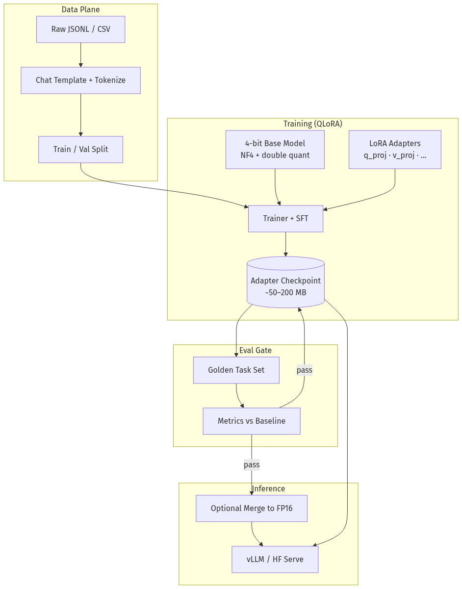
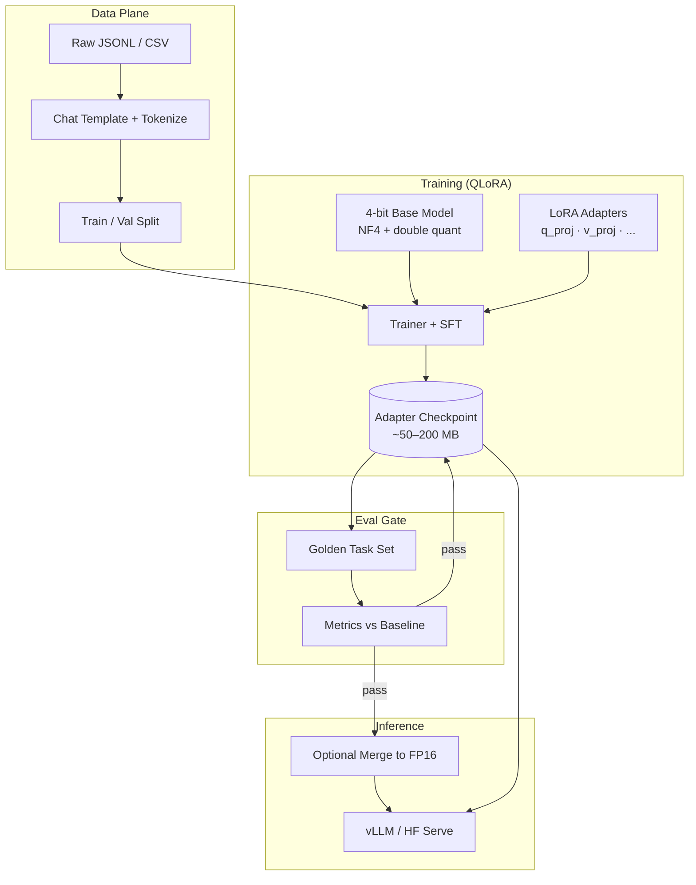
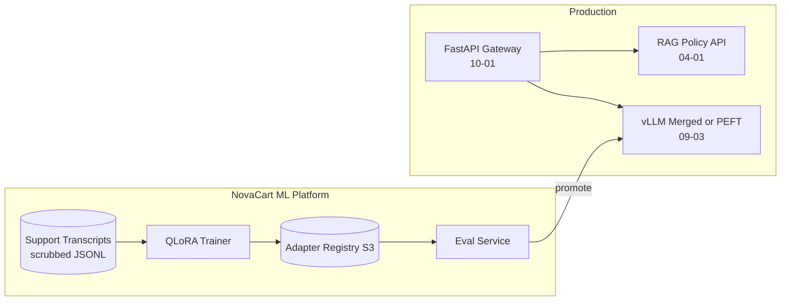
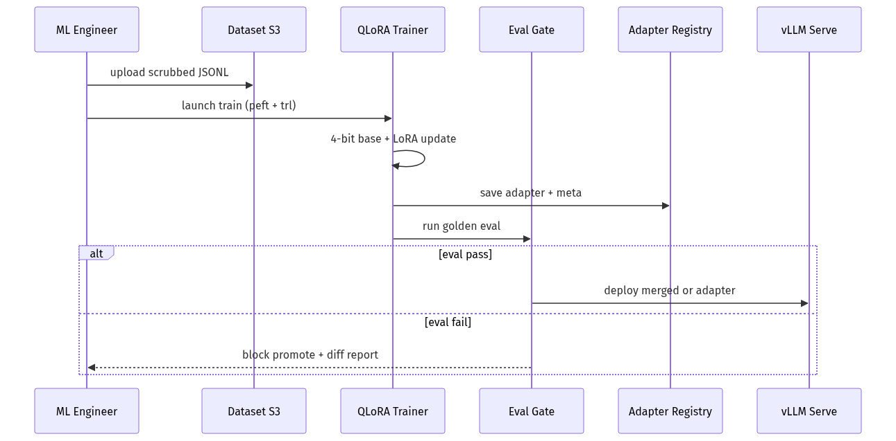
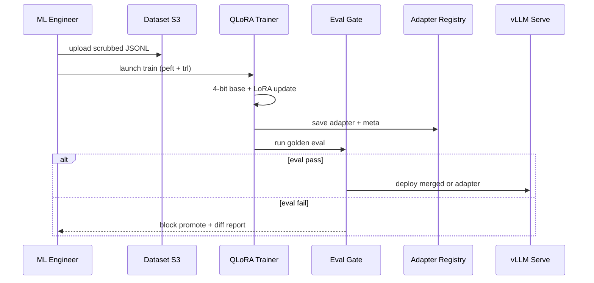

# 09-01 — PEFT, LoRA & QLoRA: Efficient Fine-Tuning for Production

| Meta | Value |
|------|-------|
| **Estimated Time** | 6–7 hours (read 2.5h · lab 3h · hyperparameter memo 1h) |
| **Difficulty** | Intermediate (concepts) · Advanced (QLoRA on consumer GPUs & eval gates) |
| **Prerequisites** | [01-01 Transformer Architecture](../01-LLM-Engineering/01-01-Transformer-Architecture.md) · [01-03 Inference Serving vLLM](../01-LLM-Engineering/01-03-Inference-Serving-vLLM.md) · PyTorch basics |
| **Module** | 09 — Fine-Tuning |
| **Related** | [09-02 Prompting vs RAG vs FT](09-02-Prompting-vs-RAG-vs-FineTuning.md) · [09-03 Serving FT Models](09-03-Serving-Integrating-FineTuned-Models.md) · [04-01 RAG Architecture](../04-RAG/04-01-RAG-Architecture.md) · [08-01 Evaluation Lifecycle](../08-Evaluation-LLMOps/08-01-Evaluation-Lifecycle.md) · [10-04 Cost & Latency](../10-Production-Infrastructure/10-04-Cost-Latency-Optimization.md) · [Architecture Index](../../Architecture Index.md) |

---

## Learning Objectives

By the end of this chapter you will be able to:

1. Explain **full fine-tuning** vs **Parameter-Efficient Fine-Tuning (PEFT)** and why PEFT is the default for most product teams.
2. Derive the **LoRA** low-rank update intuition from the [Hu et al., 2021](https://arxiv.org/abs/2106.09685) paper and choose `r`, `alpha`, and target modules.
3. Run **QLoRA** training on a single GPU using 4-bit base weights + LoRA adapters via [Hugging Face PEFT](https://huggingface.co/docs/peft/index).
4. Prepare **instruction datasets** with chat templates and train/val splits that match production inference format.
5. Evaluate fine-tunes with **task-specific golden sets** before merge or deploy ([08-01](../08-Evaluation-LLMOps/08-01-Evaluation-Lifecycle.md)).
6. Merge or serve **adapter-only artifacts** and understand VRAM implications at inference ([09-03](09-03-Serving-Integrating-FineTuned-Models.md)).

---

## Why This Topic Matters

Most teams reach for fine-tuning too early — but when the decision is correct, **how** you fine-tune determines whether you ship in a week or burn a GPU cluster for marginal gains.

**Full fine-tuning** updates every weight in a 7B–70B model. It demands multi-GPU setups, risks catastrophic forgetting, and produces multi-GB checkpoints that are painful to version and serve.

**PEFT (LoRA / QLoRA)** trains tiny adapter matrices (often <1% of parameters) while freezing the base model. QLoRA loads the base in **4-bit NF4** and trains adapters in higher precision — making 7B–13B instruction tuning feasible on a **single 24GB GPU**.

A Staff engineer who cannot explain LoRA rank tradeoffs will:

- overspend on full FT when RAG or prompting would suffice ([09-02](09-02-Prompting-vs-RAG-vs-FineTuning.md)),
- pick `r=256` everywhere and wonder why adapters overfit,
- merge adapters without regression eval and break tool-calling in production,
- and fail interviews that ask "fine-tune NovaCart's support tone on one A100."

This chapter is the **technical foundation** for Module 09; serving and integration follow in [09-03](09-03-Serving-Integrating-FineTuned-Models.md).

---

## Business Impact

| Business outcome | How PEFT/LoRA moves the needle |
|------------------|--------------------------------|
| **Time-to-ship** | Days on one GPU vs weeks on a multi-GPU full FT cluster |
| **Iteration cost** | Adapter checkpoints are MBs — cheap A/B and rollback |
| **Specialization** | Per-tenant or per-locale adapters without duplicating base weights |
| **Risk containment** | Base model frozen — easier to compare against baseline |
| **Serving economics** | Merge for latency or hot-swap adapters — see [09-03](09-03-Serving-Integrating-FineTuned-Models.md) |

**NovaCart scenario:** Support replies must match brand voice ("warm, concise, never promise refunds outside policy") while **policy facts** still come from RAG ([04-01](../04-RAG/04-01-RAG-Architecture.md)). LoRA fine-tunes **style and format**; RAG supplies **truth**.

---

## Architecture Overview





Cross-links: decision framework [09-02](09-02-Prompting-vs-RAG-vs-FineTuning.md); deployment [09-03](09-03-Serving-Integrating-FineTuned-Models.md); inference stack [01-03](../01-LLM-Engineering/01-03-Inference-Serving-vLLM.md).

---

## Core Concepts

### 1) Full Fine-Tuning vs PEFT

#### Definition

| Approach | What updates | Typical checkpoint | GPU need |
|----------|--------------|-------------------|----------|
| **Full FT** | All parameters | Full model (7B ≈ 14GB FP16) | Multi-GPU for 7B+ |
| **PEFT / LoRA** | Small adapter weights | Adapter only (MBs) | Single GPU common |
| **QLoRA** | LoRA adapters; base frozen in 4-bit | Adapter + quant config | 1× 24GB for 7B–13B |

#### Intuition

Full FT rewrites the entire textbook. LoRA adds **sticky notes** on specific chapters (attention projections). The base knowledge stays intact; adapters specialize behavior.

#### When to use full FT

- Domain shift so large that LoRA capacity is insufficient (rare for instruction/style tasks).
- You own the pretraining stack and have multi-node budget.
- Research setting requiring weight-level control.

#### When NOT to use full FT

- Brand tone, JSON output shape, classification heads.
- When RAG or prompting solves the problem ([09-02](09-02-Prompting-vs-RAG-vs-FineTuning.md)).
- Small teams without MLOps for multi-GB artifact pipelines.

---

### 2) LoRA — Low-Rank Adaptation

**Paper:** [LoRA: Low-Rank Adaptation of Large Language Models](https://arxiv.org/abs/2106.09685)

#### Definition

For a frozen weight matrix \(W \in \mathbb{R}^{d \times k}\), LoRA adds a trainable update \(\Delta W = BA\) where \(B \in \mathbb{R}^{d \times r}\), \(A \in \mathbb{R}^{r \times k}\), and **rank** \(r \ll \min(d,k)\).

Forward pass: \(h = W x + \frac{\alpha}{r} B A x\)

#### Key hyperparameters

| Param | Meaning | Starting point |
|-------|---------|----------------|
| **`r` (rank)** | Adapter capacity | 8–64; start 16 for chat |
| **`lora_alpha`** | Scaling of update | Often 2× `r` (e.g. r=16, alpha=32) |
| **`target_modules`** | Which layers get adapters | `q_proj,v_proj` or all linear in MLP |
| **`lora_dropout`** | Regularization | 0.05–0.1 |
| **`bias`** | Train biases | Usually `"none"` |

#### Intuition

Attention layers have **low intrinsic rank** for many downstream tasks — a small \(r\) captures most of the adaptation signal without touching every weight.

#### Interview one-liner

> "LoRA freezes the base model and learns a low-rank delta on selected projections — trading a tiny fraction of parameters for most of the task gain."

---

### 3) QLoRA — 4-Bit Base + LoRA

**Paper:** [QLoRA: Efficient Finetuning of Quantized LLMs](https://arxiv.org/abs/2305.14314)

#### Definition

QLoRA combines:

- **4-bit NormalFloat (NF4)** quantization of frozen base weights,
- **Double quantization** of quant constants,
- **Paged optimizers** (e.g. paged AdamW) to avoid OOM spikes,
- **LoRA adapters** trained in BF16/FP16 on top.

#### When to use QLoRA

- Single GPU (4090, A10, L4, 24GB M-series via cloud).
- 7B–13B instruction tuning with <50k examples.
- Rapid adapter experiments before committing merge.

#### When NOT to use QLoRA

- You already have multi-GPU BF16 full FT infrastructure and need maximum quality on huge data.
- Task requires fragile numeric reasoning where 4-bit base + small r underperforms — eval will tell you ([08-01](../08-Evaluation-LLMOps/08-01-Evaluation-Lifecycle.md)).

---

### 4) Hugging Face PEFT Library

**Docs:** [https://huggingface.co/docs/peft/index](https://huggingface.co/docs/peft/index)

PEFT unifies LoRA, AdaLoRA, IA³, prefix tuning, and prompt tuning behind a common API:

```python
from peft import LoraConfig, get_peft_model, TaskType

config = LoraConfig(
    task_type=TaskType.CAUSAL_LM,
    r=16,
    lora_alpha=32,
    lora_dropout=0.05,
    target_modules=["q_proj", "v_proj", "k_proj", "o_proj"],
    bias="none",
)
model = get_peft_model(base_model, config)
model.print_trainable_parameters()
# trainable params: ~0.5–2% of total
```

Other PEFT methods (high level):

| Method | Idea | When |
|--------|------|------|
| **LoRA** | Low-rank deltas | Default for LLM SFT |
| **IA³** | Scale activations | Very parameter-efficient |
| **Prefix / Prompt tuning** | Soft prompts | Embedding-only tuning |
| **AdaLoRA** | Adaptive rank budget | Research / uneven capacity |

---

### 5) Dataset Preparation for Instruction Tuning

#### Format

Match **exact chat template** used at inference (Llama-3, Mistral, Qwen templates differ).

```json
{"messages": [
  {"role": "system", "content": "You are NovaCart support. Be warm and concise."},
  {"role": "user", "content": "Where is my order?"},
  {"role": "assistant", "content": "I'd be happy to help track that — please share your order ID."}
]}
```

#### Rules

1. **Train on assistant tokens only** (mask user/system in loss).
2. Hold out **10–15% val** with edge cases (refusals, escalations).
3. Do **not** embed volatile policy facts in SFT — use RAG ([04-01](../04-RAG/04-01-RAG-Architecture.md)).
4. Balance classes (refusal vs helpful) to avoid collapse to always-refuse.

---

### 6) Hyperparameter Strategy

| Knob | Too low | Too high |
|------|---------|----------|
| `r` | Underfits tone | Overfits; memorizes train set |
| Epochs | Underfits | Catastrophic forgetting of base skills |
| LR (1e-4 – 2e-4 typical) | Slow convergence | Unstable loss; broken JSON |
| Batch size | Noisy gradients | OOM; use grad accumulation |

**Staff move:** Tune on val loss + **task eval**, not loss alone.

---

## Implementation

### Stack

```text
JSONL dataset → tokenize (SFTTrainer) → QLoRA train → adapter save → eval → serve
```

### Step 1 — Environment

```bash
pip install "transformers>=4.40" "peft>=0.11" "bitsandbytes>=0.43" \
  "datasets>=2.19" "accelerate>=0.30" "trl>=0.9" "evaluate>=0.4"
```

### Step 2 — Production-shaped QLoRA training script

```python
"""NovaCart support tone QLoRA fine-tune (single GPU).

Usage:
  export MODEL_ID=meta-llama/Meta-Llama-3-8B-Instruct
  export TRAIN_JSONL=./data/novacart_support_train.jsonl
  export OUTPUT_DIR=./adapters/novacart-tone-v1
  python train_qlora.py

Requires: CUDA GPU with >=24GB for 8B (or use smaller model).
"""

from __future__ import annotations

import json
import os
from dataclasses import dataclass
from pathlib import Path
from typing import Any

import torch
from datasets import Dataset
from peft import LoraConfig, TaskType, get_peft_model, prepare_model_for_kbit_training
from transformers import (
    AutoModelForCausalLM,
    AutoTokenizer,
    BitsAndBytesConfig,
    TrainingArguments,
)
from trl import SFTTrainer, DataCollatorForCompletionOnlyLM


MODEL_ID = os.getenv("MODEL_ID", "meta-llama/Meta-Llama-3-8B-Instruct")
TRAIN_JSONL = Path(os.getenv("TRAIN_JSONL", "./data/novacart_support_train.jsonl"))
OUTPUT_DIR = Path(os.getenv("OUTPUT_DIR", "./adapters/novacart-tone-v1"))
MAX_SEQ_LEN = int(os.getenv("MAX_SEQ_LEN", "2048"))


@dataclass(frozen=True)
class TrainConfig:
    lora_r: int = 16
    lora_alpha: int = 32
    lora_dropout: float = 0.05
    learning_rate: float = 2e-4
    num_train_epochs: float = 2.0
    per_device_batch_size: int = 2
    gradient_accumulation_steps: int = 8
    warmup_ratio: float = 0.03
    weight_decay: float = 0.01


def load_jsonl_messages(path: Path) -> list[dict[str, Any]]:
    rows: list[dict[str, Any]] = []
    with path.open(encoding="utf-8") as f:
        for line in f:
            line = line.strip()
            if line:
                rows.append(json.loads(line))
    return rows


def format_chat(tokenizer, messages: list[dict[str, str]]) -> str:
    return tokenizer.apply_chat_template(
        messages,
        tokenize=False,
        add_generation_prompt=False,
    )


def build_dataset(tokenizer, rows: list[dict[str, Any]]) -> Dataset:
    texts = [format_chat(tokenizer, row["messages"]) for row in rows]
    return Dataset.from_dict({"text": texts})


def main() -> None:
    cfg = TrainConfig()
    rows = load_jsonl_messages(TRAIN_JSONL)
    split_idx = max(1, int(len(rows) * 0.9))
    train_rows, val_rows = rows[:split_idx], rows[split_idx:]

    bnb_config = BitsAndBytesConfig(
        load_in_4bit=True,
        bnb_4bit_quant_type="nf4",
        bnb_4bit_compute_dtype=torch.bfloat16,
        bnb_4bit_use_double_quant=True,
    )

    tokenizer = AutoTokenizer.from_pretrained(MODEL_ID, use_fast=True)
    if tokenizer.pad_token is None:
        tokenizer.pad_token = tokenizer.eos_token

    model = AutoModelForCausalLM.from_pretrained(
        MODEL_ID,
        quantization_config=bnb_config,
        device_map="auto",
        torch_dtype=torch.bfloat16,
    )
    model = prepare_model_for_kbit_training(model, use_gradient_checkpointing=True)

    lora_config = LoraConfig(
        task_type=TaskType.CAUSAL_LM,
        r=cfg.lora_r,
        lora_alpha=cfg.lora_alpha,
        lora_dropout=cfg.lora_dropout,
        target_modules=["q_proj", "k_proj", "v_proj", "o_proj", "gate_proj", "up_proj", "down_proj"],
        bias="none",
    )
    model = get_peft_model(model, lora_config)
    model.print_trainable_parameters()

    train_ds = build_dataset(tokenizer, train_rows)
    val_ds = build_dataset(tokenizer, val_rows)

    # Mask loss to assistant completions only (Llama-3 template)
    response_template = "<|start_header_id|>assistant<|end_header_id|>\n\n"
    collator = DataCollatorForCompletionOnlyLM(
        response_template=response_template,
        tokenizer=tokenizer,
        mlm=False,
    )

    training_args = TrainingArguments(
        output_dir=str(OUTPUT_DIR),
        num_train_epochs=cfg.num_train_epochs,
        per_device_train_batch_size=cfg.per_device_batch_size,
        per_device_eval_batch_size=cfg.per_device_batch_size,
        gradient_accumulation_steps=cfg.gradient_accumulation_steps,
        learning_rate=cfg.learning_rate,
        warmup_ratio=cfg.warmup_ratio,
        weight_decay=cfg.weight_decay,
        logging_steps=10,
        eval_strategy="epoch",
        save_strategy="epoch",
        load_best_model_at_end=True,
        metric_for_best_model="eval_loss",
        bf16=True,
        optim="paged_adamw_8bit",
        report_to="none",
        max_grad_norm=0.3,
    )

    trainer = SFTTrainer(
        model=model,
        args=training_args,
        train_dataset=train_ds,
        eval_dataset=val_ds,
        dataset_text_field="text",
        max_seq_length=MAX_SEQ_LEN,
        data_collator=collator,
        packing=False,
    )

    trainer.train()
    trainer.save_model(str(OUTPUT_DIR))
    tokenizer.save_pretrained(str(OUTPUT_DIR))

    meta = {
        "base_model": MODEL_ID,
        "lora_r": cfg.lora_r,
        "lora_alpha": cfg.lora_alpha,
        "train_examples": len(train_rows),
        "val_examples": len(val_rows),
    }
    (OUTPUT_DIR / "training_meta.json").write_text(json.dumps(meta, indent=2), encoding="utf-8")
    print(f"Saved adapter to {OUTPUT_DIR}")


if __name__ == "__main__":
    main()
```

### Step 3 — Inference smoke test (adapter loaded)

```python
"""Load base + LoRA adapter for local inference smoke test."""

import os
import torch
from peft import PeftModel
from transformers import AutoModelForCausalLM, AutoTokenizer, BitsAndBytesConfig

BASE = os.getenv("MODEL_ID", "meta-llama/Meta-Llama-3-8B-Instruct")
ADAPTER = os.getenv("ADAPTER_DIR", "./adapters/novacart-tone-v1")

bnb = BitsAndBytesConfig(load_in_4bit=True, bnb_4bit_quant_type="nf4")

tokenizer = AutoTokenizer.from_pretrained(BASE)
base = AutoModelForCausalLM.from_pretrained(
    BASE, quantization_config=bnb, device_map="auto", torch_dtype=torch.bfloat16
)
model = PeftModel.from_pretrained(base, ADAPTER)
model.eval()

messages = [
    {"role": "system", "content": "You are NovaCart support. Be warm and concise."},
    {"role": "user", "content": "My package arrived damaged."},
]
prompt = tokenizer.apply_chat_template(messages, tokenize=False, add_generation_prompt=True)
inputs = tokenizer(prompt, return_tensors="pt").to(model.device)

with torch.no_grad():
    out = model.generate(**inputs, max_new_tokens=150, temperature=0.3, do_sample=True)

print(tokenizer.decode(out[0], skip_special_tokens=True))
```

### Step 4 — Optional merge for vLLM serving

```python
"""Merge LoRA into base weights for FP16/BF16 serving (see 09-03)."""

from peft import PeftModel
from transformers import AutoModelForCausalLM, AutoTokenizer
import torch

base_id = "meta-llama/Meta-Llama-3-8B-Instruct"
adapter_dir = "./adapters/novacart-tone-v1"
merged_dir = "./merged/novacart-tone-v1-bf16"

base = AutoModelForCausalLM.from_pretrained(
    base_id, torch_dtype=torch.bfloat16, device_map="cpu"
)
model = PeftModel.from_pretrained(base, adapter_dir)
merged = model.merge_and_unload()
merged.save_pretrained(merged_dir)
AutoTokenizer.from_pretrained(base_id).save_pretrained(merged_dir)
print(f"Merged model saved to {merged_dir}")
```

Deploy merged weights via [01-03 vLLM](../01-LLM-Engineering/01-03-Inference-Serving-vLLM.md) or adapter hot-swap per [09-03](09-03-Serving-Integrating-FineTuned-Models.md).

---

## Production Considerations

| Concern | Practice |
|---------|----------|
| Base model license | Verify Llama/Mistral commercial terms before FT |
| Reproducibility | Pin `transformers`, `peft`, `bitsandbytes`, base revision |
| Eval gate | Block promote if golden set regresses vs base ([08-01](../08-Evaluation-LLMOps/08-01-Evaluation-Lifecycle.md)) |
| Data hygiene | PII scrub before JSONL; audit for injection samples |
| Adapter versioning | Semantic version + `training_meta.json` |
| Merge vs adapter | Merge = simpler serve; adapters = multi-tenant swap |

---

## Security

| Threat | Control |
|--------|---------|
| Poisoned training rows | Source control + human review + dedup |
| Credential leakage in JSONL | Secret scan in CI |
| Overfitting to jailbreak patterns | Refusal examples in train; red-team eval |
| Model artifact theft | Private HF repo / signed S3; IAM |

Prompt injection at inference: [11-02](../11-Security-Safety/11-02-Prompt-Injection-Defense.md).

---

## Performance

| Phase | Bottleneck | Tip |
|-------|------------|-----|
| Training | GPU memory | QLoRA + grad checkpointing + paged optim |
| Training | IO | Cache tokenized dataset on local SSD |
| Inference (adapter) | Two weight sets | Merge for prod latency |
| Inference (merged) | Same as base | Quantize merged model AWQ for vLLM |

---

## Cost

| Lever | Effect |
|-------|--------|
| QLoRA vs full FT | 1 GPU vs 4–8 GPUs |
| Small `r` | Faster train; may need retry if underfit |
| Spot instances | 60–70% cheaper train runs; checkpoint often |
| Adapter-only artifacts | Pennies storage vs full model |

Breakeven vs prompting/RAG: [09-02](09-02-Prompting-vs-RAG-vs-FineTuning.md) · unit economics [10-04](../10-Production-Infrastructure/10-04-Cost-Latency-Optimization.md).

---

## Scalability

| Pattern | Scale approach |
|---------|----------------|
| Many tenants | One base + N adapters; route by tenant_id |
| Large datasets | Streaming dataset; multi-GPU DDP with QLoRA |
| Train fleet | Ray Train ([10-03](../10-Production-Infrastructure/10-03-Redis-Kafka-Ray.md)) for hyperparam sweeps |

---

## Failure Modes

| Failure | Symptom | Mitigation |
|---------|---------|------------|
| Overfit | Perfect train, bad val | Lower r/epochs; more data |
| Catastrophic forgetting | Base skills break | Mix general instructions in data |
| Template mismatch | Gibberish at serve | Same chat template train/infer |
| Quant + fragile JSON | Tool calls break | Eval tool schema; try BF16 merge |
| Policy in weights | Stale answers | Keep facts in RAG, tone in LoRA |

---

## Observability

Log per training run: `run_id`, `base_model_sha`, `lora_r`, `train_loss`, `val_loss`, `eval_task_scores`, `gpu_hours`, `dataset_hash`.

---

## Debugging

| Question | Where to look |
|----------|---------------|
| OOM during train? | Batch size, seq len, disable packing |
| Loss not decreasing? | LR, template masking, bad data |
| Adapter no effect? | Target modules, r too low, wrong layers |
| Worse than base on eval? | Overfit; revert adapter version |

---

## Common Mistakes

1. Fine-tuning **facts** that change weekly instead of RAG.
2. Training on **full conversations** without masking user tokens.
3. Skipping **eval** before merge/deploy.
4. Using `r=128` "to be safe" on 2k examples.
5. Ignoring **chat template** differences across model families.
6. Full FT on 7B because "it's simpler" — ops cost explodes.

---

## Tradeoffs

| Choice | Upside | Downside |
|--------|--------|----------|
| LoRA vs full FT | Cheap, fast, reversible | Capacity ceiling |
| QLoRA vs BF16 LoRA | 1 GPU | Slight quality risk |
| High r | More capacity | Overfit |
| Merge vs adapter serve | Simpler inference | N adapters → N merges |
| SFT only vs RLHF/DPO | Simple pipeline | Alignment gaps for safety |

---

## Architecture Diagram



---

## Mermaid Diagram — Sequence





---

## Production Examples

| Pattern | Stack | Lesson |
|---------|-------|--------|
| Brand tone bot | QLoRA 8B + RAG policies | Style in weights, facts in retrieval |
| Multi-locale | Shared base + locale adapters | Hot-swap by `Accept-Language` |
| Tool format SFT | LoRA on JSON-heavy examples | Eval parse rate, not BLEU |
| Classifier head | LoRA on last layers | Cheaper than full FT for intent |

---

## Real Companies Using It (Public Patterns)

| Org | Public pattern | Lesson |
|-----|----------------|--------|
| **Hugging Face** | PEFT library + model hub adapters | Adapters as first-class artifacts |
| **Meta** | Llama fine-tuning guides with LoRA | Open ecosystem default |
| **Databricks** | Mosaic ML / LoRA training docs | Enterprise FT pipelines |
| **Anyscale** | Ray + HF training | Scale sweeps, not always full FT |

---

## Hands-on Labs

### Lab A — Train NovaCart tone adapter (90 min)

Run `train_qlora.py` on 500 synthetic support pairs. Compare base vs adapter on 10 held-out prompts.

### Lab B — Rank sweep (45 min)

Train `r=8,16,64` with fixed data. Plot val loss and manual tone scores.

### Lab C — Merge and serve (60 min)

Merge adapter; load in vLLM per [09-03](09-03-Serving-Integrating-FineTuned-Models.md).

---

## Coding Assignments

1. Add **W&B or MLflow** logging for loss curves and hyperparams.
2. Implement **early stopping** on task eval metric, not loss alone.
3. Build **dataset validator** rejecting rows missing assistant turn.
4. Script **A/B inference** base vs adapter with same prompts.

---

## Mini Project

**Title:** NovaCart Tone Adapter v0  
**Done when:** QLoRA adapter trains on JSONL; smoke inference works; val loss logged; README documents env vars.

---

## Production Project

**Title:** Adapter Registry + Eval Gate  
**Done when:** S3 versioning for adapters; CI runs golden eval ([08-01](../08-Evaluation-LLMOps/08-01-Evaluation-Lifecycle.md)); promote only on pass; deploy doc in [09-03](09-03-Serving-Integrating-FineTuned-Models.md).

---

## Stretch Project

Train **per-department adapters** (support vs sales) on shared base; build FastAPI router selecting adapter by header — foreshadows [10-01](../10-Production-Infrastructure/10-01-FastAPI-AI-Backends.md).

---

## Interview Questions

### Senior Engineer

1. What is LoRA and why does low rank work?
2. What does QLoRA add beyond LoRA?
3. Which tokens should contribute to the loss in SFT?

### Staff Engineer

1. Choose `r`, `alpha`, and target modules for a tone task on 5k examples.
2. Why keep policy facts in RAG instead of the fine-tune set?
3. Merge vs serve adapters — latency and ops tradeoffs?
4. How do you detect catastrophic forgetting before deploy?

### Principal Engineer

1. Design NovaCart's fine-tune platform (data, train, eval, registry, serve).
2. When is full fine-tuning justified over LoRA?
3. Multi-tenant adapter strategy on one vLLM fleet.
4. How do fine-tune eval gates integrate with LLMOps ([08-01](../08-Evaluation-LLMOps/08-01-Evaluation-Lifecycle.md))?

### Engineering Manager

1. What headcount for FT platform vs using vendor APIs?
2. KPIs for fine-tune program success?
3. How do you prioritize RAG vs FT requests from product?

### Whiteboard

Draw LoRA forward pass: frozen W, trainable B and A, rank r.

### Follow-ups

- What if val loss improves but customer CSAT drops?
- What if license forbids distillation from API outputs into train set?
- What if adapter works in BF16 merge but fails in 4-bit serve?

---

## Revision Notes

- **PEFT/LoRA** = default efficient FT; **QLoRA** = single-GPU practical.
- Paper: [LoRA arXiv:2106.09685](https://arxiv.org/abs/2106.09685); library: [HF PEFT](https://huggingface.co/docs/peft/index).
- **Tone/format in LoRA; facts in RAG** ([04-01](../04-RAG/04-01-RAG-Architecture.md)).
- Always **eval before promote** ([08-01](../08-Evaluation-LLMOps/08-01-Evaluation-Lifecycle.md)).
- Serving path: [09-03](09-03-Serving-Integrating-FineTuned-Models.md) · decision tree: [09-02](09-02-Prompting-vs-RAG-vs-FineTuning.md).

---

## Summary

PEFT with LoRA and QLoRA makes fine-tuning **affordable and reversible** for most product specialization. Freeze the base, train tiny adapters on instruction data that matches production chat templates, and gate promotion with task eval — not training loss alone. NovaCart's pattern: LoRA for **how** the model speaks; RAG for **what** is true. Merge or hot-swap adapters at serve time per [09-03](09-03-Serving-Integrating-FineTuned-Models.md).

---

## Further Reading

| Title | URL | Difficulty | Reading Time | Why Read | Important Sections |
|-------|-----|------------|--------------|----------|--------------------|
| Hugging Face PEFT | https://huggingface.co/docs/peft/index | Intermediate | 45 min | Official API for LoRA/adapters | Quickstart; LoRA config |
| LoRA paper | https://arxiv.org/abs/2106.09685 | Advanced | 45 min | Primary low-rank intuition | §3 Method; §4 Experiments |
| QLoRA paper | https://arxiv.org/abs/2305.14314 | Advanced | 45 min | 4-bit + adapter training | NF4; double quant |
| TRL SFTTrainer | https://huggingface.co/docs/trl/sft_trainer | Intermediate | 30 min | Production training loop | Completion-only loss |
| bitsandbytes | https://github.com/TimDettmers/bitsandbytes | Intermediate | 20 min | 4-bit load details | NF4 usage |
| Serving FT models (handbook) | [09-03](09-03-Serving-Integrating-FineTuned-Models.md) | Intermediate | 45 min | Merge vs adapter deploy | vLLM integration |
| vLLM docs | https://docs.vllm.ai/en/latest/ | Intermediate | 30 min | Inference after merge | LoRA requests |
| Eval lifecycle (handbook) | [08-01](../08-Evaluation-LLMOps/08-01-Evaluation-Lifecycle.md) | Intermediate | 30 min | Promote gates | Golden sets |
