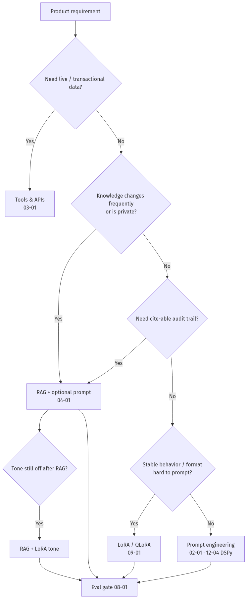
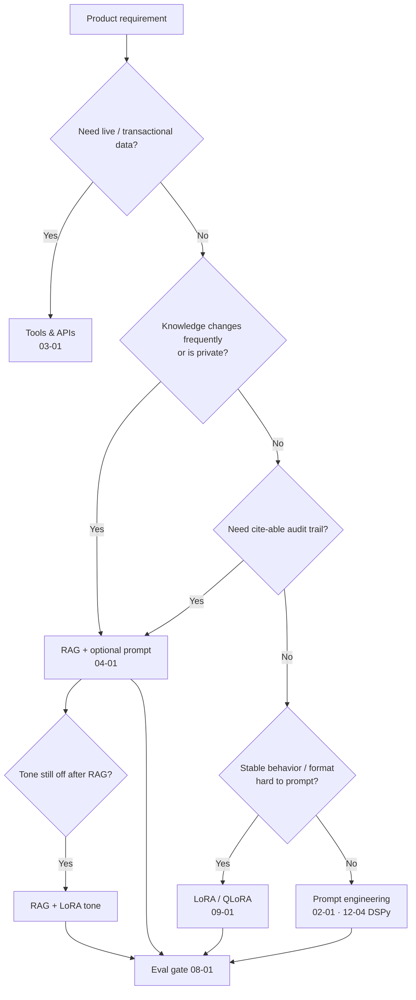
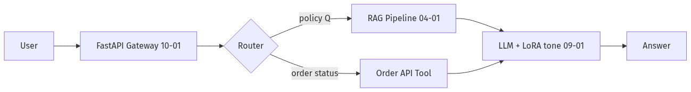
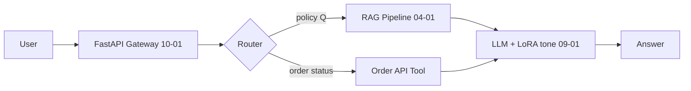
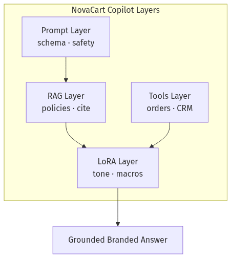
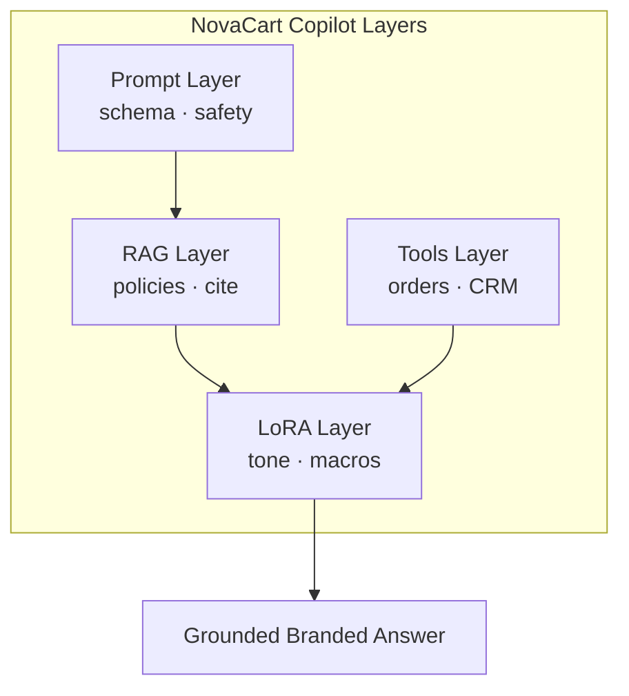
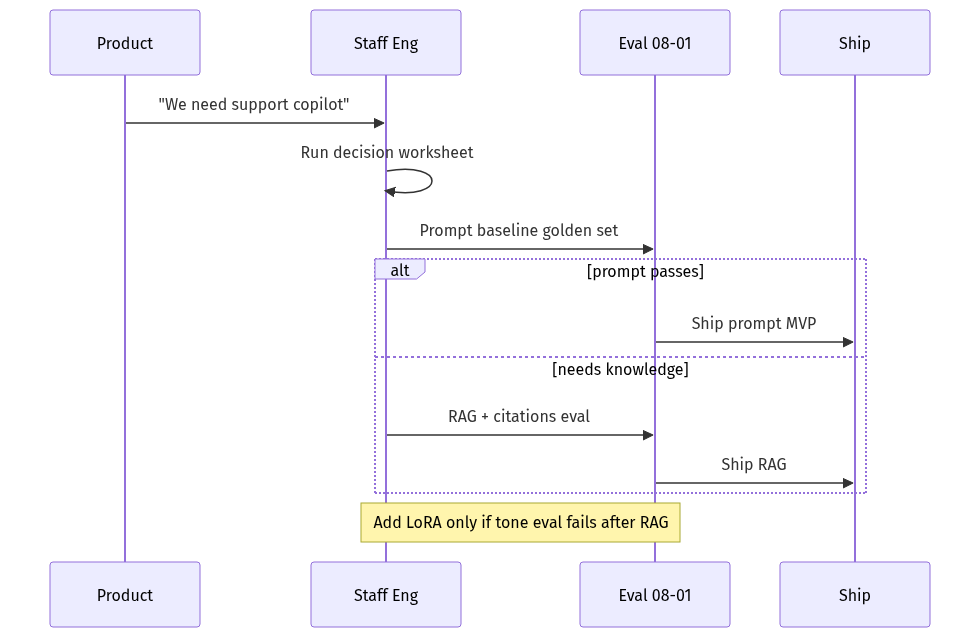
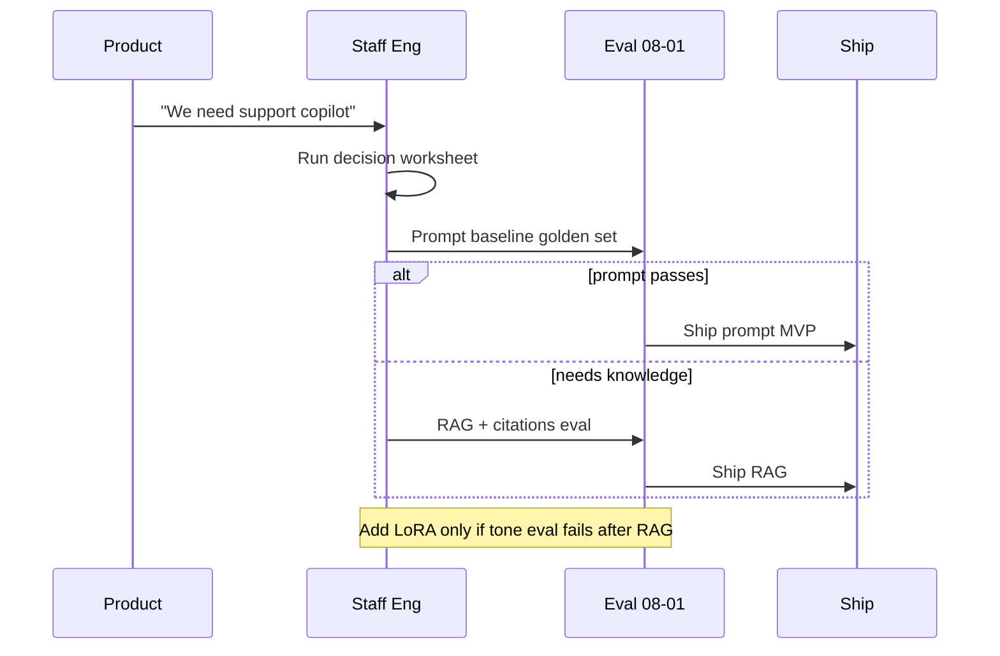

# 09-02 — Prompting vs RAG vs Fine-Tuning: The Decision Framework

| Meta | Value |
|------|-------|
| **Estimated Time** | 4–5 hours (read 2h · decision worksheet 1.5h · stakeholder memo 1h) |
| **Difficulty** | Intermediate (framework) · Advanced (hybrid architectures & unit economics) |
| **Prerequisites** | [02-01 Production Prompt Engineering](../02-Prompt-Engineering/02-01-Production-Prompt-Engineering.md) · [04-01 RAG Architecture](../04-RAG/04-01-RAG-Architecture.md) · [09-01 PEFT LoRA QLoRA](09-01-PEFT-LoRA-QLoRA.md) |
| **Module** | 09 — Fine-Tuning |
| **Related** | [09-03 Serving FT Models](09-03-Serving-Integrating-FineTuned-Models.md) · [03-01 Agent Anatomy](../03-Agentic-Fundamentals/03-01-Agent-Anatomy-and-Loop.md) · [08-01 Evaluation Lifecycle](../08-Evaluation-LLMOps/08-01-Evaluation-Lifecycle.md) · [10-04 Cost & Latency](../10-Production-Infrastructure/10-04-Cost-Latency-Optimization.md) · [12-04 DSPy](../12-Advanced-Topics/12-04-DSPy-Programmatic-Prompting.md) · [Architecture Index](../../Architecture Index.md) |

---

## Learning Objectives

By the end of this chapter you will be able to:

1. Apply a **structured decision tree** to choose prompting, RAG, fine-tuning, tools, or hybrids.
2. Quantify **freshness, auditability, cost, and iteration speed** for each approach.
3. Identify **NovaCart-class scenarios** where fine-tuning is the wrong first move.
4. Design **hybrid stacks** (RAG + LoRA tone + tools) with clear responsibility boundaries.
5. Write a **one-page architecture memo** that executives and Staff engineers both accept.
6. Avoid the **"fine-tune everything"** anti-pattern that burns GPU budget without eval lift.

---

## Why This Topic Matters

The most expensive mistake in GenAI product engineering is solving the **wrong layer**:

- Prompting fixes **behavior instructions** cheaply.
- RAG fixes **fresh, private, cite-able knowledge** at query time.
- Fine-tuning fixes **stable style, format, and domain priors** baked into weights.
- Tools/APIs fix **live transactional state** (order status, balances).

Teams that fine-tune when they needed RAG ship **stale policies** embedded in weights. Teams that RAG when they needed tone fine-tuning get **correct but robotic** answers. Teams that prompt-engineer 200-shot examples into every request hit **latency and cost walls** ([10-04](../10-Production-Infrastructure/10-04-Cost-Latency-Optimization.md)).

Principal interviews often start with: *"NovaCart wants an internal support copilot — what do you build first?"* This chapter is the answer key.

---

## Business Impact

| Business outcome | Best lever |
|------------------|------------|
| **Ship in 2 weeks** | Prompt + RAG MVP |
| **Policy compliance** | RAG + citations + abstain ([04-01](../04-RAG/04-01-RAG-Architecture.md)) |
| **Brand voice at scale** | LoRA tone adapter ([09-01](09-01-PEFT-LoRA-QLoRA.md)) |
| **Live order lookup** | Tool/API — not RAG, not FT |
| **Cost at 100M tokens/mo** | Route + cache ([01-04](../01-LLM-Engineering/01-04-Model-Routing-LiteLLM.md)) |

---

## Architecture Overview





---

## Core Concepts

### 1) Prompting — Behavior Without Weight Changes

#### Definition

Instructions, few-shot examples, and structured output schemas in the **context window** — no gradient updates.

#### When prompting wins

- Rapid iteration; A/B system prompts in hours.
- Task fits in context (small docs, stable rubric).
- Quality gap closed with [DSPy optimization](12-04-DSPy-Programmatic-Prompting.md) cheaper than FT.

#### When prompting fails

- Long few-shot sets every request → cost/latency ([10-04](../10-Production-Infrastructure/10-04-Cost-Latency-Optimization.md)).
- Fragile JSON/tool formats despite schema hints.
- Consistent brand voice across 50+ phrasing variants.

---

### 2) RAG — External Knowledge at Query Time

#### Definition

Retrieve authoritative chunks → inject into prompt → generate with citations ([04-01](../04-RAG/04-01-RAG-Architecture.md)).

#### When RAG wins

- Policies, SKUs, docs change weekly.
- Permissioned data (ACL per chunk).
- Regulated answers need **source IDs**.

#### When RAG fails alone

- Model ignores context (fix retrieve + prompt + eval).
- Pure style/tone requirements unrelated to corpus.
- Real-time DB state — use **tools**, not indexed PDFs.

---

### 3) Fine-Tuning — Baked-In Specialization

#### Definition

Update weights (full or LoRA) on curated datasets ([09-01](09-01-PEFT-LoRA-QLoRA.md)).

#### When fine-tuning wins

- Stable output **format** (support macros, JSON shapes).
- Domain **jargon and tone** consistent across sessions.
- Reduce prompt length by internalizing behavior.

#### When fine-tuning fails

- Facts that change often (policy in weights = stale).
- Small data → overfit.
- No eval gate → silent regressions ([08-01](../08-Evaluation-LLMOps/08-01-Evaluation-Lifecycle.md)).

**NovaCart rule:** Fine-tune **how** to respond; RAG **what** is true; tools **what happened**.

---

### 4) Comparison Matrix

| Dimension | Prompting | RAG | Fine-Tuning (LoRA) | Tools/API |
|-----------|-----------|-----|-------------------|-----------|
| **Freshness** | N/A | High (re-index) | Low (re-train) | Real-time |
| **Audit trail** | Prompt logs | Citations | Opaque weights | API logs |
| **Iteration speed** | Hours | Days (ingest) | Days–weeks | Days (API contract) |
| **Upfront cost** | Low | Medium | Medium–high | Medium |
| **Inference cost** | Context tokens | Retrieve + context | Shorter prompts possible | Per-call |
| **Best for** | Instructions | Docs/KB | Style/format | Live state |

---

### 5) Hybrid Architectures (Production Default)





Most mature NovaCart deployments use **all four layers** with explicit boundaries.

---

### 6) Decision Worksheet (Staff Tool)

Answer each question Yes/No:

1. Does the answer require **data updated since last model cutoff**?
2. Must the user see **citations** for compliance?
3. Is the task **live transactional** (order, balance)?
4. Is behavior stable enough to **invest in LoRA**?
5. Can **prompt + eval** hit SLO on golden set in 1 week?

Score: Yes on 1–2 → RAG; Yes on 3 → Tools; Yes on 4 without 1 → LoRA; else Prompt first.

---

## Implementation

### Decision engine (Python)

```python
"""NovaCart approach recommender — architecture worksheet automation.

Not a substitute for human judgment; encodes the chapter decision tree.
"""

from __future__ import annotations

from dataclasses import dataclass
from enum import Enum


class Approach(str, Enum):
    PROMPT = "prompt_engineering"
    RAG = "rag"
    FINETUNE = "lora_finetune"
    TOOLS = "tools_api"
    HYBRID = "hybrid"


@dataclass(frozen=True)
class RequirementProfile:
    needs_live_data: bool
    needs_citations: bool
    knowledge_changes_weekly: bool
    private_permissioned_data: bool
    stable_tone_or_format: bool
    prompt_golden_pass: bool  # True if prompt-only already hits eval SLO


def recommend(profile: RequirementProfile) -> tuple[Approach, str]:
    if profile.needs_live_data:
        return Approach.TOOLS, "Live transactional state belongs in tools/APIs, not RAG or FT."

    needs_rag = (
        profile.knowledge_changes_weekly
        or profile.private_permissioned_data
        or profile.needs_citations
    )

    if needs_rag and profile.stable_tone_or_format and not profile.prompt_golden_pass:
        return (
            Approach.HYBRID,
            "RAG for facts + LoRA for tone/format; eval both layers independently.",
        )

    if needs_rag:
        return Approach.RAG, "Ground answers in retrievable corpus with citations/abstain."

    if profile.stable_tone_or_format and not profile.prompt_golden_pass:
        return (
            Approach.FINETUNE,
            "LoRA for stable behavior; keep volatile facts out of training data.",
        )

    if profile.prompt_golden_pass:
        return Approach.PROMPT, "Prompting meets SLO — avoid FT complexity."

    return (
        Approach.PROMPT,
        "Start with prompt + eval; consider DSPy (12-04) before fine-tune.",
    )


# NovaCart internal support copilot
novacart = RequirementProfile(
    needs_live_data=True,  # order lookup tool
    needs_citations=True,  # policy answers
    knowledge_changes_weekly=True,
    private_permissioned_data=True,
    stable_tone_or_format=True,
    prompt_golden_pass=False,
)

approach, rationale = recommend(novacart)
print(approach.value, "—", rationale)
# hybrid — RAG for facts + LoRA for tone/format; tools for orders
```

### Stakeholder memo template (generate from code)

```python
def architecture_memo(profile: RequirementProfile, product_name: str) -> str:
    approach, rationale = recommend(profile)
    return f"""# {product_name} — GenAI Architecture Memo

## Recommendation
Primary approach: **{approach.value}**

{rationale}

## Layer responsibilities
| Layer | Owns | Does not own |
|-------|------|--------------|
| Prompt | Instructions, output schema | Changing policies |
| RAG | Policy docs, citations | Live order state |
| LoRA | Tone, macro format | Factual policy text |
| Tools | Order/inventory APIs | Long-form reasoning |

## Eval gates (08-01)
- Golden set before any LoRA promote
- Groundedness eval on RAG path
- Tool call success rate on transactional path

## Cost note (10-04)
Measure $/successful answer, not $/token alone.
"""


print(architecture_memo(novacart, "NovaCart Support Copilot"))
```

---

## Production Considerations

| Concern | Practice |
|---------|----------|
| Org alignment | Publish decision tree in platform docs |
| Version skew | RAG index version + adapter version in response headers |
| Rollback | Prompts revert in minutes; FT needs adapter rollback |
| Vendor lock | Hybrid reduces single-lever dependency |

---

## Security

| Risk | Mitigation |
|------|------------|
| Policy in FT weights | RAG remains source of truth; FT only style |
| RAG ACL bypass | Filter retrieval by tenant ([04-01](../04-RAG/04-01-RAG-Architecture.md)) |
| Tool over-permission | Scoped API keys per agent ([11-01](../11-Security-Safety/11-01-OWASP-LLM-Top-10.md)) |

---

## Performance

| Approach | Latency add | Mitigation |
|----------|-------------|------------|
| Long prompts | +prefill tokens | LoRA to shorten system prompt |
| RAG | +retrieve + rerank | Cache frequent queries |
| FT | Minimal if merged | Same as base inference |
| Tools | +API RTT | Parallel tool calls in agents ([03-01](../03-Agentic-Fundamentals/03-01-Agent-Anatomy-and-Loop.md)) |

---

## Cost

| Mistake | Cost impact |
|---------|-------------|
| FT instead of RAG for policies | Re-train on every doc change |
| RAG for tone only | Extra retrieve on every turn |
| 200-shot prompting | Linear context cost per request |

Worksheet: [10-04](../10-Production-Infrastructure/10-04-Cost-Latency-Optimization.md).

---

## Scalability

Hybrid stacks scale by **decoupling layers**: independent ingest pipelines, adapter registry, tool gateways ([10-01](../10-Production-Infrastructure/10-01-FastAPI-AI-Backends.md)).

---

## Failure Modes

| Failure | Cause | Fix |
|---------|-------|-----|
| Stale policy answers | FT memorized old rules | Move facts to RAG |
| Robotic tone | RAG-only | Add LoRA tone |
| Hallucinated order status | RAG over PDFs | Order tool |
| Prompt never stabilizes | No eval | Golden set + DSPy |

---

## Observability

Tag traces: `approach=prompt|rag|ft|tool`, `rag_index_version`, `adapter_id`, `tool_name`.

---

## Debugging

| Symptom | Likely wrong layer |
|---------|-------------------|
| Wrong SKU facts | Need RAG/tools, not FT |
| Correct facts, wrong voice | LoRA or prompt |
| Ignores retrieved docs | RAG pipeline bug, not FT |
| Can't know "right now" | Missing tool |

---

## Common Mistakes

1. **Fine-tuning the knowledge base** instead of indexing it.
2. **RAG for real-time inventory** instead of SQL/API tools ([12-02](../12-Advanced-Topics/12-02-Text-to-SQL-Agents.md)).
3. **Prompt bloat** mimicking fine-tune behavior.
4. Skipping **eval** when comparing approaches.
5. Choosing FT because "OpenAI does it" without volume justification.

---

## Tradeoffs

| Hybrid | Upside | Downside |
|--------|--------|----------|
| RAG + LoRA | Best of tone + truth | Two systems to eval |
| Prompt + RAG | Fast MVP | Long contexts |
| FT only | Simple inference | Stale facts risk |
| Tools + LLM | Accurate live state | Agent complexity |

---

## Architecture Diagram





---

## Mermaid Diagram — Sequence





---

## Production Examples

| Company pattern | Stack |
|-----------------|-------|
| Enterprise KB | RAG + citations |
| Brand chatbot | LoRA tone + safety prompts |
| Perplexity-style | RAG + search tools |
| Banking FAQ | RAG + abstain; no FT on rates |

---

## Real Companies Using It (Public Patterns)

| Org | Pattern | Lesson |
|-----|---------|--------|
| **Microsoft Copilot** | Graph RAG + models | Ground enterprise data |
| **Shopify** | Tools + LLM for commerce | Transactional = API |
| **Harvey (legal)** | RAG over corp docs | Citations mandatory |
| **Character.ai** | Style-heavy FT/prompt | Different tradeoff than B2B support |

---

## Hands-on Labs

### Lab A — Worksheet (45 min)

Fill decision worksheet for three NovaCart features: returns FAQ, order tracker, sales email drafter.

### Lab B — Baseline eval (60 min)

Run prompt-only on 30 golden questions; record pass rate before proposing RAG/FT.

### Lab C — Memo (30 min)

Generate architecture memo for executives using Python template.

---

## Coding Assignments

1. Extend `recommend()` with **confidence scores** and logging.
2. Build CLI that outputs Mermaid diagram for chosen approach.
3. Integrate golden-set CSV loader from [08-01](../08-Evaluation-LLMOps/08-01-Evaluation-Lifecycle.md).

---

## Mini Project

**Title:** NovaCart Approach Recommender  
**Done when:** CLI takes YAML requirements → prints approach + memo + cross-links.

---

## Production Project

**Title:** Platform Decision Record (ADR) Template  
**Done when:** Every AI feature ships with ADR citing layers used; linked in Architecture Index.

---

## Stretch Project

Implement **automatic layer probe**: run prompt/RAG/FT candidates on same golden set; pick cheapest passing approach ([12-04 DSPy](12-04-DSPy-Programmatic-Prompting.md) for prompt arm).

---

## Interview Questions

### Senior Engineer

1. When is RAG strictly better than fine-tuning?
2. Give an example where tools beat both RAG and FT.
3. What belongs in a LoRA dataset for support tone?

### Staff Engineer

1. Design NovaCart copilot — list layers and why.
2. How do you measure success across hybrid stacks?
3. When would you use DSPy instead of LoRA?

### Principal Engineer

1. Org-wide policy: when is fine-tune forbidden without VP approval?
2. $/successful answer across prompt vs RAG vs FT — what to measure?
3. How do you prevent teams from duplicating RAG indexes?

### Engineering Manager

1. How do you say "no fine-tune" to a exec sponsor?
2. Roadmap: prompt MVP → RAG → LoRA — how to communicate timelines?
3. KPIs per layer for quarterly review?

### Whiteboard

Draw decision tree for "internal HR policy bot."

### Follow-ups

- What if legal requires deletion of user data from FT set?
- What if RAG and FT disagree on tone vs facts?
- What if API tool latency breaks chat SLO?

---

## Revision Notes

- **Prompt first, eval always** — then RAG for knowledge, tools for live data, LoRA for stable behavior.
- Never embed **volatile policy** in weights.
- Hybrids are normal; boundaries matter.
- Cross-links: [09-01](09-01-PEFT-LoRA-QLoRA.md) · [04-01](../04-RAG/04-01-RAG-Architecture.md) · [10-04](../10-Production-Infrastructure/10-04-Cost-Latency-Optimization.md).

---

## Summary

Choosing prompting, RAG, fine-tuning, or tools is an **architecture decision**, not a hype cycle. Match each requirement to the layer that owns it: instructions in prompts, facts in RAG, tone in LoRA, live state in tools. Evaluate with golden sets before escalating complexity — most NovaCart features ship as prompt + RAG + tools; LoRA enters when tone and format evals demand it.

---

## Further Reading

| Title | URL | Difficulty | Reading Time | Why Read | Important Sections |
|-------|-----|------------|--------------|----------|--------------------|
| RAG paper | https://arxiv.org/abs/2005.11401 | Intermediate | 45 min | When retrieval beats parametric memory | Intro; architecture |
| LoRA paper | https://arxiv.org/abs/2106.09685 | Advanced | 30 min | When FT is appropriate | Task results |
| HF PEFT | https://huggingface.co/docs/peft/index | Intermediate | 20 min | LoRA scope | When to use PEFT |
| LangChain RAG concept | https://python.langchain.com/docs/concepts/rag/ | Intro | 20 min | RAG pipeline mental model | Indexing |
| DSPy | https://dspy.ai/ | Intermediate | 30 min | Prompt optimization alternative | Programs vs prompts |
| RAG handbook | [04-01](../04-RAG/04-01-RAG-Architecture.md) | Intermediate | 45 min | Production RAG | Abstain + citations |
| LoRA handbook | [09-01](09-01-PEFT-LoRA-QLoRA.md) | Intermediate | 45 min | Efficient FT | QLoRA lab |
| Cost handbook | [10-04](../10-Production-Infrastructure/10-04-Cost-Latency-Optimization.md) | Intermediate | 30 min | $/answer economics | Breakeven |
