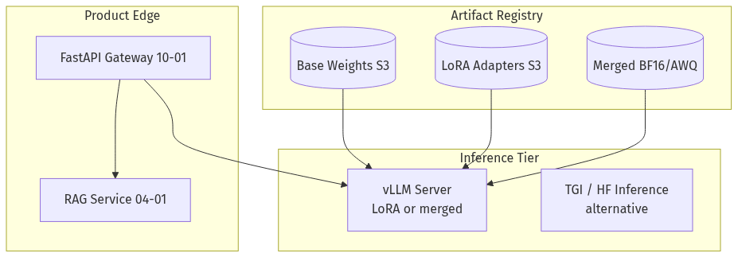
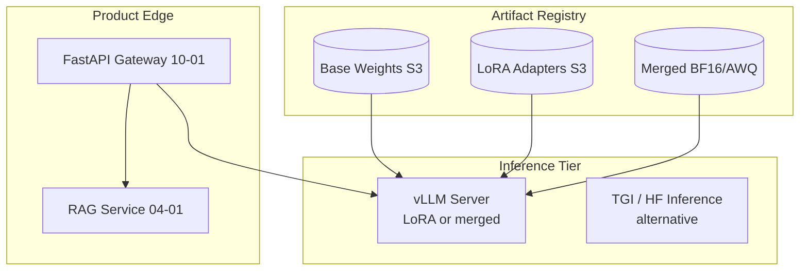
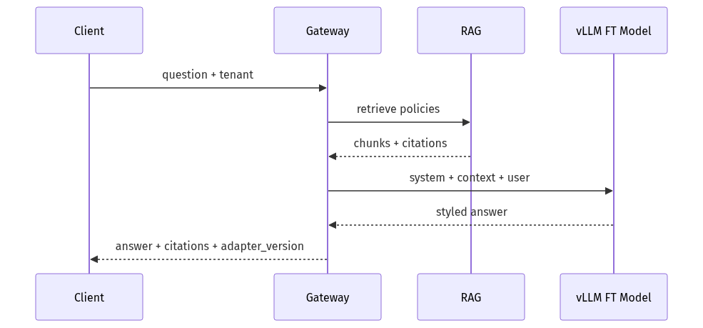
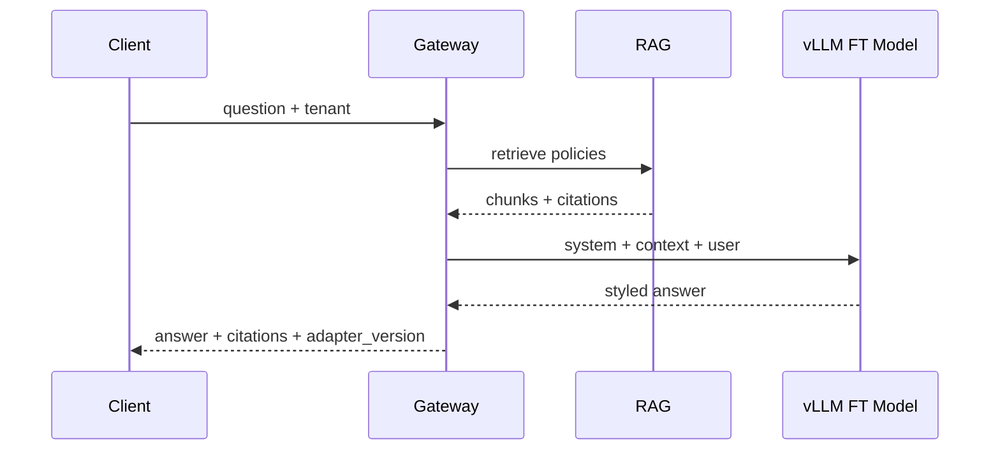
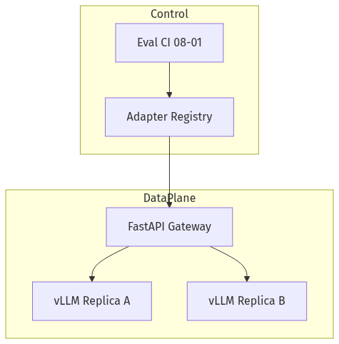
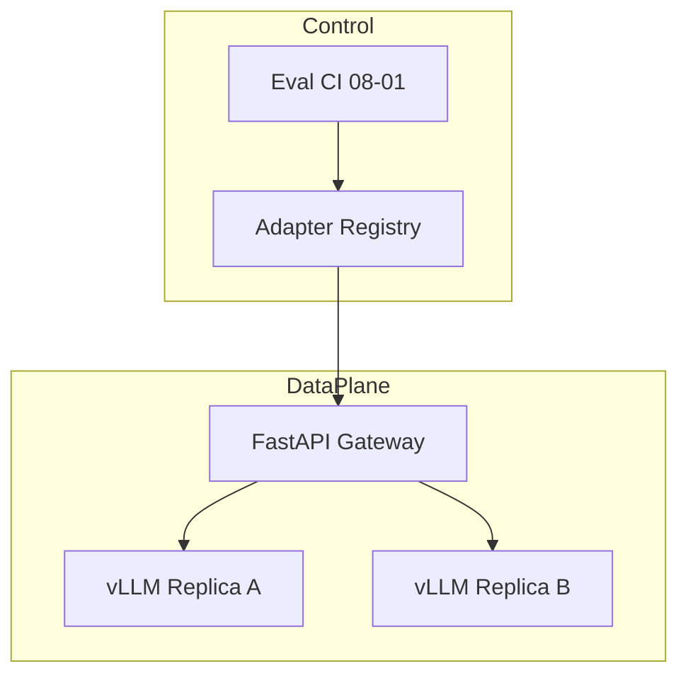
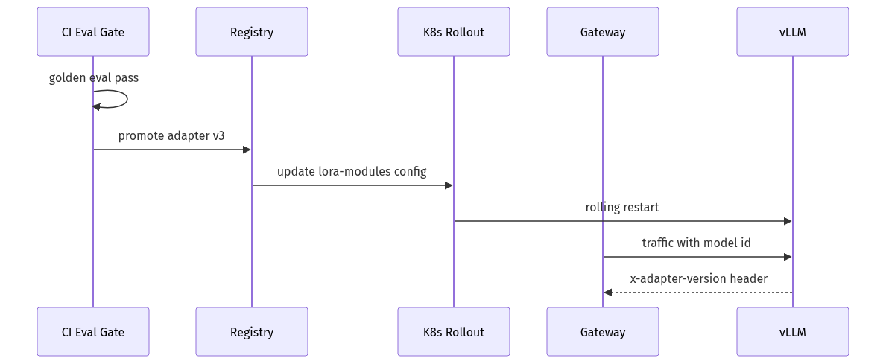
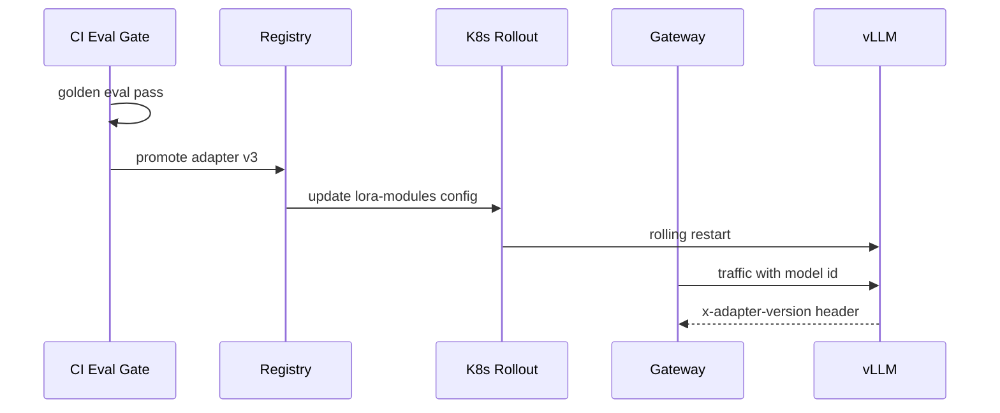

# 09-03 — Serving & Integrating Fine-Tuned Models

| Meta | Value |
|------|-------|
| **Estimated Time** | 5–6 hours (read 2h · lab 2.5h · deploy checklist 1h) |
| **Difficulty** | Intermediate (merge + HF serve) · Advanced (vLLM LoRA + multi-adapter routing) |
| **Prerequisites** | [09-01 PEFT LoRA QLoRA](09-01-PEFT-LoRA-QLoRA.md) · [01-03 Inference Serving vLLM](../01-LLM-Engineering/01-03-Inference-Serving-vLLM.md) · [10-01 FastAPI AI Backends](../10-Production-Infrastructure/10-01-FastAPI-AI-Backends.md) |
| **Module** | 09 — Fine-Tuning |
| **Related** | [09-02 Decision Framework](09-02-Prompting-vs-RAG-vs-FineTuning.md) · [01-04 Model Routing](../01-LLM-Engineering/01-04-Model-Routing-LiteLLM.md) · [08-01 Evaluation](../08-Evaluation-LLMOps/08-01-Evaluation-Lifecycle.md) · [10-02 Docker/K8s](../10-Production-Infrastructure/10-02-Docker-Kubernetes-CICD.md) · [Architecture Index](../../Architecture Index.md) |

---

## Learning Objectives

By the end of this chapter you will be able to:

1. Choose **merged weights vs runtime LoRA adapters** for production serving.
2. Deploy fine-tuned models on **vLLM** with OpenAI-compatible APIs ([vLLM docs](https://docs.vllm.ai/en/latest/)).
3. Build a **FastAPI integration layer** that routes tenants to the correct adapter.
4. Version and roll back **adapter artifacts** safely with eval gates ([08-01](../08-Evaluation-LLMOps/08-01-Evaluation-Lifecycle.md)).
5. Combine fine-tuned tone models with **RAG policy pipelines** ([04-01](../04-RAG/04-01-RAG-Architecture.md)).
6. Operate fine-tuned endpoints with **observability and cost attribution** ([10-04](../10-Production-Infrastructure/10-04-Cost-Latency-Optimization.md)).

---

## Why This Topic Matters

Training a LoRA adapter is half the job. Production asks:

- Merge into BF16 for lowest latency, or hot-swap adapters for multi-tenant?
- Serve on **vLLM** GPU fleet or managed API with custom model ID?
- How does the gateway know `adapter_id=novacart-support-v3`?
- What happens when adapter v3 passes loss but fails **tool JSON eval**?

Serving mistakes cause **silent quality regressions**, **2× VRAM** from loading base+adapter wrong, and **tenant bleed** when routing headers are ignored.

This chapter connects [09-01](09-01-PEFT-LoRA-QLoRA.md) training output to [01-03](../01-LLM-Engineering/01-03-Inference-Serving-vLLM.md) inference and [10-01](../10-Production-Infrastructure/10-01-FastAPI-AI-Backends.md) product APIs.

---

## Business Impact

| Outcome | Serving choice |
|---------|----------------|
| **Multi-tenant SaaS** | Runtime LoRA swap on one base |
| **Single-brand prod** | Merge + AWQ quant for $/token |
| **Fast rollback** | Keep N adapters in registry; flip route |
| **Compliance audit** | Log `base_model_sha` + `adapter_version` per response |

---

## Architecture Overview






---

## Core Concepts

### 1) Merge vs Runtime Adapter

| Mode | Pros | Cons |
|------|------|------|
| **Merged BF16/AWQ** | Simplest path; best latency; standard vLLM quant | One artifact per adapter version |
| **Runtime LoRA (vLLM)** | One base, many adapters; fast tenant experiments | Slight overhead; vLLM LoRA limits |
| **PEFT on-the-fly (HF)** | Dev smoke tests | Not multi-tenant scale |

**Staff default:** Merge + quant for **production** single-tenant; runtime LoRA for **platform** multi-tenant.

---

### 2) vLLM Serving Fine-Tuned Models

**Docs:** [https://docs.vllm.ai/en/latest/](https://docs.vllm.ai/en/latest/)

#### Merged model launch

```bash
python -m vllm.entrypoints.openai.api_server \
  --model ./merged/novacart-tone-v1-bf16 \
  --host 0.0.0.0 --port 8000 \
  --max-model-len 8192 \
  --enable-lora  # omit if fully merged only
```

#### LoRA-enabled launch

```bash
python -m vllm.entrypoints.openai.api_server \
  --model meta-llama/Meta-Llama-3-8B-Instruct \
  --enable-lora \
  --lora-modules novacart-support=./adapters/novacart-tone-v1 \
  --max-lora-rank 64 \
  --port 8000
```

Client passes `model="novacart-support"` or uses LoRA request fields per vLLM version docs.

---

### 3) OpenAI-Compatible Client Calls

Same SDK as [01-03](../01-LLM-Engineering/01-03-Inference-Serving-vLLM.md) — only `model` id changes.

---

### 4) Integration with RAG

Fine-tuned model generates **tone + format**; RAG injects **policy context**:






---

### 5) Versioning & Rollback

| Field | Purpose |
|-------|---------|
| `base_model_id` | Frozen base revision |
| `adapter_version` | Semantic version |
| `merged_sha256` | Immutable deploy artifact |
| `eval_run_id` | Link to [08-01](../08-Evaluation-LLMOps/08-01-Evaluation-Lifecycle.md) gate |

Rollback = route traffic to `adapter_version=v2` without retraining.

---

## Implementation

### FastAPI gateway with adapter routing + RAG context

```python
"""NovaCart gateway: RAG context + fine-tuned vLLM model.

Env:
  VLLM_BASE_URL=http://127.0.0.1:8000/v1
  GATEWAY_API_KEY=dev-secret
  DEFAULT_FT_MODEL=novacart-support
  ADAPTER_VERSION=novacart-tone-v1
"""

from __future__ import annotations

import os
import uuid
from typing import Any

import httpx
from fastapi import Depends, FastAPI, Header, HTTPException
from openai import AsyncOpenAI
from pydantic import BaseModel, Field

VLLM_BASE = os.getenv("VLLM_BASE_URL", "http://127.0.0.1:8000/v1")
API_KEY = os.getenv("GATEWAY_API_KEY", "dev-secret")
DEFAULT_MODEL = os.getenv("DEFAULT_FT_MODEL", "novacart-support")
ADAPTER_VERSION = os.getenv("ADAPTER_VERSION", "novacart-tone-v1")
RAG_URL = os.getenv("RAG_URL", "http://127.0.0.1:8090/retrieve")


class ChatRequest(BaseModel):
    message: str
    tenant_id: str = "novacart"
    department: str = "support"
    model: str = Field(default=DEFAULT_MODEL)
    max_tokens: int = 512


class ChatResponse(BaseModel):
    answer: str
    citations: list[dict[str, str]]
    adapter_version: str
    trace_id: str


def auth(authorization: str | None = Header(default=None)) -> None:
    if not authorization or not authorization.removeprefix("Bearer ").strip() == API_KEY:
        raise HTTPException(401, "unauthorized")


app = FastAPI(title="NovaCart FT Gateway", version="1.0.0")
client = AsyncOpenAI(base_url=VLLM_BASE, api_key="EMPTY")
http = httpx.AsyncClient(timeout=60.0)


async def retrieve_context(query: str, department: str) -> tuple[str, list[dict[str, str]]]:
    """Call RAG service (see 04-01) — stub-friendly for lab."""
    try:
        r = await http.post(
            RAG_URL,
            json={"query": query, "department": department, "top_k": 5},
        )
        r.raise_for_status()
        data = r.json()
        chunks = data.get("chunks", [])
        citations = [{"doc_id": c["doc_id"], "section": c.get("section", "")} for c in chunks]
        context = "\n\n".join(f"[{c['doc_id']}] {c['text']}" for c in chunks)
        return context, citations
    except httpx.HTTPError:
        return "", []


@app.post("/v1/novacart/chat", response_model=ChatResponse)
async def chat(body: ChatRequest, _: None = Depends(auth)) -> ChatResponse:
    trace_id = str(uuid.uuid4())
    context, citations = await retrieve_context(body.message, body.department)

    system = (
        "You are NovaCart support. Use ONLY the policy context for factual claims. "
        "Be warm and concise. Cite doc IDs inline."
    )
    user_content = f"Context:\n{context}\n\nQuestion: {body.message}" if context else body.message

    try:
        resp = await client.chat.completions.create(
            model=body.model,
            messages=[
                {"role": "system", "content": system},
                {"role": "user", "content": user_content},
            ],
            max_tokens=body.max_tokens,
            temperature=0.2,
            extra_headers={"x-request-id": trace_id, "x-adapter-version": ADAPTER_VERSION},
        )
    except Exception as exc:  # noqa: BLE001
        raise HTTPException(502, f"vllm error: {exc}") from exc

    answer = resp.choices[0].message.content or ""
    return ChatResponse(
        answer=answer,
        citations=citations,
        adapter_version=ADAPTER_VERSION,
        trace_id=trace_id,
    )


@app.get("/healthz")
async def healthz() -> dict[str, str]:
    r = await http.get(f"{VLLM_BASE.rstrip('/v1')}/health")
    r.raise_for_status()
    return {"status": "ok", "adapter_version": ADAPTER_VERSION}
```

### Adapter registry (minimal)

```python
"""S3-backed adapter registry metadata."""

from __future__ import annotations

import json
from dataclasses import dataclass
from pathlib import Path


@dataclass(frozen=True)
class AdapterRecord:
    adapter_id: str
    version: str
    base_model: str
    s3_uri: str
    eval_run_id: str
    promoted: bool


def load_registry(path: Path) -> list[AdapterRecord]:
    raw = json.loads(path.read_text(encoding="utf-8"))
    return [AdapterRecord(**row) for row in raw]


def active_adapter(records: list[AdapterRecord], adapter_id: str) -> AdapterRecord:
    promoted = [r for r in records if r.adapter_id == adapter_id and r.promoted]
    if not promoted:
        raise LookupError(f"no promoted adapter for {adapter_id}")
    return max(promoted, key=lambda r: r.version)
```

### Docker Compose snippet (lab)

```yaml
# docker-compose.ft-lab.yml
services:
  vllm:
    image: vllm/vllm-openai:latest
    command: >
      --model meta-llama/Meta-Llama-3-8B-Instruct
      --enable-lora
      --lora-modules novacart-support=/adapters/novacart-tone-v1
      --host 0.0.0.0 --port 8000
    volumes:
      - ./adapters:/adapters
    deploy:
      resources:
        reservations:
          devices:
            - capabilities: [gpu]

  gateway:
    build: .
    environment:
      VLLM_BASE_URL: http://vllm:8000/v1
      ADAPTER_VERSION: novacart-tone-v1
    ports:
      - "8080:8080"
    depends_on:
      - vllm
```

Full K8s patterns: [10-02](../10-Production-Infrastructure/10-02-Docker-Kubernetes-CICD.md).

---

## Production Considerations

| Concern | Practice |
|---------|----------|
| Canary deploy | 5% traffic to new adapter; compare eval metrics |
| Warmup | Hit vLLM with representative prompt before LB traffic |
| Quant after merge | AWQ eval gate — tool JSON parse rate |
| Multi-region | Replicate merged artifact; same `merged_sha` |

---

## Security

| Threat | Control |
|--------|---------|
| Adapter swap attack | Signed registry; gateway validates version |
| Cross-tenant model | Route by authenticated tenant_id |
| Exfil via fine-tuned model | Rate limits; output filters ([11-01](../11-Security-Safety/11-01-OWASP-LLM-Top-10.md)) |

---

## Performance

| Pattern | Impact |
|---------|--------|
| Merged + AWQ | Best tokens/sec ([01-03](../01-LLM-Engineering/01-03-Inference-Serving-vLLM.md)) |
| Runtime LoRA | +memory for adapter slots |
| RAG + FT | Parallel retrieve while GPU warm |

---

## Cost

Merged quant model on shared vLLM fleet minimizes **$/token** vs per-tenant full models. See [10-04](../10-Production-Infrastructure/10-04-Cost-Latency-Optimization.md).

---

## Scalability

Horizontal vLLM replicas behind gateway; adapter registry in S3; config push via [10-02](../10-Production-Infrastructure/10-02-Docker-Kubernetes-CICD.md) GitOps.

---

## Failure Modes

| Failure | Mitigation |
|---------|------------|
| Wrong adapter loaded | Version in response header; alert on mismatch |
| Merge corrupt | Checksum verify before deploy |
| LoRA rank mismatch | `--max-lora-rank` >= train rank |
| RAG+FT conflict | Eval combined path separately |

---

## Observability

Trace fields: `adapter_version`, `base_model`, `lora_request_id`, `rag_index_version`, `input_tokens`, `output_tokens`, `ttft_ms`.

---

## Debugging

| Issue | Check |
|-------|-------|
| 404 model | vLLM `--lora-modules` names |
| Generic tone | Wrong model id routed |
| Policy errors | RAG path not FT |

---

## Common Mistakes

1. Deploy adapter without **merged quant eval**.
2. Train template ≠ serve template.
3. No **version** in API response.
4. Separate FT endpoint without **RAG** for facts ([09-02](09-02-Prompting-vs-RAG-vs-FineTuning.md)).
5. Full 7B copy per tenant instead of LoRA slots.

---

## Tradeoffs

| Choice | When |
|--------|------|
| Merge | Single tenant prod |
| Runtime LoRA | Multi-tenant platform |
| Managed custom model | No GPU ops |
| vLLM vs TGI | vLLM default in handbook ([01-03](../01-LLM-Engineering/01-03-Inference-Serving-vLLM.md)) |

---

## Architecture Diagram






---

## Mermaid Diagram — Sequence






---

## Production Examples

| Pattern | Deploy |
|---------|--------|
| NovaCart support | RAG + merged AWQ 8B |
| Locale adapters | vLLM multi-LoRA |
| A/B tone test | Route 50/50 adapter ids |

---

## Real Companies Using It (Public Patterns)

| Org | Pattern |
|-----|---------|
| **Hugging Face** | Inference Endpoints + adapters |
| **Anyscale** | Ray Serve + vLLM |
| **OpenAI** | Custom fine-tunes via API |
| **Replicate** | LoRA deploy marketplace |

---

## Hands-on Labs

### Lab A — vLLM LoRA serve (60 min)

Launch vLLM with `--enable-lora`; call via OpenAI SDK.

### Lab B — Gateway integration (45 min)

Run FastAPI gateway against vLLM + mock RAG.

### Lab C — Rollback drill (30 min)

Promote v2, simulate eval fail, revert route to v1.

---

## Coding Assignments

1. Add **Prometheus** counter `adapter_version` labels.
2. Implement **canary** routing by `tenant_id` hash.
3. Automate **merge + AWQ** pipeline script post-train.

---

## Mini Project

**Title:** NovaCart FT Gateway v0  
**Done when:** RAG context + vLLM FT model; response includes `adapter_version` + citations.

---

## Production Project

**Title:** Adapter Registry + K8s GitOps  
**Done when:** S3 artifacts; CI eval; rolling deploy per [10-02](../10-Production-Infrastructure/10-02-Docker-Kubernetes-CICD.md).

---

## Stretch Project

**Hybrid routing** ([01-04](../01-LLM-Engineering/01-04-Model-Routing-LiteLLM.md)): PII lane → self-host FT; general → API.

---

## Interview Questions

### Senior Engineer

1. Merge vs runtime LoRA — when each?
2. How do you call a vLLM LoRA model from Python?
3. Why combine FT with RAG?

### Staff Engineer

1. Design adapter registry and rollback.
2. Canary deploy strategy for new LoRA.
3. Observability fields for FT endpoints?

### Principal Engineer

1. Multi-tenant LoRA on shared vLLM fleet — isolation story?
2. When use managed fine-tune API vs self-host?
3. Org standards for promote gates?

### Engineering Manager

1. Ops cost: merged fleet vs API custom models?
2. Incident response when adapter regresses?
3. Who owns registry vs product gateway?

### Whiteboard

Draw deploy path from train → eval → registry → vLLM.

### Follow-ups

- Adapter passes offline but fails online traffic?
- Legal hold on adapter artifact deletion?

---

## Revision Notes

- **Serve path:** merge+quant OR vLLM LoRA modules.
- Always log **adapter_version** + **base_model**.
- **RAG for facts**, FT for tone ([09-02](09-02-Prompting-vs-RAG-vs-FineTuning.md)).
- vLLM: [https://docs.vllm.ai/en/latest/](https://docs.vllm.ai/en/latest/)

---

## Summary

Serving fine-tuned models means treating adapters as **versioned production artifacts** with eval gates, clear routing, and observability. Use vLLM for GPU throughput, FastAPI for product contracts, and RAG for grounded facts — fine-tuning shapes voice and format, not volatile policy.

---

## Further Reading

| Title | URL | Difficulty | Reading Time | Why Read | Important Sections |
|-------|-----|------------|--------------|----------|--------------------|
| vLLM Documentation | https://docs.vllm.ai/en/latest/ | Intermediate | 45 min | LoRA + OpenAI server | LoRA serving |
| HF PEFT | https://huggingface.co/docs/peft/index | Intermediate | 20 min | Load adapters | Inference |
| vLLM GitHub | https://github.com/vllm-project/vllm | Intermediate | 20 min | Flags & examples | LoRA examples |
| FastAPI | https://fastapi.tiangolo.com/ | Intro | 30 min | Gateway patterns | Dependencies |
| Train handbook | [09-01](09-01-PEFT-LoRA-QLoRA.md) | Intermediate | 45 min | Merge script | QLoRA |
| Inference handbook | [01-03](../01-LLM-Engineering/01-03-Inference-Serving-vLLM.md) | Intermediate | 45 min | Gateway + batching | Implementation |
| K8s handbook | [10-02](../10-Production-Infrastructure/10-02-Docker-Kubernetes-CICD.md) | Intermediate | 30 min | GPU deploy | Rolling updates |
