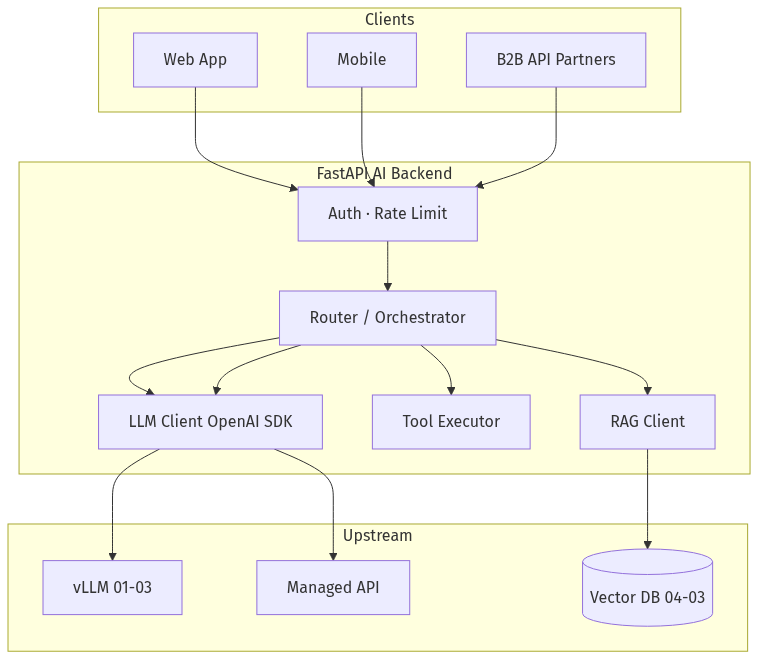
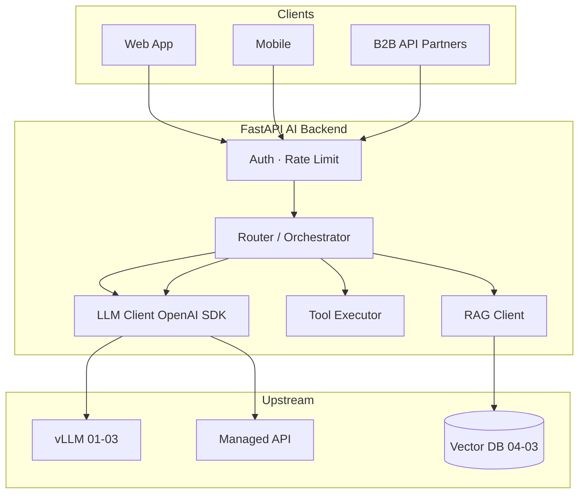
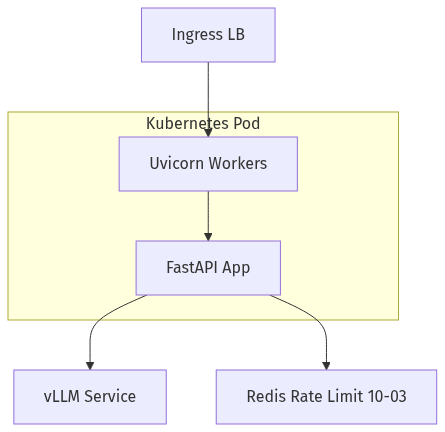
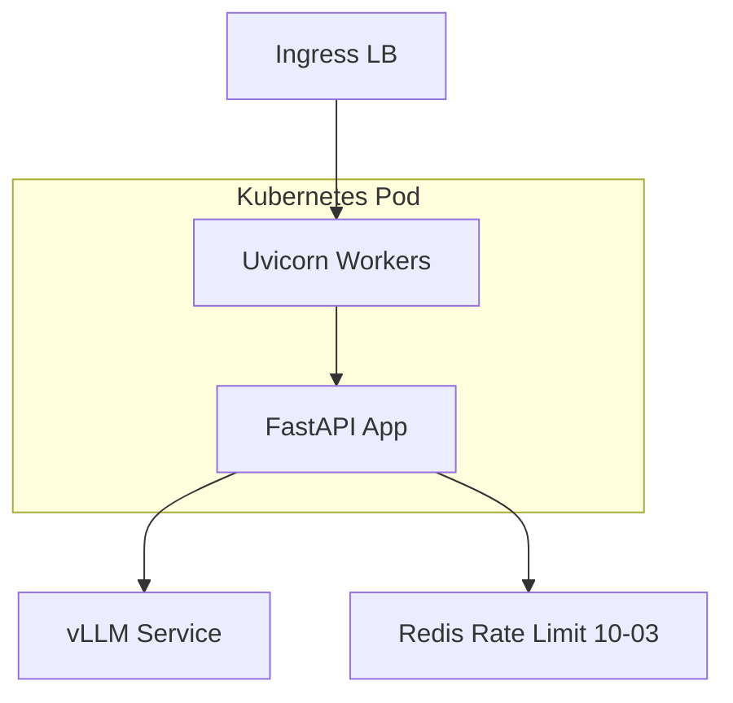
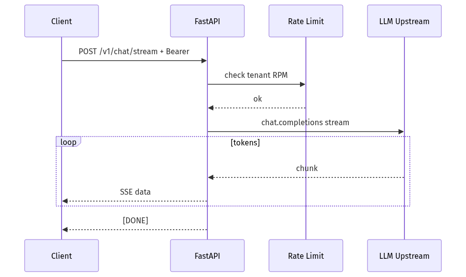
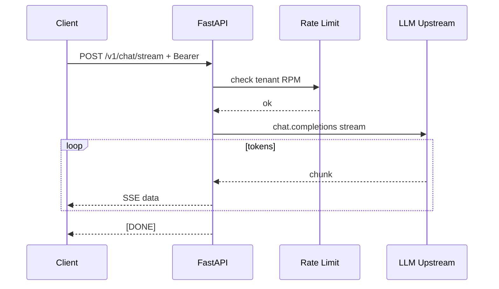

# 10-01 — FastAPI AI Backends: Production API Patterns for LLM Apps

| Meta | Value |
|------|-------|
| **Estimated Time** | 5–6 hours (read 2h · lab 2.5h · API design review 1h) |
| **Difficulty** | Intermediate (FastAPI + async) · Advanced (streaming, auth, multi-tenant) |
| **Prerequisites** | Python async basics · [01-03 Inference Serving vLLM](../01-LLM-Engineering/01-03-Inference-Serving-vLLM.md) · HTTP/REST literacy |
| **Module** | 10 — Production Infrastructure |
| **Related** | [10-02 Docker/K8s/CI/CD](10-02-Docker-Kubernetes-CICD.md) · [10-03 Redis/Kafka/Ray](10-03-Redis-Kafka-Ray.md) · [10-04 Cost & Latency](10-04-Cost-Latency-Optimization.md) · [04-01 RAG Architecture](../04-RAG/04-01-RAG-Architecture.md) · [11-02 Prompt Injection](../11-Security-Safety/11-02-Prompt-Injection-Defense.md) · [Architecture Index](../../Architecture Index.md) |

---

## Learning Objectives

By the end of this chapter you will be able to:

1. Structure **FastAPI services** as the product contract layer in front of LLM inference ([FastAPI docs](https://fastapi.tiangolo.com/)).
2. Implement **sync, async, and SSE streaming** endpoints with proper timeouts and backpressure.
3. Apply **auth, rate limiting, request IDs, and structured logging** for AI endpoints.
4. Compose **RAG, tool calls, and model routing** in a single gateway without god-objects.
5. Design **Pydantic schemas** for structured LLM outputs and validation.
6. Deploy health checks and readiness probes compatible with [10-02](10-02-Docker-Kubernetes-CICD.md) Kubernetes.

---

## Why This Topic Matters

The LLM is not your API. **FastAPI (or equivalent) is.**

Clients need stable contracts: authentication, JSON schemas, error codes, trace IDs, rate limits, and streaming UX — regardless of whether upstream is OpenAI, vLLM, or a fine-tuned replica ([09-03](../09-Fine-Tuning/09-03-Serving-Integrating-FineTuned-Models.md)).

Teams that expose vLLM directly to the internet inherit **OWASP LLM risks** ([11-01](../11-Security-Safety/11-01-OWASP-LLM-Top-10.md)), unbounded token spend, and breaking changes when inference engines swap.

Every handbook implementation chapter ([04-01](../04-RAG/04-01-RAG-Architecture.md), [01-03](../01-LLM-Engineering/01-03-Inference-Serving-vLLM.md), [09-03](../09-Fine-Tuning/09-03-Serving-Integrating-FineTuned-Models.md)) assumes this gateway pattern.

---

## Business Impact

| Outcome | FastAPI layer delivers |
|---------|------------------------|
| **Ship faster** | OpenAPI docs auto-generated for frontend/mobile |
| **Control cost** | Rate limits + max_tokens at edge ([10-04](10-04-Cost-Latency-Optimization.md)) |
| **Audit compliance** | Request logs with tenant_id, model, token usage |
| **Vendor flexibility** | Swap vLLM ↔ API without client changes |

---

## Architecture Overview





**Docs:** [https://fastapi.tiangolo.com/](https://fastapi.tiangolo.com/)

---

## Core Concepts

### 1) Gateway vs Orchestrator vs Monolith

| Pattern | Responsibility |
|---------|----------------|
| **Thin gateway** | Auth, proxy to vLLM | Simple chat proxy |
| **Orchestrator** | RAG + tools + LLM sequence | NovaCart support copilot |
| **Monolith anti-pattern** | 2000-line `main.py` | Avoid — split routers |

Use `APIRouter` modules: `chat.py`, `rag.py`, `admin.py`.

---

### 2) Async First

LLM calls are **I/O bound**. Block the event loop → tail latency under load.

```python
# Wrong — blocks loop
def chat(): 
    return openai_client.chat.completions.create(...)

# Right
async def chat():
    return await async_client.chat.completions.create(...)
```

CPU-heavy work (PDF parse, embedding batch) → **background tasks** or [10-03 Ray](10-03-Redis-Kafka-Ray.md) workers.

---

### 3) Streaming (SSE)

Chat UX requires **Server-Sent Events**. Gateway translates OpenAI stream chunks to client SSE.

Benefits: lower perceived latency ([10-04](10-04-Cost-Latency-Optimization.md)); users see partial answers.

---

### 4) Structured Outputs

Pydantic models validate LLM JSON **after** generation — or use provider JSON mode ([02-02](../02-Prompt-Engineering/02-02-Structured-Outputs-Tool-Calling.md)).

---

### 5) Dependency Injection

FastAPI `Depends()` for auth, tenant context, traced LLM clients — testable and reusable.

---

### 6) Lifespan & Connection Pools

Share `httpx.AsyncClient` and `AsyncOpenAI` across requests via `lifespan` — avoid per-request TCP handshakes.

---

## Implementation

### Production-shaped NovaCart AI backend

```python
"""NovaCart AI Backend — FastAPI orchestrator.

Run:
  pip install fastapi uvicorn httpx openai pydantic prometheus-client
  export OPENAI_API_KEY=sk-...
  export GATEWAY_API_KEY=dev-secret
  uvicorn novacart_ai:app --host 0.0.0.0 --port 8080

Routes:
  POST /v1/chat          — sync chat
  POST /v1/chat/stream   — SSE streaming
  GET  /healthz          — liveness
  GET  /readyz           — readiness (upstream check)
"""

from __future__ import annotations

import asyncio
import json
import os
import time
import uuid
from contextlib import asynccontextmanager
from typing import Any, AsyncIterator

import httpx
from fastapi import Depends, FastAPI, Header, HTTPException, Request
from fastapi.responses import JSONResponse, StreamingResponse
from openai import AsyncOpenAI
from pydantic import BaseModel, Field, field_validator

API_KEY = os.getenv("GATEWAY_API_KEY", "dev-secret")
OPENAI_BASE = os.getenv("OPENAI_BASE_URL")  # None = OpenAI; or vLLM URL
DEFAULT_MODEL = os.getenv("DEFAULT_MODEL", "gpt-4o-mini")
MAX_TOKENS_CAP = int(os.getenv("MAX_TOKENS_CAP", "2048"))
RATE_LIMIT_RPM = int(os.getenv("RATE_LIMIT_RPM", "60"))

# Simple in-memory rate limiter (use Redis in prod — 10-03)
_rate_bucket: dict[str, list[float]] = {}


class ChatRequest(BaseModel):
    message: str = Field(min_length=1, max_length=8000)
    model: str = Field(default=DEFAULT_MODEL)
    max_tokens: int = Field(default=512, ge=1, le=8192)
    stream: bool = False
    tenant_id: str = "novacart"

    @field_validator("max_tokens")
    @classmethod
    def cap_tokens(cls, v: int) -> int:
        return min(v, MAX_TOKENS_CAP)


class ChatResponse(BaseModel):
    answer: str
    model: str
    trace_id: str
    latency_ms: int
    usage: dict[str, int]


class StructuredTicketSummary(BaseModel):
    issue: str
    priority: str = Field(pattern="^(low|medium|high)$")
    suggested_actions: list[str]


def require_auth(authorization: str | None = Header(default=None)) -> str:
    if not authorization or not authorization.startswith("Bearer "):
        raise HTTPException(401, "missing bearer token")
    token = authorization.removeprefix("Bearer ").strip()
    if token != API_KEY:
        raise HTTPException(403, "invalid api key")
    return token


def rate_limit(tenant_id: str) -> None:
    now = time.time()
    window = 60.0
    hits = _rate_bucket.setdefault(tenant_id, [])
    _rate_bucket[tenant_id] = [t for t in hits if now - t < window]
    if len(_rate_bucket[tenant_id]) >= RATE_LIMIT_RPM:
        raise HTTPException(429, "rate limit exceeded")
    _rate_bucket[tenant_id].append(now)


@asynccontextmanager
async def lifespan(app: FastAPI) -> AsyncIterator[None]:
    timeout = httpx.Timeout(120.0, connect=10.0)
    app.state.http = httpx.AsyncClient(timeout=timeout)
    app.state.llm = AsyncOpenAI(
        api_key=os.getenv("OPENAI_API_KEY", "EMPTY"),
        base_url=OPENAI_BASE,
        http_client=app.state.http,
        timeout=120.0,
    )
    yield
    await app.state.http.aclose()


app = FastAPI(title="NovaCart AI Backend", version="1.0.0", lifespan=lifespan)


@app.get("/healthz")
async def healthz() -> dict[str, str]:
    return {"status": "ok"}


@app.get("/readyz")
async def readyz(request: Request) -> dict[str, str]:
    try:
        await request.app.state.llm.models.list()
    except Exception as exc:  # noqa: BLE001
        raise HTTPException(503, f"upstream not ready: {exc}") from exc
    return {"status": "ready"}


@app.post("/v1/chat", response_model=ChatResponse)
async def chat(
    body: ChatRequest,
    request: Request,
    _: str = Depends(require_auth),
) -> ChatResponse:
    rate_limit(body.tenant_id)
    trace_id = str(uuid.uuid4())
    started = time.perf_counter()

    client: AsyncOpenAI = request.app.state.llm
    try:
        resp = await client.chat.completions.create(
            model=body.model,
            messages=[
                {"role": "system", "content": "You are NovaCart support. Be concise."},
                {"role": "user", "content": body.message},
            ],
            max_tokens=body.max_tokens,
            temperature=0.2,
            extra_headers={"x-request-id": trace_id},
        )
    except Exception as exc:  # noqa: BLE001
        raise HTTPException(502, f"llm upstream error: {exc}") from exc

    latency_ms = int((time.perf_counter() - started) * 1000)
    usage = resp.usage
    usage_dict = {
        "prompt_tokens": usage.prompt_tokens if usage else 0,
        "completion_tokens": usage.completion_tokens if usage else 0,
        "total_tokens": usage.total_tokens if usage else 0,
    }

    return ChatResponse(
        answer=resp.choices[0].message.content or "",
        model=body.model,
        trace_id=trace_id,
        latency_ms=latency_ms,
        usage=usage_dict,
    )


@app.post("/v1/chat/stream")
async def chat_stream(
    body: ChatRequest,
    request: Request,
    _: str = Depends(require_auth),
) -> StreamingResponse:
    rate_limit(body.tenant_id)
    trace_id = str(uuid.uuid4())
    client: AsyncOpenAI = request.app.state.llm

    async def generate() -> AsyncIterator[bytes]:
        try:
            stream = await client.chat.completions.create(
                model=body.model,
                messages=[
                    {"role": "system", "content": "You are NovaCart support."},
                    {"role": "user", "content": body.message},
                ],
                max_tokens=body.max_tokens,
                stream=True,
                extra_headers={"x-request-id": trace_id},
            )
            async for chunk in stream:
                payload = {"trace_id": trace_id, "chunk": chunk.model_dump()}
                yield f"data: {json.dumps(payload)}\n\n".encode()
            yield b"data: [DONE]\n\n"
        except Exception as exc:  # noqa: BLE001
            err = {"error": str(exc), "trace_id": trace_id}
            yield f"data: {json.dumps(err)}\n\n".encode()

    return StreamingResponse(generate(), media_type="text/event-stream")


@app.post("/v1/summarize/ticket", response_model=StructuredTicketSummary)
async def summarize_ticket(
    ticket_text: str,
    request: Request,
    _: str = Depends(require_auth),
) -> StructuredTicketSummary:
    client: AsyncOpenAI = request.app.state.llm
    resp = await client.chat.completions.create(
        model=DEFAULT_MODEL,
        messages=[
            {
                "role": "system",
                "content": (
                    "Return JSON with keys: issue, priority (low|medium|high), "
                    "suggested_actions (list of strings)."
                ),
            },
            {"role": "user", "content": ticket_text},
        ],
        response_format={"type": "json_object"},
        max_tokens=400,
    )
    raw = resp.choices[0].message.content or "{}"
    try:
        return StructuredTicketSummary.model_validate_json(raw)
    except Exception as exc:  # noqa: BLE001
        raise HTTPException(422, f"invalid structured output: {exc}") from exc
```

### Router modularization pattern

```python
# routers/chat.py — split for larger codebases
from fastapi import APIRouter

router = APIRouter(prefix="/v1", tags=["chat"])

@router.post("/chat")
async def chat_endpoint(): ...
```

Register: `app.include_router(chat_router)`.

---

## Production Considerations

| Concern | Practice |
|---------|----------|
| Timeouts | Client + upstream; shorter for sync, longer for stream |
| Idempotency | `Idempotency-Key` header for paid operations |
| CORS | Restrict origins — not `*` in prod |
| Request size | Limit body MB for doc upload routes |
| Graceful shutdown | Drain in-flight LLM streams on SIGTERM |

---

## Security

| Threat | Control |
|--------|---------|
| Unauthenticated LLM proxy | Bearer auth on all routes |
| Prompt injection | Input sanitization + tool scoping ([11-02](../11-Security-Safety/11-02-Prompt-Injection-Defense.md)) |
| SSRF in tool fetchers | Allowlist URLs |
| Token exfil in logs | Redact prompts in production logs |

---

## Performance

| Technique | Effect |
|-----------|--------|
| Async I/O | High concurrency on single pod |
| Connection pooling | Lower TTFT to upstream |
| Streaming | Better UX, same total tokens |
| Background embed jobs | Keep request path fast |

---

## Cost

Gateway enforces `MAX_TOKENS_CAP`, rate limits, and model routing ([01-04](../01-LLM-Engineering/01-04-Model-Routing-LiteLLM.md)) — see [10-04](10-04-Cost-Latency-Optimization.md).

---

## Scalability

Stateless FastAPI pods → HPA on CPU/RPS ([10-02](10-02-Docker-Kubernetes-CICD.md)). Rate limits → Redis ([10-03](10-03-Redis-Kafka-Ray.md)).

---

## Failure Modes

| Failure | Mitigation |
|---------|------------|
| Upstream 503 | Circuit breaker; fallback message |
| Stream hang | Idle timeout on SSE |
| Event loop block | Never sync LLM in async route |
| OOM on large uploads | Spool to object storage |

---

## Observability

Log JSON: `trace_id`, `tenant_id`, `model`, `latency_ms`, `usage`, `route`, `status_code`. OpenTelemetry middleware per [08-02](../08-Evaluation-LLMOps/08-02-Observability-LangSmith-OTel.md).

---

## Debugging

| Symptom | Check |
|---------|-------|
| 502 spikes | Upstream health, timeout values |
| Slow p95 | Pool exhaustion; add workers |
| 422 structured | Prompt drift; schema examples |

---

## Common Mistakes

1. **No auth** on LLM proxy endpoints.
2. **Sync** OpenAI calls in `async def` routes.
3. **Unbounded** `max_tokens` from client body.
4. Logging **full prompts** with PII.
5. One file for RAG + tools + admin + chat.

---

## Tradeoffs

| Choice | Upside | Downside |
|--------|--------|----------|
| FastAPI | Async, OpenAPI, typing | Python GIL for CPU work |
| Node/Go gateway | Raw perf | Less ML ecosystem |
| BFF per client | Tailored APIs | Duplication |
| Direct vLLM expose | Fewer hops | No product controls |

---

## Architecture Diagram





---

## Mermaid Diagram — Sequence





---

## Production Examples

| Pattern | FastAPI role |
|---------|--------------|
| ChatGPT-style app | Stream + session store |
| RAG API | Retrieve orchestration ([04-01](../04-RAG/04-01-RAG-Architecture.md)) |
| Agent server | Tool loop driver ([03-01](../03-Agentic-Fundamentals/03-01-Agent-Anatomy-and-Loop.md)) |
| Eval proxy | Log traces for [08-01](../08-Evaluation-LLMOps/08-01-Evaluation-Lifecycle.md) |

---

## Real Companies Using It (Public Patterns)

| Org | Pattern |
|-----|---------|
| **Microsoft** | FastAPI in Azure ML samples |
| **Uber** | Python microservices for ML |
| **Stripe-style APIs** | Pydantic validation culture |
| **Startups** | FastAPI + vLLM default stack |

---

## Hands-on Labs

### Lab A — Gateway auth (30 min)

Reject missing bearer; verify OpenAPI `/docs`.

### Lab B — Streaming UI (45 min)

Connect SSE endpoint to simple HTML client.

### Lab C — Readiness probe (20 min)

Make `/readyz` fail when upstream down; test K8s probe.

---

## Coding Assignments

1. Redis rate limiter replacing in-memory dict ([10-03](10-03-Redis-Kafka-Ray.md)).
2. Prometheus middleware for latency histograms.
3. Split monolith into `APIRouter` modules.

---

## Mini Project

**Title:** NovaCart Chat API v0  
**Done when:** sync + stream routes; auth; max_tokens cap; healthz/readyz.

---

## Production Project

**Title:** Orchestrator with RAG + LLM  
**Done when:** integrates [04-01](../04-RAG/04-01-RAG-Architecture.md) retrieve; deploy on K8s [10-02](10-02-Docker-Kubernetes-CICD.md).

---

## Stretch Project

Add **LiteLLM router** ([01-04](../01-LLM-Engineering/01-04-Model-Routing-LiteLLM.md)) behind FastAPI with fallback chain.

---

## Interview Questions

### Senior Engineer

1. Why async FastAPI for LLM backends?
2. How do you implement SSE streaming safely?
3. Where do you enforce max_tokens?

### Staff Engineer

1. Design NovaCart AI backend routers and dependencies.
2. Health vs readiness probes for LLM upstream?
3. How to structure RAG + LLM without blocking the event loop?

### Principal Engineer

1. Gateway vs service mesh vs BFF — boundaries?
2. Multi-region FastAPI deployment strategy?
3. API versioning when LLM schemas evolve?

### Engineering Manager

1. When hire platform vs product backend for AI?
2. SLOs for API vs model latency?
3. Incident ownership: gateway vs inference team?

### Whiteboard

Draw request path: client → FastAPI → vLLM with auth and trace ID.

### Follow-ups

- What if streaming clients disconnect mid-generation?
- What if Pydantic validation fails on LLM JSON?

---

## Revision Notes

- **FastAPI = product contract**; inference = upstream.
- Async + pooled clients; never block event loop.
- Auth, rate limits, caps at edge ([10-04](10-04-Cost-Latency-Optimization.md)).
- Deploy: [10-02](10-02-Docker-Kubernetes-CICD.md) · queue: [10-03](10-03-Redis-Kafka-Ray.md).

---

## Summary

FastAPI AI backends wrap LLM inference with **production API discipline**: authentication, validation, streaming, observability, and cost guards. Keep routers modular, upstream swappable, and aligned with Kubernetes health patterns — the gateway is where NovaCart's product promises are kept.

---

## Further Reading

| Title | URL | Difficulty | Reading Time | Why Read | Important Sections |
|-------|-----|------------|--------------|----------|--------------------|
| FastAPI Documentation | https://fastapi.tiangolo.com/ | Intro | 60 min | Official patterns | Async; Dependencies; Streaming |
| Uvicorn | https://www.uvicorn.org/ | Intro | 15 min | ASGI server tuning | Workers |
| OpenAI Python SDK | https://github.com/openai/openai-python | Intro | 20 min | Async client | Streaming |
| vLLM handbook | [01-03](../01-LLM-Engineering/01-03-Inference-Serving-vLLM.md) | Intermediate | 45 min | Upstream gateway | Gateway code |
| K8s deploy | [10-02](10-02-Docker-Kubernetes-CICD.md) | Intermediate | 30 min | Probes & deploy | Health checks |
| Security | [11-02](../11-Security-Safety/11-02-Prompt-Injection-Defense.md) | Intermediate | 30 min | Input defense | Gateway controls |
