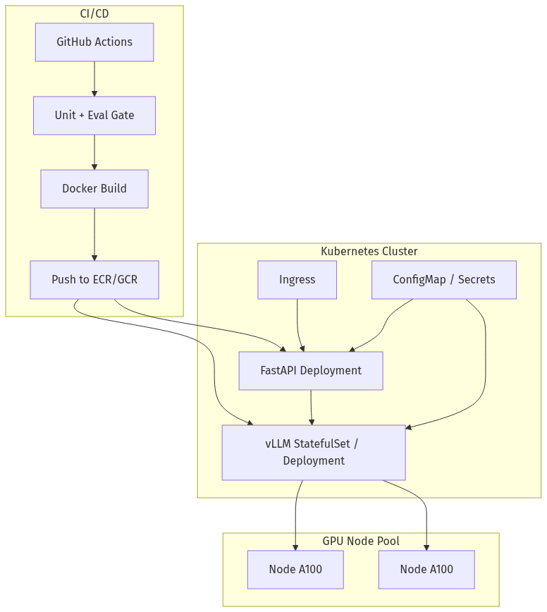
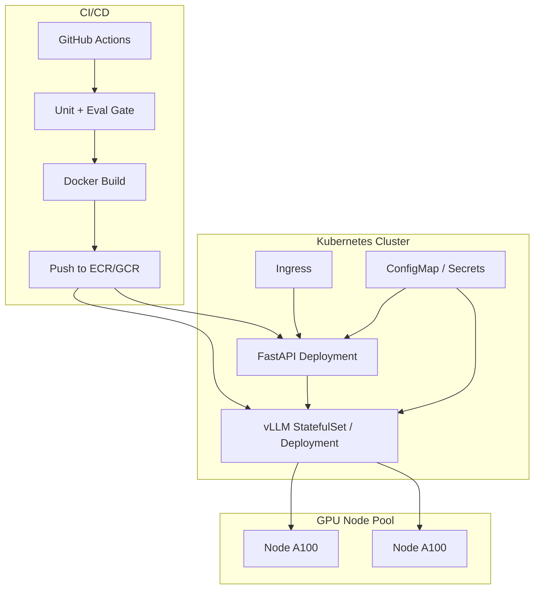
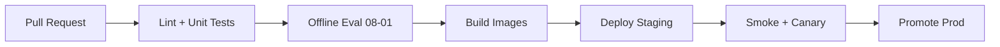
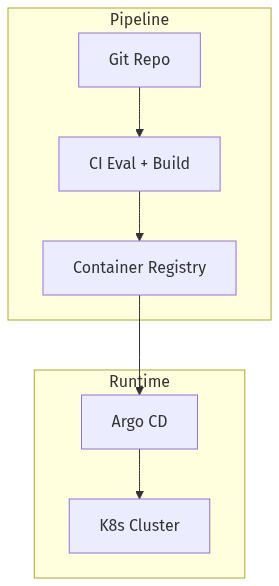
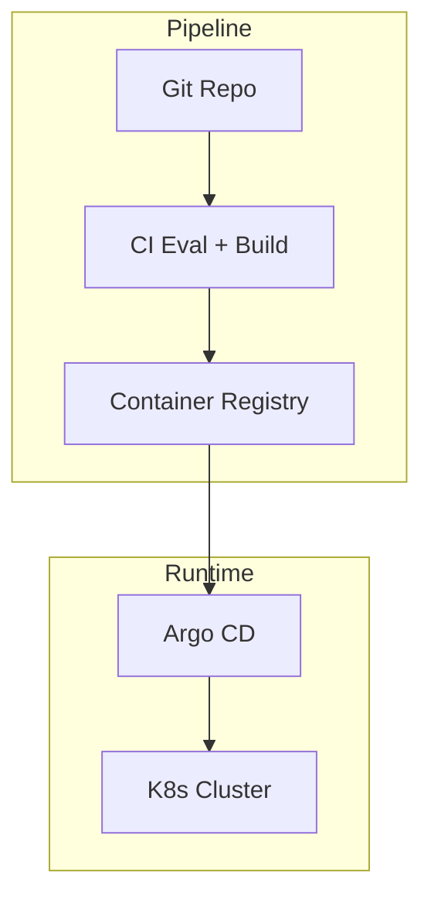
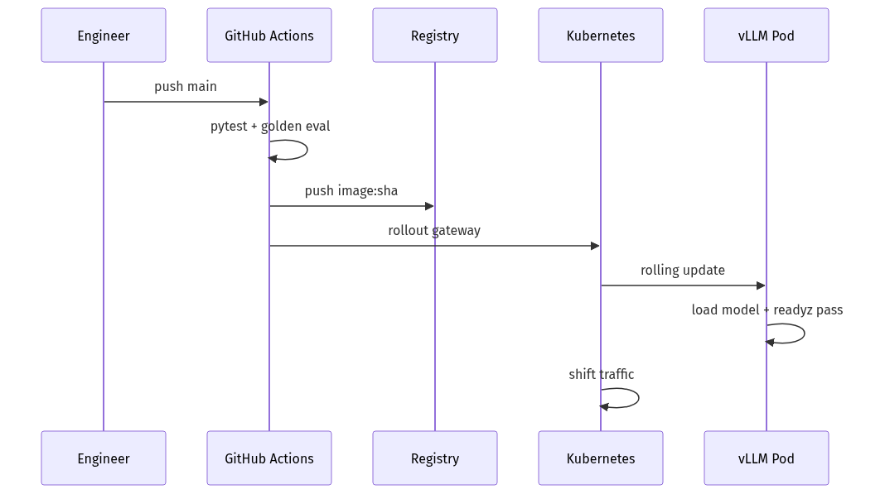
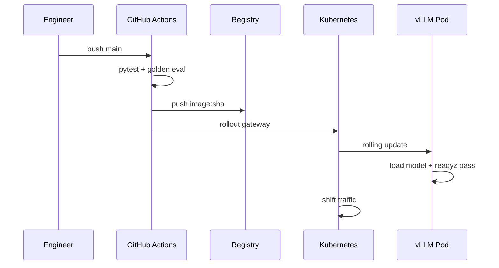

# 10-02 — Docker, Kubernetes & CI/CD for AI Services

| Meta | Value |
|------|-------|
| **Estimated Time** | 6–7 hours (read 2.5h · lab 3h · pipeline design 1h) |
| **Difficulty** | Intermediate (Docker) · Advanced (GPU K8s, model artifacts, eval gates) |
| **Prerequisites** | [10-01 FastAPI AI Backends](10-01-FastAPI-AI-Backends.md) · [01-03 Inference Serving vLLM](../01-LLM-Engineering/01-03-Inference-Serving-vLLM.md) · basic Linux CLI |
| **Module** | 10 — Production Infrastructure |
| **Related** | [10-03 Redis/Kafka/Ray](10-03-Redis-Kafka-Ray.md) · [10-04 Cost & Latency](10-04-Cost-Latency-Optimization.md) · [09-03 Serving FT Models](../09-Fine-Tuning/09-03-Serving-Integrating-FineTuned-Models.md) · [08-01 Evaluation](../08-Evaluation-LLMOps/08-01-Evaluation-Lifecycle.md) · [Architecture Index](../../Architecture Index.md) |

---

## Learning Objectives

By the end of this chapter you will be able to:

1. Containerize **FastAPI gateways** and **vLLM inference** services with reproducible Dockerfiles.
2. Deploy AI workloads on **Kubernetes** with probes, HPA, and GPU node pools ([K8s docs](https://kubernetes.io/docs/home/)).
3. Design **CI/CD pipelines** that run eval gates before promoting model artifacts ([08-01](../08-Evaluation-LLMOps/08-01-Evaluation-Lifecycle.md)).
4. Manage **secrets, config maps, and immutable model revisions** safely.
5. Implement **rolling updates and rollbacks** for GPU services without silent quality regressions.
6. Connect container builds to **cost-aware** fleet sizing ([10-04](10-04-Cost-Latency-Optimization.md)).

---

## Why This Topic Matters

A brilliant RAG pipeline in a Jupyter notebook is not a product. **Shipping** means:

- Docker images with pinned dependencies,
- K8s deployments with health probes matching [10-01](10-01-FastAPI-AI-Backends.md) `/healthz` and `/readyz`,
- CI that blocks bad model deploys,
- GPU node pools that cost **$3–$30/hr** per chip — mistakes are expensive.

Principal system design interviews assume you can sketch **how ChatGPT-scale inference rolls out** — this chapter is the handbook version for NovaCart-scale teams.

---

## Business Impact

| Outcome | Container/K8s/CI delivers |
|---------|---------------------------|
| **Predictable releases** | Same image dev → staging → prod |
| **Rollback in minutes** | `kubectl rollout undo` |
| **Compliance** | Immutable artifacts + audit trail |
| **Cost control** | Scale-to-zero gateways; fixed GPU pools |

---

## Architecture Overview






**K8s home:** [https://kubernetes.io/docs/home/](https://kubernetes.io/docs/home/)

---

## Core Concepts

### 1) Docker for AI Services

#### Gateway Dockerfile (CPU)

```dockerfile
FROM python:3.11-slim

WORKDIR /app
COPY requirements.txt .
RUN pip install --no-cache-dir -r requirements.txt

COPY app/ ./app/
ENV PYTHONUNBUFFERED=1

USER 10001
EXPOSE 8080
CMD ["uvicorn", "app.main:app", "--host", "0.0.0.0", "--port", "8080", "--workers", "2"]
```

#### vLLM Dockerfile pattern

Use official `vllm/vllm-openai` base or pin `vllm==X.Y.Z`. **Model weights** mount from PVC/S3 init container — not baked into image (size + license).

---

### 2) Kubernetes Workload Types

| Workload | Use for |
|----------|---------|
| **Deployment** | Stateless FastAPI gateway (replicas + HPA) |
| **StatefulSet** | vLLM with local model cache PVC |
| **Job** | Batch eval, ingest, fine-tune |
| **CronJob** | Nightly eval regression |

---

### 3) GPU Scheduling

```yaml
resources:
  limits:
    nvidia.com/gpu: 1
nodeSelector:
  cloud.google.com/gke-accelerator: nvidia-a100-80gb
tolerations:
  - key: nvidia.com/gpu
    operator: Exists
    effect: NoSchedule
```

One GPU per vLLM pod is typical; tensor parallel spans multiple GPUs in one pod.

---

### 4) Probes

Match [10-01](10-01-FastAPI-AI-Backends.md):

```yaml
livenessProbe:
  httpGet:
    path: /healthz
    port: 8080
  initialDelaySeconds: 10
readinessProbe:
  httpGet:
    path: /readyz
    port: 8080
  periodSeconds: 5
```

vLLM readiness: `/health` after model load (can take minutes — set `initialDelaySeconds` high).

---

### 5) CI/CD Pipeline Stages




**Eval gate:** block prod if golden set score drops vs baseline.

---

### 6) GitOps vs Push Deploy

| Pattern | Pros |
|---------|------|
| **GitOps (Argo CD / Flux)** | Declarative; audit trail |
| **Push (GitHub Actions kubectl)** | Simpler for small teams |

Store manifests in repo; image tags immutable (`:git-sha`, not `:latest` in prod).

---

## Implementation

### docker-compose.yml (local full stack)

```yaml
services:
  gateway:
    build: ./gateway
    ports:
      - "8080:8080"
    environment:
      VLLM_BASE_URL: http://vllm:8000/v1
      GATEWAY_API_KEY: ${GATEWAY_API_KEY:-dev-secret}
    depends_on:
      vllm:
        condition: service_healthy

  vllm:
    image: vllm/vllm-openai:latest
    command: >
      --model Qwen/Qwen2.5-7B-Instruct-AWQ
      --quantization awq
      --host 0.0.0.0 --port 8000
    healthcheck:
      test: ["CMD", "curl", "-f", "http://localhost:8000/health"]
      interval: 30s
      timeout: 10s
      retries: 10
      start_period: 300s
    deploy:
      resources:
        reservations:
          devices:
            - capabilities: [gpu]
```

### Kubernetes manifests (excerpt)

```yaml
# k8s/gateway-deployment.yaml
apiVersion: apps/v1
kind: Deployment
metadata:
  name: novacart-ai-gateway
  labels:
    app: novacart-ai-gateway
spec:
  replicas: 3
  selector:
    matchLabels:
      app: novacart-ai-gateway
  template:
    metadata:
      labels:
        app: novacart-ai-gateway
    spec:
      containers:
        - name: gateway
          image: REGISTRY/novacart-ai-gateway:GIT_SHA
          ports:
            - containerPort: 8080
          envFrom:
            - secretRef:
                name: novacart-ai-secrets
            - configMapRef:
                name: novacart-ai-config
          livenessProbe:
            httpGet:
              path: /healthz
              port: 8080
            initialDelaySeconds: 15
          readinessProbe:
            httpGet:
              path: /readyz
              port: 8080
            periodSeconds: 10
          resources:
            requests:
              cpu: "500m"
              memory: "512Mi"
            limits:
              cpu: "2"
              memory: "2Gi"
---
apiVersion: v1
kind: Service
metadata:
  name: novacart-ai-gateway
spec:
  selector:
    app: novacart-ai-gateway
  ports:
    - port: 80
      targetPort: 8080
```

### GitHub Actions CI (Python eval gate)

```yaml
# .github/workflows/deploy-ai.yml
name: Deploy NovaCart AI

on:
  push:
    branches: [main]

jobs:
  test-and-eval:
    runs-on: ubuntu-latest
    steps:
      - uses: actions/checkout@v4
      - uses: actions/setup-python@v5
        with:
          python-version: "3.11"
      - run: pip install -r requirements-dev.txt
      - run: pytest tests/
      - name: Offline eval gate
        env:
          OPENAI_API_KEY: ${{ secrets.OPENAI_API_KEY }}
        run: python scripts/run_golden_eval.py --min-score 0.85

  build-and-push:
    needs: test-and-eval
    runs-on: ubuntu-latest
    steps:
      - uses: actions/checkout@v4
      - uses: docker/setup-buildx-action@v3
      - uses: docker/login-action@v3
        with:
          registry: ${{ secrets.REGISTRY }}
          username: ${{ secrets.REGISTRY_USER }}
          password: ${{ secrets.REGISTRY_PASS }}
      - run: |
          docker build -t ${{ secrets.REGISTRY }}/novacart-ai-gateway:${{ github.sha }} ./gateway
          docker push ${{ secrets.REGISTRY }}/novacart-ai-gateway:${{ github.sha }}

  deploy-staging:
    needs: build-and-push
    runs-on: ubuntu-latest
    steps:
      - uses: azure/k8s-set-context@v4
        with:
          kubeconfig: ${{ secrets.KUBE_CONFIG_STAGING }}
      - run: |
          kubectl set image deployment/novacart-ai-gateway \
            gateway=${{ secrets.REGISTRY }}/novacart-ai-gateway:${{ github.sha }}
          kubectl rollout status deployment/novacart-ai-gateway --timeout=300s
```

Eval script stub:

```python
"""Golden eval gate for CI — see 08-01."""

from __future__ import annotations

import argparse
import json
import sys
from pathlib import Path


def run_eval(dataset: Path) -> float:
    rows = json.loads(dataset.read_text(encoding="utf-8"))
    # Production: call staging API, score with rubric
    scores = [row.get("expected_score", 1.0) for row in rows]
    return sum(scores) / len(scores) if scores else 0.0


def main() -> None:
    parser = argparse.ArgumentParser()
    parser.add_argument("--dataset", default="eval/golden.json")
    parser.add_argument("--min-score", type=float, default=0.85)
    args = parser.parse_args()
    score = run_eval(Path(args.dataset))
    print(f"eval_score={score:.4f}")
    if score < args.min_score:
        print("EVAL GATE FAILED", file=sys.stderr)
        sys.exit(1)


if __name__ == "__main__":
    main()
```

---

## Production Considerations

| Concern | Practice |
|---------|----------|
| Image tags | Git SHA immutable |
| Model weights | Init container or PVC; version in ConfigMap |
| GPU drain | PreStop hook; LB remove before SIGTERM |
| Secrets | K8s Secrets + external vault rotation |
| Multi-env | Separate clusters or namespaces |

---

## Security

| Threat | Control |
|--------|---------|
| Secret in image layers | Build-time args leak — use runtime secrets |
| Privileged GPU pods | Minimal SA; no root |
| Supply chain | Scan images; pin base digests |
| OWASP LLM deploy gaps | NetworkPolicy isolate vLLM ([11-01](../11-Security-Safety/11-01-OWASP-LLM-Top-10.md)) |

---

## Performance

| Knob | Effect |
|------|--------|
| Gateway replicas | Horizontal scale CPU tier |
| vLLM replicas | Throughput; one GPU each |
| Rolling maxUnavailable | Zero-downtime vs speed |
| Init container cache | Faster pod restart |

---

## Cost

| Lever | Savings |
|-------|---------|
| HPA gateway only | Don't over-replica GPU |
| Spot GPU nodes | 60–70% with interruption handling |
| Scale vLLM to min replicas at night | Trade cold start |

[10-04](10-04-Cost-Latency-Optimization.md) for $/token.

---

## Scalability

Multi-cluster by region; model artifact CDN; queue overflow to [10-03](10-03-Redis-Kafka-Ray.md).

---

## Failure Modes

| Failure | Mitigation |
|---------|------------|
| OOM on model load | Right-size GPU; quant weights |
| Rollout stuck | readiness timeout; check vLLM logs |
| Eval flake | Deterministic golden set; retry policy |
| `:latest` drift | Pin tags |

---

## Observability

Annotate pods: `model_version`, `git_sha`. Prometheus ServiceMonitor on gateway + vLLM metrics.

---

## Debugging

| Issue | Command |
|-------|---------|
| CrashLoop | `kubectl logs`, `describe pod` |
| GPU not scheduled | `kubectl describe node` tolerations |
| Slow rollout | vLLM model download — check PVC |

---

## Common Mistakes

1. Baking **70B weights** into Docker image.
2. **No readiness** probe — traffic to loading vLLM.
3. Skipping **eval gate** on model config change.
4. `:latest` in production manifests.
5. Shared GPU between batch and online without isolation.

---

## Tradeoffs

| Choice | When |
|--------|------|
| Compose local | Dev only |
| K8s | Prod multi-tenant |
| StatefulSet vLLM | Large local weight cache |
| Serverless GPU | Spiky low-volume (cost premium) |

---

## Architecture Diagram






---

## Mermaid Diagram — Sequence






---

## Production Examples

| Pattern | Stack |
|---------|-------|
| NovaCart staging | GKE + A10 + Argo |
| Fine-tune serve | Adapter init container ([09-03](../09-Fine-Tuning/09-03-Serving-Integrating-FineTuned-Models.md)) |
| Nightly eval | CronJob + Slack alert |

---

## Real Companies Using It (Public Patterns)

| Org | Pattern |
|-----|---------|
| **Google** | GKE + TPU/GPU pools |
| **Spotify** | Backstage + K8s culture |
| **Replicate** | Containerized model deploy |
| **Anyscale** | Ray on K8s |

---

## Hands-on Labs

### Lab A — Docker Compose stack (60 min)

Run gateway + vLLM locally; verify health checks.

### Lab B — K8s minikube (90 min)

Deploy gateway Deployment + Service; port-forward test.

### Lab C — CI eval gate (45 min)

Add failing golden score; confirm pipeline blocks.

---

## Coding Assignments

1. Helm chart parameterizing `model_id` and `gpu_count`.
2. NetworkPolicy denying ingress to vLLM except gateway.
3. PreStop graceful drain script for streaming connections.

---

## Mini Project

**Title:** NovaCart AI Docker Compose  
**Done when:** README + compose + `.env.example`; health checks pass.

---

## Production Project

**Title:** K8s Staging Pipeline  
**Done when:** CI builds, eval gates, deploys staging; rollback documented.

---

## Stretch Project

**Blue/green** vLLM with two Services; switch traffic after eval canary ([09-03](../09-Fine-Tuning/09-03-Serving-Integrating-FineTuned-Models.md)).

---

## Interview Questions

### Senior Engineer

1. Difference liveness vs readiness for vLLM?
2. Why not bake model weights into images?
3. What runs in CI before prod deploy?

### Staff Engineer

1. Design GPU node pool + gateway HPA for NovaCart.
2. Rolling update strategy for 5-minute model load?
3. How integrate eval gate with adapter promote?

### Principal Engineer

1. Multi-region K8s for inference — tradeoffs?
2. GitOps vs push deploy at scale?
3. Disaster recovery for model artifacts?

### Engineering Manager

1. CI/CD ownership: platform vs ML team?
2. Cost of idle GPU nodes — policy?
3. Release cadence when model + app change together?

### Whiteboard

Draw CI pipeline from PR to prod with eval gate.

### Follow-ups

- Spot preemption during rollout?
- Eval passes staging but fails prod traffic?

---

## Revision Notes

- **Immutable images** + **versioned weights**.
- Probes match [10-01](10-01-FastAPI-AI-Backends.md) endpoints.
- **Eval before promote** ([08-01](../08-Evaluation-LLMOps/08-01-Evaluation-Lifecycle.md)).
- K8s: [https://kubernetes.io/docs/home/](https://kubernetes.io/docs/home/)

---

## Summary

Docker packages reproducible AI services; Kubernetes schedules them at scale with GPU awareness; CI/CD ensures **tested and evaluated** artifacts reach production. NovaCart's pattern: stateless FastAPI Deployments fronting GPU-backed vLLM, gated by golden evals and rollbacks you can execute in minutes.

---

## Further Reading

| Title | URL | Difficulty | Reading Time | Why Read | Important Sections |
|-------|-----|------------|--------------|----------|--------------------|
| Kubernetes Documentation | https://kubernetes.io/docs/home/ | Intermediate | 90 min | Official deploy concepts | Workloads; Services; Probes |
| Docker Docs | https://docs.docker.com/ | Intro | 45 min | Image best practices | Multi-stage builds |
| vLLM docs | https://docs.vllm.ai/en/latest/ | Intermediate | 30 min | Container deploy | Docker |
| FastAPI handbook | [10-01](10-01-FastAPI-AI-Backends.md) | Intermediate | 30 min | Health endpoints | readyz |
| Eval handbook | [08-01](../08-Evaluation-LLMOps/08-01-Evaluation-Lifecycle.md) | Intermediate | 30 min | CI gates | Golden sets |
| Cost handbook | [10-04](10-04-Cost-Latency-Optimization.md) | Intermediate | 30 min | GPU fleet sizing | Spot nodes |
