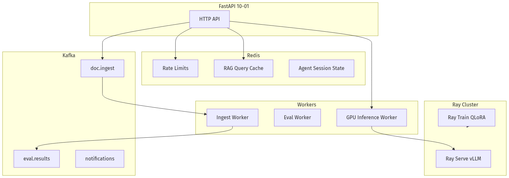
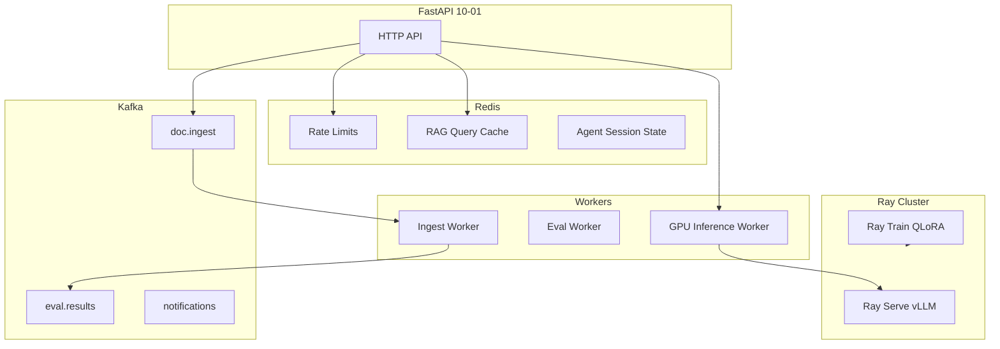
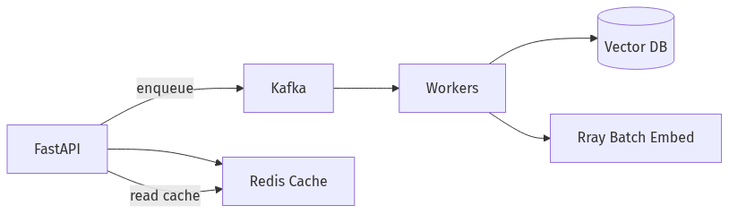
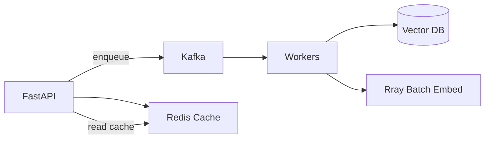
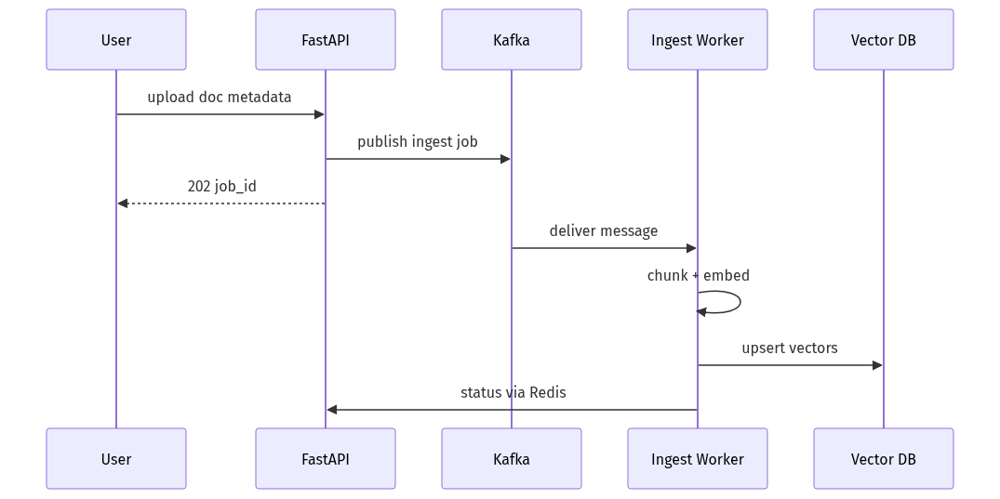
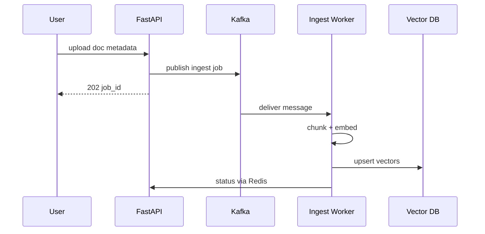

# 10-03 — Redis, Kafka & Ray: Async Infrastructure for AI Platforms

| Meta | Value |
|------|-------|
| **Estimated Time** | 5–6 hours (read 2h · lab 2.5h · architecture sketch 1h) |
| **Difficulty** | Intermediate (Redis/Kafka basics) · Advanced (Ray Serve + backpressure) |
| **Prerequisites** | [10-01 FastAPI AI Backends](10-01-FastAPI-AI-Backends.md) · [01-03 Inference Serving vLLM](../01-LLM-Engineering/01-03-Inference-Serving-vLLM.md) · message queue familiarity |
| **Module** | 10 — Production Infrastructure |
| **Related** | [10-02 Docker/K8s/CI/CD](10-02-Docker-Kubernetes-CICD.md) · [10-04 Cost & Latency](10-04-Cost-Latency-Optimization.md) · [03-01 Agent Anatomy](../03-Agentic-Fundamentals/03-01-Agent-Anatomy-and-Loop.md) · [09-01 PEFT LoRA](../09-Fine-Tuning/09-01-PEFT-LoRA-QLoRA.md) · [Architecture Index](../../Architecture Index.md) |

---

## Learning Objectives

By the end of this chapter you will be able to:

1. Use **Redis** for rate limiting, caching, sessions, and short-lived agent memory ([Redis docs](https://redis.io/docs/latest/)).
2. Apply **Kafka** for durable async job pipelines (ingest, eval, notifications) ([Kafka docs](https://kafka.apache.org/documentation/)).
3. Deploy **Ray** for distributed training, batch inference, and hyperparam sweeps ([Ray docs](https://docs.ray.io/en/latest/)).
4. Design **backpressure** when GPU inference is saturated.
5. Choose Redis vs Kafka vs Ray for a given AI workload — avoid using Kafka as a cache.
6. Integrate queue consumers with FastAPI producers ([10-01](10-01-FastAPI-AI-Backends.md)).

---

## Why This Topic Matters

Synchronous FastAPI → vLLM works until:

- ingest jobs flood embedding workers,
- agents spawn long tool chains ([03-01](../03-Agentic-Fundamentals/03-01-Agent-Anatomy-and-Loop.md)),
- fine-tune sweeps need parallel trials ([09-01](../09-Fine-Tuning/09-01-PEFT-LoRA-QLoRA.md)),
- GPU queues backlog and clients timeout.

**Redis** handles milliseconds-to-minutes state: rate limits, RAG cache, session scratchpad.

**Kafka** handles durable event streams: document ingest, eval results, audit logs.

**Ray** handles distributed Python compute: parallel eval, Ray Serve model replicas, training.

Staff engineers map each workload to the right bus — not "Kafka for everything."

---

## Business Impact

| Outcome | Infrastructure lever |
|---------|---------------------|
| **Protect GPU SLO** | Queue + worker pool when saturated |
| **Faster RAG** | Redis cache hot queries |
| **Reliable ingest** | Kafka replay on failure |
| **Cheaper FT sweeps** | Ray parallel QLoRA trials |

---

## Architecture Overview





---

## Core Concepts

### 1) Redis — Fast Structured State

**Docs:** [https://redis.io/docs/latest/](https://redis.io/docs/latest/)

| Use case | Pattern | TTL |
|----------|---------|-----|
| Rate limiting | INCR + EXPIRE sliding window | 60s |
| RAG cache | Hash of query → retrieved chunk IDs | 5–60 min |
| Agent scratchpad | JSON blob per session_id | session length |
| Distributed lock | SET NX ingest job | job duration |

**Not for:** durable audit logs, large payloads, multi-hour job queues at scale.

---

### 2) Kafka — Durable Event Log

**Docs:** [https://kafka.apache.org/documentation/](https://kafka.apache.org/documentation/)

| Use case | Topic pattern |
|----------|---------------|
| Document ingest | `novacart.docs.ingest` |
| Embedding complete | `novacart.docs.indexed` |
| Eval completion | `novacart.eval.completed` |
| Dead letter | `novacart.dlq` |

Properties: replay, consumer groups, at-least-once processing.

**Not for:** sub-ms cache, request/response RPC (use HTTP/gRPC).

---

### 3) Ray — Distributed Python Compute

**Docs:** [https://docs.ray.io/en/latest/](https://docs.ray.io/en/latest/)

| Component | AI use |
|-----------|--------|
| **Ray Tasks** | Parallel embed batches |
| **Ray Train** | Multi-GPU QLoRA ([09-01](../09-Fine-Tuning/09-01-PEFT-LoRA-QLoRA.md)) |
| **Ray Serve** | Model deployment alternative/complement to raw K8s vLLM |
| **Ray Data** | Large dataset preprocessing |

---

### 4) Decision Matrix

| Need | Choose |
|------|--------|
| Rate limit API | Redis |
| Cache retrieval | Redis |
| Durable ingest pipeline | Kafka |
| Replay failed jobs | Kafka |
| Parallel 100 eval runs | Ray |
| Online chat latency | Sync FastAPI → vLLM (queue only if saturated) |

---

### 5) Backpressure Pattern

When GPU queue depth > threshold → API returns **202 Accepted** + `job_id`; client polls or WebSocket for result via Redis/Kafka status topic.

---

## Implementation

### Redis rate limiter (production)

```python
"""Redis sliding-window rate limiter for FastAPI."""

from __future__ import annotations

import time
import redis.asyncio as redis
from fastapi import HTTPException


class RedisRateLimiter:
    def __init__(self, client: redis.Redis, rpm: int = 60) -> None:
        self.client = client
        self.rpm = rpm
        self.window = 60

    async def check(self, tenant_id: str) -> None:
        key = f"rl:{tenant_id}:{int(time.time()) // self.window}"
        count = await self.client.incr(key)
        if count == 1:
            await self.client.expire(key, self.window + 5)
        if count > self.rpm:
            raise HTTPException(429, "rate limit exceeded")
```

### RAG query cache

```python
import hashlib
import json
import redis.asyncio as redis


async def cached_retrieve(
    client: redis.Redis,
    query: str,
    department: str,
    retrieve_fn,
    ttl_seconds: int = 900,
) -> list[dict]:
    key = hashlib.sha256(f"{department}:{query}".encode()).hexdigest()
    cached = await client.get(f"rag:{key}")
    if cached:
        return json.loads(cached)
    chunks = await retrieve_fn(query, department)
    await client.setex(f"rag:{key}", ttl_seconds, json.dumps(chunks))
    return chunks
```

### Kafka producer (FastAPI lifespan)

```python
"""Kafka producer for async ingest jobs."""

from __future__ import annotations

import json
import os
from aiokafka import AIOKafkaProducer
from pydantic import BaseModel


KAFKA_BOOTSTRAP = os.getenv("KAFKA_BOOTSTRAP", "localhost:9092")
TOPIC_INGEST = "novacart.docs.ingest"


class IngestJob(BaseModel):
    doc_id: str
    s3_uri: str
    department: str
    tenant_id: str


class KafkaIngestProducer:
    def __init__(self) -> None:
        self._producer: AIOKafkaProducer | None = None

    async def start(self) -> None:
        self._producer = AIOKafkaProducer(bootstrap_servers=KAFKA_BOOTSTRAP)
        await self._producer.start()

    async def stop(self) -> None:
        if self._producer:
            await self._producer.stop()

    async def enqueue(self, job: IngestJob) -> None:
        assert self._producer is not None
        payload = json.dumps(job.model_dump()).encode()
        await self._producer.send_and_wait(TOPIC_INGEST, payload)
```

### Kafka consumer worker

```python
"""Ingest worker — consumes Kafka, embeds, indexes."""

from __future__ import annotations

import asyncio
import json
import logging

from aiokafka import AIOKafkaConsumer

logger = logging.getLogger(__name__)


async def process_ingest(message: dict) -> None:
    doc_id = message["doc_id"]
    s3_uri = message["s3_uri"]
    logger.info("processing doc_id=%s uri=%s", doc_id, s3_uri)
    # 1) download from S3
    # 2) chunk + embed (see 04-02)
    # 3) upsert vector index (see 04-03)
    await asyncio.sleep(0.1)  # placeholder


async def run_consumer() -> None:
    consumer = AIOKafkaConsumer(
        "novacart.docs.ingest",
        bootstrap_servers="localhost:9092",
        group_id="novacart-ingest-v1",
        enable_auto_commit=False,
    )
    await consumer.start()
    try:
        async for msg in consumer:
            try:
                payload = json.loads(msg.value.decode())
                await process_ingest(payload)
                await consumer.commit()
            except Exception:
                logger.exception("ingest failed offset=%s", msg.offset)
                # send to DLQ topic in production
    finally:
        await consumer.stop()


if __name__ == "__main__":
    asyncio.run(run_consumer())
```

### Ray parallel eval

```python
"""Ray parallel golden eval — fan out prompts to staging API."""

from __future__ import annotations

import os
from typing import Any

import ray
import httpx


@ray.remote
def eval_one(case: dict[str, Any], base_url: str, api_key: str) -> float:
    with httpx.Client(timeout=60.0) as client:
        r = client.post(
            f"{base_url}/v1/chat",
            headers={"Authorization": f"Bearer {api_key}"},
            json={"message": case["prompt"], "tenant_id": "eval"},
        )
        r.raise_for_status()
        answer = r.json()["answer"]
        return 1.0 if case["expected_substring"] in answer else 0.0


def run_parallel_eval(cases: list[dict], base_url: str, api_key: str) -> float:
    ray.init(ignore_reinit_error=True)
    futures = [eval_one.remote(c, base_url, api_key) for c in cases]
    scores = ray.get(futures)
    return sum(scores) / len(scores)
```

Deploy Ray on K8s via KubeRay operator — see [10-02](10-02-Docker-Kubernetes-CICD.md).

---

## Production Considerations

| Concern | Practice |
|---------|----------|
| Redis HA | Sentinel or Elasticache cluster mode |
| Kafka retention | Size topics by compliance needs |
| Idempotent consumers | Dedup by `doc_id` |
| Ray autoscaling | Min/max workers by queue depth |

---

## Security

| Risk | Control |
|------|---------|
| Redis exposed | VPC only; AUTH enabled |
| Kafka ACLs | Per-service produce/consume |
| Poison messages | Schema validation + DLQ |

---

## Performance

| Layer | Latency |
|-------|---------|
| Redis | sub-ms |
| Kafka | ms–s (batch friendly) |
| Ray task startup | seconds cold; pool workers |

---

## Cost

Redis/Kafka managed services vs self-host — see [10-04](10-04-Cost-Latency-Optimization.md). Ray cluster costs track GPU/CPU worker hours.

---

## Scalability

Horizontal Kafka consumers; Redis cluster sharding; Ray autoscale workers with queue lag metric.

---

## Failure Modes

| Failure | Mitigation |
|---------|------------|
| Redis down | Fail open vs closed for rate limit — policy choice |
| Kafka lag | Scale consumers; partition count plan |
| Ray OOM | Right-size actor memory |
| Duplicate ingest | Idempotent upsert by doc_id |

---

## Observability

Metrics: `kafka_consumer_lag`, `redis_hit_rate`, `ray_task_duration`, `gpu_queue_depth`.

---

## Debugging

| Symptom | Check |
|---------|-------|
| Stale RAG | Cache TTL; invalidation on re-ingest |
| Ingest stuck | Consumer lag; DLQ |
| Ray slow | Cluster resources; task granularity |

---

## Common Mistakes

1. Kafka as **cache** (wrong tool).
2. Redis as **only** job queue at high volume.
3. No **idempotency** on ingest workers.
4. Unbounded Ray tasks without GPU limits.
5. Synchronous 10-minute jobs in FastAPI request path.

---

## Tradeoffs

| Tool | Strength | Weakness |
|------|----------|----------|
| Redis | Speed | Durability limited |
| Kafka | Durability + replay | Ops complexity |
| Ray | Python distributed ML | Cluster ops |
| Celery + Redis | Simple tasks | Less ML-native than Ray |

---

## Architecture Diagram





---

## Mermaid Diagram — Sequence





---

## Production Examples

| Pattern | Stack |
|---------|-------|
| NovaCart doc sync | Kafka ingest + workers |
| Hot FAQ cache | Redis in front of RAG |
| Nightly eval | Ray parallel + Kafka results |
| GPU queue | Redis list + worker pool |

---

## Real Companies Using It (Public Patterns)

| Org | Pattern |
|-----|---------|
| **LinkedIn** | Kafka at scale |
| **Uber** | Redis + streaming |
| **Anyscale** | Ray ecosystem |
| **Confluent** | Kafka for event-driven ML |

---

## Hands-on Labs

### Lab A — Redis rate limit (30 min)

Wire `RedisRateLimiter` into [10-01](10-01-FastAPI-AI-Backends.md) gateway.

### Lab B — Kafka ingest (60 min)

Produce ingest job; consumer prints payload.

### Lab C — Ray eval (45 min)

Parallel 20-case eval against staging API.

---

## Coding Assignments

1. Cache invalidation webhook on doc update.
2. Kafka DLQ consumer with alert.
3. GPU queue depth metric + 503 when > threshold.

---

## Mini Project

**Title:** Async Ingest Pipeline v0  
**Done when:** FastAPI → Kafka → worker → log; Redis job status.

---

## Production Project

**Title:** RAG Cache + Ingest Platform  
**Done when:** Redis cache hit metrics; Kafka consumer on K8s [10-02](10-02-Docker-Kubernetes-CICD.md).

---

## Stretch Project

Ray Serve deployment wrapping vLLM — compare ops to raw K8s vLLM ([01-03](../01-LLM-Engineering/01-03-Inference-Serving-vLLM.md)).

---

## Interview Questions

### Senior Engineer

1. Redis vs Kafka — when each?
2. How do you rate-limit per tenant?
3. Why not run ingest synchronously in FastAPI?

### Staff Engineer

1. Design NovaCart ingest pipeline with replay.
2. Backpressure when GPU queue saturated?
3. Idempotency strategy for embed workers?

### Principal Engineer

1. Event bus standards across AI teams?
2. Ray vs K8s Jobs vs Step Functions for batch ML?
3. Cost of over-caching RAG — staleness vs $?

### Engineering Manager

1. Hire for Kafka ops vs managed Confluent?
2. On-call rotation for consumer lag alerts?
3. Build vs buy for Redis/Kafka?

### Whiteboard

Draw doc upload → Kafka → embed → vector index.

### Follow-ups

- Cache stampede on hot query?
- Kafka exactly-once vs at-least-once for ingest?

---

## Revision Notes

- **Redis** = fast state/cache/limits.
- **Kafka** = durable async pipelines.
- **Ray** = distributed Python ML compute.
- Integrate with [10-01](10-01-FastAPI-AI-Backends.md) + [10-02](10-02-Docker-Kubernetes-CICD.md).

---

## Summary

Redis, Kafka, and Ray solve different layers of AI platform infrastructure: ephemeral speed, durable pipelines, and distributed compute. Use them to protect GPU inference, accelerate RAG, and parallelize ingest and eval — not as interchangeable "message buses."

---

## Further Reading

| Title | URL | Difficulty | Reading Time | Why Read | Important Sections |
|-------|-----|------------|--------------|----------|--------------------|
| Redis Documentation | https://redis.io/docs/latest/ | Intro | 45 min | Commands & patterns | Data types; TTL |
| Kafka Documentation | https://kafka.apache.org/documentation/ | Intermediate | 60 min | Topics & consumer groups | Introduction |
| Ray Documentation | https://docs.ray.io/en/latest/ | Intermediate | 60 min | Ray Serve & Train | Getting started |
| FastAPI handbook | [10-01](10-01-FastAPI-AI-Backends.md) | Intermediate | 30 min | Producers | Lifespan |
| RAG handbook | [04-01](../04-RAG/04-01-RAG-Architecture.md) | Intermediate | 30 min | Ingest context | Offline indexing |
| Cost handbook | [10-04](10-04-Cost-Latency-Optimization.md) | Intermediate | 30 min | Queue economics | GPU saturation |
