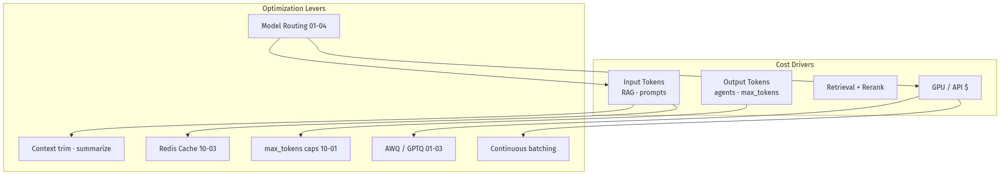
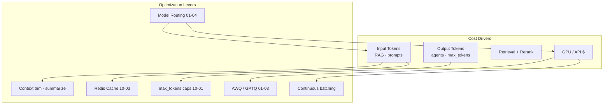
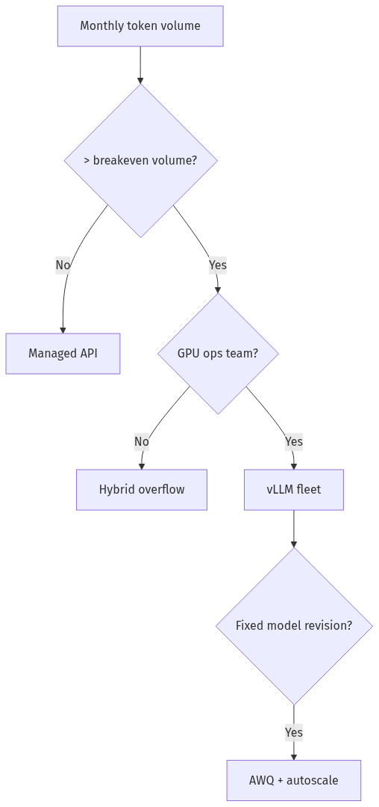
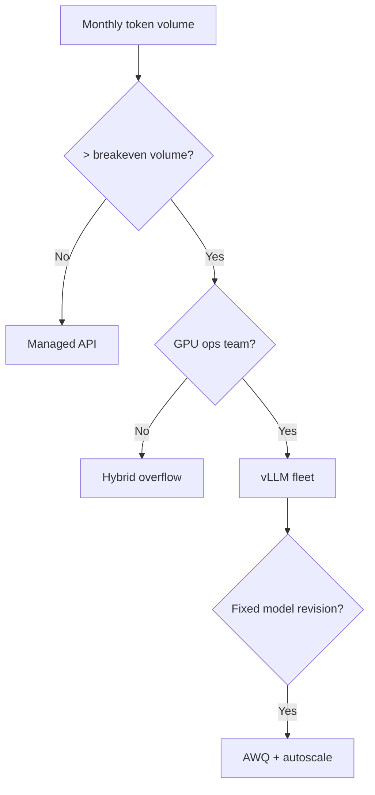
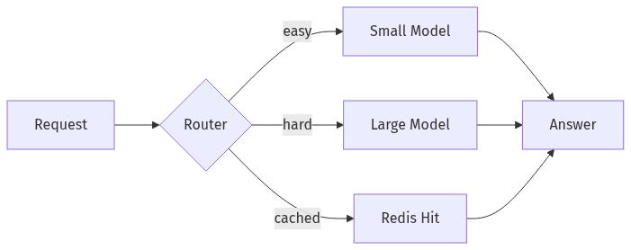
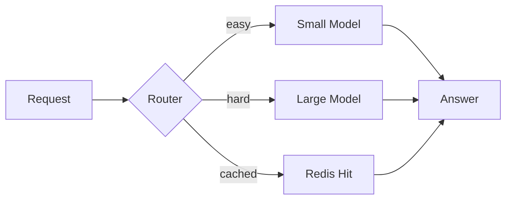
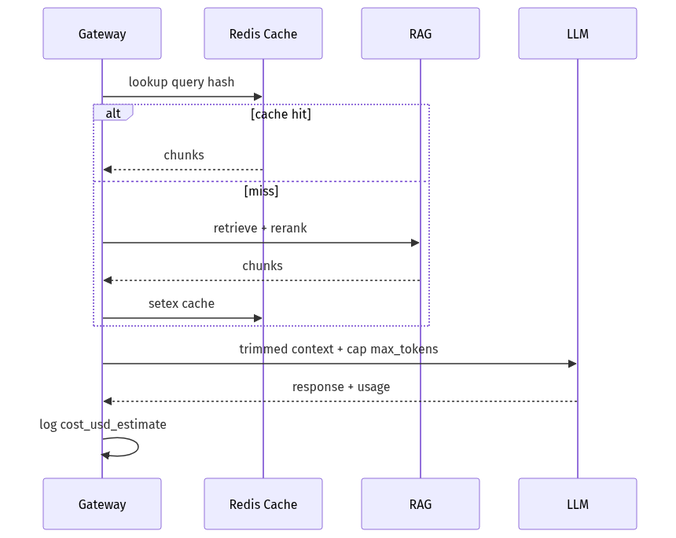
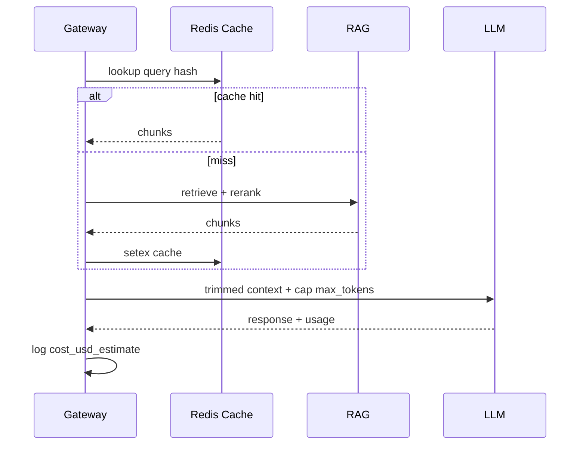

# 10-04 — Cost & Latency Optimization for LLM Systems

| Meta | Value |
|------|-------|
| **Estimated Time** | 5–6 hours (read 2h · spreadsheet lab 2h · SLO workshop 1.5h) |
| **Difficulty** | Intermediate (metrics) · Advanced (unit economics & multi-objective SLOs) |
| **Prerequisites** | [01-02 Tokenization](../01-LLM-Engineering/01-02-Tokenization-Context-Windows.md) · [01-03 Inference Serving vLLM](../01-LLM-Engineering/01-03-Inference-Serving-vLLM.md) · [10-01 FastAPI AI Backends](10-01-FastAPI-AI-Backends.md) |
| **Module** | 10 — Production Infrastructure |
| **Related** | [01-04 Model Routing](../01-LLM-Engineering/01-04-Model-Routing-LiteLLM.md) · [09-02 Prompt vs RAG vs FT](../09-Fine-Tuning/09-02-Prompting-vs-RAG-vs-FineTuning.md) · [10-03 Redis/Kafka/Ray](10-03-Redis-Kafka-Ray.md) · [08-01 Evaluation](../08-Evaluation-LLMOps/08-01-Evaluation-Lifecycle.md) · [Architecture Index](../../Architecture Index.md) |

---

## Learning Objectives

By the end of this chapter you will be able to:

1. Decompose LLM cost into **prefill, decode, retrieval, and infrastructure** components.
2. Define **latency SLOs** (TTFT, ITL, p95 end-to-end) separate from average throughput.
3. Build a **$/1M tokens** and **$/successful answer** spreadsheet with defensible assumptions.
4. Apply optimization levers: routing, caching, quantization, context trimming, batching.
5. Decide **self-host vs API breakeven** with volume and ops cost ([01-03](../01-LLM-Engineering/01-03-Inference-Serving-vLLM.md)).
6. Run **cost-aware architecture reviews** without sacrificing eval gates ([08-01](../08-Evaluation-LLMOps/08-01-Evaluation-Lifecycle.md)).

---

## Why This Topic Matters

CFOs do not fund "we shipped ChatGPT." They fund **margin per conversation**. LLM bills scale with:

- input tokens (RAG context, long system prompts),
- output tokens (agent loops, verbose models),
- retrieval and rerank API calls,
- GPU hours for self-host,
- failed requests you still paid for.

Latency and cost are coupled: **long contexts** increase prefill time *and* dollars. **Small model routing** cuts both — if eval passes ([01-04](../01-LLM-Engineering/01-04-Model-Routing-LiteLLM.md)).

Principal interviews: *"Design NovaCart support copilot within $0.02/conversation at p95 TTFT < 2s."* This chapter supplies the worksheet.

---

## Business Impact

| KPI | Optimization target |
|-----|---------------------|
| **Gross margin** | ↓ $/conversation |
| **Conversion** | ↓ TTFT for chat UX |
| **Support deflection** | ↑ successful answers per $ |
| **CapEx** | Right-size GPU fleet |

---

## Architecture Overview






---

## Core Concepts

### 1) Token Economics

| Phase | Billed as | NovaCart example |
|-------|-----------|------------------|
| **Prefill** | Input tokens | 8k policy context + question |
| **Decode** | Output tokens | 400-token reply |
| **Embeddings** | Embed API per chunk | Ingest + query embed |
| **Rerank** | Rerank API per query | top-20 → top-5 |

Cross-link: [01-02 Tokenization](../01-LLM-Engineering/01-02-Tokenization-Context-Windows.md).

---

### 2) Latency Metrics

| Metric | Definition | UX |
|--------|------------|-----|
| **TTFT** | Time to first token | "Is it thinking?" |
| **ITL** | Gap between tokens | Streaming smoothness |
| **E2E** | Request → last token | SLA dashboards |
| **Goodput** | Successful tokens/sec under SLO | Finance + infra |

Optimize TTFT with prefix caching ([01-03](../01-LLM-Engineering/01-03-Inference-Serving-vLLM.md)); decode with batching and quant.

---

### 3) $/Successful Answer > $/Token

```text
$/successful_answer = (total_llm_cost + infra_cost) / answers_passing_eval
```

A cheap model with 40% failure rate can cost more than a premium model at 95% pass rate.

---

### 4) Optimization Levers (Ordered)

1. **Don't call the LLM** — FAQ cache, regex router ([09-02](../09-Fine-Tuning/09-02-Prompting-vs-RAG-vs-FineTuning.md)).
2. **Smaller model route** — easy queries → 7B; hard → frontier ([01-04](../01-LLM-Engineering/01-04-Model-Routing-LiteLLM.md)).
3. **Trim context** — rerank to top-5; summarize long threads.
4. **Cap output** — gateway `max_tokens` ([10-01](10-01-FastAPI-AI-Backends.md)).
5. **Cache** — Redis hot RAG queries ([10-03](10-03-Redis-Kafka-Ray.md)).
6. **Quantize self-host** — AWQ 4-bit ([01-03](../01-LLM-Engineering/01-03-Inference-Serving-vLLM.md)).
7. **Self-host breakeven** — sustained volume only.

---

### 5) Self-Host vs API Breakeven






Rough intuition (measure yours): self-host often interesting above **100M–500M tokens/month** for 7B-class models — highly dependent on GPU $/hr and utilization.

---

### 6) Agent Loop Multiplier

Each agent iteration = **another** LLM call ([03-01](../03-Agentic-Fundamentals/03-01-Agent-Anatomy-and-Loop.md)). Cap steps; cache tool results; route planner to small model.

---

## Implementation

### Cost calculator (Python)

```python
"""NovaCart LLM unit economics calculator."""

from __future__ import annotations

from dataclasses import dataclass


@dataclass(frozen=True)
class Pricing:
    input_per_1m: float  # USD
    output_per_1m: float  # USD
    embed_per_1m: float = 0.02
    rerank_per_1k: float = 0.10


@dataclass(frozen=True)
class ConversationProfile:
    avg_input_tokens: int
    avg_output_tokens: int
    embed_tokens: int = 0
    rerank_calls: int = 0
    success_rate: float = 0.90  # fraction passing quality bar


def cost_per_conversation(profile: ConversationProfile, price: Pricing) -> float:
    llm_in = profile.avg_input_tokens / 1_000_000 * price.input_per_1m
    llm_out = profile.avg_output_tokens / 1_000_000 * price.output_per_1m
    embed = profile.embed_tokens / 1_000_000 * price.embed_per_1m
    rerank = profile.rerank_calls / 1000 * price.rerank_per_1k
    raw = llm_in + llm_out + embed + rerank
    return raw / max(profile.success_rate, 0.01)


def self_host_cost_per_1m_tokens(
    gpu_hourly_usd: float,
    tokens_per_second: float,
    utilization: float = 0.65,
) -> float:
    tokens_per_hour = tokens_per_second * 3600 * utilization
    if tokens_per_hour <= 0:
        return float("inf")
    return gpu_hourly_usd / tokens_per_hour * 1_000_000


# Example: GPT-4o-mini class pricing (illustrative — use vendor list price)
gpt4o_mini = Pricing(input_per_1m=0.15, output_per_1m=0.60)
novacart_rag_chat = ConversationProfile(
    avg_input_tokens=6000,
    avg_output_tokens=350,
    embed_tokens=500,
    rerank_calls=1,
    success_rate=0.88,
)

print(f"API $/conversation: ${cost_per_conversation(novacart_rag_chat, gpt4o_mini):.4f}")

# A10 self-host illustrative
sh = self_host_cost_per_1m_tokens(gpu_hourly_usd=1.50, tokens_per_second=120)
print(f"Self-host illustrative $/1M tokens: ${sh:.2f}")
```

### Latency budget worksheet

```python
from dataclasses import dataclass


@dataclass
class LatencyBudget:
    gateway_ms: int = 20
    retrieve_ms: int = 150
    rerank_ms: int = 80
    prefill_ms: int = 400
    decode_ms_per_token: int = 25
    output_tokens: int = 300

    @property
    def ttft_ms(self) -> int:
        return self.gateway_ms + self.retrieve_ms + self.rerank_ms + self.prefill_ms

    @property
    def e2e_ms(self) -> int:
        return self.ttft_ms + self.decode_ms_per_token * self.output_tokens


b = LatencyBudget()
print(f"TTFT budget: {b.ttft_ms}ms, E2E p50-ish: {b.e2e_ms}ms")
assert b.ttft_ms < 2000, "NovaCart SLO example: TTFT p95 target 2s"
```

### Gateway cost guard middleware

```python
"""Reject oversize requests before LLM call."""

from fastapi import HTTPException

MAX_INPUT_TOKENS = 8000

def enforce_input_budget(estimated_tokens: int) -> None:
    if estimated_tokens > MAX_INPUT_TOKENS:
        raise HTTPException(
            413,
            f"input exceeds token budget ({estimated_tokens}>{MAX_INPUT_TOKENS})",
        )
```

Use tiktoken per [01-02](../01-LLM-Engineering/01-02-Tokenization-Context-Windows.md).

---

## Production Considerations

| Concern | Practice |
|---------|----------|
| Cost attribution | `tenant_id`, `feature`, `model` on every trace |
| Budget alerts | Daily spend anomaly detection |
| SLO error budget | Slow deploy if latency regresses |
| FinOps review | Monthly model mix report |

---

## Security

Cost attacks: unbounded prompts → **rate limits + token caps** ([11-01](../11-Security-Safety/11-01-OWASP-LLM-Top-10.md) LLM04 resource exhaustion).

---

## Performance

See [01-03](../01-LLM-Engineering/01-03-Inference-Serving-vLLM.md): continuous batching, prefix caching, speculative decoding.

---

## Cost

This chapter *is* cost — track:

- blended $/1M tokens by model,
- GPU utilization %,
- cache hit rate,
- avg agent steps per task.

---

## Scalability

Cost scales sub-linearly with good **routing + cache**; linearly with naive "always GPT-4 + 20k context."

---

## Failure Modes

| Failure | Symptom | Fix |
|---------|---------|-----|
| Over-routing to cheap model | Eval fail spike | Tighten router thresholds |
| Aggressive cache | Stale RAG answers | TTL + invalidation |
| Low GPU util | High $/token self-host | Consolidate replicas |
| Uncapped agents | Bill shock | max_iterations |

---

## Observability

Dashboard panels: $/hour by model, TTFT p95, tokens/request, cache hit %, success_rate from eval.

---

## Debugging

| Question | Data |
|----------|------|
| Bill spike? | Token histogram by route |
| Latency spike? | Prefill vs decode breakdown |
| Margin drop? | Success rate vs cost |

---

## Common Mistakes

1. Optimizing **average TPS** while p95 TTFT fails SLO.
2. **10-shot** prompts instead of LoRA ([09-01](../09-Fine-Tuning/09-01-PEFT-LoRA-QLoRA.md)).
3. Self-hosting at **low volume**.
4. Ignoring **embed/rerank** in COGS.
5. No **success rate** in unit economics.

---

## Tradeoffs

| Lever | Saves $ | Risk |
|-------|---------|------|
| Smaller model | High | Quality |
| Quantization | High | Tool JSON |
| Shorter context | Medium | Recall |
| Cache | Medium | Staleness |
| Self-host | High at scale | Ops |

---

## Architecture Diagram





---

## Mermaid Diagram — Sequence





---

## Production Examples

| Pattern | Savings |
|---------|---------|
| Route tier-1 to 7B AWQ | 5–10× vs frontier API |
| Prefix cache system prompt | ↓ TTFT + prefill $ |
| Summarize thread > 4k tokens | ↓ input tokens |
| Batch nightly eval on Ray | ↓ wall clock not $ |

---

## Real Companies Using It (Public Patterns)

| Org | Pattern |
|-----|---------|
| **OpenAI** | Tiered models (mini vs full) |
| **Anthropic** | Prompt caching product |
| **Meta** | Open weights + self-host economics |
| **Shopify** | Cost-aware internal copilots |

---

## Hands-on Labs

### Lab A — Spreadsheet (60 min)

Model NovaCart 1M conversations/month API vs self-host.

### Lab B — Token audit (45 min)

Log token histogram; find top 10 expensive routes.

### Lab C — Cache A/B (45 min)

Measure hit rate + staleness on FAQ queries.

---

## Coding Assignments

1. Prometheus `cost_usd_estimate` counter by model.
2. Router sending classifier-low-confidence to large model only.
3. Auto-summarize conversation history > N tokens.

---

## Mini Project

**Title:** NovaCart Cost Dashboard v0  
**Done when:** Grafana panels for tokens, latency, $ estimate.

---

## Production Project

**Title:** Model Router with Eval Guard  
**Done when:** [01-04](../01-LLM-Engineering/01-04-Model-Routing-LiteLLM.md) + eval blocks bad routes.

---

## Stretch Project

FinOps report generator: weekly PDF for execs with $/successful answer trend.

---

## Interview Questions

### Senior Engineer

1. What drives prefill vs decode cost?
2. Name three ways to cut RAG latency and cost.
3. Why cap max_tokens at the gateway?

### Staff Engineer

1. Build latency budget for NovaCart copilot.
2. When does self-host beat API — what inputs?
3. How measure $/successful answer?

### Principal Engineer

1. Org-wide cost allocation for shared LLM platform?
2. Multi-objective: margin vs quality vs latency?
3. Agent loop cost governance?

### Engineering Manager

1. KPIs for FinOps + product weekly?
2. When approve GPU CapEx?
3. Communicate model downgrade to customers?

### Whiteboard

Draw router + cache + quant on cost/latency axes.

### Follow-ups

- Prompt cache vs Redis cache tradeoffs?
- Quant passes eval but fails prod tool calls?

---

## Revision Notes

- **TTFT ≠ TPS** — measure both.
- **$/successful answer** > $/token.
- Levers: route, trim, cap, cache, quant, self-host at scale.
- Cross: [01-03](../01-LLM-Engineering/01-03-Inference-Serving-vLLM.md) · [01-04](../01-LLM-Engineering/01-04-Model-Routing-LiteLLM.md) · [10-03](10-03-Redis-Kafka-Ray.md).

---

## Summary

Cost and latency optimization for LLM systems is **measurement-first engineering**: decompose token spend, set SLO budgets, apply routing and caching without bypassing eval gates, and self-host only when volume and ops maturity justify it. NovaCart wins on **$/successful grounded answer**, not vanity throughput metrics.

---

## Further Reading

| Title | URL | Difficulty | Reading Time | Why Read | Important Sections |
|-------|-----|------------|--------------|----------|--------------------|
| vLLM Documentation | https://docs.vllm.ai/en/latest/ | Intermediate | 30 min | Throughput knobs | Optimization |
| OpenAI Pricing | https://openai.com/api/pricing/ | Intro | 15 min | API unit costs | Model tiers |
| Inference handbook | [01-03](../01-LLM-Engineering/01-03-Inference-Serving-vLLM.md) | Intermediate | 45 min | Batching + quant | Cost section |
| Routing handbook | [01-04](../01-LLM-Engineering/01-04-Model-Routing-LiteLLM.md) | Intermediate | 30 min | Model mix | Fallbacks |
| Decision framework | [09-02](../09-Fine-Tuning/09-02-Prompting-vs-RAG-vs-FineTuning.md) | Intermediate | 30 min | Avoid wrong layer | Cost column |
| Redis cache | [10-03](10-03-Redis-Kafka-Ray.md) | Intermediate | 20 min | RAG cache | Implementation |
