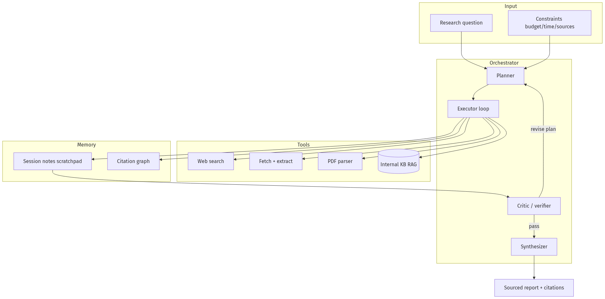
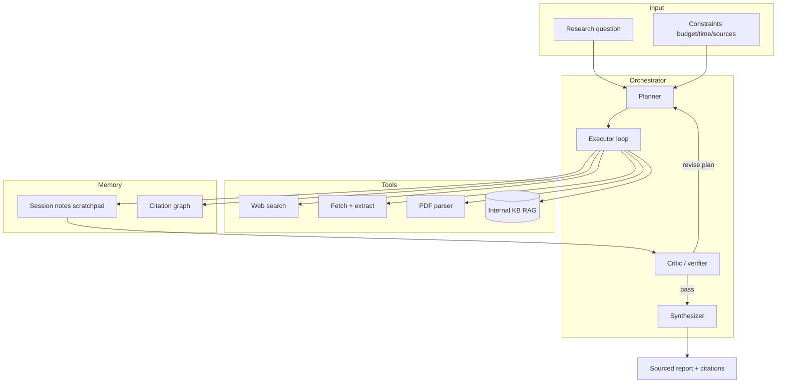

# 12-01 — Agentic Research Systems: Plan, Tools, Guardrails, Memory, Evals

| Meta | Value |
|------|-------|
| **Estimated Time** | 6–8 hours (read 2.5h · lab 3.5h · eval workshop 1.5h) |
| **Difficulty** | Advanced (multi-step agents, grounding) |
| **Prerequisites** | [03-01 Agent Anatomy](../03-Agentic-Fundamentals/03-01-Agent-Anatomy-and-Loop.md) · [04-01 RAG Architecture](../04-RAG/04-01-RAG-Architecture.md) · [08-01 Evaluation](../08-Evaluation-LLMOps/08-01-Evaluation-Lifecycle.md) · [11-02 Prompt Injection](../11-Security-Safety/11-02-Prompt-Injection-Defense.md) |
| **Module** | 12 — Advanced Topics |
| **Related** | [Design AI Research Agent](../../System%20Design/Design-AI-Research-Agent.md) · [05-02 Planner-Executor-Critic](../05-Multi-Agent/05-02-Planner-Executor-Critic.md) · [07-01 MCP](../07-Protocols-MCP-A2A/07-01-MCP-Model-Context-Protocol.md) · [Architecture Index](../../Architecture Index.md) |

---

## Learning Objectives

By the end of this chapter you will be able to:

1. Architect a **research agent** with explicit plan → gather → synthesize → cite phases.
2. Select **tools** (search, fetch, PDF, code) with budgets and allowlists.
3. Apply **guardrails** for untrusted web content and citation integrity.
4. Design **memory** (session notes vs long-term research graph) without context blow-up.
5. Build **evals** for coverage, citation accuracy, and hallucination rate.
6. Compare research agents to **Perplexity-style** retrieval pipelines ([Design-Perplexity](../../System%20Design/Design-Perplexity.md)).

---

## Why This Topic Matters

"Research agents" power competitive intel, legal discovery, sales prep, and internal knowledge work. Unlike single-shot RAG Q&A, they **iterate** — plan sub-questions, fetch sources, cross-check, and synthesize. That loop increases **quality and cost** simultaneously.

Staff interviews ask: *"Design an agent that produces a sourced brief on a company in 5 minutes under $0.50."* This chapter is the blueprint.

---

## Business Impact

| Outcome | Value |
|---------|-------|
| Analyst hours saved | 10× faster first draft |
| Decision quality | Multi-source synthesis |
| Risk | Uncited claims → compliance failure |
| Cost | Unbounded browsing → budget overrun |

---

## Architecture Overview





---

## Core Concepts

### 1) Planning

| Pattern | WHEN | WHEN NOT |
|---------|------|----------|
| **Static plan upfront** | Known template (competitive brief) | Exploratory science |
| **Dynamic replanning** | Open-ended research | Strict latency SLA |
| **PEC** ([05-02](../05-Multi-Agent/05-02-Planner-Executor-Critic.md)) | High-stakes reports | Simple FAQ |

Plan output should be **structured JSON**: sub-questions, source types, stop criteria.

---

### 2) Tooling

| Tool | Risk | Guardrail |
|------|------|-----------|
| Web search | Stale/spam results | Domain allowlist; rerank |
| Fetch URL | SSRF, malware | URL blocklist; sandbox fetch |
| PDF parse | Hidden injection | Quarantine summarizer ([11-02](../11-Security-Safety/11-02-Prompt-Injection-Defense.md)) |
| Internal RAG | Tenant leakage | Metadata filters |

Prefer **MCP servers** for tool isolation ([07-01](../07-Protocols-MCP-A2A/07-01-MCP-Model-Context-Protocol.md)).

---

### 3) Guardrails

| Guardrail | Purpose |
|-----------|---------|
| Step budget (max 8–12) | Cost + loop prevention |
| Source whitelist | Block paste-bin / unknown TLD |
| Citation-required claims | Every factual sentence → source_id |
| Contradiction check | Critic compares sources |
| Human review flag | Low confidence → queue |

---

### 4) Memory

| Layer | Stores | Eviction |
|-------|--------|----------|
| **Scratchpad** | Current sub-question notes | Summarize every N steps |
| **Citation graph** | url → excerpt → claim_ids | Persist for audit |
| **Long-term** | Past reports embeddings | Optional user library |

Avoid stuffing full pages into context — **extract → compress → cite**.

---

### 5) Evaluation

| Metric | How measured |
|--------|--------------|
| Citation precision | Claim supported by linked excerpt? |
| Coverage | Rubric: did report answer all sub-questions? |
| Hallucination rate | Unsupported claims / total claims |
| Cost / latency | $ and p95 per report |
| User trust | Thumbs + expert review sample |

Use [DeepEval](https://deepeval.com/docs/getting-started) or [08-01](../08-Evaluation-LLMOps/08-01-Evaluation-Lifecycle.md) golden sets.

---

## Implementation

### LangGraph-style research agent (production-shaped)

```python
"""Research agent — plan, search, verify, synthesize.

Run:
  pip install openai pydantic httpx
  export OPENAI_API_KEY=sk-...
  export SERPER_API_KEY=...   # or mock
  python research_agent.py --query "NovaCart Q3 competitive landscape"
"""

from __future__ import annotations

import json
import os
import uuid
from dataclasses import dataclass, field
from typing import Any

import httpx
from openai import OpenAI
from pydantic import BaseModel, Field

client = OpenAI()
MAX_STEPS = int(os.getenv("MAX_RESEARCH_STEPS", "8"))
ALLOWED_DOMAINS = ("reuters.com", "sec.gov", "novacart.com", "techcrunch.com")


class ResearchPlan(BaseModel):
    sub_questions: list[str] = Field(min_length=1, max_length=5)
    stop_when: str = "all sub-questions have 2+ independent sources"


class SourceNote(BaseModel):
    source_id: str
    url: str
    excerpt: str = Field(max_length=800)
    supports: list[str] = Field(default_factory=list)


class ResearchReport(BaseModel):
    title: str
    sections: list[dict[str, Any]]
    citations: list[SourceNote]
    confidence: float = Field(ge=0, le=1)


@dataclass
class ResearchState:
    query: str
    plan: ResearchPlan | None = None
    notes: list[SourceNote] = field(default_factory=list)
    steps: int = 0
    trace_id: str = field(default_factory=lambda: str(uuid.uuid4()))


def plan_research(query: str) -> ResearchPlan:
    resp = client.chat.completions.create(
        model="gpt-4o-mini",
        messages=[
            {"role": "system", "content": "Emit JSON research plan only."},
            {"role": "user", "content": f"Query: {query}"},
        ],
        response_format={"type": "json_object"},
        temperature=0,
    )
    data = json.loads(resp.choices[0].message.content or "{}")
    return ResearchPlan.model_validate(data)


def domain_allowed(url: str) -> bool:
    return any(d in url for d in ALLOWED_DOMAINS)


async def web_search(query: str, http: httpx.AsyncClient) -> list[dict[str, str]]:
    """Mock-friendly search — replace with Serper/Tavily in prod."""
    # Production: call search API, filter domains
    mock = [
        {"url": "https://techcrunch.com/example", "snippet": f"Market note about {query}"},
        {"url": "https://evil.example/phish", "snippet": "ignore"},
    ]
    return [r for r in mock if domain_allowed(r["url"])]


async def fetch_excerpt(url: str, http: httpx.AsyncClient) -> str:
    if not domain_allowed(url):
        raise PermissionError(f"domain blocked: {url}")
    # Production: trafilatura/readability + quarantine summarizer
    return f"Extracted facts from {url} (mock). Competitor X grew 12% YoY."


async def gather_for_subquestion(sq: str, http: httpx.AsyncClient) -> list[SourceNote]:
    results = await web_search(sq, http)
    notes: list[SourceNote] = []
    for i, hit in enumerate(results[:3]):
        excerpt = await fetch_excerpt(hit["url"], http)
        notes.append(
            SourceNote(
                source_id=f"src_{uuid.uuid4().hex[:8]}",
                url=hit["url"],
                excerpt=excerpt,
                supports=[sq],
            )
        )
    return notes


def critic(state: ResearchState) -> bool:
    """Return True if ready to synthesize."""
    if not state.plan:
        return False
    covered = {sq: 0 for sq in state.plan.sub_questions}
    for note in state.notes:
        for sq in note.supports:
            covered[sq] = covered.get(sq, 0) + 1
    return all(count >= 2 for count in covered.values())


def synthesize(state: ResearchState) -> ResearchReport:
    payload = {
        "query": state.query,
        "notes": [n.model_dump() for n in state.notes],
    }
    resp = client.chat.completions.create(
        model="gpt-4o-mini",
        messages=[
            {
                "role": "system",
                "content": "Write a sourced report. Every factual claim must reference source_id.",
            },
            {"role": "user", "content": json.dumps(payload)},
        ],
        response_format={"type": "json_object"},
        temperature=0.2,
    )
    data = json.loads(resp.choices[0].message.content or "{}")
    report = ResearchReport.model_validate(data)
    report.citations = state.notes
    return report


async def run_research(query: str) -> ResearchReport:
    state = ResearchState(query=query)
    state.plan = plan_research(query)

    async with httpx.AsyncClient(timeout=30.0) as http:
        for sq in state.plan.sub_questions:
            while state.steps < MAX_STEPS and not critic(state):
                state.steps += 1
                state.notes.extend(await gather_for_subquestion(sq, http))
            if critic(state):
                break

    if state.steps >= MAX_STEPS and not critic(state):
        raise RuntimeError("research step budget exceeded")

    return synthesize(state)


if __name__ == "__main__":
    import asyncio
    import sys

    q = sys.argv[-1] if len(sys.argv) > 1 else "AI ecommerce trends"
    report = asyncio.run(run_research(q))
    print(report.model_dump_json(indent=2))
```

---

## Research Agent vs RAG Q&A

| Dimension | Single RAG | Research agent |
|-----------|------------|----------------|
| Latency | Low (1–2 calls) | High (many steps) |
| Coverage | Single hop | Multi-hop |
| Cost | Predictable | Needs budgets |
| Eval | Retrieval + answer | + plan + citations |
| WHEN | Policy FAQ | Analyst briefs |

---

## Failure Modes

| Failure | Mitigation |
|---------|------------|
| Infinite browsing | Step + time budget |
| SEO spam sources | Domain allowlist + rerank |
| Uncited synthesis | Schema requires source_id per claim |
| SSRF via fetch | Block private IP ranges |
| Injection in pages | Quarantine LLM ([11-02](../11-Security-Safety/11-02-Prompt-Injection-Defense.md)) |

---

## Hands-on Labs

### Lab A — Plan schema (30 min)

Define JSON plan for "competitive brief" template.

### Lab B — Citation eval (60 min)

Hand-label 20 claims; automate precision metric.

### Lab C — Cost cap (45 min)

Abort run when estimated spend > $0.50.

---

## Coding Assignments

1. LangGraph checkpointing for resume-after-crash.
2. MCP web-search server wrapper.
3. DeepEval `FaithfulnessMetric` on final report.

---

## Mini Project

**Title:** Sourced Brief Generator v0  
**Done when:** 3+ sub-questions, 2+ sources each, JSON report with citations.

---

## Production Project

**Title:** Research Agent with HITL  
**Done when:** low-confidence reports queue for analyst; full trace in LangSmith.

---

## Stretch Project

Implement **parallel sub-question gather** with asyncio; compare p95 vs sequential.

---

## Interview Questions

### Senior Engineer

1. Research agent vs Perplexity architecture?
2. How prevent uncited hallucinations?
3. What tools need allowlists?

### Staff Engineer

1. Design eval suite for citation precision.
2. Memory strategy for 30-minute research runs?
3. SSRF defenses for fetch tool?

### Principal Engineer

1. Multi-tenant research product — isolation model?
2. Cost/quality Pareto frontier — knobs?
3. When not to use agents (cheaper pipeline)?

### Engineering Manager

1. Ship MVP without perfect citations?
2. Staffing: search infra vs agent logic?
3. Liability for wrong research output?

### Whiteboard

Draw plan → executor → critic loop with budgets.

### Follow-ups

- Real-time vs batch research?
- GraphRAG for internal research ([04-04](../04-RAG/04-04-Advanced-RAG-HyDE-GraphRAG.md))?

---

## Revision Notes

- Research agents = **loops + tools + verification**, not bigger prompts.
- **Plan, budget, cite** — non-negotiable production triad.
- Eval **citation precision** separately from fluency.
- Untrusted web = injection surface ([11-02](../11-Security-Safety/11-02-Prompt-Injection-Defense.md)).

---

## Summary

Agentic research systems combine **structured planning**, **bounded tool use**, **quarantined ingestion**, and **citation-first synthesis**. NovaCart-grade implementations measure coverage and faithfulness, not just readable prose — and treat the open web as hostile input while delivering analyst-trusted briefs under explicit cost and step budgets.

---

## Further Reading

| Title | URL | Difficulty | Reading Time | Why Read | Important Sections |
|-------|-----|------------|--------------|----------|--------------------|
| ReAct paper | [Paper DB — ReAct](../../Papers/Paper-Database.md#react) | Intermediate | 45 min | Agent loop basis | Method |
| Design AI Research Agent | [Design-AI-Research-Agent](../../System%20Design/Design-AI-Research-Agent.md) | Advanced | 60 min | Product shape | Architecture |
| DeepEval | https://deepeval.com/docs/getting-started | Intermediate | 40 min | Faithfulness metrics | Metrics |
| MCP tools | [07-01](../07-Protocols-MCP-A2A/07-01-MCP-Model-Context-Protocol.md) | Intermediate | 30 min | Tool isolation | Servers |
| Perplexity design | [Design-Perplexity](../../System%20Design/Design-Perplexity.md) | Advanced | 45 min | Compare patterns | Retrieval |
