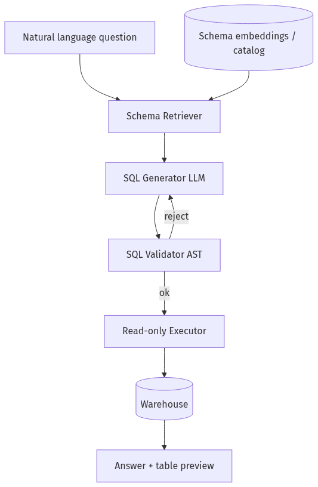
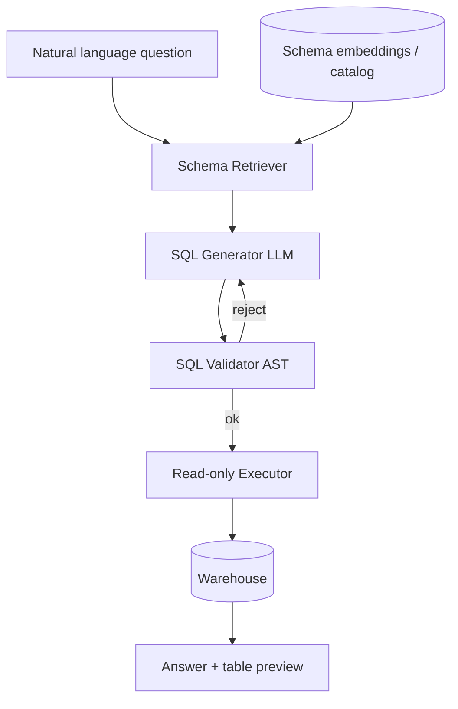

# 12-02 — Text-to-SQL Agents: Schema Retrieval, Safety, Spider-Style Evals

| Meta | Value |
|------|-------|
| **Estimated Time** | 6–7 hours (read 2h · lab 3h · eval lab 1.5h) |
| **Difficulty** | Advanced (SQL safety + grounding) |
| **Prerequisites** | [02-02 Structured Outputs](../02-Prompt-Engineering/02-02-Structured-Outputs-Tool-Calling.md) · [04-03 Vector DB Hybrid](../04-RAG/04-03-Vector-DB-Hybrid-Search-Reranking.md) · [11-01 OWASP](../11-Security-Safety/11-01-OWASP-LLM-Top-10.md) |
| **Module** | 12 — Advanced Topics |
| **Related** | [12-01 Research Agents](12-01-Research-Agents.md) · [03-02 Tools](../03-Agentic-Fundamentals/03-02-Tools-Memory-Control-Flow.md) · [08-01 Evaluation](../08-Evaluation-LLMOps/08-01-Evaluation-Lifecycle.md) · [Architecture Index](../../Architecture Index.md) |

---

## Learning Objectives

By the end of this chapter you will be able to:

1. Build **schema retrieval** so models see relevant tables/columns only.
2. Implement **SQL tools** with validation, read-only roles, and row limits.
3. Prevent **dangerous queries** (DROP, multi-statement, cross-DB).
4. Run **Spider-like evals** (execution accuracy + exact match).
5. Explain **WHEN** text-to-SQL beats semantic layer / BI tools.
6. Map failures to **OWASP LLM05** improper output handling.

---

## Why This Topic Matters

Natural language to SQL is the gateway to **self-serve analytics** — and the fastest path to **data breaches** if the agent runs arbitrary SQL. Production systems combine **schema RAG**, **AST validation**, **least-privilege DB users**, and **golden eval sets** (Spider, BIRD, internal queries).

BankCo/NovaCart analytics copilots are classic Staff interview prompts.

---

## Business Impact

| Upside | Downside if unsafe |
|--------|-------------------|
| Analyst self-service | DROP TABLE |
| Faster decisions | PII exfiltration via JOIN |
| Lower BI backlog | Wrong aggregates → bad decisions |

---

## Architecture Overview





---

## Core Concepts

### 1) Schema Retrieval

| Approach | WHEN |
|----------|------|
| Full schema dump | Tiny SQLite demos only |
| **Embedding retrieval** | 50+ tables warehouses |
| Metadata catalog (Glue/Datahub) | Enterprise governance |
| Table-level ACL | Multi-tenant |

Retrieve: table DDL snippets, column descriptions, **example values**, FK relationships.

Cross-ref [04-03](../04-RAG/04-03-Vector-DB-Hybrid-Search-Reranking.md).

---

### 2) SQL Generation Patterns

| Pattern | Notes |
|---------|-------|
| Single-shot SELECT | Fast; errors on complex joins |
| Generate → execute → fix loop | ReAct style; cap iterations |
| Semantic layer (dbt metrics) | Safer; less flexible |
| Structured output JSON `{sql, explanation}` | Parse before execute |

Always **`SELECT` only** in v1 production.

---

### 3) Dangerous Query Prevention

| Threat | Control |
|--------|---------|
| DROP/DELETE/UPDATE | AST denylist |
| Multi-statement `;` | Parser rejects |
| Comments smuggling | Strip or reject |
| UNION exfil | Row limit + column allowlist |
| Timing attacks | Query timeout |
| Cross-schema | DB user scoped to one schema |

**OWASP LLM05:** Never pass raw LLM string to JDBC without validation.

---

### 4) Spider-Style Evaluation

| Metric | Definition |
|--------|------------|
| **Execution accuracy (EX)** | Result set matches gold on DB |
| **Exact match (EM)** | SQL string identical (strict) |
| **Valid SQL rate** | Parses + runs without error |
| **Safety rate** | No policy violations |

Spider dataset: multi-domain SQLite; BIRD adds dirty values. Use subset for CI; full for research.

---

## Implementation

### Production-shaped text-to-SQL agent

```python
"""Text-to-SQL agent with schema RAG + AST guard.

Run:
  pip install openai pydantic sqlparse
  export OPENAI_API_KEY=sk-...
  python text_to_sql_agent.py --question "Top 5 products by revenue last month"
"""

from __future__ import annotations

import json
import re
import sqlite3
from dataclasses import dataclass
from pathlib import Path
from typing import Any

import sqlparse
from openai import OpenAI
from pydantic import BaseModel, Field
from sqlparse.sql import Identifier, IdentifierList
from sqlparse.tokens import DML

client = OpenAI()
MAX_ROWS = 100
FORBIDDEN = re.compile(r"\b(DROP|DELETE|UPDATE|INSERT|ALTER|CREATE|ATTACH|DETACH|PRAGMA)\b", re.I)


class SqlDraft(BaseModel):
    sql: str
    explanation: str = Field(max_length=400)


@dataclass
class SchemaChunk:
    table: str
    ddl: str
    description: str


# Mock schema catalog — production: embed + retrieve from Glue/Datahub
SCHEMA: list[SchemaChunk] = [
    SchemaChunk(
        "orders",
        "CREATE TABLE orders (order_id TEXT, customer_id TEXT, total_usd REAL, created_at TEXT);",
        "Customer orders with totals and timestamps.",
    ),
    SchemaChunk(
        "order_items",
        "CREATE TABLE order_items (order_id TEXT, product_id TEXT, qty INT, price_usd REAL);",
        "Line items per order.",
    ),
    SchemaChunk(
        "products",
        "CREATE TABLE products (product_id TEXT, name TEXT, category TEXT);",
        "Product catalog.",
    ),
]


def retrieve_schema(question: str, k: int = 3) -> list[SchemaChunk]:
    """Naive keyword retrieval — replace with embeddings in prod."""
    q = question.lower()
    scored = []
    for chunk in SCHEMA:
        score = sum(1 for tok in chunk.table.split("_") if tok in q)
        score += chunk.description.lower().count("product") if "product" in q else 0
        scored.append((score, chunk))
    scored.sort(key=lambda x: x[0], reverse=True)
    return [c for s, c in scored[:k] if s > 0] or SCHEMA[:k]


def validate_sql(sql: str) -> None:
    if FORBIDDEN.search(sql):
        raise ValueError("forbidden keyword in SQL")
    parsed = sqlparse.parse(sql.strip())
    if len(parsed) != 1:
        raise ValueError("multi-statement SQL rejected")
    stmt = parsed[0]
    # First meaningful token must be SELECT
    for token in stmt.tokens:
        if token.tmatch(DML):
            if token.value.upper() != "SELECT":
                raise ValueError("only SELECT allowed")
            break
    else:
        raise ValueError("no DML token found")
    if ";" in sql.strip().rstrip(";"):
        raise ValueError("semicolon-separated statements rejected")


def enforce_limit(sql: str) -> str:
    if re.search(r"\blimit\b", sql, re.I):
        return sql
    return f"{sql.rstrip(';')} LIMIT {MAX_ROWS}"


def generate_sql(question: str, schema_chunks: list[SchemaChunk]) -> SqlDraft:
    schema_text = "\n\n".join(f"{c.table}: {c.ddl}\n-- {c.description}" for c in schema_chunks)
    resp = client.chat.completions.create(
        model="gpt-4o-mini",
        messages=[
            {
                "role": "system",
                "content": "Generate a single SQLite SELECT query. JSON: {sql, explanation}.",
            },
            {"role": "user", "content": f"Schema:\n{schema_text}\n\nQuestion: {question}"},
        ],
        response_format={"type": "json_object"},
        temperature=0,
    )
    return SqlDraft.model_validate_json(resp.choices[0].message.content or "{}")


def execute_sql(db_path: Path, sql: str) -> list[dict[str, Any]]:
    con = sqlite3.connect(db_path)
    con.row_factory = sqlite3.Row
    try:
        cur = con.execute(sql)
        rows = cur.fetchmany(MAX_ROWS)
        return [dict(r) for r in rows]
    finally:
        con.close()


def answer_question(db_path: Path, question: str, max_retries: int = 2) -> dict[str, Any]:
    chunks = retrieve_schema(question)
    last_err = ""
    for _ in range(max_retries + 1):
        draft = generate_sql(question, chunks)
        sql = enforce_limit(draft.sql)
        try:
            validate_sql(sql)
            rows = execute_sql(db_path, sql)
            return {"sql": sql, "rows": rows, "explanation": draft.explanation}
        except Exception as exc:  # noqa: BLE001
            last_err = str(exc)
            question = f"{question}\n\nPrevious SQL error: {last_err}. Fix SQL."
    raise RuntimeError(f"failed after retries: {last_err}")


def spider_like_eval(db_path: Path, cases: list[tuple[str, str]]) -> dict[str, float]:
    """cases: (question, gold_sql) — compare execution results."""
    ex = 0
    valid = 0
    for q, gold in cases:
        try:
            pred = answer_question(db_path, q)
            validate_sql(gold)
            gold_rows = execute_sql(db_path, gold)
            valid += 1
            if pred["rows"] == gold_rows:
                ex += 1
        except Exception:  # noqa: BLE001
            continue
    n = len(cases) or 1
    return {"valid_sql_rate": valid / n, "execution_accuracy": ex / n}


if __name__ == "__main__":
    print(json.dumps({"schema_tables": [c.table for c in SCHEMA]}, indent=2))
```

---

## WHEN / WHEN NOT

| Use text-to-SQL | Prefer semantic layer / BI |
|-----------------|---------------------------|
| Ad hoc analyst questions | Governed executive dashboards |
| Prototype internal copilot | Regulated production metrics |
| Known warehouse + strong ACL | Complex business metrics in dbt |

---

## Failure Modes

| Failure | Fix |
|---------|-----|
| Wrong join path | Add FK hints in schema retrieval |
| Hallucinated columns | Validator + retry with error message |
| PII columns in SELECT | Column allowlist per role |
| Injection in NL question | Treat as untrusted ([11-02](../11-Security-Safety/11-02-Prompt-Injection-Defense.md)) |

---

## Hands-on Labs

### Lab A — Schema RAG (45 min)

Embed table descriptions; compare retrieval vs full schema token cost.

### Lab B — AST fuzz (60 min)

Feed 30 malicious SQL strings; assert 100% reject.

### Lab C — Spider subset (90 min)

Run 20 dev questions; track EX metric.

---

## Coding Assignments

1. Postgres `EXPLAIN` cost guard — reject expensive plans.
2. LangGraph loop: generate → validate → execute → summarize.
3. Promptfoo tests for SQL injection via NL.

---

## Mini Project

**Title:** Read-Only Analytics Copilot v0  
**Done when:** schema retrieval + validator + SQLite execution.

---

## Production Project

**Title:** Warehouse SQL Agent with RBAC  
**Done when:** per-role column masks; audit log of every query.

---

## Stretch Project

Fine-tune small model on internal SQL corpus ([09-01](../09-Fine-Tuning/09-01-PEFT-LoRA-QLoRA.md)); compare EX vs GPT-4o-mini.

---

## Interview Questions

### Senior Engineer

1. How prevent DROP via text-to-SQL?
2. Schema retrieval vs full DDL — tradeoff?
3. What is execution accuracy?

### Staff Engineer

1. Design NovaCart analytics agent on Snowflake.
2. Multi-tenant isolation for shared warehouse?
3. ReAct loop vs single-shot SQL?

### Principal Engineer

1. Semantic layer vs agent — decision framework?
2. Audit and compliance for generated SQL?
3. Cost of retries on failed queries?

### Engineering Manager

1. Who owns SQL safety — data platform or AI team?
2. Ship read-only v1 without write path?
3. Wrong aggregate in board report — incident process?

### Whiteboard

Draw schema RAG → validator → read replica execution.

### Follow-ups

- Chart generation from result sets?
- Integration with MCP SQL servers?

---

## Revision Notes

- Text-to-SQL = **RAG on schema + AST gate + read-only DB user**.
- Eval with **execution accuracy**, not string match alone.
- OWASP **LLM05** — validate before execute.
- Spider/BIRD patterns for **regression CI**.

---

## Summary

Reliable text-to-SQL agents retrieve **minimal relevant schema**, generate **single SELECT statements**, validate with **AST denylists**, execute under **read-only least privilege**, and prove quality with **Spider-style execution metrics**. NovaCart and BankCo copilots treat natural language as untrusted and SQL as a capability to be earned, not assumed.

---

## Further Reading

| Title | URL | Difficulty | Reading Time | Why Read | Important Sections |
|-------|-----|------------|--------------|----------|--------------------|
| Spider paper | https://arxiv.org/abs/1809.00635 | Advanced | 60 min | Eval benchmark | Task definition |
| OWASP LLM05 | [11-01](../11-Security-Safety/11-01-OWASP-LLM-Top-10.md) | Intermediate | 20 min | Output handling | Controls |
| Structured outputs | [02-02](../02-Prompt-Engineering/02-02-Structured-Outputs-Tool-Calling.md) | Intermediate | 30 min | JSON SQL drafts | Validation |
| Hybrid search | [04-03](../04-RAG/04-03-Vector-DB-Hybrid-Search-Reranking.md) | Intermediate | 25 min | Schema retrieval | Patterns |
| BIRD benchmark | https://bird-bench.github.io/ | Advanced | 45 min | Dirty data eval | Leaderboard |
