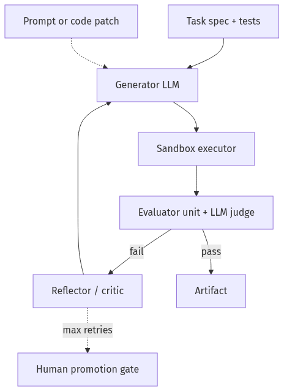
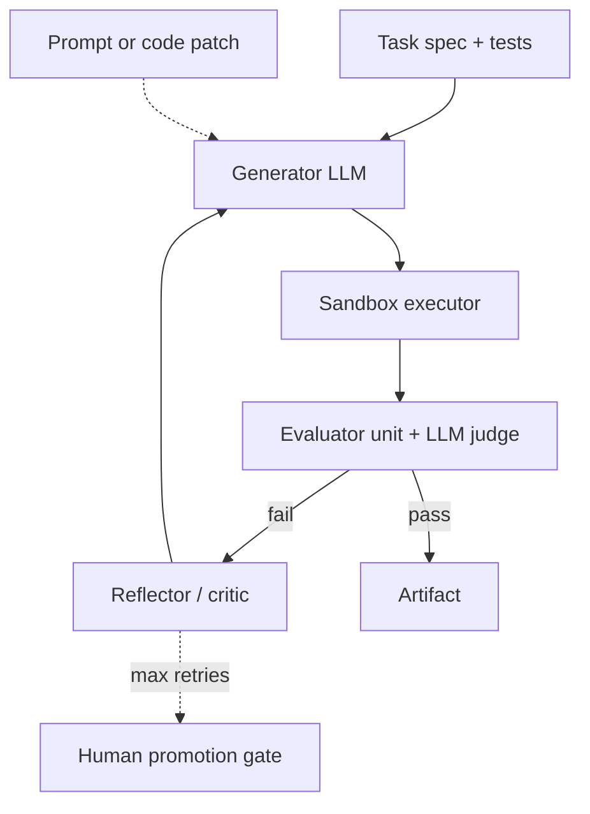

# 12-03 — Self-Improving Agents: Generate, Test, Refine in Sandboxes

| Meta | Value |
|------|-------|
| **Estimated Time** | 5–6 hours (read 2h · lab 2.5h · safety review 1h) |
| **Difficulty** | Advanced (autonomous loops, safety boundaries) |
| **Prerequisites** | [08-01 Evaluation](../08-Evaluation-LLMOps/08-01-Evaluation-Lifecycle.md) · [03-03 Agentic Design Patterns](../03-Agentic-Fundamentals/03-03-Agentic-Design-Patterns.md) · [11-01 OWASP](../11-Security-Safety/11-01-OWASP-LLM-Top-10.md) |
| **Module** | 12 — Advanced Topics |
| **Related** | [12-04 DSPy](12-04-DSPy-Programmatic-Prompting.md) · [Reflexion paper](../../Papers/Paper-Database.md#reflexion) · [09-01 PEFT](../09-Fine-Tuning/09-01-PEFT-LoRA-QLoRA.md) · [Architecture Index](../../Architecture Index.md) |

---

## Learning Objectives

By the end of this chapter you will be able to:

1. Implement **generate → test → refine** loops with explicit stop criteria.
2. Run code and tool tests in **sandboxes** with resource limits.
3. Set **retry limits**, rollback, and human escalation paths.
4. Distinguish self-improving agents from **unsafe self-modifying** systems.
5. Measure improvement with **held-out eval sets** — avoid overfitting loops.
6. Explain **WHEN** autonomy helps vs when HITL is mandatory.

---

## Why This Topic Matters

Self-improving agents (Reflexion, Voyager-style skill libraries, codegen repair loops) promise **higher success rates** on multi-step tasks. They also amplify failures: infinite retries, runaway cost, unsafe code execution, and eval overfitting.

Production pattern: **bounded refinement** inside a sandbox, with promotion gates — not free-form self-editing of production prompts without review.

---

## Business Impact

| Benefit | Risk |
|---------|------|
| Higher task success | Token burn from retries |
| Faster codegen iteration | Malicious generated code |
| Continuous prompt tuning | Overfit to eval set |
| Reduced human toil | False confidence from lucky pass |

---

## Architecture Overview





---

## Core Concepts

### 1) Generate–Test–Refine Loop

| Phase | Output |
|-------|--------|
| **Generate** | Code, plan, prompt variant, SQL |
| **Test** | pytest, schema check, golden eval |
| **Refine** | Error feedback → next attempt |

**Stop when:** tests pass **OR** `max_retries` **OR** budget exceeded.

Cross-ref [03-03 Reflection pattern](../03-Agentic-Fundamentals/03-03-Agentic-Design-Patterns.md).

---

### 2) Sandbox Execution

| Requirement | Implementation |
|-------------|----------------|
| No network (default) | Docker `--network none` |
| CPU/memory cap | cgroups / Firecracker |
| Timeout | 30s per test run |
| Read-only FS except /tmp | Container policy |
| No host secrets | Inject fake creds only |

**WHEN NOT to sandbox skip:** Never for generated code in prod paths.

---

### 3) Retry Limits and Escalation

```python
MAX_RETRIES = 3
MAX_TOKENS_PER_TASK = 20_000
MAX_WALL_SECONDS = 120
```

| Retry policy | Use |
|--------------|-----|
| Fixed max | Default |
| Exponential backoff | External API tests |
| Human queue | After max failures |
| Rollback | Discard bad prompt versions |

Prevents **LLM10 unbounded consumption** ([11-01](../11-Security-Safety/11-01-OWASP-LLM-Top-10.md)).

---

### 4) What May Self-Improve?

| Artifact | Auto-update? | Promotion |
|----------|--------------|-----------|
| Scratchpad notes | Yes, ephemeral | N/A |
| Prompt variants | No direct prod | Eval gate + human |
| Tool code | No | PR review |
| LoRA weights | No | Training pipeline ([09-01](../09-Fine-Tuning/09-01-PEFT-LoRA-QLoRA.md)) |
| Skill library | Versioned store | Regression eval |

---

### 5) Evaluation Discipline

| Pitfall | Mitigation |
|---------|------------|
| Overfit loop to 10 tests | Hold-out set never shown to reflector |
| LLM judge collusion | Separate judge model |
| Flaky tests | Deterministic fixtures |
| Goodharting | Multi-metric gate ([08-01](../08-Evaluation-LLMOps/08-01-Evaluation-Lifecycle.md)) |

---

## Implementation

### Self-improving codegen agent with sandbox and retry cap

```python
"""Generate-test-refine agent with subprocess sandbox.

Run:
  pip install openai pydantic
  export OPENAI_API_KEY=sk-...
  python self_improving_agent.py
"""

from __future__ import annotations

import json
import subprocess
import tempfile
import textwrap
import time
from dataclasses import dataclass, field
from pathlib import Path

from openai import OpenAI
from pydantic import BaseModel, Field

client = OpenAI()
MAX_RETRIES = 3
SANDBOX_TIMEOUT_SEC = 15


class CodeArtifact(BaseModel):
    filename: str = "solution.py"
    code: str
    explanation: str = ""


@dataclass
class LoopState:
    task: str
    tests: str
    attempts: list[dict] = field(default_factory=list)
    tokens_used: int = 0


def generate_code(task: str, feedback: str = "") -> CodeArtifact:
    sys = "Write Python that passes provided tests. Return JSON {filename, code, explanation}."
    user = f"Task:\n{task}\n\nTests:\n{tests_stub()}\n\nFeedback:\n{feedback}"
    resp = client.chat.completions.create(
        model="gpt-4o-mini",
        messages=[{"role": "system", "content": sys}, {"role": "user", "content": user}],
        response_format={"type": "json_object"},
        temperature=0.2,
    )
    return CodeArtifact.model_validate_json(resp.choices[0].message.content or "{}")


def tests_stub() -> str:
    return textwrap.dedent(
        """
        def test_add():
            from solution import add
            assert add(2, 3) == 5
        """
    )


def run_in_sandbox(code: str, tests: str) -> tuple[bool, str]:
    with tempfile.TemporaryDirectory() as td:
        root = Path(td)
        (root / "solution.py").write_text(code, encoding="utf-8")
        (root / "test_solution.py").write_text(tests, encoding="utf-8")
        proc = subprocess.run(
            ["python", "-m", "pytest", "-q", "test_solution.py"],
            cwd=root,
            capture_output=True,
            text=True,
            timeout=SANDBOX_TIMEOUT_SEC,
        )
        ok = proc.returncode == 0
        log = (proc.stdout or "") + (proc.stderr or "")
        return ok, log[-4000:]


def reflect_failure(task: str, code: str, test_log: str) -> str:
    resp = client.chat.completions.create(
        model="gpt-4o-mini",
        messages=[
            {"role": "system", "content": "Summarize failure cause in 3 bullets for next attempt."},
            {"role": "user", "content": f"Task: {task}\nCode:\n{code}\n\nLog:\n{test_log}"},
        ],
        temperature=0,
    )
    return resp.choices[0].message.content or "Unknown failure"


def self_improve(task: str, tests: str, max_retries: int = MAX_RETRIES) -> dict:
    state = LoopState(task=task, tests=tests)
    feedback = ""
    started = time.time()

    for attempt in range(1, max_retries + 2):
        artifact = generate_code(task, feedback=feedback)
        ok, log = run_in_sandbox(artifact.code, tests)
        state.attempts.append({"attempt": attempt, "ok": ok, "log_tail": log[-500:]})

        if ok:
            return {
                "status": "pass",
                "attempts": len(state.attempts),
                "code": artifact.code,
                "wall_sec": round(time.time() - started, 2),
            }

        if attempt > max_retries:
            break
        feedback = reflect_failure(task, artifact.code, log)

    return {
        "status": "fail",
        "attempts": len(state.attempts),
        "last_log": state.attempts[-1]["log_tail"] if state.attempts else "",
        "escalate": "HITL",
    }


if __name__ == "__main__":
    task = "Implement add(a, b) returning sum of two numbers."
    result = self_improve(task, tests_stub())
    print(json.dumps(result, indent=2))
```

---

## Self-Improve vs DSPy vs Fine-Tuning

| Approach | Optimizes | Safety |
|----------|-----------|--------|
| **Generate-test-refine** | Single task instance | Sandbox + retry cap |
| **DSPy** ([12-04](12-04-DSPy-Programmatic-Prompting.md)) | Prompt/program on dev set | Optimizer budget |
| **Fine-tuning** | Weights | Offline training pipeline |

Use refine loops for **one-off codegen**; DSPy for **systematic prompt programs**; LoRA for **stable behavior shifts**.

---

## Failure Modes

| Failure | Mitigation |
|---------|------------|
| Infinite loop | Hard max_retries + wall clock |
| Sandbox escape | Container isolation; no `--privileged` |
| Eval overfitting | Hold-out + periodic refresh |
| Silent test weakening | Frozen test suite in CI |
| Promotion without review | Human gate for prod prompts |

---

## Hands-on Labs

### Lab A — Retry histogram (45 min)

Run 50 tasks; plot attempts-to-success distribution.

### Lab B — Sandbox escape attempts (60 min)

Try `os.system('curl')` in generated code — verify block.

### Lab C — Hold-out eval (45 min)

Split tests; show overfit when reflector sees all tests.

---

## Coding Assignments

1. LangGraph node graph: generate → test → reflect edges.
2. Token budget accountant across retries.
3. Store successful artifacts in versioned skill library.

---

## Mini Project

**Title:** Code Repair Loop v0  
**Done when:** pytest pass within 3 attempts on 5 functions.

---

## Production Project

**Title:** Prompt Refinement Pipeline with Promotion Gate  
**Done when:** only eval-passing prompts merge; full audit trail.

---

## Stretch Project

Implement **Reflexion-style** episodic memory file per task type; measure success rate delta.

---

## Interview Questions

### Senior Engineer

1. Generate-test-refine vs single-shot codegen?
2. Why sandbox generated code?
3. What stops infinite retries?

### Staff Engineer

1. Design self-improving support macro generator safely.
2. Hold-out eval strategy?
3. When require human promotion?

### Principal Engineer

1. Org policy for autonomous prompt changes?
2. Compare Reflexion, DSPy, RLHF for improvement.
3. Cost model for retry loops at scale?

### Engineering Manager

1. Ship self-improving feature to enterprise customers?
2. Liability for auto-generated code in prod?
3. Team boundaries: platform sandbox vs app logic?

### Whiteboard

Draw loop with sandbox, eval, HITL exit.

### Follow-ups

- Multi-agent critic panels?
- Online learning risks?

---

## Revision Notes

- Self-improving ≠ **unconstrained self-modifying**.
- **Sandbox + retry limits + eval gates** are mandatory.
- Separate **train/eval tests** for reflector feedback.
- Escalate to HITL when bounds hit.

---

## Summary

Self-improving agents close the loop with **generation, automated tests, and structured reflection** — but only succeed in production when sandboxes contain side effects, retry and token budgets prevent runaway cost, and promotion to prod requires eval gates and human oversight. Treat improvement as a **controlled experiment**, not ambient autonomy.

---

## Further Reading

| Title | URL | Difficulty | Reading Time | Why Read | Important Sections |
|-------|-----|------------|--------------|----------|--------------------|
| Reflexion | [Paper DB](../../Papers/Paper-Database.md#reflexion) | Advanced | 45 min | Verbal reinforcement | Architecture |
| Eval lifecycle | [08-01](../08-Evaluation-LLMOps/08-01-Evaluation-Lifecycle.md) | Intermediate | 30 min | Hold-out sets | Gates |
| DSPy | [12-04](12-04-DSPy-Programmatic-Prompting.md) | Advanced | 40 min | Systematic optimize | Optimizers |
| OWASP LLM10 | [11-01](../11-Security-Safety/11-01-OWASP-LLM-Top-10.md) | Intermediate | 15 min | Retry cost | Budget |
| Design patterns | [03-03](../03-Agentic-Fundamentals/03-03-Agentic-Design-Patterns.md) | Intermediate | 25 min | Reflection | Pattern |
