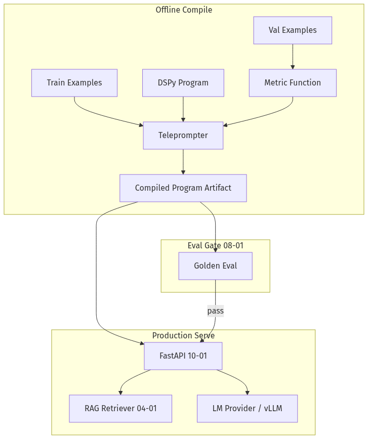
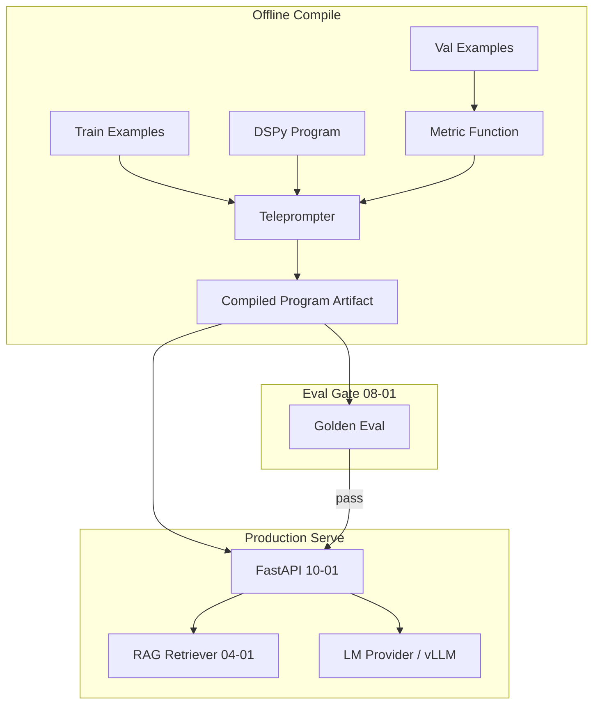
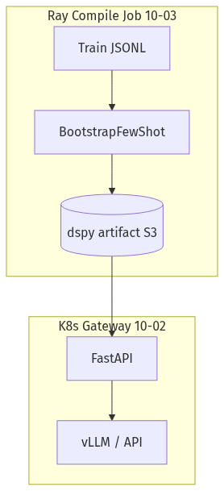
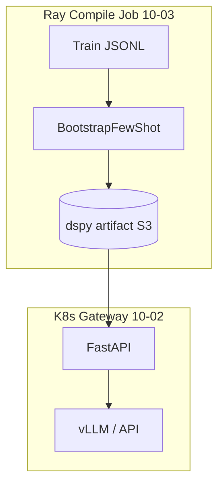
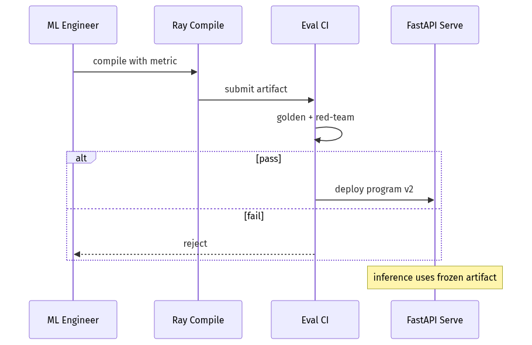
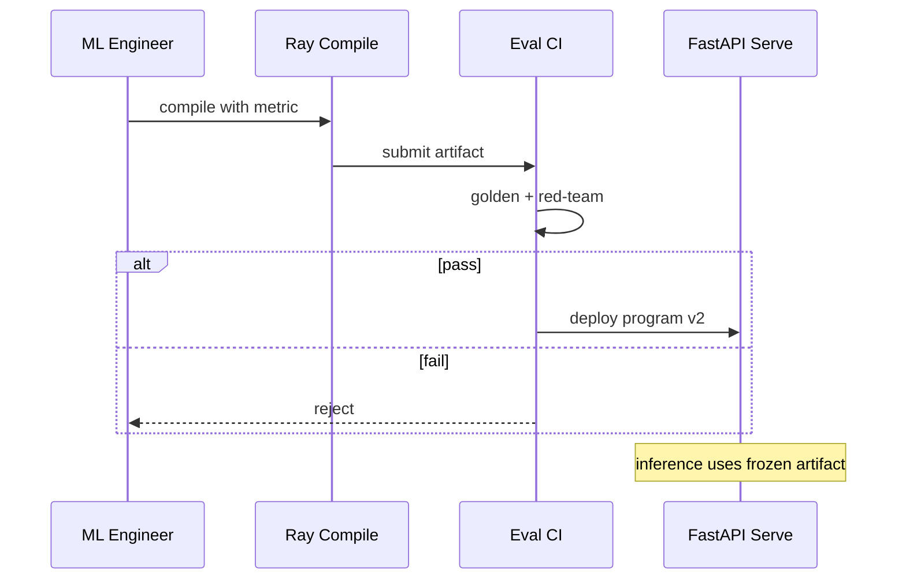

# 12-04 — DSPy: Programmatic Prompting & Optimization

| Meta | Value |
|------|-------|
| **Estimated Time** | 6–7 hours (read 2.5h · lab 3h · optimizer comparison 1h) |
| **Difficulty** | Intermediate (Signatures/Modules) · Advanced (teleprompters, eval metrics, production compile pipelines) |
| **Prerequisites** | [02-01 Production Prompt Engineering](../02-Prompt-Engineering/02-01-Production-Prompt-Engineering.md) · [08-01 Evaluation Lifecycle](../08-Evaluation-LLMOps/08-01-Evaluation-Lifecycle.md) · Python typing |
| **Module** | 12 — Advanced Topics |
| **Related** | [09-02 Prompt vs RAG vs FT](../09-Fine-Tuning/09-02-Prompting-vs-RAG-vs-FineTuning.md) · [12-03 Self-Improving Agents](12-03-Self-Improving-Agents.md) · [04-01 RAG Architecture](../04-RAG/04-01-RAG-Architecture.md) · [10-02 Docker/K8s CI/CD](../10-Production-Infrastructure/10-02-Docker-Kubernetes-CICD.md) · [Architecture Index](../../Architecture Index.md) |

---

## Learning Objectives

By the end of this chapter you will be able to:

1. Explain **DSPy** as programming with LM-backed modules instead of hand-tuned prompt strings ([DSPy docs](https://dspy.ai/)).
2. Define **Signatures**, **Modules**, **Examples**, and **Metrics** for NovaCart tasks.
3. Run **teleprompters** (e.g., BootstrapFewShot, MIPRO) to optimize prompts offline.
4. Integrate DSPy programs with **RAG retrievers** and **FastAPI serving** ([04-01](../04-RAG/04-01-RAG-Architecture.md), [10-01](../10-Production-Infrastructure/10-01-FastAPI-AI-Backends.md)).
5. Promote compiled programs through **eval gates** like fine-tunes ([08-01](../08-Evaluation-LLMOps/08-01-Evaluation-Lifecycle.md)).
6. Decide **DSPy vs LoRA vs manual prompts** using [09-02](../09-Fine-Tuning/09-02-Prompting-vs-RAG-vs-FineTuning.md).

**References:** [https://dspy.ai/](https://dspy.ai/) · [https://github.com/stanfordnlp/dspy](https://github.com/stanfordnlp/dspy)

---

## Why This Topic Matters

Hand-written prompts **rot**:

- model upgrades break magic wording,
- few-shot examples drift from production distribution,
- teams A/B by Slack guesses.

**DSPy** treats prompts as **compile targets**: you declare input/output behavior (Signature), compose Modules (ChainOfThought, Retrieve), define a **metric**, and let optimizers search over demonstrations and instructions.

For Staff engineers, DSPy is the bridge between **prompt engineering** and **ML engineering** — without jumping to LoRA on day one ([09-01](../09-Fine-Tuning/09-01-PEFT-LoRA-QLoRA.md)).

Connect to self-improvement loops: [12-03](12-03-Self-Improving-Agents.md).

---

## Business Impact

| Outcome | DSPy delivers |
|---------|---------------|
| **Higher task accuracy** | Optimized few-shot on golden set |
| **Maintainability** | Version compiled programs, not prose |
| **Cost** | Shorter effective prompts vs manual bloat |
| **Speed to iterate** | Recompile when model changes |

---

## Architecture Overview





---

## Core Concepts

### 1) Signatures — Typed I/O Contract

```python
import dspy

class SupportAnswer(dspy.Signature):
    """Answer NovaCart support questions using policy context only."""
    policy_context: str = dspy.InputField()
    customer_question: str = dspy.InputField()
    answer: str = dspy.OutputField(desc="warm, concise, cites policy IDs")
```

Replaces fragile "Return JSON with..." prose in comments.

---

### 2) Modules — Composable LM Logic

| Module | Use |
|--------|-----|
| `dspy.Predict` | Single step |
| `dspy.ChainOfThought` | Reason then answer |
| `dspy.Retrieve` | Hook to retriever |
| Custom `dspy.Module` | RAG + generate pipeline |

---

### 3) Metrics — What "Better" Means

```python
def grounded_metric(example, pred, trace=None) -> float:
    if example.expected_policy_id not in pred.answer:
        return 0.0
    if len(pred.answer) > 600:
        return 0.5
    return 1.0
```

Multi-metric composites for safety + brevity ([08-01](../08-Evaluation-LLMOps/08-01-Evaluation-Lifecycle.md)).

---

### 4) Teleprompters — Optimizers

| Optimizer | Idea |
|-----------|------|
| **BootstrapFewShot** | Search demo sets |
| **MIPROv2** | Instruction + demo joint search |
| **COPRO** | Coordinate prompt ops |

Compile on **train**; validate on **val** — never optimize on test.

---

### 5) DSPy vs LoRA ([09-02](../09-Fine-Tuning/09-02-Prompting-vs-RAG-vs-FineTuning.md))

| | DSPy | LoRA |
|---|------|------|
| Changes | Prompt/demo bytes | Weights |
| Cost | Compile LM calls | GPU train |
| Best for | Task format, reasoning demos | Stable tone/format in weights |
| Model switch | Recompile | May retrain |

Often: **DSPy + RAG first**; LoRA if inference must drop long demos.

---

### 6) Production Serving

Serialize compiled program (`dspy.save` / JSON state); load in FastAPI worker; pin LM to [01-03 vLLM](../01-LLM-Engineering/01-03-Inference-Serving-vLLM.md) or API.

---

## Implementation

### NovaCart RAG + DSPy program

```python
"""NovaCart support program with DSPy — train compile + inference.

pip install dspy-ai openai
export OPENAI_API_KEY=...

Docs: https://dspy.ai/
GitHub: https://github.com/stanfordnlp/dspy
"""

from __future__ import annotations

import json
from pathlib import Path

import dspy
from dspy.teleprompt import BootstrapFewShot


# Configure LM — use dspy.LM for multi-provider
lm = dspy.LM(model="openai/gpt-4o-mini")
dspy.configure(lm=lm)


class SupportSignature(dspy.Signature):
    """Answer using ONLY policy_context. Cite policy IDs like [POL-001]."""
    policy_context: str = dspy.InputField()
    question: str = dspy.InputField()
    answer: str = dspy.OutputField()


class NovaCartSupportRAG(dspy.Module):
    def __init__(self, retriever_fn):
        super().__init__()
        self.retrieve = retriever_fn
        self.generate = dspy.ChainOfThought(SupportSignature)

    def forward(self, question: str) -> dspy.Prediction:
        passages = self.retrieve(question)
        context = "\n".join(f"[{p['id']}] {p['text']}" for p in passages)
        return self.generate(policy_context=context, question=question)


def stub_retriever(question: str) -> list[dict]:
    return [
        {
            "id": "POL-001",
            "text": "Physical goods returns accepted within 30 days of delivery.",
        }
    ]


def metric(example: dspy.Example, pred, trace=None) -> float:
    ans = pred.answer or ""
    if example.expected_id not in ans:
        return 0.0
    if "30 days" not in ans:
        return 0.3
    return 1.0


def build_trainset() -> list[dspy.Example]:
    return [
        dspy.Example(
            question="Can I return a shirt after 20 days?",
            expected_id="POL-001",
        ).with_inputs("question"),
        dspy.Example(
            question="What is the return window for physical goods?",
            expected_id="POL-001",
        ).with_inputs("question"),
    ]


def compile_program(out_dir: Path) -> NovaCartSupportRAG:
    program = NovaCartSupportRAG(retriever_fn=stub_retriever)
    trainset = build_trainset()
    teleprompter = BootstrapFewShot(metric=metric, max_bootstrapped_demos=3)
    compiled = teleprompter.compile(program, trainset=trainset)
    out_dir.mkdir(parents=True, exist_ok=True)
    compiled.save(str(out_dir / "novacart_support.json"))
    return compiled


def load_program(path: Path) -> NovaCartSupportRAG:
    program = NovaCartSupportRAG(retriever_fn=stub_retriever)
    program.load(str(path))
    return program


if __name__ == "__main__":
    artifact_dir = Path("./artifacts/dspy")
    prog = compile_program(artifact_dir)
    pred = prog(question="Is 25 days OK for a return?")
    print(pred.answer)
```

### FastAPI integration

```python
from pathlib import Path
from fastapi import FastAPI
from pydantic import BaseModel

# Import load_program from above module
app = FastAPI()
PROGRAM = load_program(Path("./artifacts/dspy/novacart_support.json"))


class AskRequest(BaseModel):
    question: str


class AskResponse(BaseModel):
    answer: str
    program_version: str = "novacart_support_v1"


@app.post("/v1/dspy/support")
def ask(body: AskRequest) -> AskResponse:
    pred = PROGRAM(question=body.question)
    return AskResponse(answer=pred.answer or "")
```

Wire real retriever from [04-01](../04-RAG/04-01-RAG-Architecture.md). Promote via CI [10-02](../10-Production-Infrastructure/10-02-Docker-Kubernetes-CICD.md).

---

## Production Considerations

| Concern | Practice |
|---------|----------|
| Compile cost | Run offline in Ray job ([10-03](../10-Production-Infrastructure/10-03-Redis-Kafka-Ray.md)) |
| LM pin | Same model at compile and serve |
| Artifact versioning | Hash JSON in registry |
| Recompile trigger | Model upgrade, eval drift |

---

## Security

Optimized demos must not include **secrets** from train logs. Red-team after compile ([11-02](../11-Security-Safety/11-02-Prompt-Injection-Defense.md)).

---

## Performance

ChainOfThought adds tokens — use Predict for latency-sensitive routes ([10-04](../10-Production-Infrastructure/10-04-Cost-Latency-Optimization.md)).

---

## Cost

Compile spends LM calls once; amortize over traffic. Cheaper than bad manual prompt 200-shot every request.

---

## Scalability

Stateless FastAPI + loaded program; compile farm separate from serve tier.

---

## Failure Modes

| Failure | Mitigation |
|---------|------------|
| Overfit trainset | Hold-out val + golden CI |
| Wrong LM at serve | Config enforcement |
| Huge compiled demos | Cap demo count |
| Metric gaming | Composite metrics |

---

## Observability

Log `program_version`, `lm_model`, `metric_score_offline`, trace IDs.

---

## Debugging

| Symptom | Fix |
|---------|-----|
| Compile low score | More/better train examples |
| Serve mismatch | LM config diff |
| RAG ignored | Metric must penalize missing cites |

---

## Common Mistakes

1. Optimizing on **test set**.
2. No **metric** — bootstrap random demos.
3. Skipping **recompile** after model upgrade.
4. DSPy when **LoRA tone** needed ([09-01](../09-Fine-Tuning/09-01-PEFT-LoRA-QLoRA.md)).
5. Storing compile artifacts unversioned.

---

## Tradeoffs

| vs Manual prompt | vs LoRA |
|------------------|---------|
| Reproducible compile | Faster inference at scale for tone |
| Learning curve | Weight change risk |
| LM-call compile cost | GPU train cost |

---

## Architecture Diagram





---

## Mermaid Diagram — Sequence





---

## Production Examples

| Use | DSPy role |
|-----|-----------|
| Support Q&A | RAG + optimized demos |
| Classification | Predict + metric |
| Extraction | Typed signatures |

---

## Real Companies Using It (Public Patterns)

| Org | Pattern |
|-----|---------|
| **Stanford NLP** | DSPy open source |
| **Enterprise ML teams** | Compile pipelines in CI |
| **Research labs** | Teleprompter ablations |

---

## Hands-on Labs

### Lab A — Signature + Predict (45 min)

Build SupportSignature; run without optimizer.

### Lab B — BootstrapFewShot (90 min)

Compile on 8 examples; measure metric lift on val.

### Lab C — FastAPI (45 min)

Serve compiled artifact via `/v1/dspy/support`.

---

## Coding Assignments

1. Swap retriever for [04-01](../04-RAG/04-01-RAG-Architecture.md) FastAPI client.
2. Multi-metric: grounded + injection refusal score.
3. CI step: compile + eval threshold ([08-01](../08-Evaluation-LLMOps/08-01-Evaluation-Lifecycle.md)).

---

## Mini Project

**Title:** NovaCart DSPy Support v0  
**Done when:** compiled artifact + metric report + inference CLI.

---

## Production Project

**Title:** DSPy Compile Pipeline  
**Done when:** Ray compile job + registry + eval gate + K8s deploy ([10-02](../10-Production-Infrastructure/10-02-Docker-Kubernetes-CICD.md)).

---

## Stretch Project

Compare MIPROv2 vs BootstrapFewShot vs manual prompt on same golden set ([12-03](12-03-Self-Improving-Agents.md) feedback data).

---

## Interview Questions

### Senior Engineer

1. What is a DSPy Signature?
2. Teleprompter vs hand-written few-shot?
3. Where does metric function fit?

### Staff Engineer

1. DSPy + RAG architecture for NovaCart?
2. When choose DSPy over LoRA ([09-02](../09-Fine-Tuning/09-02-Prompting-vs-RAG-vs-FineTuning.md))?
3. Production compile and deploy pipeline?

### Principal Engineer

1. Org standard for prompt artifacts vs DSPy programs?
2. Model upgrade playbook with recompile?
3. Cost of compile farm vs fine-tune fleet?

### Engineering Manager

1. Skill profile: prompt engineer vs DSPy ML engineer?
2. KPIs for compile program success?
3. Risk of overfitting customer-specific demos?

### Whiteboard

Draw Signature → Module → Metric → Teleprompter → Artifact.

### Follow-ups

- DSPy with local vLLM LM config?
- Combine DSPy compile + LoRA tone adapter?

---

## Revision Notes

- **Program prompts, don't hand-tune forever**.
- Docs: [https://dspy.ai/](https://dspy.ai/) · GitHub: [https://github.com/stanfordnlp/dspy](https://github.com/stanfordnlp/dspy)
- **Eval gate** like fine-tunes ([08-01](../08-Evaluation-LLMOps/08-01-Evaluation-Lifecycle.md)).
- Decision: [09-02](../09-Fine-Tuning/09-02-Prompting-vs-RAG-vs-FineTuning.md).

---

## Summary

DSPy turns prompt engineering into **typed, optimizable programs** with metrics and teleprompters. NovaCart compiles support RAG modules offline, validates on golden and safety evals, and serves versioned artifacts through FastAPI — achieving self-improvement without unsafe online weight updates ([12-03](12-03-Self-Improving-Agents.md)).

---

## Further Reading

| Title | URL | Difficulty | Reading Time | Why Read | Important Sections |
|-------|-----|------------|--------------|----------|--------------------|
| DSPy Documentation | https://dspy.ai/ | Intermediate | 60 min | Official tutorials | Signatures; Modules; Optimizers |
| DSPy GitHub | https://github.com/stanfordnlp/dspy | Intermediate | 30 min | Examples & API | README; tutorials |
| Decision framework | [09-02](../09-Fine-Tuning/09-02-Prompting-vs-RAG-vs-FineTuning.md) | Intermediate | 30 min | DSPy vs FT | Prompt path |
| RAG handbook | [04-01](../04-RAG/04-01-RAG-Architecture.md) | Intermediate | 30 min | Retriever integration | Architecture |
| Eval handbook | [08-01](../08-Evaluation-LLMOps/08-01-Evaluation-Lifecycle.md) | Intermediate | 30 min | Compile gates | Golden sets |
| Self-improving | [12-03](12-03-Self-Improving-Agents.md) | Intermediate | 30 min | Feedback loops | Offline improve |
| FastAPI serve | [10-01](../10-Production-Infrastructure/10-01-FastAPI-AI-Backends.md) | Intermediate | 20 min | HTTP layer | Implementation |
